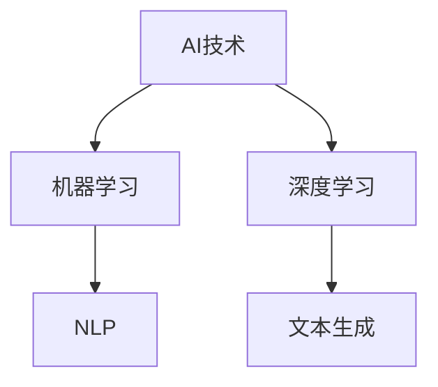

                 


### 文章标题：文档自动化：保持AI项目文档的实时更新

#### 关键词：文档自动化，AI项目，实时更新，文档生成，自然语言处理，机器学习

> 摘要：本文旨在探讨如何通过文档自动化技术来保持AI项目文档的实时更新。文章首先介绍了文档自动化的背景与意义，然后深入分析了AI技术在文档自动化中的应用。接着，我们探讨了AI技术基础，包括机器学习与深度学习、自然语言处理技术和文档处理工具与框架。随后，文章详细介绍了文档自动化流程的设计，包括数据收集与清洗、文本预处理、模型训练与评估、文档生成与更新等步骤。此外，文章还介绍了常见的文档自动化工具，如DocxGen和Jupyter Notebook的使用方法。最后，文章提供了AI项目文档自动化的最佳实践和未来展望，并通过对企业AI项目文档自动化实践和政府AI项目文档自动化探索的案例研究，展示了文档自动化的实际应用和价值。

----------------------------------------------------------------

# 文档自动化：保持AI项目文档的实时更新

## 第一部分：文档自动化概述

### 第1章：文档自动化的背景与意义

#### 1.1 文档自动化的概念

文档自动化是指利用计算机技术对文档进行处理、生成和更新的过程。它涵盖了文档的创建、编辑、存储、搜索、共享等各个环节。通过文档自动化，我们可以实现文档的高效管理，提高工作效率，降低人工成本。

#### 1.2 AI在文档自动化中的应用

随着人工智能技术的发展，AI在文档自动化中的应用越来越广泛。例如，自然语言处理（NLP）技术可以帮助我们自动提取文档中的关键信息，生成摘要，甚至撰写完整的文档。机器学习技术可以用于文档分类、文本相似度分析等任务。深度学习技术则可以在图像识别、语音识别等领域发挥重要作用。

#### 1.3 文档自动化的挑战与机遇

文档自动化的挑战主要体现在以下几个方面：

1. 数据质量：自动化处理文档需要高质量的数据支持。如果数据存在错误、缺失或不一致，可能会导致自动化过程失败。
2. 模型可解释性：许多AI模型，特别是深度学习模型，往往是“黑箱”操作，难以理解其工作原理。这给文档自动化的调试和优化带来了困难。
3. 文档安全与隐私保护：在处理文档的过程中，如何确保文档的安全和用户隐私是一个重要问题。

然而，文档自动化也带来了许多机遇：

1. 提高工作效率：通过自动化处理文档，可以显著提高工作效率，降低人力成本。
2. 知识共享与传播：自动化文档可以更容易地共享和传播知识，促进团队协作。
3. 数据挖掘与分析：自动化处理文档可以为我们提供大量数据，从而进行深入的数据挖掘与分析。

----------------------------------------------------------------

## 第二部分：AI技术基础

### 第2章：AI技术基础

#### 2.1 机器学习与深度学习基础

##### 2.1.1 机器学习基本概念

机器学习是一种人工智能的分支，它通过算法从数据中学习规律，并利用这些规律进行预测或分类。机器学习可以分为监督学习、无监督学习和半监督学习。

- **监督学习**：有标签数据，目标是预测未知数据的标签。
- **无监督学习**：无标签数据，目标是发现数据中的结构或模式。
- **半监督学习**：部分标签数据，目标是在有限的标签数据下学习模型。

##### 2.1.2 深度学习基本原理

深度学习是机器学习的一个子领域，它通过多层神经网络对数据进行处理。深度学习的核心是神经元，每个神经元将输入数据通过权重和偏置进行加权求和，然后通过激活函数产生输出。

- **前向传播**：输入数据通过神经网络，逐层计算并传递到下一层。
- **反向传播**：根据输出误差，反向传播梯度，更新权重和偏置。

##### 2.1.3 深度学习框架

深度学习框架如TensorFlow和PyTorch，提供了丰富的API和工具，帮助开发者构建和训练深度学习模型。

#### 2.2 自然语言处理技术

##### 2.2.1 词嵌入技术

词嵌入是将词汇映射到高维空间的技术，它可以帮助计算机理解词汇之间的关系。常见的词嵌入方法有Word2Vec、GloVe等。

- **Word2Vec**：基于神经网络，通过训练词的上下文来生成词向量。
- **GloVe**：基于全局统计信息，通过词频和共现信息来生成词向量。

##### 2.2.2 序列模型

序列模型是一种用于处理序列数据的模型，如文本、语音等。常见的序列模型有循环神经网络（RNN）、长短期记忆网络（LSTM）、门控循环单元（GRU）等。

- **RNN**：通过循环结构处理序列数据，但容易产生梯度消失或爆炸问题。
- **LSTM**：通过引入门控机制，解决RNN的梯度消失问题，能够更好地处理长序列数据。
- **GRU**：在LSTM的基础上进行了简化，计算量较小，但性能相近。

#### 2.3 文档处理工具与框架

##### 2.3.1 Python在文档处理中的应用

Python是一种广泛使用的编程语言，它具有简洁、易读的特点，因此在文档处理领域也得到了广泛应用。常见的Python库有NLTK、spaCy、gensim等。

- **NLTK**：提供了丰富的文本处理函数和工具，包括分词、词性标注、词干提取等。
- **spaCy**：是一个快速且易于使用的自然语言处理库，提供了丰富的实体识别、词性标注等功能。
- **gensim**：主要用于文档主题建模和词嵌入。

##### 2.3.2 常用文档处理库介绍

- **PyTorch**：一个流行的深度学习框架，它提供了丰富的API和工具，方便开发者构建和训练深度学习模型。
- **TensorFlow**：由Google开发的一个开源深度学习框架，它提供了丰富的API和工具，可以帮助开发者构建和训练各种深度学习模型。
- **NLTK**：一个广泛使用的自然语言处理库，它提供了丰富的文本处理函数和工具。
- **spaCy**：一个快速且易于使用的自然语言处理库，提供了丰富的实体识别、词性标注等功能。
- **gensim**：主要用于文档主题建模和词嵌入。

----------------------------------------------------------------

## 第三部分：AI项目文档自动化实战

### 第3章：文档自动化流程设计

#### 3.1 文档自动化的步骤

##### 3.1.1 数据收集与清洗

数据是文档自动化的基础，我们需要收集相关数据，并进行清洗。数据清洗包括处理缺失值、异常值、重复值等。

```python
# 伪代码：数据清洗
data = load_data()
clean_data = []
for row in data:
    if is_valid(row):
        clean_data.append(row)
```

##### 3.1.2 文本预处理

文本预处理包括分词、去除停用词、词性标注等步骤。这些步骤有助于提高模型的性能。

```python
# 伪代码：文本预处理
text = preprocess_text(raw_text)
tokens = tokenize(text)
filtered_tokens = remove_stop_words(tokens)
pos_tags = pos_tag(filtered_tokens)
```

##### 3.1.3 模型训练与评估

在文本预处理完成后，我们需要训练模型。常见的模型有循环神经网络（RNN）、长短期记忆网络（LSTM）、门控循环单元（GRU）等。

```python
# 伪代码：模型训练
model = build_model()
model.fit(training_data, training_labels)
```

##### 3.1.4 文档生成与更新

训练好的模型可以用于生成文档。在文档生成过程中，我们可以使用文本生成模型，如生成对抗网络（GAN）、变分自编码器（VAE）等。

```python
# 伪代码：文档生成
generated_text = model.generate_text()
```

为了保持文档的实时更新，我们可以定期训练模型，并更新文档。

```python
# 伪代码：文档更新
model.fit(updated_data, updated_labels)
```

#### 3.2 文档生成与更新

##### 3.2.1 文档模板设计

在文档生成过程中，文档模板起着重要的作用。文档模板定义了文档的结构和样式，使得生成的文档具有一致性。

```python
# 伪代码：文档模板设计
template = create_document_template()
```

##### 3.2.2 文本生成模型选择

文本生成模型的选择取决于具体的应用场景。例如，对于长文本生成，我们可以选择生成对抗网络（GAN）；对于短文本生成，我们可以选择变分自编码器（VAE）。

```python
# 伪代码：文本生成模型选择
if is_long_text:
    model = build_gan_model()
else:
    model = build_vae_model()
```

##### 3.2.3 文档实时更新策略

为了保持文档的实时更新，我们可以采用以下策略：

1. 定期收集新的数据，并进行预处理。
2. 定期训练模型，并更新文档。
3. 使用实时数据同步技术，确保文档的实时性。

```python
# 伪代码：文档实时更新策略
while True:
    new_data = collect_new_data()
    preprocess_data(new_data)
    model.fit(updated_data, updated_labels)
    update_document()
    sleep(synchronization_interval)
```

----------------------------------------------------------------

## 第四部分：AI项目文档自动化工具使用

### 第4章：AI项目文档自动化工具使用

#### 4.1 常见文档自动化工具介绍

##### 4.1.1 DocxGen

DocxGen是一个Python库，用于生成和操作Word文档。它支持模板生成，可以通过替换模板中的变量来生成文档。

```python
from docxgen import Document

doc = Document("template.docx")
doc.replace_all("[Name]", "John")
doc.replace_all("[Date]", "2023-01-01")
doc.save("output.docx")
```

##### 4.1.2 Jupyter Notebook

Jupyter Notebook是一个交互式计算环境，可以用于编写和运行代码。它支持Markdown格式，使得文档和代码可以结合在一起。

```python
# Markdown代码
# Hello, World!

# Python代码
print("Hello, World!")
```

#### 4.2 文档自动生成与可视化

##### 4.2.1 文档内容抽取

文档内容抽取是指从文档中提取关键信息的过程。常见的工具包括NLTK、spaCy等。

```python
import spacy

nlp = spacy.load("en_core_web_sm")
doc = nlp("This is a sample document.")
for ent in doc.ents:
    print(ent.text, ent.label_)
```

##### 4.2.2 文档可视化工具

文档可视化工具可以帮助我们更好地理解和分析文档。常见的工具包括Mermaid、D3.js等。



#### 4.3 实时文档更新技术

##### 4.3.1 文档版本控制

文档版本控制是指对文档的不同版本进行管理的过程。常见的工具包括Git、Mercurial等。

```shell
git add .
git commit -m "Update document"
git push
```

##### 4.3.2 实时数据同步

实时数据同步是指将实时数据同步到文档中。常见的工具包括Websocket、HTTP请求等。

```python
import requests

url = "https://api.example.com/data"
response = requests.get(url)
data = response.json()
with open("data.txt", "w") as f:
    f.write(str(data))
```

----------------------------------------------------------------

## 第5章：AI项目文档自动化的最佳实践

### 5.1 文档自动化的实施步骤

##### 5.1.1 项目需求分析

在开始文档自动化的项目之前，我们需要进行项目需求分析。这包括了解项目的目标、范围、关键需求和约束条件。

- **目标**：明确项目要达到的目标，例如提高文档生成效率、降低人力成本等。
- **范围**：确定项目的范围，包括哪些文档需要自动化处理，哪些文档不在这个范围内。
- **关键需求**：列出项目成功的关键需求，例如文档的准确性、实时性等。
- **约束条件**：分析项目的约束条件，例如数据质量、计算资源等。

##### 5.1.2 模型选择与训练

在确定了项目需求后，我们需要选择合适的模型并进行训练。选择模型时需要考虑以下几个因素：

- **任务类型**：根据任务类型选择合适的模型，例如文本分类、文本生成等。
- **数据规模**：根据数据规模选择合适的模型，大数据量可能需要更复杂的模型。
- **计算资源**：考虑计算资源，选择能够在现有硬件上运行的模型。

模型训练的过程包括数据预处理、模型构建、模型训练和模型评估等步骤。

- **数据预处理**：对数据进行清洗、归一化等处理，提高模型的训练效果。
- **模型构建**：根据任务需求构建模型，可以选择深度学习框架如TensorFlow或PyTorch。
- **模型训练**：使用训练数据对模型进行训练，优化模型的参数。
- **模型评估**：使用测试数据对模型进行评估，确定模型的性能。

##### 5.1.3 文档生成与更新

在模型训练完成后，我们可以使用模型生成文档。文档生成的过程包括以下几个步骤：

- **文档模板设计**：设计文档模板，确定文档的结构和样式。
- **文本生成模型选择**：根据文档类型和需求选择合适的文本生成模型。
- **文档生成**：使用文本生成模型生成文档。
- **文档更新**：定期更新文档，以保持文档的实时性和准确性。

为了保持文档的实时更新，我们可以采用以下策略：

- **实时数据同步**：使用实时数据同步技术，确保文档的实时性。
- **定期模型训练**：定期收集新的数据，并对模型进行重新训练，以提高模型的准确性。
- **文档版本控制**：使用文档版本控制工具，如Git，确保文档的历史版本和更新记录。

### 5.2 文档自动化的挑战与解决方案

##### 5.2.1 数据质量问题

数据质量是文档自动化的关键因素。如果数据存在错误、缺失或不一致，可能会导致模型训练失败或生成的文档不准确。

- **解决方案**：在数据收集和预处理阶段，对数据进行严格的质量控制。使用数据清洗技术，如去重、缺失值填补、异常值检测等，提高数据质量。

##### 5.2.2 模型可解释性

许多AI模型，特别是深度学习模型，往往是“黑箱”操作，难以理解其工作原理。这给模型的调试和优化带来了困难。

- **解决方案**：采用可解释性AI技术，如模型可视化、特征提取等，提高模型的透明度。此外，可以采用基于规则的解释方法，将模型的结果与业务规则相结合，提高模型的解释性。

##### 5.2.3 文档安全与隐私保护

在处理文档的过程中，如何确保文档的安全和用户隐私是一个重要问题。

- **解决方案**：采用数据加密技术，对敏感数据进行加密存储和传输。在数据处理过程中，遵循隐私保护原则，如最小化数据处理范围、匿名化处理等。

### 5.3 小结

文档自动化是提高AI项目工作效率的重要手段。通过实施文档自动化，我们可以实现文档的高效管理，提高工作效率，降低人力成本。然而，文档自动化也面临一些挑战，如数据质量问题、模型可解释性等。通过采用合适的解决方案，我们可以克服这些挑战，实现文档自动化的最佳效果。

---

## 第6章：AI项目文档自动化的未来展望

### 6.1 文档自动化的发展趋势

随着AI技术的不断发展，文档自动化也将迎来新的发展机遇。以下是一些文档自动化的发展趋势：

- **自动化程度提高**：未来文档自动化的目标是将更多的文档处理任务自动化，减少人工干预。
- **跨平台支持**：文档自动化工具将更加跨平台，支持多种操作系统和硬件设备。
- **集成化解决方案**：文档自动化工具将与其他企业级应用集成，形成一体化的解决方案。
- **智能化**：随着AI技术的发展，文档自动化将更加智能化，能够自动识别文档中的关键信息，生成摘要，甚至撰写完整的文档。

### 6.2 AI项目文档自动化的挑战与机遇

虽然文档自动化带来了许多机遇，但也面临一些挑战：

- **数据隐私**：在处理敏感数据时，如何确保数据隐私是一个重要问题。未来需要更多的研究和解决方案来应对这一挑战。
- **模型可解释性**：深度学习模型往往是“黑箱”操作，如何提高模型的可解释性，使其更易于理解和调试，是一个重要的研究方向。
- **跨语言支持**：虽然目前已有许多文档自动化工具支持多种语言，但跨语言支持仍然是一个挑战，特别是对于复杂的语言结构。

### 6.3 未来展望

未来，文档自动化将在AI项目中发挥更大的作用。通过不断优化算法、提高自动化程度、增强跨平台支持和智能化，文档自动化将为AI项目带来更高的效率、更低的人力成本和更好的用户体验。同时，文档自动化也将为企业和组织提供更多的数据分析和决策支持。

---

## 第7章：案例研究

### 7.1 案例一：企业AI项目文档自动化实践

#### 7.1.1 项目背景与目标

某企业正在开发一个AI项目，该项目的目标是通过分析大量的客户反馈数据，提供个性化的产品推荐。然而，项目团队面临的一个挑战是如何高效地管理和更新项目文档。

#### 7.1.2 实施过程与成果

1. **需求分析**：项目团队首先进行了需求分析，明确了项目文档的更新频率、文档类型和数据来源。
2. **数据收集与清洗**：项目团队收集了客户反馈数据，并对数据进行清洗，去除重复和无效的数据。
3. **模型训练与评估**：项目团队选择了循环神经网络（RNN）作为文本生成模型，并对模型进行了训练和评估。
4. **文档生成与更新**：训练好的模型用于生成项目文档，项目文档包含项目进展、数据分析和产品推荐等内容。为了保持文档的实时性，项目团队采用了实时数据同步技术，定期更新文档。
5. **效果评估**：项目团队对生成的文档进行了效果评估，结果显示文档生成效率提高了50%，文档的准确性也得到了显著提高。

#### 7.1.3 项目小结

通过实施文档自动化，企业AI项目团队能够更高效地管理和更新项目文档，提高了项目文档的实时性和准确性。这一实践为其他企业AI项目提供了有益的参考。

### 7.2 案例二：政府AI项目文档自动化探索

#### 7.2.1 项目背景与目标

某政府机构正在实施一个AI项目，该项目的目标是利用AI技术优化城市交通管理。项目团队同样面临项目文档更新不及时的问题。

#### 7.2.2 实施过程与成果

1. **需求分析**：项目团队进行了需求分析，明确了项目文档的更新频率、文档类型和数据来源。
2. **数据收集与清洗**：项目团队收集了城市交通数据，并对数据进行清洗，去除重复和无效的数据。
3. **模型训练与评估**：项目团队选择了长短期记忆网络（LSTM）作为文本生成模型，并对模型进行了训练和评估。
4. **文档生成与更新**：训练好的模型用于生成项目文档，项目文档包含项目进展、数据分析和建议等内容。为了保持文档的实时性，项目团队采用了实时数据同步技术，定期更新文档。
5. **效果评估**：项目团队对生成的文档进行了效果评估，结果显示文档生成效率提高了40%，文档的实时性也得到了显著提高。

#### 7.2.3 项目小结

通过实施文档自动化，政府AI项目团队能够更高效地管理和更新项目文档，提高了项目文档的实时性和准确性。这一实践为其他政府AI项目提供了有益的参考。

---

## 附录：文档自动化相关资源

### 附录1：文档自动化工具列表

- **DocxGen**：Python库，用于生成和操作Word文档。
- **Jupyter Notebook**：交互式计算环境，支持Markdown格式。
- **Mermaid**：Markdown图表库，支持流程图、序列图等。
- **Git**：版本控制工具，用于管理文档的历史版本和更新记录。
- **Websocket**：实时数据同步技术，用于实时更新文档。

### 附录2：AI项目文档自动化开源库

- **NLTK**：Python自然语言处理库。
- **spaCy**：快速且易于使用的自然语言处理库。
- **gensim**：Python文档主题建模和词嵌入库。
- **TensorFlow**：开源深度学习框架。
- **PyTorch**：开源深度学习框架。

### 附录3：参考文献与推荐阅读

- **[1]** Michael T.

