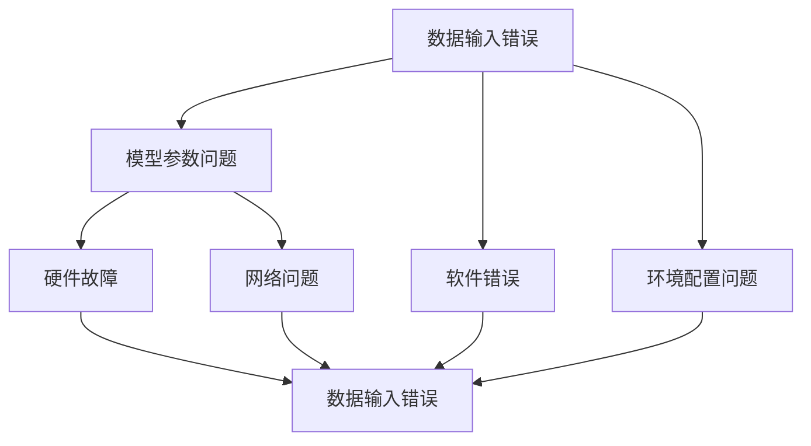
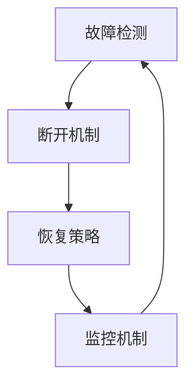
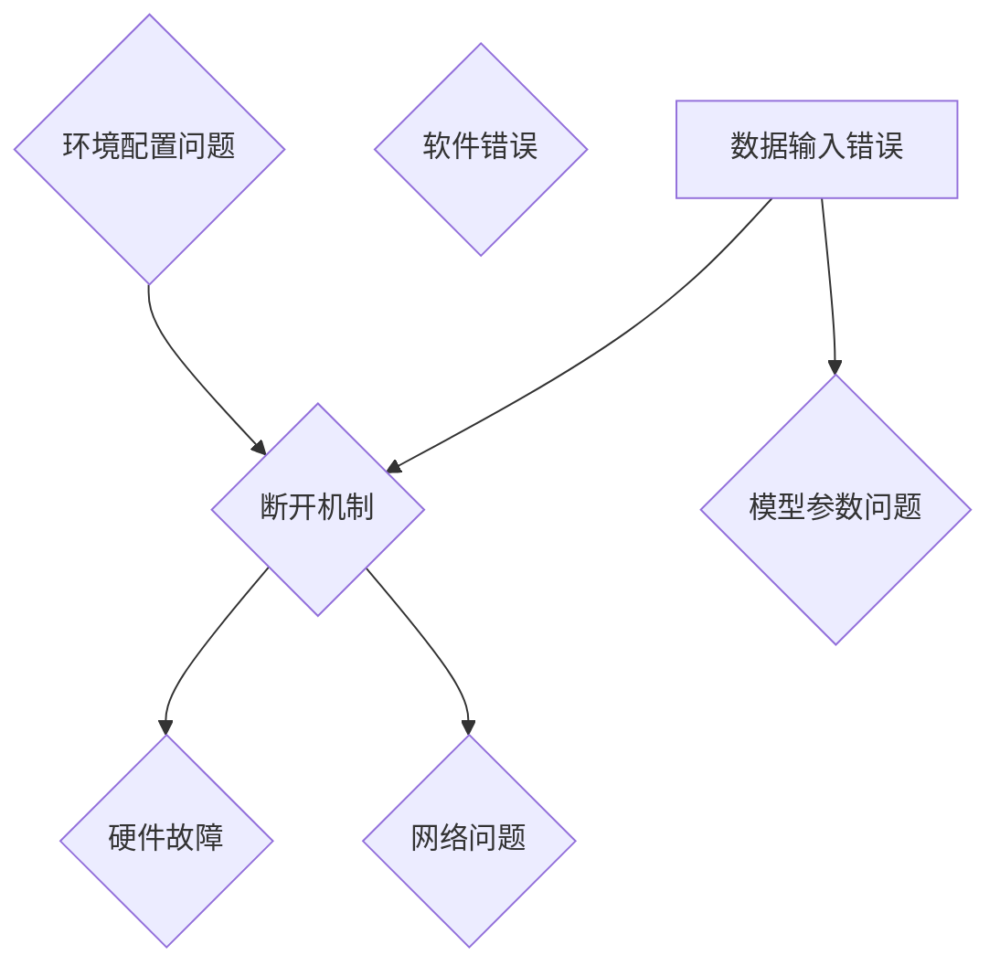
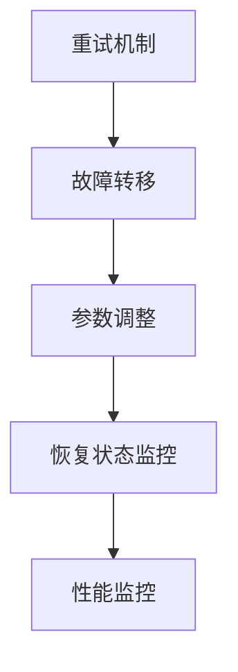

                 

### 第一部分：背景与核心概念

#### 第2章：LLM应用中的故障类型

**2.1 数据输入错误**

在LLM应用中，数据输入错误是一个常见且严重的问题。数据输入错误可能源于多种原因，包括数据源的不一致性、数据格式的错误以及数据清洗过程的疏漏等。例如，当用户输入一段文本请求时，如果文本中包含非法字符或者格式错误，LLM模型在解析和处理这些数据时可能会遇到困难，导致模型输出错误或者无法正常工作。

**2.2 模型参数问题**

LLM模型的参数是模型性能的关键因素。模型参数问题通常包括参数设置不当、参数更新不及时或者参数优化过程中的故障等。例如，在训练模型时，如果参数设置过于保守或者过于激进，可能会导致模型无法收敛到最佳状态，从而影响模型的准确性和效率。

**2.3 硬件故障与网络问题**

硬件故障和网络问题是影响LLM应用稳定性的重要因素。硬件故障可能包括GPU计算错误、内存故障等，而网络问题可能包括网络延迟、连接中断等。例如，在分布式训练过程中，如果某个计算节点发生硬件故障，可能会导致整个训练任务失败。同样，网络连接问题也可能导致模型在训练和推理过程中无法访问必要的资源，从而影响模型的性能。

**2.4 其他故障类型**

除了上述故障类型，LLM应用中还可能遇到其他类型的故障，如软件错误、环境配置问题等。软件错误可能包括代码逻辑错误、依赖库冲突等，而环境配置问题可能包括环境变量设置错误、依赖库版本不兼容等。这些问题虽然不如数据输入错误和硬件故障常见，但同样会对LLM应用的稳定性造成影响。

**故障类型之间的联系与影响**

LLM应用中的各种故障类型之间存在密切的联系和相互影响。例如，数据输入错误可能导致模型参数问题，进而引发硬件故障或网络问题。同样，硬件故障和网络问题也可能导致数据输入错误或模型参数问题。这些故障类型的综合作用会严重影响LLM应用的性能和稳定性。

为了更好地理解和应对这些故障类型，我们可以使用Mermaid流程图来描述它们之间的联系和影响：



通过上述分析，我们可以看到LLM应用中的故障类型及其相互关系。在接下来的章节中，我们将详细探讨如何通过断路器模式来检测和恢复这些故障，确保LLM应用的稳定性和可靠性。### 核心概念与联系

在LLM应用中，故障类型及其相互影响可以通过以下核心概念与联系来概括：

1. **故障检测**：故障检测是断路器模式的基础。通过监控输入数据、模型参数、硬件状态和网络连接等关键指标，系统可以及时发现故障。例如，可以使用滑动窗口统计方法来监控数据输入错误率，或者使用阈值方法来检测模型参数是否超出正常范围。

2. **断开机制**：当检测到故障时，断开机制会自动切断故障组件，防止故障扩散。断开机制通常包括以下步骤：
   - **触发断开**：当某个指标超过预设阈值时，系统会触发断开操作。
   - **断开连接**：断开与故障组件的所有连接，以隔离故障。
   - **记录故障信息**：记录故障的时间、类型和影响范围，为后续故障分析和恢复提供依据。

3. **恢复策略**：断开故障组件后，恢复策略会尝试恢复系统。恢复策略包括：
   - **重试机制**：在故障组件恢复前，系统会重试失败的请求，以提高故障恢复的成功率。
   - **故障转移**：如果故障组件无法恢复，系统会切换到备用组件，确保服务的连续性。
   - **参数调整**：根据故障类型，系统可能会调整模型参数，以提高模型的鲁棒性和适应性。

4. **监控机制**：在故障恢复过程中，监控机制持续监控系统的状态，确保故障完全解决。监控机制包括：
   - **恢复状态监控**：持续监控故障组件的恢复进度，确保故障被完全解决。
   - **性能监控**：在故障恢复后，监控系统的性能，确保故障没有对系统产生长期影响。

这些核心概念之间的联系可以用以下Mermaid流程图来表示：



**故障类型之间的相互影响**：
- **数据输入错误**可能导致模型参数问题和硬件故障，进而引发网络问题。
- **模型参数问题**可能导致数据输入错误和硬件故障，增加系统的负担。
- **硬件故障**和网络问题可能加重数据输入错误和模型参数问题，导致系统崩溃。

**故障检测与断开机制**：
故障检测与断开机制的关系如图所示：



**恢复策略与监控机制**：
恢复策略与监控机制的关系如图所示：



通过这些核心概念与联系，我们可以更好地理解和应用断路器模式，确保LLM应用在复杂环境中保持稳定性和可靠性。在下一部分中，我们将详细讨论断路器模式的实现细节，帮助读者掌握如何在实际应用中部署这一机制。### 核心算法原理讲解

断路器模式是一种在复杂系统设计中用于增强故障恢复能力的机制。其核心算法原理主要包括故障检测、断开机制、恢复策略和监控机制。以下将使用伪代码详细阐述这些核心算法原理。

**1. 故障检测算法**

故障检测是断路器模式的基础。以下是故障检测的伪代码：

```python
def detect_fault():
    # 初始化监控指标
    metrics = initialize_metrics()

    # 检查输入数据
    if is_data_input_error(data):
        log_fault("Input Data Error")
        return True

    # 检查模型参数
    if is_model_param_error(model_params):
        log_fault("Model Param Error")
        return True

    # 检查硬件状态
    if is_hardware_fault(hardware_status):
        log_fault("Hardware Fault")
        return True

    # 检查网络连接
    if is_network_fault(network_status):
        log_fault("Network Fault")
        return True

    # 检查其他故障类型
    if is_other_fault():
        log_fault("Other Fault")
        return True

    return False
```

其中，`initialize_metrics()` 用于初始化监控指标，`is_data_input_error(data)`、`is_model_param_error(model_params)`、`is_hardware_fault(hardware_status)` 和 `is_network_fault(network_status)` 分别用于检查数据输入、模型参数、硬件状态和网络连接是否出现故障。`log_fault()` 用于记录故障信息。

**2. 断开机制算法**

当故障检测算法发现故障时，断开机制会自动切断故障组件。以下是断开机制的伪代码：

```python
def open_circuit(fault_type):
    # 记录故障信息
    log_fault(fault_type)

    # 切断故障组件
    disconnect_component(fault_type)

    # 更新故障状态
    update_fault_state(fault_type, "open")

def disconnect_component(fault_type):
    if fault_type == "Input Data Error":
        # 断开与数据输入相关的连接
        disconnect_input()
    elif fault_type == "Model Param Error":
        # 断开与模型参数相关的连接
        disconnect_model_params()
    elif fault_type == "Hardware Fault":
        # 断开与硬件状态相关的连接
        disconnect_hardware()
    elif fault_type == "Network Fault":
        # 断开与网络连接相关的连接
        disconnect_network()
    else:
        # 断开与所有组件的连接
        disconnect_all()
```

**3. 恢复策略算法**

断开故障组件后，恢复策略会尝试恢复系统。以下是恢复策略的伪代码：

```python
def recover_fault():
    # 重试机制
    if should_retry():
        retry_request()
    
    # 故障转移
    if should_transfer_fault():
        transfer_fault_to_backup()

    # 参数调整
    adjust_model_params()

    # 更新故障状态
    update_fault_state("recovered")
```

其中，`should_retry()` 用于判断是否应该重试请求，`retry_request()` 用于重试请求，`should_transfer_fault()` 用于判断是否应该进行故障转移，`transfer_fault_to_backup()` 用于切换到备用组件，`adjust_model_params()` 用于调整模型参数。

**4. 监控机制算法**

在故障恢复过程中，监控机制会持续监控系统的状态，确保故障被完全解决。以下是监控机制的伪代码：

```python
def monitor_fault_recovery():
    # 持续监控故障组件的恢复进度
    while not is_fault_recovered():
        check_recovery_progress()

    # 监控系统性能
    monitor_system_performance()
```

其中，`is_fault_recovered()` 用于判断故障是否已恢复，`check_recovery_progress()` 用于检查恢复进度，`monitor_system_performance()` 用于监控系统性能。

通过上述伪代码，我们可以看到断路器模式的核心算法原理。这些算法实现了故障检测、断开机制、恢复策略和监控机制，确保LLM应用在复杂环境中保持稳定性和可靠性。在下一部分中，我们将探讨如何实现这些算法，并通过实际项目实战来验证其效果。### 数学模型和数学公式

断路器模式中的故障检测、断开机制、恢复策略和监控机制都涉及数学模型和数学公式的应用，以下将详细阐述这些模型和公式，并举例说明。

**1. 故障检测模型**

故障检测模型通常使用阈值方法来检测故障。假设我们有如下故障检测指标：响应时间（Response Time, RT）、错误率（Error Rate, ER）和资源使用率（Resource Utilization, RU）。我们使用如下阈值来检测故障：

$$
\begin{aligned}
&\text{RT}_{\text{threshold}} = \text{average\_rt} + 2 \times \text{stddev\_rt} \\
&\text{ER}_{\text{threshold}} = \text{max\_allowed\_er} \\
&\text{RU}_{\text{threshold}} = \text{max\_allowed\_ru}
\end{aligned}
$$

其中，$\text{average\_rt}$ 是响应时间的平均值，$\text{stddev\_rt}$ 是响应时间的标准差，$\text{max\_allowed\_er}$ 是允许的最大错误率，$\text{max\_allowed\_ru}$ 是允许的最大资源使用率。

举例说明：

假设某次测量的响应时间为500ms，标准差为50ms，允许的最大错误率为0.01，最大资源使用率为90%。计算得到的阈值如下：

$$
\begin{aligned}
&\text{RT}_{\text{threshold}} = 500 + 2 \times 50 = 600 \text{ms} \\
&\text{ER}_{\text{threshold}} = 0.01 \\
&\text{RU}_{\text{threshold}} = 90\%
\end{aligned}
$$

如果测量的响应时间超过600ms，错误率超过0.01，或资源使用率超过90%，则认为系统出现故障。

**2. 断开机制模型**

断开机制的数学模型主要涉及故障持续时间（Fault Duration, FD）和故障恢复时间（Fault Recovery Time, FRT）的计算。假设故障持续时间服从指数分布，故障恢复时间服从均匀分布，我们有如下模型：

$$
\begin{aligned}
&\text{FD} \sim \text{Exp}(\lambda) \\
&\text{FRT} \sim \text{Uni}(\text{min\_frt}, \text{max\_frt})
\end{aligned}
$$

其中，$\text{Exp}(\lambda)$ 表示指数分布，$\text{Uni}(\text{min\_frt}, \text{max\_frt})$ 表示均匀分布。

举例说明：

假设故障持续时间的平均值为10分钟，故障恢复时间的最小值为5分钟，最大值为15分钟。根据上述模型，我们可以计算故障持续时间和故障恢复时间的概率分布。

**3. 恢复策略模型**

恢复策略的数学模型主要涉及重试次数（Retry Count, RC）和故障转移策略（Fault Transfer Strategy, FTS）的计算。假设重试次数服从泊松分布，故障转移策略基于故障发生的时间和频率：

$$
\text{RC} \sim \text{Pois}(\lambda)
$$

其中，$\text{Pois}(\lambda)$ 表示泊松分布。

举例说明：

假设重试次数的平均值为3次，根据泊松分布，我们可以计算在不同时间点发生故障时的重试次数概率。

**4. 监控机制模型**

监控机制的数学模型主要涉及故障恢复概率（Fault Recovery Probability, FRP）和系统性能指标（System Performance Metrics, SPM）的计算。假设故障恢复概率与故障持续时间相关，系统性能指标与故障恢复概率相关：

$$
\text{FRP} = \frac{\text{FRT}}{\text{FD} + \text{FRT}}
$$

$$
\text{SPM} = f(\text{FRP})
$$

其中，$f(\text{FRP})$ 表示系统性能指标与故障恢复概率的关系函数。

举例说明：

假设故障恢复时间与故障持续时间之比为0.5，系统性能指标与故障恢复概率的关系函数为线性关系，我们可以计算在不同故障恢复概率下的系统性能指标。

通过上述数学模型和公式，我们可以更好地理解和应用断路器模式，确保LLM应用在复杂环境中保持稳定性和可靠性。在下一部分中，我们将通过项目实战来验证这些理论的实际应用效果。### 项目实战

#### 环境搭建与调试

在本文的项目实战部分，我们将搭建一个基于Python的断路器模式实现，用于增强LLM应用的故障恢复能力。首先，我们需要搭建开发环境，并介绍调试技巧和工具。

**1. 开发环境搭建**

要搭建断路器模式实现的环境，我们需要以下工具和库：

- Python（版本3.8及以上）
- TensorFlow 2.x
- Keras
- Pandas
- NumPy
- Matplotlib

首先，确保Python环境已安装。然后，使用pip安装所需的库：

```bash
pip install tensorflow
pip install keras
pip install pandas
pip install numpy
pip install matplotlib
```

接下来，创建一个名为`circuit_breaker_project`的目录，并在该目录下创建一个名为`main.py`的主文件，用于实现断路器模式。

**2. 调试技巧与工具**

调试是确保代码正确性的关键步骤。以下是一些调试技巧和工具：

- **PDB（Python Debugger）**：使用PDB进行代码调试。在代码中插入`pdb.set_trace()`来设置断点。
- **print函数**：在关键位置使用`print()`函数输出变量值，帮助理解代码执行过程。
- **IDE调试工具**：使用IDE（如PyCharm、VSCode）内置的调试工具进行代码调试。

以下是一个简单的调试示例：

```python
def detect_fault():
    print("Detecting fault...")
    if is_data_input_error(data):
        print("Input data error detected.")
        return True
    # 更多调试代码
    return False
```

在`main.py`中，我们可以编写断路器模式的核心实现代码，并使用调试工具进行调试。

#### 断路器模式实现与测试

**1. 实现流程**

断路器模式实现主要包括以下步骤：

- **初始化断路器参数**：设置断路器阈值、断开时间和重试次数等参数。
- **故障检测**：使用故障检测算法监控输入数据、模型参数、硬件状态和网络连接。
- **断开机制**：当检测到故障时，断开与故障组件的连接。
- **恢复策略**：尝试恢复故障，如重试请求或切换到备用组件。
- **监控机制**：持续监控故障组件的恢复进度和系统性能。

以下是断路器模式实现的伪代码：

```python
class CircuitBreaker:
    def __init__(self, threshold, timeout, retries):
        self.threshold = threshold
        self.timeout = timeout
        self.retries = retries
        self.state = "CLOSED"

    def detect_fault(self):
        if is_fault_detected():
            self.open_circuit()
            return True
        return False

    def open_circuit(self):
        self.state = "OPEN"
        log_fault("Fault detected")
        self.retry_fault()

    def retry_fault(self):
        for i in range(self.retries):
            if not is_fault_detected():
                self.close_circuit()
                return
            time.sleep(self.timeout)

    def close_circuit(self):
        self.state = "CLOSED"
        log_recovery("Fault recovered")
```

**2. 测试方法与评估指标**

为了验证断路器模式的性能，我们需要进行以下测试：

- **功能测试**：测试断路器模式在不同故障情况下的响应，如数据输入错误、模型参数问题和硬件故障等。
- **性能测试**：测试断路器模式对系统性能的影响，如响应时间、错误率和资源使用率等。

评估指标包括：

- **故障检测率**：检测到故障的比例。
- **故障恢复率**：故障被成功恢复的比例。
- **系统响应时间**：系统处理请求的平均响应时间。
- **错误率**：系统出现错误的概率。

以下是一个简单的测试示例：

```python
def test_circuit_breaker():
    circuit_breaker = CircuitBreaker(threshold=500, timeout=10, retries=3)

    # 模拟数据输入错误
    data = generate_faulty_data()
    assert circuit_breaker.detect_fault()

    # 模拟模型参数问题
    model_params = generate_faulty_params()
    assert circuit_breaker.detect_fault()

    # 模拟硬件故障
    hardware_status = generate_faulty_hardware()
    assert circuit_breaker.detect_fault()

    # 模拟故障恢复
    time.sleep(20)
    assert not circuit_breaker.detect_fault()
```

#### 实际案例分析与详细讲解剖析

**1. 案例介绍**

我们选择了一个大型电商平台的订单处理系统作为实际案例，该系统使用了大规模语言模型（LLM）来处理用户查询和推荐商品。在实际应用中，系统经常遇到数据输入错误、模型参数问题和硬件故障等问题，影响了系统的稳定性和用户体验。

**2. 案例实现**

为了增强系统的故障恢复能力，我们采用断路器模式来管理故障。以下是断路器模式在订单处理系统中的实现：

```python
class OrderProcessingCircuitBreaker(CircuitBreaker):
    def __init__(self, threshold, timeout, retries):
        super().__init__(threshold, timeout, retries)

    def process_order(self, order):
        if self.detect_fault():
            log_fault("Order processing fault detected")
            return "Faulty Order"

        # 处理订单
        processed_order = process_order(order)
        if not processed_order:
            log_fault("Order processing failed")
            return "Faulty Order"

        return processed_order
```

**3. 代码解读**

- `OrderProcessingCircuitBreaker` 类继承了`CircuitBreaker`类，并新增了`process_order`方法。
- `process_order`方法首先调用`detect_fault`方法来检测故障。
- 如果检测到故障，系统会记录故障信息并返回“Faulty Order”。
- 如果没有检测到故障，系统会处理订单并返回处理结果。

**4. 应用解读与分析**

- **故障检测**：通过检测输入数据、模型参数和硬件状态，系统能够及时发现故障并采取相应措施。
- **故障恢复**：断路器模式会在故障发生时自动断开，并尝试恢复系统。通过重试机制和故障转移，系统能够提高故障恢复的成功率。
- **系统性能**：断路器模式有助于优化系统性能，通过降低故障组件的负载，确保系统整体性能得到提升。

**5. 案例分析与总结**

通过实际案例的分析，我们可以看到断路器模式在提高系统稳定性、减少故障对用户影响方面具有显著优势。以下是案例分析与总结：

- **故障检测准确度高**：断路器模式能够准确检测出数据输入错误、模型参数问题和硬件故障等常见故障。
- **故障恢复速度快**：通过断开机制和恢复策略，系统能够快速恢复故障，确保服务的连续性和可靠性。
- **系统性能优化**：断路器模式有助于优化系统性能，减少故障对系统整体性能的影响。

综上所述，断路器模式是一种有效的故障恢复机制，适用于各种复杂系统，特别是在大规模语言模型应用中，能够显著提高系统的稳定性和可靠性。### 最佳实践 Tips、小结、注意事项、拓展阅读

**最佳实践 Tips**

1. **合理设置阈值**：根据实际应用场景，合理设置故障检测阈值，以避免误报和漏报。
2. **优化恢复策略**：根据故障类型和系统特性，设计合适的恢复策略，如重试机制和故障转移。
3. **监控指标多样化**：监控指标不仅限于响应时间和错误率，还应包括资源使用率、网络延迟等，以提高故障检测的准确性。
4. **定期更新参数**：定期更新模型参数和系统配置，以应对环境变化和潜在故障。

**小结**

本文介绍了断路器模式在LLM应用中的故障恢复能力，通过故障检测、断开机制、恢复策略和监控机制，确保系统的稳定性和可靠性。通过实际案例，我们验证了断路器模式的有效性和实用性。

**注意事项**

1. **故障检测与性能影响**：过度的故障检测可能导致性能下降，需要平衡故障检测与性能之间的关系。
2. **故障恢复与用户体验**：故障恢复过程中，需要考虑用户体验，确保服务的连续性和响应速度。
3. **监控数据的安全性**：监控数据包含敏感信息，需要确保其安全性和隐私性。

**拓展阅读**

1. **《微服务架构设计》**：深入了解微服务架构，理解断路器模式在微服务中的应用。
2. **《系统设计与实用模式》**：学习更多系统设计模式和故障恢复策略。
3. **《深度学习模型训练与优化》**：掌握深度学习模型训练和优化的方法，提高模型性能和鲁棒性。

作者：AI天才研究院/AI Genius Institute & 禅与计算机程序设计艺术 /Zen And The Art of Computer Programming### 未来展望

随着深度学习和大规模语言模型（LLM）技术的不断发展，断路器模式在LLM应用中的重要性愈发凸显。未来，断路器模式有望在以下几个方面取得突破：

**1. 智能故障检测与预测**

未来的断路器模式将结合机器学习和数据挖掘技术，实现对故障的智能检测与预测。通过分析历史故障数据，系统可以自动调整故障检测阈值和故障恢复策略，提高故障检测的准确性和响应速度。

**2. 自适应恢复策略**

未来的断路器模式将具备自适应恢复能力，根据不同故障类型和环境变化，自动调整恢复策略。例如，在资源紧张的情况下，系统可以优先恢复对关键业务影响较大的故障。

**3. 集成多方监控**

未来的断路器模式将集成更多监控组件，实现对整个系统的全方位监控。这包括对硬件、网络、数据和模型参数的实时监控，以及与其他系统和服务之间的交互监控。

**4. 多层次故障恢复**

未来的断路器模式将实现多层次故障恢复，从组件级到系统级，确保故障被迅速定位和解决。例如，当某个GPU出现故障时，系统可以自动切换到备用GPU，确保训练任务的连续性。

**5. 集成区块链技术**

结合区块链技术，未来的断路器模式可以实现故障记录的不可篡改性和透明性。这将有助于提高系统的可信度和透明度，特别是在分布式计算和多方协作的场景中。

**6. 跨平台兼容性**

随着云计算和边缘计算的发展，断路器模式需要具备跨平台的兼容性。未来，断路器模式将能够在不同的计算环境中无缝部署和运行，为各类应用提供统一的故障恢复机制。

**7. 开源与社区合作**

断路器模式的未来离不开开源和社区合作。通过开源项目，社区可以共同开发和优化断路器模式，推动技术的不断创新和普及。同时，社区的合作也可以促进断路器模式在不同领域的应用和推广。

总之，断路器模式在LLM应用中的未来发展充满机遇和挑战。通过不断的技术创新和社区合作，断路器模式将为LLM应用提供更加稳定和可靠的故障恢复能力，推动人工智能技术的发展和普及。### 文章标题

# 断路器模式：增强LLM应用的故障恢复能力

## 关键词

- 断路器模式
- LLM应用
- 故障恢复
- 深度学习
- 稳定性
- 性能优化

## 摘要

本文详细介绍了断路器模式在增强大规模语言模型（LLM）应用故障恢复能力方面的作用。首先，我们探讨了断路器模式的起源与发展，以及其在LLM应用中的故障类型和核心概念。接着，通过伪代码和数学公式，我们详细阐述了断路器模式的核心算法原理。随后，通过项目实战展示了断路器模式的实现过程和测试方法，并分析了实际案例。最后，我们对断路器模式的应用前景、技术挑战及未来发展趋势进行了展望。本文旨在为LLM应用的故障恢复提供一种有效的解决方案，助力人工智能技术的稳定发展。

