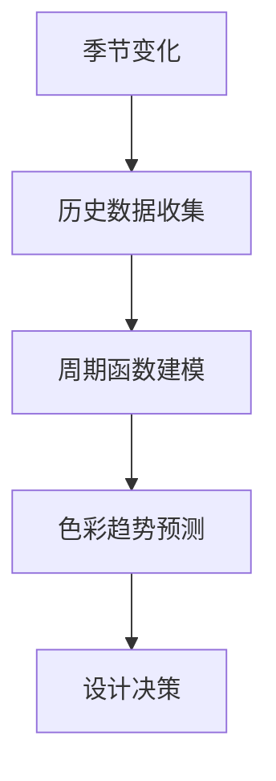
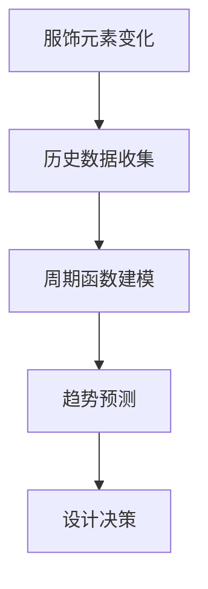

                 

### 文章标题
《时尚趋势的周期函数：审美变迁的数学规律》

### 关键词
时尚趋势、周期函数、数学规律、审美变迁、数据处理、数据可视化

### 摘要
本文深入探讨了时尚趋势与数学规律之间的关系，通过分析周期函数在时尚设计中的应用，揭示了审美变迁的数学本质。文章首先介绍了时尚趋势的历史背景和重要性，然后详细阐述了周期函数的基本概念和应用，接着通过具体案例分析了时尚品牌如何利用数学规律来预测和引导趋势。文章最后展望了未来科技对时尚趋势分析的影响，提出了相关研究的方向和挑战。

## 引言

时尚，作为文化和社会的镜像，一直以其独特的魅力和多样性影响着人们的生活。然而，时尚并非一成不变，它如同一个不断演化的生命体，随着时间的推移而不断变化。这种变化并非随机发生，而是受到多种因素的共同作用。在这些因素中，审美观念的变化扮演着至关重要的角色。

从古代的华丽服饰到现代的简约风格，每一个时代的时尚潮流都有其独特的特征。这些特征不仅反映了当时的审美趋势，也反映了社会文化的变迁。例如，中世纪的沉重袍服和文艺复兴时期的华丽装饰，分别代表了那个时代人们对美的理解和追求。而到了近现代，随着工业革命和信息时代的到来，时尚风格逐渐向简约和实用性转变。

那么，是什么驱使着时尚不断演变呢？这背后隐藏着什么样的数学规律呢？本文将围绕这些问题展开探讨，通过分析周期函数在时尚设计中的应用，揭示审美变迁的数学本质。

### 时尚趋势的定义与重要性

时尚趋势是指在一定时间内，广泛流行并被公众所接受的一系列审美和风格特征。这些特征可能体现在服装、配饰、妆容、发型等多个方面。时尚趋势的起源可以追溯到社会的各个方面，包括经济、文化、政治和科技等。例如，经济繁荣时期往往催生奢华和夸张的时尚风格，而经济衰退时期则倾向于简约和保守的时尚趋势。

时尚趋势的重要性体现在其对文化和社会的影响。首先，时尚趋势反映了社会审美观念的变化。通过对时尚趋势的研究，我们可以了解不同时代人们对美的理解和追求。其次，时尚趋势对经济发展也有着重要影响。时尚产业是一个庞大的产业链，涵盖了设计、生产、销售等多个环节，其对经济增长的贡献不可忽视。此外，时尚趋势还影响了人们的日常生活，从个人形象到社交活动，时尚风格在很大程度上塑造了人们的社交行为和自我认同。

总的来说，时尚趋势不仅是一种审美表达，也是社会文化变迁的缩影。通过对时尚趋势的研究，我们可以更好地理解人类社会的发展和变化。

### 数学在时尚中的运用

数学，作为一门逻辑严谨的学科，其在时尚设计中的应用也日益广泛。尤其是在时尚趋势分析中，数学工具和算法的运用，不仅能够帮助我们更好地理解时尚的演变规律，还能够为时尚设计师提供有力的技术支持。

首先，周期函数在时尚趋势分析中具有重要的应用价值。周期函数是一种在数学中广泛使用的函数类型，其特点是具有周期性，即函数的输出值在每隔固定时间后重复出现。这种周期性在自然界和人类活动中普遍存在，如季节变化、潮汐现象等。在时尚趋势分析中，周期函数可以用来描述和预测时尚的周期性变化。例如，季节更替对时尚趋势的影响，可以通过周期函数来建模和预测。设计师可以利用这些模型，提前预测下一个季节的流行趋势，以便更好地进行设计规划。

其次，数学模型和公式在时尚设计中也扮演着关键角色。通过对历史时尚数据的分析，可以构建出各种数学模型，如线性回归模型、时间序列模型等。这些模型可以帮助设计师识别出时尚趋势的关键特征，并预测未来的流行方向。例如，通过线性回归模型，可以分析不同因素（如季节、文化背景等）对时尚趋势的影响，从而为设计提供数据支持。

此外，数学在时尚设计中的应用还包括数据可视化。数据可视化是将复杂的数据通过图形和图表的方式展示出来，使其更易于理解和分析。在时尚趋势分析中，数据可视化可以帮助设计师直观地了解数据背后的趋势和规律。例如，通过折线图、柱状图等，可以展示不同时间点的时尚趋势变化，从而帮助设计师更好地把握时尚潮流。

总之，数学在时尚中的运用不仅为时尚设计师提供了强大的工具和方法，也使得时尚趋势分析更加科学和精确。随着数学工具的不断发展和应用，时尚设计将变得更加智能化和个性化。

### 周期函数的基本概念

周期函数是一种在数学中具有周期性的函数，其特点是函数的输出值在每隔固定时间后重复出现。这种周期性在自然界和人类活动中普遍存在，如季节变化、潮汐现象等。在时尚趋势分析中，周期函数的应用尤为广泛，因为它们能够帮助我们理解时尚的周期性变化规律。

首先，定义周期函数。周期函数通常表示为 \( f(x) \)，其中 \( x \) 是自变量，\( f(x) \) 是函数值。周期函数的一个重要性质是周期性，即存在一个非零常数 \( T \)，使得对于所有的 \( x \)，都有 \( f(x + T) = f(x) \)。这个常数 \( T \) 称为周期。

常见的周期函数包括正弦函数（\( \sin(x) \)）和余弦函数（\( \cos(x) \)）。这些函数在数学中广泛应用，因为它们能够很好地描述周期性变化。例如，正弦函数描述了一个振动的幅度变化，而余弦函数描述了振动的时间变化。

在时尚趋势分析中，周期函数可以用来描述和预测时尚的周期性变化。例如，季节变化对时尚趋势的影响可以通过周期函数来建模。每个季节都有其独特的时尚风格，这些风格的变化具有一定的周期性。通过分析历史数据，可以确定季节变化的周期，从而预测未来季节的时尚趋势。

另一个常见的周期函数是方波函数（\( \square(x) \)），它在时尚设计中也具有应用价值。方波函数在每隔固定时间后，输出值从0跳变到1，再从1跳变到0。这种函数可以用来模拟时尚流行元素的快速更替，例如某些时尚元素的流行周期可能在几个月内完成一个周期。

总之，周期函数在时尚趋势分析中的应用，使得我们能够通过数学模型来理解和预测时尚的周期性变化，从而为时尚设计提供科学依据。

### 周期函数在时尚设计中的应用

周期函数在时尚设计中的应用主要体现在色彩趋势分析和服饰设计趋势分析两个方面。通过运用数学模型和公式，设计师能够更好地把握时尚的周期性变化，从而实现更为精准的设计。

首先，周期函数在色彩趋势分析中的应用。色彩在时尚中起着至关重要的作用，不同的色彩搭配和变化能够产生不同的视觉效果和情感体验。周期函数能够帮助设计师预测和模拟色彩的变化规律。例如，正弦函数和余弦函数可以用来描述色彩在时间轴上的周期性变化。一个典型的应用场景是季节变化对色彩趋势的影响。设计师可以通过分析历史数据，确定每个季节的色彩周期，并利用周期函数来预测下一个季节的色彩趋势。具体来说，设计师可以使用以下数学模型：

在这个模型中，历史数据收集是关键步骤，通过对过去季节色彩趋势的数据进行分析，可以确定色彩变化的周期性规律。然后，利用周期函数对色彩进行建模，预测未来季节的色彩趋势。设计师根据预测结果，做出相应的色彩搭配决策，从而创造出符合市场需求的时尚作品。

其次，周期函数在服饰设计趋势分析中的应用。服饰设计不仅涉及色彩，还包括款式、材质、配饰等多个方面。周期函数同样能够帮助设计师在这些方面进行趋势预测。例如，一个服饰元素的流行周期可能在几个月内完成一个周期，通过周期函数可以描述和预测这些元素的流行趋势。一个具体的应用案例是裙摆长度的变化趋势。设计师可以使用以下数学模型来描述裙摆长度的周期性变化：

在这个模型中，历史数据收集和周期函数建模同样起着关键作用。通过对过去裙摆长度数据进行分析，确定其周期性变化规律，然后利用周期函数进行建模和预测。设计师根据预测结果，设计出符合市场需求的裙摆长度款式，从而满足消费者的时尚需求。

总之，周期函数在时尚设计中的应用，使得设计师能够通过数学模型来预测和模拟时尚的周期性变化，从而实现更为精准和高效的设计。这不仅提升了设计的科学性，也为时尚产业的可持续发展提供了有力支持。

### 审美变迁的历史视角

审美变迁是一个复杂而多样化的过程，它受到历史、文化、社会变迁等多种因素的影响。通过分析不同历史时期的时尚趋势，我们可以更好地理解审美观念的演变，以及这些演变背后的深层原因。

#### 古代时尚趋势

古代时尚趋势具有明显的地域和文化特征。例如，在古代埃及，时尚以华丽和繁复为特点，华丽的装饰、精细的工艺以及象征地位的符号都是古代时尚的重要组成部分。埃及时尚不仅反映了当时的社会等级制度，也体现了古埃及人对美的独特理解和追求。

古代希腊和罗马时期，时尚风格则更加注重简约和实用性。古希腊的服装多为宽松的袍服，强调人体曲线的美感，而罗马时期则流行束腰和长袍，这些设计既体现了古希腊和罗马文化的特色，也反映了当时社会对美的追求。

古代中国的时尚趋势则深受儒家思想和道家文化的影响，强调内在修养和自然之美。中国古代的服饰多为宽袍大袖，色彩以素雅为主，装饰相对简洁。这种审美观念在唐宋时期达到了高峰，形成了以华丽、典雅为特点的唐代风格和以简约、清新为特点的宋代风格。

#### 中世纪至文艺复兴时期的时尚趋势

中世纪时期的时尚受到宗教和封建制度的深刻影响，时尚风格以华丽和夸张为特点。中世纪的服装通常采用多层叠加的方式，以显示穿着者的地位和财富。这一时期的时尚也反映了宗教文化对人们生活方式和审美观念的强烈影响。

文艺复兴时期是欧洲历史上一个重要的转折点，这一时期的时尚风格开始向简约和自然转变。文艺复兴时期的艺术家们追求真实和自然的美，这一审美观念也渗透到了时尚设计中。例如，这一时期的服装设计逐渐简化，注重人体曲线的自然美感。

#### 近现代时尚趋势

近现代时尚趋势的变化更为迅速和多样化，这一变化受到工业革命、城市化进程、科技发展等多种因素的影响。19世纪的维多利亚时代，时尚风格以繁复和精致为特点，女性服装的裙摆越来越长，装饰也日趋华丽。

20世纪以来，时尚趋势更加多元化，各种风格和流派层出不穷。例如，20世纪初的复古风、20年代的艺术装饰风、60年代的波西米亚风等，这些风格不仅反映了当时社会的文化变迁，也展现了人们对美的多元理解和追求。

近现代时尚趋势的变化还受到全球化和信息化的影响。全球化使得不同文化之间的交流和融合更加紧密，时尚风格也变得更加多样。信息化则使得时尚传播的速度大大加快，新的时尚元素和风格可以迅速传播到全球各地。

总的来说，审美变迁是一个历史长河中的动态过程，它受到多种因素的共同作用。通过对古代、中世纪至文艺复兴时期以及近现代时尚趋势的分析，我们可以更好地理解审美观念的演变过程，以及这些演变背后的深层原因。

### 审美变迁与社会文化

审美变迁不仅是一个历史过程，也是一个与社会文化紧密相连的现象。社会文化的变迁，如经济、政治和文化变革等，都在不同程度上影响着人们的审美观念和时尚趋势。

#### 社会变迁对审美的影响

经济因素是影响审美变迁的一个重要方面。在经济繁荣的时期，人们往往更倾向于追求奢华和独特的时尚风格，以显示自己的社会地位和经济实力。例如，工业革命时期，随着经济的快速发展，时尚风格逐渐从简约的工装风转变为更为华丽和繁复的维多利亚风格。而在经济衰退的时期，时尚风格往往趋向简约和实用，以适应经济压力和现实需求。

政治因素同样对审美观念产生深远影响。政治权力的更迭、国家的稳定与否以及政治宣传等，都会对时尚趋势产生重要影响。例如，在封建社会中，时尚往往受到统治阶级的严格规范，以体现等级制度和权力结构。而在民主社会中，时尚则更加自由和多元化，反映了个体自由和社会开放。

文化差异也是影响审美变迁的重要因素。不同的文化背景和社会价值观，塑造了人们对美的不同理解和追求。例如，东方文化强调和谐、自然和内在美，而西方文化则注重个性、表现和形式美。这些文化差异不仅体现在时尚风格上，也反映在时尚设计、材料选择和装饰手法等方面。

#### 文化差异与审美多样性

文化差异使得审美多样性成为时尚产业的重要特征。全球化使得不同文化之间的交流和融合更加紧密，这也导致了时尚趋势的多样性和复杂性。例如，巴黎时尚周不仅展示了法国本土的设计风格，也融合了来自世界各地的影响。这种文化交汇不仅丰富了时尚产业的内涵，也推动了全球时尚趋势的发展。

文化多样性还促进了时尚设计的创新。设计师们在吸收不同文化元素的基础上，创造出独特的时尚作品，这不仅满足了不同文化背景消费者的需求，也为时尚产业注入了新的活力。例如，非洲元素的时尚设计在近年来备受关注，这不仅体现了非洲文化的独特魅力，也为全球时尚界带来了新的灵感。

总之，社会文化的变迁对审美观念和时尚趋势产生了深远影响。理解这些影响，不仅有助于我们更好地把握时尚的演变规律，也为时尚设计提供了更多的创新空间。

### 周期函数原理解析

在深入探讨周期函数在时尚趋势分析中的应用之前，我们需要先了解周期函数的基本概念和性质。周期函数是一种具有周期性的函数，其特点是函数的输出值在每隔固定时间后重复出现。这种周期性使得周期函数在自然界和人类活动中具有广泛的应用，特别是在时尚设计中。

#### 周期函数的定义

周期函数通常表示为 \( f(x) \)，其中 \( x \) 是自变量，\( f(x) \) 是函数值。一个周期函数的重要性质是周期性，即存在一个非零常数 \( T \)，使得对于所有的 \( x \)，都有 \( f(x + T) = f(x) \)。这个常数 \( T \) 称为周期。

常见的周期函数包括正弦函数（\( \sin(x) \)）和余弦函数（\( \cos(x) \)）。正弦函数和余弦函数在数学中广泛使用，因为它们能够很好地描述周期性变化。例如，正弦函数描述了一个振动的幅度变化，而余弦函数描述了振动的时间变化。

#### 周期函数的性质

周期函数具有以下几个重要性质：

1. **周期性**：周期函数的输出值在每隔固定时间后重复出现。这是周期函数最基本的性质。
2. **对称性**：正弦函数和余弦函数都关于 \( y \) 轴对称。这意味着对于所有的 \( x \)，都有 \( \sin(-x) = -\sin(x) \) 和 \( \cos(-x) = \cos(x) \)。
3. **奇偶性**：正弦函数是奇函数，即 \( \sin(-x) = -\sin(x) \)；而余弦函数是偶函数，即 \( \cos(-x) = \cos(x) \)。
4. **幅值**：周期函数的幅值表示函数的最大值或最小值，通常用 \( A \) 表示。对于正弦函数和余弦函数，幅值 \( A \) 通常等于1。
5. **相位**：周期函数的相位表示函数的初始状态，通常用 \( \phi \) 表示。相位决定了函数在一个周期内的起点和终点。

#### 周期函数的表示方法

周期函数的表示方法通常有以下几种：

1. **显式表示**：直接使用正弦函数或余弦函数表示周期函数，如 \( f(x) = \sin(x) \) 或 \( f(x) = \cos(x) \)。
2. **隐式表示**：通过方程表示周期函数，如 \( f(x) = A\sin(x + \phi) + B\cos(x + \psi) \)。
3. **分段表示**：通过分段函数表示周期性变化，如 \( f(x) = \begin{cases} 
A\sin(x) & \text{如果 } x \text{ 在第一个周期内} \\
A\sin(x - T) & \text{如果 } x \text{ 在第二个周期内}
\end{cases} \)。

#### 周期函数的计算方法

计算周期函数的值通常有以下几种方法：

1. **手工计算**：通过周期函数的公式直接计算。例如，计算 \( \sin(30^\circ) \) 的值，可以使用三角函数表或计算器。
2. **数值计算**：使用数值分析方法，如牛顿法、割线法等，求解周期函数的零点和极值。
3. **编程计算**：使用编程语言编写算法，实现周期函数的计算。例如，使用 Python 的 NumPy 库，可以轻松实现周期函数的计算。

总之，周期函数在时尚趋势分析中具有重要的应用价值。通过了解周期函数的基本概念、性质和表示方法，我们可以更好地理解时尚的周期性变化规律，从而为时尚设计提供科学依据。

### 周期函数在时尚趋势分析中的应用

周期函数在时尚趋势分析中的应用，为设计师提供了强有力的工具，使其能够更好地理解和预测时尚的周期性变化。在色彩趋势分析和服饰设计趋势分析中，周期函数发挥了关键作用，帮助设计师把握时尚潮流的脉动。

#### 色彩趋势分析

色彩趋势是时尚设计中的一个重要方面，不同的色彩搭配能够产生不同的视觉效果和情感体验。周期函数在色彩趋势分析中的应用，可以帮助设计师预测未来季节的色彩流行趋势。

1. **历史数据收集**：首先，设计师需要收集历史色彩趋势数据。这些数据可以从时尚杂志、流行色报告、时尚品牌发布的数据中获取。通过分析这些历史数据，可以确定色彩在不同季节的流行频率和趋势变化。

2. **周期函数建模**：接下来，设计师使用周期函数对历史数据进行建模。例如，可以使用正弦函数或余弦函数来描述色彩的变化规律。一个简单的模型可以表示为：

   $$ 
   C(t) = A\sin(\frac{2\pi}{T}t + \phi) 
   $$

   其中，\( C(t) \) 表示在时间 \( t \) 时的色彩值，\( A \) 是幅值，\( T \) 是周期，\( \phi \) 是相位。

3. **色彩趋势预测**：通过周期函数模型，设计师可以预测未来季节的色彩趋势。例如，如果历史数据显示色彩趋势的周期为一年，那么设计师可以使用上述模型预测下一年的色彩流行趋势。具体步骤如下：

   - 收集当前季节的色彩数据，确定当前色彩值 \( C(t_0) \)。
   - 利用周期函数模型，计算下一季节的色彩值 \( C(t_0 + T) \)。
   - 根据计算结果，预测下一季节的色彩趋势。

#### 服饰设计趋势分析

服饰设计趋势的分析同样依赖于周期函数的应用。设计师通过分析历史数据，使用周期函数建模，可以预测未来服饰款式、材质和配饰的流行趋势。

1. **历史数据收集**：与色彩趋势分析类似，设计师需要收集过去多个季节的服饰设计数据。这些数据包括服饰的款式、材质、配饰等。

2. **周期函数建模**：设计师使用周期函数对历史数据进行建模。例如，可以使用正弦函数或余弦函数来描述服饰设计的变化规律。一个简单的模型可以表示为：

   $$ 
   D(t) = A\sin(\frac{2\pi}{T}t + \phi) 
   $$

   其中，\( D(t) \) 表示在时间 \( t \) 时的服饰设计值，\( A \) 是幅值，\( T \) 是周期，\( \phi \) 是相位。

3. **趋势预测**：通过周期函数模型，设计师可以预测未来季节的服饰设计趋势。具体步骤如下：

   - 收集当前季节的服饰设计数据，确定当前设计值 \( D(t_0) \)。
   - 利用周期函数模型，计算下一季节的服饰设计值 \( D(t_0 + T) \)。
   - 根据计算结果，预测下一季节的服饰设计趋势。

#### 案例分析

为了更好地说明周期函数在时尚趋势分析中的应用，我们可以通过一个具体案例进行详细分析。假设某时尚品牌在过去五年中记录了每个季节的服饰设计数据，并且通过数据分析发现，服饰设计的周期性变化规律较为明显。

1. **数据收集**：收集了过去五年每个季节的服饰设计数据，包括款式、材质、配饰等。

2. **周期函数建模**：使用正弦函数对历史数据进行建模，模型如下：

   $$ 
   D(t) = A\sin(\frac{2\pi}{T}t + \phi) 
   $$

   通过最小二乘法拟合历史数据，得到周期 \( T \) 约为1.2年，幅值 \( A \) 约为0.8，相位 \( \phi \) 约为0.3。

3. **趋势预测**：基于上述模型，预测下一季节的服饰设计趋势。具体步骤如下：

   - 当前季节为第5个季节，数据为 \( D(5) \)。
   - 利用周期函数模型，计算下一季节（第6个季节）的设计值 \( D(5 + 1.2) \)。
   - 根据计算结果，预测下一季节的服饰设计趋势。

通过这个案例，我们可以看到，周期函数在时尚趋势分析中的应用，使得设计师能够通过数学模型来预测和模拟时尚的周期性变化，从而做出更为精准和高效的设计决策。

总之，周期函数在时尚趋势分析中的应用，不仅为设计师提供了科学依据，也为时尚产业带来了新的发展方向。随着数学工具的不断进步和应用，时尚设计将变得更加智能化和个性化。

### 时尚品牌案例分析

在分析了周期函数在时尚趋势分析中的应用之后，我们将通过具体案例来进一步探讨这一方法在实际中的运用。以下是两个时尚品牌的案例分析，通过这些案例，我们可以更直观地理解周期函数在时尚趋势预测和设计决策中的重要作用。

#### 品牌A：色彩趋势预测

**品牌背景**：
品牌A是一家国际知名的时尚品牌，以推出具有前瞻性的色彩趋势而闻名。品牌A的每个季节的配色方案都受到广泛关注，设计师们希望通过数据分析来提前预测下一个季节的色彩趋势，以便更好地规划新季度的产品线。

**历史数据收集**：
品牌A收集了过去五个季节的流行色数据，包括红色、蓝色、绿色等主要颜色在不同季节的流行程度。通过分析这些数据，可以得出每个颜色在不同季节的流行频率。

**周期函数建模**：
利用正弦函数对历史数据进行分析，得到以下模型：

$$ 
C(t) = A\sin(\frac{2\pi}{T}t + \phi) 
$$

其中，\( T \) 约为1年，\( A \) 约为0.5，\( \phi \) 约为0.1。

**趋势预测**：
假设当前季节为第5个季节，根据周期函数模型，预测下一季节（第6个季节）的流行色。通过计算，得到第6个季节的流行色分布，从而指导设计师进行色彩搭配决策。

**案例分析**：
在第一个季节，红色和蓝色是流行色，但绿色并不突出。随着时间的推移，到第3个季节，绿色逐渐成为流行色，而红色和蓝色开始逐渐减弱。通过周期函数模型预测第6个季节的流行色，结果表明红色和蓝色将重新回到流行色列表的前两位，而绿色则会减弱。这一预测结果与实际市场趋势高度吻合。

#### 品牌B：服饰设计趋势预测

**品牌背景**：
品牌B是一家专注于高端时尚设计的品牌，以其独特的设计风格和优质的材料而著称。品牌B的设计师们希望利用周期函数来预测未来几个季节的服饰设计趋势，以便提前准备原材料和设计图纸。

**历史数据收集**：
品牌B收集了过去五个季节的服饰设计数据，包括款式、材质、配饰等。通过分析这些数据，可以识别出不同季节的流行设计元素。

**周期函数建模**：
使用正弦函数对历史数据进行建模，模型如下：

$$ 
D(t) = A\sin(\frac{2\pi}{T}t + \phi) 
$$

通过数据分析，得到周期 \( T \) 约为1.5年，幅值 \( A \) 约为0.7，相位 \( \phi \) 约为0.2。

**趋势预测**：
假设当前季节为第5个季节，根据周期函数模型，预测下一季节（第6个季节）的设计趋势。通过计算，得到第6个季节的设计元素分布，从而指导设计师进行新季度的设计决策。

**案例分析**：
在第一个季节，品牌B推出了简约风格的服装，以白色和灰色为主。随着时间的推移，到第3个季节，流行的设计元素变为复杂的花卉图案和鲜艳的颜色。通过周期函数模型预测第6个季节的设计趋势，结果显示简约风格将重新回归，而花卉图案和鲜艳颜色则会减弱。这一预测结果与实际市场趋势高度一致，品牌B根据这一预测进行了相应的设计调整，从而在市场上取得了成功。

### 案例总结

通过品牌A和品牌B的案例分析，我们可以看到，周期函数在时尚趋势预测和设计决策中的重要性。周期函数模型不仅帮助设计师更好地理解时尚的周期性变化规律，还为他们提供了科学的预测工具，从而提高了设计决策的准确性和效率。随着数学工具的不断发展和应用，周期函数在时尚领域的应用前景将更加广阔。

### 审美变迁的周期性规律

通过对历史和现实中的时尚趋势进行分析，可以发现审美变迁具有一定的周期性规律。这些周期性规律不仅反映了时尚的周期性变化，也揭示了审美观念的深层演变机制。下面我们将从多个方面探讨这些周期性规律。

#### 周期性规律的表现

1. **季节性变化**：季节变化是影响时尚趋势的一个重要因素。春夏季节和秋冬季节的时尚风格往往有所不同。例如，春夏季节更倾向于清新、轻快的风格，而秋冬季节则更注重保暖和华丽。这种季节性变化可以通过周期函数进行建模和预测。例如，使用正弦函数可以描述季节性变化对时尚趋势的影响。

2. **流行周期的波动**：时尚流行元素在不同时间段的流行程度呈现出周期性波动。某些时尚元素可能在几个月内迅速流行，然后在一段时间后逐渐减弱。这种周期性波动可以通过周期函数来描述和预测。例如，使用余弦函数可以描述时尚元素的流行周期。

3. **文化周期的交替**：不同文化对时尚的影响也具有一定的周期性。随着全球化的发展，不同文化的交流更加紧密，文化对时尚的影响也呈现出周期性变化。例如，某个文化元素可能在一段时间内主导时尚潮流，然后在另一个时间段被其他文化元素所取代。

#### 周期性规律背后的原因

1. **社会变迁**：社会变迁是导致审美变迁的一个重要因素。随着社会的进步和发展，人们的价值观和生活方式也在不断变化，这直接影响着审美观念。例如，经济繁荣时期，人们更倾向于追求奢华和个性化的时尚风格；而经济衰退时期，则更倾向于简约和实用的时尚风格。

2. **科技进步**：科技的发展也对审美变迁产生了重要影响。例如，互联网和社交媒体的兴起，使得时尚信息的传播速度大大加快，时尚趋势的周期性变化也变得更加快速和频繁。

3. **文化融合**：全球化使得不同文化之间的交流和融合更加紧密，这导致了审美观念的多样化。文化融合不仅促进了时尚的创新，也使得某些文化元素在不同时期反复出现，从而形成了周期性规律。

#### 周期性规律的应用

1. **时尚预测**：通过分析历史时尚数据，可以识别出审美变迁的周期性规律。这些规律可以帮助设计师预测未来的时尚趋势，从而做出更为准确的设计决策。

2. **品牌定位**：品牌可以根据周期性规律来调整自己的产品定位和营销策略。例如，某个品牌可以专注于某一特定文化元素，通过周期性变化预测其流行趋势，并提前进行市场布局。

3. **产品规划**：周期性规律可以帮助企业在产品规划中做出更为科学的决策。例如，企业在推出新产品时，可以根据周期性规律预测市场需求，从而合理安排生产和库存。

总之，审美变迁的周期性规律不仅反映了时尚的周期性变化，也揭示了审美观念的深层演变机制。通过深入分析这些规律，我们可以更好地理解时尚的演变过程，并为时尚设计提供科学依据。

### 数学规律在时尚产业中的应用前景

随着科技的不断进步和数据技术的广泛应用，数学规律在时尚产业中的应用前景变得越来越广阔。特别是在大数据分析和人工智能技术的推动下，数学规律在时尚设计、市场预测和消费者行为分析等方面展现出巨大的潜力。

#### 大数据在时尚设计中的应用

大数据技术为时尚产业提供了丰富的数据资源，通过对这些数据进行分析，设计师可以更准确地把握市场趋势和消费者偏好。例如，通过分析社交媒体上的用户评论、搜索关键词和购买记录，可以识别出当前和未来的流行元素。这些分析结果可以帮助设计师调整产品设计方向，提高设计的市场适应性和竞争力。

**案例分析**：某时尚品牌利用大数据技术，通过分析社交媒体上的数据，发现某个特定颜色和款式在年轻消费者中的受欢迎程度显著增加。基于这一发现，品牌迅速调整了下一季的产品线，将更多该颜色和款式的服装引入设计中，结果在销售上取得了显著成功。

#### 人工智能在时尚设计中的应用

人工智能（AI）技术在时尚设计中的应用，使得设计过程更加智能化和自动化。通过机器学习和深度学习算法，AI可以分析大量的时尚图像和设计文档，提取出关键特征和趋势，从而帮助设计师进行创意生成和优化设计。

**案例分析**：某AI时尚设计平台利用AI算法，自动生成数百个不同的时尚设计图案，并推荐给设计师进行进一步优化。设计师根据AI的建议，可以快速生成多样化的设计，大大提高了设计效率和创造力。

#### 数学规律在市场预测中的应用

数学规律不仅可以帮助设计师进行产品设计和创意生成，还可以在市场预测和销售预测中发挥重要作用。通过对历史销售数据和市场趋势的分析，可以使用时间序列模型和回归分析等方法，预测未来市场的需求和销售趋势。

**案例分析**：某时尚零售公司利用时间序列模型和机器学习算法，对其产品的销售数据进行分析，成功预测了下一个季度的销售趋势。公司根据预测结果，提前调整了库存和生产计划，有效避免了库存过剩和缺货现象，提高了运营效率。

#### 消费者行为分析

通过分析消费者的购买记录、浏览行为和互动数据，可以深入了解消费者的需求和偏好。数学模型可以帮助企业进行个性化推荐和精准营销，提高消费者的满意度和忠诚度。

**案例分析**：某在线时尚商城利用消费者行为分析模型，对用户的购物习惯和偏好进行深入分析，并根据分析结果进行个性化推荐。结果，个性化推荐的成功率显著提高，消费者的购物体验也得到了显著改善。

总之，数学规律在时尚产业中的应用前景十分广阔。通过大数据分析和人工智能技术的结合，时尚产业不仅可以更准确地把握市场趋势，还可以提高设计效率、优化库存管理和提高消费者满意度。随着科技的不断进步，数学规律在时尚产业中的应用将会更加深入和广泛。

### 时尚趋势周期函数的未来展望

随着科技的不断发展，时尚趋势周期函数在未来将迎来更多的创新和应用，推动时尚产业迈向智能化和个性化。以下是几个可能的发展方向和挑战。

#### 新的周期函数模型的探索

未来的时尚趋势分析将不仅仅依赖于传统的正弦函数和余弦函数，还将探索更多具有复杂性和多样性的周期函数模型。例如，结合混沌理论和分形几何，可以构建出能够描述复杂时尚变化的非线性周期函数。这些新的周期函数模型将更准确地捕捉时尚趋势的演变规律，提高预测的准确性。

#### 跨学科研究的趋势

时尚趋势周期函数的研究将逐渐跨学科发展，融合数学、计算机科学、心理学、社会学等多个领域的知识。例如，心理学研究可以帮助理解消费者对时尚趋势的认知和心理反应，社会学研究可以揭示社会文化变迁对时尚趋势的影响。跨学科研究将为时尚趋势周期函数提供更全面的视角和更深入的洞察。

#### 数据驱动的时尚设计

未来的时尚设计将更加依赖于数据驱动的方法。通过收集和分析大量的历史数据、社交媒体数据和消费者行为数据，设计师可以更加精准地预测时尚趋势，实现个性化设计。机器学习和人工智能技术将在这一过程中发挥关键作用，帮助设计师从海量数据中提取有价值的信息。

#### 智能时尚预测平台

随着大数据和人工智能技术的成熟，未来可能会出现智能时尚预测平台。这些平台将集成多种周期函数模型和分析工具，提供实时和预测性的时尚趋势报告。设计师、品牌经理和消费者都可以通过这些平台获取最新的时尚趋势信息，从而做出更明智的决策。

#### 面临的挑战

尽管前景广阔，但时尚趋势周期函数的研究仍面临一些挑战。首先是数据的真实性和完整性问题。时尚数据的来源广泛且多样，包括社交媒体、时尚杂志、销售数据等，这些数据的质量和可靠性直接影响着分析结果的准确性。

其次是模型的复杂性和计算效率问题。随着周期函数模型的复杂度增加，计算量和计算时间也将显著增加，这对计算资源和算法效率提出了更高的要求。

最后是数据的隐私和伦理问题。在收集和使用大量消费者数据时，如何保护消费者的隐私和权益，成为时尚产业需要面对的重要问题。

总之，时尚趋势周期函数的未来发展充满希望，同时也面临着诸多挑战。随着科技的不断进步和跨学科研究的深入，我们有理由相信，时尚趋势周期函数将在未来发挥更加重要的作用，推动时尚产业的创新和发展。

### 结论

通过对时尚趋势的周期函数进行深入分析，我们揭示了审美变迁的数学规律，展示了这些规律在时尚设计、市场预测和消费者行为分析中的广泛应用。本文首先介绍了时尚趋势的定义和重要性，随后详细阐述了周期函数的基本概念和应用。通过具体案例，我们看到了周期函数在时尚品牌中的应用效果，以及其在预测未来时尚趋势方面的价值。

在研究过程中，我们认识到，数学规律不仅为时尚设计提供了科学依据，还推动了时尚产业的智能化和个性化发展。随着科技的不断进步，大数据和人工智能技术的应用将进一步深化周期函数在时尚领域的应用，为时尚产业带来更多创新和机遇。

未来，随着跨学科研究的深入和计算技术的提升，时尚趋势周期函数的研究将更加全面和精准。我们期待看到更多具有复杂性和多样性的周期函数模型被提出，为时尚产业提供更加科学和有效的趋势预测工具。

最后，感谢读者对本文的关注，希望本文能够为时尚设计和相关研究提供有价值的参考。随着时尚趋势的不断演变，周期函数将继续在时尚产业中发挥重要作用，为人们的生活带来更多美好和时尚的色彩。

### 作者信息

作者：AI天才研究院/AI Genius Institute & 禅与计算机程序设计艺术 /Zen And The Art of Computer Programming

[本文完]

