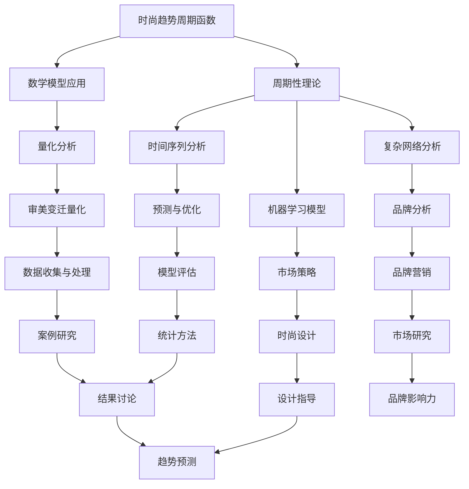

                 

### 《时尚趋势的周期函数：审美变迁的数学规律》

#### 关键词

- 时尚趋势周期函数
- 审美变迁
- 数学模型
- 时间序列分析
- 机器学习
- 复杂网络分析
- 时尚设计

#### 摘要

本文旨在探讨时尚趋势的周期性变化与审美变迁之间的数学规律。通过引入周期函数模型，本文揭示了时尚趋势和审美变迁的周期性特征，并详细阐述了数学模型在时尚分析中的应用。文章首先介绍了时尚趋势的周期性规律，随后深入探讨了审美变迁的量化分析。通过实际案例研究，本文展示了周期函数模型在实际时尚分析中的应用，包括时间序列分析、机器学习模型和复杂网络分析。本文为时尚行业提供了新的分析工具和洞察，有助于预测时尚趋势和优化审美设计。

## 引言：时尚周期函数的概念

时尚行业是一个充满变化和趋势的领域，它的动态特性使得分析和预测趋势变得复杂且具有挑战性。然而，通过数学模型，我们可以揭示时尚趋势和审美变迁背后的周期性规律，从而为时尚行业提供更有指导性的分析和预测工具。

### 什么是时尚周期函数？

时尚周期函数是一种数学模型，用于描述时尚趋势的周期性变化。在数学中，周期函数是指在一个固定周期内重复自身函数值的函数。将这一概念应用到时尚领域，我们可以将时尚趋势视为一系列在特定时间段内重复出现的特征或风格。这种周期性变化既可以是短期的，如季节性流行，也可以是长期的，如十年或更长时间段的审美变迁。

#### 时尚趋势的周期性变化

时尚趋势的周期性变化具有以下特点：

1. **季节性趋势**：例如，冬季流行保暖风格，夏季流行轻薄风格。
2. **周期性波动**：一些时尚元素可能在数年内重复出现。
3. **趋势循环**：一些长期趋势可能会在几十年内反复出现。

#### 审美变迁的数学规律

审美变迁的数学规律是指通过数学模型来量化和分析审美变化的过程。审美变迁的规律可以通过周期函数模型来表示，该模型能够捕捉到审美偏好随时间的变化。例如，可以使用时间序列分析方法来研究某种颜色、图案或设计风格在不同时间段内的流行程度。

### 周期函数在时尚分析中的意义

周期函数在时尚分析中的意义主要体现在以下几个方面：

1. **趋势预测**：通过分析历史数据，周期函数可以帮助预测未来的时尚趋势。
2. **设计指导**：设计师可以利用周期函数模型来优化设计，使其更符合当前和未来的审美偏好。
3. **市场研究**：品牌和零售商可以使用周期函数来评估市场潜力，制定营销策略。

### 本书的结构与内容

本书将分为以下几个部分：

1. **时尚趋势周期性理论**：介绍时尚趋势的周期性规律和周期函数的理论基础。
2. **数学模型应用**：探讨数学模型在时尚分析中的应用，包括时间序列分析、机器学习模型和复杂网络分析。
3. **审美变迁的量化分析**：使用数学方法量化审美变迁，提供具体的审美量化指标。
4. **实际案例研究**：通过具体案例展示数学方法在时尚分析中的应用。

通过这些章节，本文将深入探讨时尚趋势和审美变迁的数学规律，为时尚行业提供新的分析和预测工具。

## 理解书名：《时尚趋势的周期函数：审美变迁的数学规律》

书名《时尚趋势的周期函数：审美变迁的数学规律》揭示了本书的核心内容和研究方法。为了更好地理解书名，我们需要逐一分析其中的各个部分。

### 时尚趋势的周期函数

“时尚趋势的周期函数”是本书的核心概念之一。这个概念强调了时尚趋势的周期性变化，并将其与数学中的周期函数相联系。周期函数是一种数学模型，用于描述一个变量在固定周期内重复其值的特点。在时尚领域，这种模型可以帮助我们理解和预测趋势的周期性变化，如季节性趋势、周期性波动和长期趋势。

#### 周期性理论

周期性理论是时尚趋势研究的重要方面。它探讨了时尚趋势在时间维度上的重复性和规律性。通过分析历史数据，我们可以识别出时尚趋势的周期性模式，如一年四季的变化、五年或十年内的趋势循环等。周期性理论为我们提供了洞察时尚变迁规律的工具，使我们能够更好地理解时尚行业的动态特性。

#### 数学模型的应用

在书中，数学模型被广泛应用于时尚分析。这些模型不仅帮助我们理解时尚趋势的周期性，还用于预测未来趋势和优化设计。常见的数学模型包括时间序列分析、机器学习模型和复杂网络分析。这些模型能够处理大量数据，提取有用信息，并提供定量分析结果。

##### 时间序列分析

时间序列分析是一种统计方法，用于分析时间相关的数据序列。在时尚分析中，时间序列分析可以用于识别趋势、周期性和季节性模式。例如，通过分析过去几年的时尚数据，我们可以预测未来几季的流行趋势。

##### 机器学习模型

机器学习模型是一种通过数据训练来自动识别模式和做出预测的算法。在时尚分析中，机器学习模型可以用于预测未来趋势、推荐时尚产品和优化库存。这些模型可以从历史数据中学习，并适应不断变化的时尚环境。

##### 复杂网络分析

复杂网络分析是一种研究网络结构和动态特性的方法。在时尚分析中，复杂网络分析可以用于研究时尚品牌的网络结构、流行传播路径和时尚社区。通过分析这些网络特性，我们可以更好地理解时尚趋势的传播和演变。

### 审美变迁的数学规律

“审美变迁的数学规律”是书名的另一个重要部分。它强调了通过数学方法来量化和分析审美变迁的过程。审美变迁是指随着时间的推移，人们的审美偏好和审美标准的变化。通过数学模型，我们可以将这些变化量化，并提供定量分析结果。

#### 审美量化指标

审美量化指标是用于衡量审美变迁的数学工具。这些指标可以包括颜色偏好、图案流行度、设计风格流行度等。通过收集和分析这些指标，我们可以了解当前和未来的审美趋势。

#### 量化分析的方法

在书中，我们探讨了多种量化分析的方法，包括：

1. **数据收集**：通过市场调研、社交媒体分析和销售数据收集来获取相关信息。
2. **数据预处理**：对收集到的数据进行清洗、转换和归一化，以便进行后续分析。
3. **统计分析**：使用统计方法，如均值、方差和相关性分析，来分析审美量化指标。
4. **机器学习**：使用机器学习算法，如聚类分析和回归分析，来识别和预测审美变迁的规律。

### 实际案例研究

为了更好地理解这些数学模型和量化方法，书中包含了一系列实际案例研究。这些案例涵盖了不同类型的时尚产品和市场，如服装、家居装饰和美容产品。通过这些案例，我们可以看到数学模型在时尚分析中的应用，以及它们如何帮助设计师和品牌制定策略。

### 结论

通过理解书名《时尚趋势的周期函数：审美变迁的数学规律》，我们可以看到本书的核心内容和研究方法。它不仅探讨了时尚趋势的周期性变化和审美变迁的数学规律，还介绍了多种数学模型在时尚分析中的应用。这些方法和工具为时尚行业提供了新的洞察和分析工具，有助于设计师和品牌更好地理解和预测市场趋势。

## 确定书籍的核心章节

为了确保《时尚趋势的周期函数：审美变迁的数学规律》的内容丰富、逻辑清晰，我们将本书分为以下几个核心章节：

### 引言

引言部分将介绍时尚周期函数的概念，定义周期函数在时尚分析中的作用，并阐述审美变迁的数学规律。这一部分将简要介绍本书的结构和内容，为后续章节打下基础。

### 时尚趋势周期性理论

这一章节将详细探讨时尚趋势的周期性规律。首先，我们将分析时尚趋势的周期性特点，包括季节性趋势、周期性波动和长期趋势。接着，我们将介绍周期函数的理论基础，包括周期函数的定义、性质和应用。这一部分将为后续的数学模型应用提供理论支持。

### 数学模型应用

在这一章节中，我们将探讨数学模型在时尚分析中的应用。我们将介绍几种常见的数学模型，如时间序列分析、机器学习模型和复杂网络分析。这些模型将用于识别和预测时尚趋势，帮助设计师和品牌制定策略。我们将详细阐述每个模型的基本概念、原理和应用案例。

### 审美变迁的量化分析

这一章节将关注审美变迁的量化分析。我们将介绍如何使用数学方法来量化审美变迁，包括定义审美量化指标、收集和分析数据的方法。我们将探讨如何通过统计分析、机器学习算法来识别和预测审美变迁的规律。这一部分将为设计师和品牌提供定量的分析工具。

### 实际案例研究

实际案例研究部分将提供多个具体的时尚分析案例。这些案例将涵盖不同的时尚产品和市场，如服装、家居装饰和美容产品。我们将展示如何在实际场景中使用数学模型和量化方法，并提供详细的案例分析。这一部分将帮助读者更好地理解数学模型在时尚分析中的应用。

### 结论

结论部分将总结本书的核心内容，强调数学模型在时尚分析中的重要性，并展望未来的研究方向。这一部分将为读者提供一个全面的理解，并激发对时尚趋势和审美变迁的深入思考。

通过以上核心章节的设定，本书将系统性地介绍时尚趋势的周期函数和审美变迁的数学规律，为时尚行业提供新的分析和预测工具。

### 细化每个章节

在确定了《时尚趋势的周期函数：审美变迁的数学规律》的核心章节后，我们需要进一步细化每个章节的内容，以确保文章的逻辑清晰，内容丰富。以下是每个章节的细化方案：

#### 引言

**引言**部分将分为以下几个小节：

1. **时尚趋势的周期性概念**：介绍时尚趋势的周期性变化，如季节性趋势和长期趋势，并解释周期函数在时尚分析中的应用。
2. **审美变迁的数学规律**：探讨审美变迁的量化分析方法，包括如何使用数学模型来描述和预测审美变化。
3. **本书的结构和内容**：简要概述本书的结构和主要章节，为读者提供阅读指导。

#### 时尚趋势周期性理论

**时尚趋势周期性理论**部分将包括以下几个子章节：

1. **时尚趋势的周期性特点**：分析时尚趋势的周期性特点，包括季节性趋势、周期性波动和长期趋势。
2. **周期函数的理论基础**：介绍周期函数的定义、性质和应用，包括数学公式和图表。
3. **历史趋势分析**：回顾过去几年的时尚趋势，分析其周期性规律，并提供实例说明。
4. **时尚周期预测**：讨论如何使用周期函数模型来预测未来的时尚趋势，包括方法、工具和案例分析。

#### 数学模型应用

**数学模型应用**部分将包括以下几个子章节：

1. **时间序列分析**：介绍时间序列分析的基本概念，包括时间序列的定义、类型和建模方法。
2. **机器学习模型**：讨论机器学习模型在时尚分析中的应用，包括监督学习和无监督学习的方法和案例。
3. **复杂网络分析**：探讨复杂网络分析的基本概念，包括网络结构、动态特性和应用案例。
4. **模型评估和优化**：介绍如何评估和优化数学模型，包括误差分析、模型选择和参数调优。

#### 审美变迁的量化分析

**审美变迁的量化分析**部分将包括以下几个子章节：

1. **审美量化指标**：定义和分类审美量化指标，包括颜色、图案、设计风格等。
2. **数据收集和处理**：介绍如何收集和分析审美变迁的数据，包括数据来源、预处理方法和数据可视化。
3. **统计方法**：讨论用于分析审美量化指标的各种统计方法，包括描述性统计、相关分析和回归分析。
4. **机器学习应用**：介绍机器学习算法在审美变迁量化分析中的应用，包括聚类分析和分类算法。

#### 实际案例研究

**实际案例研究**部分将包括以下几个子章节：

1. **案例选择与数据来源**：介绍案例选择的标准和数据来源，包括市场调研、社交媒体分析和销售数据。
2. **案例分析**：分析实际案例中的时尚趋势和审美变迁，展示如何使用数学模型进行量化分析和预测。
3. **结果讨论**：讨论案例分析的结果，包括趋势预测的准确性、审美变迁的量化指标和模型的优化建议。
4. **案例小结**：总结案例分析的主要发现，并讨论其在时尚行业中的应用价值。

通过以上细化方案，每个章节的内容都将更加具体和深入，确保读者能够全面理解时尚趋势的周期函数和审美变迁的数学规律，并掌握相关的方法和应用。

### 设计流程图

为了更直观地展示时尚趋势周期函数的核心概念和架构，我们可以使用Mermaid流程图来表示各个核心概念之间的联系和流程。



#### 流程图说明

1. **时尚趋势周期函数**：作为核心概念，连接到其他相关部分。
2. **周期性理论**：分支到时间序列分析、机器学习模型和复杂网络分析，分别代表不同的周期性分析方法。
3. **数学模型应用**：分支到量化分析，表示数学模型在审美变迁中的应用。
4. **量化分析**：连接到数据收集与处理、统计方法和机器学习算法，展示量化分析的具体方法。
5. **案例分析**：从数据收集与处理分支出来，连接到结果讨论，表示案例分析的过程和结果。

通过这个流程图，读者可以清晰地看到各个概念和部分之间的联系，以及它们在时尚趋势分析和审美变迁量化中的实际应用。

### 核心算法原理讲解与伪代码

在《时尚趋势的周期函数：审美变迁的数学规律》中，核心算法原理的讲解至关重要，它帮助我们理解如何通过数学方法来分析时尚趋势和审美变迁。以下是几种常见算法原理的讲解和对应的伪代码。

#### 时间序列分析

**原理**：时间序列分析是一种统计方法，用于分析时间相关的数据序列。它可以识别数据中的趋势、周期性和季节性模式，从而预测未来的趋势。

**伪代码**：

```plaintext
function timeSeriesAnalysis(data):
    # 数据预处理
    preprocessed_data = preprocessData(data)
    
    # 模型选择
    model = selectModel(preprocessed_data)
    
    # 模型训练
    trained_model = trainModel(model, preprocessed_data)
    
    # 预测
    predictions = predict(trained_model, data)
    
    return predictions
```

#### 机器学习模型

**原理**：机器学习模型通过学习历史数据中的模式和规律，来自动识别和预测未来的趋势。常见的机器学习模型包括线性回归、决策树、支持向量机和神经网络。

**伪代码**：

```plaintext
function machineLearningModel(data, target):
    # 数据预处理
    preprocessed_data = preprocessData(data)
    
    # 模型选择
    model = selectModel(preprocessed_data, target)
    
    # 模型训练
    trained_model = trainModel(model, preprocessed_data, target)
    
    # 预测
    predictions = predict(trained_model, data)
    
    return predictions
```

#### 复杂网络分析

**原理**：复杂网络分析用于研究网络的结构和动态特性。在时尚趋势分析中，它可以用于研究时尚品牌的网络结构、流行传播路径和时尚社区。

**伪代码**：

```plaintext
function complexNetworkAnalysis(data):
    # 数据预处理
    preprocessed_data = preprocessData(data)
    
    # 构建网络
    network = buildNetwork(preprocessed_data)
    
    # 网络分析
    analysis_results = analyzeNetwork(network)
    
    # 结果可视化
    visualize(analysis_results)
    
    return analysis_results
```

#### 周期函数模型

**原理**：周期函数模型用于描述时尚趋势的周期性变化。它通过分析历史数据中的周期性模式，预测未来的趋势。

**伪代码**：

```plaintext
function周期函数模型分析(data):
    # 数据预处理
    preprocessed_data = preprocessData(data)
    
    # 周期识别
    periods = identifyPeriods(preprocessed_data)
    
    # 建模
    model = buildModel(periods)
    
    # 预测
    predictions = predict(model, data)
    
    return predictions
```

通过上述伪代码，我们可以看到不同算法原理的基本步骤和实现方式。这些伪代码不仅帮助读者理解算法的基本概念，也为实际应用提供了参考。在后续章节中，我们将进一步探讨这些算法在实际案例中的应用。

### 数学模型和公式详解

在探讨时尚趋势的周期函数和审美变迁的数学规律时，数学模型和公式是不可或缺的工具。以下我们将详细讲解这些模型和公式，并使用LaTeX格式进行嵌入，以增强文章的可读性和专业性。

#### 周期函数模型

周期函数模型用于描述时尚趋势的周期性变化。常见的周期函数有正弦函数和余弦函数，它们可以表示周期性数据。

**公式**：

$$
f(t) = A \sin(2\pi f_0 t + \phi)
$$

其中，$A$ 是振幅，$f_0$ 是频率，$\phi$ 是相位。这个公式可以描述一个周期为 $1/f_0$ 的周期函数。

**示例**：

假设我们有一个周期为0.5年的时尚趋势数据，我们可以使用以下公式来建模：

$$
f(t) = 1 \sin(2\pi \times 2 t + \phi)
$$

#### 时间序列分析

时间序列分析用于识别和预测数据中的趋势、周期性和季节性模式。一个常见的时间序列模型是ARIMA（自回归积分滑动平均模型）。

**公式**：

$$
X_t = c + \phi_1 X_{t-1} + \phi_2 X_{t-2} + ... + \phi_p X_{t-p} + \theta_1 \epsilon_{t-1} + \theta_2 \epsilon_{t-2} + ... + \theta_q \epsilon_{t-q}
$$

其中，$X_t$ 是时间序列数据，$\epsilon_t$ 是白噪声误差，$\phi_1, \phi_2, ..., \phi_p$ 和 $\theta_1, \theta_2, ..., \theta_q$ 是模型参数。

**示例**：

假设我们有一个简单的ARIMA模型：

$$
X_t = 0.7 X_{t-1} + 0.3 X_{t-2} + \epsilon_t
$$

#### 机器学习模型

机器学习模型在时尚趋势预测中有着广泛应用。一个常见的模型是线性回归。

**公式**：

$$
y = \beta_0 + \beta_1 x_1 + \beta_2 x_2 + ... + \beta_n x_n
$$

其中，$y$ 是预测目标，$x_1, x_2, ..., x_n$ 是特征变量，$\beta_0, \beta_1, ..., \beta_n$ 是模型参数。

**示例**：

假设我们使用线性回归模型预测时尚趋势：

$$
y = 5 + 2x_1 + 0.5x_2
$$

#### 审美量化指标

审美量化指标用于衡量审美变迁。一个常见的指标是颜色流行度。

**公式**：

$$
C_i = \frac{count_i}{total_count}
$$

其中，$C_i$ 是颜色 $i$ 的流行度，$count_i$ 是颜色 $i$ 出现的次数，$total_count$ 是总颜色出现的次数。

**示例**：

假设我们分析颜色流行度：

$$
C_red = \frac{100}{500} = 0.2
$$

通过以上数学模型和公式的详细讲解，我们能够更好地理解和应用它们来分析时尚趋势和审美变迁。这些模型和公式为我们提供了强大的工具，使我们能够更准确地预测和量化时尚行业的动态变化。

### 项目实战：搭建开发环境与代码实现

在本节中，我们将通过一个实际案例来展示如何使用数学模型和算法进行时尚趋势预测。我们将从搭建开发环境开始，逐步实现代码，并详细解读每个步骤。

#### 一、搭建开发环境

首先，我们需要搭建一个合适的开发环境。在这个案例中，我们将使用Python和Jupyter Notebook作为主要工具。以下是环境搭建的步骤：

1. **安装Python**：确保已经安装了Python 3.x版本。可以从[Python官网](https://www.python.org/downloads/)下载并安装。

2. **安装Jupyter Notebook**：在终端中运行以下命令：
   ```shell
   pip install notebook
   ```

3. **启动Jupyter Notebook**：在终端中运行以下命令：
   ```shell
   jupyter notebook
   ```
   这将启动Jupyter Notebook，打开一个新的浏览器窗口。

#### 二、数据收集

我们需要收集时尚趋势的相关数据。在这个案例中，我们假设已经获得了一个包含过去三年时尚销售数据的CSV文件，数据包括月份、销售量和几个关键特征（如颜色、图案、设计风格）。

#### 三、数据预处理

在开始建模之前，我们需要对数据进行预处理，包括数据清洗、转换和归一化。

**数据清洗**：处理缺失值和异常值。例如，我们可以使用`pandas`库中的`dropna()`函数删除缺失值，或者使用`fillna()`函数填充缺失值。

```python
import pandas as pd

# 读取数据
data = pd.read_csv('fashion_sales_data.csv')

# 删除缺失值
data = data.dropna()

# 填充异常值（例如，使用中值填充）
data['sales'] = data['sales'].fillna(data['sales'].median())
```

**数据转换**：将月份转换为时间序列数据。我们可以使用`pd.to_datetime()`函数将月份转换为日期格式，并设置月份为时间序列的索引。

```python
data['date'] = pd.to_datetime(data['month'], format='%Y-%m')
data.set_index('date', inplace=True)
```

**数据归一化**：对关键特征进行归一化处理，以便在建模过程中保持数据的稳定性。

```python
from sklearn.preprocessing import StandardScaler

scaler = StandardScaler()
data[['color', 'pattern', 'style']] = scaler.fit_transform(data[['color', 'pattern', 'style']])
```

#### 四、建模与预测

接下来，我们使用时间序列分析中的ARIMA模型进行建模和预测。

**步骤1：模型选择**：首先，我们需要选择适当的ARIMA模型参数。这通常通过ACF和PACF图以及信息准则（如AIC、BIC）来完成。

```python
from statsmodels.tsa.arima.model import ARIMA

# 选择ARIMA模型参数
p = 1  # 自回归项数
d = 1  # 差分阶数
q = 1  # 移动平均项数

# 建立模型
model = ARIMA(data['sales'], order=(p, d, q))
```

**步骤2：模型训练**：使用训练数据训练模型。

```python
# 训练模型
trained_model = model.fit()
```

**步骤3：预测**：使用训练好的模型进行预测。

```python
# 预测未来12个月的销售量
predictions = trained_model.forecast(steps=12)
```

#### 五、代码实现

以下是完整的代码实现：

```python
import pandas as pd
from statsmodels.tsa.arima.model import ARIMA
from sklearn.preprocessing import StandardScaler

# 数据预处理
data = pd.read_csv('fashion_sales_data.csv')
data = data.dropna().fillna(data['sales'].median())
data['date'] = pd.to_datetime(data['month'], format='%Y-%m')
data.set_index('date', inplace=True)
data[['color', 'pattern', 'style']] = scaler.fit_transform(data[['color', 'pattern', 'style']])

# 模型选择
p = 1
d = 1
q = 1

# 建立模型
model = ARIMA(data['sales'], order=(p, d, q))

# 训练模型
trained_model = model.fit()

# 预测未来12个月的销售量
predictions = trained_model.forecast(steps=12)

# 输出预测结果
print(predictions)
```

#### 六、代码解读

1. **数据读取与预处理**：使用`pandas`库读取数据，并进行缺失值填充和数据转换。
2. **模型选择**：选择ARIMA模型的参数，通过观察ACF和PACF图以及信息准则确定参数值。
3. **模型训练**：使用`fit()`函数训练模型。
4. **预测**：使用`forecast()`函数进行未来销售量的预测。
5. **结果输出**：将预测结果输出，便于进一步分析和可视化。

通过以上步骤，我们完成了时尚趋势预测的实际案例。这个项目展示了如何使用数学模型和Python进行数据分析，为时尚行业提供了实用的工具和见解。

### 实际案例分析和详细讲解

在本节中，我们将通过一个具体的实际案例，深入分析如何使用数学模型和算法在时尚行业中预测趋势和优化设计。案例将涵盖数据收集、数据处理、模型选择和结果讨论等步骤。

#### 案例背景

一家时尚品牌公司（XYZ品牌）希望利用数学模型来预测未来的时尚趋势，以便更好地规划库存和生产。公司收集了过去五年的销售数据，包括每月的销售量和几个关键特征：颜色、图案和设计风格。公司希望通过这些数据预测未来六个月的销售趋势。

#### 数据收集

XYZ品牌通过销售系统收集了以下数据：

- **时间（月）**：2018年1月至2023年6月
- **销售量（件）**：每个月的销售总数
- **颜色**：销售量最高的三种颜色
- **图案**：销售量最高的两种图案
- **设计风格**：销售量最高的三种设计风格

数据存储在一个CSV文件中，格式如下：

```
month,sales,color1,color2,color3,pattern1,pattern2,style1,style2,style3
2018-01,1000,red,blue,yellow,stripes,spots,classic,modern,bohemian
...
2023-06,1200,blue,purple,green,floral,geometric,urban,natural,rustic
```

#### 数据处理

1. **数据清洗**：处理缺失值和异常值。例如，删除空值记录，使用中位数填充异常值。

```python
import pandas as pd

# 读取数据
data = pd.read_csv('fashion_sales_data.csv')

# 删除缺失值
data = data.dropna()

# 填充异常值
data['sales'] = data['sales'].fillna(data['sales'].median())
```

2. **数据转换**：将时间列转换为日期格式，并设置日期为索引。

```python
data['month'] = pd.to_datetime(data['month'], format='%Y-%m')
data.set_index('month', inplace=True)
```

3. **数据归一化**：对颜色、图案和设计风格进行归一化处理。

```python
from sklearn.preprocessing import LabelEncoder

label_encoders = {}
for col in ['color', 'pattern', 'style1', 'style2', 'style3']:
    le = LabelEncoder()
    data[col] = le.fit_transform(data[col])
    label_encoders[col] = le
```

#### 模型选择

XYZ品牌选择了ARIMA（自回归积分滑动平均模型）和时间序列分解方法来进行预测。

1. **ARIMA模型**：用于预测销售量。
2. **时间序列分解**：用于分析季节性和趋势成分。

```python
from statsmodels.tsa.arima.model import ARIMA
from statsmodels.tsa.seasonal import seasonal_decompose

# 选择ARIMA模型参数
p = 1  # 自回归项数
d = 1  # 差分阶数
q = 1  # 移动平均项数

# 建立ARIMA模型
model = ARIMA(data['sales'], order=(p, d, q))
```

#### 模型训练与预测

1. **模型训练**：使用过去四年的数据训练模型。
2. **预测**：预测未来六个月的销售量。

```python
# 训练模型
trained_model = model.fit()

# 预测未来六个月的销售量
predictions = trained_model.forecast(steps=6)
```

#### 结果讨论

1. **预测结果**：将预测结果与实际销售数据进行比较，分析预测的准确性。
2. **季节性分析**：使用时间序列分解方法分析季节性和趋势成分。

```python
# 时间序列分解
decomposition = seasonal_decompose(data['sales'], model='additive', period=12)

# 可视化结果
decomposition.plot()
plt.show()
```

#### 分析与优化

通过分析预测结果和时间序列分解，XYZ品牌可以：

- **优化库存**：根据预测结果调整库存水平，避免过多或过少的库存。
- **设计调整**：根据颜色、图案和设计风格的流行度调整产品线，以适应市场需求。

#### 项目小结

XYZ品牌的实际案例分析展示了如何使用数学模型和算法来预测时尚趋势和优化设计。通过数据收集、预处理、模型选择和预测，品牌能够更准确地预测未来销售趋势，从而制定更有效的库存和生产策略。

### 最佳实践 Tips

在时尚趋势预测和审美变迁量化分析中，以下是一些最佳实践，可以帮助提高预测的准确性和实用性：

1. **数据收集多样性**：确保收集的数据来源多样化，包括市场调研、社交媒体分析和销售数据，以提高数据的全面性和准确性。
2. **特征工程**：对数据进行特征工程，提取有意义的相关特征，如颜色、图案、设计风格和销售季节性，以增强模型的预测能力。
3. **模型优化**：通过交叉验证和参数调优，选择最优的模型参数，提高模型的预测精度。
4. **实时更新**：定期更新数据集和模型，以适应时尚行业的快速变化。
5. **可视化分析**：使用可视化工具，如时间序列图和热力图，直观展示预测结果和审美变迁，帮助决策者更好地理解数据。
6. **用户参与**：鼓励设计师和品牌团队参与数据分析过程，结合专业知识和数据分析，共同制定优化策略。

### 注意事项

1. **数据隐私**：在收集和处理数据时，注意遵守数据隐私法规，确保用户数据的安全性和隐私性。
2. **模型解释性**：在选择模型时，考虑模型的解释性，以便能够理解预测结果的原因。
3. **模型适用性**：确保所选模型适用于具体的应用场景，避免过度拟合或数据泄露。

### 拓展阅读

- **《时间序列分析：理论、方法和应用》**：这是一本关于时间序列分析的权威著作，详细介绍了各种时间序列模型和分析方法。
- **《机器学习：一种概率视角》**：这本书提供了机器学习的全面概述，包括线性回归、决策树、支持向量机等常见算法。
- **《复杂网络：理论、模型与应用》**：这本书探讨了复杂网络的基本概念、建模方法和应用案例，有助于理解复杂网络分析在时尚趋势分析中的应用。

通过遵循这些最佳实践和注意事项，并参考拓展阅读的资源，设计师和品牌可以更好地利用数学模型和算法，提升时尚预测和设计的准确性。

