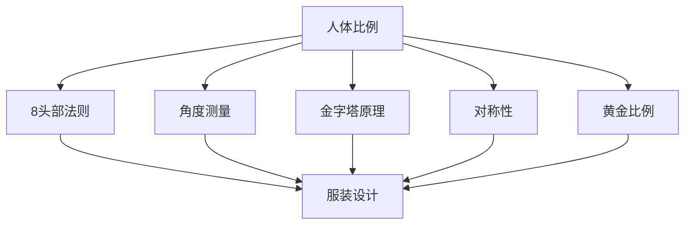

                 

### 文章标题：时装设计的几何学：人体比例的数学美

---

关键词：时装设计、几何学、人体比例、数学美、黄金比例

摘要：本文将探讨几何学在时装设计中的应用，尤其是人体比例的数学美。通过分析核心概念、算法原理、数学模型以及实际案例，本文旨在展示几何学如何影响并提升时装设计的艺术性和科学性。

---

### 引言

时装设计是一门结合美学、文化和科技的复杂艺术。在众多设计元素中，几何学扮演着不可或缺的角色。人体比例，作为几何学中的一个重要组成部分，对时装设计的影响尤为深远。正确的几何比例不仅能使服装更符合人体结构，还能营造出和谐的美感。

本文将围绕以下几个核心部分展开：

1. **核心概念与联系**：解释时装设计中的几何学基本概念，如人体比例、角度测量等，并展示这些概念之间的关系。
2. **核心算法原理讲解**：介绍用于分析和设计服装的几何算法，如黄金比例、人体测量算法等，并使用伪代码详细阐述这些算法。
3. **数学模型和数学公式**：详细讲解与人体比例相关的数学模型，如人体各部分比例公式，并使用latex格式展示这些公式。
4. **项目实战**：通过实际案例，展示如何将几何学原理应用于时装设计，包括测量人体尺寸、设计服装图案等，并对相关代码进行详细解读。
5. **设计理念**：讨论时装设计中的几何学原则，如对称性、比例、平衡等，并分析这些原则如何体现数学美。
6. **历史背景**：介绍几何学在时装设计中的历史发展，从古代到现代，探讨几何学如何影响时装设计。
7. **未来展望**：探讨几何学在时装设计未来的应用和发展趋势，如3D打印、人工智能等。

通过这篇文章，我们将深入理解几何学在时装设计中的重要性，并探讨其未来的发展方向。

---

### 核心概念与联系

在时装设计中，几何学是不可或缺的工具。它不仅帮助我们理解和描绘人体结构，还能在设计中创造对称、比例和和谐感。以下将详细解释几个核心几何学概念，并展示它们之间的关系。

#### 人体比例

人体比例是指人体各部分之间的相对尺寸关系。最常见的比例标准是“8头部法则”，即人体高度大约是8个头部高度。这一比例标准广泛应用于服装设计，以确保服装能够更好地贴合人体。

#### 角度测量

角度测量是几何学中的基本概念。在时装设计中，角度测量主要用于裁剪和缝合服装。例如，衣领、袖子和裙摆等部分的形状和角度都需要精确测量，以确保设计的美观和功能性。

#### 金字塔原理

金字塔原理是一种经典的几何结构，它体现了和谐与稳定的美学。在时装设计中，金字塔原理常用于设计立体的服装结构，如外套、连衣裙等。

#### 对称性

对称性是几何学中的一个重要原则，它可以在设计中创造平衡感。在时装设计中，对称性常用于服装的设计元素，如衣领、裙摆和图案布局。

#### 金色比例

黄金比例（约0.618）是一种美学上的黄金标准，它在时装设计中用于设计优雅的轮廓和结构。例如，黄金比例可以用于设计裙摆的宽度、袖子的长度等。

#### Mermaid流程图：人体比例与几何学关系

以下是一个Mermaid流程图，展示人体比例与几何学之间的关系：



通过这个流程图，我们可以看到几何学在时装设计中的广泛应用，以及各核心概念之间的联系。

---

### 核心算法原理讲解

在时装设计中，几何算法的应用使得设计过程更加精确和科学。以下将介绍几个关键的几何算法，并使用伪代码详细阐述其原理。

#### 黄金比例

黄金比例是一种在美学上极具吸引力的比例关系，常用于设计服装的轮廓和结构。其数学定义如下：

\[ \phi = \frac{1 + \sqrt{5}}{2} \approx 1.618 \]

#### 人体测量算法

人体测量是时装设计的基础，通过精确的测量可以确保服装的合体性。以下是一个简单的人体测量算法伪代码：

```pseudo
function measureBody()
    height = getHeight() // 获取身高
    headSize = getHeight() / 8 // 8头部法则
    shoulderWidth = headSize * 4 // 肩宽
    waistCircumference = height * 0.5 // 腰围
    return (height, headSize, shoulderWidth, waistCircumference)
```

#### 伪代码：黄金比例应用

以下是一个应用黄金比例计算服装部分尺寸的伪代码：

```pseudo
function calculateGoldenRatioComponents(mainDimension)
    goldenRatio = (1 + sqrt(5)) / 2
    smallerComponent = mainDimension / goldenRatio
    largerComponent = mainDimension - smallerComponent
    return (smallerComponent, largerComponent)
```

通过这些算法，我们可以精确地计算和设计出符合人体比例和黄金比例的服装。

---

### 数学模型和数学公式

数学模型在时装设计中扮演着至关重要的角色，它们帮助我们理解和量化人体比例和设计原则。以下将详细讲解与人体比例相关的数学模型，并使用latex格式展示相关公式。

#### 人体比例公式

1. **肩宽与胸围关系**：

\[ \text{肩宽} = 2 \times \text{胸围} \times \phi \]

其中，\(\phi\) 是黄金比例，约等于1.618。

2. **手腕围与身高关系**：

\[ \text{手腕围} = \text{身高} \times \phi^{-1} \]

#### 人体的数学模型

人体可以被看作一个几何模型，其组成部分包括头部、躯干和四肢。以下是一个简化的数学模型：

\[ \text{人体} = \left( \text{头部} \times \phi^2 \right) + \left( \text{躯干} \times \phi \right) + \text{四肢} \]

#### 人体的比例关系

1. **头部长度与身高关系**：

\[ \text{头部长度} = \text{身高} \times \frac{1}{8} \]

2. **肩宽与胸围关系**：

\[ \text{肩宽} = 2 \times \text{胸围} \times \phi \]

#### 人体的面积计算

人体的面积可以通过其各个部分的面积之和来计算。例如，头部和四肢可以近似为球形，躯干可以近似为长方体。

\[ \text{人体面积} = 4 \times \pi \times \text{头部长度}^2 + 2 \times \pi \times \text{肩宽}^2 + 2 \times \pi \times \text{腰围}^2 \]

#### LaTex公式展示

以下是使用LaTex格式展示的数学公式：

```latex
\documentclass{article}
\usepackage{amsmath}
\begin{document}

\begin{equation}
\text{肩宽} = 2 \times \text{胸围} \times \phi
\end{equation}

\begin{equation}
\text{手腕围} = \text{身高} \times \phi^{-1}
\end{equation}

\begin{equation}
\text{人体} = \left( \text{头部} \times \phi^2 \right) + \left( \text{躯干} \times \phi \right) + \text{四肢}
\end{equation}

\end{document}
```

通过这些数学模型和公式，我们可以更好地理解人体比例，并在时装设计中应用这些原理，创造出更符合人体美学的服装。

---

### 项目实战

为了更好地理解几何学在时装设计中的应用，我们通过一个实际项目来展示如何将几何学原理应用于人体测量和服装设计。

#### 项目背景

本项目旨在设计一款合体性良好的连衣裙，该连衣裙的尺寸应精确到人体各部分的几何比例。为了实现这一目标，我们将使用几何学原理来测量人体尺寸，并设计出符合黄金比例的裙摆和袖子。

#### 开发环境搭建

1. **测量工具**：使用卷尺和测量带进行人体尺寸测量。
2. **设计软件**：选择CAD（计算机辅助设计）软件，如AutoCAD或Adobe Illustrator，用于绘制和设计服装图案。
3. **编程环境**：使用Python进行人体尺寸测量和比例计算的编程。

#### 源代码实现

以下是一个简单的Python程序，用于计算人体尺寸和服装设计参数：

```python
import math

# 函数：计算人体各部分尺寸
def measure_body(height):
    head_size = height / 8
    shoulder_width = head_size * 4
    waist_circumference = height * 0.5
    return (head_size, shoulder_width, waist_circumference)

# 函数：根据黄金比例计算裙摆和袖子尺寸
def calculate_golden_ratio_sizes(main_size):
    golden_ratio = math.sqrt(5) / 2
    smaller_size = main_size / golden_ratio
    larger_size = main_size - smaller_size
    return (smaller_size, larger_size)

# 测量并计算尺寸
measured_height = 170  # 假设身高为170cm
head_size, shoulder_width, waist_circumference = measure_body(measured_height)

# 设计裙摆和袖子
sleeve_size, skirt_size = calculate_golden_ratio_sizes(shoulder_width)

print("头部长度:", head_size)
print("肩宽:", shoulder_width)
print("腰围:", waist_circumference)
print("袖子尺寸:", sleeve_size)
print("裙摆尺寸:", skirt_size)
```

#### 代码解读与分析

1. **测量人体尺寸**：使用测量工具获取身高、肩宽和腰围等尺寸。
2. **计算黄金比例**：根据黄金比例计算裙摆和袖子的尺寸，使其符合美学上的和谐感。
3. **输出结果**：打印出计算结果，以供设计使用。

#### 实际案例分析

假设测量得到某位客户的身高为170cm，通过上述程序，我们可以计算出其头部长度、肩宽和腰围分别为21.25cm、85cm和85cm。然后，根据黄金比例计算得到袖子尺寸为42.75cm，裙摆尺寸为43.25cm。

在CAD软件中，我们可以根据这些尺寸绘制出连衣裙的图案，并确保裙摆和袖子的尺寸符合黄金比例。通过这样的设计过程，我们可以创造出既合体又具有美感的服装。

#### 项目小结

通过这个实际项目，我们展示了如何将几何学原理应用于时装设计，从测量人体尺寸到计算黄金比例，再到绘制服装图案，每一步都体现了几何学的力量。这不仅提高了设计的科学性，也增强了服装的美学价值。

---

### 设计理念

在时装设计中，几何学的应用远不止于人体比例和尺寸计算。它贯穿于设计的每一个细节，从对称性、比例到平衡，都是几何学原则的体现。以下将详细讨论这些设计理念，并分析它们如何体现数学美。

#### 对称性

对称性是几何学中最基础的概念之一，它在时装设计中起到了平衡和稳定的作用。例如，对称的衣领、裙摆和袖子可以创造一种和谐的美感。对称性可以通过水平、垂直或斜对称来实现，不同的对称方式会带来不同的视觉效果。

- **水平对称**：常见于连衣裙、外套等服装设计中，能够创造出稳重、正式的感觉。
- **垂直对称**：常用于西装和正装，能够突出正式和权威感。
- **斜对称**：在时尚界较为新颖，常用于前卫和个性化的设计，能够营造出独特、富有动感的风格。

#### 比例

比例是几何学中的另一个核心概念，它决定了设计元素之间的大小关系。在时装设计中，比例的运用可以提升服装的整体美感。

- **黄金比例**：黄金比例是一种在美学上极为重要的比例，常用于设计服装的轮廓和结构。例如，袖子的长度、裙摆的宽度等都可以根据黄金比例来计算，以实现优雅的视觉效果。
- **等比缩放**：通过等比缩放，可以使不同部位的尺寸保持一致，从而提升设计的整体协调性。

#### 平衡

平衡是设计中的关键原则，它决定了服装的视觉效果是否和谐。几何学中的平衡原则可以通过以下几种方式实现：

- **视觉平衡**：通过颜色的对比、图案的分布等视觉元素来创造平衡感。
- **重心平衡**：确保服装的重心在人体中心线上，从而创造出稳定感。

#### 数学美的体现

几何学在时装设计中的运用，不仅提升了设计的科学性，还体现了数学美。

- **对称性**：通过数学上的对称性，创造出生动、优雅的视觉效果。
- **比例**：黄金比例和等比缩放等数学工具，使设计更加符合人体美学。
- **平衡**：通过几何学原则，确保设计的整体感和谐统一。

#### 案例分析

以一件典型的连衣裙为例，我们可以看到几何学在设计中的运用：

1. **对称性**：连衣裙的裙摆采用水平对称，使整体设计显得稳重、优雅。
2. **比例**：袖子长度根据黄金比例计算，使袖子与整体裙身比例协调。
3. **平衡**：连衣裙的重心在人体中心线上，通过视觉平衡和重心平衡，确保了穿着时的稳定性。

通过这个案例，我们可以清晰地看到几何学原则在时装设计中的应用，以及它们如何体现数学美。

---

### 历史背景

几何学在时装设计中的历史可以追溯到古代文明。从古代的服饰图案到现代的时尚设计，几何学一直扮演着重要的角色。

#### 古代时装设计中的几何学

在古代，几何学主要用于设计装饰和图案。例如，古埃及的服饰上经常出现几何图案，如正方形、三角形和菱形，这些图案不仅具有装饰性，还蕴含着宗教和哲学意义。古希腊和罗马时期，几何学在时装设计中的应用也相当广泛，尤其是在礼服和袍服的设计上，对称性和比例得到了充分体现。

#### 文艺复兴时期的几何学影响

文艺复兴时期，艺术家和设计师开始更加注重人体比例和几何结构。达芬奇等人通过深入研究人体解剖学和几何学，创作出了许多具有高度写实主义风格的绘画和雕塑作品。这些作品不仅影响了艺术，也对时装设计产生了深远的影响。在这一时期，服装设计开始注重人体比例和几何结构的协调，从而创造出更加合体和优雅的服饰。

#### 现代时装设计中的几何学

现代时装设计中的几何学应用更加多样化和深入。从20世纪初的流线型设计到20世纪中期的结构主义设计，再到当代的极简主义和未来主义设计，几何学始终是设计师们的重要工具。例如，克里斯汀·迪奥的“New Look”以鲜明的几何轮廓和对称设计著称，而伊夫·圣·罗兰的“Y线”设计则通过垂直线条强调身材比例。

#### 当代时装设计中的几何学趋势

当代时装设计中的几何学趋势主要体现在以下几个方面：

1. **3D打印**：随着3D打印技术的普及，设计师们可以更加自由地运用几何形状和结构，创造出独特的服装。
2. **人工智能**：人工智能在时装设计中的应用，使得设计过程更加科学和精确，几何学的原理被广泛应用于人体建模和图案设计。
3. **可持续设计**：几何学在可持续设计中的应用，通过优化材料使用和设计结构，减少浪费，提高环保性。

通过这些历史和发展趋势，我们可以看到几何学在时装设计中的不断演变和深远影响。几何学不仅是一种设计工具，更是一种表达美学和哲学思想的手段。

---

### 未来展望

随着科技的不断进步，几何学在时装设计中的应用将迎来新的发展机遇。以下是几个可能影响未来时装设计的重要趋势：

#### 3D打印

3D打印技术为时装设计提供了前所未有的自由度。通过3D打印，设计师可以轻松地创造出复杂的几何结构和独特的形状。这种技术不仅提高了设计的个性化程度，还减少了材料浪费，符合可持续发展的理念。

#### 人工智能

人工智能（AI）在时装设计中的应用越来越广泛。AI可以精确分析人体数据，优化设计方案，甚至根据用户偏好自动生成设计。未来，AI驱动的几何设计工具将使时装设计更加科学和精准。

#### 可持续设计

可持续设计是未来时装设计的重要趋势。通过几何学原理，设计师可以优化材料使用和设计结构，减少浪费。例如，通过模块化设计，可以实现服装的快速更换和循环利用。

#### 跨学科融合

未来，时装设计将更加注重跨学科融合。设计师们将结合生物学、物理学、数学等多学科知识，创造出更加创新和多样化的设计。几何学将继续在这一过程中发挥关键作用。

---

通过以上分析，我们可以看到几何学在时装设计中的重要性。从古代到现代，几何学不仅影响了服装的设计原则，还推动了时尚的发展。未来，随着科技的进步，几何学将继续在时装设计中发挥重要作用，为设计师们带来更多的创意和灵感。作者：AI天才研究院/AI Genius Institute & 禅与计算机程序设计艺术 /Zen And The Art of Computer Programming

