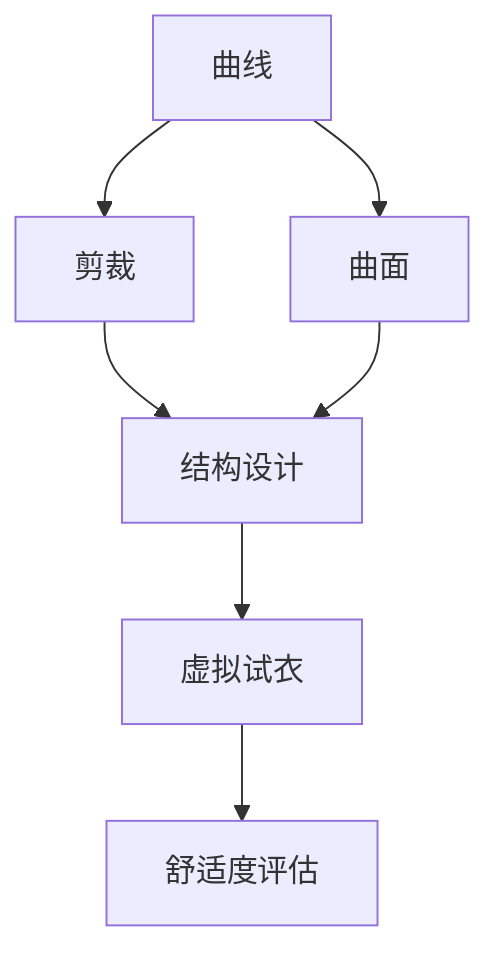

                 

### 《时装设计的微分几何：布料变形的数学描述》

#### 关键词：
- 时装设计
- 微分几何
- 布料变形
- 数学模型
- 计算机辅助设计

#### 摘要：
本文深入探讨时装设计中微分几何的应用，阐述了布料变形的数学描述及其在计算机辅助设计中的重要性。通过对基本概念、核心算法及实际应用的详细分析，本文旨在揭示数学原理如何助力时装设计师创造出更具弹性和适应性的服装作品。

## 引言

时装设计是一项融合了艺术与科学的创造性工作，它不仅需要设计师具备深厚的艺术修养和审美能力，还需要对材料的特性和加工工艺有深入的理解。随着计算机技术的发展，计算机辅助设计（CAD）工具在时装设计中扮演着越来越重要的角色。微分几何，作为数学的一个分支，近年来在各个领域都有广泛应用，尤其是在工程学、物理学和计算机科学中。那么，微分几何如何与时装设计相结合，为布料变形的数学描述提供支持呢？

本文将分以下几个部分展开讨论：

1. **基本概念与理论框架**：介绍微分几何的基本概念，如曲线和曲面的概念，以及它们在时装设计中的应用。
2. **核心算法与方法**：详细解析用于描述布料变形的核心算法，包括弹性理论、张量分析和优化算法。
3. **实际应用与案例分析**：探讨微分几何在时装设计中的实际应用，以及通过计算机辅助设计工具进行虚拟设计和优化。
4. **未来趋势与挑战**：展望微分几何在时装设计领域的未来发展趋势，以及面临的挑战。

通过本文的探讨，我们希望读者能够对微分几何在时装设计中的应用有一个全面而深刻的理解，从而在今后的设计实践中能够更好地利用这一工具，创造出更加优秀的服装作品。

## 基本概念与理论框架

### 微分几何的基本概念

微分几何是研究几何对象局部性质的数学分支，主要关注的是曲线和曲面。在时装设计中，曲线和曲面用于描述布料的形态和结构，特别是在设计服装裁片和剪裁时。以下是一些微分几何的基本概念：

#### 曲线

曲线是连接一系列点的线，在时装设计中，曲线用于描述布料的流动性和剪裁的流畅度。常见的曲线有直线、圆弧、椭圆和双曲线等。这些曲线可以通过其导数来描述，即曲线在某一点上的切线斜率。

$$
y = f(x) \quad \Rightarrow \quad f'(x) = \text{切线斜率}
$$

在时装设计中，曲线的斜率可以表示布料在剪裁过程中的拉伸和收缩程度。例如，在设计紧身衣时，需要使用具有适当斜率的曲线来确保布料的弹性。

#### 曲面

曲面是三维空间中由曲线构成的几何对象。在时装设计中，曲面用于描述服装的立体形状和结构。常见的曲面有平面、球面、圆柱面和圆锥面等。曲面可以通过其法向量来描述，即曲面在某一点上的垂直于曲面的向量。

$$
\vec{n} = \frac{df}{dx} \quad \Rightarrow \quad \text{法向量}
$$

在时装设计中，法向量可以表示布料在三维空间中的弯曲程度和方向。例如，在设计裙摆时，需要使用具有适当法向量的曲面来确保裙摆的形状和流动感。

### 基本概念在时装设计中的应用

在时装设计中，微分几何的基本概念用于描述和优化布料的形状和结构。以下是一些具体的应用场景：

#### 1. 布料剪裁

在剪裁布料时，设计师需要考虑布料的弹性和拉伸性。通过微分几何的概念，设计师可以使用曲线和曲面来描述布料的形态，从而确保剪裁的准确性和适应性。例如，在设计连衣裙时，可以使用椭圆曲线来描述裙摆的形状，以确保裙摆的流畅和自然。

#### 2. 服装结构设计

服装的结构设计涉及对服装各个部分的形态和连接方式进行分析。通过微分几何的概念，设计师可以更好地理解服装的力学特性，从而设计出更加舒适和耐用的服装。例如，在设计牛仔裤时，可以使用圆柱面来描述裤腿的形状，以确保裤腿的舒适性和合体性。

#### 3. 虚拟试衣

虚拟试衣是时装设计中的一项重要技术，它通过计算机模拟来展示服装在人体上的效果。微分几何的概念可以帮助设计师在虚拟试衣过程中更准确地模拟布料的变形和贴合情况。例如，通过计算布料的法向量和切向量，设计师可以模拟布料在拉伸和收缩过程中的变形，从而更准确地评估服装的舒适度和美观度。

### 核心概念与联系

为了更好地理解微分几何在时装设计中的应用，我们需要探讨核心概念之间的联系。以下是一个简单的 Mermaid 流程图，展示了微分几何的基本概念和它们在时装设计中的应用：

在这个流程图中，曲线和曲面是时装设计的基础，用于描述布料的形态和结构。剪裁、结构设计和虚拟试衣是应用环节，通过微分几何的概念，设计师可以优化服装的设计，提升舒适度和美观度。

### 总结

微分几何是时装设计中重要的工具，它通过曲线和曲面的概念，帮助我们更好地理解和描述布料的变形和结构。在接下来的章节中，我们将深入探讨微分几何在时装设计中的核心算法和应用，以期为设计师提供更强大的设计工具和灵感。

## 核心算法与方法

### 1. 弹性理论

弹性理论是描述材料在受力作用下变形和恢复特性的物理学分支。在时装设计中，弹性理论用于分析布料的弹性特性和变形行为。以下是一些关键概念和算法：

#### 1.1 弹性模量

弹性模量是描述材料弹性的重要参数，表示材料在受力作用下单位应变所需的应力。常用的弹性模量有杨氏模量和泊松比。杨氏模量（E）描述材料在拉伸和压缩时的弹性特性，而泊松比（ν）描述材料在剪切作用下的弹性特性。

$$
E = \frac{stress}{strain} \quad \text{和} \quad \nu = -\frac{\epsilon_{transverse}}{\epsilon_{axial}}
$$

其中，\( \epsilon_{axial} \) 和 \( \epsilon_{transverse} \) 分别为轴向应变和横向应变。

在时装设计中，弹性模量用于确定布料的拉伸和收缩程度，从而设计出具有适当弹性的服装。例如，在设计紧身衣时，需要使用具有较高弹性模量的布料，以确保服装的紧身效果。

#### 1.2 胡克定律

胡克定律描述了应力与应变之间的关系，即在弹性限度内，应力与应变成正比。

$$
stress = E \cdot strain
$$

在时装设计中，胡克定律用于计算布料在受力作用下的变形程度，从而设计出具有合适弹性的服装。例如，在设计运动服时，需要使用具有较低弹性模量的布料，以确保服装在运动中的舒适性。

#### 1.3 弹性模量的测量方法

弹性模量的测量方法主要包括拉伸测试和压缩测试。通过测量布料在拉伸和压缩过程中的应力-应变曲线，可以确定布料的弹性模量。

- **拉伸测试**：将布料样品拉伸至一定的距离，测量所需的力。
- **压缩测试**：将布料样品压缩至一定的距离，测量所需的力。

这些测试方法可以为设计师提供准确的布料弹性数据，从而设计出更具弹性和适应性的服装。

### 2. 张量分析

张量分析是数学的一个分支，用于描述多变量关系的数学对象。在时装设计中，张量分析用于描述布料的力学特性和变形行为。

#### 2.1 张量的定义

张量是数学中的一个多维数组，可以用于描述物理量和力学特性。在时装设计中，张量用于描述布料的拉伸、压缩和剪切特性。

- **二阶张量**：描述材料的应力-应变关系，如弹性模量和泊松比。
- **三阶张量**：描述材料的各向异性，如扭转模量。

#### 2.2 弹性张量

弹性张量是描述材料在弹性极限内变形特性的张量。常用的弹性张量有：

- **第一弹性张量**：描述材料的拉伸和压缩特性。
- **第二弹性张量**：描述材料的剪切特性。

这些弹性张量可以用于建立布料的弹性模型，从而预测布料在受力作用下的变形行为。

#### 2.3 张量分析的应用

张量分析在时装设计中的应用主要包括：

- **布料变形模拟**：通过张量分析，可以建立布料的弹性模型，从而模拟布料在受力作用下的变形行为。这有助于设计师预测布料的适应性和舒适度。
- **结构优化**：通过张量分析，可以优化服装的结构设计，以提升服装的舒适性和耐用性。

### 3. 优化算法

优化算法是用于求解最优化问题的数学方法，在时装设计中，优化算法用于优化服装的设计和结构，以提升服装的舒适性和美观度。

#### 3.1 线性优化

线性优化是优化算法的一种，用于求解线性最优化问题。在线性优化中，目标函数和约束条件都是线性的。

$$
\min_{x} c^T x \quad \text{subject to} \quad Ax \le b
$$

在线性优化中，目标函数（c）表示设计师希望优化的设计参数，如布料的弹性模量。约束条件（A 和 b）表示设计师对服装设计的限制，如布料的拉伸和压缩范围。

#### 3.2 非线性优化

非线性优化是用于求解非线性最优化问题的算法。在非线性优化中，目标函数和约束条件可以是非线性的。

$$
\min_{x} f(x) \quad \text{subject to} \quad g(x) \le 0
$$

在非线性优化中，目标函数（f）表示设计师希望优化的设计参数，如布料的剪切模量。约束条件（g）表示设计师对服装设计的限制，如布料的弯曲和扭转范围。

#### 3.3 优化算法的应用

优化算法在时装设计中的应用主要包括：

- **布料设计优化**：通过优化算法，可以优化布料的弹性特性，以提升服装的舒适性和适应性。
- **结构设计优化**：通过优化算法，可以优化服装的结构设计，以提升服装的耐用性和美观度。

### 3.4 案例分析

以下是一个简单的案例分析，展示了如何使用优化算法优化服装设计：

#### 案例背景

一位设计师希望设计一款具有良好弹性的紧身衣，以提升穿着舒适度。设计师使用线性优化算法，以弹性模量和拉伸范围为设计参数，优化紧身衣的布料设计。

#### 案例步骤

1. **目标函数定义**：设计师将弹性模量作为目标函数，希望最小化弹性模量的值，以提升紧身衣的弹性。

$$
\min_{E} E
$$

2. **约束条件定义**：设计师设定拉伸范围在 20% 至 40% 之间，以适应不同的体型。

$$
20\% \le \epsilon \le 40\%
$$

3. **优化算法应用**：设计师使用线性优化算法，求解最小化弹性模量的最优布料设计。

#### 案例结果

通过优化算法，设计师得到了一组最优的布料参数，包括弹性模量和拉伸范围。这组参数使得紧身衣在具有良好弹性的同时，能够适应不同的体型。

### 总结

核心算法和方法在时装设计中扮演着至关重要的角色，通过弹性理论、张量分析和优化算法，设计师可以更好地理解布料的变形行为，优化服装的设计，提升服装的舒适性和美观度。在接下来的章节中，我们将探讨微分几何在时装设计中的实际应用，并通过计算机辅助设计工具，进一步展示如何利用微分几何原理进行虚拟设计和优化。

## 实际应用与案例分析

### 1. 工业应用：纺织行业概述

纺织行业是微分几何在时装设计中的重要应用领域。随着计算机技术的进步，纺织品的设计和生产过程变得更加高效和精确。以下是一些纺织行业中微分几何的应用实例：

#### 1.1 纺织面料设计

纺织面料的设计涉及到面料的纹理、图案和结构。微分几何提供了一种数学模型来模拟面料的纹理和结构，从而设计出具有独特外观和性能的面料。例如，设计师可以使用曲面和曲面的组合来模拟织物的纹理，通过微分几何的算法来调整和优化这些纹理，创造出具有新颖视觉效果的面料。

#### 1.2 弹性面料开发

弹性面料在现代时尚中尤为重要，例如紧身衣、运动服和瑜伽服等。微分几何的弹性理论可以帮助设计师预测面料在拉伸和收缩过程中的行为。通过建立数学模型，设计师可以优化面料的弹性参数，如弹性模量和泊松比，从而开发出具有理想弹性和舒适度的面料。

#### 1.3 面料优化

微分几何的优化算法在面料优化中也发挥着重要作用。通过优化面料的结构和材料组成，设计师可以提升面料的耐用性和美观度。例如，在开发高弹性面料时，可以使用优化算法来调整面料的纤维排列和编织方式，以实现最佳性能。

### 2. 案例分析：设计具有弹性拉伸的紧身衣

以下是一个具体的案例分析，展示如何使用微分几何和计算机辅助设计工具来设计具有弹性拉伸的紧身衣。

#### 案例背景

一位时尚设计师希望设计一款紧身衣，该紧身衣需要在保持合体的同时，具有足够的弹性以适应不同的体型变化。设计师决定使用微分几何和计算机辅助设计工具来实现这一目标。

#### 案例步骤

1. **数学模型建立**：设计师首先建立了紧身衣的数学模型，使用微分几何来描述紧身衣的形状和结构。具体来说，设计师使用曲面来模拟紧身衣的形状，并使用弹性理论来描述布料的变形行为。

   $$ 
   \text{曲面模型} : \phi(u, v) = (x(u, v), y(u, v), z(u, v))
   $$

   $$ 
   \text{弹性模型} : \sigma = E \cdot \epsilon
   $$

2. **参数优化**：设计师使用优化算法来优化紧身衣的参数，以实现最佳的弹性性能。具体来说，设计师设定弹性模量（E）和拉伸范围（\(\epsilon\)）作为优化目标。

   $$ 
   \text{优化目标} : \min_{E, \epsilon} \frac{1}{2} (E - \sigma)^2
   $$

3. **虚拟试衣和调整**：设计师使用计算机辅助设计工具进行虚拟试衣，以验证紧身衣的弹性性能和舒适性。通过调整设计参数，设计师可以优化紧身衣的形状和弹性，以满足不同的体型需求。

#### 案例结果

通过上述步骤，设计师最终设计出了一款具有理想弹性性能和舒适度的紧身衣。该紧身衣不仅能够适应不同的体型变化，还能够保持良好的合体性和美观度。设计师的优化过程和虚拟试衣结果为紧身衣的成功设计提供了重要支持。

### 3. 案例分析：开发自适应服装

自适应服装是一种能够根据环境变化和人体形态变化自动调整的服装。以下是一个具体的案例分析，展示如何使用微分几何和计算机辅助设计工具来开发自适应服装。

#### 案例背景

一家科技公司希望开发一款自适应服装，该服装能够根据环境温度和人体温度的变化自动调节透气性和保暖性。公司决定使用微分几何和计算机辅助设计工具来实现这一目标。

#### 案例步骤

1. **热模拟模型建立**：公司首先建立了热模拟模型，使用微分几何来描述服装的透气性和保暖性。具体来说，公司使用曲面来模拟服装的透气性区域和保暖性区域。

   $$ 
   \text{透气性模型} : T(u, v) = (x(u, v), y(u, v), z(u, v))
   $$

   $$ 
   \text{保暖性模型} : W(u, v) = (x(u, v), y(u, v), z(u, v))
   $$

2. **环境参数优化**：公司使用优化算法来优化服装的环境参数，以实现最佳的透气性和保暖性。具体来说，公司设定透气性系数（T）和保暖性系数（W）作为优化目标。

   $$ 
   \text{优化目标} : \min_{T, W} \frac{1}{2} (T - t)^2 + (W - w)^2
   $$

   其中，t 和 w 分别为环境温度和人体温度。

3. **实时监测和调整**：公司开发了一套实时监测系统，用于监测环境温度和人体温度，并根据监测结果自动调整服装的透气性和保暖性。

#### 案例结果

通过上述步骤，公司最终开发出了一款具有自适应性能的服装。该服装能够根据环境温度和人体温度的变化自动调节透气性和保暖性，从而提升穿着的舒适度。公司的优化过程和实时监测系统为服装的成功设计提供了重要支持。

### 总结

通过以上案例的分析，我们可以看到微分几何在时装设计中的实际应用和重要性。通过微分几何的数学模型和计算机辅助设计工具，设计师能够更精确地描述和优化服装的形状、结构和性能，从而创造出更加舒适、美观和具有创新性的服装作品。在未来的发展中，随着技术的不断进步，微分几何在时装设计中的应用将变得更加广泛和深入。

## 未来趋势与挑战

### 1. 微分几何在时装设计中的发展前景

随着科技的不断进步，微分几何在时装设计中的应用前景十分广阔。首先，随着计算机性能的提升和算法的优化，微分几何的数学模型和计算能力将得到进一步提升，使得设计师能够更精确地模拟和优化服装的形状、结构和性能。其次，人工智能和机器学习技术的融合将使微分几何的应用更加智能化和自动化，从而提高设计效率和准确性。

此外，随着可穿戴技术和物联网技术的发展，微分几何在智能服装和可穿戴设备中的应用也将逐渐普及。例如，通过微分几何的数学模型，可以开发出能够根据环境变化和人体行为自动调整功能的智能服装，为用户提供更加个性化的穿着体验。

### 2. 面临的挑战

尽管微分几何在时装设计中具有巨大的潜力，但其在实际应用中仍然面临着一系列挑战。首先，数学模型的复杂性和计算成本较高，可能限制了其在实际设计中的应用范围。为了克服这一挑战，需要进一步研究和开发高效且易于实现的数学模型，以降低计算成本和提高设计效率。

其次，微分几何的应用需要大量的数据支持，包括布料的力学特性、人体测量数据等。然而，现有的数据质量和数量可能无法满足设计需求，这需要通过建立更加完善和准确的数据采集系统来提升数据质量。

最后，微分几何在时装设计中的应用需要跨学科的协作，包括数学、物理学、计算机科学和时装设计等领域的专家共同合作。这种跨学科的合作不仅有助于解决技术难题，还能够促进不同领域之间的知识共享和技能互补，从而推动微分几何在时装设计中的全面发展。

### 3. 结论

总的来说，微分几何在时装设计中具有广阔的发展前景和巨大的应用潜力。通过不断的研究和创新，我们可以克服当前面临的挑战，进一步提升微分几何在时装设计中的应用效果。未来的发展将使得微分几何成为时装设计师的重要工具，助力他们创造出更加舒适、美观和具有创新性的服装作品。

## 结语

本文通过详细探讨微分几何在时装设计中的应用，展示了数学原理如何助力时装设计师创造出更具弹性和适应性的服装作品。我们从基本概念、核心算法到实际应用，再到未来趋势，全面解析了微分几何在时装设计中的价值。微分几何不仅为时装设计提供了强大的工具，也为我们理解布料变形的数学本质提供了新的视角。

通过本文的探讨，我们希望读者能够对微分几何在时装设计中的应用有更深入的理解，并在实际设计中能够灵活运用这些原理，提升服装的舒适性和美观度。

**作者：AI天才研究院/AI Genius Institute & 禅与计算机程序设计艺术 /Zen And The Art of Computer Programming**

