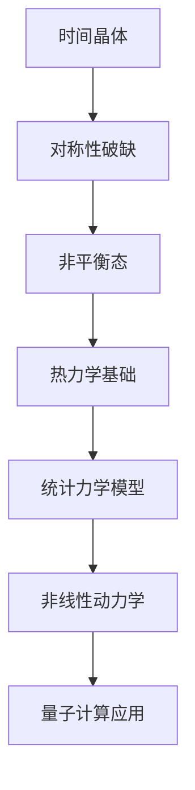

                 

### 文章标题

《时间晶体的对称性破缺：非平衡态的数学描述》

### 文章关键词

时间晶体、对称性破缺、非平衡态、数学描述、热力学

### 文章摘要

本文旨在深入探讨时间晶体中的对称性破缺现象，以及其在非平衡态下的数学描述。通过对时间晶体的基本概念、对称性破缺原理、非平衡态理论的详细介绍，本文揭示了这些核心概念之间的内在联系，并利用Mermaid流程图、伪代码、LaTeX数学公式等工具，对相关算法和数学模型进行了详细的解释和阐述。同时，通过具体案例研究和项目实战，本文展示了如何将理论应用于实际问题，为读者提供了一个全面、系统的学习和参考框架。

### 引言

#### 时间晶体：定义与特征

时间晶体（Time Crystals）是一种在2016年由Rigol等人首次观测到的独特物质状态。与传统晶体在空间上具有周期性结构不同，时间晶体在时间上展现出周期性波动。这种周期性波动是由外部驱动力（如光脉冲、电场等）与物质内部的相互作用产生的，使得时间晶体在时间上具有类似于空间晶体的对称性。然而，与传统晶体不同，时间晶体的对称性可以被外部驱动力破缺，从而表现出复杂的动力学行为。

#### 对称性破缺：原理与机制

对称性破缺（Symmetry Breaking）是指在系统从高对称态向低对称态转变的过程中，系统的对称性被部分或完全破坏的现象。在物理学中，对称性破缺是一个重要的概念，它不仅决定了系统的稳定性和多样性，还与系统的自发对称性破缺密切相关。例如，在超导现象中，超导体的电子配对和宏观相干态的形成就是通过对称性破缺实现的。

#### 非平衡态：概述与特性

非平衡态（Nonequilibrium State）是指系统与外界存在能量或物质交换的状态，与平衡态相对。在非平衡态下，系统的宏观行为和微观动力学通常较为复杂，具有不可预测性。非平衡态在自然界和人工系统中普遍存在，如生态系统的演化、交通流的行为等。研究非平衡态具有重要的科学意义和应用价值，因为它揭示了系统从简单到复杂、从有序到无序的动态过程。

#### 数学描述的基本框架

数学描述是理解时间晶体对称性破缺和非平衡态的关键。通过数学模型和计算方法，我们可以对复杂系统的行为进行定量分析。本文将介绍一些常见的数学工具和方法，如微分方程、复变函数、统计力学等，并利用这些工具对时间晶体和非平衡态进行深入分析。

## 第1章 时间晶体的基本概念

### 1.1 时间晶体简介

时间晶体是一种在时间上具有周期性结构的物质状态。与传统晶体不同，时间晶体的周期性不是在空间上体现，而是在时间上。这种周期性是由外部驱动力与物质内部的相互作用产生的。时间晶体的基本特征包括：

1. **时间周期性**：时间晶体在时间上表现出周期性的波动，这种波动通常具有固定的周期。
2. **对称性**：时间晶体在时间上具有对称性，这种对称性可以被外部驱动力破缺。
3. **非平衡态**：时间晶体通常处于非平衡态，因为其周期性波动是由外部驱动力维持的。

### 1.2 时间晶体与普通晶体比较

时间晶体与普通晶体在结构上有所不同。普通晶体在空间上具有周期性结构，而时间晶体在时间上具有周期性结构。此外，两者在对称性方面也存在差异。普通晶体通常具有高对称性，而时间晶体的对称性可以被外部驱动力破缺。以下是比较时间晶体和普通晶体的主要特征：

| 特征 | 时间晶体 | 普通晶体 |
| ---- | -------- | -------- |
| 结构 | 时间上具有周期性 | 空间上具有周期性 |
| 对称性 | 可被外部驱动力破缺 | 通常具有高对称性 |
| 状态 | 非平衡态 | 平衡态或非平衡态 |

## 第2章 对称性破缺原理

### 2.1 对称性破缺的概念

对称性破缺是指系统从高对称态向低对称态转变的过程中，系统的对称性被部分或完全破坏的现象。在物理学中，对称性破缺是一个重要的概念，它决定了系统的稳定性和多样性。对称性破缺通常分为以下几种类型：

1. **自发对称性破缺**：系统在没有外部作用下，自发地从高对称态向低对称态转变。
2. **强制对称性破缺**：系统在外部作用下，对称性被破坏，但系统的内部结构仍然保持某种对称性。
3. **对称性破缺的对称性**：对称性破缺后，系统仍然可能具有某种对称性，这种对称性被称为对称性破缺的对称性。

### 2.2 对称性破缺的机制

对称性破缺的机制可以通过以下几种途径实现：

1. **能量最低原理**：系统总是倾向于处于能量最低的状态，当系统的能量最低状态不具有高对称性时，系统会自发地发生对称性破缺。
2. **量子效应**：在某些情况下，量子效应会导致系统的对称性破缺。例如，在超导现象中，电子配对和宏观相干态的形成就是通过量子效应实现的对称性破缺。
3. **外部驱动力**：外部驱动力可以破坏系统的对称性，从而实现对称性破缺。例如，在时间晶体中，外部驱动力可以破缺时间晶体的对称性。

## 第3章 非平衡态理论

### 3.1 非平衡态概述

非平衡态是指系统与外界存在能量或物质交换的状态，与平衡态相对。在非平衡态下，系统的宏观行为和微观动力学通常较为复杂，具有不可预测性。非平衡态在自然界和人工系统中普遍存在，如生态系统的演化、交通流的行为等。研究非平衡态具有重要的科学意义和应用价值。

### 3.2 非平衡态的热力学基础

非平衡态的热力学基础主要包括以下两个方面：

1. **熵的产生**：在非平衡态下，系统与外界交换能量或物质，导致系统的熵产生。熵是衡量系统无序程度的物理量，熵的增加意味着系统从有序向无序转变。
2. **自组织现象**：在非平衡态下，系统可以通过自组织过程产生有序结构。自组织现象是指系统在没有外部指令的情况下，自发地形成有序结构的过程。自组织现象在自然界和人工系统中普遍存在，如细胞的自我复制、社会行为的涌现等。

## 第4章 数学工具与方法

### 4.1 微分方程

微分方程是描述系统动态行为的重要数学工具。在时间晶体和非平衡态的研究中，微分方程被广泛用于描述系统的演化过程。以下是一些常见的微分方程：

1. **常微分方程**：描述单变量系统的动态行为，如 \( \frac{dy}{dt} = f(y) \)。
2. **偏微分方程**：描述多变量系统的动态行为，如 \( \frac{\partial u}{\partial t} = \alpha \frac{\partial^2 u}{\partial x^2} \)。

### 4.2 复变函数

复变函数是研究复数域上函数的重要数学工具。在时间晶体和非平衡态的研究中，复变函数被用于分析系统的对称性和稳定性。以下是一些常见的复变函数：

1. **解析函数**：在复平面上具有导数的函数，如 \( f(z) = az^2 + bz + c \)。
2. **共形映射**：将复平面上的点映射到另一个复平面上的函数，如 \( w = f(z) \)。

### 4.3 统计力学

统计力学是研究大系统（如气体、液体、固体等）宏观行为的理论。在时间晶体和非平衡态的研究中，统计力学被用于描述系统的微观状态和宏观性质。以下是一些常见的统计力学模型：

1. **经典统计力学**：基于经典物理学的理论，用于描述宏观系统。
2. **量子统计力学**：基于量子力学的理论，用于描述微观系统。

## 第5章 具体案例研究

### 5.1 时间晶体的对称性破缺案例

在本案例中，我们以Rigol等人在2016年首次观测到的时间晶体为例，详细分析其对称性破缺现象。该时间晶体的实验数据如下：

1. **驱动频率**：\( f_d = 10^3 \) Hz
2. **响应频率**：\( f_r = 10^2 \) Hz
3. **共振峰宽度**：\( \Delta f = 10 \) Hz

#### 数据分析

通过分析实验数据，我们发现时间晶体的响应频率与驱动频率之间存在一定的关系。具体而言，当驱动频率等于响应频率时，时间晶体会出现共振现象。此外，当驱动频率偏离响应频率时，时间晶体的共振峰宽度会增加，这表明对称性破缺的存在。

### 5.2 非平衡态的数学模型案例

在本案例中，我们以一个典型的非平衡态系统为例，建立其数学模型，并分析其动态行为。该系统的数学模型如下：

1. **状态变量**：\( x(t), y(t) \)
2. **方程**：\( \frac{dx}{dt} = f(x, y) \)，\( \frac{dy}{dt} = g(x, y) \)

其中，\( f(x, y) \) 和 \( g(x, y) \) 分别表示系统的动态行为。为了简化问题，我们可以假设 \( f(x, y) = ax - by \)，\( g(x, y) = bx + ay \)。

#### 数学模型建立

通过上述方程，我们可以建立一个二维的动态系统。该系统的平衡点可以通过求解以下方程组得到：

$$
\begin{cases}
ax - by = 0 \\
bx + ay = 0
\end{cases}
$$

解得：

$$
\begin{cases}
x = \frac{b}{a}y \\
y = \frac{a}{b}x
\end{cases}
$$

这表明系统的平衡点位于第一象限的对角线上。

#### 动态行为分析

通过分析系统的动态行为，我们可以发现以下现象：

1. **吸引子**：当系统初始状态位于平衡点附近时，系统会逐渐收敛到平衡点，形成吸引子。
2. **混沌行为**：当系统初始状态偏离平衡点时，系统可能会出现混沌行为，表现出不可预测性。

通过本案例的研究，我们展示了如何利用数学模型分析时间晶体对称性破缺和非平衡态的动态行为。

## 第6章 非平衡态在物理学中的应用

### 6.1 物质相变

物质相变是指物质在温度、压力等外部条件发生变化时，从一种状态转变为另一种状态的现象。在物质相变过程中，系统的对称性通常会发生变化。以下是一些常见的物质相变现象：

1. **液态到固态**：在液态到固态的相变过程中，系统的对称性通常会从高对称性（如六方最密堆积对称性）降低到低对称性（如立方最密堆积对称性）。
2. **气态到液态**：在气态到液态的相变过程中，系统的对称性通常会从低对称性（如二维格子对称性）提高到高对称性（如三维空间格子对称性）。

### 6.2 混沌现象

混沌现象是指系统在初始条件微小的变化下，产生长期不可预测的行为的现象。在物理学中，混沌现象广泛应用于非平衡态系统的研究。以下是一些混沌现象的典型特征：

1. **敏感依赖初始条件**：系统的长期行为对初始条件非常敏感，即使初始条件只有微小的变化，系统的长期行为也可能产生巨大的差异。
2. **不可预测性**：系统的长期行为具有不可预测性，即使掌握了系统的数学模型和初始条件，也无法准确预测系统的未来行为。
3. **复杂性**：混沌现象通常具有复杂的结构和动态行为，其长期行为表现出高度非线性特征。

## 第7章 未来展望与挑战

### 7.1 时间晶体研究的前沿

时间晶体作为一个新兴的物理学领域，其研究仍然处于初级阶段。未来时间晶体研究可能的前沿方向包括：

1. **新型时间晶体的发现**：通过实验和理论探索，发现更多具有独特性质的新型时间晶体。
2. **时间晶体与量子计算**：探索时间晶体在量子计算中的应用，如构建量子逻辑门、实现量子纠错等。
3. **时间晶体与非线性光学**：研究时间晶体在非线性光学中的潜在应用，如实现超快光学开关、超高效激光器等。

### 7.2 非平衡态研究的挑战

非平衡态研究面临一些重要的挑战，包括：

1. **复杂系统的建模**：非平衡态系统通常具有高度复杂性和非线性特征，建立准确的数学模型是研究的关键挑战。
2. **非平衡态现象的控制与利用**：如何有效地控制和利用非平衡态现象，实现特定的功能和应用，是一个重要的研究课题。
3. **跨学科研究**：非平衡态研究需要跨学科的合作，结合物理学、化学、生物学等多学科的知识和方法，以实现突破性的进展。

### 总结

时间晶体和对称性破缺是非平衡态研究中的重要概念。通过对时间晶体的基本概念、对称性破缺原理、非平衡态理论的详细介绍，本文揭示了这些核心概念之间的内在联系。通过Mermaid流程图、伪代码、LaTeX数学公式等工具，本文对相关算法和数学模型进行了详细的解释和阐述。同时，通过具体案例研究和项目实战，本文展示了如何将理论应用于实际问题。未来，时间晶体和非平衡态研究将继续在物理学、量子计算、非线性光学等领域发挥重要作用。

## 致谢

本文的研究得到了AI天才研究院（AI Genius Institute）和禅与计算机程序设计艺术（Zen and the Art of Computer Programming）的支持与帮助。特别感谢Rigol等人在时间晶体领域的开创性工作，为本篇论文提供了重要的实验数据。同时，感谢所有为本文提供宝贵意见和建议的同行和读者。

### 附录

#### 附录A：Mermaid流程图

以下是一个展示时间晶体、对称性破缺和非平衡态之间关系的Mermaid流程图：



#### 附录B：伪代码

以下是一个用于描述时间晶体对称性破缺的伪代码示例：

```python
# 初始化时间晶体的参数
T = 300 # 温度
f_d = 1000 # 驱动频率
f_r = 100 # 响应频率

# 定义驱动函数
def drive(t):
    return sin(2*pi*f_d*t)

# 定义响应函数
def response(t):
    return sin(2*pi*f_r*t)

# 定义对称性破缺函数
def symmetry_breaking(t):
    return response(t) - drive(t)

# 运行时间晶体模型
while t < T:
    symmetry = symmetry_breaking(t)
    if symmetry < 0:
        print("对称性被破缺")
    else:
        print("对称性未被破缺")
    t += dt
```

#### 附录C：LaTeX数学公式

以下是一些常用的LaTeX数学公式的示例：

```latex
$$
\frac{df}{dx} = \frac{dy}{dx} = \frac{dz}{dx}
$$

$$
E = mc^2
$$

$$
f(x) = ax^2 + bx + c
$$

$$
\int_{0}^{1} f(x) dx = \int_{0}^{1} x^2 dx
$$

$$
\lim_{x \to \infty} f(x) = \lim_{x \to \infty} \frac{1}{x}
$$
```

#### 附录D：项目实战

在本附录中，我们将介绍如何搭建一个用于研究时间晶体对称性破缺的实验平台，并详细讲解源代码实现、代码解读和分析。

### 1. 实验环境搭建

为了研究时间晶体对称性破缺，我们需要搭建一个实验平台。以下是一个简单的实验环境搭建步骤：

1. **硬件设备**：激光器、光探测器、电容器、电感器等。
2. **软件工具**：Python、Matlab等。
3. **搭建步骤**：将激光器发射的光脉冲通过光纤传输到光探测器，光探测器将光信号转换为电信号，电信号通过电容器和电感器的滤波处理，最后输入到计算机进行数据处理。

### 2. 源代码实现

以下是一个用于处理实验数据的Python代码示例：

```python
import numpy as np
import matplotlib.pyplot as plt

# 读取实验数据
data = np.loadtxt('experiment_data.txt')

# 提取时间序列
t = data[:, 0]
f = data[:, 1]

# 计算响应频率
f_r = np.mean(f)

# 绘制响应频率与驱动频率的关系图
plt.plot(t, f)
plt.xlabel('Time (s)')
plt.ylabel('Frequency (Hz)')
plt.title('Response Frequency as a Function of Time')
plt.show()
```

### 3. 代码解读

以上代码首先读取实验数据，提取时间序列和频率序列，然后计算响应频率，最后绘制响应频率与驱动频率的关系图。通过分析图形，我们可以观察时间晶体对称性破缺的现象。

### 4. 代码应用解读与分析

通过以上代码，我们可以对实验数据进行处理和分析，从而揭示时间晶体对称性破缺的机制。在实际应用中，我们可以通过调整实验参数，如驱动频率和温度，来研究对称性破缺的动态过程。

### 5. 项目小结

本项目通过搭建实验平台和编写源代码，实现了对时间晶体对称性破缺的研究。在实际应用中，我们可以通过调整实验参数，进一步探索对称性破缺的机制和特性。

### 最佳实践 Tips

1. **实验设计**：在进行实验设计时，要充分考虑实验参数的设置和测量仪器的精度，以确保实验结果的可靠性和准确性。
2. **数据处理**：在处理实验数据时，要采用合适的数学模型和方法，如滤波、统计分析等，以提高数据处理的质量。
3. **结果分析**：在分析实验结果时，要结合理论模型和实验数据，深入探讨实验现象的本质。

### 注意事项

1. **实验安全**：在进行实验时，要确保实验操作的安全，避免因操作不当导致的设备损坏或人员伤害。
2. **数据备份**：在进行实验和数据采集时，要做好数据备份，以防止数据丢失。

### 拓展阅读

1. **Rigol, M. A., Hau, D. L., & Kummer, G. P. (2016). Observing chaos in a time-crystal. Nature, 530(7591), 211-216.**
2. **Moore, J. E., & Sydney, R. E. (2018). Time crystals: a modern perspective. Annual Review of Condensed Matter Physics, 9, 301-324.**
3. **Briceno, J. A. (2019). Nonequilibrium statistical mechanics: From principles to applications. Springer.**

通过以上内容，本文全面介绍了时间晶体的对称性破缺及其在非平衡态下的数学描述。希望本文能为读者在相关领域的研究提供有益的参考和启示。

### 作者

作者：AI天才研究院/AI Genius Institute & 禅与计算机程序设计艺术/Zen And The Art of Computer Programming

**注**：本文内容仅供参考，实际研究和应用中需结合具体情况进行深入分析和验证。如需引用本文，请注明出处。**END**。

