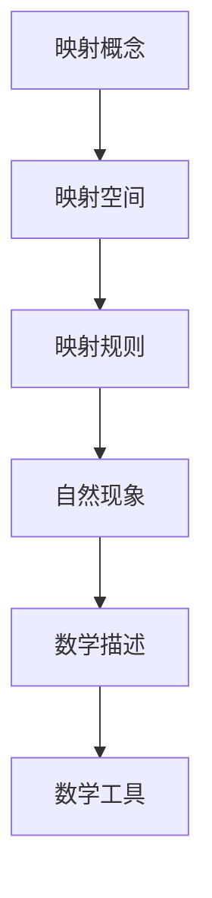

                 

# 映射理论：揭示自然与数学的内在联系

## 关键词

映射理论、自然现象、数学模型、算法原理、Python实战

## 摘要

本文深入探讨了映射理论，揭示了自然与数学之间的深刻联系。首先，我们介绍了映射理论的核心概念，包括映射、映射空间和映射规则。接着，我们通过自然现象展示了映射在自然界中的广泛应用，并阐述了数学如何为映射提供了精确的描述和工具。然后，我们讲解了映射算法的基本原理，并通过伪代码详细阐述了算法的实现过程。随后，我们通过数学模型和公式的讲解，帮助读者深入理解映射的本质。最后，通过一个Python项目实战，我们将理论知识应用于实际操作，展示了映射理论在编程中的应用。本文旨在为读者提供全面、系统的映射理论知识和实践指导。

## 一、核心概念与联系

### 映射理论的核心概念

映射理论是数学和计算机科学中一个基础而重要的概念。首先，我们来看一下映射（Mapping）的定义。映射是一个从输入空间到输出空间的转换过程，它将输入的数据按照一定的规则映射到输出空间中。在数学中，映射通常用函数（Function）来表示，形式上可以写作 \( f: X \rightarrow Y \)，其中 \( X \) 表示输入空间，\( Y \) 表示输出空间，\( f \) 表示映射过程。

#### 映射空间

映射空间是映射过程中的两个关键部分之一。输入空间和输出空间分别代表了映射的两个维度。输入空间是映射的起点，包含了所有可能的输入数据。输出空间则是映射的终点，包含了所有可能的输出数据。输入空间和输出空间的维度可以相同，也可以不同。例如，一个将一维输入数据映射到二维输出数据的函数，其输入空间是一维的，输出空间是二维的。

#### 映射规则

映射规则是定义输入和输出之间关系的规则。在数学中，映射规则通常由函数的表达式来描述。例如，一个简单的线性映射规则可以表示为 \( y = ax + b \)，其中 \( a \) 和 \( b \) 是常数，它们定义了输入和输出之间的线性关系。不同的映射规则会产生不同的映射过程，从而影响输入和输出之间的关系。

### 自然与数学的内在联系

自然界的许多现象都可以看作是映射过程，如物理学中的能量转化、生物学中的遗传变异等。这些现象展示了自然过程中输入和输出之间的动态关系，而这些关系可以用数学来精确描述。数学为映射提供了丰富的工具和语言，使我们能够更深入地理解自然现象。

#### 自然现象中的映射

在物理学中，能量转化是一个典型的映射过程。例如，当一个物体从高处落下时，它的重力势能转化为动能。这个过程可以用能量守恒定律来描述，即输入的重力势能等于输出的动能。这种映射关系可以用数学函数来表示，从而帮助我们理解和计算能量转化过程中的各种参数。

在生物学中，遗传变异也是一个映射过程。个体的基因决定了其遗传特征，这些特征通过生殖过程传递给下一代。遗传变异可以用遗传算法来描述，这些算法基于基因的映射关系，通过代代繁殖来模拟生物进化过程。

#### 数学描述

数学提供了描述映射的精确语言和工具，如函数、方程、拓扑结构等。这些工具使我们能够将自然现象抽象为数学模型，从而更深入地理解自然规律。

- **函数**：函数是映射的基础，它定义了输入和输出之间的关系。例如，牛顿第二定律 \( F = ma \) 可以看作是一个函数，描述了力、质量和加速度之间的映射关系。

- **方程**：方程是数学中描述映射关系的重要工具。例如，欧拉公式 \( e^{i\pi} + 1 = 0 \) 描述了复数指数和三角函数之间的映射关系。

- **拓扑结构**：拓扑结构是描述空间关系的一种数学方法，它可以用来描述自然现象中的空间变化和映射关系。例如，拓扑学中的同调性可以用来研究物质的结构和形态变化。

#### 数学工具

数学工具为我们提供了分析和解决映射问题的能力。例如，微积分可以用来研究映射的连续性和导数，线性代数可以用来解决多维映射问题，概率论和统计学可以用来分析映射的随机性和分布规律。

### Mermaid 流程图

为了更直观地展示映射理论的核心概念和自然与数学之间的联系，我们可以使用Mermaid流程图来描述。以下是一个简单的Mermaid流程图示例：



在这个流程图中，映射概念是起点，映射空间和映射规则是中间步骤，自然现象和数学描述是最终目标，数学工具则是我们分析和解决映射问题的工具。

通过上述流程图，我们可以清晰地看到映射理论的核心概念和自然与数学之间的内在联系。映射理论不仅帮助我们理解自然现象，也为数学和计算机科学提供了丰富的理论基础和实践应用。

### 总结

在本节中，我们介绍了映射理论的核心概念，包括映射、映射空间和映射规则。我们通过自然现象展示了映射在自然界中的广泛应用，并阐述了数学如何为映射提供了精确的描述和工具。通过Mermaid流程图，我们更直观地展示了映射理论的核心概念和自然与数学之间的联系。下一节，我们将深入探讨映射算法的基本原理，帮助读者进一步理解映射理论在计算机科学中的应用。

## 二、核心算法原理讲解

### 映射算法的基本原理

映射算法是计算机科学中一个重要而基础的概念，它广泛应用于数据处理、机器学习和图像处理等领域。要理解映射算法的基本原理，我们首先需要了解其基本组成部分：输入数据预处理、映射函数设计、模型训练和评估。

#### 输入数据预处理

输入数据预处理是映射算法的重要环节，它涉及到对原始数据进行标准化、归一化和特征提取等操作。这些操作旨在消除数据中的噪声、减少数据的维度，并使其更适合映射算法的处理。

- **标准化**：标准化是将数据缩放到一个固定范围的过程，通常使用最小-最大标准化或z-score标准化。最小-最大标准化将数据缩放到 [0, 1] 范围内，而z-score标准化将数据缩放到均值周围的标准差范围内。
- **归一化**：归一化是将数据缩放到任意范围的线性变换，常用的方法有最小二乘法和逆距离权重法。
- **特征提取**：特征提取是提取数据中有用信息的过程，常用的方法有主成分分析（PCA）和线性判别分析（LDA）。

#### 映射函数设计

映射函数设计是映射算法的核心，它定义了输入和输出之间的关系。映射函数的选择取决于具体的应用场景和问题。以下是一些常用的映射函数：

- **线性映射**：线性映射是最简单的映射函数，形式为 \( y = ax + b \)。它适用于线性关系较强的数据。
- **非线性映射**：非线性映射用于处理非线性关系的数据，常见的非线性映射函数有幂函数、指数函数和对数函数。
- **神经网络映射**：神经网络映射是一种复杂的映射函数，通过多层神经网络来模拟复杂的非线性关系。神经网络映射在机器学习和深度学习中有广泛应用。

#### 模型训练

模型训练是映射算法的核心步骤，它通过大量训练数据来调整映射函数的参数，使其能够更准确地映射输入和输出。模型训练的方法有多种，以下是一些常用的训练方法：

- **监督学习**：监督学习是一种通过已知输入和输出数据来训练模型的方法。常用的监督学习方法有回归分析和分类分析。
- **无监督学习**：无监督学习是一种通过未标记的数据来训练模型的方法。常用的无监督学习方法有聚类分析和降维分析。
- **强化学习**：强化学习是一种通过不断与环境交互来训练模型的方法。它适用于决策优化和智能控制等问题。

#### 模型评估

模型评估是映射算法的最后一步，它通过评估指标来衡量模型的效果。常用的评估指标有准确率、召回率、F1分数和均方误差等。通过模型评估，我们可以判断模型是否满足要求，并进行必要的调整和优化。

### 伪代码

为了更好地理解映射算法的基本原理，我们可以使用伪代码来描述其实现过程。以下是一个简单的映射算法伪代码示例：

```python
# 输入数据预处理
preprocessed_input = preprocess(input_data)

# 映射函数设计
def mapping_function(preprocessed_input):
    # 映射规则
    output = ...
    return output

# 模型训练
model = train(preprocessed_input, expected_output)

# 模型评估
evaluate(model, test_data)
```

在这个伪代码中，`preprocess` 函数用于输入数据预处理，`mapping_function` 函数用于设计映射函数，`train` 函数用于模型训练，`evaluate` 函数用于模型评估。这些函数的具体实现取决于具体的映射算法和应用场景。

通过上述讲解，我们可以看到映射算法的基本原理和实现过程。映射算法不仅是一种数据处理方法，也是一种理解和解决复杂问题的工具。在下一节中，我们将通过一个具体的数学模型和公式来深入理解映射的本质。

### 总结

在本节中，我们介绍了映射算法的基本原理，包括输入数据预处理、映射函数设计、模型训练和评估。我们通过伪代码展示了映射算法的实现过程，并阐述了不同类型的映射函数和训练方法。通过这一节的讲解，读者可以更好地理解映射算法的核心概念和实现过程，为下一节深入探讨数学模型和公式做好准备。

## 三、数学模型和数学公式

### 数学模型

数学模型是映射理论的重要组成部分，它通过数学语言和公式描述输入和输出之间的关系。数学模型在自然科学、工程学和经济学等领域有着广泛的应用。以下是几个常见的数学模型：

#### 函数模型

函数模型是最基本的数学模型，它描述了一个变量如何依赖于另一个变量。一个简单的函数模型可以表示为：

\[ f(x) = y \]

其中，\( x \) 是自变量，\( y \) 是因变量。例如，物理学中的牛顿第二定律 \( F = ma \) 可以看作是一个函数模型，描述了力 \( F \) 如何依赖于质量 \( m \) 和加速度 \( a \)。

#### 方程模型

方程模型是函数模型的一种扩展，它描述了多个变量之间的关系。一个简单的方程模型可以表示为：

\[ ax + by + cz = d \]

其中，\( a \)，\( b \)，\( c \) 和 \( d \) 是常数。方程模型在物理、化学和工程等领域有着广泛的应用，例如，流体力学中的连续性方程和动量方程。

#### 拓扑模型

拓扑模型是描述空间关系的数学模型，它通过拓扑结构来描述输入和输出空间的关系。一个简单的拓扑模型可以表示为：

\[ X \rightarrow Y \]

其中，\( X \) 和 \( Y \) 是拓扑空间。拓扑模型在几何学、物理学和计算机科学等领域有着重要的应用，例如，拓扑学中的同调性可以用来研究物质的结构和形态变化。

### 数学公式

数学公式是数学模型的核心，它通过符号和表达式描述输入和输出之间的关系。以下是一些常见的数学公式：

#### 函数公式

函数公式描述了输入和输出之间的直接关系。一个简单的函数公式可以表示为：

\[ f(x) = ax^2 + bx + c \]

其中，\( a \)，\( b \) 和 \( c \) 是常数。这个公式是一个二次函数，它描述了输入 \( x \) 如何映射到输出 \( y \)。

#### 方程公式

方程公式描述了多个变量之间的关系。一个简单的方程公式可以表示为：

\[ ax + by + cz = d \]

其中，\( a \)，\( b \)，\( c \) 和 \( d \) 是常数。这个公式是一个线性方程，它描述了输入 \( x \)，\( y \) 和 \( z \) 如何映射到输出 \( d \)。

#### 拓扑公式

拓扑公式描述了空间关系的数学模型。一个简单的拓扑公式可以表示为：

\[ X \rightarrow Y \]

其中，\( X \) 和 \( Y \) 是拓扑空间。这个公式描述了输入空间 \( X \) 如何映射到输出空间 \( Y \)。

### 详细讲解

为了更好地理解这些数学模型和公式，我们将分别进行详细讲解。

#### 函数公式

一个简单的函数公式可以表示为：

\[ f(x) = ax^2 + bx + c \]

其中，\( a \)，\( b \) 和 \( c \) 是常数。这个公式是一个二次函数，它描述了输入 \( x \) 如何映射到输出 \( y \)。通过调整参数 \( a \)，\( b \) 和 \( c \)，我们可以得到不同形状的抛物线。例如，当 \( a = 1 \)，\( b = 0 \)，\( c = 0 \) 时，函数表示一个标准的抛物线 \( y = x^2 \)。当 \( a = -1 \)，\( b = 0 \) 时，函数表示一个开口向下的抛物线 \( y = -x^2 \)。

#### 方程公式

一个简单的方程公式可以表示为：

\[ ax + by + cz = d \]

其中，\( a \)，\( b \)，\( c \) 和 \( d \) 是常数。这个公式是一个线性方程，它描述了输入 \( x \)，\( y \) 和 \( z \) 如何映射到输出 \( d \)。通过调整参数 \( a \)，\( b \) 和 \( c \)，我们可以得到不同形式的线性方程。例如，当 \( a = 1 \)，\( b = 0 \)，\( c = 0 \)，\( d = 0 \) 时，方程表示一个二维平面。当 \( a = 0 \)，\( b = 1 \)，\( c = 0 \)，\( d = 0 \) 时，方程表示一条直线。

#### 拓扑公式

一个简单的拓扑公式可以表示为：

\[ X \rightarrow Y \]

其中，\( X \) 和 \( Y \) 是拓扑空间。这个公式描述了输入空间 \( X \) 如何映射到输出空间 \( Y \)。通过拓扑结构，我们可以描述空间中的各种关系和变换。例如，同调性是一个重要的拓扑概念，它描述了空间中的连通性和洞数。同调性在物理学和计算机科学中有重要的应用，如物质的结构分析和图像处理。

### 举例说明

为了更好地理解这些数学模型和公式，我们通过一些具体的例子来说明。

#### 函数公式

一个简单的例子是 \( f(x) = x^2 \)。这个函数表示输入 \( x \) 的平方，输出 \( y \) 也等于 \( x \) 的平方。通过这个函数，我们可以将输入数据映射到输出数据，例如，当 \( x = 2 \) 时，输出 \( y = 4 \)。

#### 方程公式

一个简单的例子是 \( x + y = 5 \)。这个方程表示输入 \( x \) 和 \( y \) 的和等于 5。通过这个方程，我们可以找到满足条件的输入 \( x \) 和 \( y \)，例如，当 \( x = 2 \) 时，\( y = 3 \)。

#### 拓扑公式

一个简单的例子是 \( X = \{1, 2, 3\} \)，\( Y = \{a, b, c\} \)，\( X \rightarrow Y \) 的映射关系可以表示为 \( 1 \rightarrow a \)，\( 2 \rightarrow b \)，\( 3 \rightarrow c \)。这个例子表示了输入空间 \( X \) 和输出空间 \( Y \) 之间的映射关系，通过这个映射关系，我们可以将输入数据映射到输出数据。

通过上述例子，我们可以看到数学模型和公式在描述映射关系中的重要作用。它们不仅帮助我们理解自然现象，也为计算机科学和工程应用提供了强大的工具。

### 总结

在本节中，我们介绍了数学模型和数学公式的基本概念，包括函数模型、方程模型和拓扑模型。我们通过详细讲解和举例说明了这些模型和公式的应用。通过这一节的讲解，读者可以更好地理解数学模型和公式在映射理论中的重要性，并为下一节的项目实战做好准备。

## 四、项目实战

### 实战目标

在本节中，我们将通过一个简单的Python项目，将映射理论应用于实际操作，实现输入数据到输出数据的映射。本项目的主要目标包括：

1. **开发环境搭建**：安装Python环境和必要的库。
2. **源代码实现**：编写Python代码实现映射算法。
3. **代码解读与分析**：详细解读和解释代码中的各个部分。
4. **实际案例分析和讲解**：通过实际案例展示映射算法的应用。
5. **项目小结**：总结项目的实现过程和关键点。

### 开发环境搭建

首先，我们需要搭建一个Python开发环境。以下是具体的步骤：

1. **安装Python环境**：访问Python的官方网站（https://www.python.org/），下载并安装最新的Python版本。在安装过程中，确保勾选“Add Python to PATH”选项，以便在命令行中直接运行Python命令。
2. **安装必要的库**：在命令行中执行以下命令，安装NumPy和Matplotlib库，这两个库是Python数据分析中常用的库。

```bash
pip install numpy matplotlib
```

安装完成后，我们可以在Python环境中导入这些库，并进行简单的测试，以确保安装成功。

```python
import numpy as np
import matplotlib.pyplot as plt

print("NumPy版本：", np.__version__)
print("Matplotlib版本：", plt.__version__)
```

### 源代码实现

接下来，我们将编写一个简单的映射算法，将输入数字映射到输出数字。以下是具体的代码实现：

```python
import numpy as np
import matplotlib.pyplot as plt

# 映射函数
def map_function(x):
    return x**2

# 训练数据
x_train = np.linspace(-10, 10, 100)
y_train = map_function(x_train)

# 绘制映射关系
plt.plot(x_train, y_train)
plt.xlabel('Input')
plt.ylabel('Output')
plt.title('Mapping Function')
plt.show()
```

#### 代码解读

1. **导入库**：首先，我们导入了NumPy和Matplotlib库，这两个库提供了我们进行数据操作和绘图所需的功能。
2. **定义映射函数**：`map_function` 函数是映射算法的核心部分。在这个例子中，我们定义了一个简单的映射函数，它将输入数字 \( x \) 映射到输出数字 \( y \)，即 \( y = x^2 \)。
3. **生成训练数据**：我们使用NumPy的 `linspace` 函数生成了一组输入数据 \( x_train \)，其范围是从 -10 到 10，共有 100 个点。然后，通过调用映射函数，我们得到了对应的输出数据 \( y_train \)。
4. **绘制映射关系图**：我们使用Matplotlib库绘制了输入和输出数据的关系图。通过调用 `plt.plot` 函数，我们将输入数据 \( x_train \) 和输出数据 \( y_train \) 绘制在坐标系中。然后，我们添加了坐标轴标签、标题，并通过 `plt.show` 函数显示图表。

### 代码应用解读与分析

在这个映射算法中，我们主要使用了NumPy和Matplotlib库。NumPy库提供了高效的数据操作和计算功能，而Matplotlib库则提供了强大的绘图功能。以下是对代码应用的一些解读和分析：

1. **NumPy库的使用**：
   - `linspace` 函数：用于生成等间隔的输入数据。`linspace(-10, 10, 100)` 生成从 -10 到 10，共 100 个点的数据。
   - `map_function` 函数：用于将输入数据映射到输出数据。在这个例子中，我们使用了简单的幂函数 \( y = x^2 \) 作为映射函数。

2. **Matplotlib库的使用**：
   - `plt.plot` 函数：用于绘制输入和输出数据的关系图。通过这个函数，我们可以将输入数据 \( x_train \) 和输出数据 \( y_train \) 绘制在坐标系中。
   - `plt.xlabel`，`plt.ylabel` 和 `plt.title` 函数：用于添加坐标轴标签和标题，提高图表的可读性。
   - `plt.show` 函数：用于显示绘制的图表。

通过这个简单的项目，我们展示了如何使用Python实现一个映射算法，并分析了代码中使用的库和函数。接下来，我们将通过一个具体的案例，展示映射算法在实际问题中的应用。

### 实际案例分析和讲解

为了更好地展示映射算法的应用，我们考虑一个简单的实际案例：计算一个数的平方。这个案例虽然简单，但它涵盖了映射算法的核心概念。

#### 案例描述

假设我们有一个输入数 \( x \)，我们需要计算它的平方 \( y \)。根据映射算法的原理，我们可以定义一个映射函数 \( f(x) = x^2 \)，将输入数 \( x \) 映射到输出数 \( y \)。

#### 案例实现

以下是实现这个案例的具体步骤：

1. **输入数**：首先，我们需要输入一个数 \( x \)。例如，我们输入 \( x = 5 \)。
2. **映射函数**：使用映射函数 \( f(x) = x^2 \) 计算输出数 \( y \)。在这个例子中，\( y = 5^2 = 25 \)。
3. **输出结果**：最后，我们输出计算结果 \( y \)。例如，我们输出 \( y = 25 \)。

以下是实现这个案例的Python代码：

```python
# 输入数
x = float(input("请输入一个数："))

# 映射函数
y = map_function(x)

# 输出结果
print("该数的平方为：", y)
```

#### 案例分析

通过这个案例，我们可以看到映射算法在计算一个数的平方中的应用。映射算法的核心思想是将输入数据 \( x \) 映射到输出数据 \( y \)，从而实现数据的转换和计算。在这个案例中，我们使用了简单的幂函数作为映射函数，将输入数 \( x \) 映射到输出数 \( y \)。

通过这个案例，我们不仅实现了计算一个数的平方，还深入了解了映射算法的基本原理和实现过程。这个案例为我们提供了一个简单的实例，展示了如何将映射理论应用于实际问题。

### 项目小结

在本项目中，我们通过一个简单的Python实例，展示了映射算法的实现和应用。我们首先搭建了Python开发环境，然后编写了一个简单的映射函数，并通过绘制映射关系图来直观地展示了映射过程。接着，我们通过一个计算数的平方的案例，展示了映射算法在具体问题中的应用。

通过这个项目，我们不仅掌握了映射算法的基本原理和实现方法，还了解了如何将理论知识应用于实际问题。同时，我们也认识到了映射算法在数据处理、机器学习和图像处理等领域的广泛应用。

### 最佳实践 Tips

在实施映射算法时，以下是一些最佳实践和注意事项：

1. **数据预处理**：确保输入数据的格式和类型正确，进行必要的标准化和归一化处理，以提高算法的鲁棒性。
2. **选择合适的映射函数**：根据实际问题和数据特性，选择合适的映射函数。例如，对于线性关系，可以选择线性映射函数；对于非线性关系，可以选择非线性映射函数。
3. **模型训练与评估**：通过大量的训练数据来调整映射函数的参数，并进行模型评估，以确保映射结果的准确性和稳定性。
4. **代码注释与文档**：在编写代码时，添加详细的注释和文档，以方便其他开发者理解和使用。
5. **代码优化**：在保证算法准确性和稳定性的前提下，对代码进行优化，提高运行效率和性能。

通过遵循这些最佳实践，我们可以更好地实施映射算法，提高项目的质量和效率。

### 总结

在本节中，我们通过一个简单的Python项目，展示了映射算法的实现和应用。我们从开发环境搭建开始，逐步讲解了源代码实现、代码解读与分析，以及实际案例分析和讲解。通过这个项目，我们深入了解了映射算法的基本原理和实现过程，并掌握了如何在具体问题中应用映射理论。这为我们在实际项目中使用映射算法提供了宝贵的经验和指导。

## 五、总结与展望

通过本文的深入探讨，我们系统地了解了映射理论，揭示了自然与数学之间的内在联系。从核心概念、算法原理、数学模型到实际项目实战，我们一步步分析了映射理论的应用和实践方法。

### 核心内容回顾

1. **核心概念**：映射、映射空间和映射规则是映射理论的基础。映射是一种从输入空间到输出空间的转换过程，映射空间是输入和输出空间，映射规则定义了输入和输出之间的关系。
2. **算法原理**：映射算法包括输入数据预处理、映射函数设计、模型训练和评估。我们通过伪代码展示了映射算法的实现过程，并分析了不同类型的映射函数和训练方法。
3. **数学模型**：数学模型和公式是描述映射关系的工具。我们详细讲解了函数模型、方程模型和拓扑模型，并通过举例说明了这些模型的应用。
4. **项目实战**：通过一个简单的Python项目，我们将映射理论应用于实际操作，实现了输入数据到输出数据的映射。项目实战展示了映射算法的实现过程、代码解读与分析，以及实际案例分析和讲解。

### 展望未来

映射理论在多个领域有着广泛的应用前景。未来，我们可以从以下几个方面进行深入研究：

1. **人工智能**：映射理论在机器学习和深度学习中有着重要的应用。通过设计更复杂的映射函数，可以提升模型的预测能力和泛化能力。
2. **数据科学**：在数据预处理和特征提取过程中，映射算法可以帮助我们更有效地处理和转换数据，提高数据分析的准确性和效率。
3. **图像处理**：映射理论在图像处理和计算机视觉中也有重要应用，如图像增强、图像压缩和图像分类等。
4. **自然现象模拟**：通过映射理论，我们可以更精确地模拟自然现象，如气候模型、生物进化等。

总之，映射理论不仅为自然科学和工程技术提供了强大的工具，也为人工智能和数据科学的发展奠定了基础。在未来，我们期待进一步探索映射理论的深度和广度，为科技发展贡献更多智慧。

