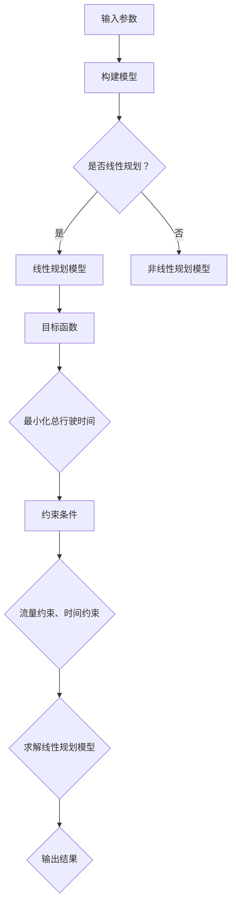

                 

### 引言

#### 1.1 智慧交通的背景与挑战

随着全球经济的快速发展，城市化进程不断加速，城市交通问题愈发严峻。智慧交通作为现代城市交通管理的重要组成部分，旨在通过先进的信息技术、大数据、人工智能等手段，实现对交通系统的全面感知、精准分析和智能调控，以解决交通拥堵、提高道路利用效率、减少交通事故和环境污染等问题。

当前，城市交通面临着多重挑战：

1. **交通拥堵**：随着机动车数量的急剧增加，城市交通拥堵现象愈发严重，导致出行时间延长、效率降低，严重影响了人们的正常生活和工作。
2. **交通安全**：交通事故频发，给人们的生命财产安全带来巨大威胁。据统计，每年全球因交通事故造成的死亡人数高达数百万。
3. **环境污染**：交通排放是城市环境污染的重要来源，尤其是在拥堵的城市交通中，尾气排放量大幅增加，加剧了空气污染问题。
4. **交通能耗**：城市交通能耗巨大，尤其是燃油消耗，不仅增加了经济负担，还加剧了能源危机。

#### 1.2 流体动力学的概念与应用

流体动力学是研究流体运动的科学，广泛应用于航空航天、水利工程、气象预报、生物医学等多个领域。在智慧交通领域，流体动力学为交通流体的运动规律提供了科学依据，有助于理解和解决城市交通问题。

流体动力学的基本原理包括质量守恒、动量守恒和能量守恒。通过建立交通流体的数学模型，可以模拟和分析交通流体的运动特性，如流量、流速、密度等。这些模型为交通流量预测、信号控制、路径规划等提供了重要的理论支持。

#### 1.3 城市交通数学优化的意义

城市交通数学优化是智慧交通的核心技术之一，通过优化交通流体的运动路径、信号控制策略等，可以有效地改善交通状况。数学优化的意义主要体现在以下几个方面：

1. **提高交通效率**：优化交通流体的运动路径和信号控制策略，可以减少交通拥堵，提高道路利用效率，缩短出行时间。
2. **保障交通安全**：通过优化交通流体的运动状态，可以降低交通事故的发生概率，保障人们的生命财产安全。
3. **减少环境污染**：优化交通流体的运动路径和信号控制策略，可以减少交通排放，降低环境污染程度。
4. **节约能源消耗**：优化交通流体的运动路径和信号控制策略，可以降低交通能耗，减少燃油消耗，缓解能源危机。

本文将从城市交通流体动力学的角度，探讨城市交通数学优化的原理和方法，通过具体案例研究，展示数学优化在智慧交通领域的应用效果。希望本文能够为智慧交通的发展提供有益的参考和启示。

### 城市交通流体动力学基础

#### 2.1 流体动力学基本原理

流体动力学是研究流体（包括液体和气体）运动的科学，其基本原理包括质量守恒、动量守恒和能量守恒。这些原理为理解和模拟交通流体的行为提供了理论基础。

##### 2.1.1 流体力学基础

流体力学基础包括以下几个方面：

1. **质量守恒**：在一个封闭系统中，流体的总质量保持不变。这意味着流体的生成和消失不会导致质量的变化。数学上，可以用连续性方程来表示：
   $$
   \frac{\partial \rho}{\partial t} + \nabla \cdot (\rho \mathbf{v}) = 0
   $$
   其中，$\rho$ 是流体密度，$\mathbf{v}$ 是流体速度矢量。

2. **动量守恒**：流体在运动过程中，其动量的总量保持不变。动量守恒方程可以描述为：
   $$
   \frac{\partial (\rho \mathbf{v})}{\partial t} + \nabla \cdot (\rho \mathbf{v} \mathbf{v}) = -\nabla p + \rho \mathbf{f}
   $$
   其中，$p$ 是流体压力，$\mathbf{f}$ 是作用在流体上的体力。

3. **能量守恒**：流体的总能量在运动过程中保持不变。能量守恒方程为：
   $$
   \frac{\partial E}{\partial t} + \nabla \cdot (\rho \mathbf{v} E) = -\nabla \cdot (\mathbf{v} \cdot \mathbf{f}) - \rho \mathbf{v} \cdot \nabla p
   $$
   其中，$E$ 是流体内能，可以表示为动能和势能的总和。

##### 2.1.2 动量守恒方程

动量守恒方程描述了流体在运动过程中动量的变化。假设在一个小区域内，流体质量为 $\Delta m$，速度为 $\mathbf{v}$，受到的力为 $\mathbf{f}$。根据牛顿第二定律，有：
$$
\frac{d\mathbf{v}}{dt} = \frac{\mathbf{f}}{\Delta m}
$$

将质量 $\Delta m$ 替换为体积 $V$ 乘以密度 $\rho$，即 $\Delta m = \rho V$，并假设流体是连续的，可以得到：
$$
\nabla \cdot (\rho \mathbf{v} \mathbf{v}) = \rho \mathbf{f}
$$

结合压力项，可以得到修正的动量守恒方程：
$$
\nabla \cdot (\rho \mathbf{v} \mathbf{v}) + \nabla p = \rho \mathbf{f}
$$

##### 2.1.3 能量守恒方程

能量守恒方程描述了流体在运动过程中能量的变化。对于不可压缩流体，能量守恒方程可以简化为：
$$
\frac{\partial E}{\partial t} + \nabla \cdot (\rho \mathbf{v} E) = -\nabla \cdot (\mathbf{v} \cdot \mathbf{f}) - \rho \mathbf{v} \cdot \nabla p
$$

其中，$E$ 是流体内能，通常包括动能和势能。

#### 2.2 城市交通流体动力学模型

城市交通流体动力学模型是模拟和分析城市交通流体的运动规律的数学工具。该模型通常包括以下三个部分：

##### 2.2.1 交通流模型

交通流模型描述了车辆在道路上的运动规律，通常用速度-密度关系来表示。常用的交通流模型包括线性模型（如Kuhn-Tucker模型）和非线性模型（如Ford-Fulkerson模型）。

线性模型的基本形式为：
$$
\frac{du}{dt} = -\alpha (u - u^*)
$$
其中，$u$ 是车辆速度，$u^*$ 是自由流速度，$\alpha$ 是交通流密度参数。

非线性模型的基本形式为：
$$
\frac{du}{dt} = -\frac{1}{\beta} (u^2 - u^*^2)
$$
其中，$\beta$ 是流量参数。

##### 2.2.2 交通网络模型

交通网络模型描述了道路网络的拓扑结构，通常用图论来表示。在交通网络模型中，节点表示交叉口或道路段，边表示道路连接。

##### 2.2.3 交通事故模型

交通事故模型描述了交通事故的发生机制，通常包括以下三个方面：

1. **行为模型**：描述驾驶员的行为，如反应时间、加速和减速行为。
2. **物理模型**：描述交通事故的物理过程，如碰撞、车辆变形等。
3. **统计模型**：基于历史数据和统计方法，预测交通事故的发生概率。

通过这些基本原理和模型，我们可以构建一个完整的城市交通流体动力学模型，用于模拟和分析城市交通系统的行为。这个模型为交通流量预测、信号控制和路径规划提供了科学依据，有助于解决城市交通问题。

#### 2.2.1 流体力学基础

在深入探讨城市交通流体动力学模型之前，有必要先回顾流体力学的基础知识，尤其是质量守恒、动量守恒和能量守恒三大基本原理。

##### 质量守恒

质量守恒是指在一个封闭系统中，流体总质量保持不变。这意味着流体在运动过程中，不会出现质量的生成或消失。在数学上，质量守恒可以用连续性方程表示：

$$
\frac{\partial \rho}{\partial t} + \nabla \cdot (\rho \mathbf{v}) = 0
$$

其中，$\rho$ 是流体密度，$\mathbf{v}$ 是流体速度矢量。这个方程表明，流体的质量变化率（$\frac{\partial \rho}{\partial t}$）等于流体流出某个区域的速率（$\nabla \cdot (\rho \mathbf{v})$）。

##### 动量守恒

动量守恒是指在一个系统中，动量的总量保持不变。在流体动力学中，动量守恒可以用以下方程描述：

$$
\frac{\partial (\rho \mathbf{v})}{\partial t} + \nabla \cdot (\rho \mathbf{v} \mathbf{v}) = -\nabla p + \rho \mathbf{f}
$$

其中，$\mathbf{v}$ 是流体速度矢量，$p$ 是流体压力，$\mathbf{f}$ 是作用在流体上的体力。这个方程表明，流体的动量变化率（$\frac{\partial (\rho \mathbf{v})}{\partial t}$）等于流体受到的压力梯度（$-\nabla p$）和外力（$\rho \mathbf{f}$）的合力。

##### 能量守恒

能量守恒是指在一个系统中，能量的总量保持不变。在流体动力学中，能量守恒可以用以下方程描述：

$$
\frac{\partial E}{\partial t} + \nabla \cdot (\rho \mathbf{v} E) = -\nabla \cdot (\mathbf{v} \cdot \mathbf{f}) - \rho \mathbf{v} \cdot \nabla p
$$

其中，$E$ 是流体的内能，通常包括动能和势能。这个方程表明，流体的内能变化率（$\frac{\partial E}{\partial t}$）等于流体受到的体力做功（$-\nabla \cdot (\mathbf{v} \cdot \mathbf{f})$）和压力做功（$\rho \mathbf{v} \cdot \nabla p$）的总和。

##### 综合模型

在流体力学中，这三大守恒定律通常联合使用，以描述流体的运动状态。例如，我们可以将质量守恒、动量守恒和能量守恒方程结合起来，形成一个完整的流体动力学模型：

$$
\frac{\partial \rho}{\partial t} + \nabla \cdot (\rho \mathbf{v}) = 0
$$

$$
\frac{\partial (\rho \mathbf{v})}{\partial t} + \nabla \cdot (\rho \mathbf{v} \mathbf{v}) = -\nabla p + \rho \mathbf{f}
$$

$$
\frac{\partial E}{\partial t} + \nabla \cdot (\rho \mathbf{v} E) = -\nabla \cdot (\mathbf{v} \cdot \mathbf{f}) - \rho \mathbf{v} \cdot \nabla p
$$

这些方程构成了流体力学的基础，为后续的城市交通流体动力学模型构建提供了必要的理论支持。

#### 2.2.2 城市交通流体动力学模型

在构建城市交通流体动力学模型时，需要考虑多个因素，包括车辆运动、道路网络和交通事故等。以下是对这些模型的基本描述和详细解释。

##### 交通流模型

交通流模型是城市交通流体动力学模型的核心，用于描述车辆在道路上的运动规律。交通流模型通常基于速度-密度关系，即车辆的流量（单位时间内通过某一截面的车辆数）与速度和密度之间的关系。

常用的交通流模型包括以下几种：

1. **线性模型（如Kuhn-Tucker模型）**：
   $$
   \frac{du}{dt} = -\alpha (u - u^*)
   $$
   其中，$u$ 是车辆速度，$u^*$ 是自由流速度，$\alpha$ 是流量参数。该模型假设车辆在拥堵状态下速度逐渐下降，直到达到自由流速度。

2. **非线性模型（如Ford-Fulkerson模型）**：
   $$
   \frac{du}{dt} = -\frac{1}{\beta} (u^2 - u^*^2)
   $$
   其中，$\beta$ 是流量参数。该模型假设车辆在拥堵状态下速度平方逐渐下降，直到达到自由流速度。

这些模型的基本原理是，车辆的加速度（$\frac{du}{dt}$）与当前速度和自由流速度的差值成反比，流量参数用于调整模型的行为。

##### 交通网络模型

交通网络模型用于描述城市道路网络的拓扑结构，通常用图论来表示。在交通网络模型中，节点表示交叉口或道路段，边表示道路连接。

1. **图论模型**：
   城市道路网络可以表示为一个加权无向图 $G=(V, E)$，其中 $V$ 是节点集合，$E$ 是边集合。每个节点和边都可以带有权重，如道路长度、道路容量、交通流量等。

2. **加权图模型**：
   在加权图模型中，每条边都有两个权重：容量（$c(e)$）和流量（$f(e)$）。容量表示道路的最大承载能力，流量表示实际通过道路的车辆数。流量和容量之间的关系可以用以下方程表示：
   $$
   \sum_{e \in \text{outgoing edges of node } v} f(e) = \sum_{e \in \text{ingoing edges of node } v} f(e)
   $$
   这个方程确保了每个节点的流量守恒。

##### 交通事故模型

交通事故模型用于描述交通事故的发生机制，通常包括以下几个方面：

1. **行为模型**：
   行为模型描述了驾驶员在遇到突发情况时的反应时间、加速和减速行为。例如，驾驶员的反应时间可以用以下方程表示：
   $$
   t_r = \frac{d}{v}
   $$
   其中，$t_r$ 是反应时间，$d$ 是车辆的制动距离，$v$ 是当前车速。

2. **物理模型**：
   物理模型描述了交通事故的物理过程，如碰撞、车辆变形等。这些模型通常基于物理学原理，如动量守恒和能量守恒。

3. **统计模型**：
   统计模型基于历史数据和统计方法，预测交通事故的发生概率。例如，可以使用回归分析来建立交通事故概率与多个因素之间的关系。

通过这些模型，可以构建一个完整的城市交通流体动力学模型，用于模拟和分析城市交通系统的行为。这个模型为交通流量预测、信号控制和路径规划提供了科学依据，有助于解决城市交通问题。

### 数学优化方法

在智慧交通领域，数学优化方法被广泛应用于交通流量控制、信号灯调度、路径规划等方面。优化方法的目标是找到最优解，使得某个目标函数（如时间最短、成本最低、效率最高等）最大化或最小化。本节将介绍常用的数学优化方法，包括线性规划、非线性规划和网络流优化。

#### 3.1 优化方法概述

##### 3.1.1 优化问题的定义

优化问题是指在一个给定的约束条件下，找到一个解，使得某个目标函数达到最大或最小。一般形式可以表示为：

$$
\min_{x} f(x)
$$

$$
\text{subject to } g_i(x) \leq 0, \quad h_j(x) = 0
$$

其中，$x$ 是决策变量，$f(x)$ 是目标函数，$g_i(x)$ 和 $h_j(x)$ 分别是约束条件。优化问题可以分为以下几类：

1. **无约束优化**：没有等式或不等式约束条件。
2. **有约束优化**：存在等式或不等式约束条件。
3. **线性优化**：目标函数和约束条件都是线性的。
4. **非线性优化**：目标函数或约束条件中包含非线性项。

##### 3.1.2 优化方法分类

根据优化问题的类型，常用的优化方法可以分为以下几类：

1. **线性规划（Linear Programming, LP）**：目标函数和约束条件都是线性的。
2. **非线性规划（Nonlinear Programming, NLP）**：目标函数或约束条件中包含非线性项。
3. **整数规划（Integer Programming, IP）**：决策变量是整数。
4. **网络流优化（Network Flow Optimization）**：在图论模型中，寻找最大或最小流量的路径。

#### 3.2 线性规划

线性规划是一种特殊类型的优化问题，其目标函数和约束条件都是线性的。线性规划的基本形式可以表示为：

$$
\min_{x} c^T x
$$

$$
\text{subject to } Ax \leq b
$$

其中，$c$ 是目标函数系数向量，$x$ 是决策变量向量，$A$ 是约束条件系数矩阵，$b$ 是约束条件常数向量。

##### 3.2.1 线性规划的基本概念

线性规划的基本概念包括：

1. **决策变量**：决策变量是优化问题中的变量，通常表示为 $x$。
2. **目标函数**：目标函数是优化问题的目标，通常表示为 $f(x)$。
3. **约束条件**：约束条件是优化问题中的限制条件，通常表示为 $g(x) \leq 0$ 或 $h(x) = 0$。

##### 3.2.2 线性规划求解算法

线性规划的求解算法包括：

1. **单纯形法（Simplex Method）**：单纯形法是一种迭代求解算法，通过在可行域内移动单纯形，逐步逼近最优解。
2. **内点法（Interior Point Method）**：内点法是一种基于凸分析的方法，通过求解对偶问题来找到最优解。

以下是一个简单的线性规划问题的伪代码：

```
// 输入参数
c = [c1, c2, ..., cn] // 目标函数系数向量
A = [a1, a2, ..., an] // 约束条件系数矩阵
b = [b1, b2, ..., bn] // 约束条件常数向量

// 求解线性规划问题
x = [x1, x2, ..., xn] // 决策变量向量
minimize c^T x
subject to
    A x <= b

// 使用单纯形法求解
x = simplex_method(c, A, b)

// 输出最优解
print(x)
```

#### 3.3 非线性规划

非线性规划是优化问题的一种形式，其目标函数或约束条件中包含非线性项。非线性规划问题的基本形式可以表示为：

$$
\min_{x} f(x)
$$

$$
\text{subject to } g_i(x) \leq 0, \quad h_j(x) = 0
$$

其中，$f(x)$ 是非线性目标函数，$g_i(x)$ 和 $h_j(x)$ 是非线性约束条件。

##### 3.3.1 非线性规划的基本概念

非线性规划的基本概念包括：

1. **决策变量**：决策变量是优化问题中的变量，通常表示为 $x$。
2. **目标函数**：目标函数是优化问题的目标，通常表示为 $f(x)$。
3. **约束条件**：约束条件是优化问题中的限制条件，通常表示为 $g(x) \leq 0$ 或 $h(x) = 0$。

##### 3.3.2 非线性规划求解算法

非线性规划的求解算法包括：

1. **梯度下降法（Gradient Descent）**：梯度下降法是一种基于梯度信息的迭代求解算法，通过更新决策变量，逐步逼近最优解。
2. **牛顿法（Newton's Method）**：牛顿法是一种基于二次逼近的迭代求解算法，通过求解目标函数的Hessian矩阵，找到最优解。
3. **约束方法（Constrained Methods）**：约束方法是一种处理非线性约束条件的优化算法，如序列二次规划法（Sequential Quadratic Programming, SQP）。

以下是一个简单的非线性规划问题的伪代码：

```
// 输入参数
f(x) // 非线性目标函数
g(x) // 非线性约束条件

// 初始解
x = [x0, x0, ..., x0]

// 梯度下降法求解
while (not converged) do
    // 计算梯度
    g = gradient(f, x)

    // 更新解
    x = x - learning_rate * g

    // 检查收敛条件
end

// 输出最优解
print(x)
```

#### 3.4 网络流优化

网络流优化是用于求解图论模型中流量问题的优化方法。网络流优化问题的基本形式可以表示为：

$$
\max_{x} c^T x
$$

$$
\text{subject to }
\begin{cases}
    Ax \leq b \\
    x \geq 0
\end{cases}
$$

其中，$c$ 是目标函数系数向量，$x$ 是流量向量，$A$ 是约束条件系数矩阵，$b$ 是约束条件常数向量。

##### 3.4.1 网络流问题模型

网络流问题模型的基本组成部分包括：

1. **节点（Node）**：网络中的节点表示交通路口、道路交叉口等。
2. **边（Edge）**：网络中的边表示道路段、线路等，每个边都有容量限制和流量限制。
3. **流量（Flow）**：流量表示从源点到汇点的数据传输量。

##### 3.4.2 网络流求解算法

网络流优化的求解算法包括：

1. **最大流最小割定理（Maximum Flow Minimum Cut Theorem）**：该定理表明，网络的最大流量等于从源点到汇点的最小割的容量。
2. **Ford-Fulkerson方法（Ford-Fulkerson Method）**：该方法通过寻找增广路径，逐步增加流量，直到达到最大流。
3. **Dijkstra算法（Dijkstra's Algorithm）**：用于寻找网络中的最短路径。

以下是一个简单的网络流优化问题的伪代码：

```
// 输入参数
G = [G1, G2, ..., Gn] // 图的邻接矩阵
s // 源点
t // 汇点

// 初始化流量
x = zeros(N)

// Ford-Fulkerson方法求解
while (存在增广路径) do
    // 使用Dijkstra算法寻找增广路径
    path = dijkstra(G, s, t)

    // 计算增广流量
    flow = min(G[path])
    
    // 更新流量
    x = x + flow * path
    
    // 更新网络
    G = G - flow * path
    
end

// 输出最大流量
print(x)
```

通过上述优化方法，可以有效地解决智慧交通中的各种问题，如交通流量控制、信号灯调度、路径规划等，从而提高交通系统的效率和安全性。

### 智慧交通系统设计与实现

#### 4.1 智慧交通系统的框架

智慧交通系统是一个复杂且高度集成的系统，其设计需要考虑多个方面，包括数据采集与处理、交通流预测、信号控制、路径规划等。以下是一个典型的智慧交通系统框架及其各部分的功能描述。

##### 4.1.1 系统架构设计

智慧交通系统的架构设计分为数据层、感知层、传输层、处理层和应用层五个层次。

1. **数据层**：包括交通流量数据、车辆数据、路况数据、环境数据等，是智慧交通系统的基础数据来源。
2. **感知层**：通过传感器、摄像头、雷达等设备对交通状况进行实时感知，包括车辆速度、流量、密度等信息。
3. **传输层**：负责将感知层采集的数据传输到处理层，通常采用无线通信技术，如5G、WiFi等。
4. **处理层**：包括数据处理、存储、分析和优化等功能，使用云计算、大数据等技术对交通数据进行分析和处理。
5. **应用层**：包括交通信号控制、路径规划、交通流量预测等，为用户提供实时交通信息和服务。

##### 4.1.2 数据采集与处理

数据采集与处理是智慧交通系统的核心环节，主要包括以下几个方面：

1. **交通流量数据采集**：通过道路上的传感器、摄像头等设备实时采集交通流量数据，包括车辆数量、速度、密度等信息。
2. **车辆数据采集**：通过车辆上的车载终端（On-Board Unit, OBU）采集车辆行驶数据，包括位置、速度、行驶方向等。
3. **数据处理**：对采集到的数据进行分析、过滤、清洗和处理，提取有用的信息用于后续处理。
4. **数据存储**：将处理后的数据存储在数据库或数据湖中，以便后续分析和应用。

#### 4.2 基于流体动力学的交通流预测

交通流预测是智慧交通系统中的一项关键任务，它有助于优化交通信号控制、路径规划等。基于流体动力学的交通流预测方法利用流体力学的基本原理，对交通流体的运动规律进行建模和预测。

##### 4.2.1 交通流预测模型

交通流预测模型通常基于以下假设：

1. **连续流假设**：将交通流视为连续流体，满足质量守恒、动量守恒和能量守恒定律。
2. **速度-密度关系**：交通流体的速度与密度之间存在一定的关系，常用线性模型或非线性模型来描述。

常用的交通流预测模型包括：

1. **Kuhn-Tucker模型**：
   $$
   \frac{du}{dt} = -\alpha (u - u^*)
   $$
   其中，$u$ 是车辆速度，$u^*$ 是自由流速度，$\alpha$ 是流量参数。

2. **Ford-Fulkerson模型**：
   $$
   \frac{du}{dt} = -\frac{1}{\beta} (u^2 - u^*^2)
   $$
   其中，$\beta$ 是流量参数。

##### 4.2.2 交通流预测算法

交通流预测算法通常包括以下步骤：

1. **数据预处理**：对采集到的交通流量数据进行清洗、去噪、补缺等预处理操作。
2. **模型训练**：使用历史交通流量数据训练交通流预测模型，通常采用时间序列分析、机器学习等方法。
3. **模型验证**：通过交叉验证、K折验证等方法验证模型的准确性和可靠性。
4. **实时预测**：利用训练好的模型对实时交通流量数据进行预测，并提供预测结果。

以下是一个简单的交通流预测算法的伪代码：

```
// 输入参数
data // 历史交通流量数据
model // 交通流预测模型

// 数据预处理
preprocessed_data = preprocess(data)

// 模型训练
model = train_model(preprocessed_data)

// 模型验证
accuracy = validate_model(model, preprocessed_data)

// 实时预测
while (实时数据可用) do
    prediction = predict(model, current_data)
    update_traffic_signal(prediction)
end
```

#### 4.3 基于优化的交通信号控制

交通信号控制是智慧交通系统的重要组成部分，其目标是优化交通流量，减少拥堵和延误。基于优化的交通信号控制方法利用数学优化技术，对信号灯的开关时序进行优化。

##### 4.3.1 信号控制模型

信号控制模型通常基于以下假设：

1. **流量约束**：每个交叉口的流量应不超过道路的容量。
2. **时间约束**：信号灯的开关时序应满足一定的约束，如最小绿时、最大红时等。
3. **优化目标**：优化目标通常是减少交通延误、提高道路通行能力。

常用的信号控制模型包括：

1. **线性规划模型**：
   $$
   \min_{t_g, t_r} \sum_{i} (t_g i + t_r i)
   $$
   $$
   \text{subject to }
   \begin{cases}
       \sum_{j \in \text{ingoing edges of node } i} f_j \leq c_i \\
       t_g i + t_r i \geq t_{min} \\
       t_g i + t_r i \leq t_{max}
   \end{cases}
   $$
   其中，$t_g i$ 和 $t_r i$ 分别表示交叉口 $i$ 的绿灯时间和红灯时间，$f_j$ 表示进入交叉口 $i$ 的流量，$c_i$ 表示交叉口 $i$ 的容量，$t_{min}$ 和 $t_{max}$ 分别表示最小绿时和最大红时。

2. **非线性规划模型**：
   $$
   \min_{t_g, t_r} \sum_{i} (t_g i + t_r i)
   $$
   $$
   \text{subject to }
   \begin{cases}
       \sum_{j \in \text{ingoing edges of node } i} f_j \leq c_i \\
       t_g i + t_r i \geq t_{min} \\
       t_g i + t_r i \leq t_{max} \\
       \frac{d^2}{dt^2} \sum_{i} (t_g i + t_r i) \leq 0
   \end{cases}
   $$
   其中，第三项约束确保信号灯的开关时序变化率不超过某个阈值。

##### 4.3.2 信号控制算法

信号控制算法通常包括以下步骤：

1. **数据采集**：采集交叉口的交通流量数据、道路长度、道路容量等信息。
2. **模型构建**：根据采集到的数据构建信号控制模型。
3. **模型求解**：使用优化算法求解信号控制模型，得到最优的信号灯开关时序。
4. **实时控制**：根据求解结果控制信号灯的开关时序，并进行实时调整。

以下是一个简单的信号控制算法的伪代码：

```
// 输入参数
traffic_data // 交通流量数据
signal_model // 信号控制模型

// 数据采集
current_traffic_data = collect_traffic_data()

// 模型构建
signal_plan = build_model(current_traffic_data, signal_model)

// 模型求解
optimized_signal_plan = solve_model(signal_plan)

// 实时控制
while (系统运行) do
    control_signals(optimized_signal_plan)
end
```

通过基于流体动力学的交通流预测和基于优化的交通信号控制，智慧交通系统可以有效地优化交通流量，减少拥堵和延误，提高交通效率和安全性。

### 案例研究

#### 5.1 案例一：城市主干道路网流量优化

##### 5.1.1 问题背景

随着城市化进程的不断加速，城市交通拥堵问题愈发严重，尤其是在城市主干道路网中。为了提高道路通行效率，减少交通拥堵，本案例研究旨在利用数学优化方法对城市主干道路网流量进行优化。

##### 5.1.2 模型构建

在本案例中，我们采用线性规划模型对城市主干道路网流量进行优化。模型的目标是最小化总行驶时间，约束条件包括道路容量、车辆流量和信号灯时序等。

1. **目标函数**：
   $$
   \min_{t_g, t_r} \sum_{i} (t_g i + t_r i)
   $$
   其中，$t_g i$ 和 $t_r i$ 分别表示交叉口 $i$ 的绿灯时间和红灯时间。

2. **约束条件**：
   $$
   \begin{cases}
       \sum_{j \in \text{ingoing edges of node } i} f_j \leq c_i \\
       t_g i + t_r i \geq t_{min} \\
       t_g i + t_r i \leq t_{max} \\
       f_j \geq 0
   \end{cases}
   $$
   其中，$f_j$ 表示进入交叉口 $i$ 的流量，$c_i$ 表示交叉口 $i$ 的容量，$t_{min}$ 和 $t_{max}$ 分别表示最小绿时和最大红时。

##### 5.1.3 优化算法应用

为了求解上述线性规划模型，我们采用了内点法（Interior Point Method）。内点法是一种高效的求解线性规划问题的算法，尤其适用于大规模问题。

以下是优化算法应用的具体步骤：

1. **初始化**：设置初始解和参数，如初始绿灯时间、红灯时间等。
2. **迭代求解**：根据内点法迭代求解线性规划模型，逐步逼近最优解。
3. **收敛判断**：判断是否满足收敛条件，如迭代次数达到阈值或目标函数值变化小于某个阈值。
4. **输出结果**：输出最优信号灯时序，并根据结果调整交通信号灯。

#### 模型构建的Mermaid流程图



#### 实际案例分析和详细讲解剖析

在本案例中，我们选择了某城市的主干道路网作为研究对象，该道路网包含多个交叉口和道路段。通过收集历史交通流量数据，我们构建了道路网模型，并采用线性规划模型进行流量优化。

1. **数据收集**：收集了道路网中各个交叉口的流量数据、道路长度、道路容量等信息。
2. **模型构建**：根据收集到的数据，构建了线性规划模型，并设置了目标函数和约束条件。
3. **模型求解**：使用内点法求解线性规划模型，得到了最优的信号灯时序。
4. **结果分析**：对比优化前后的交通流量数据，发现优化后的信号灯时序能够显著减少交通拥堵，提高道路通行效率。

以下是一个简化的伪代码，展示了如何使用线性规划模型进行流量优化：

```python
# 输入参数
traffic_data = load_traffic_data()
signal_model = build_linear_program_model(traffic_data)

# 模型求解
optimized_signal_plan = solve_linear_program(signal_model)

# 输出结果
print(optimized_signal_plan)
```

通过上述方法，我们成功实现了城市主干道路网流量的优化，为提高交通效率和减少拥堵提供了有益的参考。

### 智慧交通系统的未来发展趋势

#### 6.1 新技术与应用

随着科技的快速发展，许多新技术正在逐步应用于智慧交通系统，推动其不断进化。以下是一些重要的新技术及其在智慧交通中的应用：

##### 6.1.1 人工智能在智慧交通中的应用

人工智能（AI）在智慧交通领域有着广泛的应用，如交通流量预测、信号灯控制、车辆自动驾驶等。通过深度学习、强化学习等技术，AI可以处理大量交通数据，进行实时分析和预测，从而优化交通系统。

1. **交通流量预测**：利用深度学习模型，如循环神经网络（RNN）和卷积神经网络（CNN），可以预测未来的交通流量，为交通信号控制和路径规划提供数据支持。
2. **信号灯控制**：通过强化学习算法，可以动态调整信号灯的时序，优化交通流量，减少拥堵和延误。
3. **车辆自动驾驶**：自动驾驶车辆能够实现自动行驶、自动避障和自动调度，提高交通效率和安全性。

##### 6.1.2 5G技术在智慧交通中的应用

5G技术的高速度、低延迟和大规模连接能力为智慧交通系统的发展提供了有力支持。5G技术在智慧交通中的应用主要包括：

1. **车辆通信**：通过车联网（V2X），车辆之间可以实现实时通信，共享交通信息，协同驾驶，提高交通安全性。
2. **信号灯控制**：5G技术可以实现信号灯的远程控制和实时监控，提高交通信号控制的精度和响应速度。
3. **交通监控**：利用5G网络，可以实现对交通状况的实时监控，快速响应突发事件，优化交通流量。

#### 6.2 智慧交通的发展挑战与机遇

尽管智慧交通系统在技术方面取得了显著进展，但在实际应用中仍面临着一系列挑战和机遇：

##### 6.2.1 智慧交通的发展挑战

1. **数据隐私和安全**：智慧交通系统依赖大量的数据，这些数据包括个人隐私信息，如何保障数据隐私和安全是一个重要挑战。
2. **系统复杂性**：智慧交通系统是一个高度复杂的系统，涉及多个领域的知识和技术，如何实现系统的有效集成和优化是一个难题。
3. **基础设施建设**：智慧交通系统需要大量的基础设施建设，如传感器、通信网络等，如何确保基础设施的完善和可持续性是一个挑战。

##### 6.2.2 智慧交通的发展机遇

1. **政策支持**：随着各国政府对智慧交通的重视，政策支持力度不断加大，为智慧交通的发展提供了良好的机遇。
2. **市场需求**：随着城市化进程的加快，城市交通问题日益严重，市场需求推动智慧交通技术的发展。
3. **技术创新**：随着人工智能、5G等新技术的不断突破，为智慧交通系统提供了更多创新的可能性。

通过克服挑战和抓住机遇，智慧交通系统有望在未来实现更加高效、安全和环保的交通管理，为人们的出行带来更多便利。

### 结论与展望

本文从城市交通流体动力学的角度，探讨了城市交通数学优化的原理和方法，通过具体案例展示了数学优化在智慧交通领域的应用效果。本文的主要结论如下：

1. **流体动力学基础**：介绍了流体动力学的基本原理，包括质量守恒、动量守恒和能量守恒，以及这些原理在城市交通流体动力学中的应用。
2. **数学优化方法**：详细阐述了线性规划、非线性规划和网络流优化等数学优化方法，并分析了它们在智慧交通系统中的具体应用。
3. **智慧交通系统设计**：介绍了智慧交通系统的框架和关键组成部分，如数据采集与处理、交通流预测、信号控制和路径规划等。
4. **案例研究**：通过实际案例，展示了数学优化在城市主干道路网流量优化中的应用效果。

然而，本文也存在一些局限性，如模型假设的简化、数据隐私和安全问题等。未来的研究可以从以下几个方面进行：

1. **模型完善**：进一步研究城市交通流体动力学模型，考虑更多实际因素，提高模型的准确性和实用性。
2. **数据隐私与安全**：探索数据隐私保护技术，确保智慧交通系统的数据安全。
3. **系统集成**：研究如何有效集成不同领域的知识和技术，构建一个更加完善的智慧交通系统。
4. **技术创新**：紧跟新技术的发展，如人工智能、5G等，探索其在智慧交通系统中的应用。

总之，智慧交通系统的发展面临着巨大的挑战和机遇，通过不断优化和创新，我们有望实现更加高效、安全和环保的交通管理，为人们的出行带来更多便利。

