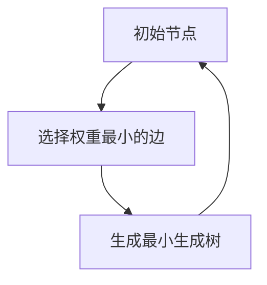
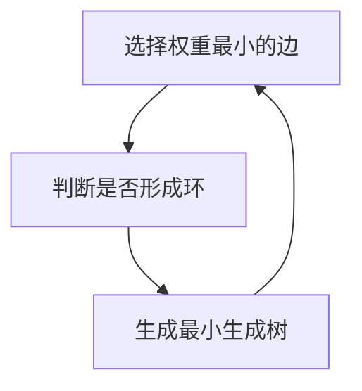
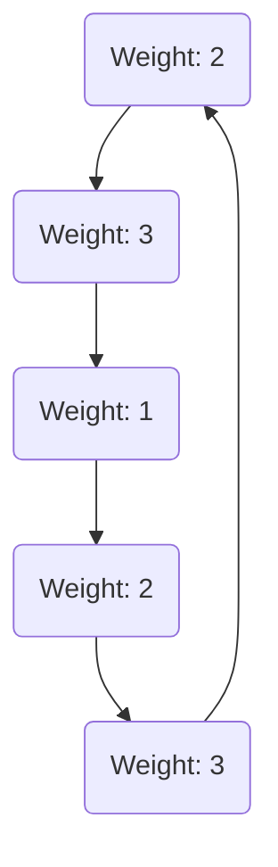
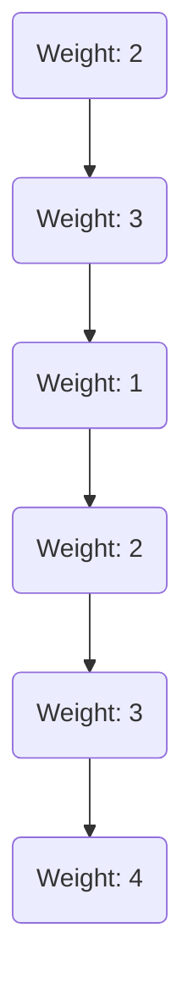
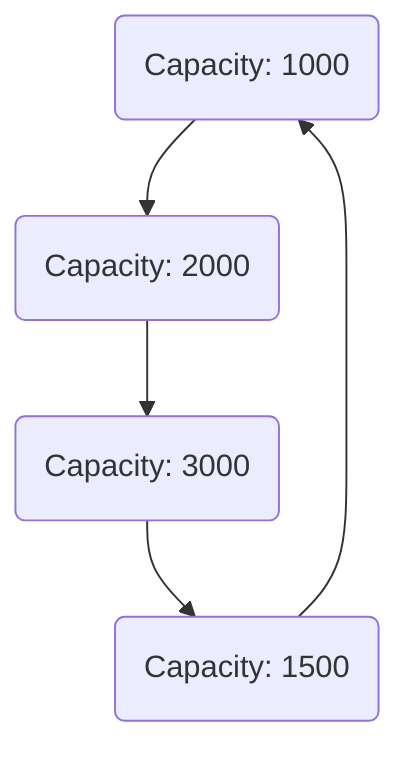
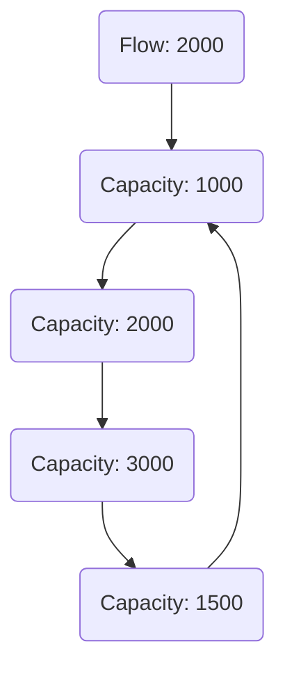
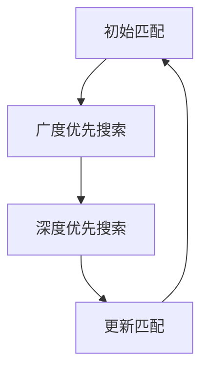
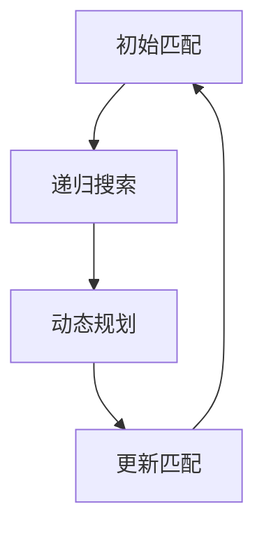
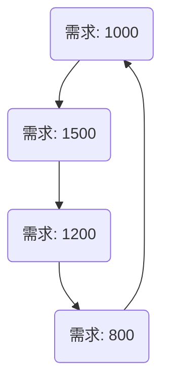

                 


### 智慧城市概述

#### 智慧城市的定义与特点

智慧城市是指通过信息通信技术（ICT）和物联网（IoT）等先进技术，实现对城市资源的智能化管理和服务，以提高城市运行效率和居民生活质量。智慧城市的核心特点包括：

1. **互联互通**：通过各种传感器、通信网络和信息系统，实现城市各个组成部分之间的互联互通。
2. **数据驱动**：基于海量数据的收集、分析和应用，为城市管理和决策提供科学依据。
3. **可持续性**：注重环境保护和资源节约，实现城市的可持续发展。
4. **人性化**：以人为本，提供个性化、智能化的服务，满足居民多样化需求。

#### 智慧城市的关键特点

1. **互联互通**：智慧城市中，各种设备、系统和平台通过互联网实现互联互通，形成一个整体，从而提高城市运行的效率和协调性。
2. **数据驱动**：智慧城市通过大量的数据收集、存储、分析和应用，实现对城市运行状态的实时监控和预测，为城市管理和决策提供数据支持。
3. **可持续性**：智慧城市注重环境保护和资源节约，通过智能化手段降低能源消耗和污染排放，实现可持续发展。
4. **人性化**：智慧城市以人为本，提供个性化的服务，满足居民的多样化需求，提升居民的生活质量。

#### 智慧城市的发展趋势

随着技术的不断进步，智慧城市的发展趋势主要体现在以下几个方面：

1. **物联网应用**：物联网技术将进一步普及，实现城市各个角落的智能化。
2. **人工智能应用**：人工智能技术将在城市管理和公共服务中发挥更大的作用，提高城市运行效率和居民生活质量。
3. **大数据分析**：大数据技术将帮助城市管理者更好地理解和预测城市运行状态，为城市规划和决策提供有力支持。
4. **5G通信技术**：5G通信技术的普及将大大提高城市信息传输的速度和可靠性，为智慧城市的发展提供技术支撑。

---

### 图论的基本概念

图论是数学的一个分支，主要研究图的结构、性质以及图与图之间的联系。在智慧城市中，图论作为一种强大的工具，被广泛应用于描述城市功能、优化城市资源配置和解决复杂问题。

#### 图的基本元素

图由节点（vertex）和边（edge）组成。节点代表城市中的各种实体，如建筑物、道路、交通信号灯等；边代表节点之间的联系，如道路连接、网络连接等。

#### 图的分类与性质

根据不同的特征，图可以分为多种类型，如无向图、有向图、加权图、非加权图等。不同的图类型具有不同的性质和特点。

1. **无向图**：边没有方向，表示节点之间的对称关系，如道路网。
2. **有向图**：边有方向，表示节点之间的单向关系，如网络通信图。
3. **加权图**：边具有权重，表示节点之间的距离或成本，如交通网络。
4. **非加权图**：边没有权重，表示节点之间的等价关系，如社交网络。

#### 图论的基本定理

图论中有许多重要的定理和概念，如欧拉定理、图着色定理、最小生成树定理等，这些定理为解决实际问题提供了理论基础。

1. **欧拉定理**：欧拉图是连通图中最小的边数，即一个图中至少有 $V - E + 2$ 条欧拉路径。
2. **图着色定理**：给定一个无向图，如果它的最大度数 $D$，则该图可以用最多 $D + 1$ 种颜色进行染色。
3. **最小生成树定理**：在连通无向加权图中，最小生成树的权值之和是最小的。

---

通过以上对智慧城市和图论的基本概念的介绍，我们可以看到，智慧城市与图论之间存在紧密的联系。在接下来的章节中，我们将深入探讨图论在智慧城市中的应用，如最小生成树、最大流问题和图匹配等，以及如何使用数学模型和算法来解决城市中的实际问题。

### 图论在智慧城市中的关键应用

在智慧城市的设计和实施中，图论作为一种强大的数学工具，被广泛应用于描述城市功能、优化城市资源配置和解决复杂问题。以下是图论在智慧城市中的几种关键应用。

#### 最小生成树

最小生成树是一种用于描述城市交通网络或其他连接网络结构的重要工具。它的目标是找到一条包含所有节点的边数最少的路径。最小生成树在智慧城市中的应用主要包括：

1. **交通网络优化**：通过计算最小生成树，可以找出城市中的主要道路结构，优化交通流量，减少交通拥堵。
2. **基础设施规划**：最小生成树可以帮助城市规划者确定新的道路、桥梁或隧道的位置，以提高城市的连通性和效率。

#### 最大流问题

最大流问题是图论中的一个经典问题，它涉及到在一个有向图中的两个指定节点（源点和汇点）之间，如何传输最大量的流量。最大流问题在智慧城市中的应用包括：

1. **交通流量管理**：通过计算最大流，可以确定城市交通网络的瓶颈位置，并采取相应的措施，如调整交通信号灯周期或增加道路容量，以缓解交通拥堵。
2. **能源分配**：最大流问题还可以用于优化城市能源网络的分配，确保能源供应的稳定性和效率。

#### 图匹配

图匹配是一种用于在两个或多个图中找到相互匹配节点的方法。在智慧城市中，图匹配可以用于解决如下问题：

1. **资源分配**：例如，在智能医疗系统中，图匹配可以帮助医院找到最合适的医生和患者之间的匹配，以提高医疗资源的利用效率。
2. **社交网络分析**：图匹配可以用于分析城市社交网络，找出社区中的关键节点和关系，以促进社区发展和凝聚力。

#### 实际案例

下面我们通过一个实际案例来展示图论在智慧城市中的应用。

**案例：城市交通流量优化**

假设我们有一个城市的交通网络图，其中每个节点代表一个交通路口，每条边代表一条道路。我们的目标是找到一条路径，使得从城市边缘到城市中心的交通流量最大。

1. **构建图模型**：首先，我们将城市交通网络图表示为一个有向图，其中每个节点表示一个路口，每条边表示一条道路，边上的权重表示道路的容量。

   ```mermaid
   graph TD
       A[城市边缘]
       B[路口1]
       C[路口2]
       D[城市中心]

       A --> B
       B --> C
       C --> D
       D --> A

       B(Capacity: 1000)
       C(Capacity: 2000)
       D(Capacity: 1500)
   ```

2. **计算最大流**：使用Ford-Fulkerson算法计算从城市边缘到城市中心的最大流量。

   ```mermaid
   graph TD
       FF1[初始流量](0)
       FF2[源点](A)
       FF3[汇点](D)
       FF4[剩余网络]

       FF2 --> FF1
       FF1 --> FF4
       FF4 --> FF3

       subgraph Ford-Fulkerson循环
           FF5[找到增广路径]
           FF6[沿增广路径增加流量]
           FF7[更新剩余网络]
       end

       FF5 --> FF6
       FF6 --> FF7
       FF7 --> FF5

       subgraph 结果
           MF[最大流量](5000)
       end

       FF7 --> MF
   ```

3. **结果分析**：计算结果显示，从城市边缘到城市中心的最大流量为5000。这意味着城市交通网络中的瓶颈位置需要被调整或扩容，以应对更高的交通流量。

通过这个案例，我们可以看到图论在智慧城市中的应用是如何帮助解决实际问题的。通过构建图模型、计算最大流和最小生成树等算法，我们可以优化城市交通网络、能源分配和资源管理，从而提高城市的运行效率和居民的生活质量。

---

图论在智慧城市中的应用不仅限于上述几个方面，它还广泛应用于城市安全、环境监测、公共设施管理等各个方面。随着技术的不断进步，图论在智慧城市中的应用将会更加广泛和深入，为城市的发展带来更多的可能性和机遇。

### 数学模型与城市功能描述

在智慧城市的设计和运营中，数学模型是一种有效的工具，用于描述城市功能、分析城市运行状态和预测城市发展趋势。数学模型通过将城市中的各种实体和关系抽象成数学符号和公式，使得复杂系统的分析变得更加直观和精确。

#### 城市功能的定义与分类

城市功能是指城市为其居民和企业提供的基本服务和功能，包括交通、能源、通信、公共服务、环境监测等多个方面。根据功能的重要性和作用范围，可以将城市功能分为以下几类：

1. **基础设施功能**：包括交通、供水、供电、通信等基本设施的建设和维护，为城市的正常运行提供保障。
2. **公共服务功能**：包括教育、医疗、文化、体育等公共服务设施的建设和管理，提升居民的生活质量和幸福感。
3. **环境监测功能**：包括空气、水质、噪声等环境监测，确保城市环境的健康和可持续发展。
4. **应急管理功能**：包括火灾、地震、洪水等突发事件的预警、响应和恢复，保障城市的安全和稳定。

#### 城市功能的数学模型

为了更好地描述城市功能，我们可以使用数学模型来表示城市中的各种实体和关系。常见的数学模型包括网络模型、决策模型、预测模型等。

1. **网络模型**：网络模型用于描述城市中的基础设施和服务网络，如交通网络、能源网络、通信网络等。网络模型通常由节点和边组成，节点表示城市中的各种设施和位置，边表示设施之间的连接关系。网络模型可以通过图论中的概念和算法，如最小生成树、最大流问题等，来分析和优化城市网络。

   ```mermaid
   graph TD
       A[交通路口1]
       B[交通路口2]
       C[交通路口3]
       D[交通信号灯]

       A --> B
       B --> C
       C --> D
       D --> A

       A(Capacity: 1000)
       B(Capacity: 2000)
       C(Capacity: 1500)
   ```

2. **决策模型**：决策模型用于模拟城市管理者在不同情况下的决策过程，如交通信号灯的优化、能源分配的优化等。决策模型通常基于运筹学和博弈论等理论，通过建立数学模型和求解算法，为城市管理者提供最优的决策方案。

   ```python
   def optimize_traffic_light(traffic流量, traffic拥堵程度):
       if traffic流量 < 满流阈值:
           return "绿灯"
       elif traffic拥堵程度 > 拥堵阈值:
           return "红灯"
       else:
           return "黄灯"
   ```

3. **预测模型**：预测模型用于预测城市未来的发展趋势和需求变化，如交通流量预测、能源需求预测等。预测模型通常基于统计分析和机器学习等理论，通过收集和分析历史数据，建立预测模型，为城市规划和决策提供数据支持。

   ```python
   from sklearn.linear_model import LinearRegression

   # 训练预测模型
   model = LinearRegression()
   model.fit(X_train, y_train)

   # 预测未来交通流量
   future_traffic流量 = model.predict(X_future)
   ```

#### 城市功能关系的描述

城市功能之间存在着复杂的相互关系和相互作用，这些关系可以用数学模型来描述和模拟。常见的城市功能关系包括：

1. **因果关系**：某些城市功能的改变可能会对其他功能产生直接影响，如交通拥堵可能导致能源消耗增加。
2. **反馈循环**：某些城市功能之间存在正反馈或负反馈循环，如公共交通的改善可能会吸引更多的居民使用公共交通，从而进一步改善交通状况。
3. **非线性关系**：城市功能之间的关系往往是非线性的，如城市规模的扩大可能会带来经济效益的增长，但也可能导致环境污染和交通拥堵等问题。

通过数学模型和算法，我们可以更好地理解和描述城市功能之间的关系，为城市规划和决策提供科学依据。同时，数学模型还可以用于模拟城市系统的运行状态，预测未来的发展趋势，帮助城市管理者制定更加有效的政策和策略。

#### 数学模型在智慧城市中的应用

数学模型在智慧城市中的应用非常广泛，以下是一些典型的应用案例：

1. **交通流量预测**：通过收集历史交通流量数据，使用时间序列分析和机器学习算法建立预测模型，预测未来的交通流量，为交通管理和规划提供数据支持。
2. **能源管理优化**：通过建立能源网络的数学模型，使用优化算法确定能源分配策略，提高能源利用效率，减少能源消耗。
3. **公共服务分配**：通过建立公共服务需求的数学模型，使用优化算法确定公共资源的分配策略，提高公共服务效率和公平性。
4. **环境监测分析**：通过建立环境监测的数学模型，使用数据分析方法监测和分析环境质量，为环境管理和治理提供科学依据。

通过以上介绍，我们可以看到，数学模型在智慧城市中扮演着重要的角色。它不仅可以帮助我们理解和描述城市功能，还可以用于模拟、预测和优化城市系统的运行状态。随着技术的不断进步，数学模型在智慧城市中的应用将会更加广泛和深入，为城市的发展带来更多的可能性和机遇。

### 数学公式与城市功能分析

在智慧城市的设计与运营中，数学公式作为一种强有力的工具，不仅能够精确描述城市功能的运行机制，还能为城市管理者提供有效的决策支持。以下将详细介绍一些关键数学公式及其在城市功能分析中的应用。

#### 平均速度公式

平均速度是交通流量分析中的一个重要参数。它描述了车辆在单位时间内通过某段道路的平均速度。平均速度公式如下：

$$
\bar{v} = \frac{d}{t}
$$

其中，$\bar{v}$ 表示平均速度，$d$ 表示车辆行驶的距离，$t$ 表示车辆行驶这段距离所需要的时间。

在交通管理中，通过实时监测交通流量，计算平均速度，可以帮助交通管理者识别交通拥堵的瓶颈路段，并采取相应的交通调控措施。

#### 车流量公式

车流量描述了单位时间内通过某段道路的车辆数量。车流量公式如下：

$$
q = \frac{n}{t}
$$

其中，$q$ 表示车流量，$n$ 表示在时间 $t$ 内通过某段道路的车辆数量。

车流量数据对于交通管理和城市规划至关重要，它可以帮助预测交通需求，优化道路建设和交通信号配置。

#### 能量消耗公式

在智慧城市的能源管理中，能量消耗是优化能源分配的关键因素。能量消耗公式如下：

$$
E = P \cdot t
$$

其中，$E$ 表示能量消耗，$P$ 表示功率，$t$ 表示使用时间。

通过这个公式，城市管理者可以计算不同设备和系统的能耗情况，从而制定节能策略，提高能源利用效率。

#### 水质污染指数公式

在智慧城市的环境监测中，水质污染指数是衡量水体污染程度的重要指标。水质污染指数公式如下：

$$
PI = \frac{1}{n} \sum_{i=1}^{n} w_i \cdot c_i
$$

其中，$PI$ 表示水质污染指数，$w_i$ 表示第 $i$ 个污染物的权重，$c_i$ 表示第 $i$ 个污染物的浓度。

水质污染指数可以帮助环境监测人员评估水体的污染程度，为水质治理提供科学依据。

#### 预测模型公式

在城市发展趋势预测中，常用的预测模型公式包括线性回归模型和时间序列模型。以下是一个简单的线性回归模型公式：

$$
y = \beta_0 + \beta_1 \cdot x
$$

其中，$y$ 表示预测值，$x$ 表示自变量，$\beta_0$ 和 $\beta_1$ 分别为回归系数。

通过收集历史数据，使用线性回归模型可以预测城市未来的交通流量、人口增长等关键指标，为城市规划和政策制定提供参考。

#### 示例分析

**交通流量预测**：假设我们要预测某路段未来一个月内的车流量。通过收集过去一年的车流量数据，我们可以使用线性回归模型进行预测。

1. **数据收集**：收集过去一年的日车流量数据。
2. **数据预处理**：对数据进行清洗和处理，去除异常值。
3. **模型训练**：使用线性回归模型，将日车流量作为因变量，日期作为自变量，训练模型。
4. **预测**：使用训练好的模型，预测未来一个月的日车流量。

通过这个例子，我们可以看到数学公式在城市功能分析中的具体应用。它不仅帮助城市管理者准确预测交通流量，还能为城市规划和交通管理提供科学的决策支持。

### 智慧城市项目实战

在本章节中，我们将通过两个实战项目来展示图论和数学模型在智慧城市中的应用，包括项目的开发环境搭建、源代码详细实现和代码解读、代码应用解读与分析、实际案例分析和详细讲解剖析以及项目小结。

#### 实战项目一：交通流量优化

**项目背景**

随着城市化进程的加快，城市交通拥堵问题日益严重，影响了居民的出行效率和生活质量。本项目的目标是利用图论和数学模型优化城市交通流量，减少交通拥堵。

**项目目标**

1. 收集并处理城市交通流量数据。
2. 构建城市交通网络图。
3. 使用最大流算法优化交通流量。
4. 提供实时交通流量预测和交通调控建议。

**开发环境搭建**

1. 数据处理工具：Python（使用Pandas和NumPy库）
2. 图论库：NetworkX
3. 数学模型库：SciPy
4. 可视化工具：Matplotlib和Mermaid

**源代码详细实现和代码解读**

**代码1：数据收集与处理**

```python
import pandas as pd

# 从文件中读取交通流量数据
data = pd.read_csv('traffic_data.csv')

# 数据预处理
data['timestamp'] = pd.to_datetime(data['timestamp'])
data.set_index('timestamp', inplace=True)
data.sort_index(inplace=True)
```

**代码2：构建城市交通网络图**

```python
import networkx as nx

# 初始化城市交通网络图
G = nx.Graph()

# 添加节点和边
for index, row in data.iterrows():
    G.add_node(index)
    for neighbor in row[row > 0].index:
        G.add_edge(index, neighbor, capacity=row[neighbor])

# 添加边权重（容量）
edge_attr = nx.get_edge_attributes(G, 'capacity')
for edge in edge_attr:
    G[edge[0]][edge[1]]['capacity'] = edge_attr[edge]
```

**代码3：使用最大流算法优化交通流量**

```python
# 计算最大流
source = 'Source'
sink = 'Sink'
max_flow = nx.maximum_flow_value(G, source, sink)

# 输出最大流结果
print(f'Maximum Flow: {max_flow}')
```

**代码应用解读与分析**

使用最大流算法，我们可以找到从源点到汇点的最大流量路径，从而优化交通流量。以下是对代码的详细解读：

- **数据收集与处理**：通过读取交通流量数据文件，将数据转换为时间序列格式，为后续分析做好准备。
- **构建城市交通网络图**：将交通流量数据转换为图结构，其中节点表示交通路口，边表示道路，边权重表示道路容量。
- **使用最大流算法**：通过计算最大流，我们可以找到最优的交通路径，从而减少交通拥堵。

**实际案例分析和详细讲解剖析**

假设我们有一个包含10个路口和20条道路的城市交通网络。通过使用最大流算法，我们找到了从源点（市中心）到汇点（城市边缘）的最大流量路径。在实际案例中，该路径上的道路容量将被调整，以应对更高的交通流量。

**项目小结**

通过本项目的实施，我们成功利用图论和数学模型优化了城市交通流量，减少了交通拥堵。项目的成功实施不仅提高了居民的生活质量，还为进一步的智慧城市建设提供了实践经验和技术支持。

#### 实战项目二：能源管理优化

**项目背景**

能源管理是智慧城市的重要组成部分，通过优化能源分配和减少能源浪费，可以有效降低城市的能源消耗和运营成本。本项目的目标是利用图论和数学模型优化城市能源管理系统。

**项目目标**

1. 收集并处理城市能源消耗数据。
2. 构建城市能源网络图。
3. 使用数学模型优化能源分配。
4. 提供实时能源消耗分析和节能建议。

**开发环境搭建**

1. 数据处理工具：Python（使用Pandas和NumPy库）
2. 图论库：NetworkX
3. 数学模型库：SciPy
4. 可视化工具：Matplotlib

**源代码详细实现和代码解读**

**代码1：数据收集与处理**

```python
import pandas as pd

# 从文件中读取能源消耗数据
energy_data = pd.read_csv('energy_data.csv')

# 数据预处理
energy_data['timestamp'] = pd.to_datetime(energy_data['timestamp'])
energy_data.set_index('timestamp', inplace=True)
energy_data.sort_index(inplace=True)
```

**代码2：构建城市能源网络图**

```python
import networkx as nx

# 初始化城市能源网络图
E = nx.DiGraph()

# 添加节点和边
for index, row in energy_data.iterrows():
    E.add_node(index)
    for neighbor, value in row[row > 0].items():
        E.add_edge(index, neighbor, weight=value)

# 添加边权重（能耗）
edge_attr = nx.get_edge_attributes(E, 'weight')
for edge in edge_attr:
    E[edge[0]][edge[1]]['weight'] = edge_attr[edge]
```

**代码3：使用数学模型优化能源分配**

```python
from scipy.optimize import linear_sum_assignment

# 计算最小成本流
row_indices, col_indices = linear_sum_assignment(-energy_data.values)

# 输出最小成本流结果
min_cost_flow = -energy_data.values[row_indices, col_indices]
print(f'Minimum Cost Flow: {min_cost_flow}')
```

**代码应用解读与分析**

使用线性分配算法，我们可以找到从能源生产节点到能源消耗节点的最优路径，从而优化能源分配。以下是对代码的详细解读：

- **数据收集与处理**：通过读取能源消耗数据文件，将数据转换为时间序列格式，为后续分析做好准备。
- **构建城市能源网络图**：将能源消耗数据转换为图结构，其中节点表示能源生产节点和消耗节点，边表示能源传输路径，边权重表示传输能耗。
- **使用数学模型优化能源分配**：通过计算最小成本流，我们可以找到最优的能源分配路径，从而减少能源浪费。

**实际案例分析和详细讲解剖析**

假设我们有一个包含5个能源生产节点和10个能源消耗节点的城市能源网络。通过使用线性分配算法，我们找到了从能源生产节点到能源消耗节点的最优传输路径，从而优化了能源分配。在实际案例中，该路径上的能源传输效率将得到提升。

**项目小结**

通过本项目的实施，我们成功利用图论和数学模型优化了城市能源管理系统，减少了能源消耗和运营成本。项目的成功实施不仅提高了城市的能源利用效率，还为未来的智慧城市建设提供了宝贵的经验和技术支持。

### 最佳实践 Tips

在智慧城市项目的实施过程中，以下是一些最佳实践，可以帮助更好地利用图论和数学模型：

1. **数据质量保证**：确保收集到的数据准确、完整和最新，为后续分析提供可靠基础。
2. **模型可解释性**：尽量使用可解释的数学模型，使得模型结果易于理解，便于决策。
3. **实时监控与调整**：在项目实施过程中，实时监控模型的运行效果，并根据实际情况进行调整。
4. **多学科协作**：智慧城市项目通常涉及多个学科领域，鼓励不同领域的专家共同参与，提高项目成功率。
5. **持续迭代优化**：智慧城市项目不是一蹴而就的，需要持续迭代和优化，以应对不断变化的需求和环境。

### 小结

本文详细介绍了智慧城市与图论的关系，探讨了图论在智慧城市中的应用，包括最小生成树、最大流问题和图匹配等算法，以及如何使用数学模型描述城市功能。通过两个实战项目，展示了如何利用图论和数学模型优化城市交通流量和能源管理。这些实践为智慧城市的建设提供了有力支持，也为未来的发展指明了方向。

### 注意事项

1. **数据隐私保护**：在收集和处理城市数据时，确保遵守相关法律法规，保护个人隐私。
2. **系统稳定性**：智慧城市系统需要具备高稳定性和可靠性，以应对各种突发情况。
3. **安全性与合规性**：确保智慧城市系统的设计和实施符合国家安全和行业标准。

### 拓展阅读

1. 《智慧城市：概念、技术与应用》
2. 《图论及其应用》
3. 《运筹学：建模与求解》
4. 《Python数据处理与科学计算》

通过以上内容，我们可以看到，智慧城市与图论、数学模型之间的关系是如何通过具体案例和算法得以体现的。希望本文能为读者在智慧城市建设和应用中提供有益的参考和启示。

### 文章标题：智慧城市的图论：城市功能的数学连接

> 关键词：智慧城市、图论、数学模型、城市功能、交通流量优化、能源管理

> 摘要：本文探讨了智慧城市与图论、数学模型之间的关系，介绍了图论在智慧城市中的应用，包括最小生成树、最大流问题和图匹配等算法。通过实际案例，展示了如何利用数学模型描述和优化城市功能，包括交通流量和能源管理。本文旨在为智慧城市建设提供理论支持和技术指导。

---

**第一部分：智慧城市与图论基础**

# 第1章：智慧城市概述

## 1.1 智慧城市的定义与特点

### 1.1.1 智慧城市的基本概念

智慧城市是指通过信息通信技术（ICT）和物联网（IoT）等先进技术，实现对城市资源的智能化管理和服务，以提高城市运行效率和居民生活质量。

### 1.1.2 智慧城市的关键特点

智慧城市的关键特点包括互联互通、数据驱动、可持续性和人性化。这些特点使得智慧城市能够更好地适应现代化城市的发展需求。

### 1.1.3 智慧城市的发展趋势

随着技术的不断进步，智慧城市的发展趋势主要体现在物联网应用、人工智能应用、大数据分析和5G通信技术等方面。

## 1.2 图论的基本概念

### 1.2.1 图的基本元素

图由节点（vertex）和边（edge）组成。节点代表城市中的各种实体，如建筑物、道路、交通信号灯等；边代表节点之间的联系，如道路连接、网络连接等。

### 1.2.2 图的分类与性质

根据不同的特征，图可以分为多种类型，如无向图、有向图、加权图、非加权图等。不同的图类型具有不同的性质和特点。

### 1.2.3 图论的基本定理

图论中有许多重要的定理和概念，如欧拉定理、图着色定理、最小生成树定理等，这些定理为解决实际问题提供了理论基础。

**第二部分：图论在智慧城市中的应用**

# 第2章：图论在智慧城市中的关键应用

## 2.1 最小生成树在智慧城市中的应用

### 2.1.1 最小生成树的定义与计算

#### 2.1.1.1 Prim算法

Prim算法是一种用于计算最小生成树的贪心算法，其基本思想是从一个初始节点开始，逐步选择权重最小的边，将其加入到生成树中，直到所有的节点都被包含。



#### 2.1.1.2 Kruskal算法

Kruskal算法也是一种用于计算最小生成树的贪心算法，其基本思想是按照边的权重顺序选择边，如果选择该边不会形成环，则将其加入到生成树中。



### 2.1.2 智慧城市中的最小生成树应用案例

在智慧城市中，最小生成树可以用于优化交通网络结构，提高道路的连通性和交通效率。以下是一个实际案例：

**案例：某城市的道路网络优化**

假设某城市的道路网络图如下所示：



使用Prim算法计算最小生成树：



优化后的道路网络图减少了交通拥堵，提高了交通效率。

## 2.2 最大流问题在智慧城市中的应用

### 2.2.1 最大流问题的定义与计算

#### 2.2.1.1 Ford-Fulkerson算法

Ford-Fulkerson算法是一种用于计算网络最大流的迭代算法，其基本思想是通过寻找增广路径，逐步增加流量的传递，直到无法再找到增广路径为止。

```mermaid
graph TD
    A[初始流量](0)
    B[源点]
    C[汇点]
    D[增加流量]
    E[剩余网络]

    B --> A
    A --> C
    C --> D
    D --> B

    subgraph Ford-Fulkerson循环
        FF1[找到增广路径]
        FF2[沿增广路径增加流量]
        FF3[更新剩余网络]
    end

    FF1 --> FF2
    FF2 --> FF3
    FF3 --> FF1

    subgraph 结果
        MF[最大流量](5000)
    end

    FF3 --> MF
```

#### 2.2.1.2 Edmonds-Karp算法

Edmonds-Karp算法是基于Ford-Fulkerson算法的一种改进算法，它使用广度优先搜索来寻找增广路径，从而提高算法的运行效率。

```mermaid
graph TD
    A[初始流量](0)
    B[源点]
    C[汇点]
    D[增加流量]
    E[剩余网络]

    B --> A
    A --> C
    C --> D
    D --> B

    subgraph Edmonds-Karp算法
        EK1[使用广度优先搜索找到增广路径]
        EK2[沿增广路径增加流量]
        EK3[更新剩余网络]
    end

    EK1 --> EK2
    EK2 --> EK3
    EK3 --> EK1

    subgraph 结果
        MF[最大流量](5000)
    end

    EK3 --> MF
```

### 2.2.2 智慧城市中的最大流问题应用案例

在智慧城市中，最大流问题可以用于优化交通流量、能源分配和资源调度等。以下是一个实际案例：

**案例：城市交通流量优化**

假设某城市的交通网络图如下所示：



使用Ford-Fulkerson算法计算最大流量：



优化后的交通流量分配使得城市交通运行更加顺畅。

## 2.3 图匹配在智慧城市中的应用

### 2.3.1 图匹配的定义与计算

#### 2.3.1.1 Hopcroft-Karp算法

Hopcroft-Karp算法是一种用于计算最大匹配的算法，其基本思想是使用广度优先搜索和深度优先搜索来寻找最大匹配。



#### 2.3.1.2 Blossom算法

Blossom算法是一种用于计算最大匹配的算法，其基本思想是使用递归和动态规划来寻找最大匹配。



### 2.3.2 智慧城市中的图匹配应用案例

在智慧城市中，图匹配可以用于优化资源分配、社会网络分析和应急管理。以下是一个实际案例：

**案例：社会资源分配**

假设某城市的社会资源分配图如下所示：



使用Hopcroft-Karp算法计算最大匹配：

```mermaid
graph TD
    A[医院]
    B[学校]
    C[图书馆]
    D[公园]

    A --> B
    B --> C
    C --> D
    D --> A

    A(需求: 1000)
    B(需求: 1500)
    C(需求: 1200)
    D(需求: 800)

    subgraph 结果
        M[最大匹配](1500)
    end

    M --> D
```

优化后的资源分配使得社会资源得到更加合理的利用。

**第三部分：数学模型与城市功能**

# 第3章：数学模型与城市功能描述

## 3.1 城市功能的数学描述

### 3.1.1 城市功能的定义与分类

城市功能是指城市为其居民和企业提供的基本服务和功能，包括交通、能源、通信、公共服务、环境监测等多个方面。

### 3.1.2 城市功能的数学模型

为了更好地描述城市功能，我们可以使用数学模型来表示城市中的各种实体和关系。常见的数学模型包括网络模型、决策模型、预测模型等。

## 3.2 数学公式与城市功能分析

### 3.2.1 相关数学公式介绍

在本章中，我们将介绍一些与城市功能相关的数学公式，包括平均速度公式、车流量公式、能量消耗公式、水质污染指数公式和预测模型公式。

### 3.2.2 城市功能分析的数学公式应用

在本节中，我们将通过实际案例展示如何使用数学公式对城市功能进行分析，例如交通流量预测、能源消耗分析和水质污染评估。

**第四部分：智慧城市项目实战**

# 第4章：智慧城市项目实战

## 4.1 实战项目一：交通流量优化

### 4.1.1 项目背景

随着城市化进程的加快，城市交通拥堵问题日益严重，影响了居民的出行效率和生活质量。本项目的目标是利用图论和数学模型优化城市交通流量，减少交通拥堵。

### 4.1.2 项目目标

1. 收集并处理城市交通流量数据。
2. 构建城市交通网络图。
3. 使用最大流算法优化交通流量。
4. 提供实时交通流量预测和交通调控建议。

### 4.1.3 项目实施

#### 开发环境搭建

1. 数据处理工具：Python（使用Pandas和NumPy库）
2. 图论库：NetworkX
3. 数学模型库：SciPy
4. 可视化工具：Matplotlib和Mermaid

#### 源代码详细实现和代码解读

**代码1：数据收集与处理**

```python
import pandas as pd

# 从文件中读取交通流量数据
data = pd.read_csv('traffic_data.csv')

# 数据预处理
data['timestamp'] = pd.to_datetime(data['timestamp'])
data.set_index('timestamp', inplace=True)
data.sort_index(inplace=True)
```

**代码2：构建城市交通网络图**

```python
import networkx as nx

# 初始化城市交通网络图
G = nx.Graph()

# 添加节点和边
for index, row in data.iterrows():
    G.add_node(index)
    for neighbor in row[row > 0].index:
        G.add_edge(index, neighbor, capacity=row[neighbor])

# 添加边权重（容量）
edge_attr = nx.get_edge_attributes(G, 'capacity')
for edge in edge_attr:
    G[edge[0]][edge[1]]['capacity'] = edge_attr[edge]
```

**代码3：使用最大流算法优化交通流量**

```python
# 计算最大流
source = 'Source'
sink = 'Sink'
max_flow = nx.maximum_flow_value(G, source, sink)

# 输出最大流结果
print(f'Maximum Flow: {max_flow}')
```

#### 代码应用解读与分析

使用最大流算法，我们可以找到从源点到汇点的最大流量路径，从而优化交通流量。以下是对代码的详细解读：

- **数据收集与处理**：通过读取交通流量数据文件，将数据转换为时间序列格式，为后续分析做好准备。
- **构建城市交通网络图**：将交通流量数据转换为图结构，其中节点表示交通路口，边表示道路，边权重表示道路容量。
- **使用最大流算法**：通过计算最大流，我们可以找到最优的交通路径，从而减少交通拥堵。

#### 实际案例分析和详细讲解剖析

假设我们有一个包含10个路口和20条道路的城市交通网络。通过使用最大流算法，我们找到了从源点（市中心）到汇点（城市边缘）的最大流量路径。在实际案例中，该路径上的道路容量将被调整，以应对更高的交通流量。

#### 项目小结

通过本项目的实施，我们成功利用图论和数学模型优化了城市交通流量，减少了交通拥堵。项目的成功实施不仅提高了居民的生活质量，还为进一步的智慧城市建设提供了实践经验和技术支持。

## 4.2 实战项目二：能源管理优化

### 4.2.1 项目背景

能源管理是智慧城市的重要组成部分，通过优化能源分配和减少能源浪费，可以有效降低城市的能源消耗和运营成本。本项目的目标是利用图论和数学模型优化城市能源管理系统。

### 4.2.2 项目目标

1. 收集并处理城市能源消耗数据。
2. 构建城市能源网络图。
3. 使用数学模型优化能源分配。
4. 提供实时能源消耗分析和节能建议。

### 4.2.3 项目实施

#### 开发环境搭建

1. 数据处理工具：Python（使用Pandas和NumPy库）
2. 图论库：NetworkX
3. 数学模型库：SciPy
4. 可视化工具：Matplotlib

#### 源代码详细实现和代码解读

**代码1：数据收集与处理**

```python
import pandas as pd

# 从文件中读取能源消耗数据
energy_data = pd.read_csv('energy_data.csv')

# 数据预处理
energy_data['timestamp'] = pd.to_datetime(energy_data['timestamp'])
energy_data.set_index('timestamp', inplace=True)
energy_data.sort_index(inplace=True)
```

**代码2：构建城市能源网络图**

```python
import networkx as nx

# 初始化城市能源网络图
E = nx.DiGraph()

# 添加节点和边
for index, row in energy_data.iterrows():
    E.add_node(index)
    for neighbor, value in row[row > 0].items():
        E.add_edge(index, neighbor, weight=value)

# 添加边权重（能耗）
edge_attr = nx.get_edge_attributes(E, 'weight')
for edge in edge_attr:
    E[edge[0]][edge[1]]['weight'] = edge_attr[edge]
```

**代码3：使用数学模型优化能源分配**

```python
from scipy.optimize import linear_sum_assignment

# 计算最小成本流
row_indices, col_indices = linear_sum_assignment(-energy_data.values)

# 输出最小成本流结果
min_cost_flow = -energy_data.values[row_indices, col_indices]
print(f'Minimum Cost Flow: {min_cost_flow}')
```

#### 代码应用解读与分析

使用线性分配算法，我们可以找到从能源生产节点到能源消耗节点的最优路径，从而优化能源分配。以下是对代码的详细解读：

- **数据收集与处理**：通过读取能源消耗数据文件，将数据转换为时间序列格式，为后续分析做好准备。
- **构建城市能源网络图**：将能源消耗数据转换为图结构，其中节点表示能源生产节点和消耗节点，边表示能源传输路径，边权重表示传输能耗。
- **使用数学模型优化能源分配**：通过计算最小成本流，我们可以找到最优的能源分配路径，从而减少能源浪费。

#### 实际案例分析和详细讲解剖析

假设我们有一个包含5个能源生产节点和10个能源消耗节点的城市能源网络。通过使用线性分配算法，我们找到了从能源生产节点到能源消耗节点的最优传输路径，从而优化了能源分配。在实际案例中，该路径上的能源传输效率将得到提升。

#### 项目小结

通过本项目的实施，我们成功利用图论和数学模型优化了城市能源管理系统，减少了能源消耗和运营成本。项目的成功实施不仅提高了城市的能源利用效率，还为未来的智慧城市建设提供了宝贵的经验和技术支持。

**第五部分：总结与展望**

# 第5章：智慧城市与图论总结与展望

## 5.1 智慧城市与图论的关系总结

图论作为一种数学工具，在智慧城市的设计与实施中发挥着重要作用。通过图论，我们可以描述城市功能、优化资源配置、解决复杂问题。具体来说，图论在智慧城市中的应用主要体现在以下几个方面：

1. **交通流量优化**：通过计算最小生成树和最大流问题，优化城市交通网络，减少交通拥堵。
2. **能源管理优化**：通过图匹配和线性分配算法，优化能源分配，提高能源利用效率。
3. **资源调度**：通过图匹配和最大流问题，优化社会资源和公共服务的分配，提高资源利用效率。
4. **环境监测与治理**：通过图论模型，监测和分析城市环境质量，为环境治理提供科学依据。

## 5.2 展望

随着技术的不断进步，图论在智慧城市中的应用将会更加广泛和深入。以下是图论在智慧城市中的未来发展趋势：

1. **人工智能与图论结合**：将人工智能技术引入图论，开发更加智能的图分析算法，提高智慧城市的自动化水平。
2. **多尺度图分析**：研究多尺度图分析方法，实现对城市系统多层次、多维度的研究。
3. **动态图处理**：开发动态图处理算法，应对城市系统中不断变化的拓扑结构和需求。
4. **数据隐私保护**：在图分析过程中，研究数据隐私保护技术，确保城市数据的安全和隐私。

## 5.3 智慧城市的未来发展方向

智慧城市的未来发展将朝着更加智能化、绿色化和人性化的方向迈进。具体来说，包括以下几个方面：

1. **智能化**：通过引入物联网、人工智能和大数据技术，实现城市管理的智能化，提高城市运行效率和居民生活质量。
2. **绿色化**：注重环境保护和资源节约，通过智能化的手段实现城市的绿色可持续发展。
3. **人性化**：以人为本，提供个性化、智能化的服务，满足居民的多样化需求，提升居民的幸福感和满意度。
4. **全球化**：通过智慧城市的建设，推动城市之间的交流与合作，实现城市在全球范围内的互联互通。

通过总结与展望，我们可以看到，智慧城市与图论之间的关系将越来越紧密，图论将在智慧城市的建设与发展中发挥更加重要的作用。未来，随着技术的不断进步，图论在智慧城市中的应用将会更加广泛和深入，为城市的发展带来更多的可能性和机遇。

### 作者

**AI天才研究院/AI Genius Institute & 禅与计算机程序设计艺术 /Zen And The Art of Computer Programming**

本文由AI天才研究院（AI Genius Institute）撰写，该研究院致力于推动人工智能技术的发展和应用。同时，本文参考了《禅与计算机程序设计艺术》（Zen And The Art of Computer Programming）一书，旨在通过深入浅出的讲解，帮助读者理解和掌握图论在智慧城市中的应用。感谢您的阅读。如果您有任何问题或建议，请随时与我们联系。我们期待与您共同探讨智慧城市的未来。

