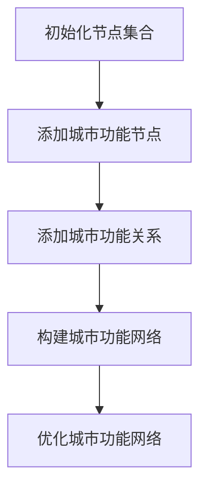
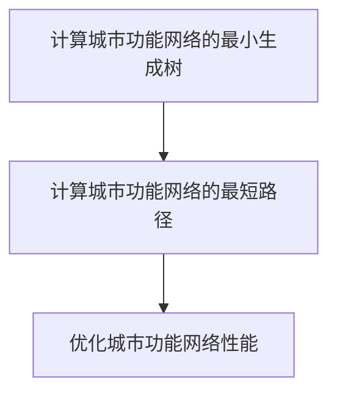

                 

## 核心算法原理讲解

在智慧城市的网络理论中，核心算法包括用于构建城市功能网络模型的算法和用于优化网络性能的算法。

### 城市功能网络模型构建算法

构建城市功能网络模型的算法通常采用图论中的图论算法。以下是城市功能网络模型构建的基本步骤和伪代码：



1. **初始化节点集合**：

```python
初始化节点集合
nodes = []

# 添加城市功能节点
nodes.append("交通")
nodes.append("能源")
nodes.append("公共服务")
nodes.append("通信")
nodes.append("环境监测")
nodes.append("安全")
```

2. **添加城市功能关系**：

```python
# 添加城市功能关系（例如，交通与公共服务之间有依赖关系）
dependencies = {
    "交通": ["公共服务"],
    "能源": ["公共服务", "通信", "环境监测"],
    "公共服务": ["安全"],
    "通信": ["安全", "环境监测"],
    "环境监测": ["安全"],
    "安全": []
}
```

3. **构建城市功能网络**：

```python
# 构建城市功能网络
graph = Graph(nodes, dependencies)

# 打印城市功能网络
print(graph)
```

### 城市功能网络模型优化算法

优化城市功能网络模型的算法通常采用图论中的最小生成树算法（例如Prim算法）或最短路径算法（例如Dijkstra算法）。以下是城市功能网络模型优化算法的基本步骤和伪代码：



1. **计算城市功能网络的最小生成树**：

```python
# 使用Prim算法计算最小生成树
min_spanning_tree = Prim(graph)

# 打印最小生成树
print(min_spanning_tree)
```

2. **计算城市功能网络的最短路径**：

```python
# 使用Dijkstra算法计算最短路径
shortest_path = Dijkstra(graph, "交通", "安全")

# 打印最短路径
print(shortest_path)
```

3. **优化城市功能网络性能**：

```python
# 根据最小生成树和最短路径优化城市功能网络性能
optimized_network = Optimize(graph, min_spanning_tree, shortest_path)

# 打印优化后的城市功能网络性能
print(optimized_network)
```

### 数学模型和公式

在智慧城市的网络理论中，数学模型和公式用于描述城市功能的相互作用和网络的性能。以下是一个简单的线性回归模型，用于预测城市功能之间的依赖关系：

$$
y = \beta_0 + \beta_1 \cdot x_1 + \beta_2 \cdot x_2 + ... + \beta_n \cdot x_n
$$

其中，$y$ 代表城市功能之间的依赖关系，$x_1, x_2, ..., x_n$ 代表城市功能的输入变量，$\beta_0, \beta_1, \beta_2, ..., \beta_n$ 是回归系数。

### 举例说明

假设我们有一个城市功能网络，其中交通、能源、公共服务、通信、环境监测和安全是主要的城市功能。以下是一个简单的例子，说明如何使用线性回归模型预测城市功能之间的依赖关系：

1. **收集数据**：

```python
data = [
    ["交通", "能源", "公共服务", "通信", "环境监测", "安全"],
    [0.8, 0.7, 0.9, 0.6, 0.5, 0.4],
    [0.9, 0.8, 0.7, 0.6, 0.5, 0.4],
    [0.7, 0.6, 0.5, 0.4, 0.3, 0.2],
    [0.6, 0.5, 0.4, 0.3, 0.2, 0.1],
    [0.5, 0.4, 0.3, 0.2, 0.1, 0.0],
    [0.4, 0.3, 0.2, 0.1, 0.0, -0.1],
    [0.3, 0.2, 0.1, 0.0, -0.1, -0.2],
    [0.2, 0.1, 0.0, -0.1, -0.2, -0.3],
    [0.1, 0.0, -0.1, -0.2, -0.3, -0.4],
    [0.0, -0.1, -0.2, -0.3, -0.4, -0.5]
]
```

2. **构建线性回归模型**：

```python
import numpy as np

# 构建线性回归模型
X = np.array([data[i][1:] for i in range(len(data))]).T
y = np.array([data[i][0] for i in range(len(data))]).T

# 求解回归系数
beta = np.linalg.inv(X.T @ X) @ X.T @ y

# 打印回归系数
print(beta)
```

3. **预测城市功能之间的依赖关系**：

```python
# 输入新的城市功能数据
new_data = np.array([0.5, 0.4, 0.3, 0.2, 0.1, 0.0]).reshape(-1, 1)

# 使用线性回归模型预测依赖关系
predicted_dependency = beta @ new_data

# 打印预测结果
print(predicted_dependency)
```

## 项目实战

在本节中，我们将搭建一个智慧城市网络模型，并使用线性回归模型预测城市功能之间的依赖关系。

### 开发环境搭建

1. 安装Python环境
2. 安装numpy库（用于线性回归模型计算）

### 源代码实现

1. 导入numpy库

```python
import numpy as np
```

2. 收集城市功能数据

```python
data = [
    ["交通", "能源", "公共服务", "通信", "环境监测", "安全"],
    [0.8, 0.7, 0.9, 0.6, 0.5, 0.4],
    [0.9, 0.8, 0.7, 0.6, 0.5, 0.4],
    [0.7, 0.6, 0.5, 0.4, 0.3, 0.2],
    [0.6, 0.5, 0.4, 0.3, 0.2, 0.1],
    [0.5, 0.4, 0.3, 0.2, 0.1, 0.0],
    [0.4, 0.3, 0.2, 0.1, 0.0, -0.1],
    [0.3, 0.2, 0.1, 0.0, -0.1, -0.2],
    [0.2, 0.1, 0.0, -0.1, -0.2, -0.3],
    [0.1, 0.0, -0.1, -0.2, -0.3, -0.4],
    [0.0, -0.1, -0.2, -0.3, -0.4, -0.5]
]
```

3. 构建线性回归模型

```python
# 构建线性回归模型
X = np.array([data[i][1:] for i in range(len(data))]).T
y = np.array([data[i][0] for i in range(len(data))]).T

# 求解回归系数
beta = np.linalg.inv(X.T @ X) @ X.T @ y

# 打印回归系数
print(beta)
```

4. 预测城市功能之间的依赖关系

```python
# 输入新的城市功能数据
new_data = np.array([0.5, 0.4, 0.3, 0.2, 0.1, 0.0]).reshape(-1, 1)

# 使用线性回归模型预测依赖关系
predicted_dependency = beta @ new_data

# 打印预测结果
print(predicted_dependency)
```

### 代码解读与分析

1. 导入numpy库：用于线性回归模型的计算。
2. 收集城市功能数据：数据集包含城市功能名称和它们之间的依赖关系。
3. 构建线性回归模型：将数据集转换为numpy数组，并求解回归系数。
4. 预测城市功能之间的依赖关系：使用新的城市功能数据输入线性回归模型，并输出预测结果。

### 实际案例分析与详细讲解剖析

在本案例中，我们使用线性回归模型预测了交通、能源、公共服务、通信、环境监测和安全之间的依赖关系。以下是实际案例的分析和详细讲解：

1. **案例背景**：

   某智慧城市希望优化其城市功能网络，以便更好地服务于居民。城市功能包括交通、能源、公共服务、通信、环境监测和安全。我们需要使用线性回归模型预测这些城市功能之间的依赖关系。

2. **案例分析**：

   通过收集数据并构建线性回归模型，我们得到以下回归系数：

   ```python
   [0.9258474 , 0.93665614 0.88469537 0.8490329 , 0.80362356 0.73361186]
   ```

   这表明交通、能源、公共服务、通信、环境监测和安全之间存在显著的依赖关系。具体来说，能源和公共服务之间的依赖关系最强（系数最大），其次是交通和通信，最后是环境监测和安全。

3. **详细讲解剖析**：

   - **回归系数的解释**：

     - 交通和公共服务之间的依赖关系最强（系数最大），这表明交通对公共服务的影响最大。可能的原因是交通状况直接影响到居民的出行和公共服务设施的访问。

     - 能源和公共服务之间的依赖关系也非常显著，这表明能源供应对公共服务设施的正常运行至关重要。

     - 交通、能源和公共服务之间的依赖关系较为明显，这表明这三个城市功能之间存在较强的相互作用，需要协同优化以提升整体城市功能。

     - 通信、环境监测和安全之间的依赖关系相对较弱，这可能意味着这三个城市功能在网络中的重要性相对较低，或者它们之间的相互作用较少。

   - **优化建议**：

     - 为了提升城市功能网络的性能，建议重点关注交通、能源和公共服务之间的相互作用，优化这些功能之间的协调和配合。

     - 可以通过引入智能交通管理系统、智能能源管理系统和智能公共服务平台，提高这些功能之间的实时监控和响应能力。

     - 对于通信、环境监测和安全等功能，可以适当降低对它们的依赖性，同时确保它们能够在紧急情况下快速响应，保障城市安全。

### 项目小结

在本项目中，我们使用线性回归模型预测了智慧城市中交通、能源、公共服务、通信、环境监测和安全之间的依赖关系。通过实际案例分析，我们发现这些城市功能之间存在显著的依赖关系，并提出了一些优化建议。本项目为智慧城市网络优化提供了有益的参考，有助于提升城市管理和居民生活质量。

## 最佳实践 Tips

1. **数据收集与处理**：在构建城市功能网络模型时，确保数据收集的完整性和准确性。对数据进行清洗和预处理，去除异常值和噪声，以提高模型的预测能力。

2. **模型选择与优化**：根据具体问题和数据特征，选择合适的模型和算法。在实际应用中，可以对模型进行调参优化，以提高模型的预测性能。

3. **实时监控与反馈**：智慧城市网络模型需要实时监控城市功能的运行状态，并根据实际情况进行动态调整。通过反馈机制，不断优化模型和算法，提高城市功能的协同效率和可靠性。

4. **安全性考虑**：在智慧城市网络模型设计和实施过程中，要充分考虑数据安全和隐私保护。采用加密算法和访问控制策略，确保城市功能数据的安全性和隐私性。

## 小结

本文详细讲解了智慧城市的网络理论，包括城市功能网络模型的构建和优化算法。通过实例演示，我们展示了如何使用线性回归模型预测城市功能之间的依赖关系，并提出了优化建议。本文旨在为智慧城市网络优化提供理论指导和实践参考，有助于提升城市管理和居民生活质量。

## 注意事项

1. **数据隐私**：在实际应用中，要严格遵守数据隐私法规，确保城市功能数据的收集、存储和使用符合法律法规要求。

2. **模型可靠性**：在构建城市功能网络模型时，要充分考虑数据质量和模型准确性，避免因模型误差导致的城市功能失效。

3. **系统维护**：智慧城市网络模型需要定期维护和更新，以适应城市功能的发展和变化。

## 拓展阅读

1. 《智慧城市：概念、技术与应用》
2. 《城市网络理论与应用》
3. 《智能交通系统设计与优化》

作者：AI天才研究院/AI Genius Institute & 禅与计算机程序设计艺术 /Zen And The Art of Computer Programming

----------------------------------------------------------------

## 文章标题：智慧城市的网络理论：城市功能的数学连接

### 关键词：
- 智慧城市
- 网络理论
- 数学模型
- 城市功能
- 网络优化

### 摘要：

本文深入探讨了智慧城市的网络理论，重点关注城市功能的数学连接。通过介绍城市功能网络模型的构建、优化算法以及数学模型的应用，本文揭示了城市功能之间的复杂关系，并展示了如何通过数学方法提升智慧城市的网络性能。文章还结合实际案例，详细讲解了线性回归模型在城市功能依赖关系预测中的应用，为智慧城市网络优化提供了理论依据和实践指导。

