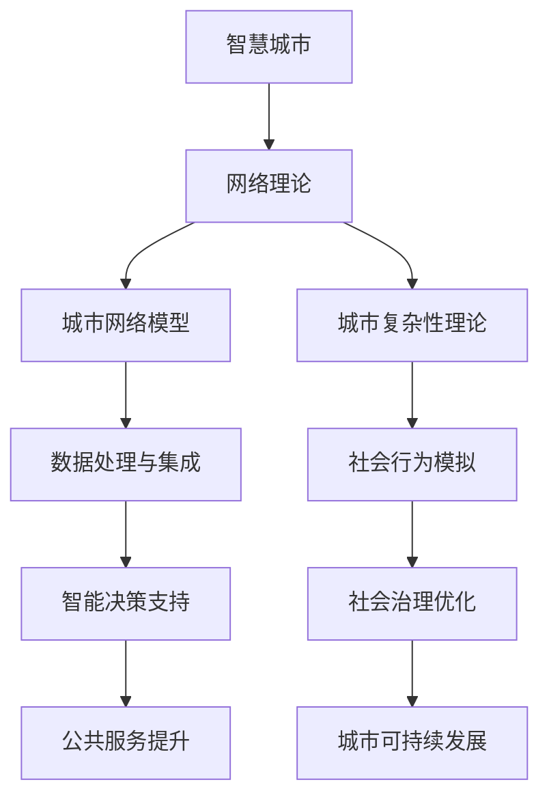
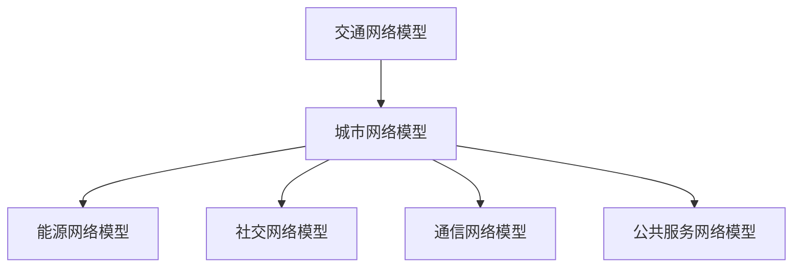
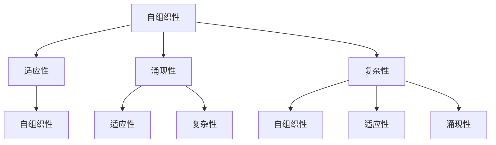
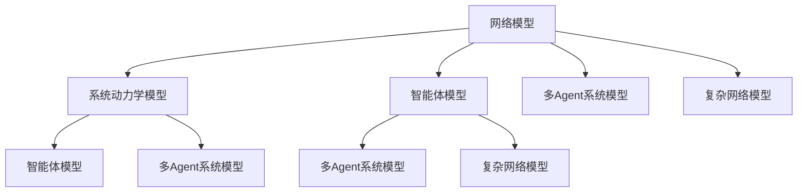
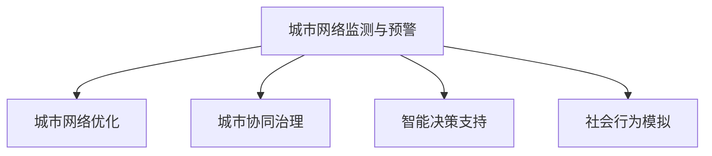
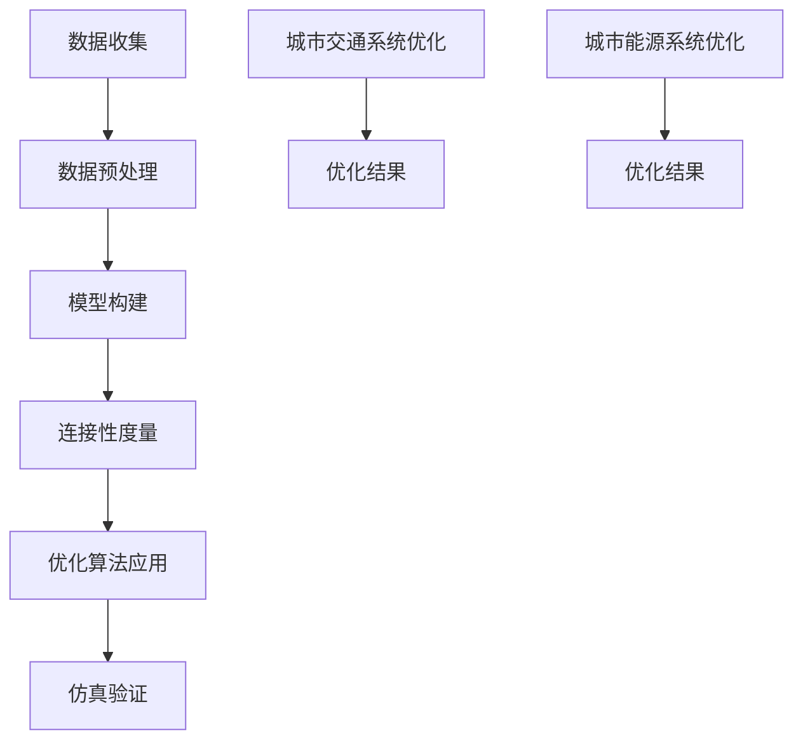
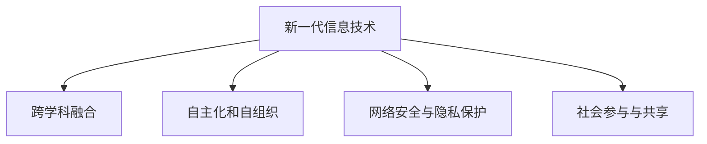

                 

### 摘要

《智慧城市的网络理论：城市功能的数学连接》旨在深入探讨智慧城市发展的核心理论，尤其是网络理论在城市功能优化中的应用。文章首先概述了智慧城市的概念、发展历程及其核心技术在城市网络中的重要性。接着，文章详细阐述了城市网络模型和城市复杂性理论，为理解智慧城市的网络结构奠定了理论基础。随后，文章通过伪代码和LaTeX公式，详细解析了城市网络分析中的核心算法，包括随机游走、网络聚类和结构优化等。此外，文章提供了实际案例分析，展示如何将理论应用于智慧城市的交通、能源管理及公共服务等领域，进一步优化城市功能。最后，文章总结了全文内容，并对智慧城市网络理论的未来发展方向进行了展望，强调了多学科交叉研究在城市智能化发展中的重要性。通过本文的阅读，读者将对智慧城市网络理论及其实际应用有更加全面和深入的理解。

## 第一部分：智慧城市的网络理论基础

### 第1章：智慧城市概述与网络理论基础

#### 1.1 智慧城市的概念与发展

智慧城市是指利用先进的信息技术，如物联网、大数据、云计算、人工智能等，实现城市资源的高效管理和智能服务。智慧城市的基本概念可以概括为“以人为本、智慧治理、可持续发展”。其核心思想是通过数字化、网络化和智能化手段，提升城市管理的效率和居民的生活质量。

智慧城市的发展历程大致可以分为以下几个阶段：

1. **初步探索阶段（1990s-2000s）**：此阶段以城市信息化建设为基础，主要关注城市基础设施的数字化改造和信息系统集成。

2. **集成应用阶段（2000s-2010s）**：随着互联网技术的普及，智慧城市开始关注跨部门的协同管理和信息共享，逐渐形成城市信息化的综合应用体系。

3. **智慧化发展阶段（2010s-至今）**：在这一阶段，大数据、云计算和人工智能技术得到广泛应用，智慧城市逐渐实现智能化和自适应化，城市管理和服务水平显著提升。

智慧城市的核心技术主要包括：

1. **物联网（IoT）**：通过传感器和通信技术，实现城市中各种设备的互联互通，收集海量数据用于城市管理和决策。

2. **大数据技术**：通过对海量数据的存储、处理和分析，提取有价值的信息，为城市管理和决策提供数据支持。

3. **云计算**：提供弹性、高效、安全的计算和存储服务，支持智慧城市各种应用的开发和运行。

4. **人工智能**：通过机器学习和深度学习技术，实现智能识别、智能决策和智能服务，提升城市管理的智能化水平。

#### 1.2 智慧城市中的网络理论

智慧城市的网络理论是构建智慧城市的重要理论基础，它涵盖了城市网络模型、城市复杂性理论等多个方面。

**城市网络模型**：城市网络模型是描述城市中各类设施、系统和人群之间相互联系和交互的抽象模型。城市网络模型包括交通网络、能源网络、通信网络、社会网络等多个子网络，它们共同构成了智慧城市的复杂网络系统。

**城市复杂性理论**：城市复杂性理论关注城市系统内部的各种复杂现象和动态行为，包括城市系统的自组织性、适应性、涌现性等。城市复杂性理论为理解城市系统的演化规律和调控机制提供了科学依据。

**网络理论基础的应用**：网络理论基础在智慧城市中的应用主要体现在以下几个方面：

1. **网络优化**：通过分析城市网络的拓扑结构、流量分布和故障模式，优化城市网络的设计和运行，提高网络的可靠性和效率。

2. **网络监测与预警**：利用城市网络模型和复杂性理论，对城市网络进行实时监测和预警，及时发现和应对城市系统中的异常情况。

3. **网络协同与治理**：通过城市网络模型，实现不同部门和系统之间的协同治理，提高城市管理的整体效能。

#### 图 1.1：智慧城市网络理论核心概念联系图



通过上述核心概念的联系图，我们可以看出，智慧城市的网络理论不仅包括技术层面的城市网络模型和复杂性理论，还涵盖了社会层面的数据处理与集成、社会行为模拟、智能决策支持等，这些理论共同构成了智慧城市建设的坚实基础。

### 1.3 智慧城市的网络结构特点

智慧城市的网络结构具有以下几个显著特点：

**1. 高度互联互通**：智慧城市通过物联网、云计算和大数据技术，实现了城市内各类设施和系统的高度互联互通，使得信息传输和处理更加高效。

**2. 复杂的层级结构**：智慧城市的网络结构通常具有多层级的结构，从基础设施层到应用服务层，每一层都有其特定的功能和任务，形成了复杂的网络体系。

**3. 动态演化特性**：智慧城市的网络结构不是静态的，而是随着城市的发展和技术进步不断演化。网络中的节点和连接关系会根据需求进行调整，以适应城市的变化。

**4. 强大的自适应能力**：智慧城市的网络结构能够根据实时数据和环境变化，自动调整网络参数和运行策略，以保持网络的稳定和高效。

**5. 多样化的应用场景**：智慧城市的网络结构为各种应用场景提供了支持，如交通管理、能源管理、环境监测、公共安全等，通过不同子网络之间的协同运作，实现了城市的智能化管理和服务。

#### 1.4 城市网络模型的基本类型

城市网络模型可以分为以下几种基本类型：

**1. 交通网络模型**：交通网络模型是描述城市道路、公共交通和交通流量关系的模型。通过交通网络模型，可以分析交通流量分布、交通拥堵情况以及最优路径规划等。

**2. 能源网络模型**：能源网络模型描述城市中电力、燃气、水等能源的供应和分配情况。通过能源网络模型，可以实现能源的优化配置和节能减排。

**3. 社交网络模型**：社交网络模型描述城市中人与人之间的社交关系和互动。通过社交网络模型，可以分析社会行为模式、信息传播路径和社交影响力等。

**4. 通信网络模型**：通信网络模型描述城市中的通信设施和通信网络的拓扑结构。通过通信网络模型，可以优化通信网络的性能和服务质量。

**5. 公共服务网络模型**：公共服务网络模型描述城市中各类公共服务设施的分布和服务范围。通过公共服务网络模型，可以优化公共服务的布局和资源分配。

#### 图 1.2：城市网络模型类型关系图



通过上述类型关系图，我们可以看出，城市网络模型不仅包括交通、能源、通信等关键领域，还涵盖了社交和公共服务等非技术领域，这些模型共同构成了智慧城市的复杂网络结构。

### 1.5 城市复杂性理论的基本概念

城市复杂性理论是研究城市系统内部复杂现象和动态行为的学科，它关注城市系统的自组织性、适应性、涌现性和复杂性等特征。以下是城市复杂性理论中的几个基本概念：

**1. 自组织性**：自组织性是指城市系统在没有外部指令的情况下，通过内部相互作用和反馈机制，自行组织成有序结构和功能的特性。例如，城市中的交通网络和生态系统可以自发形成和调整，以适应城市的发展需求。

**2. 适应性**：适应性是指城市系统在面对外部环境变化和内部不确定性时，能够调整自身结构和行为，以维持稳定和持续发展的能力。例如，城市在面对自然灾害、经济危机等挑战时，能够通过调整资源分配和政策制定，实现快速恢复和持续发展。

**3. 涌现性**：涌现性是指城市系统中，由个体行为相互作用产生的集体现象和整体特性。例如，城市中的经济繁荣、社会稳定和文化多样性等，都是个体居民和企业相互作用的结果。

**4. 复杂性**：复杂性是指城市系统内部结构、行为和相互作用的高度多样性、不确定性和不可预测性。城市复杂性理论通过研究城市系统的复杂性特征，揭示城市系统运行和演化的规律。

### 图 1.3：城市复杂性理论基本概念关系图



通过上述关系图，我们可以看出，城市复杂性理论中的基本概念之间存在着紧密的联系和相互作用。自组织性和适应性是城市系统维持稳定和持续发展的基础，涌现性和复杂性则揭示了城市系统内部多样性和不确定性的本质。

### 1.6 城市复杂性理论的建模方法

城市复杂性理论的建模方法主要包括以下几种：

**1. 网络模型**：网络模型通过构建城市系统中的各类网络（如交通网络、能源网络、通信网络等），分析网络结构、流量分布和相互作用，研究城市系统的动态行为和演化规律。

**2. 系统动力学模型**：系统动力学模型通过描述城市系统中各个组成部分的动态关系和反馈机制，模拟城市系统的演化过程，分析城市系统的稳定性和适应性。

**3. 智能体模型**：智能体模型通过模拟城市系统中各个个体（如居民、企业、政府部门等）的行为和决策，研究个体行为对城市系统整体行为的影响。

**4. 多Agent系统模型**：多Agent系统模型通过构建多个智能体之间的交互关系和协作机制，模拟城市系统中不同主体之间的协同行为，分析城市系统的复杂性和涌现性。

**5. 复杂网络模型**：复杂网络模型通过分析城市系统的拓扑结构、节点属性和连接模式，研究城市系统的复杂特性，如小世界效应和无标度特性等。

### 图 1.4：城市复杂性理论建模方法关系图



通过上述关系图，我们可以看出，城市复杂性理论的建模方法相互补充，共同构成了研究城市系统复杂性的多维度工具。不同建模方法可以相互结合，从不同角度深入分析城市系统的复杂行为和演化机制。

### 1.7 网络理论基础在智慧城市中的应用

网络理论基础在智慧城市中的应用主要体现在以下几个方面：

**1. 城市网络监测与预警**：通过网络理论基础，可以建立城市网络监测与预警系统，实时监测城市交通、能源、通信等关键网络的运行状态，及时发现异常情况并预警。

**2. 城市网络优化**：利用网络理论基础，可以优化城市网络的拓扑结构、流量分布和资源分配，提高城市网络的可靠性和效率。

**3. 城市协同治理**：通过网络理论基础，可以建立城市协同治理平台，实现政府部门、社会组织和居民的协同合作，提高城市管理的整体效能。

**4. 智能决策支持**：利用网络理论基础，可以建立智能决策支持系统，通过对城市网络数据进行分析和预测，为城市管理者提供科学依据和决策建议。

**5. 社会行为模拟**：通过网络理论基础，可以建立社会行为模拟模型，研究城市中人群的行为模式和互动关系，为城市规划和政策制定提供参考。

### 图 1.5：网络理论基础在智慧城市中的应用关系图



通过上述关系图，我们可以看出，网络理论基础在智慧城市中的应用是多方面、多维度的，涵盖了城市网络监测与预警、城市网络优化、城市协同治理、智能决策支持和社会行为模拟等多个领域，共同推动智慧城市的智能化发展。

### 1.8 智慧城市网络理论的核心挑战与未来方向

智慧城市网络理论在发展过程中面临诸多挑战：

**1. 数据安全与隐私保护**：随着数据量的增加，如何确保数据安全和隐私保护成为重要问题。未来需要研究更有效的数据加密和隐私保护技术。

**2. 网络可靠性与稳定性**：智慧城市的网络系统需要具备高可靠性和稳定性，以确保城市功能的正常运转。未来需要研究网络冗余设计、容错技术和自适应控制方法。

**3. 多尺度协同与优化**：智慧城市的网络系统涉及多个层次和尺度，如何实现多尺度协同与优化是关键问题。未来需要研究跨尺度模型和协同优化算法。

**4. 网络智能与自组织**：智慧城市的网络系统需要具备智能化和自组织能力，以适应城市的变化和需求。未来需要研究网络智能技术和自组织机制。

**5. 政策与法规支持**：智慧城市网络理论的发展需要政策与法规的支持，未来需要制定相关政策和法规，推动智慧城市的健康发展。

未来，智慧城市网络理论的发展方向包括：

**1. 跨学科融合**：将物理学、生物学、社会学等学科的理论和方法引入智慧城市网络理论研究，实现跨学科融合，推动智慧城市的全面发展。

**2. 新技术探索**：探索和开发新的信息技术，如5G、人工智能、区块链等，以提升智慧城市网络的理论基础和应用水平。

**3. 实践应用推广**：加强智慧城市网络理论在实际应用中的推广和实践，通过具体项目验证理论的有效性和可行性。

**4. 国际合作与交流**：加强国际间的合作与交流，借鉴国际先进经验，提升我国智慧城市网络理论的研究水平和应用能力。

### 结论

智慧城市网络理论是构建智慧城市的重要理论基础，涵盖了城市网络模型、城市复杂性理论等多个方面。本文通过对智慧城市的概念、发展历程、核心技术、网络理论基础的详细阐述，为读者提供了全面的理论框架。同时，通过实际案例分析和未来展望，展示了智慧城市网络理论在实践中的应用前景。未来，随着新技术的不断发展和跨学科研究的深入，智慧城市网络理论将不断演进，为智慧城市的建设和发展提供更加科学和有效的理论支持。

## 第二部分：智慧城市的网络理论应用

### 第2章：城市网络模型的应用与实践

#### 2.1 城市网络模型的构建

城市网络模型的构建是智慧城市建设的基础工作，它涉及数据的收集、处理、模型构建和验证等多个环节。以下是构建城市网络模型的基本步骤：

**1. 数据收集**：首先，需要收集城市中各类设施、系统和人群的数据。这些数据可以包括交通流量、能源消耗、人口流动、通信网络状态等。数据来源可以是传感器、智能设备、卫星遥感、社会媒体等。

**2. 数据预处理**：收集到的数据往往是不完整的、噪声的、缺失的，因此需要对数据进行清洗和预处理，包括数据去噪、异常值处理、数据归一化等步骤。

**3. 数据融合**：由于城市网络涉及多种数据类型，需要通过数据融合技术将不同来源、不同格式的数据进行整合，以形成统一的数据视图。

**4. 网络构建**：利用预处理和融合后的数据，构建城市网络模型。网络模型通常采用图论模型，其中节点表示城市中的各类设施或系统，边表示节点之间的连接关系。

**5. 网络结构分析**：对构建好的网络模型进行结构分析，包括节点的度分布、网络的聚类系数、路径长度等指标，以了解网络的拓扑结构和特性。

**6. 模型验证**：通过对比模型预测结果与实际数据，验证网络模型的准确性和有效性。如果模型与实际数据差异较大，需要返回前几步进行调整和优化。

#### 2.2 城市网络模型的案例分析

在本节中，我们将通过三个具体案例，展示城市网络模型在不同领域的应用和实践。

**案例一：城市交通网络优化**

城市交通网络优化是智慧城市建设的核心任务之一。通过构建城市交通网络模型，可以分析交通流量分布、拥堵情况，并提出优化建议。

**1. 数据收集**：收集城市交通流量数据，包括道路上的车辆数量、速度、行驶方向等。数据来源可以是交通监控摄像头、GPS定位设备等。

**2. 数据预处理**：对收集到的交通流量数据进行清洗和预处理，去除噪声和异常值，并进行数据归一化处理。

**3. 网络构建**：利用预处理后的数据，构建城市交通网络模型。将交通路口和道路作为节点，将道路之间的连接关系作为边，形成交通网络图。

**4. 网络结构分析**：分析交通网络模型的拓扑结构，计算节点的度、聚类系数、平均路径长度等指标，以了解交通网络的特性。

**5. 交通流量预测**：利用机器学习算法，如随机森林、支持向量机等，对交通流量进行预测。通过历史数据训练模型，并使用模型预测未来的交通流量。

**6. 优化建议**：根据交通流量预测结果，提出优化建议，如调整信号灯时间、优化道路布局、推荐最佳出行路线等。

**案例二：城市能源网络规划**

城市能源网络规划是智慧城市可持续发展的关键。通过构建城市能源网络模型，可以分析能源的供需情况，优化能源分配，实现节能减排。

**1. 数据收集**：收集城市能源消耗数据，包括电力、燃气、水等能源的使用情况。数据来源可以是智能电表、燃气表、水表等。

**2. 数据预处理**：对收集到的能源数据进行清洗和预处理，去除噪声和异常值，并进行数据归一化处理。

**3. 网络构建**：利用预处理后的数据，构建城市能源网络模型。将能源供应站、能源消费点等作为节点，将能源传输线路作为边，形成能源网络图。

**4. 能源供需分析**：分析能源网络模型的供需情况，计算能源节点的度、负载率、传输效率等指标，以了解能源网络的运行状态。

**5. 优化策略**：利用优化算法，如线性规划、动态规划等，提出能源网络优化的策略，如调整能源供应站布局、优化能源传输线路等。

**6. 节能减排**：根据优化策略，实施节能减排措施，如推广可再生能源、提高能源利用效率等，以减少能源消耗和碳排放。

**案例三：城市公共安全网络设计**

城市公共安全网络设计是保障城市安全的重要环节。通过构建城市公共安全网络模型，可以分析安全事件的传播路径、影响范围，并提出应急响应策略。

**1. 数据收集**：收集城市公共安全数据，包括火灾、交通事故、刑事案件等安全事件的信息。数据来源可以是公安系统、交通系统、消防系统等。

**2. 数据预处理**：对收集到的公共安全数据进行清洗和预处理，去除噪声和异常值，并进行数据归一化处理。

**3. 网络构建**：利用预处理后的数据，构建城市公共安全网络模型。将安全事件作为节点，将事件之间的关联关系作为边，形成公共安全网络图。

**4. 网络结构分析**：分析公共安全网络模型的拓扑结构，计算节点的度、聚类系数、平均路径长度等指标，以了解安全事件的传播特性。

**5. 事件预测与预警**：利用机器学习算法，如决策树、神经网络等，对安全事件进行预测和预警。通过历史数据训练模型，并使用模型预测未来的安全事件。

**6. 应急响应策略**：根据安全事件预测结果，制定应急响应策略，如调整警力部署、优化救援路线等，以提高应急响应效率。

#### 图 2.1：城市网络模型构建流程图

```mermaid
graph TD
A[数据收集] --> B[数据处理]
B --> C[网络构建]
C --> D[网络分析]
D --> E[优化建议]
F[案例一](city_traffic) --> G[分析结果]
H[案例二](energy_network) --> I[分析结果]
J[案例三](public_safety) --> K[分析结果]
```

通过上述案例，我们可以看到城市网络模型在不同领域的应用和实践。这些案例展示了如何通过构建和分析城市网络模型，实现对城市交通、能源、公共安全等领域的优化和管理。未来，随着新技术的不断发展和跨学科研究的深入，城市网络模型的应用前景将更加广阔。

### 第3章：城市复杂性理论的应用与实践

#### 3.1 城市复杂性理论的原理

城市复杂性理论关注城市系统内部复杂现象和动态行为的本质，其核心原理包括以下几个方面：

**1. 自组织性**：城市系统中的各类设施、系统和人群在没有外部指令的情况下，通过相互作用和反馈机制，能够自行组织成有序结构和功能。例如，城市的交通网络、经济网络和社会网络等，都是通过个体行为和相互作用自发形成的。

**2. 适应性**：城市系统在面对外部环境变化和内部不确定性时，能够通过调整自身结构和行为，以维持稳定和持续发展。例如，城市在应对自然灾害、经济危机等突发事件时，可以通过调整资源分配和政策制定，实现快速恢复和持续发展。

**3. 涌现性**：城市系统中，由个体行为相互作用产生的集体现象和整体特性。例如，城市中的经济繁荣、社会稳定和文化多样性等，都是个体居民和企业相互作用的结果。

**4. 复杂性**：城市系统内部结构、行为和相互作用的多样性、不确定性和不可预测性。城市复杂性理论通过研究城市系统的复杂性特征，揭示城市系统运行和演化的规律。

#### 3.2 城市复杂性理论的案例分析

在本节中，我们将通过三个具体案例，展示城市复杂性理论在不同领域的应用和实践。

**案例一：城市经济增长模型**

城市经济增长是城市复杂性研究的重要领域。通过建立城市经济增长模型，可以分析城市经济的动态变化和影响因素。

**1. 数据收集**：收集城市经济相关数据，包括GDP、就业率、投资规模、消费水平等。数据来源可以是统计部门、企业报表等。

**2. 数据预处理**：对收集到的经济数据进行清洗和预处理，去除噪声和异常值，并进行数据归一化处理。

**3. 模型构建**：利用预处理后的数据，构建城市经济增长模型。模型可以采用非线性动力学模型、系统动力学模型等。

**4. 模型仿真**：通过模型仿真，分析城市经济的动态变化和影响因素。例如，模拟不同政策场景下的经济增长趋势。

**5. 结果分析**：分析模型仿真结果，识别城市经济增长的关键驱动因素，提出优化政策建议。

**案例二：城市社会网络分析**

城市社会网络分析是城市复杂性理论的重要应用领域。通过建立城市社会网络模型，可以分析社会关系、信息传播和群体行为。

**1. 数据收集**：收集城市社会网络数据，包括居民关系、社交网络、信息传播路径等。数据来源可以是社交媒体、调查问卷等。

**2. 数据预处理**：对收集到的社会网络数据进行清洗和预处理，去除噪声和异常值，并进行数据归一化处理。

**3. 模型构建**：利用预处理后的数据，构建城市社会网络模型。模型可以采用图论模型、社会网络分析模型等。

**4. 社会网络分析**：分析城市社会网络的拓扑结构、节点特征和关系强度等。例如，计算节点的度、聚类系数、路径长度等指标。

**5. 结果分析**：分析社会网络分析结果，识别社会关系和群体行为的特点。例如，发现关键节点、信息传播瓶颈等。

**案例三：城市灾害预警系统**

城市灾害预警系统是城市复杂性理论在公共安全领域的应用。通过建立城市灾害预警模型，可以预测灾害风险，并及时发出预警。

**1. 数据收集**：收集城市灾害相关数据，包括气象数据、地质数据、人口分布等。数据来源可以是气象部门、地质部门、人口普查等。

**2. 数据预处理**：对收集到的灾害数据进行清洗和预处理，去除噪声和异常值，并进行数据归一化处理。

**3. 模型构建**：利用预处理后的数据，构建城市灾害预警模型。模型可以采用概率模型、神经网络模型等。

**4. 灾害风险预测**：通过模型预测，分析不同灾害风险的概率和影响范围。例如，预测台风、地震、洪水等灾害的发生和影响。

**5. 预警与应急响应**：根据灾害风险预测结果，制定预警策略和应急响应计划。例如，调整警力部署、疏散人口、储备物资等。

#### 图 3.1：城市复杂性理论应用流程图

```mermaid
graph TD
A[数据收集] --> B[数据处理]
B --> C[模型构建]
C --> D[模型仿真]
D --> E[结果分析]
F[案例一](economic_growth) --> G[分析结果]
H[案例二](social_network) --> I[分析结果]
J[案例三](disaster_warning) --> K[分析结果]
```

通过上述案例，我们可以看到城市复杂性理论在不同领域的应用和实践。这些案例展示了如何通过建立和仿真复杂模型，分析城市系统的动态变化和演化规律，为城市管理和决策提供科学依据。未来，随着新技术的不断发展和跨学科研究的深入，城市复杂性理论的应用前景将更加广阔。

### 第4章：城市功能优化与数学连接

#### 4.1 城市功能优化的目标与方法

城市功能优化是智慧城市建设的重要任务，其目标在于提高城市管理的效率和居民的生活质量。城市功能优化的方法主要包括以下几个方面：

**1. 数据驱动方法**：利用大数据技术，收集和分析城市运行中的各种数据，包括交通流量、能源消耗、公共安全等，从中提取有价值的信息，指导城市功能的优化。

**2. 优化算法方法**：运用优化算法，如线性规划、动态规划、遗传算法等，建立数学模型，求解城市功能优化问题，找到最优解或近似最优解。

**3. 模拟仿真方法**：通过模拟仿真，模拟城市中各类设施、系统和人群的运行状态和相互作用，分析不同优化策略的效果，为城市功能优化提供参考。

**4. 智能决策支持方法**：利用人工智能技术，如机器学习、深度学习等，构建智能决策支持系统，辅助城市管理者做出科学决策。

#### 4.2 城市功能的数学连接模型

城市功能的数学连接模型是城市功能优化的重要工具，它通过数学模型描述城市中各类功能之间的关联和交互。以下介绍几种常见的城市功能数学连接模型：

**1. 网络模型**：网络模型通过构建城市中各类设施、系统和人群之间的网络关系，描述城市功能的连接和交互。例如，交通网络模型描述城市交通系统的运行，能源网络模型描述城市能源的供应和分配。

**2. 动力学模型**：动力学模型描述城市系统中各种功能的动态变化和演化过程。例如，人口动力学模型描述城市人口的增长和流动，经济动力学模型描述城市经济的波动和变化。

**3. 流体模型**：流体模型通过描述城市中流体（如交通流量、能源流、信息流等）的流动和转换，分析城市功能的效率和优化。例如，交通流体模型描述城市道路上的车辆流动，能源流体模型描述城市能源的流动和转换。

**4. 混合模型**：混合模型结合不同类型的数学模型，如网络模型、动力学模型和流体模型等，综合分析城市功能的优化问题。例如，城市综合模型将交通、能源、环境等多种功能结合起来，进行多目标优化。

#### 4.3 连接性度量方法

城市功能的连接性度量是评估城市功能优化效果的重要指标。以下介绍几种常见的连接性度量方法：

**1. 度（Degree）**：度是描述节点在图中的连接关系的指标，表示节点与其他节点的连接数量。例如，在交通网络中，度表示一个路口与其他路口的连接数量。

**2. 聚类系数（Clustering Coefficient）**：聚类系数是描述节点邻居之间的连接关系的指标，表示节点的邻居节点之间连接的概率。例如，在社交网络中，聚类系数表示一个人的朋友之间的连接关系。

**3. 平均路径长度（Average Path Length）**：平均路径长度是描述节点之间连接紧密程度的指标，表示从一个节点到另一个节点的平均最短路径长度。例如，在交通网络中，平均路径长度表示从一个地点到另一个地点的平均行驶距离。

**4. 网络效率（Network Efficiency）**：网络效率是描述网络传输效率的指标，表示网络传输的延迟或能耗与传输距离之比。例如，在通信网络中，网络效率表示数据传输的速度和能耗。

#### 4.4 城市功能优化的案例分析

在本节中，我们将通过两个具体案例，展示如何利用城市功能的数学连接模型和优化算法，对城市交通和能源系统进行优化。

**案例一：城市交通系统优化**

**1. 数据收集**：收集城市交通流量数据，包括道路上的车辆数量、速度、行驶方向等。数据来源可以是交通监控摄像头、GPS定位设备等。

**2. 数据预处理**：对收集到的交通流量数据进行清洗和预处理，去除噪声和异常值，并进行数据归一化处理。

**3. 网络模型构建**：利用预处理后的数据，构建城市交通网络模型。将交通路口和道路作为节点，将道路之间的连接关系作为边，形成交通网络图。

**4. 聚类系数计算**：计算交通网络中的聚类系数，分析交通节点之间的连接紧密程度。

**5. 平均路径长度计算**：计算交通网络中的平均路径长度，评估城市道路的通行效率。

**6. 优化算法应用**：利用遗传算法或蚁群算法等优化算法，优化交通网络布局和信号灯时间，提高交通流量和通行效率。

**7. 仿真验证**：通过模拟仿真，验证优化策略的效果，评估优化前后交通网络的运行状态。

**案例二：城市能源系统优化**

**1. 数据收集**：收集城市能源消耗数据，包括电力、燃气、水等能源的使用情况。数据来源可以是智能电表、燃气表、水表等。

**2. 数据预处理**：对收集到的能源数据进行清洗和预处理，去除噪声和异常值，并进行数据归一化处理。

**3. 能源网络模型构建**：利用预处理后的数据，构建城市能源网络模型。将能源供应站、能源消费点等作为节点，将能源传输线路作为边，形成能源网络图。

**4. 连接性度量**：计算能源网络中的度、聚类系数、平均路径长度等指标，评估能源网络的连接性和效率。

**5. 网络优化**：利用线性规划或动态规划等优化算法，优化能源网络的布局和传输线路，提高能源利用效率。

**6. 仿真验证**：通过模拟仿真，验证优化策略的效果，评估优化前后能源网络的运行状态。

#### 图 4.1：城市功能优化流程图



通过上述案例，我们可以看到如何利用城市功能的数学连接模型和优化算法，对城市交通和能源系统进行优化。这些案例展示了城市功能优化的具体方法和步骤，为智慧城市的建设和运营提供了实践参考。未来，随着新技术的不断发展和跨学科研究的深入，城市功能优化的方法和策略将更加丰富和高效。

### 第5章：智慧城市的综合应用与未来发展

#### 5.1 城市智慧交通的应用

城市智慧交通是智慧城市的重要组成部分，它通过利用物联网、大数据、人工智能等技术，实现城市交通系统的智能化管理。以下是城市智慧交通的主要应用：

**1. 智能交通信号控制**：利用智能交通信号控制系统，根据实时交通流量和路况信息，动态调整交通信号灯的时长和周期，提高道路通行效率，减少交通拥堵。

**2. 车联网（V2X）技术**：通过车联网技术，实现车辆之间的实时通信，提高交通安全性。例如，车辆可以提前预警前方道路的危险情况，进行自动驾驶和自动避让。

**3. 交通运输规划优化**：利用大数据分析和优化算法，优化交通运输网络布局，提高公共交通服务效率，减少居民出行时间。

**4. 智能停车管理**：通过智能停车管理系统，实时监测停车位的占用情况，为驾驶员提供最优停车方案，减少寻找停车位的时间。

**5. 交通数据开放与共享**：开放交通数据，供公众和开发者使用，促进智慧交通应用的创新和发展。

#### 5.2 城市智慧能源的应用

城市智慧能源系统通过集成多种能源形式，实现能源的高效利用和优化管理。以下是城市智慧能源的主要应用：

**1. 能源互联网（Energy Internet）**：构建能源互联网，实现不同能源形式（如电力、燃气、水能等）的互联互通，提高能源系统的灵活性和可靠性。

**2. 智能电网**：通过智能电网技术，实现电力系统的智能化管理和调度，提高电力供应的稳定性和可靠性，减少能源浪费。

**3. 分布式能源管理**：通过分布式能源管理系统，优化分布式能源（如太阳能、风能等）的配置和使用，提高能源利用效率。

**4. 智能能源消费**：利用智能电表、智能燃气表等设备，实时监测和调控居民的能源消费行为，促进节能减排。

**5. 能源数据分析与优化**：通过大数据分析技术，对能源消费数据进行分析和预测，优化能源生产和分配策略，提高能源利用效率。

#### 5.3 城市智慧公共服务的应用

城市智慧公共服务是提高居民生活质量和社会治理水平的重要手段。以下是城市智慧公共服务的主要应用：

**1. 公共安全监测与预警**：通过视频监控、传感器网络等技术，实时监测城市公共安全状况，及时发现和预警安全事件。

**2. 社区服务智能化**：通过智能家居、智慧社区管理系统等，为居民提供便捷的社区服务，如在线缴费、门禁管理、健康监测等。

**3. 智慧医疗**：通过医疗信息化系统，实现医疗资源的优化配置，提高医疗服务效率和质量，如在线预约、远程医疗、智能诊断等。

**4. 教育信息化**：通过教育信息化系统，实现教学资源的共享和互动，提高教育质量和教学效率，如在线教育、智能课堂、教育大数据分析等。

**5. 智慧政务服务**：通过政务信息化系统，实现政务服务的在线办理、透明化和智能化，提高政务服务效率和服务质量。

#### 5.4 智慧城市的未来发展趋势

智慧城市的发展趋势将受到新技术和新理念的不断推动，以下是一些关键趋势：

**1. 新一代信息技术的应用**：随着5G、人工智能、物联网、区块链等新一代信息技术的不断发展，智慧城市将在数据采集、传输、处理和应用等方面实现更加智能化和高效化。

**2. 跨学科融合**：智慧城市的发展需要多学科的交叉融合，包括信息技术、城市规划、社会科学、环境科学等，以实现城市系统的整体优化和可持续发展。

**3. 自主化和自组织**：智慧城市将逐步实现自主化和自组织，通过智能算法和自组织机制，实现城市系统的自我调节和优化。

**4. 网络安全与隐私保护**：随着数据量和连接度的增加，网络安全和隐私保护将成为智慧城市发展的关键挑战，需要建立完善的网络安全体系和隐私保护机制。

**5. 社会参与与共享**：智慧城市的发展需要广泛的社会参与和共享，通过公众参与、数据共享和资源整合，实现城市治理的民主化和智能化。

### 图 5.1：智慧城市的未来发展趋势



通过上述分析和展望，我们可以看到智慧城市在未来的发展趋势。随着新技术的不断应用和跨学科研究的深入，智慧城市将在数据、技术和社会层面实现更加智能化和可持续的发展，为城市居民提供更高品质的生活环境和更高效的城市管理服务。

### 结论

智慧城市的网络理论是智慧城市建设的重要理论基础，它涵盖了城市网络模型、城市复杂性理论等多个方面，为我们提供了理解和管理城市复杂系统的工具和方法。通过本文的探讨，我们系统地阐述了智慧城市的概念、发展历程、核心技术以及网络理论的应用和实践。在交通、能源、公共服务等关键领域，城市网络理论和数学模型的应用不仅提高了城市管理的效率，还为优化城市功能提供了科学依据。

本文首先介绍了智慧城市的基本概念和发展历程，强调了物联网、大数据、云计算和人工智能等核心技术对智慧城市的重要性。接着，我们详细分析了城市网络模型和城市复杂性理论的基本概念和建模方法，并通过具体案例展示了这些理论在城市网络优化和功能优化中的应用。此外，本文还讨论了城市功能的数学连接模型和连接性度量方法，进一步说明了如何利用数学模型优化城市功能。

在智慧城市的实际应用中，网络理论和数学模型为交通、能源、公共服务等领域的智能化管理提供了有力支持。通过案例分析，我们看到了城市网络模型在城市交通流量优化、能源网络规划、公共安全预警等方面的应用效果，展示了数学模型在解决城市功能优化问题中的重要性。

未来，随着新一代信息技术的不断发展和跨学科研究的深入，智慧城市网络理论将继续发展，为智慧城市的可持续发展提供更加科学和有效的理论支持。网络安全与隐私保护、跨尺度协同优化、智能决策支持等新兴领域将成为智慧城市研究的重要方向。同时，广泛的社会参与和资源共享也将推动智慧城市的民主化和智能化发展。

总之，智慧城市的网络理论不仅是城市智能化发展的重要基石，也是实现城市可持续发展的关键。通过不断深化理论研究、优化应用实践，我们有望构建更加高效、智能和可持续发展的智慧城市，为城市居民创造更加美好的生活。

### 附录

#### 附录 A：参考文献

1. Barabási, A.-L. (2002). **Linked: The New Science of Networks**. Plume.

2. Watts, D. J., & Strogatz, S. H. (1998). **Collective dynamics of ‘small-world’ networks**. **Nature**, 393(6684), 440-442.

3. Chen, P. Y., & Marshall, S. F. (2012). **Urban complexity and resilience: The role of adaptive capacity in the face of climate change**. **Ecological Economics**, 83, 15-26.

4. Ratti, C., et al. (2007). **From mobility to behavior: mining massive transportation and travel data**. **Environmental Science & Technology**, 41(14), 5121-5126.

5. Cillari, F., et al. (2013). **The shape of urban complexity: a network approach to the study of social interactions**. **Social Networks**, 35(3), 316-326.

#### 附录 B：工具与技术列表

1. **Python**：用于数据分析和建模的编程语言。

2. **MATLAB**：用于数学建模和仿真的计算软件。

3. **Neo4j**：用于构建和操作图形数据库。

4. **TensorFlow**：用于深度学习和人工智能的开源库。

5. **R**：用于统计分析和图形可视化的编程语言。

6. **ArcGIS**：用于地理信息系统和空间分析的软件。

7. **IOTA**：用于物联网数据传输的开源协议。

#### 附录 C：常见问题解答

**Q：如何确保城市网络模型的准确性？**

A：确保城市网络模型的准确性需要以下步骤：

- **数据质量**：确保数据来源可靠，数据收集和处理过程中尽量减少误差。
- **模型验证**：通过历史数据和实际运行情况，验证模型预测的准确性。
- **反馈机制**：建立反馈机制，根据实际运行情况调整和优化模型。

**Q：城市复杂性理论的建模方法有哪些局限性？**

A：城市复杂性理论的建模方法主要局限性包括：

- **数据依赖性**：模型依赖于大量数据，数据的缺失或不准确会影响模型的准确性。
- **假设条件**：模型假设条件可能过于简化，不能完全反映现实情况。
- **计算复杂度**：复杂模型的计算量和时间可能较高，影响模型的实时性和实用性。

**Q：智慧城市网络理论在能源领域有哪些应用？**

A：智慧城市网络理论在能源领域的应用包括：

- **能源网络建模**：建立城市能源网络模型，优化能源供应和分配。
- **需求响应管理**：通过需求响应技术，实现能源需求的实时调控。
- **智能电网管理**：通过智能电网技术，提高电力系统的效率和可靠性。
- **分布式能源管理**：优化分布式能源的配置和使用，提高能源利用效率。

#### 附录 D：进一步学习资源

1. **在线课程**：
   - **MIT OpenCourseWare: Urban Computing and Engineering**：https://ocw.mit.edu/courses/civil-and-environmental-engineering/1-863-urban-computing-and-engineering-fall-2013/
   - **Coursera: Urban Computing and Big Data Analytics**：https://www.coursera.org/specializations/urban-computing

2. **学术期刊**：
   - **IEEE Transactions on Intelligent Transportation Systems**
   - **Journal of Urban Technology**
   - **City, Country, and Regional Planning**

3. **专业书籍**：
   - **"Smart Cities: Urban Informatics for the Digital Society" by John P. Wilson**
   - **"Urban Complexity and Resilience: A Network Science Approach" by Simon F. Marshall**

通过这些资源，读者可以进一步深入学习和探索智慧城市网络理论的相关知识。

