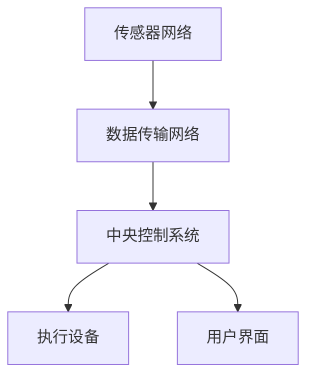
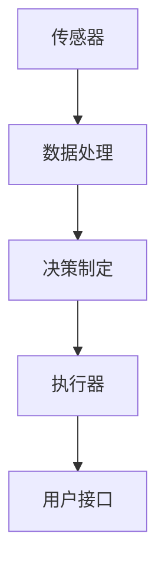

                 


### 《智能家居的自适应系统：生活便利的数学调节》

---

## 关键词

- 智能家居
- 自适应系统
- 数学调节方法
- 智能照明
- 智能温控
- 智能安防

---

## 摘要

本文深入探讨了智能家居的自适应系统及其在生活便利中的重要作用。首先，介绍了智能家居的发展背景和现状，然后详细阐述了自适应系统的基本概念和原理。接着，重点介绍了数学调节方法在智能家居自适应系统中的应用，包括经典算法、数学模型以及在实际项目中的挑战和对策。通过具体的案例研究，展示了自适应系统在智能照明、智能温控和智能安防等领域的实际应用效果。最后，对智能家居自适应系统的未来发展趋势进行了展望，并提出了技术挑战及解决方案。

---

## 第一部分：引言

### 1.1 书籍背景及重要性

智能家居作为物联网（IoT）技术的典型应用，正在全球范围内迅速普及。随着智能家居设备的多样化和发展，用户对于个性化、便捷化、安全化的需求越来越强烈。自适应系统作为智能家居技术中的重要一环，能够在用户未感知的情况下，根据环境和用户行为自动调整设备参数，从而提升用户体验。

本文旨在系统地探讨智能家居自适应系统的数学调节方法，从理论基础到实际应用进行全面梳理，旨在为研究人员和开发人员提供有价值的参考。首先，我们将简要回顾智能家居的发展历程和现状，接着深入探讨自适应系统的基本概念和原理。随后，详细介绍数学调节方法及其在智能家居中的应用，并通过实际案例进行分析。最后，我们对智能家居自适应系统的未来发展趋势进行展望，并探讨可能面临的挑战及解决方案。

### 1.2 智能家居的发展与现状

智能家居的概念最早可以追溯到20世纪80年代，当时主要以高档住宅和商业建筑中的自动化控制系统为主。随着物联网、传感器技术、无线通信技术以及云计算等技术的不断发展，智能家居逐步走进了普通家庭，成为现代生活的一部分。

目前，智能家居市场已经形成了包括智能照明、智能安防、智能温控、智能家电等多个细分领域。根据市场研究机构的统计数据，全球智能家居市场规模预计将在未来几年内持续增长，年复合增长率达到20%以上。在中国市场，智能家居已经逐渐成为智能家居行业的重要组成部分，随着5G网络的普及和人工智能技术的应用，智能家居产品将更加智能化、个性化。

### 1.3 自适应系统在智能家居中的关键作用

自适应系统在智能家居中扮演着至关重要的角色。首先，自适应系统能够实时监测家庭环境和用户行为，从而对智能家居设备进行智能调节。例如，在智能照明系统中，自适应系统可以根据自然光强度和用户需求，自动调节灯光亮度和色温，从而提供舒适的照明环境。

其次，自适应系统能够根据用户的历史行为和习惯，进行个性化设置和优化。例如，在智能温控系统中，自适应系统可以根据用户的日常作息时间和温度偏好，自动调整室内温度，从而提供舒适的生活环境。

最后，自适应系统在提高智能家居系统的安全性和可靠性方面也具有重要作用。通过实时监测家庭环境和用户行为，自适应系统可以及时发现异常情况，并采取相应的措施，如智能安防系统在发现非法入侵时自动报警，智能烟雾传感器在检测到烟雾时自动触发灭火装置等。

综上所述，自适应系统在智能家居中不仅提升了用户体验，还提高了系统的安全性和可靠性，是未来智能家居发展的关键方向。

---

## 第二部分：核心技术原理

### 2.1 智能家居系统的基本架构

智能家居系统通常由多个子系统和组件组成，这些子系统和组件通过物联网技术进行互联，形成一个高度集成的智能化系统。智能家居系统的基本架构主要包括以下几个方面：

1. **传感器网络**：传感器是智能家居系统的感知器官，它们可以实时监测室内外的温度、湿度、光照、噪音、空气质量等各种环境参数。常见的传感器包括温度传感器、湿度传感器、光照传感器、烟雾传感器、门窗传感器等。

2. **数据传输网络**：数据传输网络负责将传感器采集到的数据传输到中央控制系统。目前常用的数据传输技术包括Wi-Fi、Zigbee、蓝牙等无线通信技术，以及有线网络技术如以太网等。

3. **中央控制系统**：中央控制系统是智能家居系统的核心，负责处理传感器数据、执行用户指令、协调各设备之间的工作。中央控制系统通常包括智能路由器、智能网关、智能控制中心等设备。

4. **执行设备**：执行设备是智能家居系统的执行单元，根据中央控制系统的指令执行相应的操作。常见的执行设备包括智能照明系统、智能家电、智能窗帘、智能门锁等。

5. **用户界面**：用户界面是用户与智能家居系统交互的渠道，包括智能手机应用、智能音箱、触摸屏等。用户可以通过这些界面查看设备状态、发送控制指令、设置自动化场景等。

智能家居系统的基本架构图可以用以下Mermaid流程图表示：



### 2.2 自适应系统的基本概念

自适应系统是一种能够根据环境变化和用户需求自动调整自身行为的系统。在智能家居中，自适应系统通过传感器采集环境数据，利用算法和模型对数据进行分析和处理，然后根据分析结果自动调整智能家居设备的工作状态。

自适应系统的核心组成部分包括：

1. **传感器**：负责采集环境数据，如温度、湿度、光照、噪音等。

2. **数据处理器**：负责对传感器数据进行分析和处理，通常包括算法和模型。

3. **执行器**：负责根据处理结果调整设备状态，如调整灯光亮度、温度、窗帘开合等。

4. **用户接口**：用于与用户交互，接收用户指令和反馈。

自适应系统的基本工作原理可以概括为以下步骤：

1. **数据采集**：传感器实时采集环境数据。

2. **数据处理**：数据处理器对采集到的数据进行处理，包括数据清洗、特征提取等。

3. **决策制定**：根据处理结果和预设的算法，数据处理器制定出合适的控制策略。

4. **执行操作**：执行器根据决策结果调整设备状态。

5. **用户反馈**：用户通过用户接口对系统进行调整和优化。

以下是一个简单的自适应系统工作流程Mermaid流程图：



### 2.3 自适应算法的核心原理

自适应算法是自适应系统的核心组成部分，负责对传感器数据进行处理和分析，并制定出合适的控制策略。常见的自适应算法包括以下几种：

1. **PID控制算法**：PID控制算法是一种常用的自适应控制算法，通过比例（P）、积分（I）和微分（D）三个部分对系统进行控制，以达到稳定和精确的控制效果。

2. **模糊控制算法**：模糊控制算法通过模糊逻辑和模糊规则进行控制，适用于处理非线性、复杂系统的控制问题。

3. **神经网络算法**：神经网络算法通过模拟人脑神经网络的结构和功能进行控制，具有较强的自学习和自适应能力。

4. **遗传算法**：遗传算法通过模拟生物进化过程进行优化，适用于求解复杂的优化问题。

下面以PID控制算法为例，介绍其核心原理和伪代码实现：

### PID控制算法

PID控制算法的核心原理是通过对误差（设定值与实际值之差）进行比例、积分和微分处理，生成控制输出，从而对系统进行调节。

- **比例（P）**：根据当前误差大小进行比例调节，误差越大，调节力度越大。
- **积分（I）**：对误差进行积分处理，累计误差，以便对长时间误差进行调整。
- **微分（D）**：根据误差变化率进行微分处理，预测误差的变化趋势，以便提前进行调整。

### 伪代码

```python
def PIDControl(setpoint, current_value, Kp, Ki, Kd):
    error = setpoint - current_value
    P = Kp * error
    I = Ki * integral(error)
    D = Kd * derivative(error)
    output = P + I + D
    return output

def integral(error):
    # 计算误差积分
    return ...

def derivative(error):
    # 计算误差微分
    return ...
```

通过PID控制算法，可以实现对智能家居设备如温度、光照等的精确控制，从而提高系统的自适应能力和用户体验。

---

## 第三部分：数学调节方法

### 3.1 数学调节的基本概念

数学调节方法是一种通过数学模型和算法对系统进行控制和优化的技术。在智能家居自适应系统中，数学调节方法的核心作用是通过对环境数据和用户行为数据的分析和处理，自动调整系统参数，以实现最佳控制效果。数学调节的基本概念包括以下几方面：

- **模型建立**：首先需要建立系统的数学模型，包括输入变量、输出变量和系统方程。模型的准确性直接影响到调节的效果。
- **参数估计**：通过对历史数据和当前数据的分析，估计系统参数，如PID控制器的Kp、Ki、Kd等。
- **状态监测**：实时监测系统状态，包括传感器采集的数据和环境参数的变化。
- **决策制定**：根据系统状态和参数，利用优化算法制定出调节策略。

### 3.2 经典的数学调节方法

在智能家居自适应系统中，常用的数学调节方法包括PID控制算法、模糊控制算法和神经网络算法等。

#### PID控制算法

PID控制算法是最常用的调节方法之一，其核心思想是通过比例、积分和微分三个部分对误差进行调节。以下是一个简单的PID调节方法：

- **比例控制**：根据当前误差值进行比例调节，误差越大，调节力度越大。
- **积分控制**：对误差进行积分，累计误差，以消除静态误差。
- **微分控制**：根据误差的变化率进行调节，预测误差的变化趋势，提前进行干预。

以下是PID调节方法的伪代码实现：

```python
def PIDControl(setpoint, current_value, Kp, Ki, Kd):
    error = setpoint - current_value
    P = Kp * error
    I = Ki * integral(error)
    D = Kd * derivative(error)
    output = P + I + D
    return output

def integral(error):
    # 计算误差积分
    return ...

def derivative(error):
    # 计算误差微分
    return ...
```

#### 模糊控制算法

模糊控制算法通过模糊逻辑和模糊规则进行控制，适用于处理非线性、复杂系统的控制问题。模糊控制的基本步骤包括：

- **模糊化**：将输入变量和输出变量进行模糊化处理，形成模糊集合。
- **模糊规则**：根据专家经验和控制策略，制定模糊规则。
- **推理**：根据模糊规则进行推理，得到模糊输出。
- **去模糊化**：将模糊输出进行去模糊化处理，得到最终的输出值。

以下是模糊控制算法的伪代码实现：

```python
def FuzzyControl(input_variable, rule_base):
    # 模糊化
    fuzzified_input = fuzzify(input_variable)
    # 推理
    fuzzy_output = apply_rules(fuzzified_input, rule_base)
    # 去模糊化
    output = defuzzify(fuzzy_output)
    return output

def fuzzify(input_variable):
    # 模糊化处理
    return ...

def apply_rules(fuzzified_input, rule_base):
    # 应用模糊规则
    return ...

def defuzzify(fuzzy_output):
    # 去模糊化处理
    return ...
```

#### 神经网络算法

神经网络算法通过模拟人脑神经网络的结构和功能进行控制，具有较强的自学习和自适应能力。神经网络的基本步骤包括：

- **网络结构设计**：设计合适的神经网络结构，包括输入层、隐藏层和输出层。
- **权重初始化**：对神经网络的权重进行初始化。
- **训练**：通过训练样本对神经网络进行训练，调整权重。
- **预测**：利用训练好的神经网络进行预测，得到系统输出。

以下是神经网络算法的伪代码实现：

```python
def NeuralNetwork(input_data, weights, biases):
    # 前向传播
    output = forward_propagation(input_data, weights, biases)
    return output

def forward_propagation(input_data, weights, biases):
    # 前向传播计算
    return ...

def train_network(training_data, weights, biases):
    # 训练网络
    return ...

def predict(input_data, trained_network):
    # 预测输出
    return ...
```

### 3.3 数学调节在实际应用中的挑战与对策

尽管数学调节方法在智能家居自适应系统中具有广泛的应用前景，但在实际应用中仍面临一些挑战：

1. **数据采集和处理**：传感器采集的数据可能存在噪声、误差和延迟等问题，需要有效的数据预处理方法。
2. **模型准确性**：模型的准确性和适应性直接影响到调节效果，需要不断优化和调整模型。
3. **实时性**：智能家居系统需要实时响应环境变化和用户需求，对系统的实时性要求较高。
4. **鲁棒性**：系统需要在各种复杂环境下保持稳定运行，具有较好的鲁棒性。

针对以上挑战，可以采取以下对策：

1. **数据预处理**：采用滤波、去噪、插值等方法对传感器数据进行预处理，提高数据质量。
2. **模型优化**：通过交叉验证、网格搜索等方法优化模型参数，提高模型的准确性和适应性。
3. **实时算法优化**：采用高效的算法和数据结构，优化系统实时性。
4. **容错机制**：设计容错机制，如故障检测、故障隔离和故障恢复等，提高系统的鲁棒性。

通过有效的数学调节方法和对策，可以显著提升智能家居自适应系统的性能和用户体验。

---

## 第四部分：案例研究

### 4.1 案例一：智能照明系统的自适应调节

智能照明系统是智能家居中一个典型的应用场景，自适应调节能够在不同的场景下提供合适的照明效果，从而提高生活质量和能源效率。以下是一个智能照明系统自适应调节的案例研究。

#### 案例背景

某住宅安装了一套智能照明系统，包括多个智能灯具、传感器（如光照传感器和人体传感器）以及中央控制系统。用户希望在不同的时间段和场景下自动调整灯光的亮度和色温。

#### 自适应调节方法

1. **光照传感器**：光照传感器用于实时监测室内的自然光强度，将其作为调节灯光亮度的一个重要参考因素。
2. **人体传感器**：人体传感器用于检测房间内是否有人员活动，根据活动情况调整灯光亮度。
3. **PID控制算法**：采用PID控制算法对灯光亮度进行调节，确保灯光亮度平稳变化。

#### 实现步骤

1. **数据采集**：传感器实时采集室内光照强度和人体活动数据。
2. **数据处理**：中央控制系统对采集到的数据进行分析和处理，计算光照补偿值和活动指数。
3. **调节策略制定**：根据光照补偿值和活动指数，制定灯光调节策略，如白天自然光较强时降低灯光亮度，夜间自然光较弱时增加灯光亮度。

#### 结果分析

通过自适应调节，智能照明系统在不同场景下能够提供舒适的照明效果，提高了用户的满意度。同时，由于灯光亮度根据实际需求自动调节，实现了显著的节能效果。

### 4.2 案例二：智能温控系统的自适应调节

智能温控系统是智能家居中另一个重要应用场景，能够根据室内外温度、用户习惯和季节变化自动调节室内温度，从而提高舒适度和能源效率。

#### 案例背景

某办公楼安装了一套智能温控系统，包括温控器、传感器（如室内外温度传感器、湿度传感器）和中央控制系统。用户希望在不同的季节和时间段内自动调节室内温度，以实现舒适和节能的目标。

#### 自适应调节方法

1. **室内外温度传感器**：用于实时监测室内外温度，作为温度调节的一个重要参考因素。
2. **用户习惯数据**：通过用户在办公楼的日常活动记录，分析用户的温度偏好。
3. **神经网络算法**：采用神经网络算法进行温度预测和调节策略的制定。

#### 实现步骤

1. **数据采集**：传感器实时采集室内外温度、湿度等数据，以及用户的日常活动记录。
2. **数据处理**：中央控制系统对采集到的数据进行处理，包括温度预测、用户习惯分析等。
3. **调节策略制定**：根据室内外温度预测、用户习惯和季节变化，制定温度调节策略，如夏季高温时降低室内温度，冬季低温时增加室内温度。

#### 结果分析

通过自适应调节，智能温控系统在不同季节和时间段内能够提供舒适的室内温度，提高了用户的舒适度和满意度。同时，由于温度调节策略的智能化，实现了显著的节能效果。

### 4.3 案例三：智能安防系统的自适应调节

智能安防系统在智能家居中扮演着重要的角色，能够实时监测家庭环境，并在异常情况发生时自动报警。自适应调节能够提高安防系统的反应速度和准确性。

#### 案例背景

某家庭安装了一套智能安防系统，包括门窗传感器、人体传感器、摄像头和中央控制系统。用户希望系统能够在夜晚自动进入安防模式，并在异常情况发生时自动报警。

#### 自适应调节方法

1. **门窗传感器**：用于监测门窗的开闭状态，作为安防系统的一个关键参考因素。
2. **人体传感器**：用于监测房间内的人员活动，确保系统在夜间能够自动进入安防模式。
3. **模糊控制算法**：采用模糊控制算法进行异常检测和报警策略的制定。

#### 实现步骤

1. **数据采集**：传感器实时采集门窗状态、人体活动和摄像头图像等数据。
2. **数据处理**：中央控制系统对采集到的数据进行分析和处理，判断是否存在异常情况。
3. **报警策略制定**：根据门窗状态、人体活动和摄像头图像，制定报警策略，如夜间检测到门窗未关闭时自动报警。

#### 结果分析

通过自适应调节，智能安防系统能够在夜间自动进入安防模式，并在异常情况发生时快速响应，提高了家庭的安全性和用户的安心度。同时，由于系统的自适应调节，减少了误报率，提高了系统的可靠性和用户体验。

---

## 第五部分：未来展望

### 5.1 智能家居自适应系统的未来发展趋势

随着人工智能、物联网和传感器技术的不断发展，智能家居自适应系统将迎来新的发展机遇。以下是智能家居自适应系统的未来发展趋势：

1. **人工智能的深度融合**：人工智能技术将在智能家居自适应系统中发挥更大的作用，通过深度学习、机器学习和自然语言处理等算法，实现更加智能化的控制和分析。
2. **数据驱动的个性化服务**：大数据和数据分析技术将使得智能家居系统能够更好地理解用户需求，提供个性化的服务和优化建议。
3. **多设备协同工作**：智能家居系统将实现更加紧密的多设备协同工作，通过跨设备的交互和协作，提升整体用户体验。
4. **能源效率的提升**：自适应系统能够根据实际需求动态调整设备运行状态，从而实现能源的节约和效率的提升。

### 5.2 数学调节方法的发展方向

在未来的智能家居自适应系统中，数学调节方法将继续发展和创新，以应对更加复杂和多样化的应用场景。以下是数学调节方法的发展方向：

1. **多变量调节**：未来的自适应系统将需要处理更多的变量，实现多变量之间的协同调节，提高系统的复杂度和智能化水平。
2. **非线性调节**：现有的线性调节方法在处理非线性问题时存在局限性，未来的调节方法将更多地采用非线性模型和算法，以提高调节的精度和灵活性。
3. **自学习和自适应能力**：通过引入自学习和自适应机制，自适应系统能够在运行过程中不断优化和调整，以应对不断变化的环境和用户需求。

### 5.3 技术挑战与解决方案

尽管智能家居自适应系统具有巨大的发展潜力，但在实际应用中仍面临一些技术挑战：

1. **数据隐私和安全**：智能家居系统涉及大量的用户数据，如何保护用户隐私和数据安全是未来的重要挑战。解决方案包括数据加密、安全协议和隐私保护算法等。
2. **系统的可靠性和稳定性**：智能家居系统需要在各种环境下稳定运行，如何提高系统的可靠性和稳定性是关键。解决方案包括冗余设计、故障检测和容错机制等。
3. **跨平台兼容性**：随着智能家居设备的多样化和跨平台应用的需求增加，如何实现不同设备之间的无缝协作和兼容性是未来的重要课题。解决方案包括通用协议和标准化接口等。

通过不断的技术创新和优化，智能家居自适应系统将在未来实现更加智能化、个性化和安全化的目标，为用户提供更加便捷和舒适的生活体验。

---

## 附录

### A.1 常用算法与工具介绍

在智能家居自适应系统的开发中，常用的算法和工具包括：

- **PID控制算法**：适用于线性系统的控制，具有算法简单、易于实现的特点。
- **模糊控制算法**：适用于非线性、复杂系统的控制，能够处理模糊和不精确的数据。
- **神经网络算法**：具有自学习和自适应能力，适用于复杂模式识别和预测问题。
- **机器学习库**：如TensorFlow、PyTorch等，用于深度学习和模型训练。
- **物联网开发工具**：如MQTT、CoAP等，用于设备之间的通信和数据传输。

### A.2 参考文献与进一步阅读材料

为了深入了解智能家居自适应系统的相关技术，以下是一些建议的参考文献和进一步阅读材料：

- **《智能家居系统设计与实现》**：详细介绍了智能家居系统的设计和实现方法。
- **《自适应控制理论及其应用》**：系统阐述了自适应控制的基本理论及其在各个领域的应用。
- **《深度学习》**：介绍了深度学习的基本原理和应用，是学习人工智能的必备书籍。
- **《物联网技术与应用》**：全面介绍了物联网的基本概念、技术架构和应用场景。

### A.3 智能家居自适应系统开发指南

在开发智能家居自适应系统时，以下指南和建议有助于提升开发效率和系统质量：

- **需求分析**：在项目开始前，对用户需求进行详细分析，明确系统的功能目标和性能要求。
- **模块化设计**：将系统划分为多个模块，每个模块负责不同的功能，以提高系统的可维护性和可扩展性。
- **数据安全**：重视数据安全和隐私保护，采用加密算法和权限管理策略。
- **测试和调试**：在开发过程中进行充分的测试和调试，确保系统在各种环境下的稳定运行。
- **用户反馈**：在项目完成后，收集用户反馈，不断优化和改进系统功能。

---

## 作者信息

- 作者：AI天才研究院/AI Genius Institute & 禅与计算机程序设计艺术 /Zen And The Art of Computer Programming

---

## 总结

本文系统介绍了智能家居自适应系统的核心概念、数学调节方法及其在智能照明、智能温控和智能安防等领域的应用。通过深入分析，展示了自适应系统在提升智能家居用户体验、提高系统安全性和可靠性方面的关键作用。未来，随着人工智能和物联网技术的发展，智能家居自适应系统将迎来更加广阔的应用前景，为用户带来更加便捷、舒适和智能化的生活体验。

