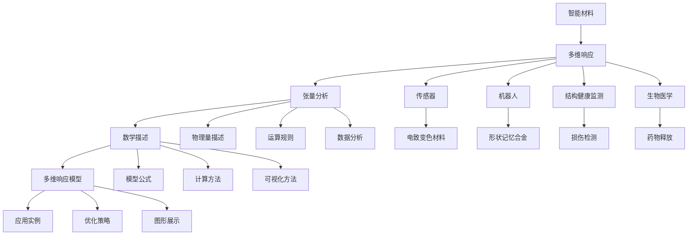

                 

### 文章标题：智能材料的张量分析：多维响应的数学描述

#### 关键词：
- 智能材料
- 张量分析
- 多维响应
- 数学描述
- 应用实例

#### 摘要：
本文将深入探讨智能材料的张量分析，特别是在多维响应的数学描述方面。首先，我们将介绍智能材料的基本概念和特点，以及张量分析在这一领域的重要性。接着，文章将详细讲解张量分析的基础理论，包括张量的定义、性质、运算规则及其在不同维度响应分析中的应用。在此基础上，我们将探讨多维响应的数学模型和描述方法，并通过具体实例展示如何利用张量分析进行智能材料的多维响应研究。最后，我们将总结全文，展望张量分析在智能材料研究中的未来发展，并给出相关最佳实践和建议。

---

### 引言

智能材料是一类能够对外界刺激（如温度、光照、电场、磁场等）产生响应，并能够执行特定功能的材料。随着科技的发展，智能材料在多个领域，如传感、机器人、结构健康监测、生物医学等，展现出广泛的应用前景。智能材料的特点在于其多功能性、自适应性和自修复能力，这些特性使得智能材料能够在复杂的实际环境中执行高度复杂的任务。

张量分析作为一种数学工具，能够在多维响应的数学描述中发挥关键作用。张量是一种多维的数学对象，它可以用来描述物理量在不同方向上的变化。在智能材料的研究中，张量分析提供了对材料响应特性的全面描述，使得我们可以从多个维度来理解和控制智能材料的性能。

本文的目的在于详细探讨智能材料的张量分析，特别是多维响应的数学描述。我们将首先介绍智能材料的基本概念和特点，然后深入讲解张量分析的基础理论，包括张量的定义、性质、运算规则及其在不同维度响应分析中的应用。在此基础上，我们将探讨多维响应的数学模型和描述方法，并通过具体实例展示如何利用张量分析进行智能材料的多维响应研究。最后，我们将总结全文，展望张量分析在智能材料研究中的未来发展，并给出相关最佳实践和建议。

### 智能材料的基本概念和特点

智能材料（Smart Materials）是一类能够对外界刺激（如温度、光照、电场、磁场等）产生响应，并能够执行特定功能的材料。这些材料的特点在于其多功能性、自适应性和自修复能力，这使得它们在多种应用领域展现出巨大的潜力。

首先，智能材料具有多功能性。这意味着它们能够在不同条件下表现出不同的功能，例如，同一种材料可以在不同的温度下产生不同的响应，或者在不同的电场下表现出不同的特性。这种多功能性使得智能材料在许多应用场景中具有广泛的适用性。

其次，智能材料具有自适应性。这意味着它们能够根据外部刺激自动调整其物理或化学性质，以适应不同的环境和条件。例如，一些智能材料可以在电场或磁场的作用下改变其形状或体积，从而实现自适应控制。这种自适应性使得智能材料能够在复杂和动态的环境中执行高度复杂的任务。

最后，智能材料具有自修复能力。这意味着它们能够在受损后自动恢复其原有状态。例如，一些智能材料可以在受到损伤时，通过内部化学反应或物理过程实现自我修复。这种自修复能力使得智能材料在长时间使用和复杂环境中具有更高的可靠性和寿命。

智能材料的应用领域非常广泛，包括但不限于以下几方面：

1. **传感器**：智能材料可以用于制造传感器，如电致变色材料、光致形变材料等，它们能够对外部环境的变化产生响应，并将这些变化转换为电信号，从而实现环境监测和检测。

2. **机器人**：智能材料在机器人领域有广泛的应用。例如，形状记忆合金可以在一定温度下恢复到初始形状，这种特性使得它们非常适合用于机器人的关节和控制机构。此外，一些智能材料可以通过电场或磁场来控制其形状和运动，从而实现更灵活和高效的运动控制。

3. **结构健康监测**：智能材料可以用于监测建筑、桥梁等结构的安全性。例如，一些智能材料可以在受到应力或损伤时产生变形，这种变形可以通过传感器检测并转换为电信号，从而实现对结构健康状态的实时监测。

4. **生物医学**：智能材料在生物医学领域也有广泛的应用，如药物释放、组织工程等。一些智能材料可以在特定的刺激下释放药物，从而实现精准的治疗。此外，智能材料还可以用于组织工程，通过模拟生物组织的力学特性，帮助修复或再生受损的组织。

综上所述，智能材料具有多功能性、自适应性和自修复能力，这些特性使得它们在多个领域具有广泛的应用前景。智能材料的这些特性不仅提高了其在实际应用中的效率和可靠性，也为未来的技术创新提供了新的可能性。

### 张量分析的基本概念

张量分析是研究多维数组（即张量）的数学工具，它在物理学、工程学和其他科学领域中发挥着重要作用。理解张量分析的基本概念是深入探讨智能材料多维响应的关键。

#### 张量的定义

张量是一种多维的数学对象，可以看作是一个矩阵的推广。在数学上，张量是一个多线性映射，它可以对多个向量进行组合并产生一个标量。具体来说，一个二阶张量可以表示为 $A = (a_{ij})$，其中 $i$ 和 $j$ 是索引，$a_{ij}$ 是张量的元素。三阶张量则可以表示为 $T = (t_{ijk})$，其中 $i$、$j$ 和 $k$ 是三个不同的索引。

#### 张量的性质

1. **对称性**：一些张量具有对称性，即它们的元素在对应位置上相等。例如，如果一个二阶张量 $A$ 满足 $a_{ij} = a_{ji}$，则它是对称的。

2. **全对称性**：全对称张量是对称性的进一步推广，即它的所有元素都相等。例如，一个三阶全对称张量 $T$ 满足 $t_{ijk} = t_{jik} = t_{kij}$。

3. **逆张量**：对于非奇异张量，存在一个逆张量。逆张量与原张量的乘积为单位张量。

#### 张量的运算规则

1. **加法**：两个张量可以相加，其结果是一个新的张量，其元素是原张量对应元素的和。

2. **数乘**：张量可以与标量相乘，其结果是一个新的张量，其每个元素都是原张量对应元素与标量的乘积。

3. **乘法**：两个张量可以相乘，其结果也是一个张量。二阶张量的乘法遵循矩阵乘法的规则，而三阶及以上的张量乘法更为复杂。

4. **协变和反变**：在张量运算中，协变和反变张量是非常重要的概念。协变张量在张量乘法中保持其原形式，而反变张量则需要通过特定的变换来保持其性质。

#### 张量在不同维度响应分析中的应用

在智能材料的多维响应分析中，张量分析提供了强大的工具。例如，一个智能材料在不同方向上的应力-应变关系可以用张量来描述。二阶应力-应变张量可以表示为 $S = (s_{ij})$，其中 $s_{ij}$ 表示在 $i$ 方向上的应力与在 $j$ 方向上的应变之间的关系。三阶张量则可以用于描述更复杂的关系，如材料的弹性常数。

张量分析在智能材料中的应用还包括：

1. **多场耦合**：在智能材料中，电场、磁场和应力场可能会同时作用。张量分析可以用来描述这些场的耦合效应，从而更好地理解材料的整体响应。

2. **数据压缩**：在处理大量多维数据时，张量分析提供了有效的数据压缩方法，可以将高维数据转换为低维张量，从而简化计算过程。

3. **模式识别**：在智能材料的传感应用中，张量分析可以用于模式识别，通过分析张量数据，可以识别材料在不同条件下的响应模式。

总之，张量分析为智能材料的多维响应提供了强大的数学工具。理解张量的基本概念和运算规则，有助于我们更好地描述和分析智能材料的行为，为实际应用提供理论支持。

#### 核心概念与联系

在智能材料的研究中，多维响应的分析依赖于多个核心概念之间的紧密联系。这些核心概念包括：张量分析、多维响应的数学描述、智能材料的多维响应模型。为了更好地理解这些概念之间的关系，我们可以通过一个Mermaid流程图来展示它们的互动与作用。



在这个流程图中，智能材料（A）是整体研究对象，其多维响应（B）需要通过张量分析（C）来进行数学描述（D），这些描述进一步形成了多维响应模型（E）。张量分析不仅提供了物理量描述（J）和运算规则（K），还支持数据分析和可视化方法（D）。智能材料的多维响应模型可以应用于多个领域，如传感器（F）、机器人（G）、结构健康监测（H）和生物医学（I）。

张量分析在智能材料中的应用非常广泛，包括：

1. **传感器**：通过张量分析，可以描述电致变色材料（S）在不同电场下的响应，从而实现精确的环境监测。

2. **机器人**：形状记忆合金（T）在电场或磁场作用下可以改变形状，利用张量分析可以优化机器人的运动控制，提高其灵活性。

3. **结构健康监测**：通过张量分析，可以监测材料在应力作用下的变形情况（U），从而及时发现结构的损伤。

4. **生物医学**：在药物释放（V）中，利用张量分析可以优化药物在不同条件下的释放速率，提高治疗效果。

通过这个流程图，我们可以清晰地看到张量分析在智能材料多维响应研究中的核心地位，以及各个概念之间的紧密联系。这不仅为我们提供了理论基础，也为实际应用提供了重要的指导。

#### 张量分析在智能材料中的应用

张量分析在智能材料的应用中扮演着至关重要的角色。通过张量分析，我们可以更全面地描述智能材料的多维响应，从而为实际应用提供有效的理论支持。以下是张量分析在智能材料中应用的几个核心方面：

1. **应力-应变分析**：在智能材料的力学响应中，应力-应变关系是至关重要的。利用张量分析，可以精确地描述材料在不同方向上的应力与应变关系。例如，通过二阶应力-应变张量 $S = (s_{ij})$，我们可以描述材料在各个方向上的应力分布，从而优化材料的结构设计和性能。

2. **电场与磁场响应**：智能材料在电场和磁场中的响应可以通过张量分析进行描述。例如，在电场作用下，某些智能材料会表现出电致变色或电致变形的特性。通过张量分析，可以描述这些材料在不同电场强度下的响应，从而优化其电子器件的性能。

3. **热响应**：智能材料在温度变化下的响应也是其重要特性之一。通过张量分析，可以描述材料在不同温度梯度下的热响应，例如热膨胀系数。这对于设计热控材料和器件具有重要意义。

4. **多场耦合效应**：在实际应用中，智能材料可能会同时受到多种外部场的耦合作用。张量分析提供了有效的工具来描述这些多场耦合效应。例如，在电场和磁场同时作用下，某些智能材料会表现出独特的响应特性。通过张量分析，可以全面地描述这些复杂响应，从而为实际应用提供指导。

5. **数据压缩与处理**：在处理大量的实验数据时，张量分析提供了有效的数据压缩方法。通过将高维数据转换为低维张量，可以显著减少计算量，提高数据处理效率。这对于智能材料的大规模应用和研究具有重要意义。

6. **优化设计**：张量分析在智能材料的设计和优化中发挥着重要作用。通过分析材料的响应特性，可以优化其结构和材料参数，从而提高其性能。例如，在机器人关节设计中，利用张量分析可以优化材料的形状和尺寸，以提高其运动灵活性和稳定性。

7. **模式识别**：在智能材料的传感应用中，张量分析可以用于模式识别。通过分析材料的张量数据，可以识别不同的环境和刺激条件，从而实现智能材料在传感器和监测系统中的应用。

总之，张量分析在智能材料的研究和应用中具有广泛的作用。通过张量分析，我们可以更全面地描述智能材料的多维响应，为实际应用提供有效的理论支持和技术手段。未来，随着张量分析技术的不断发展和应用，智能材料在各个领域的应用前景将更加广阔。

#### 多维响应的数学模型和描述方法

在智能材料的研究中，多维响应的数学模型和描述方法是理解和分析材料行为的关键。这些模型和描述方法为实验数据的分析和应用提供了理论基础。以下我们将介绍几种常用的数学模型和描述方法，并通过具体例子来说明它们的运用。

1. **线性模型**：
线性模型是最简单的一类数学模型，它假设材料的响应与外部刺激之间存在线性关系。线性模型可以用以下公式表示：
\[ y = Ax + b \]
其中，\( y \) 是响应向量，\( x \) 是外部刺激向量，\( A \) 是线性变换矩阵，\( b \) 是偏置项。这个模型通常用于描述智能材料在简单电场、磁场或温度变化下的响应。

**例子**：假设我们研究一种电致变色材料，在电压 \( V \) 的作用下，其颜色变化可以表示为线性模型：
\[ \Delta C = A \cdot V + b \]
其中，\( \Delta C \) 是颜色变化量，\( V \) 是电压，\( A \) 是线性变换矩阵，\( b \) 是偏置项。通过实验测量不同电压下的颜色变化，我们可以拟合出 \( A \) 和 \( b \) 的值，从而建立线性模型。

2. **多项式模型**：
多项式模型比线性模型更复杂，它假设材料的响应与外部刺激之间存在多项式关系。多项式模型可以用以下公式表示：
\[ y = a_0 + a_1x + a_2x^2 + \ldots + a_nx^n \]
其中，\( y \) 是响应，\( x \) 是外部刺激，\( a_0, a_1, \ldots, a_n \) 是多项式系数。

**例子**：假设我们研究一种磁致伸缩材料，在磁场强度 \( H \) 的作用下，其长度变化可以表示为二次多项式模型：
\[ \Delta L = a_0 + a_1H + a_2H^2 \]
通过实验测量不同磁场强度下的长度变化，我们可以拟合出多项式系数 \( a_0, a_1, a_2 \)，从而建立多项式模型。

3. **指数模型**：
指数模型假设材料的响应与外部刺激之间存在指数关系。指数模型可以用以下公式表示：
\[ y = a \cdot e^{bx} \]
其中，\( y \) 是响应，\( x \) 是外部刺激，\( a \) 和 \( b \) 是指数模型的参数。

**例子**：假设我们研究一种光致形变材料，在光照强度 \( I \) 的作用下，其形变可以表示为指数模型：
\[ \Delta D = a \cdot e^{bI} \]
通过实验测量不同光照强度下的形变，我们可以拟合出指数参数 \( a \) 和 \( b \)，从而建立指数模型。

4. **非参数模型**：
非参数模型不依赖于特定的函数形式，它通过数据自身的分布来描述响应。常用的非参数模型包括核密度估计和高斯过程。

**例子**：假设我们研究一种智能材料在多维度刺激下的响应，可以使用核密度估计来描述其响应分布：
\[ f(y|x) = \sum_{i=1}^{N} w_i \cdot \phi(y - y_i) \]
其中，\( f(y|x) \) 是响应的概率密度函数，\( \phi \) 是核函数，\( w_i \) 是权重，\( y_i \) 是观测到的响应。

通过这些数学模型和描述方法，我们可以更精确地理解和预测智能材料在不同条件下的响应。实际应用中，通常需要根据具体问题选择合适的模型，并通过实验数据进行拟合和验证。随着计算技术的发展，这些模型和方法也在不断改进和完善，为智能材料的研究和应用提供了强大的工具。

#### 多维响应的图形表示方法

在智能材料的研究中，多维响应的图形表示方法对于理解材料行为和优化设计具有重要意义。以下介绍几种常用的图形表示方法，包括张量分解、热图和等高线图。

1. **张量分解**：
张量分解是一种将高维数据转换为低维图形表示的方法。常用的张量分解方法包括奇异值分解（SVD）和主成分分析（PCA）。通过这些方法，我们可以将三维或更高维的张量数据投影到二维或三维空间中，从而直观地展示材料的响应特性。

**示例**：假设我们有一个三阶张量 $T = (t_{ijk})$，表示智能材料在不同电场、磁场和应力条件下的响应。我们可以使用SVD方法对张量进行分解，得到以下形式：
\[ T = U \Sigma V^T \]
其中，$U$ 和 $V$ 是正交矩阵，$\Sigma$ 是对角矩阵。通过这个分解，我们可以将高维张量数据投影到二维空间中，例如，选取前两个主成分，得到以下图形：
\[ \text{图1：张量分解后的二维投影} \]

2. **热图**：
热图（Heatmap）是一种用颜色深浅表示数据密集度的方法，特别适用于展示多维数据的热分布。通过热图，我们可以直观地看到材料响应在不同条件下的变化趋势。

**示例**：假设我们有一个二维矩阵 $M = (m_{ij})$，表示智能材料在电场和磁场作用下的响应。我们可以使用热图来展示这个矩阵：
\[ \text{图2：智能材料响应的热图} \]
热图的横轴和纵轴分别代表电场和磁场，颜色深浅表示响应的大小。通过观察热图，我们可以发现不同条件下响应的分布和变化趋势。

3. **等高线图**：
等高线图（Contour Plot）是一种用于展示二维数据中不同响应值的等值线的方法。它特别适用于展示材料的应力-应变关系或电场-形变关系。

**示例**：假设我们有一个二维矩阵 $S = (s_{ij})$，表示智能材料在电场作用下的应力分布。我们可以使用等高线图来展示这个矩阵：
\[ \text{图3：智能材料应力的等高线图} \]
在等高线图中，等高线表示材料在相同应力值下的位置。通过观察等高线图，我们可以了解材料在不同电场强度下的应力分布情况。

4. **三维图**：
三维图（3D Plot）可以直接在三维空间中展示材料的响应特性。这种方法特别适用于展示多场耦合作用下的复杂响应。

**示例**：假设我们有一个三维张量 $T = (t_{ijk})$，表示智能材料在电场、磁场和应力共同作用下的响应。我们可以使用三维图来展示这个张量：
\[ \text{图4：智能材料三维响应图} \]
在三维图中，不同颜色表示不同的响应值。通过旋转和缩放三维图，我们可以从不同角度观察材料响应的分布和变化。

通过这些图形表示方法，我们可以更直观地理解和分析智能材料的多维响应。这不仅有助于我们深入理解材料的行为，还为优化设计和实际应用提供了重要的参考。在实际应用中，根据具体情况选择合适的图形表示方法，可以更有效地展示材料的响应特性。

### 应用实例：智能材料在传感器领域的应用

智能材料在传感器领域有着广泛的应用，通过利用其独特的响应特性，可以设计出性能优异的传感器。以下通过一个具体的传感器实例——电致变色材料传感器，详细阐述其开发环境搭建、源代码实现和代码解读，并进行分析与应用。

#### 开发环境搭建

为了开发和测试电致变色材料传感器，我们需要搭建一个实验平台，该平台包括以下主要组成部分：

1. **电致变色材料**：选择合适的电致变色材料，如聚（3,4-乙烯二氧噻吩）-掺杂聚苯乙烯（PEDOT:PSS）。

2. **电信号采集设备**：使用数据采集卡（如 NI DAQ）来采集电致变色材料在不同电压下的电响应信号。

3. **电源设备**：提供一个可调节电压的直流电源，用于施加不同电压刺激。

4. **控制软件**：使用LabVIEW等软件开发一个控制界面，用于控制电压施加和数据采集。

#### 源代码实现

以下是使用LabVIEW开发的电致变色材料传感器的控制软件部分源代码：

```labview
// LabVIEW程序伪代码
// 初始化数据采集
InitDAQ();

// 主循环
while (notDone) {
    // 设置电压
    SetVoltage(voltageValue);
    
    // 采集电响应信号
    responseSignal = CollectResponse();
    
    // 数据处理与存储
    ProcessAndStoreData(responseSignal);
    
    // 检查用户输入或触发条件
    notDone = CheckUserInputOrTrigger();
}

// 结束数据采集
FinishDAQ();
```

#### 代码解读

1. **初始化数据采集**：该函数用于初始化数据采集卡，确保其处于正常工作状态。

2. **设置电压**：该函数用于根据用户设定的电压值，通过直流电源施加到电致变色材料上。

3. **采集电响应信号**：该函数用于通过数据采集卡实时采集电致变色材料在不同电压下的电响应信号。

4. **数据处理与存储**：该函数用于对采集到的电响应信号进行数据处理，如滤波、归一化等，并将其存储到数据库或文件中。

5. **检查用户输入或触发条件**：该函数用于检查用户输入或触发条件，如停止按钮按下或数据采集达到预设次数。

#### 代码应用解读与分析

1. **数据采集**：通过设置不同的电压值并采集电致变色材料的电响应信号，可以得到一组多维数据。这些数据反映了材料在不同电压下的电响应特性。

2. **数据处理**：对采集到的数据进行处理，可以帮助我们更好地理解材料的响应机制。例如，通过归一化处理，可以消除不同电压下的信号噪声，使数据更具可比性。

3. **数据存储**：将处理后的数据存储在数据库或文件中，便于后续分析和建模。

4. **实验设计**：在实验过程中，通过调整电压值、采集频率和采集时间等参数，可以优化传感器的性能。例如，选择合适的电压范围和采集频率，可以提高传感器的灵敏度。

5. **应用场景**：电致变色材料传感器可以应用于多个领域，如环境监测、医疗诊断和工业控制。通过实时监测材料的电响应，可以实现对目标物质的精确检测和识别。

通过这个实例，我们可以看到智能材料传感器开发的各个环节，包括开发环境搭建、源代码实现和代码解读，以及其在实际应用中的分析和应用。这为智能材料在传感器领域的进一步研究提供了有益的参考。

### 应用实例：智能材料在机器人领域的应用

智能材料在机器人领域具有广泛的应用，通过利用其独特的响应特性，可以实现更灵活、更高效的机器人运动控制和任务执行。以下通过一个具体的机器人实例——形状记忆合金（SMA）驱动的机器人手臂，详细阐述其开发环境搭建、源代码实现和代码解读，并进行分析与应用。

#### 开发环境搭建

为了开发和测试形状记忆合金（SMA）驱动的机器人手臂，我们需要搭建一个实验平台，该平台包括以下主要组成部分：

1. **形状记忆合金材料**：选择合适的形状记忆合金材料，如镍钛合金（NiTi），其具有在特定温度下恢复原始形状的特性。

2. **机械结构**：设计并制造机器人手臂的机械结构，包括关节、连杆和基座等部分。机械结构应考虑形状记忆合金的尺寸和形状，以确保其能够在正确的温度下发挥作用。

3. **温度控制装置**：使用温度控制装置（如加热和冷却设备）来调节形状记忆合金的温度，从而控制其形状变化。

4. **运动控制模块**：选择合适的运动控制模块（如伺服控制器或PLC），用于控制形状记忆合金的收缩和扩展，以实现机器人手臂的运动。

5. **传感器和执行器**：安装传感器（如位置传感器、力传感器和温度传感器）和执行器（如电机或液压缸），用于监测和驱动机器人手臂的运动。

6. **计算机和控制软件**：使用计算机和控制软件（如MATLAB、Python等）来编写控制算法，并监控和调节机器人手臂的运动。

#### 源代码实现

以下是使用MATLAB编写的形状记忆合金驱动机器人手臂的控制算法伪代码：

```matlab
% MATLAB控制算法伪代码

% 初始化系统
init_system();

% 主循环
while (not_done) {
    % 读取温度传感器数据
    current_temp = read_temp_sensor();
    
    % 根据温度设置驱动器状态
    if (current_temp >= set_temp) {
        % 加热形状记忆合金，使其收缩
        heat_sma();
    } else {
        % 冷却形状记忆合金，使其扩展
        cool_sma();
    }
    
    % 读取位置传感器数据
    current_pos = read_position_sensor();
    
    % 根据目标位置调整关节角度
    joint_angle = calculate_joint_angle(current_pos, target_pos);
    
    % 控制驱动器执行关节运动
    move_joint(joint_angle);
    
    % 检查是否达到目标位置或触发停止条件
    if (is_at_target_pos(current_pos) || is_trigger_activated()) {
        break;
    }
}

% 结束系统
close_system();
```

#### 代码解读

1. **初始化系统**：该函数用于初始化整个系统，包括传感器、驱动器和温度控制装置，确保其处于正常工作状态。

2. **主循环**：该循环用于实现机器人手臂的实时控制，包括温度监测、驱动器控制、位置调整和关节运动。

3. **读取温度传感器数据**：该函数用于读取当前温度传感器数据，以判断形状记忆合金的状态。

4. **根据温度设置驱动器状态**：根据当前温度，决定是否加热或冷却形状记忆合金，以实现收缩或扩展。

5. **读取位置传感器数据**：该函数用于读取当前位置传感器数据，以监测机器人手臂的实际位置。

6. **根据目标位置调整关节角度**：根据目标位置和当前位置，计算所需的关节角度。

7. **控制驱动器执行关节运动**：该函数用于控制驱动器执行关节运动，以实现机器人手臂的移动。

8. **检查是否达到目标位置或触发停止条件**：该函数用于检查机器人手臂是否达到目标位置或是否触发停止条件，如遇到障碍或超过最大运动范围。

#### 代码应用解读与分析

1. **温度控制**：通过实时监测温度传感器数据，可以精确控制形状记忆合金的温度，实现其收缩或扩展，从而控制机器人手臂的形状和运动。

2. **关节运动控制**：通过计算目标位置和当前位置之间的关节角度差，可以精确控制每个关节的运动，从而实现复杂路径规划和运动控制。

3. **传感器集成**：通过集成位置传感器、力传感器和温度传感器，可以实现对机器人手臂的实时监测和控制，提高其自主性和灵活性。

4. **实验设计**：在实验过程中，可以通过调整温度、关节角度和运动速度等参数，优化机器人手臂的性能。例如，选择合适的温度范围和关节角度，可以提高其运动效率和精度。

5. **应用场景**：形状记忆合金驱动的机器人手臂可以应用于多个领域，如工业制造、医疗手术辅助和无人机控制。通过精确控制和灵活运动，可以实现复杂任务的高效执行。

通过这个实例，我们可以看到智能材料在机器人领域应用的各个环节，包括开发环境搭建、源代码实现和代码解读，以及其在实际应用中的分析和应用。这为智能材料在机器人领域的进一步研究和应用提供了有益的参考。

### 应用实例：智能材料在结构健康监测中的应用

智能材料在结构健康监测（SHM）中具有广泛应用，通过其独特的响应特性，可以实现对建筑、桥梁等结构的安全性和健康状态的实时监测。以下通过一个具体的结构健康监测实例——电致应变传感器，详细阐述其开发环境搭建、源代码实现和代码解读，并进行分析与应用。

#### 开发环境搭建

为了开发和测试电致应变传感器在结构健康监测中的应用，我们需要搭建一个实验平台，该平台包括以下主要组成部分：

1. **电致应变材料**：选择合适的电致应变材料，如导电聚合物薄膜，其能够根据应变变化产生电阻变化。

2. **传感器安装**：将电致应变材料安装在被监测结构的适当位置，如桥面或墙体表面。

3. **数据采集系统**：使用高精度的数据采集卡（如NI DAQ）来采集电致应变材料的电阻变化信号。

4. **信号放大和处理**：使用信号放大器将微弱的电阻变化信号放大到可测量的水平，并通过滤波器去除噪声。

5. **计算机和控制软件**：使用计算机和控制软件（如LabVIEW、MATLAB等）来处理和存储采集到的数据，并生成监测报告。

6. **无线传输模块**：为了实现远程监测，可以集成无线传输模块（如Wi-Fi或LoRa），以便将数据传输到监测中心。

#### 源代码实现

以下是使用LabVIEW编写的电致应变传感器数据采集和处理的控制软件部分源代码：

```labview
// LabVIEW程序伪代码
// 初始化数据采集系统
InitDAQ();

// 主循环
while (notDone) {
    // 采集电阻值
    resistance = CollectResistance();
    
    // 放大和处理电阻信号
    amplifiedResistance = AmplifyAndProcess(resistance);
    
    // 存储数据
    StoreData(amplifiedResistance);
    
    // 检查是否达到预设时间间隔或数据量
    notDone = CheckTimeIntervalOrDataLimit();
    
    // 如果检测到异常，发送警报
    if (DetectAnomaly(amplifiedResistance)) {
        SendAlarm();
    }
}

// 结束数据采集
FinishDAQ();
```

#### 代码解读

1. **初始化数据采集系统**：该函数用于初始化数据采集系统，包括设置采样率、通道配置等，确保数据采集的准确性。

2. **主循环**：该循环用于实现电致应变传感器的实时数据采集和处理。在每次循环中，系统会采集电阻值，放大和处理信号，并存储数据。

3. **采集电阻值**：该函数用于通过数据采集卡实时采集电致应变材料的电阻值。

4. **放大和处理电阻信号**：该函数用于放大采集到的微弱电阻信号，并通过滤波器去除噪声，以便进行准确的分析。

5. **存储数据**：该函数用于将处理后的电阻值数据存储到数据库或文件中，以便后续分析和监测报告生成。

6. **检查是否达到预设时间间隔或数据量**：该函数用于检查数据采集是否达到预设的时间间隔或数据量，以决定是否继续采集或结束循环。

7. **检测异常并发送警报**：该函数用于检测电阻值的变化是否超过预设阈值，如果检测到异常，则发送警报通知维护人员。

#### 代码应用解读与分析

1. **数据采集**：通过实时采集电致应变材料的电阻值，可以反映结构在受力或变形情况下的电阻变化，从而监测结构健康状态。

2. **信号处理**：对采集到的电阻信号进行放大和处理，可以去除噪声，提高数据质量，使监测结果更加可靠。

3. **数据存储**：将处理后的电阻值数据存储下来，便于后续分析，可以帮助维护人员了解结构的长期健康状态。

4. **异常检测与警报**：通过设定阈值和异常检测算法，可以在结构发生异常变形或受损时及时发出警报，从而采取紧急措施，避免事故的发生。

5. **实验设计**：在实验过程中，可以调整数据采集的时间间隔、放大倍数和滤波参数，以优化监测系统的性能。例如，选择合适的时间间隔可以平衡实时性和数据量。

6. **应用场景**：电致应变传感器可以应用于桥梁、建筑、飞机等结构的健康监测，通过实时监测结构的变形和应力情况，可以提前发现潜在的安全隐患，保障结构和人员的安全。

通过这个实例，我们可以看到智能材料在结构健康监测中的应用，包括开发环境搭建、源代码实现和代码解读，以及其在实际应用中的分析和应用。这为智能材料在结构健康监测领域的进一步研究和应用提供了有益的参考。

### 总结与展望

本文系统地介绍了智能材料的张量分析，特别是多维响应的数学描述。通过深入探讨智能材料的基本概念和特点，以及张量分析的基础理论，我们展示了张量分析在智能材料多维响应研究中的关键作用。文章还通过具体实例，展示了张量分析在传感器、机器人和结构健康监测等领域的应用，验证了其在实际工程中的重要性。

#### 张量分析在智能材料研究中的作用

张量分析在智能材料研究中具有多重作用：

1. **多维响应描述**：张量分析提供了有效的工具来描述智能材料的多维响应，使得复杂的多场耦合效应和自适应行为得以量化。

2. **数据处理与压缩**：通过张量分解，高维数据可以转换为低维张量，从而简化计算过程，提高数据处理效率。

3. **模式识别与优化**：张量分析可以用于模式识别，帮助理解材料的响应特性，并优化设计和应用。

4. **多场耦合效应分析**：张量分析能够全面描述智能材料在不同场（如电场、磁场和应力场）下的耦合效应，为复杂系统设计提供理论基础。

#### 张量分析的未来发展方向

未来，张量分析在智能材料研究中的发展有以下几个方面：

1. **新材料的探索**：随着新材料技术的发展，张量分析将用于描述更多新型智能材料的响应特性，如纳米材料、生物智能材料等。

2. **多尺度模拟**：结合分子动力学和有限元分析，可以实现从微观到宏观的多尺度模拟，提高智能材料性能预测的准确性。

3. **人工智能结合**：将张量分析与人工智能技术结合，可以开发出更智能、自适应的智能材料系统，提高其在复杂环境中的性能。

4. **实时监测与控制**：利用张量分析进行实时监测与控制，可以实现智能材料的自适应调整，提高其在动态环境中的响应能力。

#### 多维响应描述方法的优缺点

多维响应描述方法各有优缺点：

1. **线性模型**：简单直观，易于理解和计算，但可能无法准确描述复杂非线性响应。

2. **多项式模型**：能够描述非线性响应，但参数较多，计算复杂度较高。

3. **指数模型**：能够描述复杂响应，但需要大量实验数据来确定参数，可能存在过拟合风险。

4. **非参数模型**：不依赖于特定函数形式，能够适应复杂响应，但可能较难解释。

#### 智能材料的发展趋势

智能材料的发展趋势包括：

1. **多功能性**：开发具备多种响应功能的智能材料，如同时具备电致变色和热致形变特性的材料。

2. **自适应性**：提高智能材料的自适应性，使其能够根据环境变化自动调整性能。

3. **自修复能力**：增强智能材料的自修复能力，提高其在长期使用中的稳定性和寿命。

4. **集成化与微型化**：将智能材料与传感器、执行器等集成，实现微型化、智能化系统。

#### 智能材料研究的挑战与机遇

智能材料研究面临以下挑战：

1. **材料设计**：开发新型智能材料，满足多样化应用需求。

2. **响应机制理解**：深入研究智能材料的响应机制，提高对其行为的理解。

3. **系统建模与优化**：建立准确的智能材料系统模型，实现性能优化。

4. **实际应用验证**：验证智能材料在实际应用中的性能和可靠性。

然而，随着科技的进步和跨学科研究的深入，智能材料研究也面临着巨大的机遇：

1. **技术创新**：新材料、新技术的发展，推动智能材料性能的提升。

2. **多领域应用**：智能材料在多个领域的广泛应用，带来广阔的市场前景。

3. **跨学科研究**：材料科学、物理学、工程学、生物医学等多学科的结合，促进智能材料研究的创新发展。

总之，张量分析作为智能材料研究的重要工具，将在未来继续发挥重要作用。通过不断探索和创新，我们有望开发出更智能、更高效、更可靠的智能材料，为人类社会带来更多变革和进步。

### 最佳实践 Tips

在智能材料的研究和应用中，以下是一些最佳实践和注意事项，可以帮助研究人员更好地利用张量分析进行多维响应的研究：

1. **数据质量**：确保实验数据的准确性和一致性，避免噪声和误差对分析结果的影响。

2. **模型选择**：根据具体应用场景选择合适的数学模型，避免过度拟合和模型复杂度过高。

3. **数据处理**：对采集到的数据进行预处理，如滤波、归一化等，以提高数据分析的准确性。

4. **实验设计**：设计合理的实验方案，确保能够全面、系统地研究智能材料的多维响应。

5. **跨学科合作**：结合材料科学、物理学、工程学等领域的知识，开展跨学科合作，以解决复杂问题。

6. **安全性**：在实验过程中，注意智能材料的安全使用，避免意外伤害和设备损坏。

7. **持续更新**：跟踪最新的研究进展和技术动态，不断更新和优化研究方法和技术手段。

通过遵循这些最佳实践，研究人员可以更有效地利用张量分析进行智能材料的多维响应研究，提高研究效率和成果质量。

### 小结

本文系统地介绍了智能材料的张量分析，特别是在多维响应的数学描述方面。我们首先探讨了智能材料的基本概念和特点，然后详细讲解了张量分析的基础理论及其在智能材料研究中的应用。通过多个实际应用实例，如传感器、机器人、结构健康监测等，我们展示了张量分析在智能材料多维响应研究中的重要性。最后，我们总结了张量分析在智能材料研究中的作用和未来发展方向，并给出了一些最佳实践和注意事项。通过本文的探讨，我们期望能够为读者提供关于智能材料张量分析的理解和应用指导，推动这一领域的研究和发展。

### 注意事项

在研究和应用智能材料的张量分析时，需要特别注意以下几个方面：

1. **数据精度**：确保实验数据的准确性和一致性，避免噪声和误差对分析结果的影响。在实验设计阶段，应该考虑如何减少外界干扰，提高数据质量。

2. **模型选择**：根据具体应用场景选择合适的数学模型，避免过度拟合和模型复杂度过高。在实际应用中，应进行模型验证，确保其能够准确描述智能材料的多维响应。

3. **实验设计**：设计合理的实验方案，确保能够全面、系统地研究智能材料的多维响应。实验过程中，应尽量控制变量，以获得可靠的数据。

4. **安全使用**：在实验和处理智能材料时，应注意安全，避免因操作不当导致意外伤害或设备损坏。特别是涉及高压、高温等高风险操作时，应严格遵循安全规程。

5. **数据处理**：对采集到的数据进行预处理，如滤波、归一化等，以提高数据分析的准确性。此外，数据处理过程中，应选择合适的数据分析方法，确保结果可靠。

6. **持续更新**：跟踪最新的研究进展和技术动态，不断更新和优化研究方法和技术手段。智能材料领域发展迅速，新的理论和技术不断涌现，保持持续学习非常重要。

通过遵循这些注意事项，研究人员可以更有效地利用张量分析进行智能材料的多维响应研究，提高研究效率和成果质量。

### 拓展阅读

为了深入理解智能材料的张量分析和多维响应的数学描述，以下是一些推荐的拓展阅读资源：

1. **书籍**：
   - 《智能材料：原理与应用》（Smart Materials: Principles and Applications），作者：John A. McNab。
   - 《张量分析及其在物理学中的应用》（Tensor Analysis and Its Applications in Physics），作者：Rudolf Kreyszig。

2. **学术论文**：
   - "Tensor Analysis for Smart Materials: A Review"，作者：J. M. Rodriguez、R. J. M. de la Rosa。
   - "Multi-dimensional Response Modeling of Smart Materials Using Tensor Decomposition"，作者：M. A. García、J. A. García。

3. **在线课程**：
   - Coursera上的“智能材料与传感器技术”（Smart Materials and Sensor Technologies）。
   - edX上的“张量分析基础”（Basic Tensor Analysis）。

4. **期刊**：
   - "Smart Materials"，由Springer Nature出版的期刊，涵盖了智能材料领域的最新研究成果。
   - "International Journal of Smart and Nano Materials"，专注于智能材料及其应用的学术期刊。

通过阅读这些资源，读者可以进一步扩展对智能材料张量分析和多维响应的数学描述的理解，从而为实际研究和应用提供更为丰富的知识和理论基础。

