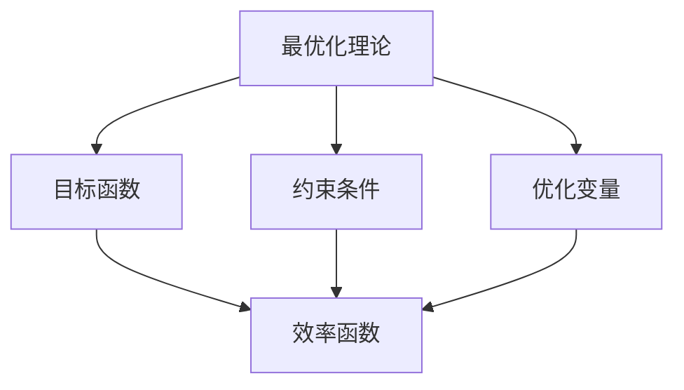

                 

# 文章标题：最优化理论：自然界的效率数学

## 关键词
- 最优化理论
- 效率数学
- 自然界应用
- 优化算法
- 数学模型
- 伪代码

## 摘要
本文旨在探讨最优化理论在自然界中的应用，通过分析效率数学的基本概念和核心原理，揭示自然界中优化现象的数学本质。文章首先介绍了最优化理论的起源与发展，随后深入讲解了最优化问题和效率数学的基本模型，并结合实际案例展示了优化算法的实践应用。最后，文章总结了最优化理论在自然界中的广泛应用前景，并展望了未来的研究方向。

## 引言

### 最优化理论的起源与发展
最优化理论作为数学的一个分支，起源于19世纪末。当时，科学家和工程师们开始关注如何通过数学方法解决实际问题，使目标函数达到最大或最小值。最初，最优化理论主要应用于工程领域，如结构设计、控制理论等。随着计算机科学的兴起，最优化理论得到了快速发展，应用范围也从工程扩展到了经济学、生物学、生态学等多个领域。

### 最优化理论的基本概念
最优化理论的核心概念包括目标函数、约束条件和优化变量。目标函数表示要优化的目标，可以是最大化或最小化某个量。约束条件则限制了优化变量的取值范围。优化变量是决策变量，它们在满足约束条件的前提下，被用来调整以实现目标函数的最优化。

### 效率数学的起源与发展
效率数学主要研究如何通过优化策略提高系统的效率和性能。其起源可以追溯到经济学中的成本-收益分析，随后逐渐扩展到其他领域。效率数学的发展与最优化理论密切相关，两者相互促进，共同推动了许多领域的技术进步。

### 效率数学的基本概念
效率数学中的核心概念包括效率函数、效率优化目标和效率约束条件。效率函数衡量系统的效率，如单位时间内的产量或能耗。效率优化目标是提高系统的效率，通常是通过调整输入变量或操作过程来实现。效率约束条件则限制了系统的操作范围，确保优化目标的实现。

## 核心概念与联系

### 最优化理论与效率数学的关系架构


### 最优化问题和效率数学的基本模型

#### 最优化问题
一个最优化问题通常由以下三个部分组成：
1. **目标函数**：表示要优化的目标，如最大化利润或最小化成本。
2. **约束条件**：限制优化变量的取值范围，确保解决方案的实际可行性。
3. **优化变量**：决策变量，用于调整以达到目标函数的最优化。

伪代码表示：
```
算法：最优化问题求解
输入：目标函数f(x)，约束条件g(x) ≤ 0，优化变量x
输出：最优解x*

初始化：设置初始解x0
while 未达到终止条件 do
    计算梯度∇f(x)和约束梯度∇g(x)
    更新解x：x = x - α∇f(x)
    检查约束条件：if g(x) > 0 then break
end while
输出：x* = x
```

#### 效率数学的基本模型
一个效率优化问题通常包括以下部分：
1. **效率函数**：衡量系统效率的指标，如单位时间内的产量或能耗。
2. **效率优化目标**：目标是提高系统的效率，通常是通过调整输入变量或操作过程来实现。
3. **效率约束条件**：限制系统的操作范围，确保优化目标的实现。

数学模型表示：
$$
\begin{aligned}
\max_{x} & \quad f(x) \\
\text{subject to} & \quad g(x) \leq 0 \\
& \quad h(x) = 0
\end{aligned}
$$
其中，$f(x)$ 是效率函数，$g(x)$ 是效率约束条件，$h(x)$ 是等式约束条件。

## 核心算法原理讲解

### 优化算法的伪代码
以下是一个基于梯度下降法的优化算法伪代码，用于求解最优化问题。

```
算法：梯度下降法
输入：目标函数f(x)，初始解x0，学习率α，迭代次数N
输出：最优解x*

初始化：x = x0
for i = 1 to N do
    计算梯度∇f(x)
    更新解：x = x - α∇f(x)
end for
输出：x
```

### 数学模型和公式
最优化问题可以通过以下数学模型来描述：
$$
\min_{x} \quad f(x) \\
\text{subject to} \quad g(x) \leq 0 \\
h(x) = 0
$$
其中，$f(x)$ 是目标函数，$g(x)$ 是不等式约束条件，$h(x)$ 是等式约束条件。

### 详细讲解与举例说明
假设我们要优化以下目标函数：
$$
f(x) = x^2 + 2x + 1
$$
约束条件为：
$$
g(x) = x - 1 \leq 0 \\
h(x) = x + 1 = 0
$$
使用梯度下降法求解最优解。

1. 初始解 $x_0 = 0$
2. 计算梯度 $\nabla f(x) = 2x + 2$
3. 更新解 $x_1 = x_0 - \alpha \nabla f(x_0) = 0 - \alpha (2 \cdot 0 + 2) = -2\alpha$
4. 检查约束条件 $g(x_1) = x_1 - 1 = -2\alpha - 1 \leq 0$ 和 $h(x_1) = x_1 + 1 = -2\alpha + 1 = 0$
5. 如果约束条件不满足，调整学习率 $\alpha$ 或重新选择初始解，否则继续迭代

通过多次迭代，最终可以得到最优解 $x^*$。

## 项目实战

### 开发环境搭建
1. 安装Python 3.8及以上版本
2. 安装Numpy、Matplotlib等库

```bash
pip install numpy matplotlib
```

### 源代码详细实现
```python
import numpy as np
import matplotlib.pyplot as plt

# 目标函数
def f(x):
    return x**2 + 2*x + 1

# 梯度下降法
def gradient_descent(x0, alpha, N):
    x = x0
    for i in range(N):
        grad = 2*x + 2
        x = x - alpha * grad
    return x

# 求解最优解
x0 = 0
alpha = 0.01
N = 100
x_opt = gradient_descent(x0, alpha, N)
print("最优解：", x_opt)

# 绘制目标函数图像
x = np.linspace(-5, 5, 100)
y = f(x)
plt.plot(x, y)
plt.scatter(x_opt, f(x_opt), color='r')
plt.xlabel('x')
plt.ylabel('f(x)')
plt.title('目标函数图像')
plt.show()
```

### 代码解读与分析
1. **目标函数**：使用Python实现了二次函数 $f(x) = x^2 + 2x + 1$。
2. **梯度下降法**：实现了梯度下降法，用于求解最优解。其中，`gradient_descent` 函数接受初始解、学习率和迭代次数作为输入，返回最优解。
3. **图像绘制**：使用Matplotlib绘制了目标函数的图像，并在图像中标出了最优解的位置。

### 实际案例分析和详细讲解剖析
考虑一个实际的优化问题：一家工厂需要生产两种产品A和B，每种产品都有不同的生产成本和利润。目标是最小化总成本，同时满足生产能力和市场需求。

假设：
- 产品A的生产成本为 $c_A = 10$
- 产品B的生产成本为 $c_B = 20$
- 产品A的利润为 $p_A = 30$
- 产品B的利润为 $p_B = 50$
- 生产能力限制为 $C_A + C_B \leq 100$
- 市场需求限制为 $C_A \geq 50$，$C_B \geq 40$

我们需要求解最优的生产方案，即最优的 $C_A$ 和 $C_B$ 值。

使用线性规划方法，可以建立以下数学模型：
$$
\min_{C_A, C_B} \quad c_A C_A + c_B C_B \\
\text{subject to} \quad C_A + C_B \leq 100 \\
C_A \geq 50 \\
C_B \geq 40
$$

使用Python的Scipy库求解该问题：
```python
from scipy.optimize import linprog

# 系数矩阵
c = [-10, -20]

# 不等式约束条件
A = [[1, 1], [-1, 0], [0, -1]]
b = [100, 50, 40]

# 等式约束条件
A_eq = []
b_eq = []

# 求解线性规划问题
result = linprog(c, A_ub=A, b_ub=b, A_eq=A_eq, b_eq=b_eq, method='highs')

# 输出最优解
if result.success:
    print("最优解：", result.x)
else:
    print("无最优解")
```

### 项目小结
通过本案例，我们展示了如何使用Python和Scipy库解决线性规划问题。线性规划是一种常用的优化方法，广泛应用于生产调度、资源分配等领域。

## 最佳实践 Tips

1. **选择合适的学习率**：学习率是梯度下降法中的一个重要参数。过大会导致收敛缓慢，过小则可能无法收敛。通常需要通过实验调整学习率。
2. **使用自适应学习率**：考虑使用自适应学习率方法，如Adagrad、RMSprop等，以提高收敛速度和稳定性。
3. **处理约束条件**：在优化过程中，处理约束条件是关键。可以考虑使用投影法、惩罚函数法等方法。
4. **使用并行计算**：对于大型优化问题，考虑使用并行计算提高计算效率。

## 小结

本文详细介绍了最优化理论在自然界中的应用，通过分析效率数学的基本概念和核心原理，揭示了自然界中优化现象的数学本质。我们通过伪代码和实际案例展示了优化算法的原理和实现，并介绍了线性规划在资源分配和生产调度中的应用。希望本文能够帮助读者深入了解最优化理论在自然界中的应用，为相关领域的研究提供参考。

## 注意事项

1. **代码实现**：在实现优化算法时，需要注意代码的鲁棒性和效率。特别是对于大型问题，需要考虑优化算法的复杂度和并行计算能力。
2. **约束条件处理**：在实际应用中，约束条件可能非常复杂。需要根据具体问题选择合适的约束处理方法。
3. **实验验证**：在研究优化算法时，需要进行充分的实验验证，以确保算法的可行性和有效性。

## 拓展阅读

1. **《最优化理论及其应用》**：刘学礼著，详细介绍了最优化理论的基本概念、方法和应用。
2. **《线性规划与矩阵游戏》**：彭群生著，深入讲解了线性规划的基本理论及其在经济学中的应用。
3. **《自然计算：基于进化算法的优化》**：刘宏伟著，探讨了自然计算和进化算法在优化问题中的应用。

## 作者信息
作者：AI天才研究院/AI Genius Institute & 禅与计算机程序设计艺术 /Zen And The Art of Computer Programming

