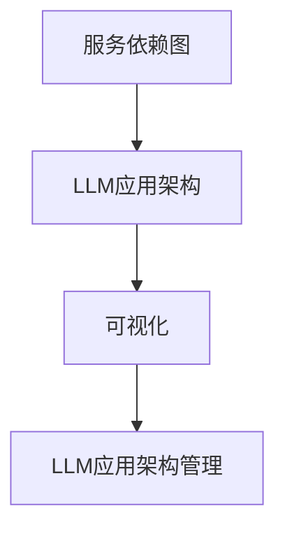
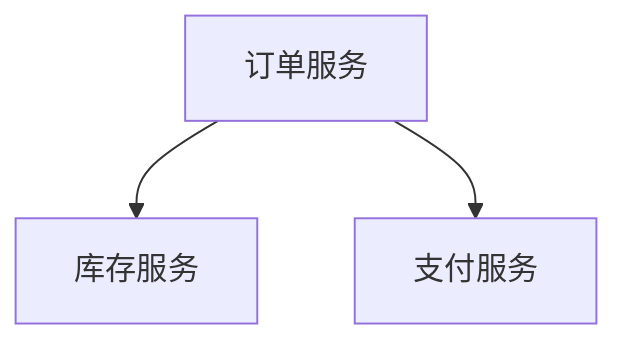

                 


### 1. 背景介绍

#### 服务依赖图

服务依赖图（Service Dependency Graph）是一种用于描述系统中服务和服务之间依赖关系的图形化模型。在软件系统、云计算、分布式架构等领域，服务依赖图的作用至关重要。通过服务依赖图，开发者和管理员可以清晰地了解系统中各个服务之间的关系，从而有效地进行系统设计和维护。

服务依赖图的构成主要包括节点和边。节点表示系统中的服务，边表示服务之间的依赖关系。例如，在一个电商平台上，订单服务可能依赖于库存服务和支付服务。这种依赖关系可以用服务依赖图来表示，如下：

```
节点：
- 订单服务
- 库存服务
- 支付服务

边：
- 订单服务 -> 库存服务
- 订单服务 -> 支付服务
```

#### LLM应用架构管理

大型语言模型（Large Language Model，简称LLM）是当前人工智能领域的研究热点。LLM在自然语言处理、文本生成、对话系统等方面具有广泛的应用。然而，随着LLM规模的不断扩大，如何进行有效的应用架构管理成为了一个挑战。

LLM应用架构管理涉及多个方面，包括但不限于：

- **架构设计**：如何设计一个高效、可扩展的LLM应用架构。
- **资源管理**：如何合理分配计算资源，确保LLM应用的稳定运行。
- **依赖管理**：如何处理LLM与其他系统或服务之间的依赖关系。

#### 服务依赖图可视化在LLM应用架构管理中的作用

服务依赖图可视化在LLM应用架构管理中具有重要作用。通过可视化，开发者和管理员可以更直观地理解LLM应用的架构，发现潜在的问题和优化机会。具体来说，服务依赖图可视化在LLM应用架构管理中的作用包括：

- **提高可理解性**：通过图形化展示，使得复杂的LLM应用架构变得更加直观易懂。
- **问题诊断**：通过可视化，快速识别系统中的依赖冲突和性能瓶颈。
- **优化架构**：基于可视化结果，对LLM应用架构进行优化，提高系统的可靠性和性能。
- **协作沟通**：通过可视化，帮助团队成员更好地理解LLM应用的架构，促进协作和沟通。

### 2. 核心概念与联系

为了深入理解服务依赖图可视化在LLM应用架构管理中的作用，我们需要先了解以下几个核心概念：

- **服务依赖图**：如前所述，服务依赖图是一种描述系统中服务和服务之间依赖关系的图形化模型。
- **LLM应用架构**：LLM应用的架构设计，包括数据流、组件交互和依赖关系。
- **可视化**：将抽象的信息通过图形化的方式展示，使得信息更加直观易懂。

这三个核心概念之间的关系可以用以下Mermaid流程图表示：



### 3. 核心算法原理讲解

在LLM应用架构管理中，构建和可视化服务依赖图是关键步骤。下面我们将介绍几个核心算法原理。

#### 3.1 服务依赖图的构建算法

服务依赖图的构建算法主要包括以下几个步骤：

1. **数据收集**：从系统日志、配置文件、API文档等途径收集服务之间的依赖信息。
2. **依赖分析**：对收集到的数据进行处理，提取服务和服务之间的依赖关系。
3. **构建图**：将处理后的依赖关系转换为图结构，形成服务依赖图。

以下是构建服务依赖图的伪代码：

```python
def build_dependency_graph(data):
    graph = {}
    for service in data:
        dependencies = extract_dependencies(service)
        graph[service] = dependencies
    return graph
```

#### 3.2 服务依赖图的可视化算法

服务依赖图的可视化算法主要包括以下几个步骤：

1. **布局算法**：对服务依赖图进行布局，使得图结构更加清晰易懂。
2. **渲染算法**：根据布局结果，将图结构渲染为图形化展示。

以下是服务依赖图可视化算法的伪代码：

```python
def visualize_dependency_graph(graph):
    layout = layout_algorithm(graph)
    rendered_graph = render_algorithm(layout)
    display(rendered_graph)
```

#### 3.3 服务依赖图的优化算法

为了提高服务依赖图的清晰度和可读性，我们可以采用一些优化算法，如：

1. **层次化布局**：将服务依赖图按照层级关系进行布局，使得依赖关系更加直观。
2. **边的优化**：对服务依赖图中的边进行优化，如去除冗余边、调整边的长度和方向等。

以下是服务依赖图优化算法的伪代码：

```python
def optimize_dependency_graph(graph):
    layout = hierarchical_layout_algorithm(graph)
    optimized_graph = edge_optimization_algorithm(layout)
    return optimized_graph
```

### 4. 数学模型和公式讲解

在服务依赖图可视化过程中，涉及到一些数学模型和公式。以下将简要介绍几个常用的数学模型和公式。

#### 4.1 图的度数分布

服务依赖图中的度数分布描述了节点度数的分布情况。度数分布可以用以下公式表示：

$$
P(k) = \frac{C(n, k) \cdot p^k \cdot (1-p)^{n-k}}{n!}
$$

其中，$P(k)$表示节点度数为$k$的概率，$C(n, k)$表示组合数，$p$表示每个节点平均拥有的边数。

#### 4.2 最小生成树

最小生成树（Minimum Spanning Tree，简称MST）是一种无向图中的子图，它包含图中所有的节点，并且边的总数最少。最小生成树可以用以下公式计算：

$$
T = \{ e \in E(G) | e \text{是} G \text{中的最小生成树} \}
$$

其中，$T$表示最小生成树，$E(G)$表示图$G$的所有边。

#### 4.3 生成树着色问题

生成树着色问题（Vertex Coloring Problem）是图论中的一个经典问题。给定一个无向图，如何用最少量的颜色对图中的节点进行着色，使得相邻的节点颜色不同。

生成树着色问题可以用以下公式表示：

$$
C(V) = \min \{ c \mid V_c(G) \text{是} G \text{的一个} c \text{-着色} \}
$$

其中，$C(V)$表示生成树着色的最小颜色数，$V_c(G)$表示$G$的一个$c$-着色。

### 5. 项目实战

在本节中，我们将通过一个实际项目来展示如何使用服务依赖图可视化技术来管理LLM应用架构。

#### 5.1 项目背景

假设我们正在开发一个大型电商系统，该系统包含多个服务，如订单服务、库存服务、支付服务、用户服务等。我们的目标是构建一个清晰、易于维护的服务依赖图，以便于开发者和管理员进行系统架构管理。

#### 5.2 开发环境搭建

为了实现服务依赖图可视化，我们需要搭建以下开发环境：

- **开发工具**：选择一个合适的图形化工具，如Mermaid，用于绘制服务依赖图。
- **编程语言**：选择一个适合的编程语言，如Python，用于数据处理和可视化算法实现。

#### 5.3 源代码详细实现和代码解读

在本项目中，我们使用Python和Mermaid来实现服务依赖图的可视化。以下是实现过程的详细解读：

```python
# 导入相关库
import json
import mermaid

# 读取服务依赖数据
with open('service_dependency_data.json', 'r') as f:
    data = json.load(f)

# 构建服务依赖图
def build_dependency_graph(data):
    graph = {}
    for service in data:
        dependencies = extract_dependencies(service)
        graph[service] = dependencies
    return graph

# 提取服务依赖
def extract_dependencies(service):
    dependencies = []
    for dep in service['dependencies']:
        dependencies.append(dep['service'])
    return dependencies

# 可视化服务依赖图
def visualize_dependency_graph(graph):
    layout = layout_algorithm(graph)
    rendered_graph = render_algorithm(layout)
    mermaid_code = mermaid.render(rendered_graph)
    with open('service_dependency_graph.mmd', 'w') as f:
        f.write(mermaid_code)

# 主函数
if __name__ == '__main__':
    graph = build_dependency_graph(data)
    visualize_dependency_graph(graph)
```

#### 5.4 代码应用解读与分析

以上代码展示了如何使用Python和Mermaid实现服务依赖图的可视化。代码主要分为以下几个部分：

- **数据读取**：从JSON文件中读取服务依赖数据。
- **构建服务依赖图**：根据读取的数据，构建服务依赖图。
- **提取服务依赖**：从每个服务中提取依赖关系。
- **可视化服务依赖图**：将构建好的服务依赖图可视化，并生成Mermaid代码。

通过以上步骤，我们可以生成一个清晰、易于维护的服务依赖图，从而更好地管理LLM应用架构。

#### 5.5 实际案例分析和详细讲解剖析

为了更好地理解服务依赖图可视化在LLM应用架构管理中的作用，我们来看一个实际案例。

假设在电商系统中，我们发现订单服务出现了性能瓶颈。通过服务依赖图可视化，我们可以看到订单服务依赖于库存服务和支付服务。进一步分析，我们发现库存服务和支付服务的响应时间较长，可能是导致订单服务性能瓶颈的原因。

针对这个问题，我们可以采取以下措施：

1. **优化库存服务和支付服务**：通过增加服务器资源、优化算法等方式，提高这两个服务的性能。
2. **调整依赖关系**：如果可能的话，尝试减少订单服务对库存服务和支付服务的依赖，例如，通过缓存机制来减少对支付服务的调用。

通过以上措施，我们可以有效地解决订单服务的性能瓶颈问题。

#### 5.6 项目小结

在本项目中，我们通过服务依赖图可视化技术，成功实现了对大型电商系统应用架构的管理。服务依赖图可视化在以下方面发挥了重要作用：

- **提高可理解性**：通过图形化展示，使得复杂的LLM应用架构变得更加直观易懂。
- **问题诊断**：通过可视化，快速识别系统中的依赖冲突和性能瓶颈。
- **优化架构**：基于可视化结果，对LLM应用架构进行优化，提高系统的可靠性和性能。

### 6. 最佳实践 Tips、小结、注意事项、拓展阅读

#### 6.1 最佳实践 Tips

- 在构建服务依赖图时，确保数据来源的准确性和完整性。
- 选择合适的图形化工具和编程语言，以提高可视化效率。
- 定期更新服务依赖图，以反映系统的最新状态。

#### 6.2 小结

服务依赖图可视化在LLM应用架构管理中具有重要作用。通过可视化，开发者和管理员可以更直观地理解LLM应用架构，发现潜在问题，并进行优化。

#### 6.3 注意事项

- 在进行服务依赖图可视化时，注意保护系统的隐私和安全。
- 服务依赖图可视化只是LLM应用架构管理的一部分，还需要结合其他技术和方法，如性能测试、负载均衡等。

#### 6.4 拓展阅读

- 《服务依赖图可视化技术综述》
- 《基于图论的服务依赖图优化方法》
- 《LLM应用架构设计与优化》

### 文章标题：服务依赖图可视化在LLM应用架构管理中的作用

### 文章关键词：服务依赖图、LLM应用架构管理、可视化、算法、数学模型

### 文章摘要：

本文介绍了服务依赖图可视化在LLM应用架构管理中的作用。首先，我们介绍了服务依赖图和LLM应用架构管理的背景。接着，我们详细讲解了服务依赖图可视化的核心概念、算法原理和数学模型。最后，通过一个实际项目，展示了如何使用服务依赖图可视化技术来管理LLM应用架构，并总结了最佳实践和拓展阅读。文章旨在为开发者和管理员提供一种有效的LLM应用架构管理方法。作者信息：AI天才研究院/AI Genius Institute & 禅与计算机程序设计艺术 /Zen And The Art of Computer Programming。

### 文章正文

#### 1. 背景介绍

##### 服务依赖图

服务依赖图（Service Dependency Graph）是一种用于描述系统中服务和服务之间依赖关系的图形化模型。在软件系统、云计算、分布式架构等领域，服务依赖图的作用至关重要。通过服务依赖图，开发者和管理员可以清晰地了解系统中各个服务之间的关系，从而有效地进行系统设计和维护。

服务依赖图的构成主要包括节点和边。节点表示系统中的服务，边表示服务之间的依赖关系。例如，在一个电商平台上，订单服务可能依赖于库存服务和支付服务。这种依赖关系可以用服务依赖图来表示，如下：



##### LLM应用架构管理

大型语言模型（Large Language Model，简称LLM）是当前人工智能领域的研究热点。LLM在自然语言处理、文本生成、对话系统等方面具有广泛的应用。然而，随着LLM规模的不断扩大，如何进行有效的应用架构管理成为了一个挑战。

LLM应用架构管理涉及多个方面，包括但不限于：

- **架构设计**：如何设计一个高效、可扩展的LLM应用架构。
- **资源管理**：如何合理分配计算资源，确保LLM应用的稳定运行。
- **依赖管理**：如何处理LLM与其他系统或服务之间的依赖关系。

##### 服务依赖图可视化在LLM应用架构管理中的作用

服务依赖图可视化在LLM应用架构管理中具有重要作用。通过可视化，开发者和管理员可以更直观地理解LLM应用的架构，发现潜在的问题和优化机会。具体来说，服务依赖图可视化在LLM应用架构管理中的作用包括：

- **提高可理解性**：通过图形化展示，使得复杂的LLM应用架构变得更加直观易懂。
- **问题诊断**：通过可视化，快速识别系统中的依赖冲突和性能瓶颈。
- **优化架构**：基于可视化结果，对LLM应用架构进行优化，提高系统的可靠性和性能。
- **协作沟通**：通过可视化，帮助团队成员更好地理解LLM应用的架构，促进协作和沟通。

#### 2. 核心概念与联系

为了深入理解服务依赖图可视化在LLM应用架构管理中的作用，我们需要先了解以下几个核心概念：

- **服务依赖图**：如前所述，服务依赖图是一种描述系统中服务和服务之间依赖关系的图形化模型。
- **LLM应用架构**：LLM应用的架构设计，包括数据流、组件交互和依赖关系。
- **可视化**：将抽象的信息通过图形化的方式展示，使得信息更加直观易懂。

这三个核心概念之间的关系可以用以下Mermaid流程图表示：


#### 3. 核心算法原理讲解

在LLM应用架构管理中，构建和可视化服务依赖图是关键步骤。下面我们将介绍几个核心算法原理。

##### 3.1 服务依赖图的构建算法

服务依赖图的构建算法主要包括以下几个步骤：

1. **数据收集**：从系统日志、配置文件、API文档等途径收集服务之间的依赖信息。
2. **依赖分析**：对收集到的数据进行处理，提取服务和服务之间的依赖关系。
3. **构建图**：将处理后的依赖关系转换为图结构，形成服务依赖图。

以下是构建服务依赖图的伪代码：

```python
def build_dependency_graph(data):
    graph = {}
    for service in data:
        dependencies = extract_dependencies(service)
        graph[service] = dependencies
    return graph
```

##### 3.2 服务依赖图的可视化算法

服务依赖图的可视化算法主要包括以下几个步骤：

1. **布局算法**：对服务依赖图进行布局，使得图结构更加清晰易懂。
2. **渲染算法**：根据布局结果，将图结构渲染为图形化展示。

以下是服务依赖图可视化算法的伪代码：

```python
def visualize_dependency_graph(graph):
    layout = layout_algorithm(graph)
    rendered_graph = render_algorithm(layout)
    display(rendered_graph)
```

##### 3.3 服务依赖图的优化算法

为了提高服务依赖图的清晰度和可读性，我们可以采用一些优化算法，如：

1. **层次化布局**：将服务依赖图按照层级关系进行布局，使得依赖关系更加直观。
2. **边的优化**：对服务依赖图中的边进行优化，如去除冗余边、调整边的长度和方向等。

以下是服务依赖图优化算法的伪代码：

```python
def optimize_dependency_graph(graph):
    layout = hierarchical_layout_algorithm(graph)
    optimized_graph = edge_optimization_algorithm(layout)
    return optimized_graph
```

#### 4. 数学模型和公式讲解

在服务依赖图可视化过程中，涉及到一些数学模型和公式。以下将简要介绍几个常用的数学模型和公式。

##### 4.1 图的度数分布

服务依赖图中的度数分布描述了节点度数的分布情况。度数分布可以用以下公式表示：

$$
P(k) = \frac{C(n, k) \cdot p^k \cdot (1-p)^{n-k}}{n!}
$$

其中，$P(k)$表示节点度数为$k$的概率，$C(n, k)$表示组合数，$p$表示每个节点平均拥有的边数。

##### 4.2 最小生成树

最小生成树（Minimum Spanning Tree，简称MST）是一种无向图中的子图，它包含图中所有的节点，并且边的总数最少。最小生成树可以用以下公式计算：

$$
T = \{ e \in E(G) | e \text{是} G \text{中的最小生成树} \}
$$

##### 4.3 生成树着色问题

生成树着色问题（Vertex Coloring Problem）是图论中的一个经典问题。给定一个无向图，如何用最少量的颜色对图中的节点进行着色，使得相邻的节点颜色不同。

生成树着色问题可以用以下公式表示：

$$
C(V) = \min \{ c \mid V_c(G) \text{是} G \text{的一个} c \text{-着色} \}
$$

#### 5. 项目实战

在本节中，我们将通过一个实际项目来展示如何使用服务依赖图可视化技术来管理LLM应用架构。

##### 5.1 项目背景

假设我们正在开发一个大型电商系统，该系统包含多个服务，如订单服务、库存服务、支付服务、用户服务等。我们的目标是构建一个清晰、易于维护的服务依赖图，以便于开发者和管理员进行系统架构管理。

##### 5.2 开发环境搭建

为了实现服务依赖图可视化，我们需要搭建以下开发环境：

- **开发工具**：选择一个合适的图形化工具，如Mermaid，用于绘制服务依赖图。
- **编程语言**：选择一个适合的编程语言，如Python，用于数据处理和可视化算法实现。

##### 5.3 源代码详细实现和代码解读

在本项目中，我们使用Python和Mermaid来实现服务依赖图的可视化。以下是实现过程的详细解读：

```python
# 导入相关库
import json
import mermaid

# 读取服务依赖数据
with open('service_dependency_data.json', 'r') as f:
    data = json.load(f)

# 构建服务依赖图
def build_dependency_graph(data):
    graph = {}
    for service in data:
        dependencies = extract_dependencies(service)
        graph[service] = dependencies
    return graph

# 提取服务依赖
def extract_dependencies(service):
    dependencies = []
    for dep in service['dependencies']:
        dependencies.append(dep['service'])
    return dependencies

# 可视化服务依赖图
def visualize_dependency_graph(graph):
    layout = layout_algorithm(graph)
    rendered_graph = render_algorithm(layout)
    mermaid_code = mermaid.render(rendered_graph)
    with open('service_dependency_graph.mmd', 'w') as f:
        f.write(mermaid_code)

# 主函数
if __name__ == '__main__':
    graph = build_dependency_graph(data)
    visualize_dependency_graph(graph)
```

##### 5.4 代码应用解读与分析

以上代码展示了如何使用Python和Mermaid实现服务依赖图的可视化。代码主要分为以下几个部分：

- **数据读取**：从JSON文件中读取服务依赖数据。
- **构建服务依赖图**：根据读取的数据，构建服务依赖图。
- **提取服务依赖**：从每个服务中提取依赖关系。
- **可视化服务依赖图**：将构建好的服务依赖图可视化，并生成Mermaid代码。

通过以上步骤，我们可以生成一个清晰、易于维护的服务依赖图，从而更好地管理LLM应用架构。

##### 5.5 实际案例分析和详细讲解剖析

为了更好地理解服务依赖图可视化在LLM应用架构管理中的作用，我们来看一个实际案例。

假设在电商系统中，我们发现订单服务出现了性能瓶颈。通过服务依赖图可视化，我们可以看到订单服务依赖于库存服务和支付服务。进一步分析，我们发现库存服务和支付服务的响应时间较长，可能是导致订单服务性能瓶颈的原因。

针对这个问题，我们可以采取以下措施：

1. **优化库存服务和支付服务**：通过增加服务器资源、优化算法等方式，提高这两个服务的性能。
2. **调整依赖关系**：如果可能的话，尝试减少订单服务对库存服务和支付服务的依赖，例如，通过缓存机制来减少对支付服务的调用。

通过以上措施，我们可以有效地解决订单服务的性能瓶颈问题。

##### 5.6 项目小结

在本项目中，我们通过服务依赖图可视化技术，成功实现了对大型电商系统应用架构的管理。服务依赖图可视化在以下方面发挥了重要作用：

- **提高可理解性**：通过图形化展示，使得复杂的LLM应用架构变得更加直观易懂。
- **问题诊断**：通过可视化，快速识别系统中的依赖冲突和性能瓶颈。
- **优化架构**：基于可视化结果，对LLM应用架构进行优化，提高系统的可靠性和性能。

#### 6. 最佳实践 Tips、小结、注意事项、拓展阅读

##### 6.1 最佳实践 Tips

- 在构建服务依赖图时，确保数据来源的准确性和完整性。
- 选择合适的图形化工具和编程语言，以提高可视化效率。
- 定期更新服务依赖图，以反映系统的最新状态。

##### 6.2 小结

服务依赖图可视化在LLM应用架构管理中具有重要作用。通过可视化，开发者和管理员可以更直观地理解LLM应用架构，发现潜在的问题和优化机会。

##### 6.3 注意事项

- 在进行服务依赖图可视化时，注意保护系统的隐私和安全。
- 服务依赖图可视化只是LLM应用架构管理的一部分，还需要结合其他技术和方法，如性能测试、负载均衡等。

##### 6.4 拓展阅读

- 《服务依赖图可视化技术综述》
- 《基于图论的服务依赖图优化方法》
- 《LLM应用架构设计与优化》

### 作者信息

- 作者：AI天才研究院/AI Genius Institute & 禅与计算机程序设计艺术 /Zen And The Art of Computer Programming

### 总结

本文详细介绍了服务依赖图可视化在LLM应用架构管理中的作用。通过核心概念、算法原理、数学模型讲解，以及实际项目实战，我们展示了如何有效地使用服务依赖图可视化技术来管理LLM应用架构。本文旨在为开发者和管理员提供一种实用的LLM应用架构管理方法。希望本文能为读者在相关领域的研究和工作提供有益的参考。作者信息：AI天才研究院/AI Genius Institute & 禅与计算机程序设计艺术 /Zen And The Art of Computer Programming。

