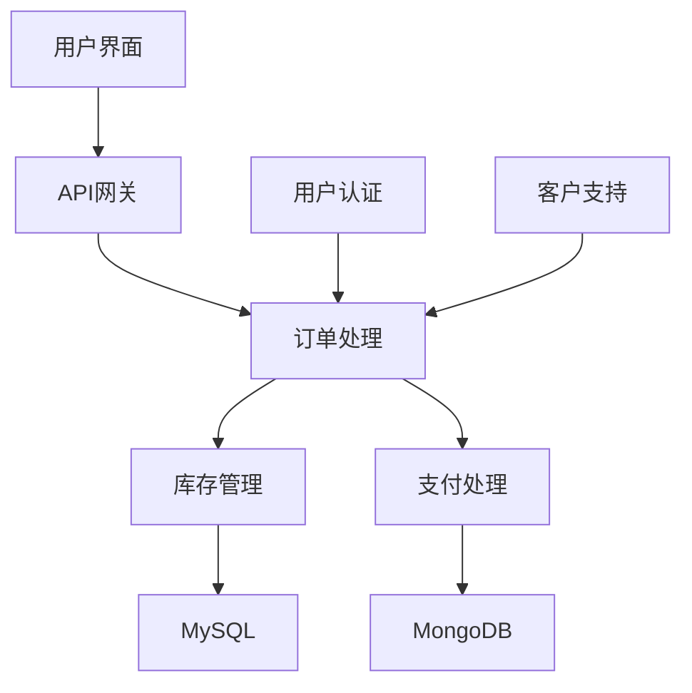
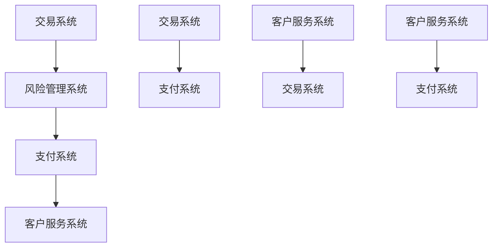
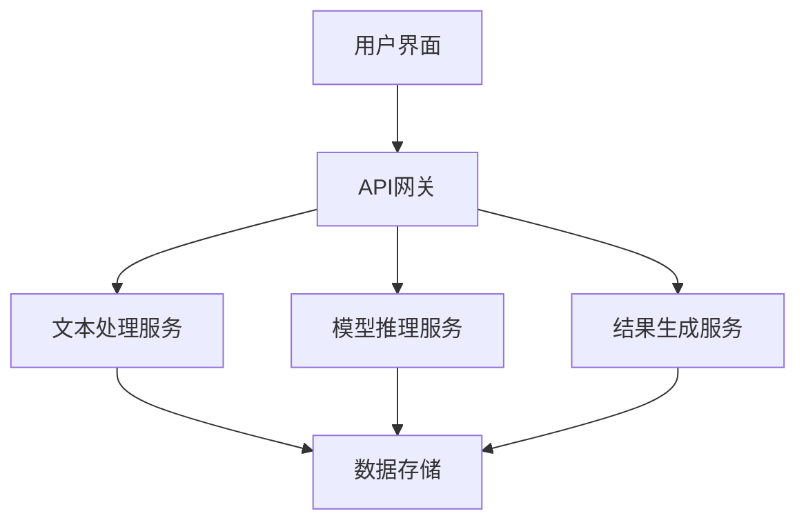

                 


### 文章标题: 服务依赖图可视化：理解LLM应用的架构复杂性

> 关键词：服务依赖图、可视化、LLM应用、架构复杂性、系统优化

> 摘要：本文将探讨服务依赖图可视化在理解大型分布式系统，特别是大型语言模型（LLM）应用架构复杂性方面的应用。通过介绍服务依赖图的基础概念、可视化技术，以及LLM应用的架构设计，本文将帮助读者理解如何通过可视化手段优化系统性能和稳定性。

---

#### 第1章: 服务依赖图可视化概述

**1.1 服务依赖图可视化的重要性**

在当今高度分布式和复杂的应用系统中，服务依赖关系的管理变得至关重要。服务依赖图可视化作为一种工具，可以帮助开发人员和运维团队更好地理解系统中的服务如何相互依赖，从而优化系统性能和稳定性。

**1.2 服务依赖图的基础概念**

服务依赖图是一种图结构，其中节点代表服务，边表示服务之间的依赖关系。节点可以是应用程序、数据库或其他系统组件。边可以是双向的，表示服务之间的依赖可以是双向的。

**1.3 服务依赖图的可视化工具**

以下是几种常用的服务依赖图可视化工具：

- **Grafana**: 一个开源的可视化平台，可以连接各种数据源，包括 Prometheus，用于创建服务依赖图。
- **Kibana**: Elastic Stack 的一个组件，提供了强大的数据可视化和数据分析功能，包括服务依赖图。
- **ServiceMap**: 一个专门用于可视化服务依赖关系的工具。

---

#### 第2章: 服务依赖图的构建

**2.1 服务依赖图的构建方法**

构建服务依赖图的第一步是收集服务之间的依赖信息。这可以通过监控工具、日志分析或手动配置来完成。

**2.2 服务依赖图的存储**

服务依赖图可以存储在多种数据结构中，包括图数据库、关系数据库或键值存储。

**2.3 服务依赖图的更新**

服务依赖图需要定期更新，以反映系统中的变化。这可以通过自动化脚本来实现，例如使用 Prometheus 的`scrape`功能。

---

#### 第3章: 服务依赖图可视化技术

**3.1 可视化库与框架**

- **D3.js**: 一个强大的可视化库，用于创建交互式的服务依赖图。
- **Sigma.js**: 一个轻量级的图可视化库，专门用于创建大规模图的可视化。

**3.2 可视化设计原则**

- **层次结构**: 确保服务依赖图具有良好的层次结构，使用户可以轻松理解服务之间的依赖关系。
- **颜色编码**: 使用颜色编码来区分不同的服务类型或依赖级别，提高可读性。
- **交互性**: 提供交互式功能，如缩放、拖动和点击，以增强用户体验。

---

#### 第4章: 服务依赖图分析

**4.1 依赖关系分析**

通过服务依赖图，可以识别系统中的关键依赖和瓶颈。这包括确定哪些服务对系统稳定性有最大影响。

**4.2 故障影响分析**

通过服务依赖图，可以快速评估一个故障对整个系统的潜在影响。

**4.3 性能优化**

服务依赖图可以用于识别性能瓶颈和优化服务部署，以提高系统的整体性能。

---

#### 第5章: 服务依赖图可视化应用案例

**5.1 案例一：电商平台服务依赖图**

描述一个电商平台的实际应用案例，展示如何使用服务依赖图可视化平台架构。

**5.2 案例二：金融系统服务依赖图**

分析一个金融系统的服务依赖图，解释如何通过可视化来优化其性能和稳定性。

---

#### 第6章: LLAMA应用的架构复杂性

**6.1 LLAMA应用概述**

介绍LLAMA应用是什么，以及其在服务依赖图可视化中的应用。

**6.2 LLAMA应用的架构设计**

解释LLAMA应用的整体架构设计，包括前端、后端和数据存储。

**6.3 LLAMA应用的依赖关系**

详细分析LLAMA应用中的服务依赖关系，并使用Mermaid流程图进行可视化。

---

#### 第7章: 实际开发与实现

**7.1 开发环境搭建**

描述如何搭建开发环境，包括所需的软件和工具。

**7.2 数据收集与处理**

讲解如何收集和处理服务依赖数据，以及如何构建服务依赖图。

**7.3 代码实现**

提供详细的伪代码，说明如何实现服务依赖图的可视化。

**7.4 代码解读与分析**

分析代码实现，解释关键部分的功能和如何优化。

---

#### 第8章: 总结与展望

**8.1 总结**

回顾本书的主要内容和学习目标。

**8.2 展望**

探讨服务依赖图可视化未来的发展方向和潜在挑战。

---

## 附录

**附录 A: 服务依赖图可视化工具列表**

**附录 B: 代码示例**

**附录 C: 参考资料**

---

### 作者：AI天才研究院/AI Genius Institute & 禅与计算机程序设计艺术 /Zen And The Art of Computer Programming

#### 第1章: 服务依赖图可视化概述

**1.1 服务依赖图可视化的重要性**

在当今的软件工程和系统架构领域，分布式系统的复杂度日益增加，导致理解和维护这些系统变得更加困难。服务依赖图可视化作为一种强大的工具，可以帮助开发人员和运维团队能够更直观地了解系统架构，特别是大型分布式系统中各个服务之间的依赖关系。通过可视化展示服务之间的相互依赖，可以快速发现潜在的问题，优化系统性能，提高系统的稳定性和可维护性。

随着微服务架构的普及，服务的数量和种类急剧增加，传统的依赖管理方法难以应对这种复杂性。服务依赖图可视化能够将复杂的服务依赖关系以图形化的方式呈现，使得团队能够更直观地理解整个系统的结构，从而更有效地进行故障排查、性能优化和代码重构。

**1.2 服务依赖图的基础概念**

服务依赖图是一种特殊的图结构，用于表示分布式系统中各个服务之间的依赖关系。在这种图中，每个节点代表一个服务，而节点之间的边则表示服务间的依赖关系。服务可以是任何系统组件，例如应用程序、数据库、消息队列或其他中间件。

**服务依赖图的基础概念包括：**

- **节点（Node）**：代表系统中的服务或组件。每个节点都有一个唯一的标识符，用于区分不同的服务。
- **边（Edge）**：代表服务之间的依赖关系。边可以是单向的，表示一个服务依赖于另一个服务，也可以是双向的，表示服务之间存在相互依赖。
- **权重（Weight）**：表示依赖关系的强度或重要性。在某些情况下，权重可以用来帮助优化服务部署和负载均衡。

服务依赖图通常包含以下几种类型：

- **直接依赖**：直接依赖关系是指一个服务明确地依赖于另一个服务。例如，一个电商网站的前端服务可能依赖于后端的服务来处理订单。
- **间接依赖**：间接依赖关系是指一个服务通过多个中间服务间接依赖于另一个服务。例如，一个用户在登录后可能需要访问多个不同的服务才能完成交易。
- **循环依赖**：循环依赖是指服务之间存在循环依赖关系，这种关系可能导致系统启动失败或服务之间的死锁。例如，服务A依赖于服务B，而服务B又依赖于服务A。

**1.3 服务依赖图的可视化工具**

为了有效地利用服务依赖图，可视化工具变得至关重要。以下是一些常用的服务依赖图可视化工具：

- **Grafana**：Grafana是一个开源的监控和可视化平台，它可以与Prometheus等数据源集成，生成服务依赖图。通过Grafana，用户可以创建自定义的仪表板，以可视化服务依赖关系。
- **Kibana**：Kibana是Elastic Stack的一个组件，它提供了强大的数据可视化和分析功能，包括服务依赖图。用户可以使用Kibana来监控和可视化系统中的服务依赖关系。
- **ServiceMap**：ServiceMap是一个专门为服务依赖图可视化而设计的工具。它提供了直观的界面，允许用户以图形化的方式查看和编辑服务依赖关系。

这些工具不仅可以帮助团队更好地理解系统的结构，还可以在开发、测试和运维过程中提供宝贵的洞察，从而提高系统的整体质量和稳定性。

#### 第2章: 服务依赖图的构建

**2.1 服务依赖图的构建方法**

构建服务依赖图的第一步是收集服务之间的依赖信息。以下是一些常用的方法：

- **监控工具**：使用像Prometheus这样的监控工具可以自动收集服务之间的依赖关系。Prometheus通过`scrape`目标从服务中获取指标，然后通过Grafana等可视化工具将依赖关系呈现为服务依赖图。
- **日志分析**：通过分析系统日志，可以提取出服务之间的依赖关系。这种方法需要对日志格式有深入的了解，并且可能需要对日志进行预处理。
- **手动配置**：在某些情况下，服务之间的依赖关系可以通过手动配置文件来定义。这种方法虽然较为繁琐，但在某些情况下可能是最直接和最准确的。

**2.2 服务依赖图的存储**

服务依赖图通常需要存储在一个数据库中，以便在需要时进行查询和更新。以下是一些常用的存储方案：

- **图数据库**：图数据库（如Neo4j）专门用于存储和查询图结构的数据。它们提供了高效的图遍历算法和复杂的查询能力，非常适合用于存储服务依赖图。
- **关系数据库**：虽然关系数据库（如MySQL）不是专门为图结构设计的，但它们也可以用于存储服务依赖图。这种方法通常需要使用存储过程或触发器来实现复杂的依赖关系查询。
- **键值存储**：键值存储（如Redis）可以用于存储简单的服务依赖图。虽然它们不提供复杂的查询功能，但它们可以快速存储和检索依赖关系，适合用于实时监控和可视化。

**2.3 服务依赖图的更新**

服务依赖图需要定期更新，以反映系统中的变化。以下是一些常用的更新方法：

- **自动化脚本**：使用自动化脚本（如Cron作业）定期运行依赖关系收集和更新过程。这种方法可以确保依赖关系图始终是最新的。
- **事件驱动更新**：当系统中的服务发生更改时（如服务启动、停止或更新），可以触发依赖关系图的更新。这种方法可以确保依赖关系图在服务变化时迅速反映最新的依赖关系。
- **人工干预**：在某些情况下，服务依赖关系的变更可能需要人工干预。例如，当服务架构发生变化时，开发人员可能需要手动更新依赖关系图。

通过使用这些方法和工具，开发人员和运维团队能够构建和维护一个准确和最新的服务依赖图，从而确保系统的可靠性和性能。

#### 第3章: 服务依赖图可视化技术

**3.1 可视化库与框架**

在服务依赖图的可视化过程中，选择合适的库和框架至关重要。以下是一些常用的可视化库和框架：

- **D3.js**：D3.js是一个功能强大的JavaScript库，用于创建数据驱动的可视化。通过D3.js，用户可以轻松地创建复杂且交互式的服务依赖图。它提供了丰富的绘图函数和高级的布局算法，使得开发者可以自定义几乎所有的视觉元素，从而创建高度个性化的可视化效果。

- **Sigma.js**：Sigma.js是一个轻量级的JavaScript库，专门用于大规模图的可视化。它提供了高效的图渲染和交互功能，使得用户可以轻松地创建大规模服务依赖图的交互式可视化。Sigma.js支持多种图形布局和图形样式，并且可以与D3.js和其他可视化库无缝集成。

**3.2 可视化设计原则**

为了确保服务依赖图的可视化设计既直观又易于理解，以下是一些关键设计原则：

- **层次结构**：良好的层次结构能够帮助用户清晰地理解服务依赖关系。在设计可视化时，可以采用树状结构、分层布局或层次化标签，将复杂的依赖关系分解为更容易理解的部分。例如，可以将节点分层组织，其中顶层表示核心服务，下一层表示依赖于核心服务的中层服务，底层表示依赖性更低的服务。

- **颜色编码**：颜色编码是一种强大的视觉手段，可以帮助用户快速区分不同类型的服务或依赖关系。例如，可以使用不同的颜色表示服务的类型（如蓝色表示前端服务，绿色表示后端服务），或者使用颜色表示依赖关系的强度（如深色表示强依赖，浅色表示弱依赖）。此外，还可以使用颜色突出显示关键节点或边，以引导用户的注意力。

- **交互性**：交互性是提高可视化用户体验的关键因素。通过提供缩放、拖动、点击等交互功能，用户可以更深入地探索服务依赖图。例如，用户可以放大特定区域来查看更详细的信息，或者点击一个节点来查看该服务的详细信息。此外，交互性还可以用于模拟系统中的变化，如服务启动或故障，以帮助用户理解依赖关系的动态特性。

- **注释和标签**：为服务依赖图添加注释和标签可以帮助用户更好地理解每个节点和边的含义。注释可以提供额外的上下文信息，例如服务的用途或依赖关系的原因。标签可以用于标识重要的节点或边，例如关键依赖或瓶颈。这些信息可以帮助用户快速定位和识别重要的依赖关系。

通过遵循这些设计原则，开发人员可以创建既美观又实用的服务依赖图可视化，从而帮助团队更有效地理解和维护复杂的服务依赖关系。

#### 第4章: 服务依赖图分析

**4.1 依赖关系分析**

服务依赖图的核心功能之一是帮助开发人员和运维团队识别和理解系统中的依赖关系。依赖关系分析是系统设计和维护中不可或缺的一部分，它有助于识别关键依赖和潜在的风险点。

通过依赖关系分析，团队可以：

- **识别关键依赖**：关键依赖是指那些对系统稳定性影响最大的依赖关系。通过分析服务依赖图，可以确定哪些服务对系统的其他服务至关重要。例如，在一个电商平台中，订单处理服务可能是一个关键依赖，因为它影响到用户购物体验和业务流程的连续性。
- **识别潜在风险**：通过分析依赖关系，团队可以识别出潜在的风险点，例如循环依赖或过度依赖。循环依赖可能导致系统启动失败或服务之间的死锁，而过度依赖则可能使系统变得更加脆弱，一旦一个服务发生故障，整个系统可能会受到影响。
- **优化服务部署**：依赖关系分析还可以帮助团队优化服务的部署和配置。通过了解服务之间的依赖关系，可以更合理地安排服务部署的顺序，避免不必要的启动延迟或依赖问题。

**4.2 故障影响分析**

服务依赖图在故障影响分析中也发挥着重要作用。通过服务依赖图，团队可以快速评估一个故障对整个系统的潜在影响，从而采取相应的措施来缓解或消除影响。

故障影响分析包括：

- **故障传播分析**：通过分析服务依赖图，可以确定一个故障如何传播到其他服务。例如，如果订单处理服务发生故障，可能会导致库存管理服务和客户支持服务也受到影响。
- **风险优先级排序**：通过评估故障的影响范围和严重性，团队可以确定哪些故障需要优先处理。这有助于团队集中资源和精力解决最关键的问题，确保系统的关键功能得到保障。

**4.3 性能优化**

服务依赖图不仅有助于故障排查和影响分析，还可以用于性能优化。通过分析服务依赖关系，团队可以发现系统中的性能瓶颈和资源利用率问题。

性能优化包括：

- **负载均衡**：通过分析服务依赖图，可以识别哪些服务可能成为性能瓶颈。例如，如果订单处理服务处理速度较慢，可能会影响整个电商平台的响应时间。通过合理的负载均衡策略，可以分散流量，减轻瓶颈服务的工作负载。
- **服务拆分与聚合**：在某些情况下，通过重新设计服务依赖关系，可以优化系统的性能。例如，将一个大型服务拆分为多个小型服务，可以使系统更加模块化和灵活，从而提高整体性能。

通过综合使用依赖关系分析、故障影响分析和性能优化，服务依赖图成为开发人员和运维团队在维护和管理复杂分布式系统中的宝贵工具。

#### 第5章: 服务依赖图可视化应用案例

**5.1 案例一：电商平台服务依赖图**

电商平台是一个复杂的分布式系统，包含多个相互依赖的服务。通过服务依赖图可视化，团队可以更直观地理解其系统架构，从而优化服务部署和性能。

**架构描述**：

- **前端服务**：包括用户界面、API网关和静态资源服务器。
- **后端服务**：包括订单处理、库存管理、支付处理、用户认证和客户支持。
- **数据存储**：包括关系型数据库（如MySQL）和NoSQL数据库（如MongoDB）。

**依赖关系**：

- **前端服务依赖于后端服务**：用户在电商平台上的操作（如购物、支付）需要后端服务的支持。
- **订单处理依赖于库存管理和支付处理**：在用户下单后，系统需要检查库存并处理支付。
- **用户认证和客户支持依赖于订单处理和库存管理**：用户在遇到问题时需要查看订单和库存状态。

**可视化示例**：



**优化**：

- **负载均衡**：通过对订单处理服务进行负载均衡，可以避免单个服务成为性能瓶颈。
- **服务拆分**：将大型服务（如订单处理）拆分为更小的服务（如订单生成、订单确认等），可以提高系统的灵活性和可维护性。

**5.2 案例二：金融系统服务依赖图**

金融系统是一个高度分布式和复杂的系统，包括多个关键服务，如交易系统、风险管理系统、支付处理系统和客户服务系统。

**架构描述**：

- **交易系统**：处理股票交易、基金交易等。
- **风险管理系统**：监控和管理交易风险。
- **支付系统**：处理支付和结算。
- **客户服务系统**：提供客户支持。

**依赖关系**：

- **交易系统依赖于风险管理系统**：交易前需要进行风险评估。
- **支付系统依赖于交易系统**：交易完成后，需要处理支付。
- **客户服务系统依赖于交易系统和支付系统**：为客户提供交易和支付状态查询。

**可视化示例**：



**优化**：

- **高可用性**：确保关键服务（如交易系统和支付系统）具有高可用性，以避免单点故障。
- **故障隔离**：通过服务依赖图，可以识别并隔离潜在故障点，从而减少故障传播范围。

通过这两个案例，可以看到服务依赖图可视化在理解和优化复杂系统架构方面的重要作用。

#### 第6章: LLAMA应用的架构复杂性

**6.1 LLAMA应用概述**

LLAMA（Large Language Model Application）是一种大型语言模型应用，旨在提供自然语言处理（NLP）功能，如文本生成、情感分析和翻译。LLAMA应用通常由多个服务组成，这些服务共同协作以提供完整的NLP功能。

**架构设计**：

LLAMA应用的整体架构设计可以分为前端、后端和数据存储三个主要部分。

- **前端**：负责与用户交互，提供用户界面和API接口。前端服务包括用户界面（UI）和API网关。
- **后端**：实现NLP功能的核心逻辑，包括文本生成、情感分析和翻译等。后端服务包括文本处理、模型推理和结果生成。
- **数据存储**：存储模型数据和用户数据，包括关系型数据库（如MySQL）和NoSQL数据库（如MongoDB）。

**依赖关系**：

LLAMA应用中的服务依赖关系较为复杂，以下是主要依赖关系：

- **前端服务依赖于后端服务**：用户通过前端提交请求，后端服务处理请求并返回结果。
- **后端服务依赖于数据存储**：后端服务需要访问数据库来获取模型数据和用户数据。
- **文本处理服务依赖于模型推理服务**：文本处理服务将输入文本发送给模型推理服务，模型推理服务进行NLP任务处理。
- **结果生成服务依赖于文本处理和模型推理服务**：结果生成服务将模型推理结果转换为用户可理解的格式，并返回给前端。

**6.2 LLAMA应用的架构设计**

LLAMA应用的整体架构设计采用了微服务架构，以实现高可扩展性和高可靠性。

- **前端**：前端服务分为两部分，一部分是静态资源服务器，用于提供用户界面和静态资源（如HTML、CSS和JavaScript文件）；另一部分是API网关，用于接收用户请求并转发到后端服务。
- **后端**：后端服务包括多个微服务，每个微服务负责一个特定的功能模块。例如，文本处理服务、模型推理服务和结果生成服务。这些微服务通过RESTful API进行通信。
- **数据存储**：数据存储分为两部分，一部分是模型数据存储，用于存储预训练模型和数据集；另一部分是用户数据存储，用于存储用户数据和会话信息。

**6.3 LLAMA应用的依赖关系**

LLAMA应用中的服务依赖关系可以通过Mermaid流程图进行可视化，以下是一个简化的依赖关系图：



在这个依赖关系图中，用户界面通过API网关与服务进行通信。文本处理服务、模型推理服务和结果生成服务分别处理不同的任务，并共同依赖于数据存储服务。

通过这个架构设计和依赖关系图，我们可以更清晰地理解LLAMA应用的整体结构和各个服务之间的交互关系，从而更好地进行开发和维护。

#### 第7章: 实际开发与实现

**7.1 开发环境搭建**

搭建服务依赖图可视化开发环境的第一步是选择合适的技术栈和工具。以下是一个典型的开发环境搭建流程：

1. **安装Node.js**：Node.js是一个基于Chrome V8引擎的JavaScript运行时环境，用于运行JavaScript代码。可以从[Node.js官方网站](https://nodejs.org/)下载并安装。

2. **安装Docker**：Docker是一个容器化平台，用于构建、运行和部署应用程序。可以从[Docker官方网站](https://www.docker.com/products/docker-desktop)下载并安装Docker Desktop。

3. **安装可视化库**：选择一个可视化库，例如D3.js或Sigma.js，并按照其官方文档安装。例如，使用npm命令安装D3.js：

   ```bash
   npm install d3
   ```

4. **配置数据库**：选择一个数据库，例如Neo4j或MySQL，并按照其官方文档配置。Neo4j可以使用Docker容器快速部署，而MySQL则需要安装并配置数据库实例。

5. **安装开发工具**：安装一个代码编辑器，例如Visual Studio Code，以及一个终端工具，例如Terminator。

**7.2 数据收集与处理**

数据收集与处理是构建服务依赖图的关键步骤。以下是一个简化的数据处理流程：

1. **定义数据源**：确定数据源，例如系统日志、监控指标或配置文件。这些数据源可以包含服务依赖信息，如服务名称、依赖关系和权重。

2. **数据收集**：使用适当的工具（如Logstash、Prometheus）从数据源收集依赖信息。对于日志数据，可以使用Logstash将日志文件解析并转换为结构化数据。

3. **数据处理**：使用数据处理工具（如Kafka、Fluentd）将收集到的数据转换为适合存储和查询的格式。对于服务依赖图，可以使用JSON或CSV格式。

4. **数据存储**：将处理后的数据存储在数据库中，例如Neo4j或MySQL。使用图数据库可以更高效地存储和查询服务依赖关系。

**7.3 代码实现**

实现服务依赖图可视化需要编写代码来处理数据和渲染图形。以下是一个简单的代码示例，使用D3.js创建一个基本的服务依赖图：

```javascript
// 引入D3.js库
const d3 = require('d3');

// 定义数据
const data = {
  nodes: [
    { id: 'A', name: '服务A' },
    { id: 'B', name: '服务B' },
    { id: 'C', name: '服务C' }
  ],
  edges: [
    { source: 'A', target: 'B', weight: 1 },
    { source: 'B', target: 'C', weight: 1 }
  ]
};

// 创建SVG画布
const width = 800;
const height = 600;
const svg = d3.select('body').append('svg')
  .attr('width', width)
  .attr('height', height);

// 创建节点
const nodes = svg.selectAll('.node')
  .data(data.nodes)
  .enter().append('circle')
  .classed('node', true)
  .attr('cx', (d, i) => i * 100 + 50)
  .attr('cy', 50)
  .attr('r', 20);

// 创建边
const edges = svg.selectAll('.link')
  .data(data.edges)
  .enter().append('line')
  .classed('link', true)
  .attr('x1', d => d.source.x)
  .attr('y1', d => d.source.y)
  .attr('x2', d => d.target.x)
  .attr('y2', d => d.target.y);

// 添加节点标签
nodes.append('text')
  .attr('x', d => d.x - 10)
  .attr('y', d => d.y + 15)
  .text(d => d.name);

// 添加边标签
edges.append('text')
  .attr('x', d => (d.source.x + d.target.x) / 2 - 5)
  .attr('y', d => (d.source.y + d.target.y) / 2 + 5)
  .text(d => d.weight);
```

这个示例创建了一个简单的服务依赖图，包含三个节点和两条边。通过扩展这个示例，可以添加更多的节点和边，并实现交互性功能。

**7.4 代码解读与分析**

上述代码示例使用D3.js创建了一个基本的服务依赖图。以下是代码的详细解读：

1. **引入D3.js库**：首先引入D3.js库，这是创建数据可视化的重要工具。

2. **定义数据**：定义服务依赖图的数据结构，包括节点和边。节点包含ID、名称和位置，边包含源节点、目标节点和权重。

3. **创建SVG画布**：使用D3.js创建一个SVG画布，设置画布的宽度和高度。

4. **创建节点**：使用D3.js的`selectAll`方法选择所有节点，然后使用`enter`方法添加新的节点。每个节点使用一个圆形表示，并设置位置和半径。

5. **创建边**：使用D3.js的`selectAll`方法选择所有边，然后使用`enter`方法添加新的边。边使用线条表示，并设置起点和终点的位置。

6. **添加节点标签**：在每个节点上添加文本标签，显示节点的名称。

7. **添加边标签**：在每个边上添加文本标签，显示边的权重。

通过这个示例，我们可以理解如何使用D3.js创建基本的服务依赖图。在实际开发中，可以进一步扩展这个示例，添加交互性功能、颜色编码和层次结构，以创建更复杂和更具实用性的服务依赖图可视化。

#### 第8章: 总结与展望

**8.1 总结**

本文介绍了服务依赖图可视化在理解大型分布式系统，特别是大型语言模型（LLM）应用架构复杂性方面的应用。通过详细介绍服务依赖图的基础概念、构建方法、可视化技术和分析应用，本文帮助读者理解了如何利用服务依赖图优化系统性能和稳定性。此外，通过实际案例和LLAMA应用的架构分析，本文展示了服务依赖图可视化的实际应用场景和实现方法。

**8.2 展望**

服务依赖图可视化未来的发展方向包括：

1. **智能化**：结合人工智能和机器学习技术，提高服务依赖图的自动化构建和优化能力。
2. **交互性增强**：进一步改进可视化交互体验，如实时更新、自定义视图和交互式探索。
3. **多维度分析**：扩展服务依赖图的可视化功能，支持多维度数据分析和可视化，如性能指标、日志数据和监控数据。
4. **标准化**：制定服务依赖图可视化的标准和规范，促进工具的兼容性和互操作性。

潜在挑战包括：

1. **数据复杂性**：随着系统规模的扩大，服务依赖关系和数据量将显著增加，处理和存储这些数据将成为挑战。
2. **性能优化**：如何高效地渲染大规模服务依赖图，同时保持良好的性能和响应速度。
3. **安全性**：保护服务依赖图中的敏感信息，防止数据泄露和未授权访问。

通过不断探索和创新，服务依赖图可视化将在未来继续发挥重要作用，为分布式系统的开发和运维提供强大的支持。

### 附录

**附录 A: 服务依赖图可视化工具列表**

- **Grafana**：一个开源的可视化平台，可以连接各种数据源，包括 Prometheus，用于创建服务依赖图。
- **Kibana**：Elastic Stack 的一个组件，提供了强大的数据可视化和数据分析功能，包括服务依赖图。
- **ServiceMap**：一个专门用于可视化服务依赖关系的工具。
- **D3.js**：一个强大的可视化库，用于创建数据驱动的可视化。
- **Sigma.js**：一个轻量级的图可视化库，专门用于创建大规模图的可视化。

**附录 B: 代码示例**

以下是一个使用D3.js创建基本服务依赖图的代码示例：

```javascript
// 引入D3.js库
const d3 = require('d3');

// 定义数据
const data = {
  nodes: [
    { id: 'A', name: '服务A' },
    { id: 'B', name: '服务B' },
    { id: 'C', name: '服务C' }
  ],
  edges: [
    { source: 'A', target: 'B', weight: 1 },
    { source: 'B', target: 'C', weight: 1 }
  ]
};

// 创建SVG画布
const width = 800;
const height = 600;
const svg = d3.select('body').append('svg')
  .attr('width', width)
  .attr('height', height);

// 创建节点
const nodes = svg.selectAll('.node')
  .data(data.nodes)
  .enter().append('circle')
  .classed('node', true)
  .attr('cx', (d, i) => i * 100 + 50)
  .attr('cy', 50)
  .attr('r', 20);

// 创建边
const edges = svg.selectAll('.link')
  .data(data.edges)
  .enter().append('line')
  .classed('link', true)
  .attr('x1', d => d.source.x)
  .attr('y1', d => d.source.y)
  .attr('x2', d => d.target.x)
  .attr('y2', d => d.target.y);

// 添加节点标签
nodes.append('text')
  .attr('x', d => d.x - 10)
  .attr('y', d => d.y + 15)
  .text(d => d.name);

// 添加边标签
edges.append('text')
  .attr('x', d => (d.source.x + d.target.x) / 2 - 5)
  .attr('y', d => (d.source.y + d.target.y) / 2 + 5)
  .text(d => d.weight);
```

**附录 C: 参考资料**

- **Grafana官方文档**：[https://grafana.com/docs/grafana/latest/](https://grafana.com/docs/grafana/latest/)
- **Kibana官方文档**：[https://www.elastic.co/guide/en/kibana/current/kibana.html](https://www.elastic.co/guide/en/kibana/current/kibana.html)
- **D3.js官方文档**：[https://d3js.org/](https://d3js.org/)
- **Sigma.js官方文档**：[https://sigma.js.org/](https://sigma.js.org/)
- **Neo4j官方文档**：[https://neo4j.com/docs/stable/](https://neo4j.com/docs/stable/)
- **MySQL官方文档**：[https://dev.mysql.com/doc/](https://dev.mysql.com/doc/)

