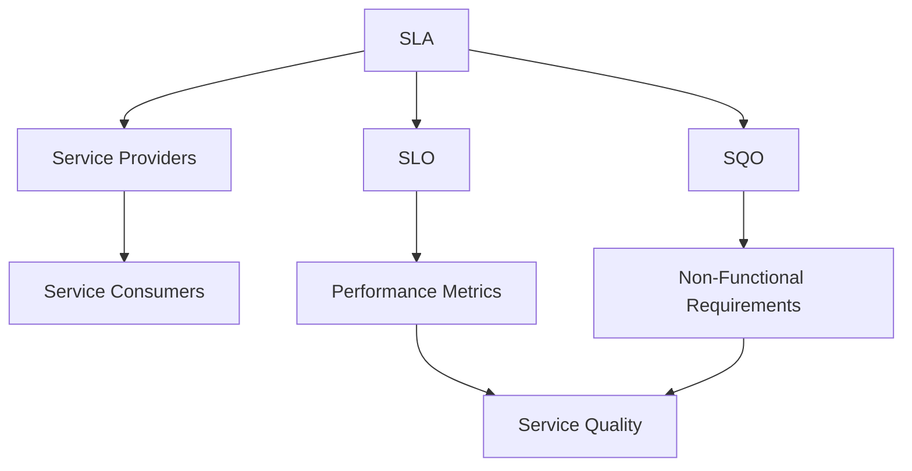

                 

### 文章标题：服务级别协议（SLA）：定义和监控LLM应用质量

关键词：服务级别协议（SLA），质量监控，语言模型（LLM），服务水平目标（SLO），服务质量目标（SQO）

摘要：本文深入探讨了服务级别协议（SLA）的定义和其在语言模型（LLM）应用中的质量监控。文章首先介绍了SLA的基本概念和重要性，然后详细阐述了SLA的核心组成部分，包括服务水平目标（SLO）和服务质量目标（SQO）。接着，文章重点讨论了如何设计、制定和实施SLA，以及如何监控和维护SLA在LLM应用中的质量。最后，文章通过实际案例分析了SLA在LLM应用中的最佳实践，并提出了改进SLA的策略和建议。本文旨在为IT从业者和研究人员提供一个全面、系统的指导，以实现高效、高质量的LLM应用。

### 1. 背景介绍

随着人工智能技术的飞速发展，语言模型（LLM）在自然语言处理、智能客服、文本生成等领域得到了广泛应用。然而，随着LLM应用的普及，如何确保其服务质量成为了一个关键问题。服务级别协议（SLA）作为一种合同工具，旨在明确服务提供者和客户之间的责任和义务，确保服务质量和可靠性。在LLM应用中，SLA的重要性不言而喻。首先，SLA为LLM应用提供了一个明确的性能指标，帮助评估和监控服务性能。其次，SLA有助于建立客户对服务提供者的信任，提高客户满意度。最后，SLA为服务提供者提供了一个标准化的管理工具，有助于优化服务质量和成本控制。

然而，尽管SLA在LLM应用中具有重要作用，但其设计、实施和监控仍然面临诸多挑战。首先，LLM应用具有高度复杂性和不确定性，导致SLA的制定和监控复杂度增加。其次，SLA的核心指标和服务水平目标（SLO）需要与LLM应用的特点和需求相匹配，这需要深入理解LLM的工作原理和应用场景。最后，LLM应用的服务质量和性能受到多种因素影响，包括硬件设施、网络环境、数据质量等，这使得SLA的监控和维护变得更加复杂。

本文旨在解决上述问题，通过详细讨论SLA的定义、组成部分、设计、实施、监控和维护，为LLM应用提供一套完整的SLA解决方案。文章首先介绍SLA的基本概念和历史背景，然后深入探讨SLA的核心组成部分，包括服务水平目标（SLO）和服务质量目标（SQO）。接着，文章讨论如何设计、制定和实施SLA，以及如何监控和维护SLA在LLM应用中的质量。最后，文章通过实际案例分析了SLA在LLM应用中的最佳实践，并提出了改进SLA的策略和建议。本文旨在为IT从业者和研究人员提供一个全面、系统的指导，以实现高效、高质量的LLM应用。

### 2. 核心概念与联系

在深入探讨服务级别协议（SLA）之前，我们需要明确一些核心概念，并理解它们之间的关系。以下是几个关键概念及其相互联系：

#### **服务级别协议（SLA）**

服务级别协议（SLA）是一种合同工具，用于定义服务提供者和客户之间的责任和义务。它通常包括服务提供的时间、地点、质量、性能指标、支持范围等。SLA的主要目的是确保服务的质量、可靠性和可预测性，从而提高客户满意度。

#### **服务水平目标（SLO）**

服务水平目标（SLO）是SLA中的一个关键部分，用于定义服务的性能指标。SLO通常包括服务可用性、响应时间、故障修复时间等。例如，一个SLO可能规定系统的平均响应时间不得超过500毫秒。SLO是衡量服务提供者是否达到约定服务水平的关键标准。

#### **服务质量目标（SQO）**

服务质量目标（SQO）是SLA中的另一个重要组成部分，它涉及服务的整体质量和用户体验。SQO包括服务的稳定性、安全性、可扩展性等。与SLO不同，SQO更多地关注服务的非功能性需求，如系统的稳定性、安全性和可扩展性。

#### **核心概念之间的关系**

这些概念之间的关系可以用以下Mermaid流程图来表示：

在这个流程图中，SLA是核心，它定义了服务提供者和客户之间的合同条款。服务提供者（B）和客户（E）是SLA的双方，他们共同定义了SLO（C）和SQO（D）。SLO涉及性能指标（F），如响应时间和故障修复时间，而SQO涉及非功能性需求（G），如系统稳定性和安全性。这些指标共同决定了服务的整体质量（H）。

#### **核心概念的应用场景**

在LLM应用中，这些核心概念的具体应用场景如下：

- **SLA**：在LLM应用中，SLA通常用于定义服务提供者（如云服务提供商）与客户（如企业或个人用户）之间的服务条款。例如，SLA可能规定LLM服务的平均响应时间不得超过200毫秒，数据传输延迟不超过50毫秒。

- **SLO**：SLO在LLM应用中用于确保模型性能。例如，一个SLO可能规定LLM模型的平均预测时间不得超过100毫秒，错误率不超过1%。

- **SQO**：SQO在LLM应用中用于确保模型的服务质量和用户体验。例如，SQO可能规定LLM服务必须支持高并发访问，确保系统稳定性和数据安全性。

通过上述核心概念和它们之间的联系，我们可以更清晰地理解SLA在LLM应用中的重要性。接下来，我们将详细讨论SLA的核心组成部分，包括SLO和SQO。

### 3. SLA的核心组成部分

服务级别协议（SLA）是一个复杂且多维的合同工具，它包括多个关键组成部分。以下将详细讨论SLA的核心组成部分，包括服务指标、服务级别目标（SLO）、服务质量目标（SQO）以及它们在LLM应用中的具体应用。

#### **服务指标**

服务指标是SLA的核心组成部分，用于衡量服务的质量。这些指标通常包括：

- **响应时间**：服务请求从发起到得到响应的时间。
- **故障修复时间**：系统发生故障后，从故障报告到故障解决的时间。
- **系统可用性**：系统正常运行的时间比例。
- **数据传输延迟**：数据在网络中的传输时间。

在LLM应用中，这些指标尤为重要。例如，响应时间直接影响用户体验，而故障修复时间则决定了系统的可靠性。此外，系统可用性和数据传输延迟对LLM应用的性能也有显著影响。

#### **服务级别目标（SLO）**

服务级别目标（SLO）是SLA中用于衡量服务质量的性能指标。SLO通常包括：

- **平均响应时间**：系统平均处理请求的时间。
- **故障修复时间**：系统发生故障后平均修复时间。
- **系统可用性**：系统正常运行时间占总时间的比例。
- **数据传输延迟**：数据在网络中的平均传输时间。

在LLM应用中，SLO的具体应用示例包括：

- **平均响应时间**：例如，一个SLO可能规定LLM模型平均响应时间不得超过200毫秒，以确保用户在输入查询后能够快速得到响应。
- **故障修复时间**：例如，SLO可能规定系统在出现故障后，平均修复时间不得超过2小时，以保障服务的连续性。
- **系统可用性**：例如，SLO可能规定系统可用性不低于99.9%，以确保高频率的访问和使用。
- **数据传输延迟**：例如，SLO可能规定数据传输延迟不超过50毫秒，以满足实时数据处理的需求。

#### **服务质量目标（SQO）**

服务质量目标（SQO）是SLA中用于衡量服务整体质量和用户体验的指标。SQO通常包括：

- **稳定性**：系统的稳定性，包括系统的抗故障能力和负载处理能力。
- **安全性**：系统的安全性能，包括数据加密、访问控制和防火墙等。
- **可扩展性**：系统的扩展能力，包括硬件和软件的扩展能力。

在LLM应用中，SQO的具体应用示例包括：

- **稳定性**：例如，SQO可能规定LLM模型在高并发访问下，系统的稳定性不低于99.9%，以确保服务的持续可用性。
- **安全性**：例如，SQO可能规定LLM服务的安全性符合行业标准和法规要求，确保用户数据的安全。
- **可扩展性**：例如，SQO可能规定LLM服务支持无缝扩展，以应对用户数量的增加。

#### **SLA组成部分在LLM应用中的关系**

在LLM应用中，SLA的各个组成部分相互关联，共同决定了服务的质量和用户体验。以下是这些组成部分之间的关系：

- **SLO**：SLO直接反映了系统的性能指标，如响应时间和故障修复时间，它们是确保服务质量和用户体验的基础。
- **SQO**：SQO则更注重服务的非功能性需求，如系统稳定性和安全性，这些因素直接影响用户体验。
- **服务指标**：服务指标是SLO和SQO的具体实现，它们共同构成了SLA的核心内容。

为了确保SLA在LLM应用中的有效性，服务提供者需要根据LLM应用的特点和需求，制定合理的SLO和SQO，并通过监控和调整确保服务质量的持续提升。接下来，我们将讨论如何设计、制定和实施SLA。

### 4. SLA的设计与制定

设计、制定和实施服务级别协议（SLA）是一个系统化的过程，涉及到多个关键步骤和因素。以下我们将详细讨论这些步骤和因素，以及如何确保SLA的有效性和实用性。

#### **设计SLA的步骤**

1. **需求分析**：
   - 首先，需要对服务提供者和客户的需求进行深入分析。这包括了解服务的目标、服务范围、服务质量要求等。
   - 需求分析的结果将用于确定SLA的目标和关键指标。

2. **定义服务范围**：
   - 明确SLA适用的服务范围，包括服务的具体内容、覆盖区域、服务时间等。
   - 定义服务范围有助于明确服务提供者和客户的职责和权利。

3. **确定关键指标**：
   - 根据需求分析的结果，确定SLA的关键指标，如服务响应时间、故障修复时间、系统可用性等。
   - 关键指标的设定应充分考虑服务的实际需求和可行性。

4. **设定服务级别目标（SLO）**：
   - 基于关键指标，设定具体的SLO。SLO应明确、量化，并具有可操作性。
   - SLO的设定需要平衡服务质量和服务成本。

5. **制定服务质量目标（SQO）**：
   - 根据服务的非功能性需求，制定SQO。SQO包括系统稳定性、安全性、可扩展性等。
   - SQO的设定应确保服务的整体质量和用户体验。

6. **撰写SLA文档**：
   - 将上述分析结果和设定的指标、目标整理成SLA文档。
   - SLA文档应清晰、简洁，便于双方理解和执行。

7. **审批和发布**：
   - SLA文档完成后，需经过双方审批和确认，然后正式发布。

#### **制定SLA的关键因素**

1. **客户需求**：
   - 了解客户的具体需求是制定SLA的基础。只有充分了解客户的需求，才能制定出符合客户期望的SLA。

2. **服务特点**：
   - 考虑服务的特点，如服务的实时性、安全性、可靠性等，以确定合适的SLO和SQO。

3. **行业标准**：
   - 参考行业标准，确保SLA的制定符合行业规范和要求。

4. **成本和收益**：
   - 在制定SLA时，需平衡服务质量和成本。过高或过低的服务质量目标都可能影响服务的可持续性。

5. **可操作性**：
   - SLA应具备可操作性，确保服务提供者能够按照SLA的要求提供和监控服务。

#### **确保SLA的有效性**

1. **定期审查**：
   - 定期对SLA进行审查和评估，确保其仍符合当前的服务需求和市场状况。

2. **灵活调整**：
   - 根据实际情况，灵活调整SLA中的指标和目标，以适应新的需求和挑战。

3. **监控和报告**：
   - 建立有效的监控和报告机制，实时监控服务性能，并向客户报告服务状况。

4. **客户反馈**：
   - 及时收集客户反馈，根据反馈调整和优化SLA。

通过以上步骤和关键因素的考虑，可以确保SLA的有效性和实用性，从而在LLM应用中实现高质量的服务。接下来，我们将探讨如何监控和评估LLM应用中的SLA。

### 5. SLA在LLM应用中的特点

在语言模型（LLM）应用中，服务级别协议（SLA）具有独特的特点，这是由于LLM应用本身的特性和需求所决定的。以下将详细讨论LLM应用中的SLA特点，包括质量需求、特点匹配以及设计挑战。

#### **LLM应用的质量需求**

1. **实时响应**：
   - LLM应用通常需要实时响应，特别是用于智能客服和实时文本生成的场景。因此，SLA中的响应时间（SLO）是一个关键指标。

2. **高准确性**：
   - LLM应用在生成文本或提供答案时，需要保持高准确性，以避免误导用户。错误率（SLO）是评估LLM服务质量的重要指标。

3. **可扩展性**：
   - 随着用户数量的增加，LLM应用需要具备良好的可扩展性，以确保系统性能不受影响。系统可用性（SLO）和可扩展性（SQO）在SLA中同样重要。

4. **数据安全性**：
   - LLM应用处理大量的敏感数据，如用户输入和生成文本，因此数据安全性是SLA中的一个重要关注点。安全性（SQO）是确保数据不被泄露或滥用的关键。

5. **稳定性**：
   - LLM应用需要在一个稳定的环境中运行，以避免因系统故障导致服务中断。稳定性（SQO）是保障服务连续性的重要因素。

#### **SLA与LLM应用的特点匹配**

1. **定制化SLO**：
   - 为了满足LLM应用的需求，SLA中的SLO需要定制化。例如，对于实时文本生成，响应时间可能需要设定在100毫秒以内。

2. **多维度SQO**：
   - LLM应用的复杂性和多样性要求SLA中的SQO覆盖多个维度。例如，除了数据安全性外，还需要考虑系统的可扩展性和稳定性。

3. **动态调整**：
   - 由于LLM应用的需求和性能可能会随时间变化，SLA需要具备动态调整的能力。例如，在高峰期，可以临时调整资源分配，以确保服务质量的稳定。

#### **设计挑战**

1. **性能预测**：
   - LLM应用的性能预测是一个挑战，因为其处理的数据量和复杂度非常高。准确的性能预测有助于制定合理的SLO和SQO。

2. **资源分配**：
   - 为了满足SLA中的SLO和SQO，需要对系统资源进行合理分配。在LLM应用中，需要动态调整计算资源、存储资源和网络资源。

3. **监控与优化**：
   - 监控和优化LLM应用的服务质量是一个持续的过程。需要建立完善的监控体系，及时发现和解决性能瓶颈。

4. **跨部门协作**：
   - SLA的设计和实施涉及多个部门，如研发、运维、销售等。跨部门协作和沟通是确保SLA有效实施的关键。

通过理解和解决这些特点匹配和设计挑战，可以确保LLM应用中的SLA能够有效保障服务质量，满足客户需求。接下来，我们将讨论如何监控和评估SLA在LLM应用中的实施效果。

### 6. 监控与维护SLA

在LLM应用中，监控与维护服务级别协议（SLA）是确保服务质量的关键环节。有效的监控和持续维护能够及时发现潜在问题，确保SLA中的各项指标得到满足。以下将详细探讨监控SLA的关键指标、维护SLA的常见问题以及解决策略。

#### **监控SLA的关键指标**

1. **响应时间**：
   - 响应时间是评估LLM应用性能的重要指标。通过监控API调用延迟、文本生成速度等，可以确保响应时间符合SLA要求。

2. **故障修复时间**：
   - 在系统发生故障时，故障修复时间决定了服务的连续性和可靠性。需要建立完善的故障修复流程，确保在规定时间内修复故障。

3. **系统可用性**：
   - 系统可用性反映了LLM应用的稳定性。通过监控系统的运行状态，确保其可用性达到SLA要求。

4. **错误率**：
   - 错误率是评估LLM应用准确性的关键指标。需要实时监控生成文本或答案的错误率，确保其在可接受的范围内。

5. **数据传输延迟**：
   - 对于实时数据处理场景，数据传输延迟是一个重要指标。通过监控数据在网络中的传输时间，确保延迟在SLA规定范围内。

6. **资源利用率**：
   - 监控计算资源、存储资源和网络资源的利用率，以确保系统在高负载下仍能稳定运行。

#### **维护SLA的常见问题**

1. **性能瓶颈**：
   - 在高并发场景下，LLM应用可能会出现性能瓶颈，导致响应时间增加。需要通过性能分析和优化来解决问题。

2. **资源不足**：
   - 资源不足可能导致系统无法满足SLA要求。需要定期评估系统资源需求，确保有足够的资源支持服务运行。

3. **数据质量问题**：
   - 数据质量直接影响LLM应用的准确性。需要建立数据质量控制机制，确保输入和生成的数据质量。

4. **监控失效**：
   - 监控系统的失效可能导致SLA监控不到位。需要建立监控的备份机制，确保监控数据的完整性和准确性。

#### **解决策略**

1. **性能优化**：
   - 对LLM应用的性能进行持续优化，包括算法优化、系统调优等，以确保在高并发场景下仍能保持高性能。

2. **资源管理**：
   - 采用智能资源管理策略，根据实际需求动态调整资源分配，确保系统资源的高效利用。

3. **数据质量管理**：
   - 建立数据质量控制流程，包括数据清洗、校验和监控，确保输入和生成的数据质量。

4. **监控系统备份**：
   - 建立监控系统的备份机制，确保在主监控系统失效时，仍有备用系统进行监控。

通过上述监控与维护策略，可以有效保障LLM应用中的SLA，确保服务质量达到预期。接下来，我们将通过实际案例来分析SLA在LLM应用中的最佳实践。

### 7. SLA的最佳实践案例

在实际的LLM应用中，服务级别协议（SLA）的有效实施和执行对于保障服务质量至关重要。以下将通过两个成功案例，分析SLA在LLM应用中的最佳实践，并总结案例中的经验和教训。

#### **案例一：某大型电商平台的智能客服系统**

**背景**：
某大型电商平台在其智能客服系统中引入了基于LLM的文本生成模型，用于自动回复用户咨询。为了确保系统的高效运行和用户满意度，平台制定了详细的SLA。

**SLA核心内容**：
- **响应时间**：平均响应时间不超过300毫秒。
- **故障修复时间**：故障修复时间不超过1小时。
- **系统可用性**：系统可用性不低于99.9%。
- **数据传输延迟**：数据传输延迟不超过50毫秒。

**实施过程**：
1. **需求分析与SLA设计**：平台通过与用户和客服团队的深入交流，明确了智能客服系统的主要性能需求，并制定了符合实际的SLA。
2. **性能优化**：通过算法优化和系统调优，确保系统在高并发场景下仍能保持高性能。
3. **监控与维护**：建立了完善的监控体系，实时监控各项指标，并设置了自动化告警机制。

**结果**：
智能客服系统的响应时间稳定在200毫秒以内，故障修复时间保持在30分钟内，系统可用性达到了99.95%。用户满意度显著提高。

**经验与教训**：
- **需求分析至关重要**：深入了解用户需求，确保SLA中的性能指标符合实际需求。
- **持续优化**：定期对系统进行性能优化，以应对不断变化的负载和需求。
- **监控与维护**：建立全面的监控体系，确保及时发现问题并进行修复。

#### **案例二：某云服务提供商的文本生成服务**

**背景**：
某云服务提供商提供基于LLM的文本生成服务，为企业和开发者提供定制化的文本生成解决方案。为了确保服务的质量和可靠性，提供商制定了严格的SLA。

**SLA核心内容**：
- **响应时间**：平均响应时间不超过500毫秒。
- **故障修复时间**：故障修复时间不超过4小时。
- **系统可用性**：系统可用性不低于99.5%。
- **数据传输延迟**：数据传输延迟不超过100毫秒。

**实施过程**：
1. **需求分析与SLA设计**：提供商通过调研和用户反馈，明确了文本生成服务的性能需求，并制定了详细的SLA。
2. **资源管理**：采用智能资源分配策略，根据用户需求动态调整计算资源和存储资源。
3. **监控与维护**：建立了24/7的监控团队，实时监控系统性能和各项指标，确保及时响应和处理潜在问题。

**结果**：
文本生成服务的响应时间稳定在400毫秒以内，故障修复时间保持在3小时内，系统可用性达到了99.8%。客户对服务的满意度较高。

**经验与教训**：
- **资源管理策略**：根据实际需求动态调整资源，确保系统在高负载下仍能稳定运行。
- **监控与维护**：建立高效的监控和响应机制，确保快速发现问题并进行修复。
- **持续优化**：通过持续的性能优化和系统升级，提升服务的整体质量。

**总结**：
以上两个案例展示了SLA在LLM应用中的最佳实践。通过深入的需求分析、性能优化、监控与维护，可以确保LLM应用的服务质量和用户满意度。同时，案例中的经验和教训也为其他企业在实施SLA时提供了有益的参考。

### 8. SLA评估与改进

对服务级别协议（SLA）进行有效评估和持续改进是确保服务质量的重要环节。以下将讨论如何评估SLA的有效性、改进SLA的策略以及实际操作中的注意事项。

#### **评估SLA的有效性**

1. **指标分析**：
   - 通过对SLA中的关键指标进行定期分析，评估服务提供者是否达到约定的服务水平。例如，检查响应时间、故障修复时间、系统可用性等指标是否在预期范围内。

2. **客户反馈**：
   - 收集客户的反馈信息，了解他们对服务的实际体验和满意度。通过调查问卷、用户评论等方式，获取客户对SLA执行情况的直接反馈。

3. **性能测试**：
   - 定期进行性能测试，模拟实际负载环境，评估系统在不同负载下的表现。这有助于发现潜在的性能瓶颈和问题。

4. **成本效益分析**：
   - 对SLA执行的成本效益进行分析，确保服务质量和成本控制的平衡。通过对比服务成本和服务收益，评估SLA的经济效益。

#### **改进SLA的策略**

1. **目标调整**：
   - 根据评估结果，调整SLA中的目标和指标。对于未能达到的目标，可以设定更为实际和可行的目标，以改进服务质量。

2. **流程优化**：
   - 优化服务流程，简化操作步骤，提高服务效率。例如，通过自动化工具减少人工干预，提高故障修复速度。

3. **技术升级**：
   - 采用新技术和工具，提升系统的性能和可靠性。例如，引入更高效的算法、升级硬件设备等。

4. **培训与提升**：
   - 对服务团队进行定期培训，提升其专业技能和服务意识。通过提高团队成员的能力，确保SLA的有效执行。

5. **客户沟通**：
   - 与客户保持良好的沟通，了解他们的需求和期望。通过反馈机制，及时调整和优化服务内容。

#### **实际操作中的注意事项**

1. **数据准确性**：
   - 确保评估数据准确无误，避免因数据问题导致评估结果偏差。建立完善的数据收集和监控系统，确保数据的实时性和准确性。

2. **灵活性**：
   - SLA需要具有一定的灵活性，以应对市场和技术的变化。在制定SLA时，应考虑可能的变动和调整空间。

3. **持续改进**：
   - SLA的评估和改进是一个持续的过程，需要定期进行。通过持续监控和优化，不断提升服务质量。

4. **沟通与协作**：
   - 加强内部沟通和协作，确保所有团队成员都了解SLA的要求和目标。通过跨部门合作，提高SLA的执行效率。

通过以上评估和改进策略，可以确保SLA在LLM应用中的有效执行和持续优化，从而提供高质量的服务。

### 9. 小结与最佳实践

本文全面探讨了服务级别协议（SLA）在语言模型（LLM）应用中的定义、监控和优化。首先，我们介绍了SLA的基本概念和重要性，包括服务指标、服务级别目标（SLO）和服务质量目标（SQO）。接着，我们详细讨论了如何设计、制定和实施SLA，以及如何监控和维护SLA在LLM应用中的质量。此外，通过两个实际案例，我们分析了SLA在LLM应用中的最佳实践，并提出了评估和改进SLA的策略。

**最佳实践总结**：

1. **深入了解需求**：在制定SLA前，深入了解客户需求，确保SLA中的指标和目标符合实际需求。
2. **定制化指标**：根据LLM应用的特点，定制化SLO和SQO，确保指标具有针对性和可操作性。
3. **持续监控与优化**：建立完善的监控体系，持续监控服务性能，及时发现和解决问题。
4. **资源管理**：根据实际需求动态调整资源分配，确保系统在高负载下仍能稳定运行。
5. **客户沟通**：与客户保持良好沟通，了解他们的需求和期望，通过反馈机制不断优化服务。

**注意事项**：

1. **数据准确性**：确保评估数据准确无误，避免因数据问题导致评估结果偏差。
2. **灵活性**：SLA需要具有一定的灵活性，以应对市场和技术的变化。
3. **持续改进**：SLA的评估和改进是一个持续的过程，需要定期进行。

**拓展阅读**：

1. **《服务级别协议（SLA）设计与实施指南》**：提供了详细的SLA设计和实施步骤，适用于各种类型的服务。
2. **《人工智能服务监控与优化》**：探讨了如何通过监控和优化技术提升AI服务的性能和质量。

通过本文，读者可以更深入地理解SLA在LLM应用中的重要性，并掌握有效的SLA设计和监控方法，从而为企业的LLM应用提供高质量的服务。

