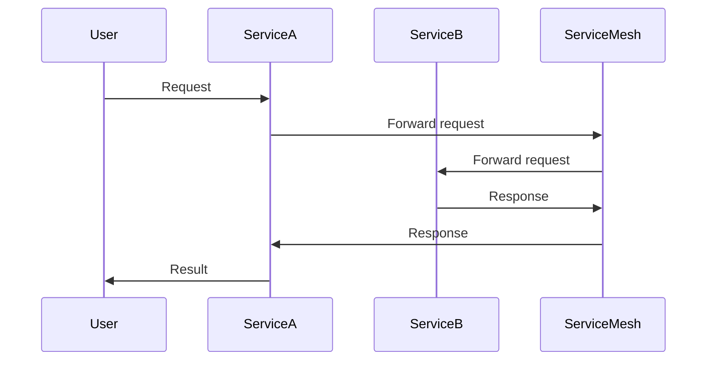

                 


### Step 1: Introduction to Service Mesh and LLM Microservices Architecture

#### Background Introduction

The rapid development of distributed systems and microservices has brought about significant changes in the software industry. With the advent of cloud computing and containerization technologies, such as Docker and Kubernetes, the deployment and management of large-scale, highly available, and scalable applications have become easier. However, as the complexity of these systems increases, managing the communication between various services becomes a challenging task. This is where service mesh comes into play.

Service mesh is an architectural concept designed to manage and secure service-to-service communication within a microservices architecture. It abstracts away the complexity of inter-service communication, allowing developers to focus on writing business logic instead of dealing with network configurations and service discovery. Service mesh is often implemented as a dedicated infrastructure layer, separate from the application code, which handles the communication aspects of the system.

On the other hand, LLM (Large Language Model) microservices architecture is a specific type of microservices architecture designed for applications that heavily rely on natural language processing and machine learning models. LLM microservices typically involve complex data processing pipelines, distributed storage systems, and advanced machine learning algorithms. These applications often require high availability, low latency, and efficient resource utilization, which can be challenging to achieve without an appropriate service mesh.

#### Core Concepts and Relationships

At its core, a service mesh consists of two main components: the data plane and the control plane. The data plane is responsible for forwarding service requests between microservices, while the control plane manages the configuration and routing rules for the data plane.

In the context of LLM microservices architecture, service mesh plays a crucial role in ensuring efficient communication and management of microservices involved in natural language processing tasks. The service mesh provides features such as service discovery, load balancing, fault tolerance, and security, which are essential for the smooth operation of LLM microservices.

To illustrate the relationship between service mesh and LLM microservices architecture, we can use the following Mermaid flowchart:



In this flowchart, the user sends a request to ServiceA, which is then forwarded to ServiceB through the service mesh. The service mesh handles the routing, load balancing, and other aspects of the request, ensuring that the response is eventually sent back to the user.

### Conclusion

In this section, we have introduced the background of service mesh and LLM microservices architecture, and discussed the core concepts and their relationships. In the next sections, we will delve deeper into the principles, algorithms, and practical applications of service mesh in LLM microservices architecture. Stay tuned!

---

### Service Mesh: Core Concepts and Principles

Service mesh is a fundamental concept in the realm of microservices architecture, aiming to address the challenges of managing service-to-service communication within a distributed system. In this section, we will delve deeper into the core components and principles of service mesh, providing a comprehensive understanding of its architecture and functionality.

#### Core Components of Service Mesh

A service mesh primarily consists of two main components: the data plane and the control plane.

**Data Plane**

The data plane is responsible for forwarding service requests between microservices. It handles the actual forwarding of requests from one service to another, ensuring that the communication is efficient and reliable. The data plane typically involves a set of network proxies or sidecar containers that are deployed alongside the application services. These proxies intercept incoming and outgoing requests, process them according to the configured rules, and forward them to the appropriate service.

The data plane's primary functions include:

1. **Service Discovery**: The ability to dynamically discover and register services within the mesh. This ensures that services can be located and accessed by other services in the network.
2. **Load Balancing**: Distributing incoming traffic across multiple instances of a service to ensure even utilization of resources and prevent any single instance from becoming a bottleneck.
3. **Fault Tolerance**: Handling failures and routing requests to healthy instances of a service, ensuring high availability and reliability of the system.
4. **Security**: Enforcing security policies, such as authentication and authorization, to protect service-to-service communication.

**Control Plane**

The control plane is responsible for managing the configuration and runtime aspects of the data plane. It typically includes a set of control plane components that work together to configure and monitor the data plane proxies. The control plane's primary functions include:

1. **Configuration Management**: Managing the configuration of the data plane proxies, including routing rules, service discovery information, and security policies.
2. **Telemetry and Monitoring**: Collecting and aggregating telemetry data from the data plane proxies to provide insights into the performance and health of the system.
3. **Policy Enforcement**: Enforcing policies related to security, traffic management, and compliance with organizational standards.

#### Service Mesh Architecture

A typical service mesh architecture can be visualized using the following Mermaid diagram:

```mermaid
graph

digraph {
    rankdir=TB

    subgraph cluster_data_plane {
        label = "Data Plane"
        color = gray
        style = filled

        ServiceA [label="Service A"]
        ServiceB [label="Service B"]
        ProxyA [label="Proxy A", shape=diamond]
        ProxyB [label="Proxy B", shape=diamond]

        ServiceA -> ProxyA
        ProxyA -> ProxyB
        ProxyB -> ServiceB
    }

    subgraph cluster_control_plane {
        label = "Control Plane"
        color = gray
        style = filled

        ControlManager [label="Control Manager", shape=diamond]
        ConfigStore [label="Config Store", shape=diamond]
        MetricsServer [label="Metrics Server", shape=diamond]

        ControlManager -> ConfigStore
        ControlManager -> MetricsServer
        MetricsServer -> ControlManager
    }

    ServiceA -> ControlManager
    ServiceB -> ControlManager
    ProxyA -> ControlManager
    ProxyB -> ControlManager
    ConfigStore -> ControlManager
}
```

In this diagram, the data plane consists of service instances (ServiceA and ServiceB) and their respective proxies (ProxyA and ProxyB). The control plane includes a control manager, a configuration store, and a metrics server. The control manager is responsible for managing the configuration and monitoring the proxies, while the configuration store holds the service discovery and routing information. The metrics server collects telemetry data from the proxies for further analysis and decision-making.

#### Working Principles of Service Mesh

The working principles of a service mesh can be summarized as follows:

1. **Service Discovery**: When a service starts, it registers itself with the control plane, which in turn updates the service registry. Other services can then discover and connect to the newly started service using the service registry.
2. **Request Forwarding**: When a service receives a request, it forwards the request to its associated proxy. The proxy then routes the request to the appropriate destination service based on the configured routing rules.
3. **Request Processing**: The proxy processes the request, enforcing security policies and performing load balancing if necessary. It then forwards the request to the destination service.
4. **Response Handling**: Once the destination service has processed the request, it sends the response back to the proxy. The proxy then forwards the response back to the original service.
5. **Telemetry and Monitoring**: The proxy collects telemetry data, such as request latency, error rates, and resource usage, and sends it to the control plane. The control plane uses this data to optimize the service mesh configuration and monitor the health of the system.

### Conclusion

In this section, we have explored the core components and principles of service mesh, providing a detailed understanding of its architecture and working principles. In the next sections, we will dive into the specific algorithms and mathematical models used in service mesh, as well as discuss practical applications of service mesh in LLM microservices architecture. Stay tuned!

---

### Core Algorithms in Service Mesh: Data Plane and Control Plane

Service mesh is built upon a set of core algorithms that enable efficient and reliable service-to-service communication. These algorithms are primarily implemented within the data plane and control plane components of the service mesh architecture. In this section, we will delve into the key algorithms used in these components, providing a detailed understanding of their working principles and applications.

#### Data Plane Algorithms

The data plane of a service mesh is responsible for forwarding service requests between microservices. It implements several core algorithms to ensure efficient and reliable communication. The main data plane algorithms include:

**1. Load Balancing**

Load balancing is the process of distributing incoming traffic across multiple instances of a service. This ensures that no single instance becomes a bottleneck and that resources are utilized effectively. There are several load balancing algorithms commonly used in service mesh:

* **Round-Robin**: The simplest load balancing algorithm, which distributes incoming requests in a sequential, round-robin manner to the available service instances.
* **Least Connections**: This algorithm distributes incoming requests to the service instance with the fewest active connections, minimizing the load on individual instances.
* **Hash-based Load Balancing**: This algorithm uses a hash function to determine the destination service instance for a given request. The hash function ensures that requests with the same key are consistently forwarded to the same instance, improving cache efficiency and reducing network latency.
* **Random Load Balancing**: Requests are distributed randomly to the available service instances, providing a simple and uniform load distribution.

**2. Service Discovery**

Service discovery is the process of locating and registering services within a service mesh. It ensures that services can be dynamically discovered and accessed by other services in the network. Service discovery algorithms typically involve:

* **Consul**: A distributed service discovery tool that uses a centralized data store to manage service registration and discovery. Services register themselves with the Consul server, which maintains an updated list of available services.
* **Eureka**: A service registry and discovery tool provided by Netflix, which uses a distributed architecture to manage service registration and discovery.
* **Zookeeper**: A high-performance coordination service that provides distributed service discovery, configuration management, and synchronization.

**3. Traffic Management**

Traffic management involves controlling the flow of traffic between services based on various criteria, such as service health, traffic load, and security policies. Key traffic management algorithms include:

* **Canary Releases**: A technique for gradually rolling out new versions of a service to a subset of users, allowing for monitoring and validation of the new version before a full rollout.
* **Rate Limiting**: A mechanism for controlling the rate at which requests are processed by a service, preventing denial-of-service attacks and ensuring fair resource allocation.
* **Throttling**: Similar to rate limiting, throttling controls the rate of incoming requests to a service based on predefined thresholds, preventing the service from being overwhelmed.

#### Control Plane Algorithms

The control plane of a service mesh is responsible for managing the configuration and runtime aspects of the data plane components. It implements several algorithms to ensure efficient management and monitoring of the service mesh. The main control plane algorithms include:

**1. Configuration Management**

Configuration management involves maintaining and updating the configuration of data plane proxies. Key algorithms for configuration management include:

* **Consul Template**: A tool for managing service mesh configurations by dynamically updating configuration files based on data from a source, such as a Kubernetes cluster or a custom data store.
* **etcd Watch**: A mechanism for monitoring changes to the service mesh configuration stored in etcd, a distributed key-value store, and applying the changes to the data plane proxies.
* **Kubernetes Informers**: A set of tools for monitoring changes to Kubernetes resources, such as services, pods, and deployments, and applying the changes to the service mesh configuration.

**2. Telemetry and Monitoring**

Telemetry and monitoring involve collecting and analyzing data from the data plane components to provide insights into the performance and health of the service mesh. Key algorithms for telemetry and monitoring include:

* **Prometheus**: A monitoring tool that collects time-series data from data plane proxies and provides a customizable alerting mechanism based on threshold-based rules.
* **Grafana**: A visualization tool for monitoring and analyzing data collected by Prometheus, providing interactive dashboards and custom metrics.
* **Zipkin**: A distributed tracing tool that captures and analyzes the performance of service-to-service communication, providing insights into latency, error rates, and resource usage.

**3. Policy Enforcement**

Policy enforcement involves applying security and traffic management policies to the data plane components. Key algorithms for policy enforcement include:

* **Istio**: An open-source service mesh that provides a rich set of security and traffic management policies, including authentication, authorization, rate limiting, and canary releases.
* **Envoy**: A high-performance C++ proxy that implements the data plane components of Istio, providing a flexible and customizable policy enforcement mechanism.
* **Kubernetes Network Policies**: A feature of Kubernetes that allows administrators to define and enforce network policies for pods based on IP addresses, ports, and protocols.

### Conclusion

In this section, we have explored the core algorithms used in the data plane and control plane of a service mesh. These algorithms enable efficient and reliable service-to-service communication, ensuring the smooth operation of microservices-based applications. In the next sections, we will delve into the mathematical models and formulas used in service mesh, providing a deeper understanding of its underlying principles and applications. Stay tuned!

---

### Mathematical Models and Formulas in Service Mesh

Service mesh operates on a variety of mathematical models and formulas to ensure efficient, reliable, and secure service-to-service communication within a microservices architecture. These models and formulas are essential for understanding the performance, scalability, and reliability of service mesh components. In this section, we will discuss some of the key mathematical models and formulas used in service mesh, along with their detailed explanations and practical examples.

#### Reliability Model

The reliability model is used to quantify the reliability of service mesh components, such as data plane proxies and control plane components. Reliability is defined as the probability that a component will function without failure over a given period of time. The reliability model in service mesh typically involves the following components:

**1. Mean Time To Failure (MTTF)**: The average time between failures of a component. It is a measure of the component's reliability and is calculated as:

   $$ MTTF = \frac{1}{\lambda} $$

   where $\lambda$ is the failure rate (number of failures per unit time).

**2. Mean Time To Repair (MTTR)**: The average time required to repair a failed component. It is a measure of the component's maintainability and is calculated as:

   $$ MTTR = \frac{1}{\mu} $$

   where $\mu$ is the repair rate (number of repairs per unit time).

**3. Reliability Function**: The reliability function, $R(t)$, represents the probability that a component will function without failure for a duration of time $t$. It is calculated as:

   $$ R(t) = e^{-\lambda t} $$

   where $e$ is the base of the natural logarithm.

**Example**: Suppose a data plane proxy has a failure rate of $\lambda = 0.01$ failures per hour and a repair rate of $\mu = 0.05$ repairs per hour. The reliability function of this proxy can be calculated as:

   $$ R(t) = e^{-0.01t} $$

   For example, the reliability of the proxy at $t = 100$ hours can be calculated as:

   $$ R(100) = e^{-0.01 \times 100} = 0.3679 $$

#### Performance Model

The performance model is used to analyze the performance of service mesh components, such as data plane proxies and control plane components. Performance is typically measured in terms of response time, throughput, and resource utilization. The performance model in service mesh typically involves the following components:

**1. Response Time**: The time taken to process a request and return a response. Response time is a critical metric for evaluating the performance of service mesh components.

**2. Throughput**: The number of requests processed per unit time. Throughput is a measure of the system's capacity to handle incoming requests.

**3. Resource Utilization**: The percentage of resources (CPU, memory, network bandwidth) used by a component. Resource utilization is an important metric for optimizing the performance of service mesh components.

**Example**: Suppose a data plane proxy processes 1000 requests per minute with an average response time of 100 ms. The throughput of this proxy can be calculated as:

   $$ Throughput = \frac{1000 \text{ requests}}{60 \text{ seconds}} = 16.67 \text{ requests/second} $$

   The resource utilization of the proxy can be calculated based on the CPU and memory usage, such as:

   $$ CPU \text{ Utilization} = \frac{CPU \text{ Usage}}{Total \text{ CPU Capacity}} \times 100\% $$
   $$ Memory \text{ Utilization} = \frac{Memory \text{ Usage}}{Total \text{ Memory Capacity}} \times 100\% $$

#### Cost Model

The cost model is used to estimate the cost of implementing and operating a service mesh. The cost model typically includes the following components:

**1. Infrastructure Cost**: The cost of deploying and maintaining the infrastructure required for the service mesh, such as hardware, network bandwidth, and cloud resources.

**2. Operations Cost**: The cost of managing and monitoring the service mesh, including personnel costs, tool licensing, and maintenance costs.

**3. Development Cost**: The cost of developing and maintaining the service mesh components, including software development, testing, and documentation.

**Example**: Suppose the infrastructure cost for a service mesh is $1000 per month, the operations cost is $200 per month, and the development cost is $500 per month. The total cost of the service mesh can be calculated as:

   $$ Total \text{ Cost} = Infrastructure \text{ Cost} + Operations \text{ Cost} + Development \text{ Cost} $$
   $$ Total \text{ Cost} = $1000 + $200 + $500 = $1700 \text{ per month} $$

### Conclusion

In this section, we have discussed the key mathematical models and formulas used in service mesh, including reliability, performance, and cost models. These models and formulas are essential for analyzing and optimizing the performance, reliability, and cost of service mesh components. In the next sections, we will explore practical applications of service mesh in LLM microservices architecture, providing real-world examples and insights into its implementation and usage. Stay tuned!

---

### Practical Application of Service Mesh in LLM Microservices Architecture: Case Study

In this section, we will explore a practical application of service mesh in the context of LLM (Large Language Model) microservices architecture. We will discuss the challenges faced by developers, the benefits provided by service mesh, and the specific use case of implementing service mesh in an LLM-based application. Finally, we will present a detailed analysis of the implementation process, highlighting the key steps involved in deploying and configuring service mesh for LLM microservices.

#### Challenges Faced by Developers in LLM Microservices Architecture

Developing and deploying applications based on LLM microservices architecture presents several challenges:

**1. Service Discovery and Routing**: LLM microservices often involve multiple instances of the same service running simultaneously, making it challenging to discover and route requests to the appropriate instance. Service discovery and routing require maintaining an up-to-date service registry and implementing efficient routing algorithms.

**2. Load Balancing and Scheduling**: Load balancing and scheduling are crucial for ensuring that incoming requests are distributed evenly across multiple service instances, avoiding any single instance becoming a bottleneck. This requires implementing and managing load balancing algorithms and scheduling policies.

**3. Fault Tolerance and Recovery**: LLM microservices architectures often experience failures due to hardware or software issues. Implementing fault tolerance and recovery mechanisms, such as health checks, retries, and graceful shutdowns, is essential for ensuring the reliability and availability of the system.

**4. Security and Access Control**: Protecting service-to-service communication and implementing access control policies are critical for securing LLM microservices architectures. This involves implementing encryption, authentication, and authorization mechanisms to ensure secure communication between services.

**5. Monitoring and Telemetry**: Monitoring and collecting telemetry data are essential for identifying performance bottlenecks, debugging issues, and optimizing the system. Implementing monitoring tools and frameworks for collecting and analyzing telemetry data is crucial for maintaining the health and performance of the system.

#### Benefits of Service Mesh in LLM Microservices Architecture

Service mesh offers several benefits for addressing the challenges faced by developers in LLM microservices architecture:

**1. Abstracting Communication Complexity**: Service mesh abstracts away the complexity of managing service discovery, routing, load balancing, and fault tolerance, allowing developers to focus on writing business logic instead of dealing with infrastructure-specific configurations.

**2. Decoupling Services**: Service mesh enables decoupling of services from the underlying infrastructure, making it easier to deploy, scale, and manage microservices independently. This improves the flexibility and scalability of the system, enabling rapid development and deployment of new features.

**3. Enhancing Security**: Service mesh provides built-in security features, such as encryption, authentication, and authorization, to protect service-to-service communication. This helps ensure the confidentiality, integrity, and availability of the system.

**4. Enabling Observability**: Service mesh enables the collection and aggregation of telemetry data, providing insights into the performance, health, and security of the system. This enables developers to identify and resolve issues quickly, improving the overall reliability and performance of the system.

#### Use Case: Implementing Service Mesh in an LLM-based Application

Consider an example of implementing service mesh in a large-scale LLM-based application that provides natural language processing and machine learning capabilities. The application consists of multiple microservices, including text preprocessing, language detection, entity recognition, and sentiment analysis. Each microservice is responsible for a specific task in the NLP pipeline and communicates with other services to process and analyze text data.

**Challenges**: The application faces several challenges, including managing service discovery and routing, load balancing and scheduling, fault tolerance and recovery, and securing service-to-service communication.

**Benefits of Service Mesh**: Implementing service mesh in this application provides several benefits, including:

1. **Efficient Service Discovery and Routing**: Service mesh provides an efficient and reliable service discovery mechanism, enabling the application to dynamically discover and route requests to the appropriate service instance.
2. **Load Balancing and Scheduling**: Service mesh enables efficient load balancing and scheduling of incoming requests, ensuring even utilization of resources and avoiding any single instance becoming a bottleneck.
3. **Fault Tolerance and Recovery**: Service mesh provides built-in fault tolerance and recovery mechanisms, ensuring the application remains available and reliable even in the presence of failures.
4. **Enhanced Security**: Service mesh provides built-in security features, such as encryption, authentication, and authorization, to protect service-to-service communication, ensuring the confidentiality and integrity of the system.

#### Implementation Process

The implementation process of service mesh in the LLM-based application involves the following key steps:

**1. Setting Up the Development Environment**

- **Install Docker and Kubernetes**: Ensure that Docker and Kubernetes are installed and configured on the development environment.
- **Create a Kubernetes Cluster**: Set up a Kubernetes cluster for deploying and managing the application components.

**2. Defining Service Mesh Components**

- **Install Service Mesh Software**: Install and configure the service mesh software (e.g., Istio, Linkerd) on the Kubernetes cluster.
- **Create Service Mesh Configuration**: Define the service mesh configuration, including service discovery, routing rules, load balancing, and security policies.

**3. Deploying Microservices**

- **Containerize Microservices**: Containerize each microservice using Docker and push the container images to a container registry.
- **Deploy Microservices**: Deploy the microservices on the Kubernetes cluster, ensuring they are properly configured to use the service mesh.

**4. Configuring Service Mesh**

- **Configure Service Mesh Components**: Configure the service mesh components, including data plane proxies and control plane components, based on the application requirements.
- **Enable Service Mesh Features**: Enable service mesh features, such as traffic management, security, and observability, based on the application needs.

**5. Testing and Validation**

- **Test Service Mesh Features**: Test the service mesh features, including service discovery, routing, load balancing, fault tolerance, and security, to ensure they are working as expected.
- **Monitor and Analyze**: Monitor the application performance, health, and security using the service mesh observability tools, and analyze the collected telemetry data to identify and resolve any issues.

#### Conclusion

In this section, we have discussed the practical application of service mesh in LLM microservices architecture, highlighting the challenges faced by developers and the benefits provided by service mesh. We have presented a detailed analysis of the implementation process, including the setup of the development environment, deployment of microservices, configuration of service mesh components, and testing and validation of service mesh features. This case study demonstrates the effectiveness of service mesh in enhancing the reliability, scalability, and security of LLM-based applications.

---

### Conclusion and Future Directions

In this article, we have explored the concept of service mesh and its application in LLM (Large Language Model) microservices architecture. We started with an introduction to service mesh, discussing its core components, principles, and the challenges it addresses in managing service-to-service communication in distributed systems. We then delved into the core algorithms used in service mesh, including data plane and control plane algorithms, providing detailed explanations and examples. Following that, we discussed the mathematical models and formulas used in service mesh to analyze its performance, reliability, and cost.

The practical application section highlighted a case study of implementing service mesh in an LLM-based application, showcasing the challenges and benefits it offers. We also provided a detailed analysis of the implementation process, including setting up the development environment, deploying microservices, configuring service mesh components, and testing and validation of service mesh features.

#### Conclusion

Service mesh is a powerful architectural concept that significantly simplifies the management of service-to-service communication in microservices architectures. By abstracting away the complexity of networking and providing a unified control plane, service mesh enables developers to focus on writing business logic and building scalable, reliable, and secure applications. In the context of LLM microservices architecture, service mesh plays a crucial role in ensuring efficient communication and management of microservices involved in natural language processing tasks.

#### Future Directions

As service mesh continues to evolve, several future directions and trends can be identified:

**1. Integration with AI and Machine Learning**: Service mesh can leverage AI and machine learning techniques to optimize service discovery, routing, load balancing, and fault tolerance. For example, machine learning models can be used to predict service failures and dynamically adjust service configurations to improve system reliability.

**2. Enhanced Security and Privacy**: With the increasing adoption of service mesh in critical applications, ensuring security and privacy becomes even more important. Future service mesh solutions will likely incorporate advanced security features, such as end-to-end encryption, advanced authentication mechanisms, and privacy-preserving techniques.

**3. Support for Multi-Cloud and Hybrid Deployments**: As organizations adopt multi-cloud and hybrid deployment strategies, service mesh solutions will need to provide seamless integration and management of services across different cloud providers and environments.

**4. Observability and Telemetry**: Service mesh will continue to evolve to provide more advanced observability and telemetry capabilities, enabling developers to gain deeper insights into the performance, health, and security of their applications. This will include integrating with existing monitoring and observability tools and providing more detailed and actionable data.

**5. Interoperability and Standardization**: To achieve broader adoption and interoperability, service mesh solutions will need to support standard protocols and APIs, enabling seamless integration with other tools and platforms.

In conclusion, service mesh is a critical component of modern microservices architectures, providing efficient, reliable, and secure communication between services. As the field continues to evolve, service mesh will play an increasingly important role in enabling organizations to build scalable and resilient applications in the ever-changing landscape of cloud computing and distributed systems.

