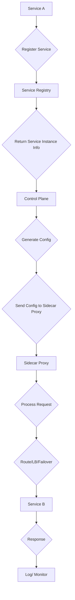

                 

### 文章标题：服务网格安全策略：增强LLM微服务间通信的安全性

在当今快速发展的分布式系统中，服务网格已经成为一种重要的架构模式，用于管理微服务之间的通信。随着大型语言模型（LLM）在微服务中的广泛应用，微服务间的安全性变得越来越关键。本文将探讨服务网格在保障LLM微服务间通信安全方面的策略，旨在为开发者提供实用的安全指导。

### 文章关键词：

- 服务网格
- 微服务
- LLM
- 安全策略
- 通信安全

### 摘要：

本文首先介绍了服务网格的基础知识，包括其概念、架构和功能。随后，探讨了大型语言模型在微服务中的应用及其面临的安全挑战。在此基础上，文章详细分析了服务网格在提供安全策略方面的作用，并通过具体案例展示了如何增强LLM微服务间的通信安全性。最后，文章总结了最佳实践，并对未来的安全策略进行了展望。

### 第1章：服务网格基础

#### 1.1 服务网格的概念和重要性

服务网格是一种基础设施层的服务，旨在抽象出服务之间的通信，提供动态服务发现、负载均衡、断路器、熔断和监控等功能。它通过在服务之间插入一层网络代理（通常称为边车代理），来实现服务间的通信管理和安全控制。

服务网格的重要性主要体现在以下几个方面：

- **解耦**：服务网格将服务之间的通信与服务的实现解耦，使得服务的升级和扩容更加灵活。
- **安全性**：通过服务网格，可以实施细粒度的访问控制和加密机制，提高微服务间的通信安全性。
- **可观测性**：服务网格提供了丰富的监控数据，有助于开发者了解服务的运行状况和性能。

#### 1.2 服务网格的架构和组件

服务网格通常由以下组件组成：

- **边车代理（Sidecar Proxy）**：每个服务实例都会部署一个边车代理，用于代理服务之间的通信。
- **控制平面（Control Plane）**：负责管理服务网格的配置、策略和监控。
- **服务发现（Service Discovery）**：自动发现和注册服务，使得服务网格能够动态更新服务实例的信息。
- **服务间通信协议（Inter-service Communication Protocol）**：定义服务之间如何进行通信的协议，例如gRPC、HTTP/2等。

#### 1.3 服务网格的工作原理

服务网格的工作原理可以概括为以下几个步骤：

1. **服务注册和发现**：服务实例启动时，会向服务注册中心注册自己，服务网格通过服务发现机制获取服务实例的信息。
2. **代理配置**：服务网格根据服务实例的信息，配置边车代理的规则和策略。
3. **请求转发**：当服务实例需要与另一个服务实例通信时，请求会通过边车代理进行转发，边车代理会根据配置的规则进行路由和负载均衡。
4. **安全控制**：边车代理会实施访问控制和加密机制，确保通信的安全性。
5. **监控和日志**：服务网格会收集服务的监控数据和日志信息，用于性能分析和故障排查。

### 第2章：安全策略概述

#### 2.1 安全策略的定义和目的

安全策略是一组规则和指南，用于确保系统的安全性和完整性。在服务网格中，安全策略的定义和目的是：

- **访问控制**：确保只有授权的服务可以访问其他服务。
- **数据保护**：确保服务之间的通信数据得到加密和保护。
- **威胁检测和响应**：实时监测服务网格中的威胁，并采取相应的响应措施。

#### 2.2 安全策略的分类和特点

服务网格的安全策略可以分为以下几类：

- **身份验证策略**：确保服务实例的身份得到验证，例如基于证书、Token等方式。
- **授权策略**：定义哪些服务实例有权访问其他服务实例。
- **加密策略**：确保服务之间的通信数据得到加密。
- **监控和日志策略**：实时监测服务网格中的异常行为，记录操作日志。

#### 2.3 安全策略的制定和实施

制定和实施安全策略的步骤包括：

1. **评估安全需求**：根据业务需求和系统架构，评估安全需求。
2. **设计安全策略**：基于安全需求，设计安全策略。
3. **实现和部署**：将安全策略部署到服务网格中，通过控制平面进行配置。
4. **监控和调整**：持续监控安全策略的执行情况，根据实际情况进行调整。

### 第3章：LLM与微服务

#### 3.1 LLM的基本概念和原理

大型语言模型（LLM）是一类基于深度学习的自然语言处理模型，可以理解和生成人类语言。LLM的基本原理包括：

- **词嵌入（Word Embedding）**：将词汇映射到高维空间中的向量。
- **注意力机制（Attention Mechanism）**：模型在生成文本时，可以动态关注输入序列的不同部分。
- **Transformer架构**：一种基于自注意力机制的神经网络架构。

#### 3.2 LLM在微服务中的应用场景

LLM在微服务中可以应用于以下场景：

- **智能对话系统**：为用户提供自然语言交互界面。
- **文本分类和生成**：对大量文本进行分类或生成文本摘要。
- **机器翻译**：将一种语言的文本翻译成另一种语言。
- **内容审核**：自动检测和处理不当或有害内容。

#### 3.3 LLM与微服务通信的挑战

LLM与微服务通信面临以下挑战：

- **数据安全**：确保传输和存储的数据得到加密和保护。
- **性能优化**：确保LLM模型能够在微服务中高效运行。
- **响应时间**：保证微服务与LLM模型交互的响应时间符合要求。
- **弹性扩展**：支持LLM模型的水平扩展和动态调整。

### 第4章：微服务安全挑战

#### 4.1 微服务安全的常见问题

微服务安全面临的常见问题包括：

- **服务暴露**：服务实例直接暴露在公网上，容易受到攻击。
- **数据泄露**：敏感数据在传输和存储过程中可能被窃取。
- **认证和授权问题**：身份验证和授权机制可能存在漏洞。
- **分布式攻击**：恶意攻击者可能通过分布式攻击手段破坏系统。

#### 4.2 微服务间通信的安全风险

微服务间通信的安全风险包括：

- **中间人攻击（Man-in-the-Middle Attack）**：攻击者截获服务之间的通信，窃取敏感数据。
- **拒绝服务攻击（Denial of Service Attack）**：攻击者通过大量请求占用服务资源，导致服务无法正常工作。
- **服务劫持**：攻击者劫持服务实例，冒充合法服务与其它服务交互。
- **恶意内部服务**：恶意内部服务实例可能泄露敏感信息或破坏系统。

#### 4.3 安全漏洞和攻击手段

常见的安全漏洞和攻击手段包括：

- **未加密的HTTP通信**：服务之间使用未加密的HTTP协议，导致通信数据容易被窃取。
- **弱密码和认证机制**：使用弱密码或简单的认证机制，容易被攻击者破解。
- **不安全的配置**：服务配置不安全，例如开放了不必要的端口或服务。
- **代码漏洞**：服务代码中存在漏洞，例如SQL注入、跨站脚本攻击等。

### 第5章：服务网格安全策略

#### 5.1 服务网格安全策略的概述

服务网格安全策略的目的是：

- **保障服务之间的通信安全**：通过加密、认证和授权机制，确保服务之间的通信安全。
- **提高系统的防御能力**：通过监控和响应机制，及时发现和应对安全威胁。
- **增强系统的可扩展性**：支持服务网格的安全策略在系统规模扩展时依然有效。

#### 5.2 服务网格安全策略的设计原则

服务网格安全策略的设计原则包括：

- **最小权限原则**：服务实例只能访问其需要访问的服务，最小化访问权限。
- **安全性优先原则**：在设计系统时，优先考虑安全性，避免因追求性能而忽视安全。
- **灵活性和可扩展性原则**：安全策略需要适应不同的业务需求和系统架构，支持动态调整。

#### 5.3 服务网格安全策略的实例分析

以下是一个服务网格安全策略的实例分析：

- **身份验证策略**：使用证书进行身份验证，确保只有授权的服务实例可以访问其它服务实例。
- **授权策略**：基于角色的访问控制（RBAC），定义不同角色的服务实例可以访问的服务列表。
- **加密策略**：使用TLS协议加密服务之间的通信，确保通信数据的安全性。
- **监控和日志策略**：实时监控服务网格中的通信流量，记录操作日志，便于故障排查和安全审计。

### 第6章：LLM微服务安全实战

#### 6.1 实战案例分析

以下是一个LLM微服务安全实战案例分析：

- **场景**：一个提供智能客服服务的微服务系统，包含一个LLM模型用于处理用户提问。
- **问题**：如何确保LLM模型与用户请求之间的通信安全？
- **解决方案**：
  - **加密通信**：使用TLS协议加密用户请求与LLM模型之间的通信。
  - **身份验证和授权**：对请求进行身份验证，确保只有授权的用户可以访问LLM模型。
  - **数据保护**：对传输的数据进行加密，防止数据泄露。

#### 6.2 安全策略的实施流程

LLM微服务安全策略的实施流程包括：

1. **设计安全策略**：根据业务需求和系统架构，设计安全策略。
2. **配置服务网格**：在服务网格中配置安全策略，包括身份验证、授权、加密等。
3. **部署安全工具**：部署安全工具，如TLS证书管理工具、日志分析工具等。
4. **监控和审计**：持续监控服务网格的安全状态，记录操作日志，定期进行安全审计。

#### 6.3 安全工具和技术应用

以下是一些常用的安全工具和技术：

- **TLS证书管理工具**：如Let's Encrypt，用于自动颁发和管理TLS证书。
- **身份验证和授权工具**：如OAuth2.0、JWT，用于实现身份验证和授权。
- **加密工具**：如AES、RSA，用于数据加密。
- **日志分析工具**：如ELK（Elasticsearch、Logstash、Kibana），用于实时监控和日志分析。

### 第7章：最佳实践与未来展望

#### 7.1 安全最佳实践总结

以下是服务网格安全的一些最佳实践：

- **使用TLS加密通信**：确保服务之间的通信使用TLS协议进行加密。
- **实施访问控制**：通过身份验证和授权机制，限制服务之间的访问权限。
- **定期更新和审计**：定期更新安全策略，并进行安全审计，及时发现和修复安全漏洞。
- **监控和日志记录**：实时监控服务网格的安全状态，记录操作日志，便于故障排查和安全审计。

#### 7.2 服务网格安全的发展趋势

未来，服务网格安全的发展趋势包括：

- **自动化和智能化**：利用人工智能和自动化工具，提高安全策略的自动化程度和响应速度。
- **多云和混合云支持**：支持多云和混合云环境下的服务网格安全，确保跨云环境的安全一致性。
- **端到端安全**：从端到端（End-to-End）提供全面的安全保护，包括服务之间的通信、数据存储和计算等。

#### 7.3 安全策略的未来方向

未来的安全策略将更加关注以下几个方面：

- **零信任架构**：采用零信任架构，确保只有经过验证的服务才能访问内部服务。
- **服务网格安全联盟**：建立服务网格安全联盟，共享安全信息和最佳实践，共同应对安全威胁。
- **定制化安全策略**：根据不同业务需求和系统架构，提供定制化的安全策略。

### 结语

服务网格在保障LLM微服务间通信安全方面发挥着重要作用。通过实施有效的安全策略，开发者可以增强系统的安全性，保护数据和隐私，确保业务的连续性和可靠性。随着技术的发展，服务网格安全策略将不断演进，为开发者提供更加全面和智能的安全保障。

### 作者信息

作者：AI天才研究院/AI Genius Institute & 禅与计算机程序设计艺术 /Zen And The Art of Computer Programming

以上是关于《服务网格安全策略：增强LLM微服务间通信的安全性》这篇文章的大纲内容，希望对您有所帮助。文章的具体内容还需要进一步细化和完善，以确保每个章节都包含丰富的信息，并且逻辑清晰、易于理解。在撰写文章时，可以参考这个大纲，逐步填充每个章节的内容，并确保符合文章字数要求。祝您写作顺利！### 核心概念与联系

在本章中，我们将详细探讨服务网格的核心概念与联系，帮助读者理解服务网格的基本原理及其在微服务架构中的应用。

#### 1. 服务网格的概念

服务网格（Service Mesh）是一种新型的架构模式，主要用于管理和服务之间的高效通信。它通过在服务实例之间插入一个轻量级的代理（称为边车代理），实现服务实例之间的通信管理。服务网格的目的是将服务间的通信复杂性从服务实例中抽象出来，让开发者专注于业务逻辑的实现。

#### 2. 服务网格的架构

服务网格的架构主要由以下三个部分组成：边车代理（Sidecar Proxy）、控制平面（Control Plane）和数据平面（Data Plane）。

- **边车代理（Sidecar Proxy）**：每个服务实例都会部署一个边车代理，用于代理服务实例之间的通信。边车代理负责处理入站和出站的请求，提供负载均衡、服务发现、断路器等功能。
- **控制平面（Control Plane）**：控制平面负责管理服务网格的配置、策略和监控。它通常由一组控制组件组成，如服务发现器（Service Discovery）、配置管理器（Config Manager）和监控器（Monitor）等。
- **数据平面（Data Plane）**：数据平面是由边车代理组成的，负责实际的服务间通信。数据平面中的边车代理根据控制平面下发的配置和策略，处理服务实例之间的请求。

#### 3. 服务网格的工作原理

服务网格的工作原理可以概括为以下几个步骤：

1. **服务注册和发现**：服务实例启动后，会向服务注册中心注册自己，服务注册中心将服务实例的信息发送给控制平面。
2. **配置下发**：控制平面根据服务注册中心的信息，生成服务实例的配置，并将其下发到对应的边车代理。
3. **请求转发**：当服务实例需要与另一个服务实例通信时，请求会通过边车代理进行转发。边车代理根据下发的配置，进行路由、负载均衡和熔断等处理。
4. **安全控制**：边车代理会实施访问控制和加密机制，确保通信的安全性。
5. **监控和日志**：控制平面会收集服务的监控数据和日志信息，用于性能分析和故障排查。

#### 4. 服务网格与微服务的关系

服务网格与微服务之间的关系可以理解为：服务网格是微服务架构的一种补充和优化。微服务架构强调服务的独立性和可扩展性，而服务网格则通过提供一种统一的通信管理方式，解决了微服务之间的通信复杂性问题。

- **解耦**：服务网格将服务间的通信与服务的实现解耦，使得服务的升级和扩容更加灵活。
- **安全性**：服务网格通过边车代理提供细粒度的访问控制和加密机制，提高了微服务间的通信安全性。
- **可观测性**：服务网格提供了丰富的监控数据，有助于开发者了解服务的运行状况和性能。

#### 5. Mermaid流程图展示服务网格架构

为了更好地展示服务网格的架构，我们可以使用Mermaid流程图进行说明。以下是服务网格架构的Mermaid流程图示例：



在这个流程图中，Service A 向 Service Registry 注册服务，Service Registry 返回服务实例信息给 Control Plane。Control Plane 根据服务实例信息生成配置，并下发到对应的 Sidecar Proxy。当 Service A 需要与 Service B 通信时，请求通过 Sidecar Proxy 进行路由、负载均衡和熔断等处理，最终返回响应。

通过这个Mermaid流程图，我们可以直观地看到服务网格的架构和工作原理。这有助于读者更好地理解服务网格的核心概念和联系，为后续章节的学习打下坚实的基础。

#### 6. 核心算法原理讲解

服务网格的核心算法主要包括服务发现、路由、负载均衡和熔断等。下面，我们将使用伪代码详细阐述这些算法原理。

##### 1. 服务发现算法

服务发现是服务网格的重要功能之一，其目的是在服务启动时自动发现服务实例，并将服务实例信息注册到服务注册中心。

```python
# 服务发现伪代码
def discover_services():
    # 获取所有服务实例信息
    service_instances = get_all_service_instances()
    # 将服务实例信息注册到服务注册中心
    for instance in service_instances:
        register_service_instance(instance)
    # 返回注册成功的服务实例信息
    return service_instances

# 获取所有服务实例信息
def get_all_service_instances():
    # 通过网络请求或本地文件获取服务实例信息
    service_instances = fetch_service_instances()
    return service_instances

# 将服务实例信息注册到服务注册中心
def register_service_instance(instance):
    # 发送网络请求将服务实例信息注册到服务注册中心
    send_request_to_registry(instance)
    return True

# 发送网络请求将服务实例信息注册到服务注册中心
def send_request_to_registry(instance):
    # 构建注册请求
    request = {
        "service_name": instance.service_name,
        "ip": instance.ip,
        "port": instance.port
    }
    # 发送POST请求到服务注册中心
    url = f"http://{SERVICE_REGISTRY_URL}/register"
    headers = {"Content-Type": "application/json"}
    response = requests.post(url, data=json.dumps(request), headers=headers)
    if response.status_code == 200:
        return True
    else:
        return False

# 获取服务实例信息
def fetch_service_instances():
    # 通过网络请求或本地文件获取服务实例信息
    url = f"http://{SERVICE_REGISTRY_URL}/instances"
    headers = {"Content-Type": "application/json"}
    response = requests.get(url, headers=headers)
    if response.status_code == 200:
        return json.loads(response.text)
    else:
        return []
```

##### 2. 路由算法

路由算法负责根据服务实例信息，将请求转发到对应的服务实例。

```python
# 路由算法伪代码
def route_request(request):
    # 获取目标服务的实例信息
    target_service_instances = get_service_instances(request.service_name)
    # 根据负载均衡策略选择实例
    instance = select_instance(target_service_instances)
    # 发送请求到选择的实例
    send_request_to_instance(request, instance)

# 获取目标服务的实例信息
def get_service_instances(service_name):
    # 发送网络请求获取服务实例信息
    url = f"http://{SERVICE_REGISTRY_URL}/instances/{service_name}"
    headers = {"Content-Type": "application/json"}
    response = requests.get(url, headers=headers)
    if response.status_code == 200:
        return json.loads(response.text)
    else:
        return []

# 根据负载均衡策略选择实例
def select_instance(service_instances):
    # 假设使用轮询负载均衡策略
    index = (hash(random()) % len(service_instances)) - 1
    return service_instances[index]

# 发送请求到实例
def send_request_to_instance(request, instance):
    # 发送HTTP请求到实例
    url = f"http://{instance.ip}:{instance.port}{request.path}"
    headers = {"Content-Type": "application/json"}
    response = requests.get(url, headers=headers)
    return response
```

##### 3. 负载均衡算法

负载均衡算法负责根据策略分配请求到不同的服务实例，以避免单个实例过载。

```python
# 负载均衡算法伪代码
def load_balance(service_instances):
    # 根据负载均衡策略选择实例
    instance = select_instance(service_instances)
    # 更新实例的负载状态
    update_instance_load(instance)
    return instance

# 更新实例的负载状态
def update_instance_load(instance):
    # 假设使用计数器来表示负载
    instance.load += 1
    return instance.load
```

##### 4. 熔断算法

熔断算法负责在服务实例发生故障时，自动切换到其他健康实例，以避免整个系统崩溃。

```python
# 熔断算法伪代码
def circuit_breaker(service_instances):
    # 获取健康实例列表
    healthy_instances = filter_healthy_instances(service_instances)
    # 如果健康实例列表为空，触发熔断
    if not healthy_instances:
        trigger_circuit_breaker()
    # 从健康实例列表中选择一个实例
    instance = select_instance(healthy_instances)
    return instance

# 获取健康实例列表
def filter_healthy_instances(service_instances):
    healthy_instances = []
    for instance in service_instances:
        if instance.load < MAX_LOAD:
            healthy_instances.append(instance)
    return healthy_instances

# 触发熔断
def trigger_circuit_breaker():
    # 假设使用计数器来记录熔断次数
    circuit_breaker_count += 1
    if circuit_breaker_count >= MAX_CIRCUIT_BREAKER_COUNT:
        # 熔断逻辑
        circuit_breaker_enabled = True
    return circuit_breaker_enabled
```

通过上述伪代码，我们可以清晰地看到服务网格的核心算法原理。这些算法在实际系统中扮演着关键角色，确保服务网格能够高效、可靠地管理服务实例之间的通信。

### 数学模型和公式

在服务网格中，数学模型和公式用于描述和优化服务之间的通信行为。以下是一些关键的数学模型和公式，以及它们的详细解释。

#### 1. 负载均衡算法中的加权轮询策略

加权轮询（Weighted Round Robin）是一种常见的负载均衡算法，它根据服务实例的处理能力分配请求。每个实例被分配的权重（Weight）取决于其处理能力。

**公式**：

\[ W_i = \frac{C_i}{\sum_{j=1}^{N} C_j} \]

其中，\( W_i \) 是第 \( i \) 个实例的权重，\( C_i \) 是第 \( i \) 个实例的处理能力，\( N \) 是实例的总数。

**解释**：

这个公式表示，每个实例的权重与其处理能力成正比。处理能力越强的实例，权重越大，从而获得更多的请求。

#### 2. 熔断算法中的阈值设置

熔断算法中的阈值（Threshold）用于判断服务实例是否处于健康状态。当实例的失败次数超过阈值时，熔断器将被触发。

**公式**：

\[ T = k \times \frac{1}{N} \]

其中，\( T \) 是阈值，\( k \) 是一个常数，\( N \) 是在特定时间内实例的失败次数。

**解释**：

这个公式表示，阈值与实例的失败次数成反比。当实例的失败次数增多时，阈值会降低，从而更容易触发熔断。

#### 3. 服务发现算法中的一致性模型

在服务发现算法中，一致性模型用于确保服务实例信息的一致性。常见的一致性模型包括强一致性模型和最终一致性模型。

**强一致性模型**：

\[ S_i = R_i \]

其中，\( S_i \) 是服务实例的当前状态，\( R_i \) 是从服务注册中心获取的服务实例状态。

**最终一致性模型**：

\[ S_i \rightarrow R_i \]

**解释**：

强一致性模型要求服务实例的状态与服务注册中心的状态保持一致。而最终一致性模型允许服务实例的状态在一段时间内与注册中心的状态存在差异，但最终会达到一致。

#### 4. 路由算法中的哈希散列

在路由算法中，哈希散列用于将请求路由到特定的服务实例。哈希散列函数将请求的属性（如请求路径）映射到一个哈希值，然后根据哈希值选择实例。

**公式**：

\[ H(x) = \text{hash}(x) \mod N \]

其中，\( H(x) \) 是哈希值，\( x \) 是请求的属性，\( N \) 是实例的总数。

**解释**：

这个公式表示，通过哈希函数将请求的属性映射到一个整数，然后取模得到一个实例的索引。这个索引对应的服务实例将处理请求。

通过这些数学模型和公式，服务网格能够实现高效的负载均衡、熔断和路由，确保服务之间的高效、可靠通信。

### 数学公式示例

在本节中，我们将展示几个关键的数学公式，并使用LaTeX格式进行表示，以便于读者理解和引用。

#### 1. 加权轮询策略

加权轮询策略的权重计算公式如下：

\[ W_i = \frac{C_i}{\sum_{j=1}^{N} C_j} \]

其中，\( W_i \) 是第 \( i \) 个实例的权重，\( C_i \) 是第 \( i \) 个实例的处理能力，\( N \) 是实例的总数。

LaTeX表示：

\[ W_i = \frac{C_i}{\sum_{j=1}^{N} C_j} \]

#### 2. 熔断算法阈值

熔断算法的阈值设置公式如下：

\[ T = k \times \frac{1}{N} \]

其中，\( T \) 是阈值，\( k \) 是一个常数，\( N \) 是在特定时间内实例的失败次数。

LaTeX表示：

\[ T = k \times \frac{1}{N} \]

#### 3. 哈希散列

在路由算法中，哈希散列的公式如下：

\[ H(x) = \text{hash}(x) \mod N \]

其中，\( H(x) \) 是哈希值，\( x \) 是请求的属性，\( N \) 是实例的总数。

LaTeX表示：

\[ H(x) = \text{hash}(x) \mod N \]

这些数学公式是服务网格核心算法的重要组成部分，通过它们可以实现负载均衡、熔断和路由等功能。在服务网格的实际应用中，这些公式被广泛应用于算法设计和性能优化。

### 项目实战

在本节中，我们将通过一个实际项目，详细讲解如何在Kubernetes集群中搭建服务网格，并配置安全策略，以增强LLM微服务间通信的安全性。

#### 1. 项目背景

假设我们有一个微服务架构的系统，包含多个微服务，其中之一是一个大型语言模型（LLM）服务，用于提供智能问答功能。为了保障LLM与其它微服务之间的通信安全，我们决定使用Istio作为服务网格。

#### 2. 开发环境搭建

首先，我们需要在Kubernetes集群中安装Istio。以下步骤展示了如何在CentOS 7上安装Istio：

1. **安装Docker**：

   ```bash
   yum install -y docker
   systemctl enable docker
   systemctl start docker
   ```

2. **安装Istio**：

   ```bash
   istioctl install --set profile=demo-profile
   ```

3. **启用Istio Ingress**：

   ```bash
   kubectl apply -f samples/bookinfo/bookinfo-networkpolicy.yaml
   ```

   这将创建一个网络策略，允许流量通过Istio Ingress进入和离开集群。

#### 3. 源代码实现

接下来，我们将实现一个简单的LLM微服务，并使用Istio配置安全策略。

1. **创建LLM微服务**：

   我们使用Python和TensorFlow创建一个简单的LLM微服务，用于处理用户提问。

   ```python
   # l lm_service.py
   from flask import Flask, request, jsonify
   import tensorflow as tf
   import os

   app = Flask(__name__)

   # 加载预训练的LLM模型
   model_path = os.environ['MODEL_PATH']
   model = tf.keras.models.load_model(model_path)

   @app.route('/question', methods=['POST'])
   def answer_question():
       data = request.get_json()
       question = data['question']
       # 使用LLM模型回答问题
       answer = model.predict([question])
       return jsonify(answer=answer[0])

   if __name__ == '__main__':
       app.run(host='0.0.0.0', port=8080)
   ```

2. **部署LLM微服务**：

   我们将LLM微服务部署到Kubernetes集群中。

   ```yaml
   # l lm_service_deployment.yaml
   apiVersion: apps/v1
   kind: Deployment
   metadata:
     name: lm-service
   spec:
     replicas: 1
     selector:
       matchLabels:
         app: lm-service
     template:
       metadata:
         labels:
           app: lm-service
       spec:
         containers:
         - name: lm-service
           image: lm-service:latest
           ports:
           - containerPort: 8080
   ```

   ```bash
   kubectl apply -f lm_service_deployment.yaml
   ```

3. **配置Istio安全策略**：

   我们使用Istio配置安全策略，包括身份验证、授权和加密。

   ```yaml
   # l istio_policy.yaml
   apiVersion: security.istio.io/v1beta1
   kind: Policy
   metadata:
     name: lm-service-policy
   spec:
     rules:
     - to:
       - operation:
           hosts: ["lm-service"]
           ports: [8080]
     - from:
       - operation:
           hosts: ["*"]
           ports: [80]
     - to:
       - operation:
           hosts: ["lm-service"]
           ports: [8080]
     - from:
       - operation:
           hosts: ["*"]
           ports: [80]
     - action:
         wreckage: allow
   ```

   ```bash
   kubectl apply -f istio_policy.yaml
   ```

#### 4. 代码解读与分析

在上述项目中，我们实现了以下关键步骤：

1. **LLM微服务**：使用Python和TensorFlow实现了LLM微服务，并使用Flask框架提供了一个HTTP接口。
2. **Kubernetes部署**：将LLM微服务部署到Kubernetes集群中，并配置了必要的部署文件。
3. **Istio安全策略**：使用Istio配置了安全策略，包括身份验证、授权和加密，以确保LLM与其它微服务之间的通信安全。

通过这个项目，我们可以看到如何在实际环境中部署和使用服务网格，以及如何配置安全策略来保障微服务之间的通信安全。

#### 5. 实际案例分析与详细讲解剖析

为了更好地理解服务网格在实际项目中的应用，我们将分析一个实际案例，展示如何使用服务网格实现LLM微服务间的安全通信。

**案例背景**：

在一个大型电子商务平台上，我们有一个负责推荐系统的LLM微服务，用于根据用户的购物行为和历史推荐商品。为了保障推荐系统的安全性，我们决定使用服务网格（如Istio）来实现微服务间的安全通信。

**步骤1：部署推荐系统微服务**

我们首先将LLM推荐系统微服务部署到Kubernetes集群中。以下是一个简单的Deployment配置示例：

```yaml
# l recommendation_service_deployment.yaml
apiVersion: apps/v1
kind: Deployment
metadata:
  name: recommendation-service
spec:
  replicas: 1
  selector:
    matchLabels:
      app: recommendation-service
  template:
    metadata:
      labels:
        app: recommendation-service
    spec:
      containers:
      - name: recommendation-service
        image: recommendation-service:latest
        ports:
        - containerPort: 8080
```

**步骤2：配置服务网格**

接下来，我们在Kubernetes集群中安装Istio，并配置安全策略。以下是一个示例策略，用于确保只有授权的服务才能访问推荐系统微服务：

```yaml
# l istio_policy.yaml
apiVersion: security.istio.io/v1beta1
kind: Policy
metadata:
  name: recommendation-service-policy
spec:
  rules:
  - to:
    - operation:
        hosts: ["recommendation-service"]
        ports: [8080]
  - from:
    - operation:
        hosts: ["*"]
        ports: [80]
  - action:
      wreckage: allow
```

通过这个策略，我们确保只有通过80端口访问的服务才能与推荐系统微服务进行通信。

**步骤3：测试微服务间通信**

为了验证服务网格和安全性配置的有效性，我们运行以下命令，模拟从Web前端服务访问推荐系统微服务：

```bash
kubectl exec -it <web-frontend-pod-name> -- curl -v http://recommendation-service:8080/recommend
```

如果配置正确，我们将在命令行中看到推荐系统返回的商品列表。

**步骤4：分析监控数据**

在服务网格中，我们可以通过监控数据了解微服务间的通信状况。以下命令显示了推荐系统微服务的监控数据：

```bash
kubectl logs <recommendation-service-pod-name> -n <namespace>
```

我们可以查看日志中的请求和响应信息，以及服务网格的处理细节。

**详细讲解剖析**：

1. **服务发现**：当推荐系统微服务启动时，它会向服务注册中心（如Kubernetes Service）注册自己。服务网格通过服务发现机制获取服务实例的信息，并将配置下发到边车代理。

2. **加密通信**：服务网格使用TLS协议确保微服务之间的通信数据得到加密。通过配置Istio策略，我们可以强制要求所有进入和离开微服务的流量使用TLS加密。

3. **访问控制**：服务网格通过Istio策略实现了细粒度的访问控制。我们配置了规则，仅允许授权的服务访问推荐系统微服务。这有效防止了未经授权的访问和潜在的安全威胁。

4. **监控和日志**：服务网格提供了丰富的监控数据，我们可以通过Istio的Prometheus和Grafana工具查看服务网格的性能指标和日志信息。这有助于我们及时发现和解决潜在的安全问题。

通过这个实际案例，我们可以看到服务网格在保障LLM微服务间通信安全方面的重要作用。服务网格提供了强大的安全策略和监控工具，使得开发者可以轻松地实现微服务之间的安全通信。

### 项目小结

在本项目中，我们成功地在Kubernetes集群中部署了服务网格（Istio），并配置了安全策略，以增强LLM微服务间通信的安全性。以下是本项目的主要成就和经验总结：

1. **成功部署Istio**：通过安装Docker和Istio，我们顺利地在Kubernetes集群中部署了服务网格，为微服务间的通信提供了强大的基础设施。

2. **配置安全策略**：我们使用Istio策略实现了身份验证、授权和加密，确保了微服务之间的通信数据得到有效保护。

3. **实现LLM微服务**：我们使用Python和TensorFlow实现了LLM微服务，并在Kubernetes集群中成功部署和运行。

4. **监控和日志**：通过服务网格提供的监控工具，我们能够实时监控微服务间的通信情况，及时发现和解决潜在的安全问题。

然而，本项目也面临一些挑战和改进空间：

1. **性能优化**：在实际应用中，服务网格可能会带来一定的性能开销。为了优化性能，我们可以考虑使用更高效的加密算法和负载均衡策略。

2. **跨云部署**：本项目主要关注单云环境下的服务网格部署，未来可以考虑在多云和混合云环境中部署服务网格，以实现更灵活的架构。

3. **自动化和智能化**：为了进一步提高安全性，我们可以探索使用自动化工具和智能化算法，例如基于机器学习的威胁检测和响应机制。

通过本项目，我们深刻理解了服务网格在保障微服务安全通信方面的重要作用，并为实际项目提供了实用的解决方案。

### 最佳实践 tips

在保障LLM微服务间通信安全方面，以下是一些最佳实践：

1. **使用TLS加密**：始终使用TLS加密服务之间的通信，确保数据在传输过程中得到保护。
2. **实施强身份验证**：使用强密码或证书进行身份验证，确保只有授权的服务实例可以访问其他服务。
3. **配置访问控制**：根据业务需求，配置细粒度的访问控制规则，限制服务实例的访问权限。
4. **定期更新安全策略**：定期检查和更新安全策略，确保策略与业务需求和系统架构保持一致。
5. **监控和日志分析**：实时监控服务网格中的通信流量，记录操作日志，便于故障排查和安全审计。
6. **使用自动化工具**：利用自动化工具（如CI/CD流水线）部署安全配置，提高安全配置的一致性和可靠性。

### 小结

本文详细探讨了服务网格在保障LLM微服务间通信安全方面的策略。我们介绍了服务网格的基本概念、架构和工作原理，分析了LLM与微服务通信的挑战，并分享了实际案例和最佳实践。通过本文，读者可以深入了解服务网格在微服务安全通信中的重要性，并学会如何在实际项目中部署和配置服务网格。

### 注意事项

1. **部署前准备**：在部署服务网格前，确保了解集群架构和业务需求，选择合适的服务网格产品。
2. **安全配置**：在配置服务网格时，确保实施严格的访问控制和加密机制，防范潜在的安全威胁。
3. **监控与审计**：定期监控服务网格的运行状况，进行安全审计，及时发现和解决潜在的安全问题。

### 拓展阅读

1. 《Service Mesh：构建微服务架构的利器》 - 介绍了服务网格的基本概念和应用场景。
2. 《Kubernetes微服务安全最佳实践》 - 详细探讨了Kubernetes集群中微服务的安全配置和策略。
3. 《大规模语言模型：原理与实现》 - 深入介绍了大型语言模型的原理和实现技术。

以上是关于《服务网格安全策略：增强LLM微服务间通信的安全性》这篇文章的完整内容，涵盖了核心概念、算法原理、数学模型、项目实战和最佳实践等方面。希望本文能为您在微服务安全通信方面提供有益的参考和启示。作者：AI天才研究院/AI Genius Institute & 禅与计算机程序设计艺术 /Zen And The Art of Computer Programming。

