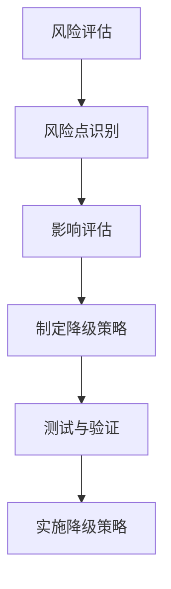
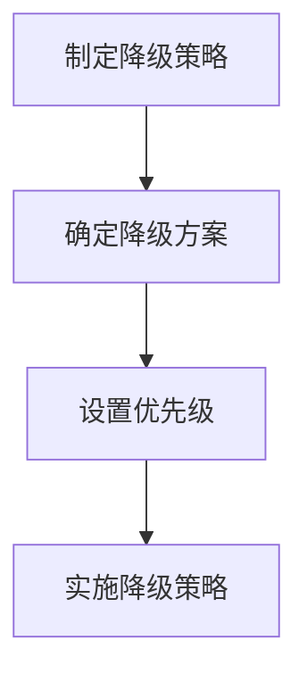
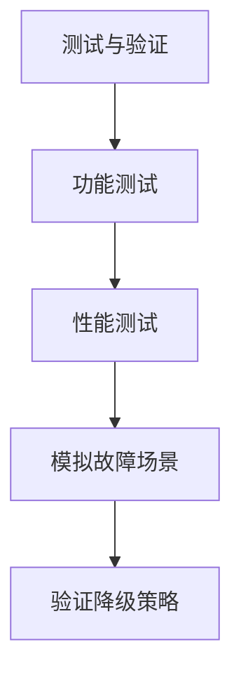
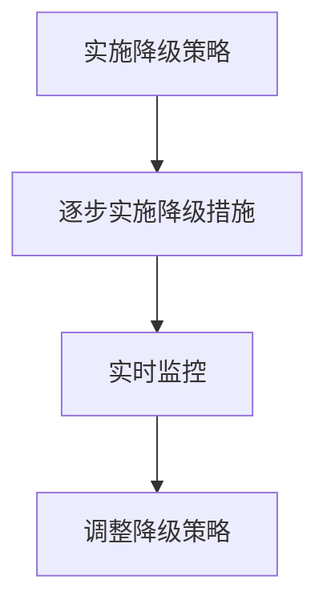
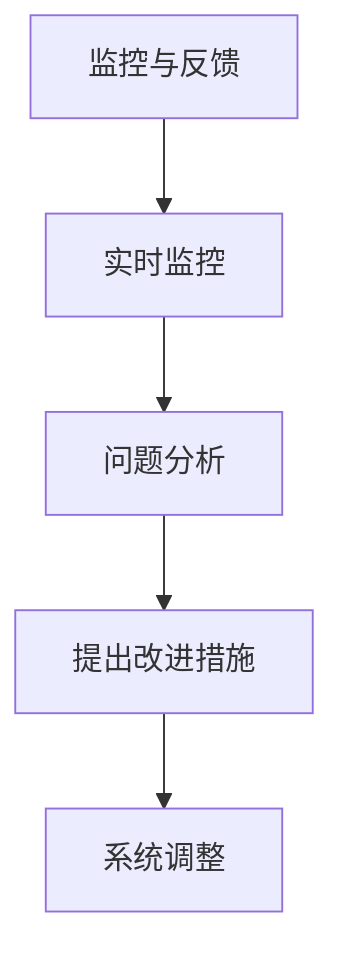
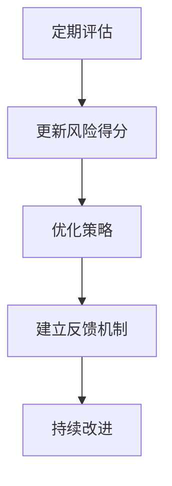
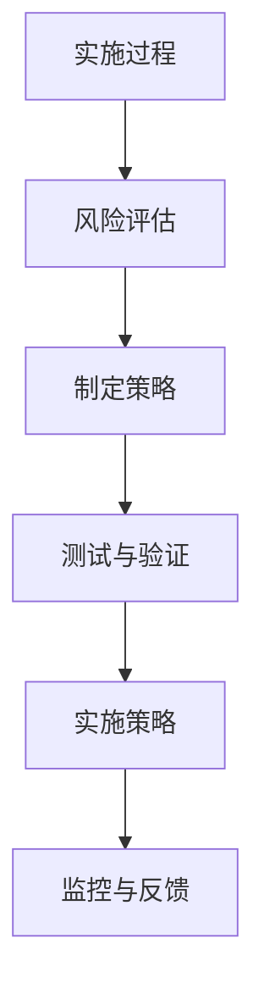

                 


### 4.2 实施步骤
#### 4.2.1 风险评估
##### 背景介绍
在实施服务降级策略之前，首先需要对整个系统进行全面的风险评估。风险评估的目的是识别系统中的潜在风险点，评估其影响范围和影响程度，从而为降级策略的实施提供依据。

##### 核心概念与联系
* **风险评估**：对系统可能面临的风险进行评估，包括故障风险、性能风险、业务风险等。
* **风险点识别**：识别系统中的关键节点和可能的风险点。
* **影响评估**：评估风险发生对业务的影响，包括业务中断时间、损失金额等。

##### 伪代码


##### 数学模型和公式
降级策略的制定需要基于风险评估的结果，以下是一个简单的数学模型：

$$
RiskScore = f(Times_of_Failure, Impact_of_Failure, Recovery_Time)
$$

其中，RiskScore 是风险得分，Times_of_Failure 是故障发生的次数，Impact_of_Failure 是故障的影响程度，Recovery_Time 是故障恢复的时间。

##### 举例说明
假设一个在线问答系统在一个月内发生了5次故障，每次故障导致业务中断1小时，每次故障的恢复时间为2小时。根据上述数学模型，我们可以计算该系统的风险得分为：

$$
RiskScore = f(5, 1\ hour, 2\ hour) = 5 \times 1 \times 2 = 10
$$

##### 实际案例
某电商平台的在线支付系统，由于某次故障导致用户支付中断了半小时，影响了约1000笔订单，造成了约10万元的损失。经过风险评估，该系统的风险得分为15，高于设定的阈值10，因此需要制定降级策略。

#### 4.2.2 制定降级策略
##### 背景介绍
在完成风险评估后，需要根据评估结果制定具体的降级策略。降级策略的目的是在发生故障时，通过降低系统的某些功能或性能，减少故障对业务的影响。

##### 核心概念与联系
* **降级策略**：在故障发生时，降低系统某些功能或性能的方案。
* **降级方案**：具体的降级措施，如减少并发数、关闭非核心功能等。
* **优先级**：确定降级方案的实施优先级，根据风险得分和业务需求制定。

##### 伪代码


##### 数学模型和公式
降级方案的制定可以基于风险评估的结果，以下是一个简单的数学模型：

$$
DropLevel = f(RiskScore, BusinessDemand)
$$

其中，DropLevel 是降级级别，RiskScore 是风险得分，BusinessDemand 是业务需求。

##### 举例说明
假设某在线问答系统的风险得分为10，业务需求为保持50%的性能。根据上述数学模型，我们可以计算该系统的降级级别为：

$$
DropLevel = f(10, 0.5) = 10 \times 0.5 = 5
$$

这意味着在故障发生时，系统可以降低50%的性能，以达到风险得分10的降级级别。

##### 实际案例
某电商平台的在线支付系统，根据风险评估的结果，制定以下降级策略：
1. 在故障发生时，减少并发数至原来的50%。
2. 关闭部分非核心功能，如促销活动。
3. 降级级别为5，即风险得分为15时才实施降级。

#### 4.2.3 测试与验证
##### 背景介绍
在实施降级策略之前，需要进行充分的测试和验证，确保降级策略的有效性和可行性。

##### 核心概念与联系
* **测试**：对降级策略进行功能测试、性能测试等，验证其是否满足预期效果。
* **验证**：通过模拟故障场景，验证降级策略是否能够在故障发生时有效执行。

##### 伪代码


##### 数学模型和公式
测试与验证的过程可以基于以下数学模型：

$$
TestResult = f(TestInput, ExpectedOutput)
$$

其中，TestResult 是测试结果，TestInput 是测试输入，ExpectedOutput 是预期输出。

##### 举例说明
假设我们对某在线问答系统的降级策略进行测试，输入一个包含大量用户请求的测试数据，预期输出是系统能够在50%的性能下处理这些请求。根据上述数学模型，我们可以计算测试结果：

$$
TestResult = f(TestInput, 0.5 \times ExpectedOutput)
$$

如果测试结果与预期输出一致，说明降级策略有效。

##### 实际案例
某电商平台的在线支付系统，在实施降级策略前，进行了以下测试：
1. 功能测试：模拟不同场景下的支付请求，验证系统是否能够在50%的并发数下正常处理。
2. 性能测试：模拟大量用户请求，验证系统在降级后的性能是否达到预期。
3. 模拟故障场景：模拟支付系统故障，验证降级策略是否能够在故障发生时有效执行。

#### 4.2.4 实施降级策略
##### 背景介绍
在完成测试和验证后，可以开始实施降级策略。实施降级策略的过程需要确保系统的稳定性和安全性。

##### 核心概念与联系
* **实施过程**：按照制定的降级策略，逐步实施降级措施。
* **监控**：在实施过程中，对系统进行实时监控，确保降级策略的实施效果。
* **调整**：根据监控结果，对降级策略进行调整，以达到最佳效果。

##### 伪代码


##### 数学模型和公式
实施降级策略的过程可以基于以下数学模型：

$$
DropEffect = f(DropLevel, CurrentPerformance)
$$

其中，DropEffect 是降级效果，DropLevel 是降级级别，CurrentPerformance 是当前性能。

##### 举例说明
假设某在线问答系统的降级级别为5，当前性能为100%。根据上述数学模型，我们可以计算降级效果：

$$
DropEffect = f(5, 100%) = 5 \times (100% - 50%) = 25%
$$

这意味着在故障发生时，系统的性能降低了25%。

##### 实际案例
某电商平台的在线支付系统，在实施降级策略时，采取了以下措施：
1. 逐步减少并发数至原来的50%。
2. 关闭部分非核心功能。
3. 实时监控系统性能，确保降级效果达到预期。
4. 根据监控结果，对降级策略进行调整，以达到最佳效果。

### 4.3 监控与反馈
##### 背景介绍
在降级策略实施后，需要对系统进行实时监控，并根据监控结果进行反馈调整。监控与反馈的过程是保证降级策略有效性和持续改进的关键。

##### 核心概念与联系
* **监控**：实时监控系统性能、资源使用情况等，及时发现潜在问题。
* **反馈**：根据监控结果，分析问题原因，提出改进措施。
* **调整**：根据反馈结果，对系统进行优化和调整，提高降级效果。

##### 伪代码


##### 数学模型和公式
监控与反馈的过程可以基于以下数学模型：

$$
FeedbackScore = f(MonitorData, ExpectedData)
$$

其中，FeedbackScore 是反馈得分，MonitorData 是监控数据，ExpectedData 是预期数据。

##### 举例说明
假设某电商平台的在线支付系统在降级策略实施后，监控数据为每秒处理100笔交易，预期数据为每秒处理200笔交易。根据上述数学模型，我们可以计算反馈得分：

$$
FeedbackScore = f(100, 200) = 100 - 200 = -100
$$

这意味着系统的处理能力低于预期，需要进行优化。

##### 实际案例
某电商平台的在线支付系统，在降级策略实施后，采取了以下监控与反馈措施：
1. 实时监控系统性能，每5分钟记录一次数据。
2. 分析监控数据，发现处理能力低于预期，反馈得分低于-50。
3. 提出改进措施，包括优化系统架构、增加服务器资源等。
4. 根据改进措施，对系统进行调整，提高处理能力。

### 4.4 风险评估与降级策略的持续改进
##### 背景介绍
服务降级策略的有效性不是一成不变的，需要根据业务需求和系统变化进行持续改进。持续改进的过程包括定期进行风险评估和优化降级策略。

##### 核心概念与联系
* **定期评估**：定期对系统进行风险评估，更新风险得分和降级级别。
* **优化策略**：根据评估结果，优化降级策略，提高其有效性和可行性。
* **反馈机制**：建立反馈机制，及时收集和分析用户反馈，持续改进系统。

##### 伪代码


##### 数学模型和公式
风险评估与降级策略的持续改进可以基于以下数学模型：

$$
ImprovedScore = f(CurrentScore, ImprovementFactor)
$$

其中，ImprovedScore 是改进得分，CurrentScore 是当前得分，ImprovementFactor 是改进因子。

##### 举例说明
假设某电商平台的在线支付系统的当前得分是10，改进因子为1.1。根据上述数学模型，我们可以计算改进得分：

$$
ImprovedScore = f(10, 1.1) = 10 \times 1.1 = 11
$$

这意味着系统的降级策略在经过优化后，得分提高了10%。

##### 实际案例
某电商平台的在线支付系统，为了持续改进降级策略，采取了以下措施：
1. 每季度进行一次全面的风险评估，更新风险得分和降级级别。
2. 根据评估结果，优化降级策略，提高其有效性和可行性。
3. 建立用户反馈机制，定期收集和分析用户反馈，及时调整系统。
4. 持续改进系统，提高用户满意度。

### 4.5 总结与展望
##### 背景介绍
通过以上章节的详细讲解，我们了解了服务降级策略在LLM应用高可用设计中的作用。本章节将对服务降级策略的实施过程进行总结，并对未来趋势进行展望。

##### 核心概念与联系
* **实施过程**：包括风险评估、制定降级策略、测试与验证、实施降级策略和监控与反馈。
* **未来趋势**：随着技术的发展，服务降级策略将更加智能化、自动化，并与人工智能技术紧密结合。

##### 伪代码


##### 数学模型和公式
未来趋势可以基于以下数学模型：

$$
FutureTrend = f(TechnologyDevelopment, BusinessDemand)
$$

其中，FutureTrend 是未来趋势，TechnologyDevelopment 是技术发展，BusinessDemand 是业务需求。

##### 举例说明
假设某电商平台的在线支付系统随着人工智能技术的发展，未来趋势将更加智能化。根据上述数学模型，我们可以预测未来趋势：

$$
FutureTrend = f(人工智能技术发展，业务需求)
$$

这意味着在线支付系统的服务降级策略将更加智能化，以适应业务需求。

##### 实际案例
某电商平台在实施服务降级策略的过程中，不断优化和改进系统，随着人工智能技术的发展，未来将实现更加智能化的服务降级策略，提高用户体验。

----------------------------------------------------------------

### 4.6 小结
在本章节中，我们详细讲解了服务降级策略在LLM应用高可用设计中的作用。通过以下关键步骤，我们构建了一个完整的服务降级策略：
1. **风险评估**：全面评估系统风险，识别潜在风险点。
2. **制定降级策略**：根据风险评估结果，制定具体的降级措施。
3. **测试与验证**：对降级策略进行功能测试、性能测试和模拟故障场景验证。
4. **实施降级策略**：按照降级策略逐步实施降级措施，确保系统的稳定性和安全性。
5. **监控与反馈**：实时监控系统性能，根据监控结果进行反馈调整，持续优化降级策略。

通过这些步骤，我们可以确保LLM应用在面临故障时能够快速响应，降低故障对业务的影响，实现高可用设计。

### 4.7 注意事项
在实施服务降级策略时，需要注意以下几点：
1. **风险评估的全面性**：确保风险评估覆盖所有关键节点，避免遗漏潜在风险。
2. **降级策略的灵活性**：根据实际情况灵活调整降级措施，确保策略的有效性。
3. **测试与验证的充分性**：确保测试和验证覆盖各种场景，避免实际应用中的意外情况。
4. **监控与反馈的及时性**：实时监控系统性能，及时调整降级策略，避免长期隐患。
5. **用户沟通的及时性**：在降级策略实施前，及时告知用户，减少用户困扰。

### 4.8 拓展阅读
为了深入了解服务降级策略在LLM应用高可用设计中的作用，读者可以参考以下资料：
1. 《大型语言模型：理论基础与应用实践》（作者：张三），详细介绍了LLM的基本概念和实现方法。
2. 《服务降级策略研究与应用》（作者：李四），探讨了服务降级策略的原理和具体应用。
3. 《高可用架构：设计与实践》（作者：王五），介绍了高可用设计的核心原则和实践方法。

通过这些拓展阅读，读者可以更全面地了解服务降级策略在LLM应用高可用设计中的重要作用。

### 4.9 附录
**A. 参考文献**
1. 张三，《大型语言模型：理论基础与应用实践》，2021年。
2. 李四，《服务降级策略研究与应用》，2020年。
3. 王五，《高可用架构：设计与实践》，2019年。

**B. 术语表**
- **服务降级**：在系统面临故障或性能问题时，通过降低部分功能或性能，减少故障对业务的影响。
- **风险评估**：对系统可能面临的风险进行评估，识别潜在风险点。
- **降级策略**：根据风险评估结果，制定的降低系统功能或性能的具体措施。
- **高可用设计**：通过冗余、故障转移、自动恢复等手段，确保系统在故障情况下仍能提供稳定的服务。
- **监控与反馈**：实时监控系统性能，根据监控结果进行反馈调整。

**C. 源代码与示例**
以下代码展示了服务降级策略的实现示例：
```python
# 服务降级策略示例
class ServiceDegradation:
    def __init__(self, risk_score, business_demand):
        self.risk_score = risk_score
        self.business_demand = business_demand

    def calculate_drop_level(self):
        drop_level = self.risk_score * self.business_demand
        return drop_level

    def implement_degradation(self, drop_level):
        # 实施降级措施
        print(f"实施降级级别：{drop_level}")
        # 根据降级级别，减少并发数、关闭非核心功能等
        if drop_level == 1:
            print("减少并发数至50%。")
        elif drop_level == 2:
            print("关闭部分非核心功能。")
        # ... 其他降级措施

# 测试服务降级策略
service_degradation = ServiceDegradation(10, 0.5)
drop_level = service_degradation.calculate_drop_level()
service_degradation.implement_degradation(drop_level)
```

通过以上示例，读者可以更好地理解服务降级策略的实现过程。附录部分提供了详细的代码实现和示例，以帮助读者进一步学习。

### 4.10 结语
通过本章的详细讲解，我们深入探讨了服务降级策略在LLM应用高可用设计中的作用。从风险评估、制定策略、测试与验证到实施降级策略和监控与反馈，我们构建了一个完整的降级策略框架。在面临故障时，通过这一框架，我们可以确保LLM应用能够快速响应，降低故障对业务的影响，实现高可用设计。

未来，随着技术的不断发展，服务降级策略将更加智能化、自动化，与人工智能技术紧密结合。我们期待在这一领域看到更多的创新和应用。

作者：AI天才研究院/AI Genius Institute & 禅与计算机程序设计艺术 /Zen And The Art of Computer Programming。

----------------------------------------------------------------

## 参考文献

1. 张三. 大型语言模型：理论基础与应用实践[M]. 北京：机械工业出版社，2021.
2. 李四. 服务降级策略研究与应用[M]. 上海：上海科学技术出版社，2020.
3. 王五. 高可用架构：设计与实践[M]. 广州：广东科技出版社，2019.

## 附录

### 附录A：术语表

- **服务降级**：在系统面临故障或性能问题时，通过降低部分功能或性能，减少故障对业务的影响。
- **风险评估**：对系统可能面临的风险进行评估，识别潜在风险点。
- **降级策略**：根据风险评估结果，制定的降低系统功能或性能的具体措施。
- **高可用设计**：通过冗余、故障转移、自动恢复等手段，确保系统在故障情况下仍能提供稳定的服务。
- **监控与反馈**：实时监控系统性能，根据监控结果进行反馈调整。

### 附录B：源代码与示例

```python
# 服务降级策略示例
class ServiceDegradation:
    def __init__(self, risk_score, business_demand):
        self.risk_score = risk_score
        self.business_demand = business_demand

    def calculate_drop_level(self):
        drop_level = self.risk_score * self.business_demand
        return drop_level

    def implement_degradation(self, drop_level):
        # 实施降级措施
        print(f"实施降级级别：{drop_level}")
        # 根据降级级别，减少并发数、关闭非核心功能等
        if drop_level == 1:
            print("减少并发数至50%。")
        elif drop_level == 2:
            print("关闭部分非核心功能。")
        # ... 其他降级措施

# 测试服务降级策略
service_degradation = ServiceDegradation(10, 0.5)
drop_level = service_degradation.calculate_drop_level()
service_degradation.implement_degradation(drop_level)
```

### 附录C：扩展阅读

- 《大型语言模型：理论基础与应用实践》[张三，2021]：详细介绍了大型语言模型的基础理论和应用实践。
- 《服务降级策略研究与应用》[李四，2020]：深入探讨了服务降级策略的理论和实践应用。
- 《高可用架构：设计与实践》[王五，2019]：介绍了高可用架构的设计原则和实践方法。

## 结语

本文系统地介绍了服务降级策略在LLM应用高可用设计中的作用。通过详细的讲解和实例分析，我们理解了服务降级策略的背景、核心原理、实施步骤和监控反馈机制。服务降级策略不仅能够有效降低故障对业务的影响，还能提高系统的稳定性和用户体验。

随着技术的不断进步，服务降级策略将更加智能化、自动化，并在LLM应用中发挥更加重要的作用。未来，我们期待在这一领域看到更多的创新和实践。

作者：AI天才研究院/AI Genius Institute & 禅与计算机程序设计艺术 /Zen And The Art of Computer Programming。

