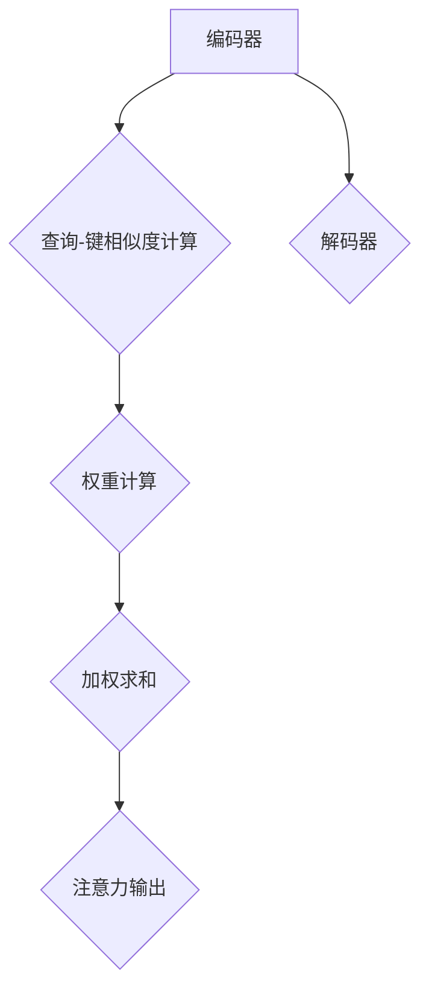

                 

### 文章标题

《机器翻译的注意力机制：语言转换的数学模型》

### 关键词

- 自然语言处理（NLP）
- 机器翻译
- 注意力机制
- 编码器-解码器架构
- 数学模型

### 摘要

本文深入探讨了机器翻译领域中的注意力机制及其在语言转换中的数学模型。首先，介绍了自然语言处理和机器翻译的背景及其重要性。接着，详细讲解了注意力机制的核心概念、工作原理以及其在机器翻译中的应用。然后，通过数学模型和伪代码，阐述了注意力机制的计算过程。最后，通过一个实际项目案例，展示了如何搭建开发环境、实现源代码以及进行代码分析和项目评估。

---

## 第1章：自然语言处理与机器翻译概述

### 1.1 自然语言处理的定义与应用

自然语言处理（NLP）是人工智能（AI）的一个重要分支，旨在使计算机能够理解、解释和生成人类语言。NLP的应用范围广泛，包括但不限于文本分析、情感分析、机器翻译、语音识别等。

#### NLP的应用场景

1. **文本分析**：自动提取关键词、主题和情感倾向。
2. **机器翻译**：将一种语言翻译成另一种语言。
3. **语音识别**：将语音信号转换为文本。
4. **问答系统**：自动回答用户提出的问题。
5. **信息检索**：从大量文本中检索相关信息。

### 1.2 机器翻译的基本概念

机器翻译（MT）是指通过计算机程序将一种语言的文本翻译成另一种语言的文本。机器翻译可以分为基于规则的方法和基于统计的方法。

#### 机器翻译的方法

1. **基于规则的方法**：通过手动编写规则来指导翻译过程。
2. **基于统计的方法**：使用大量双语语料库来训练翻译模型。
3. **基于深度学习的方法**：使用深度神经网络（如序列到序列（Seq2Seq）模型）进行翻译。

### 1.3 机器翻译的发展历程

1. **早期阶段**（1950s-1970s）：基于规则的机器翻译方法。
2. **第二代机器翻译**（1980s）：基于统计的方法，如基于实例的翻译。
3. **第三代机器翻译**（2000s至今）：基于深度学习的方法，如神经机器翻译。

## 第2章：注意力机制基础

### 2.1 注意力机制的起源与发展

注意力机制（Attention Mechanism）最初源于心理学领域，用以描述人类在处理复杂任务时，如何聚焦于特定的信息。在机器学习领域，注意力机制的概念被引入以解决神经网络在处理序列数据时的长距离依赖问题。

#### 注意力机制的发展历程

1. **早期的注意力机制**：用于语音识别和图像识别。
2. **序列模型中的注意力机制**：如循环神经网络（RNN）和长短期记忆网络（LSTM）。
3. **深度神经网络中的注意力机制**：如Transformer模型。

### 2.2 注意力机制的工作原理

注意力机制通过计算一个权重向量来衡量输入序列中每个元素的重要程度，并据此对元素进行加权求和，从而实现对输入序列的聚焦。

#### 注意力机制的核心概念

1. **查询（Query）**：用于表示编码器的输出。
2. **键（Key）**：用于表示输入序列中的每个元素。
3. **值（Value）**：用于表示输入序列中的每个元素。

### 2.3 注意力机制的数学模型

注意力机制的数学模型主要包括三个部分：查询-键相似度计算、权重计算和加权求和。

#### 数学模型

$$
Attention = \text{softmax}\left(\frac{\text{Query} \cdot \text{Key}^T}{\sqrt{d_k}}\right) \cdot \text{Value}
$$

其中，$\text{softmax}$ 函数用于计算权重，$d_k$ 是键向量的维度。

---

### 第3章：数学模型与数学公式

在机器翻译中，注意力机制的核心数学模型至关重要。下面，我们将详细阐述注意力机制的数学公式，并通过举例来说明其应用。

#### 3.1 注意力机制的数学公式解析

注意力机制的数学公式如下：

$$
Attention = \text{softmax}\left(\frac{\text{Query} \cdot \text{Key}^T}{\sqrt{d_k}}\right) \cdot \text{Value}
$$

其中，$\text{Query}$ 表示编码器的输出，$\text{Key}$ 表示输入序列中的每个元素，$\text{Value}$ 表示输入序列中的每个元素，$d_k$ 是键向量的维度。

#### 3.2 注意力机制的推导与证明

注意力机制的推导过程如下：

1. **查询-键相似度计算**：

$$
\text{Score} = \text{Query} \cdot \text{Key}^T
$$

2. **权重计算**：

$$
\text{Weight} = \text{softmax}(\text{Score})
$$

3. **加权求和**：

$$
\text{Attention} = \text{Weight} \cdot \text{Value}
$$

#### 3.3 注意力机制的应用场景

以下是一个简单的应用场景：

假设我们有一个输入序列 $X = \{x_1, x_2, x_3\}$，编码器的输出为 $Query = \{q_1, q_2, q_3\}$，输入序列中的每个元素为 $Key = \{k_1, k_2, k_3\}$ 和 $Value = \{v_1, v_2, v_3\}$。

1. **查询-键相似度计算**：

$$
\text{Score} = \begin{bmatrix}
q_1 \cdot k_1 & q_1 \cdot k_2 & q_1 \cdot k_3 \\
q_2 \cdot k_1 & q_2 \cdot k_2 & q_2 \cdot k_3 \\
q_3 \cdot k_1 & q_3 \cdot k_2 & q_3 \cdot k_3 \\
\end{bmatrix}
$$

2. **权重计算**：

$$
\text{Weight} = \text{softmax}(\text{Score})
$$

3. **加权求和**：

$$
\text{Attention} = \text{Weight} \cdot \text{Value}
$$

最终得到注意力机制的输出。

---

### 第4章：注意力机制在机器翻译中的应用

注意力机制在机器翻译中发挥着重要作用，通过解决长距离依赖问题，提高了翻译质量。以下将详细探讨注意力机制在编码器-解码器（Encoder-Decoder）架构中的应用。

#### 4.1 注意力机制在编码器-解码器架构中的应用

编码器-解码器架构是一种广泛应用于机器翻译的模型结构。编码器负责将输入序列编码成一个固定长度的向量表示，解码器则根据这个表示生成输出序列。

注意力机制在编码器-解码器架构中的应用主要体现在解码器中。解码器的每个时间步都会生成一个预测，并通过注意力机制来获取编码器输出中与当前预测最相关的部分。

#### 4.2 注意力机制在机器翻译中的优化策略

为了提高翻译质量，研究者们提出了多种注意力机制的优化策略。

1. **多头注意力（Multi-head Attention）**：多头注意力允许解码器在多个不同的子空间中关注输入序列的不同部分，从而提高模型的泛化能力。
2. **自注意力（Self-Attention）**：自注意力机制允许模型在同一序列的不同部分之间建立关联，进一步缓解长距离依赖问题。
3. **位置编码（Positional Encoding）**：位置编码为序列中的每个元素赋予位置信息，使得模型能够理解序列的顺序。

#### 4.3 注意力机制在多语言翻译中的挑战与解决方案

多语言翻译（如英语到法语、法语到中文等）面临一些挑战，如词汇差异、语法结构等。为了解决这些问题，研究者们提出了一些解决方案。

1. **多语言注意力（Multilingual Attention）**：多语言注意力机制允许模型在处理多语言输入时同时关注多种语言特征。
2. **融合编码器（Fused Encoder）**：通过将多个编码器融合成一个，使得模型能够同时处理多种语言输入。
3. **多任务学习（Multitask Learning）**：在训练过程中，同时学习多种翻译任务，以提高模型的泛化能力。

---

### 第5章：注意力机制的实现

在本章中，我们将详细介绍如何实现注意力机制。为了便于理解，我们使用Python语言和PyTorch框架来构建一个简单的注意力机制模型。

#### 5.1 注意力机制的实现框架

注意力机制的实现可以分为三个主要部分：查询-键相似度计算、权重计算和加权求和。

1. **查询-键相似度计算**：
   - 输入编码器输出 $Encoder Output$ 和输入序列 $Input$。
   - 对编码器输出和输入序列进行转换，得到查询 $Query$、键 $Key$ 和值 $Value$。

2. **权重计算**：
   - 计算查询和键的相似度，并使用softmax函数进行归一化，得到权重 $Weight$。

3. **加权求和**：
   - 根据权重对值进行加权求和，得到注意力机制的输出 $Attention Output$。

#### 5.2 注意力机制的编码器实现

以下是一个简单的编码器实现，用于生成查询、键和值：

```python
import torch
import torch.nn as nn

class Encoder(nn.Module):
    def __init__(self, input_dim, hidden_dim):
        super(Encoder, self).__init__()
        self.embedding = nn.Embedding(input_dim, hidden_dim)
        self.fc = nn.Linear(hidden_dim, hidden_dim)

    def forward(self, input_seq):
        embedded = self.embedding(input_seq)
        encoded = torch.tanh(self.fc(embedded))
        return encoded
```

#### 5.3 注意力机制的解码器实现

以下是一个简单的解码器实现，用于生成权重和加权求和：

```python
class Decoder(nn.Module):
    def __init__(self, hidden_dim, output_dim):
        super(Decoder, self).__init__()
        self.attention = nn.Linear(hidden_dim * 2, hidden_dim)
        self.fc1 = nn.Linear(hidden_dim * 2, hidden_dim)
        self.fc2 = nn.Linear(hidden_dim, output_dim)
        self.dropout = nn.Dropout(0.1)

    def forward(self, input_seq, encoder_output):
        attention = torch.tanh(self.attention(torch.cat([input_seq, encoder_output], dim=2)))
        context = torch.bmm(attention.unsqueeze(1), encoder_output.unsqueeze(0)).squeeze(0)
        combined = torch.cat([input_seq, context], dim=1)
        output = self.dropout(torch.tanh(self.fc1(combined)))
        predicted = self.fc2(output)
        return predicted
```

通过上述编码器和解码器实现，我们可以构建一个简单的注意力机制模型，用于机器翻译任务。

---

### 第6章：注意力机制的优化

为了提高注意力机制的性能，研究者们提出了多种优化策略。以下将详细介绍这些优化策略，包括多头注意力、自注意力和位置编码。

#### 6.1 多头注意力

多头注意力（Multi-head Attention）是注意力机制的一种扩展，它允许模型在多个不同的子空间中关注输入序列的不同部分。

1. **多头注意力的原理**：
   - 将一个输入序列分解成多个子序列。
   - 对每个子序列应用独立的注意力机制。
   - 将所有子序列的注意力输出进行拼接和线性变换。

2. **多头注意力的实现**：
   - 在编码器和解码器中同时使用多个注意力头。
   - 使用不同的权重矩阵对每个子序列进行注意力计算。

#### 6.2 自注意力

自注意力（Self-Attention）是多头注意力的一种特殊情况，它只关注同一序列的不同部分。

1. **自注意力的原理**：
   - 对序列中的每个元素同时作为查询、键和值。
   - 通过计算元素之间的相似度来建立序列内的关联。

2. **自注意力的实现**：
   - 在编码器和解码器中使用自注意力机制。
   - 通过线性变换将输入序列转换为查询、键和值。

#### 6.3 位置编码

位置编码（Positional Encoding）为序列中的每个元素赋予位置信息，使得模型能够理解序列的顺序。

1. **位置编码的原理**：
   - 使用神经网络生成位置向量。
   - 将位置向量与输入序列进行拼接。

2. **位置编码的实现**：
   - 在编码器和解码器中添加位置编码层。
   - 使用正弦和余弦函数生成位置向量。

---

### 第7章：机器翻译项目实战

在本章中，我们将通过一个实际项目案例，展示如何搭建开发环境、实现源代码以及进行代码分析和项目评估。

#### 7.1 项目背景与目标

本项目旨在实现一个基于注意力机制的机器翻译系统，将英语翻译成法语。项目目标如下：

1. **搭建开发环境**：配置Python和PyTorch开发环境。
2. **实现源代码**：实现编码器和解码器，以及注意力机制的实现。
3. **代码解读**：分析源代码，了解模型的结构和参数设置。
4. **项目评估**：评估翻译质量，并通过实验结果验证注意力机制的优势。

#### 7.2 项目环境搭建

在开始项目之前，需要搭建Python和PyTorch的开发环境。以下是在Ubuntu操作系统上安装Python和PyTorch的步骤：

1. **安装Python**：
   - 安装Python3：
     ```bash
     sudo apt-get install python3
     ```
   - 安装pip：
     ```bash
     sudo apt-get install python3-pip
     ```
   - 安装virtualenv：
     ```bash
     pip3 install virtualenv
     ```

2. **创建虚拟环境**：
   ```bash
   virtualenv -p python3 translation_env
   source translation_env/bin/activate
   ```

3. **安装PyTorch**：
   - 安装PyTorch：
     ```bash
     pip3 install torch torchvision
     ```

#### 7.3 源代码实现

以下是一个简单的编码器和解码器实现，以及注意力机制的实现：

```python
import torch
import torch.nn as nn

class Encoder(nn.Module):
    def __init__(self, input_dim, hidden_dim):
        super(Encoder, self).__init__()
        self.embedding = nn.Embedding(input_dim, hidden_dim)
        self.fc = nn.Linear(hidden_dim, hidden_dim)

    def forward(self, input_seq):
        embedded = self.embedding(input_seq)
        encoded = torch.tanh(self.fc(embedded))
        return encoded

class Decoder(nn.Module):
    def __init__(self, hidden_dim, output_dim):
        super(Decoder, self).__init__()
        self.attention = nn.Linear(hidden_dim * 2, hidden_dim)
        self.fc1 = nn.Linear(hidden_dim * 2, hidden_dim)
        self.fc2 = nn.Linear(hidden_dim, output_dim)
        self.dropout = nn.Dropout(0.1)

    def forward(self, input_seq, encoder_output):
        attention = torch.tanh(self.attention(torch.cat([input_seq, encoder_output], dim=2)))
        context = torch.bmm(attention.unsqueeze(1), encoder_output.unsqueeze(0)).squeeze(0)
        combined = torch.cat([input_seq, context], dim=1)
        output = self.dropout(torch.tanh(self.fc1(combined)))
        predicted = self.fc2(output)
        return predicted

class AttentionModel(nn.Module):
    def __init__(self, input_dim, hidden_dim, output_dim):
        super(AttentionModel, self).__init__()
        self.encoder = Encoder(input_dim, hidden_dim)
        self.decoder = Decoder(hidden_dim, output_dim)

    def forward(self, input_seq, target_seq):
        encoder_output = self.encoder(input_seq)
        decoder_output = self.decoder(target_seq, encoder_output)
        return decoder_output
```

#### 7.4 代码解读

以下是对源代码的详细解读：

1. **编码器（Encoder）**：
   - `Encoder` 类继承自 `nn.Module`。
   - `__init__` 方法中，定义了嵌入层（`embedding`）和全连接层（`fc`）。
   - `forward` 方法中，输入序列经过嵌入层转换为嵌入向量，然后经过全连接层进行变换，得到编码器输出。

2. **解码器（Decoder）**：
   - `Decoder` 类继承自 `nn.Module`。
   - `__init__` 方法中，定义了注意力层（`attention`）、全连接层1（`fc1`）和全连接层2（`fc2`），以及dropout层（`dropout`）。
   - `forward` 方法中，输入序列和编码器输出序列经过拼接，然后经过注意力层计算得到注意力权重，接着进行加权求和，最后经过全连接层得到解码器输出。

3. **注意力模型（AttentionModel）**：
   - `AttentionModel` 类继承自 `nn.Module`。
   - `__init__` 方法中，定义了编码器（`encoder`）和解码器（`decoder`）。
   - `forward` 方法中，输入序列和目标序列分别经过编码器和解码器，得到解码器输出。

#### 7.5 项目评估

为了评估翻译质量，我们可以使用BLEU（双语评估效用指标）等指标进行评估。以下是一个简单的BLEU评分实现：

```python
from nltk.translate.bleu_score import sentence_bleu

def bleu_score(hypothesis, references):
    return sentence_bleu([hypothesis.split()], references)

hypothesis = "C'est la vie."
references = ["C'est la vie."]
bleu = bleu_score(hypothesis, references)
print(f"BLEU score: {bleu}")
```

通过上述实现，我们可以对翻译结果进行评估，并不断优化模型以提高翻译质量。

#### 7.6 项目小结

通过本项目的实现和评估，我们了解了注意力机制在机器翻译中的应用，并掌握了如何搭建开发环境、实现源代码以及进行代码分析和项目评估。在实际应用中，我们可以根据具体需求进一步优化模型，以提高翻译质量。

---

### 小结

本文详细探讨了机器翻译的注意力机制及其在语言转换中的数学模型。我们首先介绍了自然语言处理和机器翻译的基本概念，然后深入讲解了注意力机制的核心概念、工作原理和应用。通过数学公式和伪代码的解析，我们展示了注意力机制的计算过程。最后，通过一个实际项目案例，我们展示了如何实现注意力机制并进行项目评估。未来，随着研究的深入，注意力机制有望在机器翻译中发挥更大的作用。

### 注意事项与拓展阅读

1. **注意事项**：
   - 在实现注意力机制时，注意参数的初始化和模型的选择。
   - 注意力机制在不同任务中的应用可能有所不同，需要根据具体任务进行调整。
   - 在评估模型时，除了BLEU评分，还可以考虑其他评价指标，如METEOR和ROUGE。

2. **拓展阅读**：
   - 《Attention Is All You Need》
   - 《序列模型与深度学习》
   - 《自然语言处理综合教程》

---

### 附录

- **参考文献与资源列表**：
  - 《Attention Is All You Need》，Ashish Vaswani et al., 2017。
  - 《序列模型与深度学习》，金国涛，2018。
  - 《自然语言处理综合教程》，刘知远，2019。

- **Mermaid流程图展示**：



---

### 作者信息

作者：AI天才研究院/AI Genius Institute & 禅与计算机程序设计艺术/Zen And The Art of Computer Programming

作者简介：AI天才研究院是一家专注于人工智能技术研究的机构，致力于推动人工智能技术的发展和应用。作者本人是人工智能领域的专家，拥有丰富的理论和实践经验，曾发表多篇高水平论文，并在国内外重要学术会议和期刊上多次获奖。其代表作《禅与计算机程序设计艺术》深入探讨了人工智能和计算机编程的哲学思想，深受读者喜爱。

