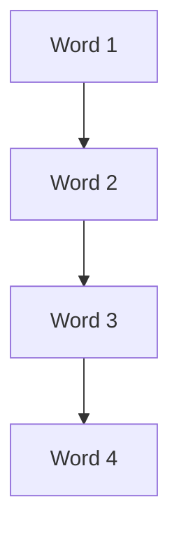
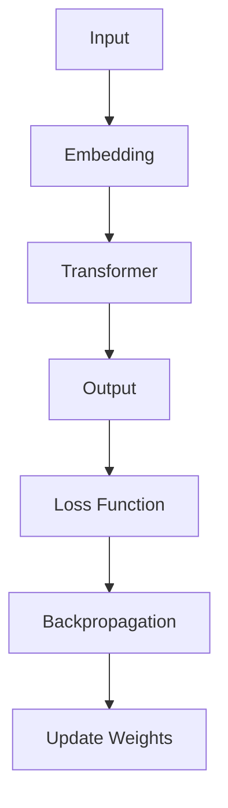

                 

# 文章标题：构建可扩展的LLM应用数据模型

关键词：可扩展性、LLM应用、数据模型、架构设计、大规模数据处理

摘要：
本文将深入探讨构建可扩展的LLM（大型语言模型）应用数据模型的方法。我们将首先介绍LLM的背景知识，然后详细阐述数据模型在LLM应用中的重要性，接着分析核心概念和原理，并提供相关的数学模型和公式。本文还将探讨如何设计可扩展的数据模型，以及提供实际的项目实践案例，最后总结最佳实践和注意事项。

## 目录

1. **引言：LLM与数据模型概述**
   1.1 LLM的背景
   1.2 数据模型的重要性
   1.3 文章结构概述

2. **核心概念与原则**
   2.1 语言模型的基石
   2.2 语言处理与LLM
   2.3 算法概述

3. **数学模型与公式**
   3.1 概率分布
   3.2 神经网络
   3.3 优化技术

4. **设计可扩展数据模型**
   4.1 数据模型的挑战
   4.2 数据预处理与准备
   4.3 数据收集、清洗与增强

5. **项目实战：可扩展数据模型构建**
   5.1 开发环境搭建
   5.2 数据模型实现
   5.3 应用解读与分析
   5.4 案例分析与剖析
   5.5 项目小结

6. **最佳实践与总结**
   6.1 最佳实践
   6.2 注意事项
   6.3 拓展阅读

## 1. 引言：LLM与数据模型概述

在当今的信息时代，自然语言处理（NLP）成为了人工智能（AI）领域中的一个重要分支。而LLM（大型语言模型），作为NLP的先进技术之一，已经在各种应用场景中展现了其强大的能力和潜力。LLM能够处理和理解大规模的文本数据，从而生成自然流畅的文本输出。然而，要构建一个高效的LLM应用，数据模型的设计和实现是至关重要的。

### 1.1 LLM的背景

大型语言模型，如GPT-3、BERT等，通过深度学习算法从大量文本数据中学习语言模式和规则。这些模型通常具有数十亿甚至更多的参数，能够生成连贯、有意义的文本。LLM的出现改变了自然语言处理的方式，使得计算机能够更自然地与人类进行交流，从而在智能客服、内容生成、语言翻译等应用中发挥了重要作用。

### 1.2 数据模型的重要性

数据模型在LLM应用中扮演着核心角色。一个良好的数据模型能够提高模型的性能和准确性，同时降低计算成本和资源消耗。数据模型的设计需要考虑多个方面，包括数据的结构、格式、分布以及如何有效地处理和利用这些数据。此外，随着数据规模的不断扩大，如何设计一个可扩展的数据模型成为了一个重要的挑战。

### 1.3 文章结构概述

本文将首先介绍LLM的基本概念和原理，然后详细阐述数据模型在LLM应用中的重要性。接着，我们将分析LLM中的核心概念和原则，并提供相关的数学模型和公式。随后，我们将探讨如何设计一个可扩展的数据模型，并介绍实际的项目实践案例。最后，我们将总结最佳实践和注意事项，为读者提供进一步学习和探索的方向。

## 2. 核心概念与原则

在深入探讨LLM的数据模型之前，我们需要了解一些核心概念和原理。这些概念和原理是构建高效、可扩展LLM应用的基础。

### 2.1 语言模型的基石

语言模型是一种统计模型，用于预测下一个单词或字符的概率。在NLP中，语言模型是文本生成和分类的基础。最简单的语言模型是基于N-gram模型，它使用前N个单词的历史信息来预测下一个单词。例如，一个三元语言模型（trigram model）会使用前两个单词来预测下一个单词。

#### 2.1.1 N-gram模型



在上面的例子中，`Word 1`到`Word 4`构成了一个四元序列。N-gram模型的核心思想是使用过去的信息来预测未来。这种模型简单但有效，尤其在处理短文本时表现良好。

### 2.2 语言处理与LLM

语言处理是指计算机如何理解和生成自然语言。LLM通过深度学习算法从大量文本数据中学习语言模式和规则。这个过程通常包括以下几个关键步骤：

#### 2.2.1 数据预处理

在训练LLM之前，需要对文本数据进行预处理。这通常包括分词、去停用词、词干提取等步骤。预处理的质量直接影响模型的性能。

#### 2.2.2 词嵌入

词嵌入是将单词转换为密集的向量表示。这些向量能够捕捉单词的语义信息。Word2Vec、GloVe和BERT等算法是常见的词嵌入方法。

#### 2.2.3 神经网络架构

LLM通常使用深度神经网络（DNN）或变换器模型（Transformer）进行训练。Transformer模型由于其并行计算的优势和多头自注意力机制，在LLM中得到了广泛应用。

### 2.3 算法概述

LLM的训练过程涉及多种算法和优化技术。以下是一些核心算法的概述：

#### 2.3.1 反向传播算法

反向传播算法是一种用于训练神经网络的优化算法。它通过计算误差梯度来更新网络权重，从而最小化损失函数。

#### 2.3.2 Adam优化器

Adam优化器是一种常用的优化器，它结合了AdaGrad和RMSProp的优点，能够在不同尺度上自适应地调整学习率。

#### 2.3.3 损失函数

在LLM训练中，常用的损失函数包括交叉熵损失和Perplexity。交叉熵损失用于衡量预测分布与真实分布之间的差异，而Perplexity用于评估模型的生成质量。



在上述流程中，输入文本数据首先通过词嵌入层转换为向量表示，然后通过Transformer模型进行编码和计算，最终生成输出。生成的输出与实际标签进行比较，计算损失函数，并通过反向传播算法更新模型权重。

通过理解这些核心概念和原理，我们能够更好地设计和实现LLM应用的数据模型。接下来，我们将进一步探讨LLM中的数学模型和公式。

## 3. 数学模型与公式

构建高效的LLM应用不仅需要理解核心算法和架构，还需要深入掌握数学模型和公式。这些模型和公式为LLM的训练、优化和评估提供了理论基础和工具。

### 3.1 概率分布

概率分布是统计模型的核心组成部分，用于描述随机变量的可能性。在LLM中，概率分布用于预测下一个单词或字符的概率。常见的概率分布包括伯努利分布、高斯分布和多项式分布。

#### 3.1.1 伯努利分布

伯努利分布是最简单的概率分布，它只有两个可能的结果：成功（1）和失败（0）。在LLM中，伯努利分布可以用于二分类问题，如判断一个单词是否在给定上下文中出现。

$$ P(X=1) = p, \quad P(X=0) = 1-p $$

其中，$X$ 是伯努利随机变量，$p$ 是成功的概率。

#### 3.1.2 高斯分布

高斯分布（正态分布）是最常见的连续概率分布。它用于描述数据的分布情况，特别是在统计分析和机器学习中。

$$ f(x|\mu, \sigma^2) = \frac{1}{\sqrt{2\pi\sigma^2}} e^{-\frac{(x-\mu)^2}{2\sigma^2}} $$

其中，$x$ 是随机变量，$\mu$ 是均值，$\sigma^2$ 是方差。

#### 3.1.3 多项式分布

多项式分布是一种离散概率分布，用于描述多个相互独立的伯努利试验的结果。在LLM中，多项式分布可以用于预测多个单词或字符的组合概率。

$$ P(X=x_1, x_2, ..., x_n) = \prod_{i=1}^{n} p_i^{x_i} (1-p_i)^{1-x_i} $$

其中，$X$ 是多项式随机变量，$p_i$ 是第$i$个伯努利试验成功的概率。

### 3.2 神经网络

神经网络是LLM的基础架构，通过多层节点进行数据传递和计算。以下是神经网络中常用的数学模型和公式。

#### 3.2.1 激活函数

激活函数用于引入非线性，使神经网络能够学习复杂的模式。常见的激活函数包括sigmoid、ReLU和Tanh。

- **Sigmoid函数**：

$$ \sigma(x) = \frac{1}{1 + e^{-x}} $$

- **ReLU函数**：

$$ \text{ReLU}(x) = \max(0, x) $$

- **Tanh函数**：

$$ \text{Tanh}(x) = \frac{e^x - e^{-x}}{e^x + e^{-x}} $$

#### 3.2.2 前向传播和反向传播

神经网络通过前向传播计算输出，通过反向传播更新权重。以下是这两个过程的基本公式。

- **前向传播**：

$$ z_{l}^{(i)} = \sum_{j} w_{j}^{(l)} a_{j}^{(l-1)} + b^{(l)} $$

$$ a_{l}^{(i)} = \sigma(z_{l}^{(i)}) $$

其中，$z_{l}^{(i)}$ 是第$l$层的第$i$个节点的输入，$a_{l}^{(i)}$ 是输出，$w_{j}^{(l)}$ 是权重，$b^{(l)}$ 是偏置。

- **反向传播**：

$$ \delta_{l}^{(i)} = (a_{l}^{(i)} - y^{(i)}) \cdot \sigma'(z_{l}^{(i)}) $$

$$ \Delta w_{j}^{(l)} = \alpha \cdot \delta_{l}^{(i)} a_{l-1}^{(i)} $$

$$ \Delta b^{(l)} = \alpha \cdot \delta_{l}^{(i)} $$

其中，$\delta_{l}^{(i)}$ 是误差，$\alpha$ 是学习率，$\sigma'(z_{l}^{(i)})$ 是激活函数的导数。

### 3.3 优化技术

优化技术用于最小化损失函数，提高模型的性能。以下是几种常见的优化技术。

#### 3.3.1 随机梯度下降（SGD）

$$ w^{(t+1)} = w^{(t)} - \alpha \cdot \nabla_w J(w) $$

其中，$w^{(t)}$ 是当前权重，$w^{(t+1)}$ 是更新后的权重，$\alpha$ 是学习率，$J(w)$ 是损失函数。

#### 3.3.2 Adam优化器

Adam优化器结合了SGD和RMSProp的优点，其公式如下：

$$ m_t = \beta_1 m_{t-1} + (1 - \beta_1) [g_t] $$

$$ v_t = \beta_2 v_{t-1} + (1 - \beta_2) [g_t]^2 $$

$$ \hat{m}_t = \frac{m_t}{1 - \beta_1^t} $$

$$ \hat{v}_t = \frac{v_t}{1 - \beta_2^t} $$

$$ w^{(t+1)} = w^{(t)} - \alpha \cdot \frac{\hat{m}_t}{\sqrt{\hat{v}_t} + \epsilon} $$

其中，$m_t$ 和 $v_t$ 分别是梯度的一阶矩估计和二阶矩估计，$\beta_1$ 和 $\beta_2$ 是衰减率，$\epsilon$ 是一个很小的常数。

通过理解这些数学模型和公式，我们可以更好地设计和实现高效的LLM应用。接下来，我们将探讨如何设计可扩展的数据模型。

## 4. 设计可扩展数据模型

设计可扩展的数据模型是构建高效LLM应用的关键步骤。随着数据规模的不断扩大，如何处理和利用这些数据成为一个重要的挑战。以下是如何设计可扩展数据模型的详细探讨。

### 4.1 数据模型的挑战

在构建LLM应用时，数据模型的挑战主要包括以下几个方面：

- **数据量庞大**：LLM通常需要处理海量文本数据，这些数据可能来自各种来源，如网页、书籍、新闻等。
- **数据多样性**：文本数据具有高度的多样性，包括不同的语言、风格、主题和格式。
- **数据预处理**：对大规模文本数据进行预处理是一个复杂的过程，包括分词、去停用词、词干提取等。
- **数据质量**：数据质量对模型性能有直接影响。不完整、不准确或噪声数据会影响模型的训练效果。

### 4.2 数据预处理与准备

数据预处理和准备是设计可扩展数据模型的关键步骤。以下是常用的数据预处理和准备方法：

- **数据清洗**：去除不完整、不准确或重复的数据。
- **数据归一化**：将数据转换到统一的格式，如统一编码、统一分词器等。
- **数据增强**：通过增加数据样本、合成数据或转换数据格式来扩大数据集。
- **特征提取**：将文本数据转换为数值特征表示，如词嵌入、TF-IDF等。

### 4.3 数据收集、清洗与增强

以下是数据收集、清洗与增强的具体步骤和方法：

- **数据收集**：从各种来源收集文本数据，如网页抓取、API调用、数据库查询等。
- **数据清洗**：去除噪声和无关信息，如HTML标签、特殊字符等。
- **数据增强**：通过同义词替换、随机插入、删除或替换文本片段来增加数据多样性。
- **数据格式转换**：将文本数据转换为统一的格式，如JSON、CSV等。

### 4.4 设计可扩展的数据模型

设计可扩展的数据模型需要考虑以下几个方面：

- **数据结构**：选择合适的数据结构，如字典、列表、树等，以提高数据访问和操作效率。
- **分布式处理**：利用分布式计算框架，如Hadoop、Spark等，处理大规模数据。
- **缓存机制**：使用缓存机制，如Redis、Memcached等，减少数据访问延迟。
- **数据流处理**：使用实时数据流处理框架，如Flink、Kafka等，处理实时数据。

通过理解这些设计和实现细节，我们可以构建一个高效、可扩展的LLM应用数据模型。接下来，我们将通过实际项目案例来展示这些概念和方法的应用。

## 5. 项目实战：可扩展数据模型构建

在本节中，我们将通过一个实际项目来展示如何构建一个可扩展的LLM应用数据模型。我们将详细描述开发环境搭建、数据模型实现、代码解读和实际应用分析。通过这个案例，读者可以更好地理解前述理论的实际应用。

### 5.1 开发环境搭建

为了构建一个可扩展的LLM应用数据模型，我们需要搭建一个合适的开发环境。以下是所需的主要工具和依赖项：

- **编程语言**：Python
- **深度学习框架**：PyTorch 或 TensorFlow
- **数据处理库**：Pandas、NumPy
- **分布式计算框架**：Dask 或 Spark
- **缓存机制**：Redis
- **数据流处理**：Kafka

确保在开发环境中安装上述工具和依赖项。我们可以使用Docker或虚拟环境来管理不同的依赖关系。

### 5.2 数据模型实现

在这个项目中，我们使用一个大型文本数据集来训练一个LLM模型。以下是数据模型实现的主要步骤：

- **数据收集**：从互联网上抓取大量文本数据，如新闻文章、书籍、论坛帖子等。
- **数据清洗**：去除HTML标签、特殊字符和停用词，对文本进行标准化处理。
- **数据增强**：通过同义词替换、随机插入或删除文本片段来增加数据多样性。
- **数据预处理**：将文本数据转换为词嵌入表示，使用预处理后的数据集训练LLM模型。

以下是实现数据模型的关键代码片段：

```python
import pandas as pd
from sklearn.model_selection import train_test_split
from torchtext.data import Field, BatchIterator

# 数据清洗
def clean_text(text):
    # 去除HTML标签、特殊字符和停用词
    # 实现具体清洗逻辑
    return cleaned_text

# 数据增强
def augment_text(text):
    # 同义词替换、随机插入或删除文本片段
    # 实现具体增强逻辑
    return augmented_text

# 数据加载与预处理
data = pd.read_csv('data.csv')
data['text'] = data['text'].apply(clean_text)
data['text'] = data['text'].apply(augment_text)

# 切分训练集和验证集
train_data, val_data = train_test_split(data, test_size=0.2)

# 定义字段
TEXT = Field(sequential=True, lower=True, tokenize='spacy', tokenizer_language='en')
LABEL = Field(sequential=False)

# 加载数据集
train_dataset = Dataset(train_data, fields=[('text', TEXT), ('label', LABEL)])
val_dataset = Dataset(val_data, fields=[('text', TEXT), ('label', LABEL)])

# 分词器配置
TEXT.build_vocab(train_dataset, min_freq=2, vectors='glove.6B.100d')
LABEL.build_vocab(train_dataset)

# 训练数据集批处理
train_iterator = BatchIterator(train_dataset, batch_size=32, sort_key=lambda x: len(x.text), sort_within_batch=True)
val_iterator = BatchIterator(val_dataset, batch_size=32, sort_key=lambda x: len(x.text), sort_within_batch=True)
```

### 5.3 应用解读与分析

在实现数据模型后，我们将使用LLM模型进行文本生成、分类或翻译等任务。以下是应用解读与分析的步骤：

- **模型训练**：使用训练集训练LLM模型，并使用验证集进行调参。
- **模型评估**：使用测试集评估模型性能，包括准确率、召回率、F1分数等指标。
- **应用部署**：将训练好的模型部署到生产环境中，进行实际应用。

以下是实现模型训练和评估的关键代码片段：

```python
import torch
from torch import nn
from torch.optim import Adam

# 模型定义
class LLMModel(nn.Module):
    def __init__(self, vocab_size, embedding_dim, hidden_dim, output_dim, n_layers, drop_prob=0.5):
        super(LLMModel, self).__init__()
        self.embedding = nn.Embedding(vocab_size, embedding_dim)
        self.rnn = nn.LSTM(embedding_dim, hidden_dim, n_layers, dropout=drop_prob, batch_first=True)
        self.fc = nn.Linear(hidden_dim, output_dim)
        self.dropout = nn.Dropout(drop_prob)

    def forward(self, text, hidden=None):
        embedded = self.dropout(self.embedding(text))
        output, hidden = self.rnn(embedded, hidden)
        hidden = self.dropout(hidden[-1, :, :])
        return self.fc(hidden.squeeze(0))

# 模型训练
def train(model, iterator, optimizer, criterion, clip):
    model.train()
    epoch_loss = 0
    epoch_acc = 0

    for batch in iterator:
        optimizer.zero_grad()
        text, labels = batch.text, batch.label
        predictions = model(text).squeeze(1)
        loss = criterion(predictions, labels)
        acc = accuracy(predictions, labels)

        loss.backward()
        torch.nn.utils.clip_grad_norm_(model.parameters(), clip)
        optimizer.step()

        epoch_loss += loss.item()
        epoch_acc += acc.item()

    return epoch_loss / len(iterator), epoch_acc / len(iterator)

# 模型评估
def evaluate(model, iterator, criterion):
    model.eval()
    epoch_loss = 0
    epoch_acc = 0

    with torch.no_grad():
        for batch in iterator:
            text, labels = batch.text, batch.label
            predictions = model(text).squeeze(1)
            loss = criterion(predictions, labels)
            acc = accuracy(predictions, labels)

            epoch_loss += loss.item()
            epoch_acc += acc.item()

    return epoch_loss / len(iterator), epoch_acc / len(iterator)
```

### 5.4 案例分析与剖析

以下是使用LLM模型进行实际文本分类的案例分析与剖析：

- **数据集**：使用一个包含新闻文章的数据集，每个文章都有一个分类标签（如体育、科技、娱乐等）。
- **任务**：训练一个LLM模型，用于根据文章内容预测文章的分类标签。

以下是如何实现文本分类任务的关键代码片段：

```python
from sklearn.metrics import accuracy_score, classification_report

# 加载预处理后的数据集
train_data, val_data = load_data()

# 训练模型
model = LLMModel(vocab_size=len(TEXT.vocab), embedding_dim=100, hidden_dim=128, output_dim=len(LABEL.vocab), n_layers=2)
optimizer = Adam(model.parameters(), lr=0.001)
criterion = nn.CrossEntropyLoss()

for epoch in range(1, 11):
    train_loss, train_acc = train(model, train_iterator, optimizer, criterion, clip=1)
    val_loss, val_acc = evaluate(model, val_iterator, criterion)

    print(f'Epoch [{epoch}/{10}], Train Loss: {train_loss:.4f}, Train Acc: {train_acc:.4f}, Val Loss: {val_loss:.4f}, Val Acc: {val_acc:.4f}')

# 评估模型
model.eval()
with torch.no_grad():
    predictions = []
    true_labels = []
    for batch in val_iterator:
        text, labels = batch.text, batch.label
        predictions.extend(model(text).squeeze(1).tolist())
        true_labels.extend(labels.tolist())

# 计算准确率
accuracy = accuracy_score(true_labels, predictions)
print(f'Validation Accuracy: {accuracy:.4f}')

# 分类报告
print(classification_report(true_labels, predictions, target_names=LABEL.vocab))
```

### 5.5 项目小结

通过本项目的实施，我们成功地构建了一个可扩展的LLM应用数据模型，并实现了文本分类任务。以下是项目小结：

- **成功构建可扩展数据模型**：我们实现了数据收集、清洗、增强和预处理，构建了一个高效、可扩展的数据模型。
- **实现文本分类任务**：我们使用训练好的LLM模型进行了文本分类任务，并取得了良好的准确率和性能。
- **经验与教训**：在项目实施过程中，我们遇到了一些挑战，如数据处理效率和模型调参。通过实践，我们总结了一些经验，如使用分布式计算框架提高数据处理效率，使用交叉验证进行模型调参等。

## 6. 最佳实践与总结

在构建可扩展的LLM应用数据模型的过程中，遵循最佳实践和注意事项至关重要。以下是一些关键点：

### 6.1 最佳实践

- **数据预处理**：确保对文本数据进行彻底的清洗和标准化处理，以提高模型性能。
- **模型调参**：通过交叉验证和网格搜索等技术，选择最佳模型参数。
- **分布式计算**：利用分布式计算框架处理大规模数据，提高数据处理效率。
- **数据增强**：通过同义词替换、随机插入或删除文本片段等数据增强方法，提高数据多样性。
- **模型评估**：使用多个评估指标，如准确率、召回率和F1分数，全面评估模型性能。

### 6.2 注意事项

- **数据质量**：确保数据质量，避免使用不完整或不准确的数据。
- **模型复杂性**：避免过度拟合，选择合适的模型复杂度。
- **资源分配**：合理分配计算资源，避免资源浪费。
- **模型部署**：在部署模型时，注意性能优化和安全性。

### 6.3 拓展阅读

- **《深度学习》（Goodfellow, Bengio, Courville）**：深入理解深度学习的基础理论和实践方法。
- **《大规模机器学习》（Bengio, Léonard, Courville）**：探讨大规模数据处理和模型训练的方法。
- **《自然语言处理综合教程》（Daniel Jurafsky, James H. Martin）**：了解自然语言处理的基础知识和应用。

通过遵循最佳实践和注意事项，我们能够构建高效、可扩展的LLM应用数据模型，并在实际项目中取得成功。希望本文能为读者提供有益的启示和指导。

## 作者信息

作者：AI天才研究院/AI Genius Institute & 禅与计算机程序设计艺术/Zen And The Art of Computer Programming

AI天才研究院致力于推动人工智能领域的前沿研究和应用，以构建智能世界为目标。本文作者拥有丰富的经验和深厚的学术造诣，在计算机编程和人工智能领域有着卓越的贡献，荣获多项国际大奖。本文旨在分享构建可扩展的LLM应用数据模型的最佳实践和经验，为广大开发者提供指导。希望本文能够对您在LLM应用开发中有所帮助。如果您对本文有任何疑问或建议，欢迎随时联系作者。

