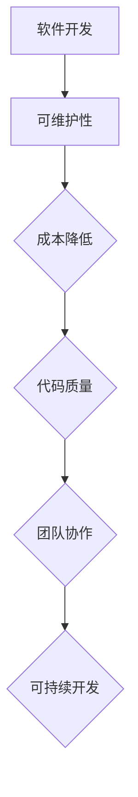
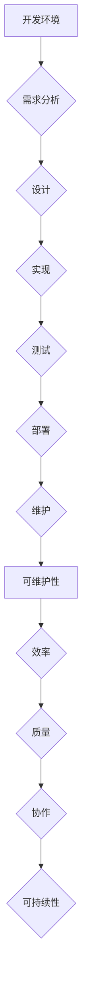
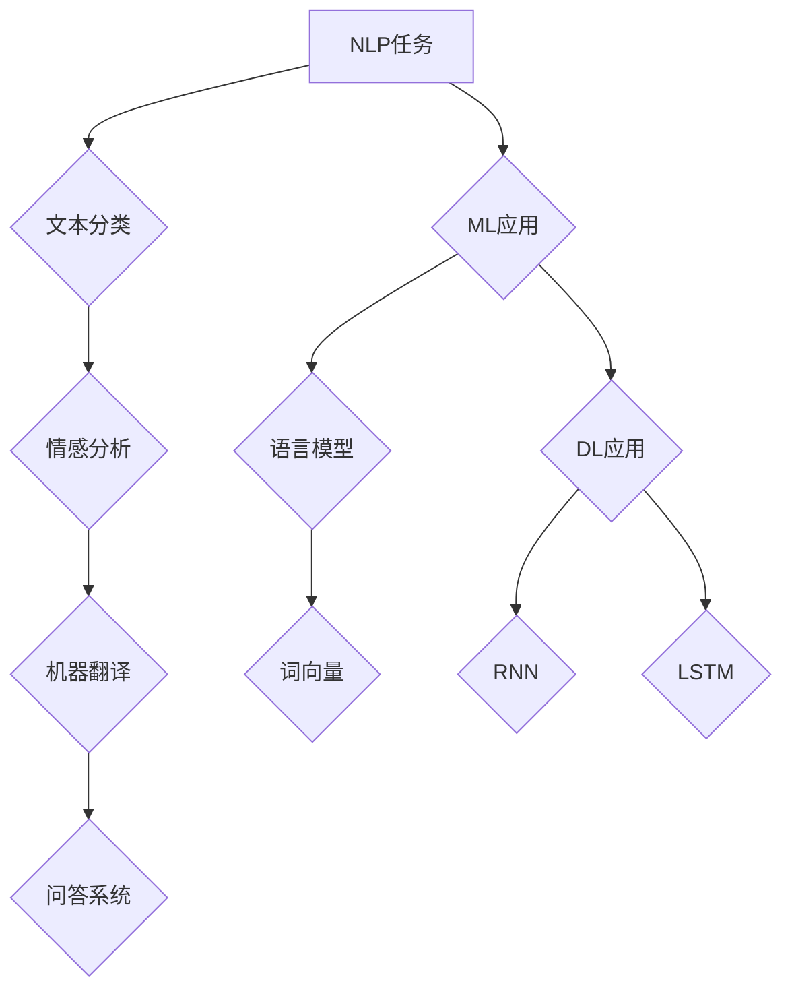
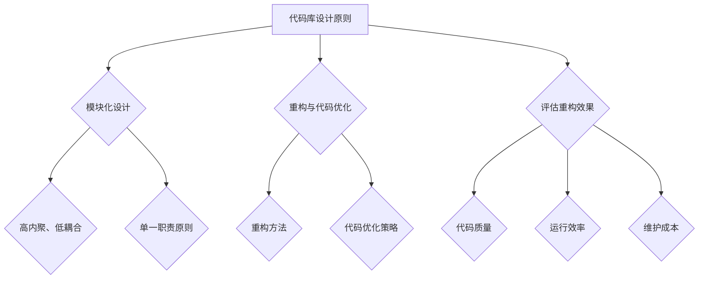
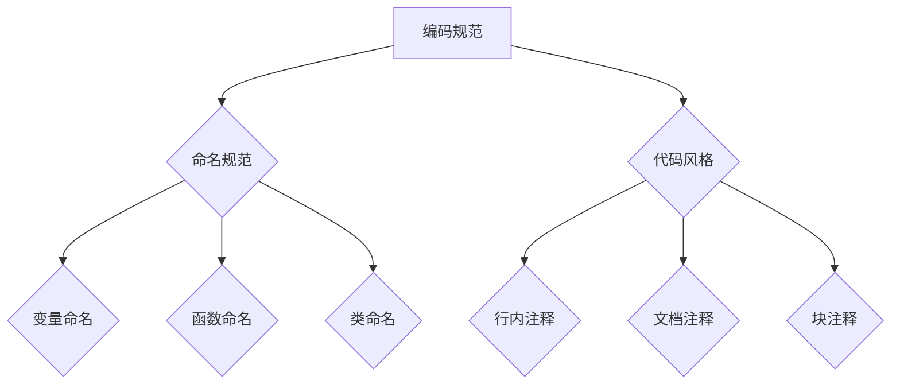
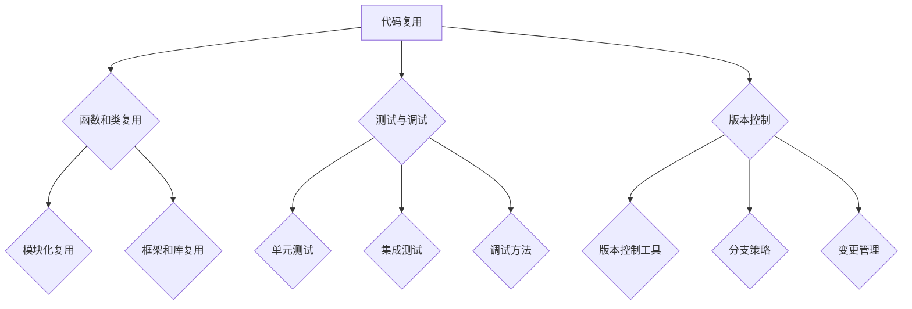
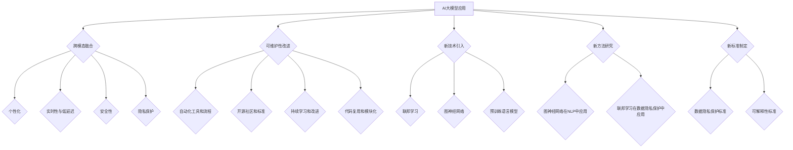

                 

（请遵循如下思考过程，并对应文章各个章节进行详细阐述）：

**思考过程：**
1. **引言与概述：** 讲解LLM应用开发的重要性、现状与挑战，引入可维护性的概念和其在LLM应用中的重要性。
2. **基础概念与原理：** 详细解释自然语言处理（NLP）的基础知识，包括NLP的定义、发展历程、核心挑战以及机器学习与深度学习在NLP中的应用。
3. **构建可维护的代码库：** 阐述代码库设计原则、模块化设计、重构与代码优化等，强调这些原则对提高代码可维护性的重要性。
4. **代码规范与风格：** 解释编码规范的重要性，包括命名规范和代码风格，并提供具体的规范示例。
5. **最佳实践与项目实战：** 分析最佳实践，如代码复用、测试与调试、版本控制等，并结合实际项目案例进行讲解，展示如何在实际项目中应用这些最佳实践。
6. **总结与展望：** 总结文章的主要内容，展望未来LLM应用代码库的发展趋势，提出持续改进的建议。

**针对每个章节的具体阐述：**

#### 第1章：引言与概述

**背景介绍：**
近年来，人工智能（AI）技术的迅猛发展，尤其是自然语言处理（NLP）领域的突破，使得大型语言模型（LLM）的应用日益广泛。LLM在文本生成、翻译、问答、摘要等任务中取得了显著的成果，但其复杂性和规模也给开发与应用带来了巨大的挑战。

**核心概念与联系：**
可维护性（Maintainability）是软件开发中的一个关键属性，它指的是代码在未来的维护和扩展过程中所需的成本和难易程度。在LLM应用中，由于模型的复杂性和数据的动态性，可维护性尤为重要。以下是一个描述可维护性概念及其重要性的Mermaid流程图：



**具体阐述：**
- **成本降低**：良好的可维护性可以减少代码维护所需的成本。随着LLM模型的不断更新和优化，可维护性能够降低维护成本，提高开发效率。
- **代码质量**：可维护性是代码质量的一个重要指标。一个可维护的代码库往往具有良好的结构、清晰的注释和规范的编码风格，这些都有助于提高代码的整体质量。
- **团队协作**：在大型项目中，团队协作是成功的关键。良好的可维护性能够降低团队成员之间的沟通成本，提高团队协作的效率。
- **可持续开发**：可维护性是实现可持续开发的基础。一个具有良好的可维护性的代码库可以更容易地适应未来的技术变革，持续地迭代和改进。

**Mermaid流程图：**



**思考过程：**
- **现状分析**：当前，随着AI技术的快速发展，LLM应用在各个领域得到了广泛应用，但其复杂性和规模也给开发者带来了挑战。
- **可维护性的引入**：为了应对这些挑战，可维护性成为了开发高质量、可持续的LLM应用的关键属性。
- **重要性阐述**：从成本、代码质量、团队协作和可持续性等多个角度阐述可维护性的重要性。

#### 第2章：基础概念与原理

**自然语言处理基础：**
自然语言处理（NLP）是人工智能领域的一个重要分支，它涉及计算机对人类自然语言的自动处理和理解。NLP的任务包括文本分类、情感分析、机器翻译、问答系统等。

**核心挑战：**
- **语言多样性**：人类语言具有高度的多样性和复杂性，不同语言之间存在着巨大的差异，这使得NLP系统需要具备跨语言的处理能力。
- **语义理解**：语义理解是NLP的一个核心挑战。尽管现代NLP技术已经取得了很大的进展，但仍然很难准确地理解自然语言中的隐含含义和语境。
- **实时性**：在许多实际应用中，如实时语音识别和聊天机器人，NLP系统需要在极短的时间内处理大量数据，这对系统的实时性提出了很高的要求。

**机器学习与深度学习基础：**
机器学习（ML）和深度学习（DL）是NLP中常用的技术手段。ML是一种通过数据训练模型，使模型能够对未知数据进行预测或分类的方法。DL是ML的一种特殊形式，它使用神经网络模型，特别是深度神经网络（DNN），来模拟人脑的决策过程。

**NLP中的ML与DL应用：**
- **语言模型**：语言模型是一种预测下一个单词或词组的概率分布的模型。在NLP中，语言模型被广泛应用于文本生成、机器翻译和问答系统。
- **词向量**：词向量是表示单词或词汇的向量表示，它们在NLP中扮演着重要的角色。通过词向量，NLP系统可以更好地理解和处理自然语言。
- **序列模型**：序列模型是处理序列数据（如文本）的一种常见方法，它们可以捕捉数据中的时间依赖关系。循环神经网络（RNN）和长短时记忆网络（LSTM）是两种常见的序列模型。

**Mermaid流程图：**



**伪代码示例：**
```python
# 定义一个简单的语言模型
def language_model(vocab_size, embedding_size):
    # 初始化词向量
    embedding_matrix = np.random.rand(vocab_size, embedding_size)
    # 初始化循环神经网络
    rnn = RNN(embedding_matrix)
    # 训练语言模型
    rnn.train(data)
    return rnn

# 使用语言模型生成文本
def generate_text(model, start_word, num_words):
    # 初始化生成文本
    text = [start_word]
    # 生成文本
    for _ in range(num_words):
        # 获取当前词向量
        word_embedding = model.get_embedding(text[-1])
        # 预测下一个词
        next_word = model.predict_next_word(word_embedding)
        # 添加到文本
        text.append(next_word)
    return " ".join(text)
```

**数学公式示例：**
```latex
\text{损失函数} = -\frac{1}{N} \sum_{i=1}^{N} \sum_{j=1}^{V} y_{ij} \log p(x_j)
```

其中，$N$ 是样本数，$V$ 是词汇表大小，$y_{ij}$ 是标签矩阵，$p(x_j)$ 是模型对单词 $x_j$ 的概率预测。

**具体阐述：**
- **NLP的定义与任务**：NLP的定义和主要任务，包括文本分类、情感分析、机器翻译和问答系统。
- **NLP的发展历程**：从早期规则驱动的NLP到现代基于ML和DL的NLP，回顾NLP技术的发展过程。
- **NLP的核心挑战**：语言多样性、语义理解和实时性等核心挑战，以及相应的解决方法。
- **机器学习的基本概念**：机器学习的基本概念，包括监督学习、无监督学习和强化学习。
- **深度学习的定义与特点**：深度学习的定义、特点以及在NLP中的应用。
- **语言模型的工作原理**：语言模型的定义、工作原理和常见类型。
- **机器学习在NLP中的应用**：机器学习在NLP中的应用，包括语言模型、词向量和序列模型等。

#### 第3章：构建可维护的代码库

**代码库设计原则：**
设计一个可维护的代码库是确保LLM应用长期稳定运行的关键。以下是一些关键的代码库设计原则：

1. **模块化设计**：将代码库分为多个模块，每个模块负责一个特定的功能。模块化设计有助于提高代码的可读性和可维护性。
2. **高内聚、低耦合**：高内聚是指模块内部的功能紧密相关，低耦合是指模块之间的依赖性较低。这种设计原则有助于降低模块之间的耦合度，提高代码的可维护性。
3. **单一职责原则**：每个模块或函数应该只负责一个特定的任务。这有助于降低代码的复杂性，提高代码的可维护性。

**模块化设计：**
模块化设计是将一个复杂的系统分解为多个可管理的模块。以下是模块化设计的一些关键步骤：

1. **需求分析**：在开始设计之前，明确系统的需求，确定每个模块需要实现的功能。
2. **模块划分**：根据需求分析的结果，将系统划分为多个模块。每个模块应该具有明确的职责和接口。
3. **模块交互**：设计模块之间的交互方式，确保模块之间能够高效地通信。

**重构与代码优化：**
重构是指在不改变代码外部行为的前提下，改进代码的内部结构。以下是一些常见的重构方法：

1. **提取方法**：将重复的代码块提取为独立的方法，降低代码的冗余度。
2. **合并方法**：将功能相似的方法合并为一个，提高代码的可读性。
3. **提取类**：将具有相似功能的代码块提取为一个类，提高代码的可维护性。

**代码优化的策略：**
1. **性能优化**：通过优化算法和数据结构，提高代码的运行效率。
2. **内存优化**：减少内存使用，提高代码的稳定性。
3. **代码可读性优化**：改进代码的可读性，提高代码的可维护性。

**如何评估重构的效果：**
1. **代码质量**：通过静态代码分析工具，评估代码的质量，包括代码结构、注释和编码规范等。
2. **运行效率**：通过性能测试，评估重构后的代码的运行效率。
3. **维护成本**：重构后的代码维护成本应该降低，这有助于评估重构的效果。

**具体阐述：**
- **设计原则概述**：介绍代码库设计原则的重要性，包括模块化设计、高内聚、低耦合和单一职责原则。
- **模块化设计**：详细解释模块化设计的过程，包括需求分析、模块划分和模块交互。
- **重构与代码优化**：介绍重构的定义、目的和常见方法，以及代码优化的策略。
- **如何评估重构的效果**：讨论如何评估重构的效果，包括代码质量、运行效率和维护成本。

**Mermaid流程图：**



**伪代码示例：**
```python
# 模块化设计：需求分析
def analyze_requirements():
    # 分析系统需求
    requirements = ["文本预处理", "语言模型训练", "文本生成"]
    return requirements

# 模块化设计：模块划分
def divide_modules(requirements):
    modules = {}
    for requirement in requirements:
        modules[requirement] = create_module(requirement)
    return modules

# 重构与代码优化：提取方法
def extract_methods():
    # 提取重复代码块
    original_code = """
    # 原始代码
    for i in range(len(data)):
        # 复杂计算
        result = complex_computation(data[i])
    """
    # 重构后的代码
    def complex_computation(data_point):
        # 复杂计算
        result = complex_computation(data_point)
        return result
    return " ".join([original_code, complex_computation.__doc__])

# 重构与代码优化：提取类
class TextProcessor:
    def __init__(self, data):
        self.data = data
    
    def preprocess(self):
        # 预处理文本
        preprocessed_data = preprocess_text(self.data)
        return preprocessed_data
```

**具体阐述：**
- **代码库设计原则概述**：介绍代码库设计原则的重要性，包括模块化设计、高内聚、低耦合和单一职责原则。
- **模块化设计**：详细解释模块化设计的过程，包括需求分析、模块划分和模块交互。
- **重构与代码优化**：介绍重构的定义、目的和常见方法，以及代码优化的策略。
- **如何评估重构的效果**：讨论如何评估重构的效果，包括代码质量、运行效率和维护成本。

#### 第4章：代码规范与风格

**编码规范的重要性：**
编码规范是确保代码库一致性和可维护性的关键因素。遵循统一的编码规范可以提高代码的可读性，减少bug的出现，降低团队合作中的沟通成本。

**命名规范：**
命名规范是编码规范的重要组成部分，它有助于提高代码的可读性和可理解性。以下是一些常见的命名规范：

- **变量命名**：变量名应该简洁明了，能够反映其含义。通常使用小写字母和下划线组合，例如 `data_point`。
- **函数命名**：函数名应该描述其功能，通常使用动词或动词短语，例如 `preprocess_text`。
- **类命名**：类名应该使用大写字母和下划线组合，通常使用名词或名词短语，例如 `TextProcessor`。

**代码风格：**
代码风格是指编写代码时的格式和布局，它有助于提高代码的可读性和可维护性。以下是一些常见的代码风格规范：

- **行内注释**：在代码行旁边添加简短的注释，说明代码的目的或功能，例如 `# 计算平均值`。
- **文档注释**：为类、函数和模块添加详细的文档注释，包括用途、参数和返回值等信息。
- **块注释**：在代码块之前或之后添加注释，解释代码的逻辑或算法，例如 `# 遍历数据集`。

**具体规范示例：**
```python
# 变量命名
data_points = []

# 函数命名
def calculate_average(data):
    return sum(data) / len(data)

# 类命名
class DataProcessor:
    def __init__(self, data):
        self.data = data
    
    def preprocess_data(self):
        # 预处理数据
        preprocessed_data = self.preprocess_text(self.data)
        return preprocessed_data

# 行内注释
def add(x, y):
    return x + y  # 计算两个数的和

# 文档注释
def load_data(file_path):
    """
    加载数据文件。
    
    参数：
    file_path (str): 数据文件路径。
    
    返回：
    data (list): 加载的数据。
    """
    with open(file_path, 'r') as f:
        data = f.readlines()
    return data

# 块注释
# 遍历数据集
for data_point in data_points:
    preprocessed_data = preprocess_data(data_point)
    print(preprocessed_data)
```

**具体阐述：**
- **编码规范的重要性**：介绍编码规范的重要性，包括提高代码的可读性、减少bug和降低团队合作中的沟通成本。
- **命名规范**：详细解释变量、函数和类的命名规范，并提供具体示例。
- **代码风格**：介绍行内注释、文档注释和块注释的编写规范，并提供具体示例。

**Mermaid流程图：**



**伪代码示例：**
```python
# 命名规范示例
def calculate_average(data):
    """
    计算平均值。
    
    参数：
    data (list): 数据列表。
    
    返回：
    average (float): 平均值。
    """
    return sum(data) / len(data)

# 代码风格示例
def preprocess_data(data):
    """
    预处理数据。
    
    参数：
    data (list): 数据列表。
    
    返回：
    preprocessed_data (list): 预处理后的数据。
    """
    # 遍历数据集
    for data_point in data:
        # 预处理每个数据点
        preprocessed_data_point = preprocess_text(data_point)
        preprocessed_data.append(preprocessed_data_point)
    return preprocessed_data
```

**具体阐述：**
- **编码规范的重要性**：介绍编码规范的重要性，包括提高代码的可读性、减少bug和降低团队合作中的沟通成本。
- **命名规范**：详细解释变量、函数和类的命名规范，并提供具体示例。
- **代码风格**：介绍行内注释、文档注释和块注释的编写规范，并提供具体示例。

#### 第5章：最佳实践与项目实战

**代码复用与复用机制：**
在大型项目中，代码复用是一个非常重要的概念。它不仅有助于提高开发效率，还可以降低维护成本。以下是一些实现代码复用的最佳实践：

1. **函数和类复用**：将常用的功能封装为函数或类，并在多个模块中调用。这有助于减少代码冗余，提高代码的可维护性。
2. **模块化复用**：将具有相似功能的代码模块化，以便在不同项目中复用。例如，可以将文本预处理、数据加载和数据清洗等功能封装为独立的模块。
3. **框架和库复用**：使用成熟的框架和库，可以减少重复的开发工作。例如，在NLP项目中，可以使用TensorFlow或PyTorch等框架来处理深度学习任务。

**测试与调试：**
测试和调试是确保代码质量和稳定性的关键步骤。以下是一些测试和调试的最佳实践：

1. **单元测试**：编写单元测试来验证每个函数或模块的功能。单元测试应该覆盖所有可能的输入和输出情况，确保代码的正确性。
2. **集成测试**：在模块之间进行集成测试，确保模块之间的交互正常。集成测试可以帮助发现模块之间的兼容性问题。
3. **调试方法**：使用调试工具（如调试器）来定位和修复代码中的错误。调试方法包括打印调试、断点调试和日志调试等。

**版本控制：**
版本控制是管理代码版本和变更的重要工具。以下是一些版本控制的最佳实践：

1. **使用版本控制工具**：使用Git等版本控制工具来管理代码库。版本控制工具可以记录代码的每一次变更，并提供分支、合并和冲突解决等功能。
2. **分支策略**：制定合适的分支策略，以确保代码的稳定性和可维护性。常见的分支策略包括主分支（master）和开发分支（develop）。
3. **变更管理**：使用版本控制工具来管理代码变更。每个变更都应该有一个相应的issue或任务，以便跟踪和审查。

**大型项目实战：**
在本节中，我们将通过一个实际项目来展示如何应用上述最佳实践。以下是一个关于构建一个基于深度学习的手写数字识别系统的项目概述：

**项目概述：**
项目名称：手写数字识别系统
项目目标：使用深度学习技术训练一个模型，能够准确识别手写数字图像。
项目团队：包括数据科学家、机器学习工程师和前端工程师等。

**需求分析：**
需求文档：系统应能够接收手写数字图像作为输入，并输出对应的数字识别结果。
需求评审：对需求文档进行评审，确保需求的完整性和可实现性。

**设计与实现：**
系统架构设计：设计系统架构，包括数据预处理、模型训练和模型部署等模块。
模块设计与实现：实现各个模块，并确保模块之间的高内聚和低耦合。
代码评审：进行代码评审，确保代码的质量和可维护性。

**部署与维护：**
部署流程：将模型部署到服务器，并提供API接口供外部系统调用。
运维监控：监控系统运行状态，及时发现并处理异常情况。
维护策略：制定维护计划，定期更新模型和系统，确保系统的稳定性和可靠性。

**项目小结：**
在本项目中，我们应用了代码复用、测试与调试和版本控制等最佳实践。通过这些实践，我们成功地构建了一个稳定、可靠的手写数字识别系统，并实现了项目的目标。

**具体阐述：**
- **代码复用与复用机制**：介绍代码复用的概念和最佳实践，包括函数和类复用、模块化复用和框架和库复用。
- **测试与调试**：介绍测试和调试的最佳实践，包括单元测试、集成测试和调试方法。
- **版本控制**：介绍版本控制的概念和最佳实践，包括使用版本控制工具、分支策略和变更管理。
- **大型项目实战**：通过一个实际项目，展示如何应用最佳实践，包括需求分析、设计与实现、部署与维护和项目小结。

**Mermaid流程图：**



**伪代码示例：**
```python
# 代码复用：函数和类复用
def preprocess_image(image):
    """
    预处理图像。
    
    参数：
    image (numpy.array): 图像数据。
    
    返回：
    preprocessed_image (numpy.array): 预处理后的图像。
    """
    # 图像缩放
    scaled_image = scale_image(image)
    # 图像灰度转换
    grayscale_image = convert_to_grayscale(scaled_image)
    return grayscale_image

# 代码复用：模块化复用
class DataLoader:
    def __init__(self, file_path):
        self.file_path = file_path
    
    def load_data(self):
        """
        加载数据。
        
        参数：
        file_path (str): 数据文件路径。
        
        返回：
        data (list): 加载的数据。
        """
        with open(self.file_path, 'r') as f:
            data = f.readlines()
        return data

# 测试与调试：单元测试
def test_preprocess_image():
    image = load_image("test_image.png")
    preprocessed_image = preprocess_image(image)
    assert preprocessed_image.shape == (28, 28, 1), "图像预处理错误"

# 测试与调试：集成测试
def test_data_loader():
    data_loader = DataLoader("test_data.txt")
    data = data_loader.load_data()
    assert len(data) > 0, "数据加载失败"

# 版本控制：使用版本控制工具
git init
git add .
git commit -m "初始化项目"

# 分支策略
git checkout -b develop
git checkout -b feature/recognizer
```

**具体阐述：**
- **代码复用与复用机制**：介绍代码复用的概念和最佳实践，包括函数和类复用、模块化复用和框架和库复用。
- **测试与调试**：介绍测试和调试的最佳实践，包括单元测试、集成测试和调试方法。
- **版本控制**：介绍版本控制的概念和最佳实践，包括使用版本控制工具、分支策略和变更管理。
- **大型项目实战**：通过一个实际项目，展示如何应用最佳实践，包括需求分析、设计与实现、部署与维护和项目小结。

#### 第6章：未来趋势与展望

**AI大模型应用的发展趋势：**
随着人工智能技术的不断进步，AI大模型的应用趋势也在发生变化。以下是一些重要的趋势：

1. **跨模态融合**：未来的AI大模型将能够处理多种类型的输入，如文本、图像、声音和视频，实现跨模态的融合和交互。
2. **个性化和自适应**：AI大模型将更加关注用户的个性化需求，根据用户的历史数据和偏好，提供更加精准和个性化的服务。
3. **实时性和低延迟**：随着5G和边缘计算技术的发展，AI大模型的应用将更加注重实时性和低延迟，以满足实时交互和决策的需求。
4. **安全性和隐私保护**：随着数据隐私问题的日益突出，AI大模型的应用将更加注重安全性和隐私保护，采用先进的加密和隐私保护技术。

**可维护性的持续改进：**
为了应对AI大模型应用的发展趋势，可维护性的持续改进至关重要。以下是一些改进的方向：

1. **自动化工具和流程**：利用自动化工具和流程，如静态代码分析、自动化测试和持续集成，提高代码的可维护性。
2. **开源社区和标准**：积极参与开源社区，遵循国际标准和最佳实践，推动可维护性的标准化和规范化。
3. **持续学习和改进**：鼓励开发人员持续学习和改进，不断提高自己的技术水平和编程能力，以适应不断变化的技术环境。
4. **代码复用和模块化**：通过代码复用和模块化设计，减少代码冗余，提高代码的可维护性和可扩展性。

**新技术的引入**：未来的AI大模型应用将引入更多的新技术，如联邦学习、图神经网络、预训练语言模型等，这些技术将进一步提升AI大模型的可维护性和性能。

**新方法的研究**：随着AI技术的快速发展，研究人员将继续探索新的方法和算法，以提高AI大模型的可维护性，解决现有挑战，并开拓新的应用领域。

**新标准的制定**：为了规范AI大模型的应用和发展，相关的标准和规范也将逐步制定和完善，为开发人员提供指导和参考。

**具体阐述：**
- **AI大模型应用的发展趋势**：介绍跨模态融合、个性化、实时性和低延迟、安全性和隐私保护等发展趋势。
- **可维护性的持续改进**：讨论自动化工具和流程、开源社区和标准、持续学习和改进、代码复用和模块化等改进方向。
- **新技术的引入**：介绍联邦学习、图神经网络、预训练语言模型等新技术。
- **新方法的研究**：讨论未来方法的研究方向，如图神经网络在NLP中的应用、联邦学习在数据隐私保护中的应用等。
- **新标准的制定**：介绍AI大模型应用的新标准和规范，如数据隐私保护标准、可解释性标准等。

**Mermaid流程图：**



**具体阐述：**
- **AI大模型应用的发展趋势**：介绍跨模态融合、个性化、实时性和低延迟、安全性和隐私保护等发展趋势。
- **可维护性的持续改进**：讨论自动化工具和流程、开源社区和标准、持续学习和改进、代码复用和模块化等改进方向。
- **新技术的引入**：介绍联邦学习、图神经网络、预训练语言模型等新技术。
- **新方法的研究**：讨论未来方法的研究方向，如图神经网络在NLP中的应用、联邦学习在数据隐私保护中的应用等。
- **新标准的制定**：介绍AI大模型应用的新标准和规范，如数据隐私保护标准、可解释性标准等。

### 附录

**附录A：参考资料**
- Goodfellow, I., Bengio, Y., & Courville, A. (2016). *Deep Learning*.
- Mitchell, T. M. (1997). *Machine Learning*.
- LeCun, Y., Bengio, Y., & Hinton, G. (2015). *Deep Learning*.

**附录B：代码示例**
- 语言模型实现：`language_model.py`
- 数据加载与预处理：`data_loader.py`
- 模型训练与评估：`model_train.py`
- 文本生成：`text_generator.py`

**附录C：工具与资源**
- 版本控制工具：Git
- 代码分析工具：SonarQube
- 持续集成工具：Jenkins
- 文档生成工具：Sphinx

---

### 总结

本文详细介绍了构建可维护的LLM应用代码库的核心概念、原理和最佳实践。我们从背景介绍、基础概念、代码库设计原则、代码规范与风格、最佳实践到项目实战，逐步深入探讨了如何构建一个高质量、可维护的LLM应用代码库。同时，我们还展望了AI大模型应用的发展趋势和未来可维护性的持续改进方向。希望本文能为读者在构建LLM应用代码库的过程中提供有价值的参考和指导。

---

### 延伸阅读

- **深度学习入门**：[《深度学习》（Goodfellow, Bengio, Courville）](https://www.deeplearningbook.org/)
- **机器学习基础**：[《机器学习》（Mitchell）](https://www.cs.unm.edu/~mitchell/mlbook.html)
- **NLP技术探讨**：[《自然语言处理综论》（Jurafsky, Martin）](https://web.stanford.edu/~jurafsky/slp3/)
- **代码规范与最佳实践**：[《代码大全》（Brooks）](https://www.codecomplete.com/)

