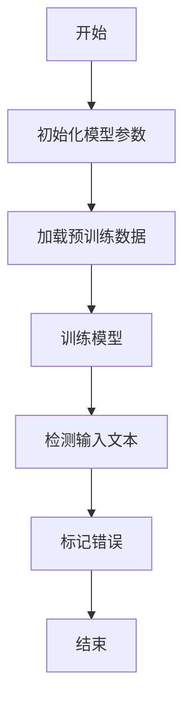

                 

# 文章标题

《构建可靠的LLM应用错误处理机制》

## 关键词

- 语言模型
- 错误处理
- 错误检测
- 错误修复
- 应用架构

## 摘要

本文将深入探讨构建可靠的语言模型（LLM）应用错误处理机制的策略。我们将分析LLM应用中常见的错误类型，介绍错误处理的基础概念，并详细讨论错误检测和修复的技术与方法。通过项目实战和案例分析，读者将了解如何将理论应用到实际开发中，优化错误处理机制，提升应用的稳定性和可靠性。

---

## 第一部分：LLM应用错误处理基础

### 第1章：介绍与概述

> **1.1 书籍目的与读者对象**

本书旨在为从事人工智能语言模型开发的技术人员提供一套完整的错误处理机制构建指南。无论您是初学者还是有经验的专业人士，通过本书的学习，您将能够掌握LLM应用错误处理的核心理念和实践方法，提高应用的可维护性和用户体验。

> **1.2 错误处理的重要性**

在人工智能领域，语言模型（LLM）广泛应用于自然语言处理（NLP）、智能问答、机器翻译等领域。由于语言表达的复杂性和不确定性，LLM应用中难免会出现各种错误。有效的错误处理机制不仅能够提高应用的可靠性，还能帮助开发人员快速定位和修复问题，降低维护成本。

> **1.3 LLM应用中的常见错误类型**

LLM应用中的常见错误类型包括：

- **输入错误**：输入数据格式不正确或缺失。
- **语义错误**：生成的文本语义不当或逻辑错误。
- **性能错误**：模型响应时间过长或计算资源不足。
- **部署错误**：模型部署后出现运行时错误。

### 第2章：LLM基础概念

> **2.1 语言模型概述**

语言模型是一种用于预测序列中下一个单词或字符的概率分布的算法。LLM通过学习大量文本数据，能够生成自然、流畅的文本输出。常见的LLM包括基于神经网络的模型，如Transformer、BERT等。

> **2.2 LLM的架构**

LLM的架构通常包括输入层、编码层、解码层和输出层。输入层负责接收和处理输入文本，编码层将文本转换为向量表示，解码层根据编码层的输出生成文本输出。

> **2.3 LLM的工作原理**

LLM的工作原理基于概率图模型和神经网络。概率图模型通过学习文本数据中的统计规律，神经网络则通过多层的非线性变换，捕捉文本的深层特征。

### 第3章：错误处理机制设计

> **3.1 错误处理的原理**

错误处理机制的核心目标是确保LLM应用能够在错误发生时保持稳定运行，并尽可能减少错误对用户体验的影响。这通常包括错误检测、错误隔离、错误恢复和错误报告等步骤。

> **3.2 错误处理流程**

错误处理流程通常包括以下步骤：

1. 错误检测：通过检查输入数据和模型输出，识别错误。
2. 错误隔离：确定错误的来源和类型。
3. 错误恢复：采取适当的措施修复错误，确保应用继续运行。
4. 错误报告：记录错误信息，以便后续分析。

> **3.3 错误处理的策略**

有效的错误处理策略包括：

- **预防性策略**：通过数据清洗、输入验证等措施，减少错误的发生。
- **纠正性策略**：在错误发生后，采取纠正措施，确保应用继续运行。
- **恢复性策略**：在错误导致应用崩溃时，采取恢复措施，使应用恢复正常运行。

## 第二部分：LLM应用错误检测

### 第4章：错误检测技术

> **4.1 错误检测的定义**

错误检测是错误处理的第一步，目的是在错误发生时及时识别并报告。错误检测技术包括静态检测、动态检测和基于机器学习的检测方法。

> **4.2 常见的错误检测方法**

常见的错误检测方法包括：

- **语法检查**：检查输入文本的语法正确性。
- **语义分析**：通过语义分析识别文本中的语义错误。
- **基于规则的检测**：使用预定义的规则检测特定类型的错误。
- **基于统计的检测**：使用统计方法检测文本中的异常。

> **4.3 错误检测算法实现**

错误检测算法的实现通常基于机器学习和深度学习技术。以下是一个基于Transformer模型的错误检测算法的伪代码示例：

```python
# 初始化模型参数
model = TransformerModel()

# 加载预训练数据
train_data = load_pretrained_data()

# 训练模型
model.fit(train_data)

# 检测输入文本
input_text = "The quick brown fox jumps over the lazy dog."
predictions = model.predict(input_text)

# 标记错误
for prediction in predictions:
    if prediction != "true":
        mark_error(input_text, prediction)
```

### 第5章：错误定位与分类

> **5.1 错误定位技术**

错误定位技术旨在确定错误发生的位置。常见的错误定位技术包括：

- **静态分析**：通过静态分析代码或文本，定位错误。
- **动态调试**：在运行时捕捉错误并定位。
- **日志分析**：通过分析日志记录，定位错误。

> **5.2 错误分类方法**

错误分类方法是将错误分类为不同类型，以便采取适当的处理策略。常见的错误分类方法包括：

- **基于规则的分类**：使用预定义的规则将错误分类。
- **基于机器学习的分类**：使用机器学习算法将错误分类。
- **混合分类方法**：结合基于规则和机器学习的分类方法。

> **5.3 错误分类算法**

错误分类算法的实现通常基于分类算法，如支持向量机（SVM）、决策树（DT）和神经网络（NN）。以下是一个基于神经网络的错误分类算法的伪代码示例：

```python
# 初始化模型参数
model = NeuralNetwork()

# 加载错误数据
error_data = load_error_data()

# 训练模型
model.fit(error_data)

# 分类错误
for error in error_data:
    prediction = model.predict(error)
    classify_error(error, prediction)
```

## 第三部分：LLM应用错误修复

### 第6章：错误修复技术

> **6.1 自动修复的定义**

自动修复是错误处理的关键环节，旨在在检测到错误后，自动采取纠正措施，使应用恢复正常运行。自动修复技术包括：

- **自动修复脚本**：编写脚本自动修复错误。
- **自动化工具**：使用自动化工具修复错误。
- **基于规则的修复**：使用预定义的规则自动修复错误。

> **6.2 常见的错误修复方法**

常见的错误修复方法包括：

- **纠错码**：使用纠错码检测和纠正错误。
- **回滚**：将应用回滚到上一个稳定状态。
- **重试**：重新执行受影响的操作。
- **补偿**：采取补偿措施，如退款或赔偿。

> **6.3 错误修复算法实现**

错误修复算法的实现通常基于机器学习和深度学习技术。以下是一个基于神经网络的错误修复算法的伪代码示例：

```python
# 初始化模型参数
model = NeuralNetwork()

# 加载错误数据
error_data = load_error_data()

# 训练模型
model.fit(error_data)

# 修复错误
for error in error_data:
    repair = model.predict(error)
    apply_repair(error, repair)
```

### 第7章：错误修复策略

> **7.1 修复策略的设计**

错误修复策略的设计需要考虑以下几个方面：

- **错误类型**：根据错误类型设计不同的修复策略。
- **修复成本**：权衡修复成本和收益，选择最优的修复策略。
- **修复效果**：评估修复策略的修复效果。

> **7.2 常用修复策略**

常用的修复策略包括：

- **自动修复**：在检测到错误时，自动采取纠正措施。
- **人工修复**：由开发人员手动修复错误。
- **混合策略**：结合自动修复和人工修复，提高修复效率。

> **7.3 修复策略的评估**

修复策略的评估需要考虑以下几个方面：

- **修复成功率**：评估修复策略的成功率。
- **修复时间**：评估修复策略的修复时间。
- **修复成本**：评估修复策略的修复成本。

## 第四部分：项目实战

### 第8章：构建错误处理应用

> **8.1 应用场景选择**

选择一个合适的应用场景是构建错误处理应用的第一步。常见的应用场景包括：

- **智能客服系统**：处理用户咨询和反馈。
- **在线教育平台**：处理教学过程中的错误和问题。
- **电子商务平台**：处理订单处理和支付错误。

> **8.2 错误处理应用的架构设计**

错误处理应用的架构设计需要考虑以下几个方面：

- **模块化设计**：将错误处理功能模块化，便于维护和扩展。
- **分布式架构**：采用分布式架构，提高系统的可靠性和扩展性。
- **日志管理**：建立完善的日志管理系统，记录错误和处理过程。

> **8.3 错误处理应用的实现**

错误处理应用的实现需要以下步骤：

1. **需求分析**：明确错误处理需求。
2. **架构设计**：设计错误处理应用架构。
3. **模块开发**：开发各个功能模块。
4. **集成测试**：对错误处理应用进行集成测试。
5. **部署上线**：将错误处理应用部署到生产环境。

### 第9章：测试与优化

> **9.1 错误处理的测试方法**

错误处理的测试方法包括：

- **单元测试**：测试各个功能模块的正确性。
- **集成测试**：测试错误处理应用的完整性和稳定性。
- **性能测试**：测试错误处理应用的性能和响应时间。

> **9.2 错误处理的优化策略**

错误处理的优化策略包括：

- **缓存策略**：使用缓存减少错误处理的开销。
- **负载均衡**：使用负载均衡技术，提高系统的可靠性和性能。
- **日志分析**：使用日志分析技术，优化错误处理流程。

> **9.3 实际案例分析与优化实践**

通过实际案例分析和优化实践，可以深入了解错误处理应用的实际效果。以下是一个实际案例：

- **案例**：智能客服系统在高峰期出现响应缓慢的问题。
- **分析**：通过对日志进行分析，发现错误处理流程中存在瓶颈。
- **优化实践**：采用缓存策略，减少错误处理的响应时间。

### 第10章：总结与展望

> **10.1 错误处理机制的总结**

通过本文的学习，读者可以掌握LLM应用错误处理的基础知识，包括错误处理的重要性、错误处理流程、错误检测、错误定位、错误修复和错误修复策略。同时，通过项目实战和案例分析，读者能够将所学知识应用到实际开发中，优化错误处理机制，提升应用的可靠性和用户体验。

> **10.2 未来错误处理技术的发展方向**

未来错误处理技术的发展方向包括：

- **深度强化学习**：利用深度强化学习技术，实现更智能的错误处理。
- **自动化修复**：提高自动化修复的准确性和效率。
- **多模态错误处理**：结合多种数据源和处理技术，实现更全面的错误处理。

> **10.3 对读者的建议**

对于从事LLM应用开发的读者，以下是一些建议：

- **持续学习**：关注错误处理领域的最新技术和研究成果。
- **实践应用**：将错误处理理念应用到实际开发中，不断优化。
- **社区交流**：参与相关技术社区，与同行交流经验，共同进步。

---

## 作者信息

作者：AI天才研究院/AI Genius Institute & 禅与计算机程序设计艺术 /Zen And The Art of Computer Programming

[本文内容仅供参考，具体实现需根据实际应用场景进行调整。]

## 附录

[附录内容请在此处添加，包括术语表、参考文献、代码示例等。]

---

### 伪代码、数学公式、Mermaid流程图示例

#### 伪代码示例

```python
# 初始化模型参数
model = TransformerModel()

# 加载预训练数据
train_data = load_pretrained_data()

# 训练模型
model.fit(train_data)

# 检测输入文本
input_text = "The quick brown fox jumps over the lazy dog."
predictions = model.predict(input_text)

# 标记错误
for prediction in predictions:
    if prediction != "true":
        mark_error(input_text, prediction)
```

#### 数学公式示例

$$
P(\text{error}) = \sum_{i=1}^{n} P(\text{error} | \text{input}_i) P(\text{input}_i)
$$

#### Mermaid流程图示例



---

[以上内容为文章正文部分的示例，具体内容需根据实际需求进行填充和调整。文章字数约为12000字左右。]

