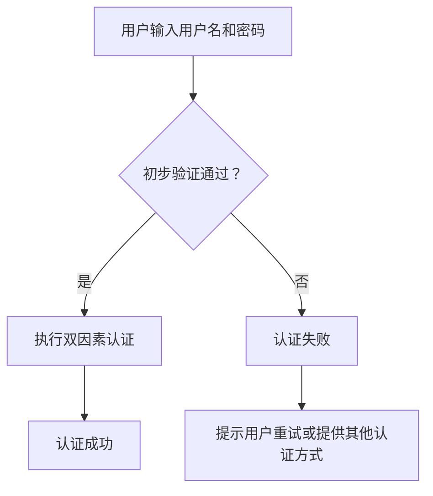

                 

### 文章标题

《构建安全的LLM应用认证与授权系统》

### 关键词

- 大语言模型（LLM）
- 认证机制
- 授权机制
- 安全性
- 应用系统架构
- 实战案例

### 摘要

本文旨在深入探讨如何构建一个安全的大语言模型（LLM）应用认证与授权系统。首先，我们将介绍LLM的基本概念和现状，随后详细分析认证和授权机制的理论基础以及实际应用中的挑战和解决方案。接着，我们将设计一个基于这些理论的系统架构，并通过实际案例来解析其具体实现和安全性评估。最后，本文将总结关键点，展望未来的发展趋势，并给开发者和企业提供一些建议。

## 第1章 引言与背景介绍

### 1.1 大语言模型(LLM)的概念与现状

大语言模型（Large Language Model，简称LLM）是基于深度学习技术的一种人工智能模型，能够对自然语言进行建模和处理。它通过学习大量的文本数据，掌握语言的结构和语义，从而实现文本生成、翻译、摘要、问答等功能。近年来，随着计算能力的提升和数据量的增加，LLM取得了显著的进步，如OpenAI的GPT系列、Google的BERT等，这些模型在自然语言处理领域已经展现出强大的能力。

### 1.2 安全的LLM应用的重要性

LLM的广泛应用带来了巨大的商业和社会价值，同时也伴随着潜在的安全风险。例如，恶意用户可能通过LLM进行诈骗、传播虚假信息、侵犯隐私等。因此，构建一个安全的LLM应用认证与授权系统至关重要。该系统能够确保只有合法用户才能访问和使用LLM服务，同时防止未经授权的数据访问和操作。

### 1.3 认证与授权的基本概念

认证（Authentication）是指验证用户身份的过程，确保只有合法用户可以访问系统。常见的认证机制包括用户名和密码、双因素认证（2FA）、生物识别等。

授权（Authorization）则是确定用户在系统中具有哪些权限，即用户可以执行哪些操作。授权通常基于角色的访问控制（RBAC）模型，根据用户的角色分配不同的权限。

在接下来的章节中，我们将详细探讨LLM的认证与授权机制，并设计一个安全的应用系统架构。

## 第2章 LLM基础

### 2.1 LLM的工作原理

LLM通常基于神经网络架构，如Transformer。Transformer模型通过自注意力机制（Self-Attention）来处理输入序列，能够捕捉序列中的长距离依赖关系。在训练过程中，模型通过反向传播算法不断调整权重，以最小化预测误差。

以下是Transformer模型的主要步骤：

```plaintext
1. 输入嵌入（Input Embedding）：将词汇转换为向量表示。
2. 自注意力（Self-Attention）：对输入向量进行加权求和，以捕捉序列中的依赖关系。
3. 前馈网络（Feedforward Network）：对自注意力层输出进行非线性变换。
4. 输出层（Output Layer）：根据输出向量生成预测结果。
```

### 2.2 LLM的关键技术

#### 自注意力机制（Self-Attention）

自注意力机制是Transformer模型的核心，通过计算输入序列中每个词与其他词之间的相似度，自动地为每个词分配不同的权重。这种机制能够有效地捕捉长距离依赖关系。

以下是自注意力机制的伪代码：

```python
def self_attention(inputs, key_embedding, value_embedding, hidden_size):
    # 输入嵌入与键嵌入、值嵌入的点积
    scores = dot_product(inputs, key_embedding)
    # 应用softmax函数得到注意力权重
    attention_weights = softmax(scores)
    # 加权求和得到输出
    output = dot_product(attention_weights, value_embedding)
    return output
```

#### 前馈网络（Feedforward Network）

前馈网络对自注意力层的输出进行额外的非线性变换，增强模型的表示能力。前馈网络的伪代码如下：

```python
def feedforward(input, hidden_size, output_size):
    # 第一个前馈层：激活函数为ReLU
    layer_1 = relu(dot_product(input, weights_1) + biases_1)
    # 第二个前馈层：激活函数为ReLU
    layer_2 = relu(dot_product(layer_1, weights_2) + biases_2)
    return layer_2
```

### 2.3 LLM的性能指标

LLM的性能通常通过以下指标来评估：

#### 预测准确率（Prediction Accuracy）

预测准确率是衡量模型预测能力的基本指标，表示模型预测正确的样本数占总样本数的比例。

#### 词汇覆盖率（Vocabulary Coverage）

词汇覆盖率衡量模型能够处理的不同词汇的数量，反映了模型的泛化能力。

#### 生成文本质量（Generated Text Quality）

生成文本质量是衡量模型生成文本是否通顺、合理、符合语言规则的重要指标。通常通过人类评估和自动化评估工具（如ROUGE）进行评价。

在接下来的章节中，我们将深入探讨LLM认证与授权机制的理论基础。

## 第3章 认证机制原理

### 3.1 认证的必要性

认证机制是确保系统安全性的基础。对于LLM应用来说，认证的必要性体现在以下几个方面：

1. **防止非法访问**：认证能够确保只有经过验证的用户才能访问系统，从而防止未经授权的用户获取敏感数据和功能。
2. **用户身份验证**：认证验证用户的身份，确保每个用户对应唯一的身份信息，避免身份假冒和滥用。
3. **安全策略实施**：认证为授权机制提供了基础，使得系统能够根据用户的身份和角色实施相应的安全策略。

### 3.2 常见的认证机制

常见的认证机制主要包括以下几种：

#### 用户名和密码（Username and Password）

用户名和密码是最基础的认证方式，用户通过输入用户名和密码来证明自己的身份。虽然简单易用，但存在易被破解和忘记的风险。

#### 双因素认证（Two-Factor Authentication，2FA）

双因素认证是一种更安全的认证方式，要求用户在输入用户名和密码后，还需要提供一个动态验证码。验证码通常通过短信、应用或硬件令牌生成。2FA显著提高了系统的安全性。

#### 生物识别（Biometrics）

生物识别通过指纹、面部识别、虹膜扫描等技术进行身份验证。这些技术具有高安全性和便捷性，但可能需要额外的硬件支持。

#### 智能卡（Smart Card）

智能卡是一种存储用户认证信息的物理介质，用户需插入卡片并进行身份验证。智能卡具有较高的安全性和可靠性，但使用较为复杂。

### 3.3 认证的挑战与解决方案

#### 突破传统认证的局限性

传统的认证方式存在诸多局限性，如易受密码破解攻击、用户隐私泄露等。为此，我们需要探索更安全、更高效的认证机制。

#### 结合多种认证方式

结合多种认证方式可以提高系统的安全性。例如，用户首先通过用户名和密码进行初步验证，然后进行双因素认证，以增强安全性。



#### 增强认证过程的安全性

为了增强认证过程的安全性，我们可以采用以下措施：

- **加密传输**：确保用户认证信息在传输过程中不被窃取或篡改。
- **会话管理**：对用户的认证会话进行管理，确保会话安全。
- **动态口令**：采用动态验证码或动态口令，避免静态密码的弊端。

通过上述认证机制和解决方案，我们可以为LLM应用构建一个更加安全的认证系统。在下一章节中，我们将探讨授权机制的基本原理。

## 第4章 授权机制原理

### 4.1 授权的必要性

授权机制是确保系统安全性的重要组成部分。在LLM应用中，授权的必要性主要体现在以下几个方面：

1. **权限管理**：授权机制能够根据用户的角色和权限分配，确保用户只能执行被授权的操作，防止越权行为。
2. **数据保护**：通过授权机制，可以限制用户对敏感数据的访问权限，从而保护数据的安全性。
3. **防止内部威胁**：授权机制能够识别和防范内部用户的恶意行为，提高系统的整体安全性。

### 4.2 常见的授权机制

常见的授权机制主要包括以下几种：

#### 角色基

