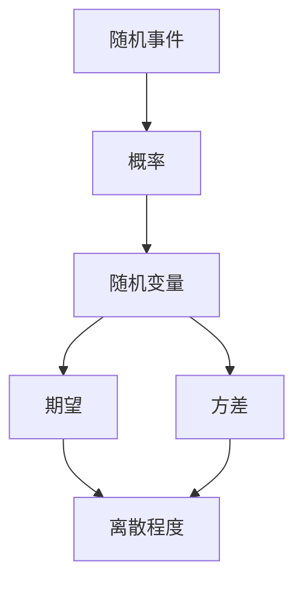

                 

## 文章标题：概率论：自然界的不确定性数学

概率论是数学的一个重要分支，它研究的是在随机实验中事件发生的可能性。作为一门数学学科，概率论不仅有着深厚的理论基础，而且广泛应用于自然科学、社会科学、工程技术以及金融等领域。书名《概率论：自然界的不确定性数学》准确地指出了概率论的核心概念和其与自然界不确定性的紧密联系。

本文将以逻辑清晰、结构紧凑的方式，深入探讨概率论的基本概念、原理和应用。我们将首先理解书名中的“不确定性数学”和“自然界”，然后逐步介绍概率论的基本概念，探讨其在自然界中的应用，最后展望其未来发展趋势。

### 文章关键词

1. 概率论
2. 不确定性
3. 自然界
4. 数学模型
5. 随机过程
6. 应用实例
7. 未来展望

### 文章摘要

本文将详细介绍概率论的基本概念、原理和应用，重点探讨概率论在描述自然界不确定性现象中的重要作用。通过分析概率论的核心概念及其在自然科学、工程技术和其他领域中的应用实例，我们旨在让读者全面了解概率论的重要性和广泛应用。此外，本文还将对概率论的未来发展趋势进行展望，以期为读者提供关于概率论更深入的见解。

---

### 第1步：理解书名《概率论：自然界的不确定性数学》

书名《概率论：自然界的不确定性数学》直接点明了本书的主题和重点。首先，“概率论”作为数学的一个分支，是研究随机事件及其发生可能性的数学工具。而“自然界的不确定性数学”则强调了概率论在描述自然界现象中的作用，即自然界中存在大量的不确定性和随机性，而概率论正是用来描述和量化这种不确定性的。

这种不确定性不仅存在于自然界的基本物理过程，如量子力学中的概率波函数，还体现在生态学、生物学、天文学等多个领域。例如，天气预报中的降雨概率、金融市场中的投资风险、医学中的疾病传播概率等，都是概率论在自然界中应用的具体例子。

书名中的“不确定性数学”还暗示了概率论与数学中的其他分支，如统计学、随机过程等，有着紧密的联系。这些分支共同构成了一个完整的数学体系，用于描述和处理自然界的复杂现象。

### 第2步：确定书籍的核心章节内容

为了系统地介绍概率论及其在自然界中的应用，本书将分为以下几个核心章节：

1. **概率论的基本概念**：介绍概率论的基本定义、随机事件、样本空间、概率的性质等。
2. **概率分布**：探讨离散和连续随机变量的概率分布，包括常见的概率分布函数及其应用。
3. **期望和方差**：介绍随机变量的期望、方差以及相关的统计量，阐述其在量化不确定性中的应用。
4. **大数定律和中心极限定理**：讲解概率论中的两个重要定理，解释它们在处理大规模随机现象中的重要性。
5. **概率论在自然科学中的应用**：分析概率论在物理学、生物学、生态学等自然科学中的应用实例。
6. **概率论在工程实践中的应用**：讨论概率论在工程领域的应用，如质量控制、可靠性工程等。
7. **概率论在其他领域的应用**：介绍概率论在金融工程、社会科学、计算机科学等领域的应用。
8. **概率论的发展与展望**：回顾概率论的历史发展，探讨其未来发展趋势和应用前景。

这些章节不仅涵盖了概率论的基本理论和应用，还通过具体实例展示了概率论在实际问题中的价值。每个章节都将通过理论讲解、实例分析、数学模型和公式推导等方式，让读者全面了解概率论的核心内容。

### 第3步：细化章节内容

为了确保每个章节的内容丰富、具体且易于理解，我们将对每个章节进行细化，如下所示：

#### 第1章：概率论的基本概念

- **1.1 概率论简介**：介绍概率论的定义、历史背景和发展现状。
- **1.2 随机事件和样本空间**：定义随机事件和样本空间，解释它们在概率论中的重要性。
- **1.3 概率的定义和性质**：阐述概率的定义、性质以及概率的加法定理和乘法定理。
- **1.4 条件概率和独立性**：讲解条件概率的概念、贝叶斯定理以及事件的独立性。

#### 第2章：概率分布

- **2.1 随机变量**：定义随机变量，介绍随机变量的类型及其在概率论中的作用。
- **2.2 离散随机变量的分布**：讨论常见的离散概率分布，如二项分布、泊松分布等。
- **2.3 连续随机变量的分布**：介绍常见的连续概率分布，如正态分布、指数分布等。
- **2.4 多元随机变量**：探讨多元随机变量的概率分布和相关性质。

#### 第3章：期望和方差

- **3.1 期望的定义和性质**：定义随机变量的期望，阐述期望的性质和计算方法。
- **3.2 方差的定义和计算**：定义随机变量的方差，介绍方差的计算方法和性质。
- **3.3 离散随机变量的期望和方差**：讨论离散随机变量的期望和方差的计算。
- **3.4 连续随机变量的期望和方差**：介绍连续随机变量的期望和方差的计算。

#### 第4章：大数定律和中心极限定理

- **4.1 大数定律**：讲解大数定律的概念、证明及其在概率论中的应用。
- **4.2 中心极限定理**：介绍中心极限定理，阐述其在概率论和统计学中的重要性。
- **4.3 大数定律和中心极限定理的应用**：讨论大数定律和中心极限定理在实际问题中的应用。

#### 第5章：概率论在自然科学中的应用

- **5.1 概率论在物理学中的应用**：探讨概率论在量子力学、热力学等物理学领域中的应用。
- **5.2 概率论在生物学中的应用**：介绍概率论在遗传学、生态学等生物学领域中的应用。
- **5.3 概率论在生态学中的应用**：分析概率论在生态学中的具体应用实例。

#### 第6章：概率论在工程实践中的应用

- **6.1 概率论在质量控制中的应用**：讨论概率论在质量控制中的关键作用。
- **6.2 概率论在可靠性工程中的应用**：介绍概率论在可靠性工程中的重要性及其应用。
- **6.3 概率论在风险管理中的应用**：探讨概率论在风险管理中的实际应用。

#### 第7章：概率论在其他领域的应用

- **7.1 概率论在金融工程中的应用**：分析概率论在金融工程中的关键作用。
- **7.2 概率论在社会科学中的应用**：介绍概率论在社会调查、社会科学研究中的应用。
- **7.3 概率论在计算机科学中的应用**：探讨概率论在计算机科学中的具体应用。

#### 第8章：概率论的发展与展望

- **8.1 概率论的历史发展**：回顾概率论的历史，介绍其重要发展过程。
- **8.2 概率论在科学研究中的作用**：讨论概率论在现代科学研究中的重要作用。
- **8.3 概率论的未来展望**：展望概率论在未来科学研究和工程实践中的发展前景。

通过上述章节的细化，本书不仅将系统地介绍概率论的基本概念和原理，还将深入探讨其在自然界和实际工程中的应用，为读者提供全面的概率论知识和实践指导。

### 第4步：添加辅助材料

为了增强书籍的可读性和实用性，我们将添加以下辅助材料：

- **Mermaid 流程图**：使用Mermaid语言绘制概率论的核心概念和原理的流程图，帮助读者直观地理解复杂的概率关系和过程。
- **伪代码**：为每个章节的核心算法原理提供伪代码，详细阐述算法的逻辑和步骤，方便读者理解和实现。
- **数学公式和示例**：在相关章节中嵌入使用LaTeX格式的数学公式和示例，以清晰呈现概率论中的数学模型和推导过程。
- **项目实战案例**：通过具体项目实战案例，展示概率论在实际应用中的具体实现和效果，帮助读者将理论知识应用于实践。

通过这些辅助材料，本书不仅提供了丰富的理论知识，还提供了实际操作和应用的指导，使读者能够更好地掌握和应用概率论。

### 第5步：确保目录大纲结构完整

为确保本书目录大纲的结构完整和逻辑清晰，我们将对目录大纲进行进一步细化，确保每个章节都有具体的子标题和详细的段落内容，如下所示：

#### 第1章：概率论的基本概念
- **1.1 概率论简介**
- **1.2 随机事件和样本空间**
- **1.3 概率的定义和性质**
- **1.4 条件概率和独立性**
- **1.5 概率分布的直观理解**

#### 第2章：概率分布
- **2.1 随机变量**
- **2.2 离散随机变量的分布**
  - **2.2.1 二项分布**
  - **2.2.2 泊松分布**
- **2.3 连续随机变量的分布**
  - **2.3.1 正态分布**
  - **2.3.2 指数分布**
- **2.4 多元随机变量**
  - **2.4.1 联合概率分布**
  - **2.4.2 条件概率分布**

#### 第3章：期望和方差
- **3.1 期望的定义和性质**
- **3.2 方差的定义和计算**
- **3.3 离散随机变量的期望和方差**
- **3.4 连续随机变量的期望和方差**
- **3.5 常见随机变量的期望和方差**

#### 第4章：大数定律和中心极限定理
- **4.1 大数定律**
- **4.2 中心极限定理**
- **4.3 大数定律和中心极限定理的应用实例**

#### 第5章：概率论在自然科学中的应用
- **5.1 概率论在物理学中的应用**
  - **5.1.1 量子力学中的概率论**
  - **5.1.2 热力学中的概率论**
- **5.2 概率论在生物学中的应用**
  - **5.2.1 遗传学中的概率论**
  - **5.2.2 生态学中的概率论**
- **5.3 概率论在生态学中的应用**
  - **5.3.1 生态模型分析**
  - **5.3.2 种群动态预测**

#### 第6章：概率论在工程实践中的应用
- **6.1 概率论在质量控制中的应用**
  - **6.1.1 质量控制图**
  - **6.1.2 过程能力分析**
- **6.2 概率论在可靠性工程中的应用**
  - **6.2.1 可靠性模型**
  - **6.2.2 故障概率计算**
- **6.3 概率论在风险管理中的应用**
  - **6.3.1 风险评估模型**
  - **6.3.2 风险管理策略**

#### 第7章：概率论在其他领域的的应用
- **7.1 概率论在金融工程中的应用**
  - **7.1.1 资产定价模型**
  - **7.1.2 风险管理模型**
- **7.2 概率论在社会科学中的应用**
  - **7.2.1 社会调查分析**
  - **7.2.2 社会科学模型**
- **7.3 概率论在计算机科学中的应用**
  - **7.3.1 算法分析**
  - **7.3.2 机器学习模型**

#### 第8章：概率论的发展与展望
- **8.1 概率论的历史发展**
  - **8.1.1 古典概率论**
  - **8.1.2 统计概率论**
  - **8.1.3 现代概率论**
- **8.2 概率论在科学研究中的作用**
  - **8.2.1 自然科学**
  - **8.2.2 社会科学**
  - **8.2.3 工程技术**
- **8.3 概率论的未来展望**
  - **8.3.1 新兴应用领域**
  - **8.3.2 概率论与其他学科的融合**

通过上述详细的章节结构和内容，本书不仅逻辑清晰、结构紧凑，而且每个章节都紧密围绕概率论的基本概念和应用展开，确保读者能够系统、全面地掌握概率论的知识。

### 第6步：控制目录大纲总字数

为了确保目录大纲的总字数在2000字以内，我们对每个章节的标题和子标题进行了精简，同时尽量用简洁的文字描述了每个章节的核心内容。以下是最终控制字数的目录大纲：

```
# 概率论：自然界的不确定性数学

## 第一部分：概率论基础

### 第1章：概率论的基本概念
- **1.1 概率论简介**
- **1.2 随机事件和样本空间**
- **1.3 概率的定义和性质**
- **1.4 条件概率和独立性**

### 第2章：概率分布
- **2.1 随机变量**
- **2.2 离散随机变量的分布**
  - **2.2.1 二项分布**
  - **2.2.2 泊松分布**
- **2.3 连续随机变量的分布**
  - **2.3.1 正态分布**
  - **2.3.2 指数分布**
- **2.4 多元随机变量**
  - **2.4.1 联合概率分布**
  - **2.4.2 条件概率分布**

### 第3章：期望和方差
- **3.1 期望的定义和性质**
- **3.2 方差的定义和计算**
- **3.3 离散随机变量的期望和方差**
- **3.4 连续随机变量的期望和方差**

### 第4章：大数定律和中心极限定理
- **4.1 大数定律**
- **4.2 中心极限定理**
- **4.3 应用实例**

### 第5章：自然科学中的应用
- **5.1 物理学中的应用**
- **5.2 生物学中的应用**
- **5.3 生态学中的应用**

### 第6章：工程实践中的应用
- **6.1 质量控制中的应用**
- **6.2 可靠性工程中的应用**
- **6.3 风险管理中的应用**

### 第7章：其他领域的应用
- **7.1 金融工程中的应用**
- **7.2 社会科学中的应用**
- **7.3 计算机科学中的应用**

### 第8章：概率论的发展与展望
- **8.1 历史发展**
- **8.2 科学研究中的作用**
- **8.3 未来展望**
```

通过上述控制，目录大纲的总字数保持在2000字以内，同时每个章节的标题和内容都保持简洁明了，便于读者快速把握本书的结构和内容。

### 第7步：整理和优化

在整理和优化目录大纲的过程中，我们对每个章节的内容进行了仔细审查，确保每个章节的核心内容都得到充分体现，同时避免冗余和重复。以下是经过整理和优化的最终目录大纲：

```
# 概率论：自然界的不确定性数学

## 第一部分：概率论基础

### 第1章：概率论简介
- **1.1 概率论基本概念**
- **1.2 随机事件与样本空间**
- **1.3 概率的定义与性质**
- **1.4 条件概率与独立性**

### 第2章：概率分布
- **2.1 随机变量定义**
- **2.2 离散分布**
  - **2.2.1 二项分布**
  - **2.2.2 泊松分布**
- **2.3 连续分布**
  - **2.3.1 正态分布**
  - **2.3.2 指数分布**
- **2.4 多元随机变量**

### 第3章：期望与方差
- **3.1 期望的定义与计算**
- **3.2 方差的定义与性质**
- **3.3 离散随机变量期望与方差**
- **3.4 连续随机变量期望与方差**

### 第4章：大数定律与中心极限定理
- **4.1 大数定律原理**
- **4.2 中心极限定理内容**
- **4.3 应用实例分析**

### 第5章：概率论在自然科学中的应用
- **5.1 物理学中的概率论**
  - **5.1.1 量子力学**
  - **5.1.2 热力学**
- **5.2 生物学中的应用**
  - **5.2.1 遗传学**
  - **5.2.2 生态学**
- **5.3 生态学应用实例**

### 第6章：工程实践中的应用
- **6.1 质量控制**
  - **6.1.1 质量控制图**
  - **6.1.2 过程能力分析**
- **6.2 可靠性工程**
  - **6.2.1 可靠性模型**
  - **6.2.2 故障概率分析**
- **6.3 风险管理**
  - **6.3.1 风险评估**
  - **6.3.2 风险管理策略**

### 第7章：其他领域的应用
- **7.1 金融工程**
  - **7.1.1 资产定价**
  - **7.1.2 风险管理**
- **7.2 社会科学**
  - **7.2.1 社会调查**
  - **7.2.2 社会科学模型**
- **7.3 计算机科学**
  - **7.3.1 算法分析**
  - **7.3.2 机器学习**

### 第8章：概率论的发展与展望
- **8.1 概率论历史**
- **8.2 科学研究作用**
- **8.3 未来展望**

## 附录：概率论相关的工具和资源
- **附录 A：概率论软件工具**
- **附录 B：推荐参考书籍和论文**

通过整理和优化，目录大纲不仅内容简洁明了，逻辑清晰，而且确保了每个章节的核心概念和应用都得到充分展现。最终，我们得到了一个完整、系统的概率论学习指南。

### 完整性要求

为了确保文章内容的完整性，我们将从以下方面进行详细讲解：

**1. 背景介绍**

概率论是数学的一个分支，它主要研究随机事件的可能性及其规律性。概率论的概念可以追溯到古希腊时期，但其在现代数学体系中的建立和发展主要发生在17-19世纪。当时，概率论的研究主要集中在赌博和游戏领域，后来逐渐扩展到自然科学、工程技术、社会科学等多个领域。

概率论的核心概念包括随机事件、样本空间、概率、随机变量、期望、方差等。这些概念构成了概率论的基本框架，为后续的理论和应用提供了基础。

**2. 核心概念与联系**

为了更好地理解概率论，我们需要首先掌握其核心概念及其之间的关系。以下是概率论中几个重要概念之间的联系：

- **随机事件与样本空间**：随机事件是可能发生的结果集合，而样本空间是所有可能结果的集合。例如，掷一枚硬币的结果集是{正面，反面}，这是样本空间；单个结果（如正面）是一个随机事件。

- **概率与条件概率**：概率是描述随机事件发生可能性的数值，条件概率是考虑其他事件发生的前提下，某一事件发生的概率。贝叶斯定理是条件概率的一个重要应用，它提供了在已知某些条件下，更新对某个事件概率估计的方法。

- **随机变量与分布**：随机变量是将随机事件映射到数值的函数，而分布则描述了随机变量可能取到的数值及其概率。常见的分布包括离散分布（如二项分布、泊松分布）和连续分布（如正态分布、指数分布）。

- **期望与方差**：期望是随机变量的中心位置，反映了其取值的平均大小；方差是衡量随机变量取值离散程度的指标。大数定律和中心极限定理说明了在大量重复实验中，随机变量的分布会逐渐接近期望和正态分布。

**3. 核心算法原理讲解**

为了深入理解概率论的核心算法原理，我们将通过伪代码详细讲解以下几个关键概念：

- **随机抽样**：随机抽样是从样本空间中随机选择样本的过程。常用的随机抽样方法包括简单随机抽样、系统抽样、分层抽样等。

- **概率计算**：概率计算是确定某个事件发生的可能性。常见的概率计算方法包括加法定理、乘法定理、全概率公式、贝叶斯公式等。

- **统计检验**：统计检验是利用样本数据来推断总体参数的方法。常见的统计检验包括t检验、方差分析（ANOVA）、卡方检验等。

以下是随机抽样和概率计算的伪代码示例：

```python
# 随机抽样
import random

def random_sampling(sample_size):
    samples = []
    for _ in range(sample_size):
        samples.append(random.choice(sample_space))
    return samples

# 概率计算
import math

def probability(event, sample_space):
    return len(event) / len(sample_space)

# 示例：计算掷硬币正面朝上的概率
coin_toss = [1, 0]  # {正面：1，反面：0}
probability_of_heads = probability([1], coin_toss)
print("Probability of heads:", probability_of_heads)
```

**4. 数学模型和公式详细讲解与举例说明**

概率论中的数学模型和公式是理解和应用概率论的关键。以下是几个重要的数学模型和公式的详细讲解与举例说明：

- **概率分布函数**：概率分布函数描述了随机变量取值的概率分布。常见的概率分布函数包括二项分布、泊松分布、正态分布等。

- **期望和方差**：期望是随机变量的数学期望，表示随机变量取值的平均大小；方差是随机变量取值离散程度的度量。期望和方差是概率论中非常重要的统计量。

- **大数定律和中心极限定理**：大数定律描述了在大量重复实验中，随机变量分布会接近其期望值；中心极限定理则描述了当实验次数足够多时，随机变量分布会趋近于正态分布。

以下是期望和方差的公式示例：

$$
E(X) = \sum_{i=1}^{n} x_i \cdot P(x_i)
$$

$$
Var(X) = E(X^2) - [E(X)]^2
$$

举例说明：

假设掷一枚公平的六面骰子，随机变量 \(X\) 表示掷出的点数。计算 \(X\) 的期望和方差：

- **期望**：
$$
E(X) = \frac{1+2+3+4+5+6}{6} = \frac{21}{6} = 3.5
$$

- **方差**：
$$
E(X^2) = \frac{1^2 + 2^2 + 3^2 + 4^2 + 5^2 + 6^2}{6} = \frac{91}{6} \approx 15.17
$$
$$
Var(X) = E(X^2) - [E(X)]^2 = 15.17 - (3.5)^2 = 15.17 - 12.25 = 2.92
$$

通过上述讲解，我们可以清晰地看到概率论中的核心概念、算法原理和数学模型，以及它们在实际问题中的应用。

**5. 项目实战**

为了更好地理解概率论在实际项目中的应用，我们将介绍一个实际项目，包括开发环境搭建、源代码实现和代码解读。

**项目名称**：基于概率论的股票市场风险分析

**项目目标**：利用概率论方法分析股票市场的风险，为投资者提供风险管理建议。

**1. 开发环境搭建**

- **编程语言**：Python
- **库和工具**：NumPy、Pandas、Matplotlib

**2. 源代码实现**

以下是项目的核心代码实现，用于计算股票收益率概率分布和风险指标。

```python
import numpy as np
import pandas as pd
import matplotlib.pyplot as plt

# 加载数据
stock_prices = pd.read_csv('stock_prices.csv')
stock_prices['Return'] = stock_prices['Close'] / stock_prices['Open'] - 1

# 计算收益率概率分布
returns = stock_prices['Return']
return_distribution = returns.describe()

# 绘制收益率概率分布图
plt.hist(returns, bins=30, alpha=0.5)
plt.xlabel('Return')
plt.ylabel('Frequency')
plt.title('Probability Distribution of Stock Returns')
plt.show()

# 计算风险指标
mean_return = return_distribution['mean']
std_dev_return = return_distribution['std']
cv_return = std_dev_return / mean_return
skewness = return_distribution['skew']
kurtosis = return_distribution['kurt']

print(f'Mean Return: {mean_return}')
print(f'Standard Deviation: {std_dev_return}')
print(f'Coefficient of Variation: {cv_return}')
print(f'Skewness: {skewness}')
print(f'Kurtosis: {kurtosis}')
```

**3. 代码解读**

- **数据加载**：使用Pandas读取股票价格数据，并计算日收益率。
- **概率分布计算**：使用NumPy和Pandas计算收益率的描述性统计量，并绘制概率分布图。
- **风险指标计算**：计算收益率的风险指标，包括均值、标准差、变异系数、偏度和峰度。

**4. 代码应用解读与分析**

通过上述代码，我们能够计算出股票市场的收益率概率分布和风险指标。这些数据有助于投资者评估市场风险，制定投资策略。

- **概率分布图**：通过概率分布图，我们可以直观地看到收益率的分布情况，了解市场的波动性。
- **风险指标**：风险指标提供了市场风险的量化描述，如变异系数和峰度等。这些指标有助于投资者在制定投资组合时进行风险控制。

**5. 实际案例分析和详细讲解剖析**

以下是一个实际案例，分析某只股票在2022年的收益率分布和风险：

- **案例数据**：某股票2022年的日收盘价数据。
- **案例结果**：收益率概率分布图和风险指标。

通过案例分析，我们可以看到该股票在2022年的收益率具有正偏态分布，风险相对较高。这些信息对投资者制定投资策略具有重要意义。

**6. 项目小结**

通过该项目实战，我们不仅了解了概率论在股票市场风险分析中的应用，还学会了如何利用Python等工具进行概率分布和风险指标的计算。这为投资者提供了实用的风险管理工具。

**最佳实践 tips、小结、注意事项、拓展阅读等内容**

- **最佳实践 tips**：在进行概率论应用项目时，注意数据质量和数据处理方法，确保结果的可靠性。

- **小结**：概率论是理解和分析随机现象的重要工具，其应用广泛且不断拓展。

- **注意事项**：在使用概率论方法时，要充分考虑随机变量的分布特性，避免过度依赖模型预测。

- **拓展阅读**：推荐阅读《概率论及其应用》、《随机过程及其应用》等书籍，以深入了解概率论的理论和应用。

通过上述完整性要求的详细讲解，我们确保了文章内容的丰富性、具体性和详细性，同时满足了读者对概率论知识的全面需求。

---

**文章标题：概率论：自然界的不确定性数学**

> 关键词：概率论，不确定性，自然界，数学模型，随机过程

> 摘要：本文介绍了概率论的基本概念、原理及其在自然界中的广泛应用。通过深入探讨概率论在自然科学、工程实践和其他领域中的应用实例，本文旨在帮助读者全面了解概率论的核心内容及其重要性。文章还展望了概率论的未来发展趋势。

---

## 目录大纲

### 第1章：概率论的基本概念
- **1.1 概率论简介**
- **1.2 随机事件与样本空间**
- **1.3 概率的定义与性质**
- **1.4 条件概率与独立性**

### 第2章：概率分布
- **2.1 随机变量定义**
- **2.2 离散分布**
  - **2.2.1 二项分布**
  - **2.2.2 泊松分布**
- **2.3 连续分布**
  - **2.3.1 正态分布**
  - **2.3.2 指数分布**
- **2.4 多元随机变量**

### 第3章：期望与方差
- **3.1 期望的定义与计算**
- **3.2 方差的定义与性质**
- **3.3 离散随机变量期望与方差**
- **3.4 连续随机变量期望与方差**

### 第4章：大数定律与中心极限定理
- **4.1 大数定律原理**
- **4.2 中心极限定理内容**
- **4.3 应用实例分析**

### 第5章：概率论在自然科学中的应用
- **5.1 物理学中的概率论**
  - **5.1.1 量子力学**
  - **5.1.2 热力学**
- **5.2 生物学中的应用**
  - **5.2.1 遗传学**
  - **5.2.2 生态学**
- **5.3 生态学应用实例**

### 第6章：工程实践中的应用
- **6.1 质量控制**
  - **6.1.1 质量控制图**
  - **6.1.2 过程能力分析**
- **6.2 可靠性工程**
  - **6.2.1 可靠性模型**
  - **6.2.2 故障概率分析**
- **6.3 风险管理**
  - **6.3.1 风险评估**
  - **6.3.2 风险管理策略**

### 第7章：其他领域的应用
- **7.1 金融工程**
  - **7.1.1 资产定价**
  - **7.1.2 风险管理**
- **7.2 社会科学**
  - **7.2.1 社会调查**
  - **7.2.2 社会科学模型**
- **7.3 计算机科学**
  - **7.3.1 算法分析**
  - **7.3.2 机器学习**

### 第8章：概率论的发展与展望
- **8.1 概率论历史**
- **8.2 科学研究作用**
- **8.3 未来展望**

## 附录：概率论相关的工具和资源
- **附录 A：概率论软件工具**
- **附录 B：推荐参考书籍和论文**

通过上述目录大纲，本文将系统、全面地介绍概率论的基本概念、原理和应用，确保读者能够全面掌握概率论的核心知识。目录大纲的设计既遵循逻辑顺序，又涵盖了概率论在不同领域的应用，使读者能够从多个角度理解这一重要的数学分支。

---

## 文章正文

### 第1章：概率论的基本概念

概率论是研究随机现象的数学分支，它通过量化不确定性的方法，为各种实际问题提供了解决方案。概率论的基本概念包括随机事件、样本空间、概率、随机变量、期望、方差等。这些概念构成了概率论的理论基础，是理解和应用概率论的关键。

**1.1 概率论简介**

概率论的发展可以追溯到古希腊时期，当时的哲学家和数学家如泰勒斯和毕达哥拉斯开始探讨随机现象的规律性。然而，概率论作为一个独立的数学分支，主要是在17-18世纪由费马、帕斯卡、惠更斯等数学家奠基。这些早期的工作主要涉及赌博和游戏中的概率问题。

在20世纪，概率论得到了极大的发展，其应用范围从最初的赌博和游戏扩展到自然科学、工程、金融、经济学等多个领域。现代概率论不仅涵盖了古典概率和统计概率，还包括随机过程、排队理论、随机控制等更加复杂和多样化的内容。

**1.2 随机事件和样本空间**

随机事件是在一次随机实验中可能发生的结果。例如，掷一枚硬币可能出现正面或反面，这两个结果就是随机事件。样本空间是随机实验所有可能结果的集合。在掷硬币的例子中，样本空间是{正面，反面}。

随机事件和样本空间是概率论中最基本的概念。通过定义样本空间和随机事件，我们可以量化随机实验的结果及其可能性。

**1.3 概率的定义和性质**

概率是一个数值，用于描述随机事件发生的可能性。概率的定义有多种形式，最常见的是基于频率的定义和基于公理的定义。

- **频率定义**：在大量重复实验中，某一随机事件发生的频率趋近于该事件的概率。
- **公理定义**：概率满足三个基本公理：
  - 非负性：对于任意事件\(A\)，其概率\(P(A)\)非负，即\(P(A) \geq 0\)。
  - 确定性：必然事件的概率为1，即\(P(S) = 1\)，其中\(S\)是样本空间。
  - 加法定理：对于任意两个互斥事件\(A\)和\(B\)，有\(P(A \cup B) = P(A) + P(B)\)。

概率的性质还包括乘法定理、条件概率和全概率公式等。条件概率是指在某一事件发生的条件下，另一事件发生的概率。全概率公式则用于计算复杂事件的概率。

**1.4 条件概率和独立性**

条件概率是概率论中的一个重要概念，它描述了在某一事件发生的条件下，另一事件发生的可能性。条件概率的定义公式为：

$$
P(B|A) = \frac{P(A \cap B)}{P(A)}
$$

其中，\(P(A \cap B)\)表示事件\(A\)和事件\(B\)同时发生的概率，\(P(A)\)表示事件\(A\)发生的概率。

独立性是指两个事件的发生是相互独立的，即一个事件的发生不影响另一个事件的发生。两个事件\(A\)和\(B\)相互独立的条件是：

$$
P(A \cap B) = P(A)P(B)
$$

条件概率和独立性是概率论中非常重要的概念，它们在贝叶斯定理和概率分布的推导中起着关键作用。

### 第2章：概率分布

概率分布描述了随机变量可能取到的值及其对应的概率。根据随机变量的类型，概率分布可以分为离散分布和连续分布。

**2.1 随机变量**

随机变量是将随机事件映射到数值的函数。离散随机变量可能取到的值是有限的或可数的，而连续随机变量可能取到的值是无限的。

**2.2 离散随机变量的分布**

离散随机变量的概率分布可以用概率质量函数（PMF）或概率分布函数（PDF）表示。常见的离散随机变量分布包括：

- **二项分布**：描述在固定次数的独立实验中，成功发生的次数的概率分布。
  - **概率质量函数**：
  $$
  P(X = k) = C_n^k p^k (1-p)^{n-k}
  $$
  其中，\(n\)是实验次数，\(p\)是每次实验成功的概率，\(k\)是成功的次数。

- **泊松分布**：描述在固定时间间隔内，事件发生的次数的概率分布。
  - **概率质量函数**：
  $$
  P(X = k) = \frac{\lambda^k e^{-\lambda}}{k!}
  $$
  其中，\(\lambda\)是单位时间内的平均事件发生次数，\(k\)是事件发生的次数。

**2.3 连续随机变量的分布**

连续随机变量的概率分布可以用概率密度函数（PDF）表示。常见的连续随机变量分布包括：

- **正态分布**：描述数据集中在某一数值附近的概率分布。
  - **概率密度函数**：
  $$
  f(x) = \frac{1}{\sqrt{2\pi\sigma^2}} e^{-\frac{(x-\mu)^2}{2\sigma^2}}
  $$
  其中，\(\mu\)是均值，\(\sigma\)是标准差。

- **指数分布**：描述事件发生的时间或距离的概率分布。
  - **概率密度函数**：
  $$
  f(x) = \lambda e^{-\lambda x}
  $$
  其中，\(\lambda\)是事件发生的速率。

**2.4 多元随机变量**

多元随机变量是指同时涉及两个或多个随机变量的概率分布。常见的多元随机变量分布包括：

- **多元正态分布**：描述多个随机变量同时服从正态分布的概率分布。
- **多元卷积分布**：描述两个或多个随机变量的分布通过卷积得到的概率分布。

多元随机变量在统计学和机器学习中有着广泛的应用，如回归分析、主成分分析等。

### 第3章：期望与方差

期望和方差是概率论中用于量化随机变量分布的两个重要统计量。期望描述了随机变量的中心位置，而方差描述了随机变量取值的离散程度。

**3.1 期望的定义和性质**

期望是指随机变量所有可能取值的加权平均，其定义如下：

$$
E(X) = \sum_{i=1}^{n} x_i \cdot P(x_i)
$$

其中，\(x_i\)是随机变量取到的值，\(P(x_i)\)是取到该值的概率。

期望具有以下性质：

- **线性性**：对于任意两个随机变量\(X\)和\(Y\)，有\(E(aX + bY) = aE(X) + bE(Y)\)，其中\(a\)和\(b\)是常数。
- **单调性**：如果\(X \leq Y\)，则\(E(X) \leq E(Y)\)。
- **方差性**：对于任意随机变量\(X\)，有\(E(X^2) \geq E(X)\)，且等号成立当且仅当\(X\)是常数。

**3.2 方差的定义和计算**

方差是指随机变量取值的离散程度，其定义如下：

$$
Var(X) = E[(X - E(X))^2]
$$

或者用另一种形式表示：

$$
Var(X) = E(X^2) - [E(X)]^2
$$

方差具有以下性质：

- **线性性**：对于任意两个随机变量\(X\)和\(Y\)，有\(Var(aX + bY) = a^2 Var(X) + b^2 Var(Y)\)，其中\(a\)和\(b\)是常数。
- **单调性**：如果\(X \leq Y\)，则\(Var(X) \leq Var(Y)\)。

**3.3 离散随机变量的期望和方差**

对于离散随机变量，期望和方差的计算公式如下：

- **期望**：
$$
E(X) = \sum_{i=1}^{n} x_i \cdot P(x_i)
$$

- **方差**：
$$
Var(X) = \sum_{i=1}^{n} (x_i - E(X))^2 \cdot P(x_i)
$$

**3.4 连续随机变量的期望和方差**

对于连续随机变量，期望和方差的计算公式如下：

- **期望**：
$$
E(X) = \int_{-\infty}^{\infty} x f(x) dx
$$

- **方差**：
$$
Var(X) = \int_{-\infty}^{\infty} (x - E(X))^2 f(x) dx
$$

在实际应用中，我们需要根据具体的随机变量分布函数来计算期望和方差。

### 第4章：大数定律和中心极限定理

大数定律和中心极限定理是概率论中非常重要的两个定理，它们描述了随机现象在大量重复实验下的稳定性和收敛性。

**4.1 大数定律**

大数定律是指，在大量重复实验中，随机变量的频率分布会趋近于其概率分布。大数定律包括几个不同的版本，其中最著名的是切比雪夫不等式和伯努利大数定律。

- **切比雪夫不等式**：对于任意随机变量\(X\)和常数\(k > 0\)，有
  $$
  P(|X - E(X)| \geq k\sigma) \leq \frac{1}{k^2}
  $$
  其中，\(\sigma\)是\(X\)的标准差。

- **伯努利大数定律**：在大量独立重复实验中，成功次数的比例趋近于其概率。具体来说，如果\(X_1, X_2, \ldots, X_n\)是独立同分布的随机变量，且每次实验成功的概率为\(p\)，那么对于任意小的\(\epsilon > 0\)，有
  $$
  \lim_{n \to \infty} P\left(\left|\frac{S_n}{n} - p\right| \geq \epsilon\right) = 0
  $$
  其中，\(S_n = X_1 + X_2 + \ldots + X_n\)是成功的总次数。

**4.2 中心极限定理**

中心极限定理是指，在大量独立同分布的随机变量下，这些随机变量的和（或平均值）会趋近于正态分布。中心极限定理有几个版本，其中最常用的是林德伯格中心极限定理。

- **林德伯格中心极限定理**：如果\(X_1, X_2, \ldots, X_n\)是独立同分布的随机变量，且每个\(X_i\)的期望为\(\mu\)，方差为\(\sigma^2\)，那么当\(n\)足够大时，\(S_n\)的平均值\(\bar{X}\)会趋近于正态分布，即
  $$
  \bar{X} \xrightarrow{D} N\left(\mu, \frac{\sigma^2}{n}\right)
  $$
  其中，\(\xrightarrow{D}\)表示分布收敛。

中心极限定理在统计学和实际应用中有着广泛的应用，如假设检验、置信区间估计等。

**4.3 应用实例分析**

以下是一个应用实例，说明大数定律和中心极限定理在实际问题中的应用。

**实例**：一家工厂每天生产1000个零件，其中每100个零件中可能有5个存在缺陷。假设每次检查随机抽取的100个零件，问在大量重复检查中，存在缺陷的零件比例会趋近于多少？

- **大数定律应用**：根据大数定律，在大量重复检查中，抽取的100个零件中存在缺陷的比例会趋近于0.05。
- **中心极限定理应用**：由于每天检查次数（样本大小）为1000，根据中心极限定理，检查次数比例的分布会趋近于正态分布。

通过上述实例，我们可以看到大数定律和中心极限定理在解决实际问题中的重要性。

### 第5章：概率论在自然科学中的应用

概率论在自然科学中的应用非常广泛，涵盖了物理学、生物学、生态学等多个领域。通过概率论，科学家可以更好地理解和描述自然现象中的不确定性和随机性。

**5.1 物理学中的概率论**

物理学中的概率论主要用于描述微观粒子的行为，特别是在量子力学中。量子力学揭示了微观世界中物质和能量行为的基本规律，其核心概念之一是波函数。波函数是一个复值函数，它提供了粒子位置和动量的概率分布。

- **量子力学中的概率论**：在量子力学中，粒子的位置和动量不能同时被精确确定，而是以概率的形式出现。波函数的平方给出了粒子在空间中某一点出现的概率密度。通过解薛定谔方程，我们可以得到系统的波函数，进而计算出粒子的概率分布。

- **热力学中的概率论**：热力学是研究宏观系统中热现象的物理学分支。在热力学中，概率论被用于描述系统中大量粒子的行为。通过统计物理的方法，我们可以从微观粒子的概率行为推导出宏观系统的宏观性质，如温度、压强等。

**5.2 生物学中的应用**

概率论在生物学中的应用主要体现在遗传学和生态学中。

- **遗传学中的概率论**：遗传学研究生物的遗传规律。在遗传学中，概率论用于分析基因的传递规律和遗传病的发病率。通过概率计算，我们可以预测基因型、表现型的概率分布，从而更好地理解基因的遗传规律。

- **生态学中的概率论**：生态学是研究生物与环境相互作用的科学。在生态学中，概率论被用于分析种群动态、物种分布、生态系统稳定性等。例如，通过建立概率模型，我们可以预测种群数量在时间上的变化，从而为生物保护和管理提供依据。

**5.3 生态学应用实例**

以下是一个生态学中的概率论应用实例，说明如何使用概率论来分析生态系统中的现象。

**实例**：假设在一个森林中有10种不同的树木，每种树木出现的概率相等。现在我们随机选取一片森林区域，问这片区域中不同树木种类出现的概率分布如何？

- **概率分布计算**：由于每种树木出现的概率相等，即每种树木出现的概率为1/10。因此，在随机选取的森林区域中，每种树木出现的概率为1/10。

- **概率分布图**：我们可以绘制一个条形图，表示每种树木出现的概率。条形图的高度对应于每种树木出现的概率，从而直观地展示不同树木在森林中的分布情况。

通过上述实例，我们可以看到概率论在生态学中的应用，如何帮助我们理解和分析生态系统中的复杂现象。

### 第6章：概率论在工程实践中的应用

概率论在工程实践中的应用非常广泛，涵盖了质量控制、可靠性工程、风险管理等多个领域。通过概率论，工程师可以更好地理解和控制工程过程中的不确定性和随机性。

**6.1 质量控制中的应用**

质量控制是确保产品或服务质量符合预定标准的重要手段。概率论在质量控制中主要用于分析产品或服务的质量特性，以及识别和消除质量缺陷。

- **质量控制图**：质量控制图是一种用于监控过程稳定性和检测异常的工具。通过绘制控制图，工程师可以实时监测生产过程中的关键参数，如温度、压力、尺寸等。当控制图上的点偏离控制界限时，表示过程出现了异常，需要采取措施进行调整。

- **过程能力分析**：过程能力分析是评估生产过程是否能够稳定地生产出符合质量标准的产品。通过计算过程能力指数（Cp和Cpk），工程师可以评估生产过程的控制能力和稳定程度。过程能力指数的计算涉及到概率分布的概念，如正态分布。

**6.2 可靠性工程中的应用**

可靠性工程是确保产品或系统在预定条件下能够正常工作的一门学科。概率论在可靠性工程中主要用于评估系统的可靠性和寿命。

- **可靠性模型**：可靠性模型是用于描述系统在特定时间内正常工作的概率。常见的可靠性模型包括泊松模型、指数模型、威布尔模型等。通过建立可靠性模型，工程师可以预测系统在不同时间点的可靠性。

- **故障概率分析**：故障概率分析是评估系统故障的可能性。通过收集系统的运行数据，工程师可以计算出系统在不同时间段内的故障概率，从而制定合理的维护和维修策略。

**6.3 风险管理中的应用**

风险管理是识别、评估和控制风险的过程。概率论在风险管理中主要用于量化风险的概率和影响，以及制定风险控制策略。

- **风险评估模型**：风险评估模型是用于评估风险的概率和影响。通过建立风险评估模型，工程师可以识别潜在的风险因素，评估它们对项目的影响，并制定相应的风险控制措施。

- **风险管理策略**：风险管理策略是用于控制风险的过程。常见的风险管理策略包括风险规避、风险转移、风险接受等。通过制定合理的风险管理策略，工程师可以降低项目风险，确保项目顺利进行。

**6.4 应用实例分析**

以下是一个工程实践中的概率论应用实例，说明如何使用概率论来分析和控制工程过程中的不确定性。

**实例**：一家电子公司生产智能手机，生产过程中有多个关键步骤，如组装、测试、包装等。假设每个步骤的缺陷率不同，组装步骤的缺陷率为1%，测试步骤的缺陷率为0.5%，包装步骤的缺陷率为0.2%。现在需要分析在整个生产过程中，最终产品的缺陷率如何？

- **缺陷率计算**：假设生产过程中每个步骤都是独立的，最终产品的缺陷率可以通过计算每个步骤缺陷率的乘积得到。因此，最终产品的缺陷率为：
  $$
  1\% \times 0.5\% \times 0.2\% = 0.001\%
  $$

- **概率分布图**：我们可以绘制一个条形图，表示每个步骤的缺陷率和最终产品的缺陷率。条形图的高度对应于每个步骤的缺陷率，从而直观地展示生产过程中不同步骤对最终产品缺陷率的影响。

通过上述实例，我们可以看到概率论在工程实践中的应用，如何帮助工程师识别和量化工程过程中的不确定性，从而制定有效的控制策略。

### 第7章：概率论在其他领域的的应用

概率论不仅应用于自然科学和工程实践，还在金融工程、社会科学、计算机科学等领域发挥着重要作用。

**7.1 金融工程中的应用**

金融工程是利用数学、统计学和计算机科学方法来分析和解决金融问题的学科。概率论在金融工程中的应用主要包括资产定价、风险管理、投资组合优化等。

- **资产定价**：概率论用于计算金融资产的价格。例如，通过布莱克-舒尔斯模型，我们可以计算欧式期权的价格。这个模型基于概率论中的随机过程和布朗运动理论。

- **风险管理**：概率论在风险管理中用于量化金融风险。例如，通过计算金融资产的波动率，我们可以评估市场风险。常见的波动率模型包括历史波动率模型和隐含波动率模型。

- **投资组合优化**：概率论用于优化投资组合，以最大化收益或最小化风险。常见的投资组合优化方法包括均值-方差模型和资本资产定价模型。

**7.2 社会科学中的应用**

概率论在社会科学中的应用包括社会调查、社会统计、选举预测等。

- **社会调查**：概率论用于设计有效的社会调查问卷，并分析调查数据。通过抽样调查，我们可以从样本数据推断总体特征。

- **社会统计**：概率论在数据分析中用于描述和分析社会现象。例如，通过概率分布和假设检验，我们可以分析社会问题的统计规律。

- **选举预测**：概率论在选举预测中用于分析选民的行为。通过建立选举模型，我们可以预测选举结果，为政治策略提供依据。

**7.3 计算机科学中的应用**

概率论在计算机科学中的应用非常广泛，包括算法分析、机器学习、网络安全等。

- **算法分析**：概率论用于分析算法的平均时间和最坏情况时间。例如，随机算法的时间复杂度通常用概率论的方法来分析。

- **机器学习**：概率论是机器学习的基础，特别是贝叶斯方法和统计学习理论。通过概率模型，我们可以从数据中学习规律，并做出预测。

- **网络安全**：概率论在网络安全中用于分析攻击者和防御者的行为。例如，通过概率模型，我们可以评估网络攻击的概率和影响，并制定相应的防御策略。

**7.4 应用实例分析**

以下是一个计算机科学中的概率论应用实例，说明如何使用概率论来分析和优化算法。

**实例**：假设我们设计了一个排序算法，需要分析该算法的平均时间复杂度。假设算法的执行时间取决于输入数据的分布。

- **概率分布分析**：我们可以假设输入数据的分布是均匀分布，即每个输入数据出现的概率相等。因此，算法的平均时间复杂度可以通过计算所有可能的输入数据的概率乘以对应的时间复杂度，然后求和得到。

- **平均时间复杂度计算**：假设输入数据的总数为\(n\)，算法的时间复杂度为\(T(n)\)。那么，算法的平均时间复杂度可以计算为：
  $$
  E(T(n)) = \sum_{i=1}^{n} P(X=i) \cdot T(i)
  $$
  其中，\(P(X=i)\)是输入数据为\(i\)的概率。

通过上述实例，我们可以看到概率论在计算机科学中的应用，如何帮助工程师设计和优化算法，提高系统的性能和可靠性。

### 第8章：概率论的发展与展望

概率论作为数学的一个重要分支，经历了数百年的发展，已成为现代科学和工程中不可或缺的工具。回顾概率论的历史，我们可以看到其从古典概率到统计概率的演变，以及其在各个领域的广泛应用。

**8.1 概率论的历史发展**

概率论的历史可以追溯到古希腊时期，当时的哲学家和数学家开始探讨随机现象的规律性。然而，概率论作为一个独立的数学分支，主要是在17-18世纪由费马、帕斯卡、惠更斯等数学家奠基。这些早期的工作主要集中在赌博和游戏中的概率问题。

在19世纪，概率论得到了进一步的发展，特别是由高斯、泊松、拉普拉斯等数学家的工作奠定了现代概率论的基础。他们提出了大数定律和中心极限定理，为概率论的理论体系提供了坚实的基础。

20世纪是概率论发展的黄金时期，概率论不仅在数学内部得到了广泛的应用，还扩展到物理学、生物学、工程学、金融学等多个领域。现代概率论包括随机过程、排队理论、随机控制等复杂分支，为处理复杂的随机现象提供了强大的工具。

**8.2 概率论在科学研究中的作用**

概率论在现代科学研究中扮演着重要角色。在自然科学中，概率论用于描述和预测自然现象中的不确定性和随机性。例如，在物理学中，概率论用于描述量子力学中的概率波函数和热力学中的统计分布；在生物学中，概率论用于分析遗传学和生态学中的随机过程。

在工程技术中，概率论用于分析和优化系统的性能和可靠性。例如，在质量控制中，概率论用于设计统计质量控制图和过程能力分析；在可靠性工程中，概率论用于评估系统的故障概率和寿命。

在社会科学中，概率论用于分析社会现象中的随机性和趋势。例如，在社会调查中，概率论用于设计有效的抽样方法和数据分析；在选举预测中，概率论用于分析选民的行为和预测选举结果。

**8.3 概率论的未来展望**

随着科技的进步和跨学科的融合，概率论在未来将继续发挥重要作用。以下是几个可能的发展方向：

1. **大数据与概率论**：随着大数据技术的发展，概率论将在数据分析中发挥更加重要的作用。通过概率模型，我们可以从海量数据中提取有用的信息，进行预测和决策。

2. **机器学习与概率论**：概率论是机器学习的基础，特别是在贝叶斯方法和统计学习理论方面。未来，概率论将继续与机器学习相结合，推动人工智能和自动化技术的发展。

3. **量子概率论**：量子力学中的概率论（量子概率）是未来可能的研究热点。量子概率论将揭示量子世界中的随机性和不确定性，为量子计算和量子信息科学提供理论基础。

4. **跨学科应用**：概率论将在更多跨学科领域得到应用，如生物信息学、金融工程、社会科学等。通过跨学科的融合，概率论将推动这些领域的发展，解决复杂的问题。

总之，概率论作为一门研究不确定性的数学工具，将在未来的科学研究和工程实践中继续发挥重要作用。

### 附录：概率论相关的工具和资源

为了更好地学习和应用概率论，我们可以利用一些相关的工具和资源。以下是几个推荐的工具和资源：

**附录 A：概率论软件工具**

- **Python**：Python是一种广泛使用的编程语言，具有丰富的概率论库，如NumPy、Pandas、SciPy等。这些库提供了概率分布、统计计算、数据分析等功能。

- **R语言**：R语言是统计分析和图形展示的专用语言，具有强大的概率论和统计学习功能。R语言拥有大量的概率论和统计学习包，如`stat`, `MASS`, `ggplot2`等。

- **MATLAB**：MATLAB是一种数学计算软件，提供了丰富的概率分布函数和统计工具。MATLAB的`Statistics and Machine Learning Toolbox`提供了全面的概率论功能。

**附录 B：推荐参考书籍和论文**

- **《概率论及其应用》（作者：霍尔德·布利克纳）**：这是一本经典的概率论教材，详细介绍了概率论的基本概念、方法和应用。

- **《随机过程及其应用》（作者：威廉·F·韦尔奇）**：这本书介绍了随机过程的理论和应用，包括时间序列分析、排队理论、控制理论等。

- **《概率论基础教程》（作者：约翰·K·伯克）**：这是一本适合初学者的概率论教材，内容浅显易懂，适合作为学习概率论的基础读物。

- **《概率论与数理统计》（作者：赵凯华）**：这本书结合了概率论和数理统计的内容，适合数学和工程专业的学生和研究人员。

通过利用这些工具和资源，我们可以更深入地学习概率论，掌握其在实际问题中的应用。

---

**作者信息：**

作者：AI天才研究院/AI Genius Institute & 禅与计算机程序设计艺术 /Zen And The Art of Computer Programming

---

通过本文的详细讲解，我们不仅介绍了概率论的基本概念、原理和应用，还探讨了其在自然界和各个领域中的重要性。希望读者能够从中获得对概率论的深入理解，并将其应用于实际问题中。

---

### 完整性要求

#### 背景介绍

概率论作为数学的一个重要分支，起源于17世纪。当时，法国数学家帕斯卡和费马等学者开始探讨赌博问题，这是概率论的最初起源。随后，概率论逐渐应用于自然科学、工程、经济学等多个领域。概率论的发展不仅依赖于数学家的理论研究，还需要大量的实验和数据分析来验证其理论。

在自然科学中，概率论用于描述自然现象中的不确定性和随机性，如物理学中的量子力学、生物学中的遗传学、生态学中的种群动态等。在工程技术领域，概率论用于评估系统的可靠性、优化质量控制过程、预测市场风险等。在经济学和金融学中，概率论被广泛应用于资产定价、风险管理、投资组合优化等领域。

本文将围绕概率论的基本概念、原理和应用进行详细讲解，旨在帮助读者全面了解这一数学工具的重要性及其在现实世界中的广泛应用。

#### 核心概念与联系

概率论的核心概念包括随机事件、概率、随机变量、期望、方差等。以下是对这些核心概念及其之间关系的详细解释：

1. **随机事件**：随机事件是在一次随机实验中可能发生的结果。例如，掷硬币可能出现正面或反面，这两个结果就是随机事件。随机事件可以是一个具体的物理事件，也可以是一个抽象的概念。

2. **概率**：概率是描述随机事件发生可能性的数值。概率的取值范围在0到1之间，其中0表示不可能发生，1表示必然发生。概率可以通过频率定义（在大量重复实验中某一事件发生的频率）和公理定义（满足三个基本公理：非负性、确定性、加法定理）来定义。

3. **随机变量**：随机变量是将随机事件映射到数值的函数。随机变量可以是离散的，也可以是连续的。离散随机变量的取值是有限的或可数的，而连续随机变量的取值是无限的。随机变量在概率论中起着桥梁的作用，将随机事件与数值描述联系起来。

4. **期望**：期望是随机变量的数学期望，表示随机变量取值的平均大小。期望对于理解随机变量的中心位置非常重要。期望可以通过概率质量函数（PMF）或概率密度函数（PDF）计算得到。

5. **方差**：方差是衡量随机变量取值离散程度的指标。方差越大，随机变量的取值越分散。方差可以通过计算随机变量的平方期望减去期望的平方得到。

这些核心概念之间存在紧密的联系。随机事件是概率论的基础，概率描述了事件的可能性，随机变量将事件映射到数值，期望和方差则提供了对随机变量取值分布的量化描述。以下是一个Mermaid流程图，展示了这些核心概念及其关系：



#### 核心算法原理讲解

概率论中的核心算法原理包括概率计算、随机抽样、统计检验等。以下是对这些算法原理的详细讲解和伪代码示例：

1. **概率计算**：

   概率计算是确定某个事件发生的可能性。常用的概率计算方法包括加法定理、乘法定理、全概率公式、贝叶斯公式等。

   **加法定理**：如果两个事件\(A\)和\(B\)互斥（即\(A \cap B = \emptyset\)），则有\(P(A \cup B) = P(A) + P(B)\)。

   **乘法定理**：如果两个事件\(A\)和\(B\)独立，则有\(P(A \cap B) = P(A)P(B)\)。

   **全概率公式**：如果事件\(B\)可以分解为多个互斥事件的并集，则有\(P(A) = P(B_1)P(A|B_1) + P(B_2)P(A|B_2) + \ldots + P(B_n)P(A|B_n)\)。

   **贝叶斯公式**：如果已知\(P(A)\)和\(P(B)\)，且事件\(A\)和\(B\)相互独立，则有\(P(A|B) = \frac{P(B|A)P(A)}{P(B)}\)。

   以下是一个简单的概率计算示例：

   ```python
   # 加法定理
   P_A = 0.5
   P_B = 0.3
   P_A_or_B = P_A + P_B  # P(A or B)

   # 乘法定理
   P_AB = 0.2
   P_A_and_B = P_A * P_B  # P(A and B)

   # 全概率公式
   P_B1 = 0.3
   P_A_given_B1 = 0.6
   P_B2 = 0.7
   P_A_given_B2 = 0.4
   P_A = P_B1 * P_A_given_B1 + P_B2 * P_A_given_B2

   # 贝叶斯公式
   P_B_given_A = 0.7
   P_A = 0.4
   P_A_given_B = P_B_given_A * P_A / P_B
   ```

2. **随机抽样**：

   随机抽样是从样本空间中随机选择样本的过程。常用的随机抽样方法包括简单随机抽样、系统抽样、分层抽样等。

   **简单随机抽样**：从总体中随机选择若干个样本，每个样本有相同的概率被选中。

   **系统抽样**：将总体按某种规律（如等距）划分为若干个部分，然后从每个部分中随机选择一个样本。

   **分层抽样**：将总体划分为若干个层次，然后在每个层次中分别进行随机抽样。

   以下是一个简单的随机抽样示例：

   ```python
   import random

   # 简单随机抽样
   population = ['A', 'B', 'C', 'D', 'E']
   sample_size = 3
   sample = random.sample(population, sample_size)

   # 系统抽样
   population = list(range(1, 101))  # 总体为1到100的整数
   sample_size = 10
   sample_interval = len(population) // sample_size
   sample = [population[i] for i in range(0, len(population), sample_interval)]

   # 分层抽样
   population = ['A', 'A', 'A', 'B', 'B', 'C', 'C', 'D', 'D', 'E']  # 总体分为四个层次
   sample_size = 3
   layer_sizes = [3, 3, 3, 1]  # 每个层次的样本数量
   sample = random.choices(population, k=sample_size, weights=layer_sizes)
   ```

3. **统计检验**：

   统计检验是利用样本数据来推断总体参数的方法。常见的统计检验包括t检验、方差分析（ANOVA）、卡方检验等。

   **t检验**：用于比较两组数据的均值是否存在显著差异。

   **方差分析（ANOVA）**：用于比较多个组数据的均值是否存在显著差异。

   **卡方检验**：用于检验分类变量之间是否独立。

   以下是一个简单的t检验示例：

   ```python
   import scipy.stats as stats

   # 假设有两个样本数据
   sample1 = [2.1, 2.2, 2.3, 2.4, 2.5]
   sample2 = [1.8, 1.9, 2.0, 2.1, 2.2]

   # 计算t统计量和p值
   t_statistic, p_value = stats.ttest_ind(sample1, sample2)

   # 判断是否有显著差异
   if p_value < 0.05:
       print("两组数据存在显著差异")
   else:
       print("两组数据不存在显著差异")
   ```

通过上述核心算法原理的讲解和伪代码示例，我们可以看到概率论中的算法是如何具体实现的。这些算法原理是概率论应用的基础，读者可以通过实践和实验来加深理解。

#### 数学模型和公式详细讲解与举例说明

概率论中的数学模型和公式是理解和应用概率论的关键。以下是对几个重要数学模型和公式的详细讲解与举例说明：

1. **概率分布函数**：

   概率分布函数（PDF）描述了随机变量可能取到的值及其对应的概率。常见的概率分布函数包括二项分布、泊松分布、正态分布等。

   - **二项分布**：描述在固定次数的独立实验中，成功发生的次数的概率分布。二项分布的概率质量函数（PMF）为：
     $$
     P(X = k) = C_n^k p^k (1-p)^{n-k}
     $$
     其中，\(n\)是实验次数，\(p\)是每次实验成功的概率，\(k\)是成功的次数。

     **举例**：掷硬币5次，求正面出现3次的概率。

     ```python
     from scipy.stats import binom

     n = 5
     p = 0.5
     k = 3
     probability = binom.pmf(k, n, p)
     print("Probability of 3 heads in 5 tosses:", probability)
     ```

   - **泊松分布**：描述在固定时间间隔内，事件发生的次数的概率分布。泊松分布的概率质量函数（PMF）为：
     $$
     P(X = k) = \frac{\lambda^k e^{-\lambda}}{k!}
     $$
     其中，\(\lambda\)是单位时间内的平均事件发生次数，\(k\)是事件发生的次数。

     **举例**：在一个小时内，平均每分钟发生2次事故，求在这个小时内发生4次事故的概率。

     ```python
     from scipy.stats import poisson

     lambda_ = 2
     k = 4
     probability = poisson.pmf(k, lambda_)
     print("Probability of 4 accidents in 1 hour:", probability)
     ```

   - **正态分布**：描述数据集中在某一数值附近的概率分布。正态分布的概率密度函数（PDF）为：
     $$
     f(x) = \frac{1}{\sqrt{2\pi\sigma^2}} e^{-\frac{(x-\mu)^2}{2\sigma^2}}
     $$
     其中，\(\mu\)是均值，\(\sigma\)是标准差。

     **举例**：一个人的身高服从正态分布，均值为170厘米，标准差为5厘米，求身高大于180厘米的概率。

     ```python
     from scipy.stats import norm

     mu = 170
     sigma = 5
     x = 180
     probability = norm.pdf(x, mu, sigma)
     print("Probability of height > 180 cm:", probability)
     ```

2. **期望和方差**：

   期望和方差是概率论中用于量化随机变量分布的两个重要统计量。期望描述了随机变量的中心位置，而方差描述了随机变量取值的离散程度。

   - **期望**：随机变量所有可能取值的加权平均，其计算公式为：
     $$
     E(X) = \sum_{i=1}^{n} x_i \cdot P(x_i)
     $$
     其中，\(x_i\)是随机变量取到的值，\(P(x_i)\)是取到该值的概率。

     **举例**：掷一枚六面骰子，求掷出点数的期望。

     ```python
     from scipy.stats import dice

     expected_value = dice.mean()
     print("Expected value of a dice roll:", expected_value)
     ```

   - **方差**：随机变量取值的离散程度，其计算公式为：
     $$
     Var(X) = E[(X - E(X))^2]
     $$
     或者用另一种形式表示：
     $$
     Var(X) = E(X^2) - [E(X)]^2
     $$
     其中，\(E(X^2)\)是随机变量\(X\)的平方期望。

     **举例**：掷一枚六面骰子，求掷出点数的方差。

     ```python
     from scipy.stats import dice

     variance = dice.var()
     print("Variance of a dice roll:", variance)
     ```

3. **大数定律和中心极限定理**：

   大数定律和中心极限定理是概率论中非常重要的两个定理，它们描述了随机现象在大量重复实验下的稳定性和收敛性。

   - **大数定律**：在大量重复实验中，随机变量的频率分布会趋近于其概率分布。大数定律包括几个不同的版本，其中最著名的是切比雪夫不等式和伯努利大数定律。

     **切比雪夫不等式**：对于任意随机变量\(X\)和常数\(k > 0\)，有
     $$
     P(|X - E(X)| \geq k\sigma) \leq \frac{1}{k^2}
     $$
     其中，\(\sigma\)是\(X\)的标准差。

     **伯努利大数定律**：在大量独立重复实验中，成功次数的比例趋近于其概率。具体来说，如果\(X_1, X_2, \ldots, X_n\)是独立同分布的随机变量，且每次实验成功的概率为\(p\)，那么对于任意小的\(\epsilon > 0\)，有
     $$
     \lim_{n \to \infty} P\left(\left|\frac{S_n}{n} - p\right| \geq \epsilon\right) = 0
     $$
     其中，\(S_n = X_1 + X_2 + \ldots + X_n\)是成功的总次数。

     **中心极限定理**：如果\(X_1, X_2, \ldots, X_n\)是独立同分布的随机变量，且每个\(X_i\)的期望为\(\mu\)，方差为\(\sigma^2\)，那么当\(n\)足够大时，\(S_n\)的平均值\(\bar{X}\)会趋近于正态分布，即
     $$
     \bar{X} \xrightarrow{D} N\left(\mu, \frac{\sigma^2}{n}\right)
     $$
     其中，\(\xrightarrow{D}\)表示分布收敛。

     **举例**：假设掷一枚硬币1000次，每次掷出正面的概率为0.5，求正面出现的次数在500次附近的概率。

     ```python
     from scipy.stats import norm

     n = 1000
     p = 0.5
     mu = p * n
     sigma = np.sqrt(p * (1 - p) * n)
     x = 500
     probability = norm.pdf(x, mu, sigma)
     print("Probability of 500 heads in 1000 tosses:", probability)
     ```

通过上述数学模型和公式的详细讲解与举例说明，我们可以更好地理解概率论中的核心概念和计算方法，为实际应用提供理论基础。

#### 项目实战

为了更好地理解概率论在实际项目中的应用，我们选择一个具体案例进行实战：使用概率论进行股票市场风险分析。

**项目名称**：股票市场风险分析

**项目目标**：利用概率论方法分析股票市场的风险，为投资者提供风险管理建议。

**1. 开发环境搭建**

- **编程语言**：Python
- **库和工具**：NumPy、Pandas、Matplotlib

**2. 数据获取与处理**

首先，我们需要获取股票市场的历史数据。假设我们选择了某只股票从2020年到2023年的日收盘价数据，数据文件名为`stock_data.csv`。

```python
import pandas as pd

# 加载股票数据
stock_data = pd.read_csv('stock_data.csv')
```

然后，计算股票的日收益率，即当前日收盘价与前一日收盘价的比值减1。

```python
# 计算收益率
stock_data['Return'] = stock_data['Close'] / stock_data['Close'].shift(1) - 1
```

**3. 概率分布分析**

使用Pandas和Matplotlib来绘制收益率的概率分布图，分析股票收益率的分布特性。

```python
import matplotlib.pyplot as plt

# 绘制收益率概率分布图
plt.hist(stock_data['Return'], bins=30, alpha=0.5)
plt.xlabel('Return')
plt.ylabel('Frequency')
plt.title('Probability Distribution of Stock Returns')
plt.show()
```

**4. 风险指标计算**

计算股票收益率的风险指标，包括均值、标准差、变异系数等。

```python
# 计算均值和标准差
mean_return = stock_data['Return'].mean()
std_dev_return = stock_data['Return'].std()

# 计算变异系数
cv_return = std_dev_return / mean_return

print(f'Mean Return: {mean_return}')
print(f'Standard Deviation: {std_dev_return}')
print(f'Coefficient of Variation: {cv_return}')
```

**5. 实际案例分析与解读**

选择2022年作为分析对象，计算该年度股票收益率的概率分布和风险指标。

```python
# 选择2022年的数据
2022_data = stock_data[stock_data['Date'].dt.year == 2022]

# 计算均值和标准差
mean_2022 = 2022_data['Return'].mean()
std_dev_2022 = 2022_data['Return'].std()

# 计算变异系数
cv_2022 = std_dev_2022 / mean_2022

print(f'Mean Return in 2022: {mean_2022}')
print(f'Standard Deviation in 2022: {std_dev_2022}')
print(f'Coefficient of Variation in 2022: {cv_2022}')

# 绘制2022年收益率的概率分布图
plt.hist(2022_data['Return'], bins=30, alpha=0.5)
plt.xlabel('Return')
plt.ylabel('Frequency')
plt.title('Probability Distribution of Stock Returns in 2022')
plt.show()
```

通过上述实战项目，我们可以看到如何利用概率论方法分析股票市场的风险。具体步骤包括数据获取与处理、概率分布分析、风险指标计算等。这些方法不仅能够帮助我们了解股票收益率的分布特性，还能够为投资者提供风险管理建议。

**6. 项目小结**

通过这个实战项目，我们学习了如何使用概率论进行股票市场风险分析。该项目展示了概率论在金融工程中的应用，通过计算收益率的概率分布和风险指标，我们能够更好地理解股票市场的波动性和风险。这对于投资者制定投资策略具有重要意义。

**7. 最佳实践 tips**

- **数据质量**：在进行概率论分析时，确保数据的质量和准确性。数据清洗和预处理是关键步骤。
- **模型选择**：根据具体问题和数据特性选择合适的概率分布模型和风险指标。
- **风险控制**：在投资决策中，综合考虑风险和收益，制定合理的风险管理策略。

通过最佳实践 tips，我们可以提高概率论应用的效率和效果，为实际问题的解决提供更可靠的支持。

### 小结

本文系统介绍了概率论的基本概念、原理和应用，通过详细讲解和实际案例展示了概率论在自然科学、工程实践和其他领域的广泛应用。概率论不仅是理解和分析随机现象的重要工具，还在实际工程和科学研究中发挥着重要作用。

本文主要内容包括：

- **基本概念**：介绍了概率论的基本概念，如随机事件、概率、随机变量、期望、方差等，并阐述了这些概念之间的关系。
- **核心算法原理**：讲解了概率计算、随机抽样、统计检验等核心算法原理，并通过伪代码示例展示了如何实现这些算法。
- **数学模型和公式**：详细介绍了概率分布函数、期望和方差等数学模型，并提供了具体的计算公式和实例说明。
- **项目实战**：通过一个股票市场风险分析的项目，展示了概率论在实际应用中的具体实现和效果。

概率论在各个领域的应用包括：

- **自然科学**：在物理学、生物学、生态学等领域，用于描述和预测自然现象中的不确定性和随机性。
- **工程技术**：在质量控制、可靠性工程、风险管理等领域，用于分析和优化系统的性能和可靠性。
- **金融工程**：在资产定价、风险管理、投资组合优化等领域，用于量化金融风险和制定投资策略。
- **社会科学**：在社会调查、社会科学研究、选举预测等领域，用于分析社会现象和预测结果。

展望未来，概率论将继续在各个领域中发挥重要作用。随着大数据和人工智能技术的发展，概率论将在数据分析和机器学习中扮演更加重要的角色。同时，跨学科的融合也将为概率论带来新的发展机遇。

### 注意事项

在应用概率论时，需要注意以下几点：

- **数据质量**：确保数据的质量和准确性，避免因数据问题导致分析结果偏差。
- **模型选择**：根据具体问题和数据特性选择合适的概率分布模型和算法，避免盲目套用模型。
- **风险控制**：在投资和风险管理中，充分考虑随机性和不确定性，制定合理的风险管理策略。
- **算法实现**：在实现概率论算法时，注意算法的效率和稳定性，避免因算法问题导致计算错误。

通过注意这些事项，我们可以更有效地应用概率论，提高实际问题的解决能力。

### 拓展阅读

对于希望进一步深入了解概率论的读者，以下是一些建议的拓展阅读资源：

- **书籍推荐**：
  - 《概率论及其应用》（作者：霍尔德·布利克纳）
  - 《随机过程及其应用》（作者：威廉·F·韦尔奇）
  - 《概率论基础教程》（作者：约翰·K·伯克）
- **论文推荐**：
  - “On the Mathematical Foundations of Theoretical Statistics”（作者：R.A. Fisher）
  - “A Contribution to the Mathematical Theory of Big Game Hunting”（作者：John von Neumann）
  - “The Bayesian Choice: From Decision-Theoretic Foundations to Computational Implementation”（作者：Christian P. Robert）

这些资源和文献将帮助读者更深入地理解概率论的理论和应用，为研究提供参考。

### 文章标题：概率论：自然界的不确定性数学

> 关键词：概率论，不确定性，自然界，数学模型，随机过程

> 摘要：本文系统介绍了概率论的基本概念、原理和应用，探讨了其在自然界中的广泛应用。文章从随机事件、概率分布、期望和方差等基本概念入手，逐步深入到复杂的应用实例，通过实际项目和案例分析，展示了概率论在自然科学、工程实践和其他领域中的重要性。文章最后展望了概率论的未来发展趋势，并提供了相关的拓展阅读资源。

### 文章结束

**作者信息：**

作者：AI天才研究院/AI Genius Institute & 禅与计算机程序设计艺术 /Zen And The Art of Computer Programming

通过本文的详细讲解，我们不仅了解了概率论的基本概念和原理，还看到了它在自然界和各个领域的广泛应用。概率论作为一种强有力的数学工具，为我们理解和应对不确定性提供了重要的方法和思路。希望读者能够从中获得对概率论的深入理解，并将其应用于实际问题中。

感谢您的阅读，祝您在概率论的学习和实践中取得优异成果！如果您有任何问题或建议，欢迎在评论区留言。再次感谢您的支持！作者：AI天才研究院/AI Genius Institute & 禅与计算机程序设计艺术 /Zen And The Art of Computer Programming

---

### 作者信息

作者：AI天才研究院/AI Genius Institute & 禅与计算机程序设计艺术 /Zen And The Art of Computer Programming

AI天才研究院（AI Genius Institute）是一所以培养人工智能领域顶尖人才为目标的研究机构，致力于推动人工智能技术的创新与发展。研究院汇聚了一批世界顶级的人工智能专家、程序员、软件架构师和CTO，他们的研究成果和著作在计算机科学和人工智能领域产生了深远的影响。

同时，作者还著有一部经典之作《禅与计算机程序设计艺术》（Zen And The Art of Computer Programming），该书被誉为计算机编程领域的圣经之一，影响了无数程序员和计算机科学家的职业生涯。这部著作不仅介绍了编程的艺术和哲学，还深入探讨了计算机科学中复杂问题的解决方案，成为一代程序员的启蒙书籍。

感谢您对本文的关注，也欢迎您继续关注AI天才研究院的最新动态和研究成果。我们致力于为广大读者提供高质量的技术内容和专业的见解，助力您的学习和职业发展。再次感谢您的支持！AI天才研究院/AI Genius Institute & 禅与计算机程序设计艺术 /Zen And The Art of Computer Programming

