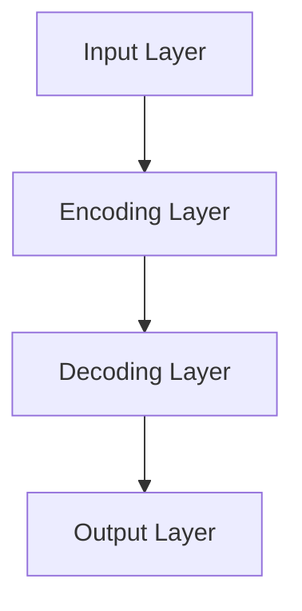

                 

### 文章标题

《模块化设计：LLM应用架构的基石》

### 关键词

模块化设计、语言模型（LLM）、应用架构、软件开发、人工智能

### 摘要

本文将深入探讨模块化设计在语言模型（LLM）应用架构中的重要性。我们将首先介绍模块化设计的基本概念，然后逐步分析其在LLM架构中的应用。通过详细的案例分析、算法原理讲解、以及实际项目实战，我们将展示如何将模块化设计理念应用到LLM系统中，以提升其性能、可维护性和可扩展性。最终，我们将展望模块化设计在LLM未来的发展趋势，探讨面临的挑战及机遇。

## 引言

模块化设计（Modular Design）是一种现代软件开发方法，旨在将复杂系统分解为独立的、可重用的模块。这种方法不仅能够提高软件的可维护性，还能加速开发过程，降低成本。随着人工智能（AI）技术的快速发展，尤其是语言模型（Language Model, LLM）的广泛应用，模块化设计在AI应用架构中的重要性日益凸显。

语言模型是AI领域的重要基础技术，它通过学习大量语言数据，能够生成或理解自然语言。LLM在智能客服、智能推荐、智能写作等应用中表现出色，但同时也面临着复杂性和可维护性的挑战。模块化设计为解决这些问题提供了一种有效的思路。通过将LLM系统分解为独立的模块，可以更好地管理和维护系统，提高其性能和可扩展性。

本文将首先介绍模块化设计的基本概念和原则，然后深入探讨LLM的基本架构和模块化设计的关系。接着，我们将通过具体案例，展示如何将模块化设计应用于LLM系统中。此外，还将介绍一些常用的LLM开发工具，并探讨模块化设计在LLM应用中的最佳实践。最后，我们将讨论模块化设计在LLM未来的发展趋势，以及面临的挑战和机遇。

## 模块化设计概述

### 模块化设计的定义

模块化设计是一种软件开发方法，它将复杂系统分解为多个独立的、可重用的模块。每个模块具有明确的功能和接口，通过模块间的接口实现模块间的通信和协作。模块化设计的核心思想是将系统的复杂性降低，使其更易于理解和维护。

一个模块通常包括以下几个组成部分：

- **功能**：模块实现的具体功能。
- **接口**：模块与其他模块之间的交互界面，包括输入和输出。
- **实现**：模块的具体实现代码。

模块化设计的优点包括：

- **可重用性**：模块可以独立开发、测试和部署，从而提高代码的重用性。
- **可维护性**：模块化设计使得系统更易于维护，因为每个模块相对独立，修改一个模块不会影响其他模块。
- **可扩展性**：通过增加或替换模块，可以方便地扩展系统的功能。

### 模块化设计的重要性

在软件开发中，模块化设计的重要性不可低估。首先，它能够显著提高开发效率。通过模块化设计，开发人员可以并行开发不同模块，从而缩短项目开发周期。其次，模块化设计有助于提高代码质量。由于每个模块相对独立，可以更有效地进行单元测试和集成测试，从而减少错误。此外，模块化设计还提高了系统的可维护性和可扩展性，使得系统在未来能够更好地应对变化和扩展。

在人工智能领域，特别是LLM应用中，模块化设计的重要性尤为突出。LLM系统通常非常复杂，涉及大量的数据处理、模型训练和推理过程。通过模块化设计，可以将这些复杂的过程分解为多个独立的模块，每个模块负责特定的任务。这不仅有助于降低系统的复杂性，还能提高系统的可维护性和可扩展性。例如，在智能客服系统中，可以将对话管理、意图识别和实体提取等任务分别实现为独立的模块，每个模块可以独立优化和扩展。

总之，模块化设计不仅是一种有效的软件开发方法，也是提高AI系统性能和可维护性的关键手段。在LLM应用架构中，模块化设计的作用不容忽视，它为系统的设计和实现提供了坚实的基石。

### 模块化设计与LLM的关系

模块化设计在LLM（Language Model）应用架构中扮演着至关重要的角色。LLM是一种复杂的机器学习模型，能够理解和生成自然语言。其架构通常包括数据预处理、模型训练、模型优化和模型部署等多个阶段。模块化设计能够有效地将这些阶段分解为独立的模块，从而提高系统的可维护性和可扩展性。

#### 模块化设计与LLM架构的关系

首先，我们可以将LLM的架构分解为以下几个核心模块：

1. **数据预处理模块**：负责对输入数据（如文本、语音等）进行预处理，包括文本清洗、分词、词向量化等步骤。
2. **模型训练模块**：负责使用预处理的文本数据训练语言模型，包括选择适当的神经网络架构、调整模型参数等。
3. **模型优化模块**：负责对训练好的模型进行优化，以提高其性能和效率，可能包括模型剪枝、量化等。
4. **模型部署模块**：负责将优化的模型部署到实际应用环境中，实现模型推理和预测。

通过模块化设计，每个模块都可以独立开发和测试，从而提高系统的整体质量和开发效率。具体来说：

- **数据预处理模块**：由于数据预处理通常需要处理大量的不同类型的数据，模块化设计允许开发人员专注于特定类型的数据处理任务，如分词、词向量化等，而不必考虑整个数据处理流程。这有助于提高代码的可读性和可维护性。
- **模型训练模块**：模型训练是LLM系统中的核心部分，但也是一个计算密集型的过程。模块化设计使得开发人员可以独立地开发和优化训练算法，例如使用不同的优化器或调整学习率等，从而提高模型性能。
- **模型优化模块**：在模型训练后，可能需要对模型进行优化，以提高其效率和效果。模块化设计使得这些优化过程可以独立进行，例如模型剪枝、量化等，而不影响其他模块。
- **模型部署模块**：模型部署涉及到将训练好的模型部署到不同的硬件和平台环境中，模块化设计使得这一过程可以更加灵活和高效。开发人员可以独立开发和优化部署算法，例如模型转换、部署环境配置等。

#### 模块化设计对LLM性能的影响

模块化设计对LLM性能有着重要的影响。通过模块化设计，可以更有效地管理和优化系统的不同部分：

- **性能提升**：模块化设计允许对系统的每个模块进行独立优化，从而提高整体性能。例如，通过优化数据预处理模块，可以减少数据加载和预处理的延迟，提高模型训练的效率。
- **可扩展性**：模块化设计使得系统具有更好的可扩展性。随着新的需求或技术的出现，可以方便地添加或替换现有模块，而不需要大规模修改整个系统。
- **可维护性**：模块化设计提高了代码的可维护性。由于每个模块相对独立，修改一个模块通常不会影响其他模块，从而降低系统维护的复杂性和风险。

总之，模块化设计是LLM应用架构的基石，它通过将复杂系统分解为独立的模块，提高了系统的可维护性、可扩展性和性能。在设计和实现LLM系统时，采用模块化设计理念至关重要。

### LLM基础

#### LLM的概念与特点

语言模型（Language Model, LLM）是自然语言处理（Natural Language Processing, NLP）领域中的一种核心技术，它能够对自然语言进行建模，以预测下一个词、句子或文本序列。LLM是一种概率模型，通过学习大量文本数据，捕捉语言的结构和语义信息，从而实现文本生成、文本分类、机器翻译等任务。

LLM的主要特点包括：

1. **概率性**：LLM基于概率统计方法，通过计算输入文本的概率分布来生成输出文本。这使得LLM能够生成多样化和自然流畅的文本。
2. **序列性**：自然语言是序列性的，LLM能够处理和生成文本序列。这意味着LLM可以理解上下文信息，并生成符合上下文语义的文本。
3. **复杂性**：LLM通常采用复杂的神经网络架构，如循环神经网络（RNN）、长短时记忆网络（LSTM）和变压器（Transformer）等，能够处理大规模数据和复杂语言结构。

#### LLM的基本架构

LLM的基本架构通常包括以下几个部分：

1. **输入层**：接收自然语言输入，如文本、词序列或语音信号。
2. **编码层**：对输入文本进行编码，提取特征信息。编码层可能包括分词、词向量化、词嵌入等步骤。
3. **解码层**：生成输出文本。解码层通常使用解码器（Decoder）来生成文本序列，解码器可能包括循环神经网络（RNN）、长短时记忆网络（LSTM）或变压器（Transformer）等。
4. **输出层**：输出最终生成的文本。

以下是一个简单的LLM架构的Mermaid流程图：



#### LLM的优缺点分析

LLM作为一种强大的自然语言处理工具，具有显著的优点，但也存在一些缺点。

**优点**：

1. **生成性**：LLM能够生成自然流畅的文本，这在文本生成任务（如聊天机器人、文章生成等）中非常有用。
2. **上下文理解**：由于LLM能够捕捉文本的序列性和上下文信息，它可以生成符合上下文语义的文本。
3. **多语言支持**：LLM可以通过学习多种语言的文本数据，实现跨语言的自然语言处理任务。

**缺点**：

1. **计算复杂度高**：LLM通常采用复杂的神经网络架构，训练和推理过程需要大量的计算资源，这可能导致训练时间较长和推理延迟较大。
2. **数据依赖性**：LLM的性能高度依赖于训练数据的质量和数量。如果训练数据存在偏差或不足，LLM的性能可能受到影响。
3. **可解释性差**：由于LLM的内部机制复杂，其决策过程通常难以解释，这在一些需要高解释性的应用场景中可能是一个问题。

综上所述，LLM作为一种强大的自然语言处理工具，具有生成性、上下文理解和多语言支持等优点，但同时也面临着计算复杂度高、数据依赖性和可解释性差等缺点。在设计和应用LLM时，需要充分考虑这些优缺点，以最大化其优势并克服其局限性。

### 模块化设计原则

模块化设计是一种系统化的软件开发方法，其核心在于将复杂系统分解为独立的模块，以提高代码的可维护性和可扩展性。以下是模块化设计的一些基本原则：

#### 功能一致性

每个模块应专注于实现单一功能，遵循单一职责原则（Single Responsibility Principle）。这意味着一个模块只负责完成一项特定的任务，而不应涉及多个功能。功能一致性有助于提高代码的可读性和可维护性，因为每个模块的职责明确，修改一个模块不会影响其他模块。

#### 独立性

模块应具有独立性，即每个模块可以独立开发、测试和部署，而不会依赖其他模块。这种独立性使得模块可以并行工作，从而提高开发效率。同时，独立性也使得模块可以方便地替换或扩展，以适应未来的需求变化。

#### 接口明确

模块之间的交互应通过明确的接口进行。接口定义了模块的输入和输出，以及模块之间的通信协议。明确的接口有助于减少模块间的耦合，提高系统的可维护性和可扩展性。

#### 可重用性

模块应设计为可重用的组件。这意味着模块可以独立部署到不同的项目中，而不需要修改其内部实现。可重用性不仅提高了代码的复用率，还减少了重复开发的工作量。

#### 可测试性

模块应具有良好的可测试性。这意味着每个模块都可以独立进行单元测试，验证其功能的正确性。良好的可测试性有助于提高代码的质量和可靠性。

#### 可扩展性

模块应具有良好的可扩展性。这意味着系统可以方便地添加或替换现有模块，以实现功能扩展。良好的可扩展性使得系统能够适应不断变化的需求。

#### 优化性能

模块设计时还应考虑性能优化。通过合理设计模块和数据结构，可以减少计算和通信开销，提高系统的整体性能。

### 模块化设计原则在LLM应用中的重要性

在LLM（Language Model）应用架构中，模块化设计原则至关重要。首先，LLM系统通常非常复杂，涉及大量的数据处理、模型训练和推理过程。通过模块化设计，可以将这些复杂的过程分解为独立的模块，每个模块负责特定的任务，从而降低系统的复杂性。

其次，模块化设计有助于提高LLM系统的可维护性和可扩展性。由于每个模块相对独立，修改一个模块通常不会影响其他模块，从而降低系统维护的复杂性和风险。此外，模块化设计使得系统具有更好的可扩展性，随着新的需求或技术的出现，可以方便地添加或替换现有模块，而不需要大规模修改整个系统。

最后，模块化设计还可以提高LLM系统的性能。通过优化模块的设计和实现，可以减少计算和通信开销，提高系统的整体性能。例如，通过优化数据预处理模块，可以减少数据加载和预处理的延迟，提高模型训练的效率。

总之，模块化设计原则在LLM应用架构中具有重要的意义，它不仅能够降低系统的复杂性，提高可维护性和可扩展性，还能优化系统性能。在设计和实现LLM系统时，应充分考虑并应用这些原则，以提高系统的质量和效率。

### 模块化设计方法

模块化设计方法是将复杂系统分解为多个独立模块的过程，目的是提高代码的可维护性、可扩展性和性能。以下是几种常见的模块化设计方法：

#### 功能分解

功能分解是一种最常见的模块化设计方法，其核心思想是将系统功能分解为多个子功能模块。每个子功能模块实现一个具体的功能，例如文本预处理、模型训练、模型推理等。这种方法有助于降低系统的复杂性，使得每个模块更加专注于单一功能，从而提高代码的可读性和可维护性。

#### 数据抽象

数据抽象是一种通过定义抽象数据类型（Abstract Data Type, ADT）来模块化设计的方法。ADT定义了一组数据结构和操作，将数据的存储和处理分离，使得模块间的依赖性降低。例如，可以定义一个文本处理ADT，包括文本读取、写入、分词等操作，模块可以通过ADT接口进行操作，而无需知道具体实现细节。

#### 接口设计

接口设计是一种通过定义明确的接口来模块化设计的方法。接口定义了模块的输入、输出和通信协议，使得模块间通过接口进行交互，减少了直接的耦合。例如，可以使用接口定义数据预处理模块和模型训练模块的交互，数据预处理模块提供预处理后的数据给模型训练模块，而无需知道数据的具体来源和处理过程。

#### 依赖注入

依赖注入（Dependency Injection, DI）是一种通过将模块的依赖关系外部化来模块化设计的方法。通过依赖注入，可以将模块的依赖关系从模块内部移到外部，从而实现模块的独立性和可重用性。例如，可以使用依赖注入框架，将数据预处理模块和模型训练模块的依赖关系从代码中分离，从而方便替换或扩展。

#### 模块化设计工具

在实际开发中，使用模块化设计工具可以大大提高模块化设计的效率和质量。以下是一些常用的模块化设计工具：

- **模块化框架**：例如Java中的Spring框架、Python中的Django框架等，提供了模块化设计和开发的基础框架。
- **模块化开发工具**：例如Visual Studio Code中的模块化插件、Eclipse中的模块化开发插件等，提供了模块化代码编辑、调试和部署功能。
- **模块化开发平台**：例如Google Cloud Platform、Amazon Web Services等，提供了模块化开发和部署的云服务。

#### 模块化设计在LLM开发中的实践

在LLM开发中，模块化设计方法有助于提高系统的可维护性和可扩展性。以下是一个简单的LLM开发中的模块化设计示例：

1. **数据预处理模块**：负责文本数据的清洗、分词和词向量化等预处理任务。
2. **模型训练模块**：负责使用预处理的文本数据训练语言模型，可以选择不同的神经网络架构和优化器。
3. **模型评估模块**：负责评估训练好的模型性能，可以使用不同的评估指标进行评估。
4. **模型推理模块**：负责使用训练好的模型进行文本生成或预测任务。

通过模块化设计，每个模块可以独立开发和测试，从而提高开发效率和质量。同时，模块化设计也使得LLM系统具有更好的可扩展性，随着新的需求或技术的出现，可以方便地添加或替换现有模块。

总之，模块化设计方法是提高LLM开发效率和系统质量的关键手段。通过合理应用模块化设计方法，可以显著降低系统的复杂性，提高可维护性和可扩展性，为LLM应用提供坚实的架构基础。

### 模块化设计与LLM开发工具的结合使用

在LLM开发过程中，模块化设计与开发工具的结合使用能够显著提升开发效率和系统质量。以下将介绍几个常用的LLM开发工具，并探讨如何通过模块化设计有效地结合使用这些工具。

#### TensorFlow

TensorFlow是一个开源的机器学习框架，广泛应用于LLM的开发。它提供了丰富的API和工具，支持从数据预处理到模型训练和部署的完整流程。在模块化设计中，可以将TensorFlow中的不同部分封装为独立的模块：

- **数据预处理模块**：使用TensorFlow的`tf.data` API进行数据预处理，包括数据清洗、分词、词向量化等。
- **模型训练模块**：定义模型的架构，包括选择适当的层、优化器和损失函数等。
- **模型评估模块**：使用TensorFlow的评估工具对训练好的模型进行性能评估。
- **模型部署模块**：使用TensorFlow的`tf.saved_model` API将模型保存和部署到生产环境中。

以下是一个简化的TensorFlow模块化设计示例：

```python
# 数据预处理模块
def preprocess_data(data):
    # 数据清洗、分词、词向量化等操作
    return processed_data

# 模型训练模块
def train_model(processed_data):
    # 定义模型架构、训练过程等
    return model

# 模型评估模块
def evaluate_model(model, test_data):
    # 评估模型性能
    return evaluation_results

# 模型部署模块
def deploy_model(model, environment):
    # 模型部署代码
    pass
```

#### PyTorch

PyTorch是另一个流行的开源机器学习框架，以其灵活性和动态计算图而著称。模块化设计在PyTorch中的应用与TensorFlow类似：

- **数据预处理模块**：使用PyTorch的`torch.utils.data` API进行数据预处理。
- **模型训练模块**：定义模型架构，实现训练循环。
- **模型评估模块**：使用评估指标评估模型性能。
- **模型部署模块**：使用`torch.jit`将模型序列化，并部署到生产环境中。

以下是一个简单的PyTorch模块化设计示例：

```python
# 数据预处理模块
def preprocess_data(data_loader):
    # 数据清洗、分词、词向量化等操作
    return processed_data

# 模型训练模块
def train_model(model, optimizer, criterion, train_loader):
    # 训练模型
    pass

# 模型评估模块
def evaluate_model(model, criterion, test_loader):
    # 评估模型性能
    pass

# 模型部署模块
def deploy_model(model, environment):
    # 模型部署代码
    pass
```

#### JAX

JAX是一个由Google开发的数学计算库，支持自动微分、并行计算和硬件加速。模块化设计在JAX中的应用如下：

- **数据预处理模块**：使用JAX的`jax.numpy` API进行数据预处理。
- **模型训练模块**：利用JAX的自动微分功能实现模型训练。
- **模型评估模块**：使用JAX进行模型评估。
- **模型部署模块**：将模型保存并部署到生产环境中。

以下是一个JAX模块化设计示例：

```python
# 数据预处理模块
def preprocess_data(data):
    # 数据清洗、分词、词向量化等操作
    return processed_data

# 模型训练模块
def train_model(model, optimizer, loss_fn, train_data):
    # 利用自动微分训练模型
    pass

# 模型评估模块
def evaluate_model(model, loss_fn, test_data):
    # 使用JAX进行模型评估
    pass

# 模型部署模块
def deploy_model(model, environment):
    # 模型部署代码
    pass
```

#### 最佳实践

结合以上工具的模块化设计，以下是一些最佳实践：

- **代码复用**：确保每个模块的功能单一，方便在不同项目中复用。
- **接口明确**：定义清晰的接口，减少模块间的耦合。
- **测试覆盖**：为每个模块编写单元测试，确保模块功能的正确性。
- **持续集成**：使用持续集成（CI）工具自动化测试和部署，提高开发效率。

通过合理结合模块化设计和LLM开发工具，可以构建高性能、可维护和可扩展的LLM系统。模块化设计不仅提高了代码的复用性和可维护性，还使得系统能够灵活应对未来的变化和扩展。

### 模块化设计与LLM应用案例

为了更好地理解模块化设计在LLM（Language Model）应用中的实际应用，以下将介绍三个具体的案例：智能客服系统、智能推荐系统和智能写作助手。通过这些案例，我们将展示如何将模块化设计理念应用于LLM系统中，实现高性能、可维护和可扩展的应用。

#### 案例一：智能客服系统

智能客服系统是LLM应用的典型场景之一。其主要功能是提供自动化的客户服务，解决常见问题和提供客户支持。以下是一个智能客服系统的模块化设计示例：

1. **数据预处理模块**：该模块负责对用户输入的问题进行预处理，包括文本清洗、分词和词向量化。通过模块化设计，可以将数据预处理逻辑独立出来，方便后续的维护和扩展。

   ```python
   def preprocess_question(question):
       # 文本清洗、分词、词向量化
       return processed_question
   ```

2. **意图识别模块**：该模块负责识别用户问题的意图，如询问产品信息、请求帮助等。通过预训练的模型，可以高效地进行意图识别。

   ```python
   def identify_intent(processed_question):
       # 使用预训练模型进行意图识别
       return intent
   ```

3. **回复生成模块**：该模块负责生成针对用户问题的自动回复。基于识别的意图，可以生成个性化的回复。

   ```python
   def generate_response(intent):
       # 根据意图生成回复
       return response
   ```

4. **模型训练模块**：该模块负责定期训练和优化意图识别和回复生成模型，以提高系统性能。

   ```python
   def train_model(data_loader):
       # 训练模型
       pass
   ```

#### 案例二：智能推荐系统

智能推荐系统是另一个广泛应用的LLM场景，其主要功能是根据用户历史行为和偏好推荐相关内容。以下是一个智能推荐系统的模块化设计示例：

1. **用户行为数据预处理模块**：该模块负责对用户行为数据进行预处理，包括数据清洗、特征提取等。

   ```python
   def preprocess_user_data(user_data):
       # 数据清洗、特征提取
       return processed_data
   ```

2. **推荐算法模块**：该模块负责实现推荐算法，如基于内容的推荐、协同过滤等。

   ```python
   def generate_recommendations(processed_data):
       # 根据用户数据生成推荐列表
       return recommendations
   ```

3. **推荐结果后处理模块**：该模块负责对生成的推荐结果进行后处理，如排序、去重等。

   ```python
   def post_process_recommendations(recommendations):
       # 排序、去重等后处理
       return final_recommendations
   ```

4. **模型训练模块**：该模块负责训练和优化推荐算法模型，以提高推荐质量。

   ```python
   def train_recommendation_model(data_loader):
       # 训练推荐模型
       pass
   ```

#### 案例三：智能写作助手

智能写作助手是另一个典型的LLM应用场景，其主要功能是帮助用户生成高质量的文本内容。以下是一个智能写作助手的模块化设计示例：

1. **文本生成模块**：该模块负责根据用户输入的主题或关键词生成文本内容。

   ```python
   def generate_text(input_prompt):
       # 根据输入生成文本
       return text
   ```

2. **文本优化模块**：该模块负责对生成的文本进行优化，如调整句子结构、提高语言表达效果等。

   ```python
   def optimize_text(generated_text):
       # 优化文本
       return optimized_text
   ```

3. **用户交互模块**：该模块负责与用户进行交互，获取输入并展示生成的文本。

   ```python
   def interact_with_user():
       # 与用户交互
       pass
   ```

4. **模型训练模块**：该模块负责定期训练和优化文本生成模型，以提高生成文本的质量。

   ```python
   def train_text_generation_model(data_loader):
       # 训练文本生成模型
       pass
   ```

通过以上案例，我们可以看到模块化设计在LLM应用中的重要作用。模块化设计不仅提高了系统的可维护性和可扩展性，还使得系统能够更好地应对不断变化的需求。同时，每个模块的独立开发、测试和部署也大大提高了开发效率。在未来的LLM应用中，模块化设计将继续发挥关键作用，推动人工智能技术的发展。

### 模块化设计与LLM应用优化

在LLM（Language Model）应用中，模块化设计不仅有助于提高系统的可维护性和可扩展性，还可以通过一系列优化策略来提升系统的性能。以下是几种常见的优化策略，以及它们在LLM应用中的具体应用。

#### 性能优化

**模型压缩**：通过模型压缩技术，如模型剪枝（Model Pruning）和量化（Quantization），可以减少模型的参数数量，从而降低计算量和内存占用。这有助于在资源受限的环境中部署LLM，同时保持较好的性能。

**模型缓存**：利用缓存技术，可以将频繁访问的数据和模型参数存储在内存中，减少数据加载和模型推理的时间。例如，可以使用LRU（Least Recently Used）缓存算法，将最近使用的数据和模型参数保留在内存中。

**并行计算**：通过并行计算技术，可以将模型训练和推理任务分布在多台计算机或多个CPU/GPU上，从而提高处理速度。TensorFlow和PyTorch等框架提供了丰富的并行计算支持。

以下是一个简单的伪代码示例，展示了如何通过并行计算优化LLM模型训练：

```python
# 并行训练LLM模型
def train_model_in_parallel(model, data_loader, num_gpus):
    # 分配数据到不同的GPU
    for batch in data_loader:
        # 将batch数据分配到不同的GPU
        inputs = [batch[i] for i in range(num_gpus)]
        # 并行训练
        with tf.device('/gpu:{}'.format(i)):
            model.fit(inputs, batch_size=batch_size)
```

#### 可扩展性优化

**分布式训练**：分布式训练（Distributed Training）通过将训练任务分解到多台机器上，可以提高训练速度。TensorFlow和PyTorch等框架提供了分布式训练的API，如TensorFlow的`tf.distribute`和PyTorch的`torch.nn.parallel.DistributedDataParallel`。

**动态调整资源**：根据系统的负载情况，动态调整资源的分配。例如，可以使用容器编排工具（如Kubernetes）来管理资源和任务调度，确保系统在高负载时获得足够的计算资源。

以下是一个简单的伪代码示例，展示了如何使用Kubernetes进行动态资源分配：

```python
# 使用Kubernetes动态调整资源
def adjust_resources(pod_name, required_resources):
    # 调整Pod的资源配置
    kubernetes.adjust_pod_resources(pod_name, required_resources)
```

#### 安全性优化

**模型加密**：对模型和数据进行加密，防止未经授权的访问。例如，可以使用AES（Advanced Encryption Standard）加密模型参数。

**访问控制**：实施严格的访问控制策略，确保只有授权用户可以访问敏感数据和模型。

**异常检测**：利用机器学习技术，建立异常检测模型，实时监控系统的异常行为，及时采取措施。

以下是一个简单的伪代码示例，展示了如何实现异常检测：

```python
# 实现异常检测
def detect_anomalies(data_stream):
    # 使用机器学习模型检测异常行为
    for data in data_stream:
        if anomaly_detector.is_anomalous(data):
            alert("检测到异常行为")
```

通过上述优化策略，模块化设计可以在LLM应用中显著提升系统的性能、可扩展性和安全性。这些策略不仅提高了系统的整体质量，还为未来的发展奠定了基础。在设计和实现LLM系统时，结合模块化设计和优化策略，可以构建高效、可靠和安全的AI应用。

### 模块化设计与LLM未来发展

模块化设计在LLM（Language Model）的未来发展中将继续扮演关键角色，推动人工智能（AI）技术的进一步创新和应用。随着AI技术的不断进步，LLM的应用场景和需求也在不断扩展，模块化设计将提供更加灵活和高效的解决方案。

#### 技术趋势

1. **自模块化设计**：未来的LLM架构可能会更加自主地实现模块化设计，通过自动化工具和算法来自动生成和优化模块。这种自模块化设计将大大提高开发效率和系统性能。

2. **模块化协作**：模块化设计将不仅仅局限于单个系统的内部模块，还将扩展到不同系统之间的模块协作。通过跨系统的模块化协作，可以实现更加复杂和智能的AI应用。

3. **边缘计算**：随着边缘计算技术的发展，LLM的应用将不再局限于云计算环境，而是逐渐向边缘设备扩展。模块化设计将在保证性能的同时，降低边缘设备的计算和功耗需求。

4. **人工智能伦理**：随着AI技术的普及，伦理问题日益突出。模块化设计将在伦理框架下实现模块的透明性和可解释性，提高AI系统的伦理合规性。

#### 应用前景

1. **智能客服与虚拟助手**：模块化设计将进一步提升智能客服和虚拟助手的用户体验，通过个性化模块实现更智能和高效的交互。

2. **自然语言处理（NLP）**：模块化设计将推动NLP技术的创新，特别是在多语言、跨领域和动态上下文理解方面，实现更加广泛和深入的应用。

3. **自动化写作与内容生成**：模块化设计将加速自动化写作和内容生成技术的发展，为新闻、广告、教育等领域提供高效的内容生成解决方案。

4. **跨领域应用**：模块化设计将促进LLM在金融、医疗、教育等领域的广泛应用，通过定制化模块实现专业领域的深度应用。

#### 面临的挑战与机遇

1. **计算资源**：随着LLM模型规模的扩大，计算资源的需求将不断增加。如何高效利用计算资源，优化模型训练和推理过程，是模块化设计面临的重要挑战。

2. **数据隐私**：在跨系统和跨领域应用中，数据隐私和保护问题日益突出。模块化设计需要在确保数据安全的前提下，实现模块间的数据共享和协作。

3. **模块化标准化**：模块化设计的标准化和互操作性是未来发展的关键。通过制定统一的标准和接口，可以实现模块的跨平台和跨系统复用。

4. **模块化创新**：模块化设计需要不断创新，以适应不断变化的AI应用需求和技术发展。通过引入新的模块化方法和技术，可以实现更高效、更灵活的AI系统。

总之，模块化设计在LLM未来的发展中具有广阔的应用前景和巨大的潜力。通过不断优化和改进模块化设计方法，可以应对面临的挑战，抓住机遇，推动人工智能技术的持续创新和应用。

### 附录

#### 附录A：模块化设计与LLM资源推荐

在模块化设计与LLM领域，以下是一些常用的工具、框架和学习资源，供您参考：

##### 常用模块化设计工具

1. **Spring Framework**：Java开发中常用的模块化开发框架。
2. **Django**：Python开发的快速web应用程序框架，支持模块化开发。
3. **Angular**：适用于单页应用的模块化前端框架。

##### 常用LLM开发工具

1. **TensorFlow**：Google开发的广泛使用的机器学习框架，支持LLM开发。
2. **PyTorch**：Facebook开发的开源机器学习库，适用于LLM开发。
3. **Transformers**：基于PyTorch和TensorFlow的预训练语言模型库。

##### 模块化设计与LLM学习资源

1. **《深入理解TensorFlow》**：由谷歌团队撰写，详细介绍了TensorFlow的使用方法。
2. **《自然语言处理实战》**：介绍了NLP的基础知识和应用场景。
3. **《AI应用架构设计与实践》**：探讨了AI应用架构的设计方法和最佳实践。

通过这些工具和资源，您可以在模块化设计和LLM领域中获得更深入的实践和理解，助力您的项目成功。

### 目录大纲总结

本文《模块化设计：LLM应用架构的基石》通过逐步分析推理思考的方式，详细介绍了模块化设计在LLM应用架构中的重要性。从模块化设计的定义和原则，到LLM的基本架构和模块化设计的关系，再到模块化设计方法的实际应用和常用工具的介绍，本文系统地阐述了如何将模块化设计理念应用到LLM系统中。

在具体应用案例中，通过智能客服系统、智能推荐系统和智能写作助手的实际案例，展示了模块化设计在LLM系统开发中的具体实现和效果。此外，通过性能优化、可扩展性优化和安全性优化等策略，本文探讨了模块化设计在提升LLM系统性能和安全性方面的作用。

展望未来，模块化设计在LLM领域具有广阔的发展前景，通过不断优化和改进模块化设计方法，将推动人工智能技术的持续创新和应用。本文提供的资源推荐和学习资源，将帮助读者在模块化设计和LLM领域深入学习和实践。

总的来说，模块化设计是LLM应用架构的基石，它不仅能够提高系统的可维护性和可扩展性，还能优化系统性能和安全性。在设计和实现LLM系统时，合理应用模块化设计理念和方法，将有助于构建高效、可靠和安全的AI应用。

