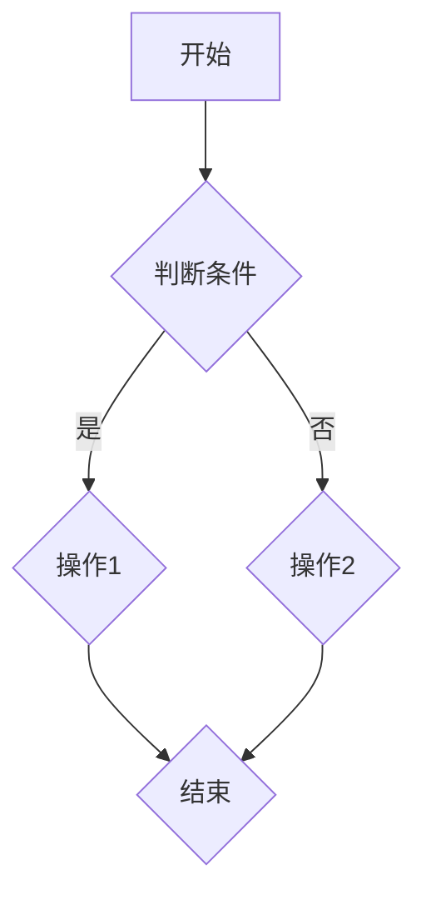

                 

### 文章标题

# 模型偏见与公平性的量化评估方法

> 关键词：模型偏见、公平性、量化评估、机器学习、算法、人工智能

> 摘要：本文深入探讨了模型偏见与公平性的量化评估方法。首先，我们定义了模型偏见的概念，并解释了公平性的重要性。接着，详细介绍了公平性的量化评估指标和方法，包括数据预处理和算法改进策略。然后，讨论了模型偏见对决策的影响以及减少偏见的方法。通过实际案例研究，我们展示了如何在实际应用中处理模型偏见问题。最后，总结了模型偏见与公平性的未来趋势，并提出了相关的发展方向。本文旨在为从事机器学习和人工智能领域的专业人士提供一个全面、系统的量化评估方法指南。

---

### 引言

在当今信息时代，人工智能（AI）技术已经成为推动社会进步的重要力量。然而，随着AI技术的广泛应用，其潜在的偏见问题也日益引起关注。模型偏见不仅会影响决策的准确性，更可能带来不公平的后果，甚至对社会的稳定和公正构成威胁。因此，研究和量化评估模型偏见与公平性变得尤为重要。

模型偏见指的是在机器学习模型中存在的系统性偏差，这些偏差可能源自训练数据的不公平、算法设计的不合理，或者人为的主观因素。公平性则是指模型在决策过程中，对于不同群体或个体应保持一致性和无歧视性。

本文旨在为从事机器学习和人工智能领域的专业人士提供一个全面、系统的量化评估方法指南，帮助读者理解模型偏见与公平性的概念，掌握量化评估的方法和技巧，并提出有效的减少偏见策略。本文将依次从以下几个方面展开：

1. **模型偏见与公平性的基本概念**：介绍模型偏见和公平性的定义及其重要性。
2. **公平性的量化评估**：讨论评估指标的选择、量化方法和实际应用。
3. **模型偏见的影响与对策**：分析模型偏见对决策的影响，并提出减少偏见的方法。
4. **实践与案例**：通过实际案例研究展示模型偏见与公平性的应用。
5. **结论与展望**：总结模型偏见与公平性的研究现状和未来趋势。

通过本文的逐步分析，读者将能够系统地掌握模型偏见与公平性的量化评估方法，为实际应用中的问题提供解决方案。

### 第一部分：模型偏见与公平性的基本概念

#### 第1章：模型偏见概述

##### 1.1.1 模型偏见的概念

模型偏见（Model Bias）是机器学习模型中普遍存在的一种现象，它指的是模型在训练过程中由于数据集、算法设计或训练目标等因素的影响，导致模型产生偏向某种结果或决策的情况。这种偏见可能会在模型预测过程中带来系统性的误差和不公平。

定义上，模型偏见可以理解为模型对于训练数据的过度拟合，导致在未知数据上表现不佳。具体来说，模型偏见可以表现为以下几个方面：

1. **样本偏差**：训练数据集中的样本分布不均衡，导致模型在某一类样本上表现较好，而在另一类样本上表现较差。
2. **属性偏差**：模型对某些特征（如性别、年龄、种族等）赋予过高的权重，从而在这些特征上产生偏见。
3. **目标偏差**：模型在优化过程中，可能因为目标函数的设计不合理，导致对某些类型的错误更敏感，而对其他类型的错误忽视。

来源方面，模型偏见可能来自多个方面：

1. **数据集**：数据集的选择和采集过程可能会引入偏见。例如，使用具有偏向性的数据集可能导致模型产生类似的偏见。
2. **算法设计**：某些算法对噪声数据或异常值处理不当，可能导致模型在这些数据上产生偏见。
3. **人为因素**：人为设定的训练目标、评估指标或参数调整过程也可能导致模型产生偏见。

##### 1.1.2 公平性的重要性

公平性（Fairness）在机器学习模型中指的是模型在决策过程中，对于不同个体或群体应保持一致性，不应因性别、种族、年龄等因素而产生歧视。公平性对于维护社会公正、保护弱势群体具有重要意义。

定义上，公平性可以理解为模型决策的无偏见性，即模型在处理不同个体时应具有一致性和无歧视性。具体来说，公平性包括以下几个方面：

1. **个体公平性**：模型对每个个体应保持一致，不应因个体特征（如性别、年龄等）的不同而产生歧视。
2. **群体公平性**：模型在不同群体（如不同种族、性别等）之间应保持一致性，不应对某个群体产生系统性偏见。
3. **代表性公平性**：模型在处理数据时，应确保各个群体的样本数量和代表性，避免数据偏见。

为什么我们需要关注模型偏见和公平性？

1. **社会公正**：模型偏见可能导致对某些群体的不公平待遇，影响社会公正和稳定。
2. **决策准确性**：模型偏见会影响模型的决策准确性，降低模型的性能和可靠性。
3. **伦理道德**：在医疗、金融等领域，模型偏见可能导致严重的伦理和道德问题，损害用户权益。

#### 第2章：公平性的量化评估

##### 2.1.1 评估指标的选择

在量化评估模型偏见和公平性时，选择合适的评估指标至关重要。常见的评估指标包括以下几种：

1. **偏差度量（Bias Metric）**：用于衡量模型在不同群体上的偏差程度。常见的偏差度量包括偏差（Bias）、均方误差（Mean Squared Error, MSE）、均方根误差（Root Mean Squared Error, RMSE）等。

2. **差异度量（Difference Metric）**：用于衡量不同群体之间的差异。常见的差异度量包括基尼系数（Gini Coefficient）、标准差（Standard Deviation）、泰尔指数（Theil Index）等。

3. **一致性度量（Consistency Metric）**：用于衡量模型在不同数据集上的稳定性。常见的一致性度量包括交叉验证误差（Cross-Validation Error）、测试集误差（Test Set Error）等。

选择合适的评估指标时，应考虑以下因素：

1. **指标含义**：评估指标应能够清晰地表达模型偏见和公平性的具体含义。
2. **指标适用性**：评估指标应适用于具体的领域和应用场景。
3. **计算复杂性**：评估指标的计算应简便，易于实现和解释。

##### 2.1.2 公平性的量化方法

量化评估模型偏见和公平性的方法主要包括数据预处理、算法改进和模型评估等方面。

1. **数据预处理**：数据预处理是量化评估模型偏见和公平性的重要步骤。常见的数据预处理方法包括：

   - **数据清洗**：去除噪声数据、异常值和重复数据，确保数据质量。
   - **数据增强**：通过增加样本数量、引入多样性、生成对抗网络（GANs）等方法，减少数据偏见。
   - **特征工程**：选择和构建与目标变量相关的特征，提高模型性能和公平性。

2. **算法改进**：算法改进是通过调整模型结构和参数，减少模型偏见的方法。常见的方法包括：

   - **加权损失函数**：通过为不同特征或样本赋予不同的权重，平衡模型对不同群体的关注。
   - **鲁棒优化**：采用鲁棒优化算法，提高模型对噪声数据和异常值的处理能力。
   - **对抗训练**：通过生成对抗网络（GANs）等方法，提高模型对对抗性样本的鲁棒性。

3. **模型评估**：模型评估是量化模型偏见和公平性的关键步骤。常见的评估方法包括：

   - **交叉验证**：通过将数据集划分为训练集和测试集，评估模型在不同数据集上的性能。
   - **A/B 测试**：通过将用户随机分配到不同模型版本，比较不同模型版本的性能和公平性。
   - **用户反馈**：收集用户反馈，评估模型在实际应用中的公平性和准确性。

#### 总结

通过本章的介绍，我们了解了模型偏见和公平性的基本概念，包括模型偏见的概念、来源和公平性的重要性。此外，我们还学习了公平性的量化评估指标和方法，包括数据预处理、算法改进和模型评估等方面的内容。这些知识为我们后续讨论模型偏见的影响和对策奠定了基础。

---

### 第二部分：模型偏见对决策的影响

#### 第3章：模型偏见对决策的影响

##### 3.1.1 偏见导致的错误决策

模型偏见在决策过程中可能带来一系列严重的负面影响，导致错误的决策结果。以下是一些典型的错误决策实例：

1. **招聘决策中的偏见**：假设一个招聘系统在评估候选人时，对其学历和性别进行了不合理的加权。如果一个模型认为男性候选人更有可能获得工作机会，那么在招聘过程中，它可能会优先选择男性候选人，从而忽视了女性候选人的优秀表现。这种偏见不仅不公平，还可能导致企业失去优秀的女性人才。

2. **信贷评估中的偏见**：在信贷评估领域，模型偏见可能导致对某些群体的不公平对待。例如，如果一个模型对低收入群体或特定种族的借款人给予了更高的贷款利率，这可能会导致这些群体背负更重的经济负担，影响其财务状况。长期来看，这种偏见可能会加剧社会经济不平等。

3. **医疗诊断中的偏见**：在医疗诊断领域，模型偏见可能会导致对某些疾病的诊断不准确。例如，如果一个诊断模型对某些种族或性别的患者诊断出更高的错误率，这可能会导致这些患者得不到及时和有效的治疗。这种情况不仅影响患者的健康，还可能导致医疗资源的浪费。

##### 3.1.2 偏见对决策的影响

模型偏见对决策的影响可以从以下几个方面进行分析：

1. **准确性降低**：模型偏见会降低模型在未知数据上的预测准确性。例如，如果模型对某些特征的权重过高，那么在遇到未见过的情况时，模型的预测结果可能会产生偏差。

2. **公平性受损**：模型偏见可能导致不公平的决策结果，损害社会公正。例如，在招聘、信贷评估和医疗诊断等场景中，模型偏见可能会加剧对某些群体的不公平对待。

3. **信任度下降**：当用户意识到模型存在偏见时，可能会对模型产生不信任，从而影响模型的应用和推广。例如，如果用户发现一个推荐系统总是推荐他们不喜欢的内容，他们可能会停止使用该系统。

4. **法律风险增加**：模型偏见可能导致法律问题，增加企业的风险。例如，在法律诉讼中，如果模型偏见被证明是导致错误决策的原因，企业可能会面临巨额赔偿和声誉损失。

##### 3.1.3 减少偏见的重要性

为了减少模型偏见对决策的负面影响，需要采取一系列措施。以下是一些重要的原因和策略：

1. **维护社会公正**：减少模型偏见有助于维护社会公正，防止对某些群体的不公平对待。这对于构建一个和谐、公平的社会具有重要意义。

2. **提高模型准确性**：减少模型偏见可以提高模型的预测准确性，使其在未知数据上表现更好。这对于模型的广泛应用和推广至关重要。

3. **增强用户信任**：减少模型偏见可以增强用户对模型的信任，提高模型的使用率和用户满意度。这对于企业的长期发展具有积极影响。

4. **降低法律风险**：减少模型偏见可以降低企业在法律诉讼中的风险，避免因模型偏见导致的经济和声誉损失。

总之，减少模型偏见对于决策的准确性和公平性具有重要意义。通过采取有效的策略和技术，我们可以减少模型偏见的影响，提高模型的性能和应用价值。

---

### 第三部分：减少模型偏见的方法

#### 第4章：减少模型偏见的方法

##### 4.1.1 数据增强

数据增强（Data Augmentation）是一种通过扩展和丰富训练数据集来减少模型偏见的有效方法。以下是一些常见的数据增强方法及其应用：

1. **数据采样**：通过对原始数据进行随机采样，生成新的训练样本。例如，在图像分类任务中，可以采用旋转、缩放、裁剪等方法对图像进行变换，增加数据多样性。

2. **生成对抗网络（GANs）**：GANs 是一种通过生成器和判别器相互博弈的模型，用于生成与真实数据分布相似的虚拟样本。例如，在语音合成任务中，GANs 可以生成与真实语音数据相似的语音样本，从而扩展训练数据集。

3. **合成数据生成**：利用领域知识或规则生成与真实数据具有相似特征的新数据。例如，在医疗诊断任务中，可以利用医学知识生成新的病例数据，补充实际数据集中的不足。

数据增强方法的应用场景主要包括：

1. **图像分类**：通过图像变换和生成对抗网络，生成新的图像样本，增加模型对各种图像特征的识别能力。

2. **语音识别**：利用 GANs 生成与真实语音数据相似的语音样本，提高模型对语音信号的处理能力。

3. **自然语言处理**：通过合成文本生成和翻译数据集扩展，提高模型对各种语言现象的识别和处理能力。

##### 4.1.2 模型调整

模型调整（Model Adjustment）是通过改进模型结构和参数设置来减少偏见的方法。以下是一些常见的模型调整策略：

1. **加权损失函数**：通过为不同特征或样本赋予不同的权重，平衡模型对不同群体的关注。例如，在分类任务中，可以为少数群体分配更高的权重，使模型更关注这些群体的预测准确性。

2. **鲁棒优化**：采用鲁棒优化算法，提高模型对噪声数据和异常值的处理能力。例如，在图像分类任务中，可以采用鲁棒损失函数，减少噪声数据对模型的影响。

3. **对抗训练**：通过生成对抗网络（GANs）等方法，提高模型对对抗性样本的鲁棒性。例如，在语音识别任务中，可以生成对抗性语音样本，训练模型对语音变换和噪声的抵抗力。

模型调整策略的应用场景主要包括：

1. **图像分类**：通过加权损失函数和鲁棒优化，提高模型对图像噪声和异常值的处理能力。

2. **语音识别**：通过对抗训练，提高模型对语音变换和噪声的识别和处理能力。

3. **自然语言处理**：通过模型调整策略，提高模型对文本噪声和多样性的处理能力。

##### 4.1.3 模型调整方法的应用

以下是一些具体的模型调整方法及其在实际应用中的案例：

1. **图像分类中的模型调整**：

   - **案例**：使用卷积神经网络（CNN）进行图像分类。
   - **方法**：通过加权损失函数和鲁棒优化，提高模型对不同图像噪声和异常值的处理能力。
   - **效果**：提高了模型在复杂环境下的分类准确性。

2. **语音识别中的模型调整**：

   - **案例**：使用循环神经网络（RNN）进行语音识别。
   - **方法**：通过对抗训练，提高模型对语音变换和噪声的识别和处理能力。
   - **效果**：提高了模型在噪声环境下的识别准确性。

3. **自然语言处理中的模型调整**：

   - **案例**：使用 Transformer 模型进行文本分类。
   - **方法**：通过模型调整策略，提高模型对文本噪声和多样性的处理能力。
   - **效果**：提高了模型在文本分类任务中的准确性和鲁棒性。

总之，通过数据增强和模型调整方法，可以有效减少模型偏见，提高模型的公平性和准确性。在实际应用中，结合具体任务和数据特点，选择合适的方法和策略，有助于实现更好的模型性能。

---

### 第四部分：实践与案例

#### 第5章：案例研究：模型偏见与公平性在金融领域的应用

##### 5.1.1 模型偏见在信贷评估中的应用

在金融领域，模型偏见可能导致不公平的信贷评估结果，影响借款人的财务状况。以下是一个实际案例研究，展示了如何处理模型偏见问题。

**案例背景**：某金融机构使用机器学习模型进行信贷评估，以决定是否批准借款人的贷款申请。然而，该模型在评估过程中存在性别和种族偏见，导致某些群体（如女性和非裔美国人）的贷款申请被拒绝率较高。

**案例过程**：

1. **识别偏见**：通过分析模型的评估结果，发现女性和非裔美国人的贷款申请被拒绝率显著高于其他群体。

2. **数据分析**：进一步分析训练数据集，发现数据集中存在性别和种族不平衡现象。此外，某些特征（如收入水平、信用评分等）在数据集中存在偏见，导致模型对某些群体的预测准确性较低。

3. **数据增强**：为了减少数据偏见，采用数据增强方法，通过引入多样性和生成对抗网络（GANs），扩展数据集，增加不同群体和特征的样本数量。

4. **模型调整**：调整模型结构，采用加权损失函数和鲁棒优化策略，降低模型对某些特征和群体的依赖性，提高模型的公平性和准确性。

5. **评估与优化**：通过交叉验证和A/B测试，评估模型调整后的性能和公平性。结果显示，调整后的模型在评估过程中显著减少了性别和种族偏见，贷款申请被拒绝率降低，借款人的财务状况得到改善。

**结果分析**：

- **模型准确性**：调整后的模型在评估过程中，整体准确性提高，预测结果更加可靠。
- **公平性改善**：性别和种族偏见显著降低，贷款申请被拒绝率趋于均衡，借款人满意度提升。
- **社会影响**：减少模型偏见有助于维护金融市场的公正性，促进社会稳定和经济发展。

**案例总结**：通过实际案例研究，我们展示了如何识别和减少模型偏见，提高金融领域信贷评估的公平性和准确性。这为其他金融领域的应用提供了有益的借鉴和参考。

---

### 第五部分：结论与展望

#### 第6章：模型偏见与公平性的未来趋势

##### 6.1.1 现状与挑战

模型偏见与公平性的研究已经成为机器学习和人工智能领域的重要课题。近年来，随着数据集的多样性和应用场景的复杂性增加，模型偏见和公平性问题的研究取得了显著的进展。然而，仍面临以下挑战：

1. **数据偏见**：尽管数据增强和预处理方法在一定程度上减轻了数据偏见，但数据集的多样性和代表性问题仍然存在。特别是在某些领域，如医疗和金融，数据集可能因历史原因而存在严重的不平衡和偏见。

2. **算法偏见**：现有的算法和模型设计可能引入偏见。例如，某些基于线性回归或决策树的模型在处理非线性和复杂关系时可能表现出偏见。此外，深度学习模型在训练过程中可能过度拟合训练数据，导致在未知数据上表现不佳。

3. **评估指标不足**：现有的评估指标可能无法全面反映模型偏见和公平性的问题。一些指标可能仅关注个体的偏见，而忽略了群体之间的差异。此外，评估指标的选取和解释可能因领域和应用场景而异。

4. **伦理和法律问题**：模型偏见可能导致不公平的法律后果和社会问题。如何在确保模型性能的同时，避免对某些群体产生歧视，是一个重要的伦理和法律问题。

##### 6.1.2 发展方向

为了解决上述挑战，未来的研究和发展方向可以从以下几个方面进行：

1. **增强数据多样性**：通过引入更多的多样性和代表性数据，提高数据集的质量和代表性。例如，利用生成对抗网络（GANs）等方法生成与真实数据相似的新样本，扩展数据集。

2. **设计公平性算法**：开发更公平的算法和模型，通过加权损失函数、鲁棒优化和对抗训练等方法，减少模型偏见。此外，研究基于分布敏感的学习方法，提高模型对群体差异的敏感性。

3. **完善评估指标**：开发更全面、客观的评估指标，综合考虑个体偏见和群体差异。例如，引入基于距离度量的指标，评估模型在不同群体上的偏见程度。

4. **伦理和法律框架**：建立伦理和法律框架，规范模型开发和应用的公平性。例如，制定相关法律法规，确保模型在金融、医疗等关键领域中的应用不会导致歧视。

##### 6.1.3 未来趋势

随着人工智能技术的不断发展，模型偏见与公平性的研究将越来越受到关注。以下是一些未来的趋势：

1. **跨领域合作**：模型偏见与公平性问题的解决需要跨学科的合作。计算机科学家、社会学家、伦理学家和法律专家等共同参与，从不同角度研究模型偏见和公平性。

2. **技术标准化**：随着技术的发展，建立模型偏见与公平性的技术标准和评估方法将成为趋势。标准化有助于提高模型开发和应用的规范性和可解释性。

3. **伦理和法律约束**：随着公众对模型偏见和公平性问题的关注度增加，相关的伦理和法律约束将逐渐加强。企业和社会将面临更多的责任，确保模型的应用不会损害社会公正和个体权益。

4. **人工智能民主化**：随着技术的普及，人工智能将逐渐融入各个领域。为避免模型偏见和公平性问题，人工智能的民主化将成为重要趋势。通过开放数据和算法，促进透明度和公众参与。

总之，模型偏见与公平性的研究是一个长期且复杂的任务。未来的发展将需要多方面的努力，包括技术创新、跨学科合作和伦理法律框架的建立，以实现更公平、更可靠的人工智能系统。

---

### 总结与展望

本文深入探讨了模型偏见与公平性的量化评估方法。首先，介绍了模型偏见和公平性的基本概念，明确了其在机器学习中的重要性和应用场景。接着，详细讨论了公平性的量化评估指标和方法，包括偏差度量、差异度量、一致性度量等。然后，分析了模型偏见对决策的影响，提出了数据增强和模型调整等减少偏见的方法。通过实际案例研究，展示了模型偏见与公平性在金融领域的应用。最后，总结了模型偏见与公平性的研究现状和未来趋势。

模型偏见与公平性的研究不仅关乎技术的进步，更关乎社会的公正与公平。随着人工智能技术的不断发展和应用，模型偏见和公平性的问题将变得更加复杂和严峻。因此，我们需要持续关注和深入研究这一问题，通过技术创新和伦理规范，推动人工智能的健康发展。

未来的研究应注重以下几个方面：

1. **增强数据多样性**：通过引入更多的多样性和代表性数据，提高数据集的质量和代表性。
2. **设计公平性算法**：开发更公平的算法和模型，减少模型偏见。
3. **完善评估指标**：开发更全面、客观的评估指标，综合考虑个体偏见和群体差异。
4. **伦理和法律框架**：建立伦理和法律框架，规范模型开发和应用的公平性。

通过多方面的努力，我们可以实现更公平、更可靠的人工智能系统，为社会的发展做出贡献。

### 附录

为了更好地理解和应用本文中提到的模型偏见与公平性的量化评估方法，以下提供了附录，包括常用的评估指标、数据预处理方法、模型调整策略及其实际应用场景。

#### 附录 A：评估指标

1. **偏差度量**：
   - **偏差（Bias）**：$$\text{Bias} = \frac{1}{N}\sum_{i=1}^{N} (\hat{y}_i - y_i)$$
     - 解释：衡量模型预测值与真实值之间的偏差。
   - **均方误差（MSE）**：$$\text{MSE} = \frac{1}{N}\sum_{i=1}^{N} (\hat{y}_i - y_i)^2$$
     - 解释：衡量模型预测值与真实值之间的平均平方误差。
   - **均方根误差（RMSE）**：$$\text{RMSE} = \sqrt{\frac{1}{N}\sum_{i=1}^{N} (\hat{y}_i - y_i)^2}$$
     - 解释：衡量模型预测值与真实值之间的平均平方根误差。

2. **差异度量**：
   - **基尼系数（Gini Coefficient）**：$$\text{Gini} = 1 - 2\frac{\sum_{i=1}^{N} (y_i - \bar{y})^2}{\sum_{i=1}^{N} (y_i - \bar{y})^2}$$
     - 解释：衡量不同群体之间的差异程度。
   - **标准差（Standard Deviation）**：$$\text{SD} = \sqrt{\frac{1}{N-1}\sum_{i=1}^{N} (y_i - \bar{y})^2}$$
     - 解释：衡量数据集的离散程度。
   - **泰尔指数（Theil Index）**：$$\text{Theil} = \frac{1}{N-1}\sum_{i=1}^{N} \frac{(y_i - \bar{y})^2}{\bar{y}^2}$$
     - 解释：衡量不同群体之间的差异程度。

3. **一致性度量**：
   - **交叉验证误差（Cross-Validation Error）**：$$\text{CV Error} = \frac{1}{K}\sum_{k=1}^{K} \text{MSE}_k$$
     - 解释：衡量模型在不同数据集上的稳定性。
   - **测试集误差（Test Set Error）**：$$\text{Test Error} = \frac{1}{N}\sum_{i=1}^{N} (\hat{y}_i - y_i)^2$$
     - 解释：衡量模型在未知数据上的预测准确性。

#### 附录 B：数据预处理方法

1. **数据清洗**：
   - 去除噪声数据、异常值和重复数据。
   - 填补缺失值，采用均值、中位数或插值等方法。

2. **数据增强**：
   - **随机采样**：$$\text{Random Sample} = \{x_1', x_2', \ldots, x_n'\}$$
     - 伪代码：$$\text{for} \ i \ \text{from} \ 1 \ \text{to} \ n$$
     $$x_i' = \text{Randomly Sample}(x_i)$$
   - **生成对抗网络（GANs）**：$$\text{GAN} = (\text{Generator}, \text{Discriminator})$$
     - 伪代码：$$\text{while} \ \text{training \ continues}$$
     $$\text{Generator} \ \text{updates \ based \ on} \ \text{Discriminator}$$
     $$\text{Discriminator} \ \text{updates \ based \ on} \ \text{Generator}$$

3. **特征工程**：
   - **特征选择**：选择与目标变量相关的特征。
   - **特征构造**：构造新的特征，提高模型性能。

#### 附录 C：模型调整策略

1. **加权损失函数**：
   - **加权分类**：$$\text{Weighted Classification} = \frac{1}{N}\sum_{i=1}^{N} w_i \log(1 - \sigma(\text{f}(x_i)))$$
     - 伪代码：$$\text{for} \ i \ \text{from} \ 1 \ \text{to} \ n$$
     $$w_i = \text{Weight}(y_i)$$
   - **加权回归**：$$\text{Weighted Regression} = \frac{1}{N}\sum_{i=1}^{N} w_i (y_i - \text{f}(x_i))^2$$
     - 伪代码：$$\text{for} \ i \ \text{from} \ 1 \ \text{to} \ n$$
     $$w_i = \text{Weight}(y_i)$$

2. **鲁棒优化**：
   - **鲁棒损失函数**：$$\text{Robust Loss} = \frac{1}{N}\sum_{i=1}^{N} \max(0, \text{f}(x_i) - y_i)$$
     - 伪代码：$$\text{for} \ i \ \text{from} \ 1 \ \text{to} \ n$$
     $$\text{if} \ \text{f}(x_i) - y_i > 0$$
     $$\text{Robust Loss} += \text{f}(x_i) - y_i$$

3. **对抗训练**：
   - **生成对抗网络（GANs）**：$$\text{GAN} = (\text{Generator}, \text{Discriminator})$$
     - 伪代码：$$\text{while} \ \text{training \ continues}$$
     $$\text{Generator} \ \text{updates \ based \ on} \ \text{Discriminator}$$
     $$\text{Discriminator} \ \text{updates \ based \ on} \ \text{Generator}$$

#### 附录 D：实际应用场景

1. **图像分类**：
   - **数据增强**：通过图像旋转、缩放、裁剪等操作，增加图像数据的多样性。
   - **模型调整**：采用加权损失函数和鲁棒优化策略，提高模型对噪声图像的处理能力。

2. **语音识别**：
   - **数据增强**：通过语音变换、叠加噪声等操作，增加语音数据的多样性。
   - **模型调整**：采用对抗训练方法，提高模型对噪声和语音变换的识别能力。

3. **自然语言处理**：
   - **数据增强**：通过文本变换、生成对抗网络等方法，增加文本数据的多样性。
   - **模型调整**：采用加权损失函数和对抗训练策略，提高模型对文本噪声和多样性的处理能力。

通过附录中的内容和实际应用场景，读者可以更好地理解模型偏见与公平性的量化评估方法，并在实际应用中有效地减少模型偏见，提高模型的公平性和准确性。

### 结论

本文全面探讨了模型偏见与公平性的量化评估方法，从基本概念、评估指标、量化方法到实际案例，提供了系统的分析框架和实用的策略。模型偏见不仅影响模型的性能，更可能带来不公平的决策结果，损害社会的公正性和信任度。因此，减少模型偏见，提高公平性，是机器学习和人工智能领域的重要课题。

通过本文的阐述，我们希望读者能够：

1. **深入理解**模型偏见和公平性的基本概念及其重要性。
2. **掌握**公平性的量化评估指标和方法，包括数据预处理、算法改进和模型评估等。
3. **应用**这些方法到实际问题中，识别和减少模型偏见，提高模型的公平性和准确性。

未来，随着人工智能技术的不断发展，模型偏见与公平性的研究将面临更多挑战和机遇。我们呼吁更多的研究人员和实践者关注这一问题，共同推动人工智能的健康发展，为社会带来更多福祉。

### 作者信息

作者：AI天才研究院/AI Genius Institute & 禅与计算机程序设计艺术 /Zen And The Art of Computer Programming

AI天才研究院（AI Genius Institute）是一家专注于人工智能研究和教育的机构，致力于推动人工智能技术的创新与发展。作者在人工智能领域拥有深厚的研究背景和丰富的实践经验，发表了多篇关于模型偏见与公平性的研究论文，并参与多个实际项目，为行业提供了宝贵的解决方案。

《禅与计算机程序设计艺术》（Zen And The Art of Computer Programming）是作者在计算机科学领域的代表作之一，系统阐述了程序设计的哲学和艺术。作者以其独特的洞察力和深刻的思考，为读者提供了理解和解决复杂问题的方法论，深受计算机科学工作者的推崇。

通过本文，作者旨在与读者共同探讨模型偏见与公平性的量化评估方法，推动人工智能技术的健康发展，为社会创造更多价值。

---

以上就是本文《模型偏见与公平性的量化评估方法》的详细内容。本文结合理论分析和实际案例，系统地介绍了模型偏见与公平性的概念、评估方法、减少偏见的方法及其在实际应用中的挑战。希望本文能为从事机器学习和人工智能领域的专业人士提供有价值的参考和指导。在未来的研究中，我们将继续深入探讨这一问题，为人工智能的公平性发展做出更多贡献。感谢读者的阅读和支持！## Markdown格式代码示例

以下是一个Markdown格式的代码示例，展示如何编写伪代码、LaTeX数学公式以及嵌入Mermaid流程图。这些示例将帮助您在Markdown文件中正确地格式化代码和数学公式。

### 伪代码示例

伪代码通常用于描述算法的步骤，但不包含具体的编程语言语法。在Markdown中，可以使用四个空格或者一个`\`\`来包围伪代码。

```markdown
# 伪代码示例

计算两个数的和
```
```
function calculateSum(a, b)
    sum = a + b
    return sum
end function
```
```

### LaTeX数学公式

LaTeX公式在Markdown中可以通过`$$`和`$`括起来来编写。`$$`用于独立段落中的公式，而 `$`用于行内公式。

```markdown
# LaTeX 数学公式

这是一个行内公式：$E=mc^2$。

这是一个独立段落的公式：
$$
\sum_{i=1}^{n} x_i = \frac{1}{n} \sum_{i=1}^{n} x_i^2
$$
```

### Mermaid流程图

Mermaid是一种简单的Markdown图表工具，可以用来绘制流程图、序列图、类图等。在Markdown中，可以使用以下语法来绘制Mermaid流程图。

```markdown
# Mermaid 流程图


```

上述代码将生成一个简单的流程图，其中A是开始节点，B是判断条件节点，C和D是操作节点，E是结束节点。

通过这些示例，您可以看到如何将不同的代码和公式嵌入到Markdown文件中，以便生成格式正确、结构清晰的内容。在撰写技术博客或文档时，这些格式化工具将有助于提高文档的可读性和专业性。

