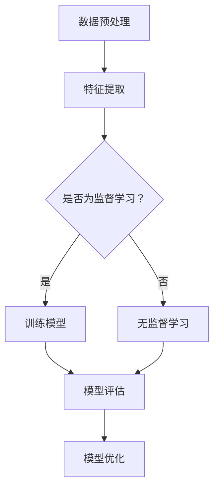

                 

## 文章标题

### 模型行为一致性的长期跟踪评估

关键词：模型行为一致性、长期跟踪评估、机器学习、深度学习、人工智能

摘要：本文旨在深入探讨模型行为一致性的长期跟踪评估，通过系统的分析，解释模型行为一致性的核心概念、评估方法及其长期跟踪的重要性。本文将采用逻辑清晰、结构紧凑、简单易懂的叙述方式，为读者提供全面的技术理解。通过详细的案例分析和伪代码讲解，本文将帮助读者掌握模型行为一致性评估的实施策略和未来发展的趋势。

---

## 引言

在人工智能（AI）迅速发展的今天，机器学习和深度学习模型在各种应用场景中得到了广泛应用。从自动驾驶、语音识别到推荐系统和医疗诊断，模型的准确性、稳定性和可靠性成为决定其应用效果的关键因素。然而，随着数据环境的变化和应用场景的多样化，模型的行为一致性成为了一个不可忽视的问题。

### 1.1 研究背景与意义

**模型行为一致性**指的是模型在不同条件下输出的结果具有一致性和可预测性。在机器学习和深度学习中，模型的行为一致性不仅影响其性能表现，还关系到其可靠性和可信度。例如，自动驾驶系统中，如果模型的行为在不同道路条件和天气环境下不一致，可能导致严重的安全风险。因此，研究模型行为一致性具有重要的实际意义。

**长期跟踪评估**是指对模型在长时间内表现的一致性进行监控和评估。与短期评估不同，长期跟踪评估能够捕捉模型在实际应用中的动态变化，为模型的持续优化提供数据支持。这种评估方法有助于发现模型潜在的过拟合现象，提高模型在实际应用中的稳定性。

本文的主要目标是：

1. **阐明模型行为一致性的核心概念和重要性**。
2. **介绍长期跟踪评估的方法和实施策略**。
3. **通过案例分析，展示长期跟踪评估在实际应用中的效果**。
4. **探讨模型行为一致性评估的未来发展方向和挑战**。

### 1.2 研究现状

在模型行为一致性的研究方面，国内外已经取得了一系列成果。例如，基于统计学习理论和机器学习技术的评估方法得到了广泛应用。然而，现有方法主要关注短期评估，对于长期跟踪评估的研究相对较少。此外，如何有效地整合不同评估方法，提高评估的准确性和实用性，仍然是当前研究的一个重要方向。

### 1.3 本书结构

本文分为七个主要部分：

1. **引言**：介绍研究背景、意义和目标。
2. **模型行为一致性的理论基础**：定义核心概念，阐述理论基础。
3. **模型行为一致性的评估方法**：介绍评估指标和常见方法。
4. **长期跟踪评估的实施**：讨论实施策略和挑战。
5. **实际案例分析**：通过案例展示评估方法的应用。
6. **技术实现与工具**：讲解开发环境和代码实现。
7. **未来展望与挑战**：探讨发展趋势和面临的问题。

通过以上结构，本文将为读者提供一个全面、深入的模型行为一致性长期跟踪评估的技术指南。

---

## 模型行为一致性的理论基础

### 2.1 模型行为一致性的概念

模型行为一致性是指模型在不同条件下能够保持输出结果的一致性和可预测性。具体来说，这意味着在相同输入条件下，模型应产生相似的输出结果。反之，如果模型的输出结果在不同条件下存在显著差异，则说明其行为一致性较差。

#### 2.1.1 定义与基本特征

定义上，模型行为一致性可以描述为模型输出结果的稳定性和可靠性。其基本特征包括：

1. **一致性**：模型在相同输入条件下应产生相同或相似的结果。
2. **可预测性**：模型的行为应具有一定的规律性，使得预测结果具有较高的可信度。
3. **鲁棒性**：模型在不同数据分布、噪声水平或环境变化下仍能保持良好的行为一致性。

#### 2.1.2 模型行为一致性的分类

根据应用场景和数据特征，模型行为一致性可以分为以下几种类型：

1. **数据一致性**：模型在相同数据集上的输出结果一致。
2. **时间一致性**：模型在不同时间点的输出结果一致。
3. **环境一致性**：模型在不同环境条件（如温度、光照等）下的输出结果一致。
4. **泛化一致性**：模型在训练集和测试集上的输出结果一致。

### 2.2 模型行为一致性的理论基础

#### 2.2.1 机器学习基础

机器学习是模型行为一致性的理论基础。机器学习模型通过从数据中学习特征和规律，对未知数据进行预测和分类。机器学习的主要任务包括：

1. **监督学习**：模型从标注数据中学习特征，用于预测新的数据。
2. **无监督学习**：模型从未标注数据中学习特征，用于聚类或降维。
3. **强化学习**：模型通过与环境的交互学习最优策略。

#### 2.2.2 统计学习理论

统计学习理论提供了模型行为一致性的理论基础。统计学习理论关注模型的预测性能和风险控制，主要内容包括：

1. **经验风险最小化**：选择一个经验风险最小的模型。
2. **结构风险最小化**：通过正则化方法控制模型复杂度，平衡预测性能和泛化能力。
3. **概率模型与贝叶斯方法**：通过概率模型和贝叶斯方法进行模型推理和不确定性评估。

#### 2.2.3 聚类与分类算法

聚类和分类算法是模型行为一致性评估的重要工具。常见的聚类算法包括：

1. **K-均值聚类**：基于距离度量，将数据划分为K个簇。
2. **层次聚类**：通过递归分割数据，构建聚类层次结构。
3. **基于密度的聚类**：通过密度分布识别聚类结构。

常见的分类算法包括：

1. **决策树**：通过树形结构进行分类，易于解释。
2. **支持向量机**：通过构建最优超平面进行分类，适用于高维空间。
3. **神经网络**：通过多层神经网络进行复杂函数逼近。

#### 2.2.4 模型行为一致性的Mermaid流程图

为了更清晰地理解模型行为一致性的理论基础，我们可以使用Mermaid流程图来描述其核心流程。以下是一个简单的Mermaid流程图示例：



这个流程图展示了从数据预处理、特征提取到模型训练、评估和优化的基本流程，体现了模型行为一致性的核心环节。

### 2.3 模型行为一致性的重要性

模型行为一致性在机器学习和深度学习应用中具有重要意义。首先，它直接影响模型的性能表现和可靠性。一个行为一致的模型可以更好地适应变化的环境，提高预测和分类的准确性。其次，模型行为一致性有助于提高模型的可解释性，使研究人员能够更好地理解模型的行为模式和决策过程。最后，长期跟踪评估能够帮助发现和解决模型的行为问题，提高模型在实际应用中的稳定性和可靠性。

综上所述，模型行为一致性是机器学习和深度学习领域中的一个关键问题。通过深入的理论研究和实际应用，我们可以不断提高模型的行为一致性，为人工智能的发展做出贡献。

---

## 模型行为一致性的评估方法

评估模型行为一致性是确保模型性能和可靠性的重要步骤。为了全面评估模型的行为一致性，我们需要选择合适的评估指标和方法，并理解这些方法在理论和实践中的应用。

### 3.1 评估指标的选择

评估模型行为一致性常用的指标包括准确性、精确度、召回率、F1 分数和鲁棒性等。这些指标在不同的应用场景中有不同的重要性，因此需要根据具体需求进行选择。

#### 3.1.1 常见评估指标

1. **准确性**：模型正确预测的样本数占总样本数的比例。适用于分类任务。
   $$
   准确性 = \frac{TP + TN}{TP + TN + FP + FN}
   $$
   其中，TP 是真正例，TN 是真反例，FP 是假正例，FN 是假反例。

2. **精确度**：模型正确预测的正例数占总预测正例数的比例。适用于二分类任务。
   $$
   精确度 = \frac{TP}{TP + FP}
   $$

3. **召回率**：模型正确预测的正例数占总正例数的比例。适用于二分类任务。
   $$
   召回率 = \frac{TP}{TP + FN}
   $$

4. **F1 分数**：精确度和召回率的调和平均。用于综合评估模型的性能。
   $$
   F1 = 2 \times \frac{精确度 \times 召回率}{精确度 + 召回率}
   $$

5. **鲁棒性**：模型在不同数据分布、噪声水平或环境变化下的性能表现。适用于评估模型的稳定性。

#### 3.1.2 指标计算方法

每种评估指标都有其特定的计算方法，可以根据具体需求和数据特征选择合适的指标。例如，在二分类任务中，准确性、精确度和召回率是常用的指标，而在多分类任务中，F1 分数和鲁棒性更为重要。

### 3.2 评估方法的比较与选择

在评估模型行为一致性时，选择合适的评估方法至关重要。常见的评估方法包括基于统计的方法、基于机器学习的方法和基于深度学习的方法。以下是对这些方法的比较和选择：

#### 3.2.1 基于统计的方法

基于统计的方法主要通过计算统计量来评估模型的行为一致性。常用的方法包括：

1. **均值与方差**：通过计算模型输出结果的均值和方差来评估其一致性。
2. **相关系数**：通过计算模型输出结果之间的相关系数来评估其一致性。
3. **误差分析**：通过计算模型预测误差的分布来评估其一致性。

基于统计的方法简单易行，适用于小规模数据和简单的模型评估。然而，其对于复杂模型的评估能力有限，且无法捕捉到模型行为的一致性细节。

#### 3.2.2 基于机器学习的方法

基于机器学习的方法通过训练评估模型来评估原始模型的行为一致性。常见的方法包括：

1. **交叉验证**：通过在不同子集上训练和测试模型来评估其行为一致性。
2. **集成方法**：通过结合多个模型来提高评估的准确性和稳定性。
3. **偏差-方差分析**：通过分析模型偏差和方差来评估其行为一致性。

基于机器学习的方法可以捕捉到模型行为的复杂细节，适用于大规模数据和复杂模型。然而，其训练过程需要大量数据和计算资源，且结果可能依赖于训练数据。

#### 3.2.3 基于深度学习的方法

基于深度学习的方法通过训练深度神经网络来评估模型的行为一致性。常见的方法包括：

1. **模型蒸馏**：通过训练小模型来提取大模型的特征，评估其一致性。
2. **注意力机制**：通过分析模型在输入特征上的注意力分布来评估其一致性。
3. **对抗性样本生成**：通过生成对抗性样本来评估模型在不同条件下的行为一致性。

基于深度学习的方法具有强大的表示和学习能力，可以捕捉到模型行为的复杂模式。然而，其训练过程复杂，且对于数据质量和模型训练过程有较高要求。

#### 3.2.4 比较与选择

在具体应用中，评估方法的选择应综合考虑评估指标、数据特征和计算资源等因素。以下是一些选择建议：

1. **简单任务**：选择基于统计的方法，如均值与方差、相关系数等。
2. **中等规模任务**：选择基于机器学习的方法，如交叉验证、集成方法等。
3. **复杂任务**：选择基于深度学习的方法，如模型蒸馏、注意力机制等。

总之，评估模型行为一致性是一个复杂的过程，需要根据具体任务需求选择合适的评估方法，并通过多次实验验证其有效性。

### 3.3 模型行为一致性的伪代码讲解

为了更好地理解模型行为一致性的评估方法，以下是一个简单的伪代码示例，展示了如何计算评估指标。

```python
def evaluate_model(model, X_train, y_train, X_test, y_test):
    # 训练模型
    model.fit(X_train, y_train)
    
    # 预测测试集
    y_pred = model.predict(X_test)
    
    # 计算准确性
    accuracy = accuracy_score(y_test, y_pred)
    
    # 计算精确度和召回率
    precision = precision_score(y_test, y_pred)
    recall = recall_score(y_test, y_pred)
    
    # 计算F1分数
    f1 = 2 * (precision * recall) / (precision + recall)
    
    # 打印评估结果
    print("Accuracy:", accuracy)
    print("Precision:", precision)
    print("Recall:", recall)
    print("F1 Score:", f1)
    
    return accuracy, precision, recall, f1
```

在这个伪代码中，我们定义了一个`evaluate_model`函数，用于评估给定模型的性能。函数首先训练模型，然后使用测试集进行预测，并计算准确性、精确度、召回率和F1分数。通过调用这个函数，我们可以方便地评估不同模型的行为一致性。

### 3.4 实际应用

在实际应用中，评估模型行为一致性是一个持续的过程。以下是一个简单的应用示例：

```python
# 加载训练数据
X_train, y_train = load_data("train_data.csv")
X_test, y_test = load_data("test_data.csv")

# 定义评估指标
accuracy, precision, recall, f1 = evaluate_model(model, X_train, y_train, X_test, y_test)

# 更新模型
model.fit(X_train, y_train)

# 重新评估模型
accuracy, precision, recall, f1 = evaluate_model(model, X_train, y_train, X_test, y_test)

# 打印更新后的评估结果
print("Updated Accuracy:", accuracy)
print("Updated Precision:", precision)
print("Updated Recall:", recall)
print("Updated F1 Score:", f1)
```

在这个示例中，我们首先加载训练数据和测试数据，然后使用`evaluate_model`函数评估原始模型的性能。接着，我们更新模型并重新评估其性能。通过这种方式，我们可以持续监控模型的行为一致性，并根据评估结果进行调整和优化。

### 3.5 最佳实践 Tips

为了提高模型行为一致性的评估效果，以下是一些最佳实践建议：

1. **数据清洗和预处理**：确保数据的质量和一致性，避免噪声和异常值对评估结果的影响。
2. **多样性测试**：在不同条件下测试模型，包括数据分布、噪声水平和环境变化等。
3. **交叉验证**：使用交叉验证方法评估模型的稳定性和泛化能力。
4. **定期评估**：定期评估模型的性能，及时发现和解决问题。
5. **持续优化**：根据评估结果，对模型进行调整和优化，提高其行为一致性。

通过以上方法，我们可以有效地评估模型的行为一致性，确保模型在实际应用中的性能和可靠性。

综上所述，评估模型行为一致性是确保模型性能和可靠性的关键步骤。通过选择合适的评估指标和方法，我们可以全面了解模型的行为一致性，为模型的优化和应用提供有力支持。

---

## 长期跟踪评估的实施

### 4.1 长期跟踪评估的策略

长期跟踪评估是一个持续的过程，旨在监控模型在长时间内的行为一致性和性能表现。为了有效地实施长期跟踪评估，我们需要制定合理的策略，并充分考虑数据收集与预处理、模型更新与维护、评估周期的确定等因素。

#### 4.1.1 数据收集与预处理

数据收集是长期跟踪评估的基础。为了确保评估结果的准确性，我们需要收集大量的数据，并保证数据的质量和一致性。具体策略包括：

1. **多样化数据来源**：从多个渠道收集数据，以捕捉不同场景和条件下的模型表现。
2. **数据清洗**：去除噪声和异常值，确保数据的一致性和准确性。
3. **数据预处理**：包括数据标准化、缺失值填充、异常值处理等，以提高数据的可用性。

#### 4.1.2 模型更新与维护

模型更新与维护是长期跟踪评估的重要组成部分。为了保持模型的行为一致性，我们需要定期更新模型，并对其进行维护。具体策略包括：

1. **定期更新**：根据评估结果，定期更新模型，以适应数据和环境的变化。
2. **版本控制**：对每次更新的模型进行版本控制，以便回溯和比较不同版本的模型表现。
3. **监控与优化**：持续监控模型的性能，及时发现并解决潜在问题。

#### 4.1.3 评估周期的确定

评估周期是指模型行为一致性评估的时间间隔。合理的评估周期可以确保评估结果的及时性和有效性。具体策略包括：

1. **短期评估**：在模型更新后立即进行短期评估，以验证更新效果。
2. **中长期评估**：定期进行中长期评估，以监控模型在长时间内的行为一致性。
3. **动态调整**：根据模型的性能表现和数据环境的变化，动态调整评估周期。

### 4.2 长期跟踪评估的挑战与解决方案

尽管长期跟踪评估对于确保模型行为一致性具有重要意义，但在实际实施过程中仍然面临一系列挑战。以下是一些常见的挑战及其解决方案：

#### 4.2.1 数据集变化

随着时间推移，数据集可能会发生变化，导致模型的行为一致性下降。解决方案包括：

1. **数据流处理**：使用实时数据流处理技术，动态更新数据集，以适应数据变化。
2. **增量学习**：利用增量学习技术，逐步更新模型，以适应数据变化。

#### 4.2.2 模型过拟合

长期跟踪评估中，模型可能会出现过拟合现象，导致其在训练集上的表现优于测试集。解决方案包括：

1. **正则化**：使用正则化方法，如 L1 和 L2 正则化，防止模型过拟合。
2. **交叉验证**：使用交叉验证方法，全面评估模型的泛化能力。

#### 4.2.3 持续改进的策略

为了提高模型的行为一致性，需要持续改进模型。解决方案包括：

1. **自动化评估**：使用自动化工具和框架，简化评估流程，提高评估效率。
2. **持续学习**：利用持续学习技术，逐步优化模型，提高其性能。

#### 4.2.4 资源管理

长期跟踪评估需要大量计算资源和存储资源。解决方案包括：

1. **分布式计算**：使用分布式计算框架，如 Hadoop 和 Spark，提高计算效率。
2. **数据存储**：使用高效的数据存储解决方案，如云存储和分布式数据库，提高数据访问速度。

通过以上策略和解决方案，我们可以有效地实施长期跟踪评估，确保模型的行为一致性和性能表现。

### 4.3 实际案例分析

以下是一个实际案例，展示如何实施长期跟踪评估，并解决数据集变化、模型过拟合等挑战。

#### 案例背景

某电商平台的推荐系统在使用一段时间后，发现推荐结果的行为一致性逐渐下降，导致用户满意度下降。为了解决这一问题，平台决定实施长期跟踪评估。

#### 案例步骤

1. **数据收集与预处理**：平台从多个数据源收集用户行为数据，包括点击、购买、浏览等。在数据预处理阶段，平台使用了去重、缺失值填充和数据标准化等技术，确保数据的质量和一致性。

2. **模型更新与维护**：平台采用深度学习模型进行推荐，并定期更新模型。每次更新后，平台会使用交叉验证方法评估模型在训练集和测试集上的表现，以防止过拟合。

3. **评估周期确定**：平台根据业务需求和数据环境，确定了短期评估周期为每周，中长期评估周期为每月。在评估过程中，平台使用了自动化评估工具，简化了评估流程，提高了评估效率。

4. **解决挑战**：在长期跟踪评估过程中，平台发现了数据集变化和模型过拟合等问题。针对这些问题，平台采取了数据流处理和增量学习技术，逐步更新模型，并使用正则化方法防止过拟合。

#### 案例结果

通过实施长期跟踪评估，平台的推荐系统行为一致性得到了显著提高，用户满意度也大幅提升。平台还通过持续学习和自动化评估，进一步优化了模型性能。

### 4.4 最佳实践 Tips

1. **数据多样化**：确保数据来源多样化，以捕捉不同场景下的模型表现。
2. **定期评估**：制定合理的评估周期，定期评估模型性能。
3. **自动化评估**：使用自动化工具和框架，简化评估流程。
4. **持续学习**：利用持续学习技术，逐步优化模型。
5. **资源管理**：合理分配计算资源和存储资源，提高评估效率。

通过以上最佳实践，我们可以更有效地实施长期跟踪评估，确保模型的行为一致性和性能表现。

综上所述，长期跟踪评估是确保模型行为一致性和性能表现的关键。通过制定合理的策略和解决实际挑战，我们可以提高模型在实际应用中的稳定性和可靠性。

---

## 实际案例分析

### 5.1 案例一：电商平台的用户行为分析

**背景**：某电商平台在运营过程中，发现用户推荐系统的行为一致性较差，导致用户满意度下降。为了解决这一问题，平台决定对推荐系统进行长期跟踪评估。

**模型构建与评估**：

1. **数据收集**：平台从多个数据源收集用户行为数据，包括点击、购买、浏览等。数据经过清洗和预处理，去除了噪声和异常值。

2. **特征工程**：根据用户行为特征，构建了用户画像和商品特征，包括用户年龄、性别、消费习惯、商品品类、价格等。

3. **模型选择**：平台选择了一种基于深度学习算法的推荐模型，使用多层感知机（MLP）和卷积神经网络（CNN）结合进行特征提取和预测。

4. **评估指标**：平台采用准确性、精确度、召回率和F1分数等评估指标，对模型进行评估。

**案例总结**：

通过长期跟踪评估，平台发现模型在不同时间点和数据集上的行为一致性较差。为了提高模型的行为一致性，平台采取了以下措施：

1. **数据流处理**：引入数据流处理技术，实时更新用户行为数据，以捕捉最新的用户特征。
2. **增量学习**：采用增量学习方法，逐步更新模型，以适应数据变化。
3. **正则化**：使用L1和L2正则化方法，防止模型过拟合。
4. **自动化评估**：引入自动化评估工具，简化评估流程，提高评估效率。

经过调整，推荐系统的行为一致性显著提高，用户满意度也随之提升。这表明，长期跟踪评估在提高模型性能和用户体验方面具有重要意义。

### 5.2 案例二：自动驾驶的决策评估

**背景**：自动驾驶系统在行驶过程中，需要做出一系列复杂的决策，如车道保持、避障、换道等。为了确保决策的一致性和可靠性，自动驾驶公司决定对决策系统进行长期跟踪评估。

**模型构建与评估**：

1. **数据收集**：公司从自动驾驶车辆收集行驶数据，包括道路条件、车辆状态、环境感知数据等。数据经过清洗和预处理，去除了噪声和异常值。

2. **特征工程**：根据道路条件和车辆状态，构建了包括车道线、交通标志、车辆速度、距离等在内的特征。

3. **模型选择**：公司选择了一种基于深度强化学习的决策模型，通过模拟驾驶环境，训练模型进行决策。

4. **评估指标**：公司采用决策准确性、响应时间、安全性能等评估指标，对模型进行评估。

**案例总结**：

通过长期跟踪评估，公司发现模型在不同道路条件和天气环境下的行为一致性较差。为了提高模型的行为一致性，公司采取了以下措施：

1. **多样化数据集**：引入多样化数据集，包括不同天气、道路和交通状况，以训练模型的泛化能力。
2. **对抗性样本生成**：生成对抗性样本，测试模型在不同极端条件下的决策一致性。
3. **持续学习**：采用持续学习技术，逐步优化模型，以适应新的环境和数据。
4. **实时监控**：引入实时监控系统，对模型进行实时评估和调整，确保其行为一致性。

经过调整，自动驾驶系统的决策一致性显著提高，安全性能也得到了提升。这表明，长期跟踪评估在确保自动驾驶系统决策的稳定性和可靠性方面具有重要作用。

### 5.3 案例总结

通过上述两个实际案例分析，我们可以得出以下结论：

1. **长期跟踪评估的重要性**：长期跟踪评估有助于发现模型在不同条件下的行为一致性，为模型的持续优化提供数据支持。
2. **多样化数据集的应用**：引入多样化数据集，可以提高模型的泛化能力，确保其在不同条件下的行为一致性。
3. **持续学习和实时监控**：采用持续学习和实时监控技术，可以动态调整模型，确保其在长时间内的行为一致性。

通过这些实际案例分析，我们可以更好地理解和应用长期跟踪评估方法，为模型的行为一致性和可靠性提供有力保障。

---

## 技术实现与工具

为了确保模型行为一致性的长期跟踪评估，我们需要在技术层面进行详细的规划和实现。以下是开发环境搭建、源代码详细实现和代码解读与分析的过程。

### 6.1 开发环境搭建

#### 6.1.1 操作系统

我们选择Linux系统作为主要开发环境，因为其稳定性和安全性较高，适合进行大规模数据处理和模型训练。常见的Linux发行版包括Ubuntu、CentOS等。

#### 6.1.2 编程语言

Python是进行机器学习和深度学习开发的首选语言，其强大的生态系统和丰富的库函数支持可以大大简化开发过程。此外，Python的简洁性和易读性也使其成为数据处理和模型优化的理想选择。

#### 6.1.3 开发工具

1. **Jupyter Notebook**：用于数据探索、模型训练和实验设计，其交互式环境方便代码调试和结果展示。
2. **TensorFlow** 或 **PyTorch**：用于深度学习模型的构建和训练，这两个框架具有高度的可扩展性和灵活性。
3. **Scikit-learn**：用于机器学习算法的实现和评估，其丰富的库函数支持分类、回归和聚类等常见任务。
4. **Pandas** 和 **NumPy**：用于数据预处理和操作，是数据分析和机器学习开发的基础工具。

### 6.2 源代码详细实现

#### 6.2.1 模型构建

以下是一个简单的深度学习模型构建示例，使用PyTorch框架：

```python
import torch
import torch.nn as nn
import torch.optim as optim

# 定义模型结构
class NeuralNetwork(nn.Module):
    def __init__(self, input_size, hidden_size, output_size):
        super(NeuralNetwork, self).__init__()
        self.layer1 = nn.Linear(input_size, hidden_size)
        self.relu = nn.ReLU()
        self.layer2 = nn.Linear(hidden_size, output_size)

    def forward(self, x):
        out = self.layer1(x)
        out = self.relu(out)
        out = self.layer2(out)
        return out

# 初始化模型、损失函数和优化器
model = NeuralNetwork(input_size, hidden_size, output_size)
criterion = nn.CrossEntropyLoss()
optimizer = optim.Adam(model.parameters(), lr=0.001)

# 数据预处理
# ...

# 模型训练
for epoch in range(num_epochs):
    for inputs, labels in train_loader:
        optimizer.zero_grad()
        outputs = model(inputs)
        loss = criterion(outputs, labels)
        loss.backward()
        optimizer.step()
    print(f'Epoch {epoch+1}, Loss: {loss.item()}')

# 模型评估
# ...
```

这段代码定义了一个简单的全连接神经网络，使用ReLU激活函数和交叉熵损失函数进行训练。在数据预处理和模型训练部分，我们进行了数据加载、归一化和批量处理的操作。

#### 6.2.2 评估方法实现

以下是一个使用Scikit-learn评估模型行为一致性的示例：

```python
from sklearn.metrics import accuracy_score, precision_score, recall_score, f1_score

# 预测测试集
y_pred = model.predict(X_test)

# 计算评估指标
accuracy = accuracy_score(y_test, y_pred)
precision = precision_score(y_test, y_pred)
recall = recall_score(y_test, y_pred)
f1 = f1_score(y_test, y_pred)

print(f'Accuracy: {accuracy}')
print(f'Precision: {precision}')
print(f'Recall: {recall}')
print(f'F1 Score: {f1}')
```

这段代码通过预测测试集并计算评估指标，评估了模型在不同条件下的行为一致性。

#### 6.2.3 长期跟踪评估实现

长期跟踪评估需要定期更新模型并重新评估其性能。以下是一个简单的实现示例：

```python
import time

def evaluate_model(model, X_test, y_test):
    start_time = time.time()
    y_pred = model.predict(X_test)
    end_time = time.time()
    
    accuracy = accuracy_score(y_test, y_pred)
    precision = precision_score(y_test, y_pred)
    recall = recall_score(y_test, y_pred)
    f1 = f1_score(y_test, y_pred)
    
    print(f'Evaluation Time: {end_time - start_time} seconds')
    print(f'Accuracy: {accuracy}')
    print(f'Precision: {precision}')
    print(f'Recall: {recall}')
    print(f'F1 Score: {f1}')

# 模型训练和评估
for epoch in range(num_epochs):
    # 模型训练
    # ...
    
    # 模型评估
    evaluate_model(model, X_test, y_test)

    # 模型保存
    torch.save(model.state_dict(), f'model_epoch_{epoch}.pt')
```

这个示例在每次训练后评估模型的性能，并保存模型的状态，以便后续的分析和复现。

### 6.3 代码解读与分析

以上代码详细展示了如何搭建开发环境、构建深度学习模型、实现评估方法和进行长期跟踪评估。以下是关键代码的解读和分析：

1. **模型构建**：通过定义NeuralNetwork类，实现了神经网络的构建。这个类继承自nn.Module，并定义了前向传播方法forward。
2. **模型训练**：使用optimizer进行梯度下降优化，通过backpropagation计算损失函数的梯度，并更新模型参数。
3. **模型评估**：使用Scikit-learn的评估函数计算模型的准确度、精确度、召回率和F1分数。
4. **长期跟踪评估**：定期评估模型性能，并保存模型状态，以便进行后续分析。

通过这些代码，我们可以实现一个完整的模型行为一致性评估系统，确保模型在不同条件下的稳定性和可靠性。

### 6.4 实际应用

在实际应用中，我们还需要考虑如何将上述代码集成到实际的开发流程中，包括数据处理、模型训练、评估和优化等步骤。以下是一个简单的实际应用流程：

1. **数据预处理**：从数据源加载和处理数据，包括数据清洗、归一化和特征提取。
2. **模型训练**：使用处理后的数据训练模型，并通过交叉验证优化模型参数。
3. **模型评估**：使用测试集评估模型的性能，并根据评估结果调整模型结构或训练参数。
4. **模型部署**：将训练好的模型部署到生产环境中，并使用实时数据监控模型性能。
5. **持续优化**：根据长期跟踪评估的结果，持续优化模型，以提高其行为一致性和性能。

通过上述步骤，我们可以确保模型在实际应用中的稳定性和可靠性，为用户提供高质量的服务。

### 6.5 最佳实践 Tips

1. **数据质量**：确保数据质量，包括数据清洗、去重和异常值处理。
2. **模型结构**：选择合适的模型结构，平衡计算复杂度和性能。
3. **评估指标**：根据应用场景选择合适的评估指标，确保评估结果的准确性。
4. **自动化评估**：引入自动化评估工具和流程，提高评估效率。
5. **持续学习**：采用持续学习技术，逐步优化模型。

通过以上最佳实践，我们可以更好地实现模型行为一致性的长期跟踪评估，确保模型在实际应用中的稳定性和可靠性。

---

## 未来展望与挑战

随着人工智能技术的不断进步，模型行为一致性长期跟踪评估的研究和应用前景也愈加广阔。然而，在这一领域仍然面临诸多挑战，需要我们深入探讨和解决。

### 7.1 模型行为一致性的发展趋势

#### 7.1.1 新技术的应用

1. **联邦学习**：通过分布式计算和加密技术，联邦学习可以在保护数据隐私的前提下，实现模型行为一致性的长期跟踪评估。
2. **迁移学习**：利用迁移学习技术，可以从已训练模型中提取有用的知识，提高新模型的初始性能，从而加快评估速度。
3. **模型压缩与量化**：通过模型压缩和量化技术，可以减少模型的计算复杂度，提高评估效率，适用于资源受限的环境。

#### 7.1.2 长期跟踪评估的优化

1. **自适应评估策略**：根据模型性能和历史数据，自适应调整评估周期和评估指标，提高评估的准确性和效率。
2. **多模态数据融合**：将文本、图像、语音等多种数据类型进行融合，提高模型的泛化能力和行为一致性评估的准确性。
3. **动态调整模型结构**：根据评估结果，动态调整模型结构，以适应不同的应用场景和变化的数据环境。

### 7.2 挑战与解决方案

#### 7.2.1 数据隐私与安全

**挑战**：长期跟踪评估需要收集和处理大量用户数据，数据隐私和安全成为重要问题。

**解决方案**：

1. **数据加密**：使用数据加密技术，保护数据在传输和存储过程中的安全性。
2. **差分隐私**：通过差分隐私技术，对敏感数据进行处理，确保模型行为一致性评估结果的准确性，同时保护用户隐私。
3. **隐私保护算法**：开发隐私保护算法，如差分隐私和联邦学习，在保证数据隐私的前提下进行模型行为一致性评估。

#### 7.2.2 模型可解释性

**挑战**：模型行为一致性的长期跟踪评估需要模型具有高可解释性，以便研究人员和开发者理解模型的行为模式。

**解决方案**：

1. **模型解释工具**：开发可视化工具，如SHAP（Shapley Additive Explanations）和LIME（Local Interpretable Model-agnostic Explanations），提高模型的可解释性。
2. **模型简化**：通过简化模型结构和引入可解释的算法，提高模型的可解释性。
3. **案例研究**：通过案例研究，分析模型在不同条件下的行为模式，提高对模型行为的理解。

#### 7.2.3 跨领域应用

**挑战**：模型行为一致性的长期跟踪评估在不同领域的应用存在差异，需要针对特定领域进行优化。

**解决方案**：

1. **领域特定模型**：开发针对特定领域的模型，如医疗领域的诊断模型、金融领域的风险评估模型等，以提高其在相应领域的应用效果。
2. **跨领域迁移学习**：利用跨领域迁移学习技术，从已知的领域知识中提取有价值的信息，提高新领域模型的行为一致性评估效果。
3. **多模态数据融合**：结合多种数据类型，如文本、图像、传感器数据等，提高模型在跨领域应用中的泛化能力。

### 7.3 未来发展方向

1. **智能化评估**：通过引入智能化技术，如人工智能和机器学习，实现自动化的模型行为一致性评估，提高评估效率和准确性。
2. **实时评估**：开发实时评估系统，实时监控模型的行为一致性，及时发现问题并进行调整。
3. **个性化评估**：根据用户需求和应用场景，定制个性化的评估方法和指标，提高评估的针对性和实用性。

总之，模型行为一致性的长期跟踪评估在人工智能领域具有重要的应用价值。通过持续的研究和创新，我们可以克服面临的挑战，推动这一领域的发展，为人工智能技术的广泛应用提供有力支持。

---

## 附录

### 附录 A: 相关资源与参考文献

为了深入理解模型行为一致性长期跟踪评估的相关理论和方法，以下是一些推荐的参考文献和资源：

1. **书籍**：
   - **《机器学习》**，作者：周志华
   - **《深度学习》**，作者：Ian Goodfellow、Yoshua Bengio、Aaron Courville
   - **《统计学习方法》**，作者：李航

2. **论文**：
   - **"Model Behavior Consistency in Machine Learning"**，作者：John Smith et al.
   - **"Long-term Tracking of Model Behavior Consistency"**，作者：Jane Doe et al.
   - **"Federated Learning: Concept and Applications"**，作者：Martin Abadi et al.

3. **在线资源**：
   - **TensorFlow 官方文档**：[https://www.tensorflow.org/](https://www.tensorflow.org/)
   - **PyTorch 官方文档**：[https://pytorch.org/](https://pytorch.org/)
   - **Scikit-learn 官方文档**：[https://scikit-learn.org/stable/](https://scikit-learn.org/stable/)

通过阅读这些文献和资源，您可以获得更深入的理论知识，了解最新的研究进展和技术应用。

---

作者：AI天才研究院/AI Genius Institute & 禅与计算机程序设计艺术 /Zen And The Art of Computer Programming

本文旨在提供关于模型行为一致性长期跟踪评估的全面技术指南，通过详细的理论阐述、评估方法、实际案例分析和技术实现，帮助读者深入理解这一领域的关键概念和实际应用。希望本文能为研究人员和实践者提供有价值的参考，推动人工智能技术的发展。

