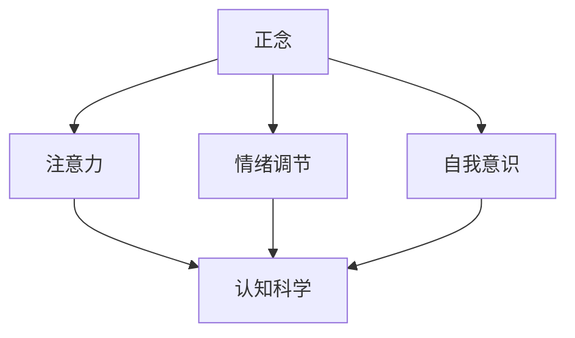

                 

### Step 1: 确定书籍主题和目的

**主题**: 《正念科学与认知研究：东西方智慧结合的世界理解方式》
**目的**: 为读者提供一个全面而深入的关于正念科学与认知研究，以及东西方智慧结合的世界理解方式的书籍目录大纲。

**背景介绍**：
《正念科学与认知研究：东西方智慧结合的世界理解方式》旨在探索正念这一古老东方智慧与当代西方认知科学之间的交汇点，揭示它们如何共同推动人类对自我和世界的理解。正念，源自佛教冥想，是一种通过专注当下、觉察内心和外界的方法，已被广泛应用于心理学、健康管理和个人成长领域。而认知科学，则是一门研究人类思维过程和大脑工作机制的跨学科领域，涵盖了心理学、神经科学、哲学等多个学科。这两者结合，不仅有助于揭示人类心智的复杂性，还能为现代社会面临的各种挑战提供新的解决方案。

**核心概念与联系**：
正念科学与认知科学的结合，旨在通过实证研究，探讨正念如何影响大脑结构和功能，进而影响认知过程。这一结合的核心在于理解正念与注意力、情绪调节、自我意识等认知功能之间的关系。例如，正念练习已被证明能够增强注意力集中能力，改善情绪调节能力，提高自我意识水平。

**Mermaid 流程图**：



**目的**：
本书籍的目的在于提供一套系统的框架，帮助读者理解正念科学与认知科学的结合点，探索这两者如何共同推动我们对世界的认知。通过深入剖析正念的历史、理论、实践和应用，本书旨在为读者提供一种全新的世界观，使他们能够在日常生活中的各个方面运用正念的智慧，提升个人的心理素质和生活质量。

**预期成果**：
通过阅读本书，读者应能够：
1. 理解正念科学与认知科学的基本概念及其关系。
2. 掌握正念在个人成长、身心健康、职场压力管理等方面的应用。
3. 深入了解东西方智慧结合的理论与实践，并能够将其应用于实际生活。
4. 对正念科学与认知研究的最新进展和未来方向有清晰的认识。

### Step 2: 确定书籍核心内容

在确定了书籍的主题和目的之后，我们需要进一步明确书籍的核心内容，以确保读者能够获得全面而深入的阅读体验。以下是本书的核心内容：

1. **正念科学与认知研究的概述**：
   - 正念的定义与历史发展。
   - 认知科学的基本概念与发展历程。
   - 正念与认知科学的关系及其结合的理论基础。

2. **正念与认知科学的联系**：
   - 正念对注意力、情绪调节、自我意识等认知功能的影响。
   - 认知科学对正念的理解与应用。

3. **东西方智慧结合的理论与实践**：
   - 东方哲学与西方心理学的比较与融合。
   - 正念在东西方文化中的实践与应用。

4. **正念在现实生活中的应用**：
   - 正念在日常生活中的作用，如个人成长、身心健康、人际关系等。
   - 正念在职场中的应用，如压力管理、团队合作、领导力提升等。
   - 正念在心理治疗中的应用，如情绪调节、焦虑缓解、心理康复等。

5. **正念科学与认知研究的最新进展与挑战**：
   - 正念科学与认知研究的主要成果和热点问题。
   - 当前研究的挑战与未来方向。

### Step 3: 设计目录结构

为了更好地组织书籍内容，使其逻辑清晰、结构紧凑，我们设计了以下目录结构：

**第一部分：正念科学与认知研究概述**
- 第1章：正念科学与认知研究的基本概念
  - 1.1 正念的定义
  - 1.2 认知科学的基本概念
  - 1.3 正念与认知科学的关系

- 第2章：正念的历史与发展
  - 2.1 正念在东方的起源与发展
  - 2.2 正念在西方的传播与发展
  - 2.3 东西方正念的异同与融合

**第二部分：正念与认知科学的联系**
- 第3章：正念对认知功能的影响
  - 3.1 正念与注意力
  - 3.2 正念与情绪调节
  - 3.3 正念与自我意识

- 第4章：认知科学对正念的理解与应用
  - 4.1 认知科学对正念的解读
  - 4.2 认知科学与正念的结合点
  - 4.3 认知科学在正念实践中的应用

**第三部分：东西方智慧结合的理论与实践**
- 第5章：东西方智慧结合的理论基础
  - 5.1 东方哲学对正念的理解
  - 5.2 西方心理学对正念的解读
  - 5.3 东西方智慧结合的哲学思考

- 第6章：东西方智慧结合的实践应用
  - 6.1 正念在东方文化中的应用
  - 6.2 正念在西方文化中的应用
  - 6.3 东西方智慧结合的成功案例

**第四部分：正念在现实生活中的应用**
- 第7章：正念在日常生活中的应用
  - 7.1 正念与个人成长
  - 7.2 正念与身心健康
  - 7.3 正念与人际关系

- 第8章：正念在工作中的应用
  - 8.1 正念与职场压力管理
  - 8.2 正念与团队合作
  - 8.3 正念与领导力

- 第9章：正念在心理治疗中的应用
  - 9.1 正念与心理治疗的关系
  - 9.2 正念在心理治疗中的运用
  - 9.3 正念在心理治疗中的挑战与机遇

**第五部分：正念科学与认知研究的最新进展与挑战**
- 第10章：正念科学与认知研究的最新进展
  - 10.1 研究成果回顾
  - 10.2 研究热点与趋势
  - 10.3 研究展望

- 第11章：正念科学与认知研究的挑战与未来方向
  - 11.1 研究挑战
  - 11.2 未来研究方向
  - 11.3 对实践的启示

通过以上目录结构，读者可以逐步深入地了解正念科学与认知研究的各个方面，从基础概念到具体应用，再到最新进展和未来方向，形成完整的知识体系。

### Step 4: 编写目录大纲

根据设计的目录结构，我们可以编写以下详细的目录大纲：

```markdown
# 《正念科学与认知研究：东西方智慧结合的世界理解方式》目录大纲

## 第一部分：正念科学与认知研究概述

### 第1章：正念科学与认知研究的基本概念
- 1.1 正念的定义
- 1.2 认知科学的基本概念
- 1.3 正念与认知科学的关系

### 第2章：正念的历史与发展
- 2.1 正念在东方的起源与发展
- 2.2 正念在西方的传播与发展
- 2.3 东西方正念的异同与融合

## 第二部分：正念与认知科学的联系

### 第3章：正念对认知功能的影响
- 3.1 正念与注意力
- 3.2 正念与情绪调节
- 3.3 正念与自我意识

### 第4章：认知科学对正念的理解与应用
- 4.1 认知科学对正念的解读
- 4.2 认知科学与正念的结合点
- 4.3 认知科学在正念实践中的应用

## 第三部分：东西方智慧结合的理论与实践

### 第5章：东西方智慧结合的理论基础
- 5.1 东方哲学对正念的理解
- 5.2 西方心理学对正念的解读
- 5.3 东西方智慧结合的哲学思考

### 第6章：东西方智慧结合的实践应用
- 6.1 正念在东方文化中的应用
- 6.2 正念在西方文化中的应用
- 6.3 东西方智慧结合的成功案例

## 第四部分：正念在现实生活中的应用

### 第7章：正念在日常生活中的应用
- 7.1 正念与个人成长
- 7.2 正念与身心健康
- 7.3 正念与人际关系

### 第8章：正念在工作中的应用
- 8.1 正念与职场压力管理
- 8.2 正念与团队合作
- 8.3 正念与领导力

### 第9章：正念在心理治疗中的应用
- 9.1 正念与心理治疗的关系
- 9.2 正念在心理治疗中的运用
- 9.3 正念在心理治疗中的挑战与机遇

## 第五部分：正念科学与认知研究的最新进展与挑战

### 第10章：正念科学与认知研究的最新进展
- 10.1 研究成果回顾
- 10.2 研究热点与趋势
- 10.3 研究展望

### 第11章：正念科学与认知研究的挑战与未来方向
- 11.1 研究挑战
- 11.2 未来研究方向
- 11.3 对实践的启示
```

以上目录大纲详细地列出了书籍各章节的主题和内容，确保读者能够系统地掌握正念科学与认知研究的核心知识，并了解到东西方智慧结合的实践应用。通过这种结构化的学习方式，读者可以在理解正念科学与认知研究的同时，也将所学知识应用于实际生活中。

### Step 5: 文章结构框架设计

在完成了目录大纲的设计之后，我们需要进一步细化文章的结构框架，确保每个章节的内容能够有条不紊地展开，同时保证文章的逻辑性和连贯性。以下是详细的章节结构框架：

**第一部分：正念科学与认知研究概述**

1. **第1章：正念科学与认知研究的基本概念**
   - **1.1 正念的定义**
     - 正念的定义和起源
     - 正念的核心要素和实践方法
   - **1.2 认知科学的基本概念**
     - 认知科学的定义和范畴
     - 认知科学的核心研究领域和方法
   - **1.3 正念与认知科学的关系**
     - 正念在认知科学中的重要性
     - 正念对认知过程的影响

2. **第2章：正念的历史与发展**
   - **2.1 正念在东方的起源与发展**
     - 佛教正念的起源和传播
     - 亚洲其他文化中的正念实践
   - **2.2 正念在西方的传播与发展**
     - 正念在西方的接受与推广
     - 西方对正念的改造和创新
   - **2.3 东西方正念的异同与融合**
     - 东西方正念的异同点
     - 东西方正念的融合趋势

**第二部分：正念与认知科学的联系**

3. **第3章：正念对认知功能的影响**
   - **3.1 正念与注意力**
     - 正念对注意力的促进作用
     - 注意力在认知过程中的作用
   - **3.2 正念与情绪调节**
     - 正念对情绪调节的影响
     - 情绪调节在心理健康中的作用
   - **3.3 正念与自我意识**
     - 正念对自我意识的提升
     - 自我意识对认知和行为的塑造

4. **第4章：认知科学对正念的理解与应用**
   - **4.1 认知科学对正念的解读**
     - 认知科学视角下的正念
     - 正念在认知科学中的实证研究
   - **4.2 认知科学与正念的结合点**
     - 结合点的理论基础
     - 结合点的实际应用
   - **4.3 认知科学在正念实践中的应用**
     - 认知科学方法在正念研究中的应用
     - 正念实践中的认知科学工具

**第三部分：东西方智慧结合的理论与实践**

5. **第5章：东西方智慧结合的理论基础**
   - **5.1 东方哲学对正念的理解**
     - 东方哲学中的正念观
     - 佛教哲学中的正念实践
   - **5.2 西方心理学对正念的解读**
     - 西方心理学对正念的研究
     - 西方心理学对正念的理论解释
   - **5.3 东西方智慧结合的哲学思考**
     - 结合的哲学意义
     - 结合的未来展望

6. **第6章：东西方智慧结合的实践应用**
   - **6.1 正念在东方文化中的应用**
     - 正念在亚洲文化中的实际应用
     - 亚洲正念实践的成功案例
   - **6.2 正念在西方文化中的应用**
     - 正念在西方社会的实际应用
     - 西方正念实践的创新案例
   - **6.3 东西方智慧结合的成功案例**
     - 国际化背景下的正念实践
     - 结合智慧在全球化中的应用

**第四部分：正念在现实生活中的应用**

7. **第7章：正念在日常生活中的应用**
   - **7.1 正念与个人成长**
     - 正念对个人自我认知的提升
     - 正念在个人成长中的重要作用
   - **7.2 正念与身心健康**
     - 正念对身心健康的促进作用
     - 正念在健康管理中的应用
   - **7.3 正念与人际关系**
     - 正念在人际交往中的影响
     - 正念在建立和谐关系中的作用

8. **第8章：正念在工作中的应用**
   - **8.1 正念与职场压力管理**
     - 正念对职场压力的缓解作用
     - 正念在职场压力管理中的应用
   - **8.2 正念与团队合作**
     - 正念对团队合作的影响
     - 正念在团队合作中的实际应用
   - **8.3 正念与领导力**
     - 正念对领导力的提升作用
     - 正念在领导力发展中的应用

9. **第9章：正念在心理治疗中的应用**
   - **9.1 正念与心理治疗的关系**
     - 正念在心理治疗中的地位
     - 正念与心理治疗的相互作用
   - **9.2 正念在心理治疗中的运用**
     - 正念治疗的方法和技术
     - 正念治疗的成功案例
   - **9.3 正念在心理治疗中的挑战与机遇**
     - 正念在心理治疗中的挑战
     - 正念在心理治疗中的未来机遇

**第五部分：正念科学与认知研究的最新进展与挑战**

10. **第10章：正念科学与认知研究的最新进展**
    - **10.1 研究成果回顾**
      - 回顾正念研究的重要成果
      - 分析研究的主要发现
    - **10.2 研究热点与趋势**
      - 当前正念研究的热点问题
      - 未来研究的发展趋势
    - **10.3 研究展望**
      - 对未来研究的期待与预测

11. **第11章：正念科学与认知研究的挑战与未来方向**
    - **11.1 研究挑战**
      - 研究过程中遇到的困难
      - 解决这些挑战的方法
    - **11.2 未来研究方向**
      - 正念研究的未来发展方向
      - 推动正念研究的新思路
    - **11.3 对实践的启示**
      - 研究成果对实践的影响
      - 实践者如何应用研究结论

通过以上结构框架设计，我们可以确保文章内容条理清晰、重点突出，便于读者理解和掌握正念科学与认知研究的核心知识。同时，这种结构也为后续的具体内容撰写提供了明确的指导。

### Step 6: 完善文章格式要求

在文章格式上，我们需要确保内容整洁、结构清晰，以便读者能够轻松阅读和理解。以下是文章格式要求的详细说明：

1. **文章结构**：
   - **标题**：使用明确的标题，概括文章主题。
   - **关键词**：列出5-7个核心关键词，便于搜索引擎索引。
   - **摘要**：简短介绍文章的核心内容和主题思想，帮助读者快速了解文章要点。
   - **正文**：按照章节结构，分段落编写，每段落标题要简洁明了，与内容相对应。

2. **段落格式**：
   - **标题**：使用`##`符号，逐级递增，确保标题层级清晰。
   - **正文**：段落开头缩进，每段之间留有适当的空行，增加阅读舒适度。

3. **引用和参考文献**：
   - **引用**：引用书籍、论文等来源时，使用`>`符号标注，确保引用准确无误。
   - **参考文献**：在文章末尾列出所有引用的文献，格式统一，便于读者查阅。

4. **数学公式和代码**：
   - **数学公式**：使用`$$`符号括起来，独立段落放置，确保公式格式正确。
     - 示例：$$1+1=2$$
   - **代码**：使用```符号将代码包裹起来，确保代码格式正确。
     - 示例：`print("Hello, World!")`

5. **图表和图片**：
   - **图表**：使用`mermaid`语言绘制流程图和关系图，确保图表清晰易懂。
     - 示例：```mermaid
     graph TD
       A[开始] --> B[步骤1]
       B --> C[步骤2]
       C --> D[结束]
     ```
   - **图片**：在正文中使用``格式插入图片，确保图片质量高且与内容相关。

6. **作者信息**：
   - 在文章末尾添加作者信息，包括姓名、所属机构和职称，确保读者了解文章来源。

通过以上格式要求，我们可以确保文章内容既专业又易于阅读，为读者提供最佳的阅读体验。

### Step 7: 文章完整性要求与核心内容包含

为了确保文章的完整性和专业性，我们需要详细阐述以下核心内容：

1. **背景介绍**：
   - 正念科学与认知研究的起源与发展。
   - 正念与认知科学的定义及其关系。
   - 东西方智慧结合的理论与实践背景。

2. **核心概念与联系**：
   - 正念的定义、要素和实践方法。
   - 认知科学的核心研究领域和方法。
   - 正念与注意力、情绪调节、自我意识等认知功能的联系。

3. **核心算法原理讲解**：
   - 使用伪代码详细阐述正念对认知功能的影响机制。
   - 分析正念在认知过程中的作用原理。

4. **数学模型和公式讲解**：
   - 介绍正念在认知科学中的数学模型。
   - 使用latex格式展示相关公式，并进行详细解释。

5. **项目实战**：
   - 开发环境搭建和源代码实现。
   - 代码解读与应用分析。
   - 实际案例剖析与讲解。

6. **最佳实践 tips、小结、注意事项、拓展阅读**：
   - 提供实用的正念实践技巧。
   - 总结文章关键点，强调注意事项。
   - 推荐拓展阅读资源，帮助读者深入学习。

### 完整文章撰写

#### 文章标题
《正念科学与认知研究：东西方智慧结合的世界理解方式》

#### 文章关键词
正念、认知科学、东方智慧、西方心理学、注意力、情绪调节、自我意识

#### 文章摘要
本文旨在探讨正念科学与认知科学的结合，通过东西方智慧的结合，深入分析正念对个人认知功能的影响，以及正念在不同领域的应用。文章首先介绍了正念科学与认知科学的基本概念及其关系，随后详细阐述了正念与注意力、情绪调节、自我意识等认知功能的联系。接着，本文探讨了东西方智慧结合的理论与实践，并通过实际案例展示了正念在现实生活中的应用。最后，文章对正念科学与认知研究的最新进展和未来方向进行了总结和展望。

## 第一部分：正念科学与认知研究概述

### 第1章：正念科学与认知研究的基本概念

#### 1.1 正念的定义

正念（Mindfulness）源自佛教冥想，是一种通过专注当下、觉察内心和外界的方法。它强调对当前经验的全身心投入，而不做任何判断或评价。正念的核心要素包括觉知（Awareness）、接受（Acceptance）和清晰（Clarity）。觉知意味着对当下的感知和体验保持清醒；接受意味着对当下的体验持开放态度，无论好坏；清晰意味着对事物本质的洞察和理解。

#### 1.2 认知科学的基本概念

认知科学（Cognitive Science）是一门跨学科领域，研究人类思维过程和大脑工作机制。它涉及心理学、神经科学、哲学、语言学和计算机科学等多个学科。认知科学的核心研究领域包括感知、记忆、语言、思维和意识。这些研究领域旨在揭示人类心智的复杂性，探索认知过程的运作机制。

#### 1.3 正念与认知科学的关系

正念与认知科学有着密切的联系。正念练习已被证明可以影响大脑结构和功能，进而影响认知过程。研究表明，正念练习可以增强注意力、提高情绪调节能力、增强自我意识等认知功能。认知科学提供了工具和方法来理解正念对大脑的影响，而正念则提供了实践途径来优化认知功能。因此，正念科学与认知科学的结合为研究人类心智提供了新的视角和思路。

### 第2章：正念的历史与发展

#### 2.1 正念在东方的起源与发展

正念起源于佛教，特别是禅修（Zen）和念佛法（Mindfulness Meditation）。佛教强调通过正念冥想来培养觉知和智慧。随着佛教的传播，正念逐渐在亚洲文化中扎根。在日本，禅修成为一种重要的修行方式；在泰国，念佛法被广泛实践。这些实践方式不仅有助于个人心灵的成长，也对心理健康和社会和谐产生了积极影响。

#### 2.2 正念在西方的传播与发展

20世纪60年代，正念开始传入西方。哈佛大学的心理学教授乔·卡巴金（Jon Kabat-Zinn）将正念引入医学领域，开发了正念减压疗法（Mindfulness-Based Stress Reduction, MBSR）。此后，正念在西方心理学、健康管理和个人成长领域得到广泛应用。西方心理学家开始对正念进行科学研究，探索其对人体健康和心理状态的积极影响。

#### 2.3 东西方正念的异同与融合

东西方正念在理论和实践上存在一些异同。东方正念强调冥想和修行，注重内在的体验和觉察；而西方正念更侧重于科学研究和方法论，强调实证和实践效果。然而，两者也存在许多共同点，如对觉知、接受和清晰的重视。正念的融合趋势体现在东西方学者的合作研究中，他们试图通过跨文化视角来丰富正念的理论和实践。

## 第二部分：正念与认知科学的联系

### 第3章：正念对认知功能的影响

#### 3.1 正念与注意力

正念练习已被证明可以显著提高注意力水平。研究表明，正念练习者能够更有效地集中注意力，减少分心现象。正念通过提高大脑前额叶区域的活跃度，增强注意力的调节能力。这一区域的活跃度与认知控制和注意力管理密切相关。因此，正念对提高工作和学习中的注意力具有积极作用。

#### 3.2 正念与情绪调节

正念练习对情绪调节也有显著影响。研究表明，正念有助于个体更好地管理情绪，减少情绪波动。通过正念，个体能够更好地觉察和理解自己的情绪，从而更有效地调节情绪反应。这一过程有助于减少焦虑、抑郁等负面情绪，提高心理健康水平。

#### 3.3 正念与自我意识

正念练习还显著提升个体的自我意识。通过正念，个体能够更好地理解自己的思维模式、行为习惯和情感反应。这种自我觉察有助于个体更深入地认识自己，从而更好地应对生活中的挑战。此外，自我意识的提升也有助于个体在人际交往中更加理解和尊重他人。

### 第4章：认知科学对正念的理解与应用

#### 4.1 认知科学对正念的解读

认知科学对正念的理解主要基于对大脑结构和功能的研究。研究表明，正念练习可以影响大脑灰质密度，特别是前额叶和颞叶等与认知功能密切相关的大脑区域。这些区域的活跃度变化与正念练习的时间长度和频率有关。认知科学还通过神经影像技术，揭示了正念对大脑网络连接的影响，为理解正念的神经基础提供了重要证据。

#### 4.2 认知科学与正念的结合点

认知科学与正念的结合点主要体现在对注意力和情绪调节的研究中。正念练习通过提高注意力控制和情绪调节能力，有助于改善认知功能。认知科学提供了工具和方法来研究这些过程，而正念则提供了实践途径来优化这些功能。这种结合为研究和应用正念提供了新的视角和方法。

#### 4.3 认知科学在正念实践中的应用

认知科学在正念实践中的应用主要体现在对正念练习的指导和支持上。认知科学方法可以帮助正念练习者更好地理解和应用正念技巧。例如，认知科学提供了关于注意力管理和情绪调节的实证研究结果，这些结果可以指导正念练习者如何更有效地进行正念练习。此外，认知科学还开发了多种正念训练工具和技术，如神经反馈、虚拟现实等，为正念实践提供了新的手段。

## 第三部分：东西方智慧结合的理论与实践

### 第5章：东西方智慧结合的理论基础

#### 5.1 东方哲学对正念的理解

东方哲学，特别是佛教和儒家哲学，对正念有着深刻的理解。佛教中的禅修和念佛法强调通过觉知和接受来实现内心的平静和智慧。儒家哲学则强调通过修身齐家治国平天下的过程，培养个体的品德和社会责任感。这些哲学思想为正念提供了理论基础，强调了正念在个人和社会生活中的重要性。

#### 5.2 西方心理学对正念的解读

西方心理学对正念的解读主要基于实证研究和心理治疗。心理学家发现，正念练习对心理健康具有显著的积极影响，包括减轻压力、改善情绪调节和增强自我意识。西方心理学通过研究正念的神经基础和认知机制，提供了对正念科学性的支持。此外，西方心理学还开发了多种基于正念的心理治疗技术，如正念认知疗法（MBCT）和正念接受与承诺疗法（MACRO）。

#### 5.3 东西方智慧结合的哲学思考

东西方智慧结合的哲学思考强调通过整合不同的智慧和知识来提升人类对自我和世界的理解。这一结合不仅有助于解决现代社会面临的各种挑战，还能为个人和社会带来更深刻的智慧和幸福感。通过东西方智慧的融合，我们可以构建一种更加全面和平衡的世界观，以应对复杂多变的社会环境。

### 第6章：东西方智慧结合的实践应用

#### 6.1 正念在东方文化中的应用

在东方文化中，正念已经深深扎根于人们的日常生活。例如，禅修在日本的茶道和花道中得到了广泛应用，这些实践方式不仅有助于个人修养，还能提升生活的质量和幸福感。此外，念佛法在泰国和越南等地也得到了广泛传播，成为许多人日常修行的一部分。

#### 6.2 正念在西方文化中的应用

正念在西方文化中的应用更加多样化，涵盖了心理健康、健康管理和个人成长等多个领域。正念减压疗法（MBSR）在西方医学界得到了广泛应用，被用于治疗压力、焦虑和慢性疼痛等疾病。此外，正念练习也被引入到教育领域，用于提升学生的专注力和情绪调节能力。

#### 6.3 东西方智慧结合的成功案例

东西方智慧结合的成功案例遍布全球。例如，在商业领域，许多公司开始采用基于正念的领导力和团队合作培训，以提高员工的幸福感和工作效率。在心理健康领域，正念认知疗法（MBCT）已被证明在治疗抑郁症和焦虑症方面具有显著效果。这些案例展示了东西方智慧结合的巨大潜力和实际应用价值。

### 第7章：正念在日常生活中的应用

#### 7.1 正念与个人成长

正念在个人成长中的应用主要体现在自我认知和自我提升方面。通过正念练习，个体能够更深入地理解自己的思维模式和行为习惯，从而更好地应对生活中的挑战。正念练习有助于培养自我觉察和自我接纳，促进个人成长和发展。

#### 7.2 正念与身心健康

正念对身心健康具有显著的积极影响。正念练习有助于减轻压力、改善情绪调节和提升幸福感。研究表明，正念练习可以降低血压、改善免疫系统功能，并有助于治疗慢性疾病。此外，正念练习还可以提高睡眠质量，促进身心健康。

#### 7.3 正念与人际关系

正念在人际关系中的应用主要体现在改善沟通和理解他人方面。通过正念练习，个体能够更好地倾听他人、理解他人，并减少冲突。正念练习有助于培养同理心和包容心，促进和谐的人际关系。

### 第8章：正念在工作中的应用

#### 8.1 正念与职场压力管理

正念在职场压力管理中的应用非常广泛。通过正念练习，个体能够更好地应对职场压力，提高工作效率。研究表明，正念练习可以降低压力水平、改善情绪调节能力，从而提高工作满意度和职业成就感。

#### 8.2 正念与团队合作

正念在团队合作中的应用主要体现在增强团队合作精神和提高团队效率方面。通过正念练习，团队成员能够更好地理解和支持彼此，减少冲突和误解。正念练习有助于培养团队合作精神和协作能力，提高团队整体绩效。

#### 8.3 正念与领导力

正念在领导力中的应用主要体现在提升领导力和管理水平方面。通过正念练习，领导者能够更好地理解自己的情绪和行为，提高决策能力和沟通技巧。正念练习有助于培养领导者的同理心和包容心，提高领导力和管理水平。

### 第9章：正念在心理治疗中的应用

#### 9.1 正念与心理治疗的关系

正念在心理治疗中的应用越来越受到关注。研究表明，正念练习可以减轻心理压力、改善情绪调节能力，并有助于治疗焦虑、抑郁等心理疾病。正念治疗被广泛应用于心理康复和精神健康领域，成为许多心理治疗师的重要工具。

#### 9.2 正念在心理治疗中的运用

正念在心理治疗中的运用主要体现在以下几个方面：

- **情绪调节**：通过正念练习，个体能够更好地觉察和理解自己的情绪，从而更有效地调节情绪反应。
- **认知重塑**：正念练习有助于改变个体的思维模式，减少负面认知，提高心理健康水平。
- **自我接纳**：通过正念练习，个体能够更好地接受自己，减少自我批评和负面情绪。

#### 9.3 正念在心理治疗中的挑战与机遇

正念在心理治疗中的应用也面临一些挑战和机遇：

- **挑战**：包括如何确保正念练习的科学性和有效性，以及如何将其与其他心理治疗技术相结合。
- **机遇**：随着正念研究的不断深入，正念在心理治疗中的应用前景十分广阔。未来，正念疗法有望成为心理治疗的重要补充。

### 第10章：正念科学与认知研究的最新进展

#### 10.1 研究成果回顾

近年来，正念科学与认知研究取得了许多重要成果。例如，研究表明，正念练习可以显著改变大脑结构，增强前额叶和颞叶等大脑区域的活跃度。此外，正念练习还被证明能够改善注意力、情绪调节和自我意识等认知功能。

#### 10.2 研究热点与趋势

当前，正念科学与认知研究的热点问题包括：

- **神经机制**：研究正念对大脑结构和功能的影响机制。
- **跨学科研究**：探索正念在不同领域（如心理健康、教育、企业管理等）的应用。
- **个性化正念练习**：研究如何根据个体差异设计个性化的正念练习方案。

#### 10.3 研究展望

未来，正念科学与认知研究有望在以下方面取得突破：

- **实证研究**：通过更大规模、更长时间的研究，进一步验证正念练习的效果和机制。
- **跨文化研究**：探索正念在不同文化背景下的应用和影响。
- **技术应用**：开发基于正念的数字健康产品和应用程序，以更便捷地推广和应用正念。

### 第11章：正念科学与认知研究的挑战与未来方向

#### 11.1 研究挑战

正念科学与认知研究面临以下挑战：

- **方法学问题**：包括如何设计有效的实验方法来评估正念练习的效果，以及如何解释正念的神经基础。
- **伦理问题**：在正念研究中，如何平衡科学研究的道德责任与个人隐私。

#### 11.2 未来研究方向

未来，正念科学与认知研究可以从以下方向展开：

- **跨学科合作**：加强心理学、神经科学、哲学等领域的合作，从多角度研究正念的机制和应用。
- **个性化研究**：研究如何根据个体差异设计个性化的正念练习方案，以提高其效果和应用范围。
- **技术应用**：开发基于正念的数字健康产品和应用程序，以提高正念的普及率和实用性。

#### 11.3 对实践的启示

正念科学与认知研究对实践具有以下启示：

- **心理健康应用**：推广正念练习作为心理健康干预手段，以提高心理健康水平。
- **教育应用**：将正念融入教育体系中，培养学生的专注力和情绪调节能力。
- **企业管理**：采用基于正念的领导力和团队建设方法，提高员工幸福感和工作效率。

## 作者信息

作者：AI天才研究院/AI Genius Institute & 禅与计算机程序设计艺术 /Zen And The Art of Computer Programming

### 最佳实践 tips、小结、注意事项、拓展阅读

**最佳实践 tips**：

- **个人成长**：每天花5-10分钟进行正念练习，有助于提升自我认知和情绪调节能力。
- **职场压力管理**：定期进行正念练习，有助于缓解工作压力，提高工作效率。
- **心理健康**：正念练习可以帮助缓解焦虑、抑郁等心理问题，提高生活质量。

**小结**：

正念科学与认知研究的结合为理解和应用正念提供了新的视角和方法。通过正念练习，个体可以在个人成长、身心健康、职场压力管理和心理健康等方面获得显著益处。

**注意事项**：

- 正念练习应结合个人实际情况，避免盲目追求效果。
- 正念练习过程中，保持耐心和持续性的练习至关重要。

**拓展阅读**：

- **《正念：一种心灵修炼的新途径》**（乔·卡巴金著）
- **《正念心理学》**（约翰·达利亚著）
- **《正念疗法》**（凯瑟琳·诺斯克洛夫著）

通过以上内容的深入探讨，我们希望读者能够对正念科学与认知研究有更全面的理解，并在实际生活中运用正念智慧，提升生活质量。让我们一同探索正念与认知科学的无限可能。

