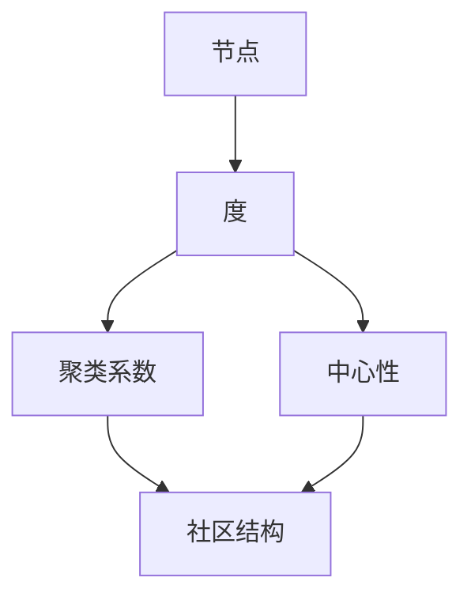

                 

### 文章标题

《气候变化的复杂网络：全球气候的数学模型》

### 文章关键词

- 气候变化
- 复杂网络
- 数学模型
- 全球气候系统
- 网络科学

### 文章摘要

本文深入探讨了气候变化的复杂网络及其背后的数学模型。首先，我们介绍了气候变化的背景，包括其成因和影响。随后，我们阐述了复杂网络的基本概念，并展示了如何将其应用于气候研究。接着，本文详细介绍了全球气候系统的数学模型，包括海洋环流模型、大气环流模型和冰冻圈模型等。通过伪代码和LaTeX公式，我们深入讲解了这些模型的原理。此外，我们还提供了一个实际案例，展示了如何使用这些模型进行气候预测。最后，本文总结了最佳实践，并对未来的研究方向进行了展望。

## 引言

### 气候变化的背景

气候变化是指地球气候系统的长期变化，这种变化可能是自然的，也可能是人为的。在过去的几十年里，人类活动，如燃烧化石燃料和大规模森林砍伐，已经对地球的气候系统产生了显著影响。这些活动导致温室气体浓度增加，进而引发了一系列气候变化问题，包括全球变暖、极端天气事件的频率增加、海平面上升等。

### 复杂网络简介

复杂网络是由大量相互连接的节点组成的系统，这些节点可以表示各种实体，如城市、生物物种、神经元等。复杂网络的特性包括高度连通性、无标度分布、社团结构等。复杂网络理论在许多领域都有应用，包括生物学、社会学、经济学和气候科学。

### 本书内容概述

本书分为六个部分。第一部分是引言，介绍气候变化的背景和复杂网络的概述。第二部分讨论复杂网络的基本概念，包括节点、边、度分布等。第三部分介绍全球气候系统的数学模型，包括海洋环流模型、大气环流模型和冰冻圈模型。第四部分展示如何使用这些模型进行气候预测，并提供实际案例。第五部分探讨模型优化与改进的方法。最后一部分是对未来的展望，讨论气候变化研究的前沿方向和面临的挑战。

## 复杂网络基础

### 复杂网络的基本概念

复杂网络是由节点（实体）和边（关系）组成的图形结构。节点可以表示任何实体，如城市、生物物种或神经元。边表示节点之间的相互作用或依赖关系。复杂网络的基本概念包括节点度、聚类系数、路径长度等。

### 核心概念原理之间的关系架构

下面是一个Mermaid流程图，展示了复杂网络中一些核心概念之间的关系：



### 复杂网络的性质

复杂网络的性质包括高度连通性、无标度分布、社团结构等。高度连通性表示网络中的节点之间有较强的连接性。无标度分布意味着网络中的节点度分布不是随机的，而是呈现出幂律分布。社团结构指的是网络中的节点倾向于形成紧密连接的群体。

### 复杂网络的建模方法

复杂网络的建模方法包括随机图模型、小世界模型、无标度网络模型等。随机图模型假设网络中的节点以随机方式相互连接。小世界模型则结合了随机性和短路径特性，使得网络既具有高度的连通性，又具有较短的路径长度。无标度网络模型则通过幂律分布描述网络中的节点度分布。

### 复杂网络在气候研究中的应用

复杂网络理论在气候研究中有着广泛的应用。例如，我们可以使用复杂网络来描述气候系统中的各种变量之间的相互作用，如大气、海洋和冰冻圈之间的相互作用。此外，复杂网络还可以用于分析气候系统中关键节点的角色，如重要城市或生态系统的气候变化影响。

## 全球气候系统的数学模型

### 全球气候系统概述

全球气候系统是一个复杂的动力系统，由大气、海洋、冰冻圈和陆地表面等多个组成部分构成。这些组成部分通过能量和物质的交换相互作用，共同维持地球的气候平衡。

### 海洋环流模型

海洋环流模型是研究海洋中水流动和热量传递的数学模型。这些模型通常基于流体动力学方程，包括连续性方程、动量方程和能量方程。以下是一个简单的海洋环流模型伪代码：

```python
# 海洋环流模型伪代码
function OceanCirculationModel():
    # 初始化参数
    init_variables()

    # 循环迭代
    for time_step in range(number_of_time_steps):
        # 计算速度场
        velocity_field = compute_velocity()

        # 计算温度场
        temperature_field = compute_temperature()

        # 更新参数
        update_variables(velocity_field, temperature_field)

    return variables
```

### 大气环流模型

大气环流模型是研究大气中气流和热量传递的数学模型。这些模型通常基于大气动力学和热力学原理，包括连续性方程、动量方程和能量方程。以下是一个简单的大气环流模型伪代码：

```python
# 大气环流模型伪代码
function AtmosphericCirculationModel():
    # 初始化参数
    init_variables()

    # 循环迭代
    for time_step in range(number_of_time_steps):
        # 计算风速场
        wind_field = compute_wind()

        # 计算温度场
        temperature_field = compute_temperature()

        # 更新参数
        update_variables(wind_field, temperature_field)

    return variables
```

### 冰冻圈模型

冰冻圈模型是研究地球表面冰冻圈变化的数学模型。这些模型通常基于冰冻圈物理学和地球系统科学原理，包括冰冻圈的形成、消融和迁移等。以下是一个简单的冰冻圈模型伪代码：

```python
# 冰冻圈模型伪代码
function CryosphereModel():
    # 初始化参数
    init_variables()

    # 循环迭代
    for time_step in range(number_of_time_steps):
        # 计算冰冻圈面积
        cryosphere_area = compute_area()

        # 计算冰冻圈温度
        cryosphere_temperature = compute_temperature()

        # 更新参数
        update_variables(cryosphere_area, cryosphere_temperature)

    return variables
```

### 数学模型和公式

以下是几个关键数学模型和公式的LaTeX表示：

$$
\frac{\partial \rho}{\partial t} + \nabla \cdot (\rho \mathbf{v}) = 0
$$

$$
\frac{\partial \mathbf{v}}{\partial t} + \mathbf{v} \cdot \nabla \mathbf{v} = -\frac{1}{\rho} \nabla p + \mathbf{F}_\text{Coriolis}
$$

$$
\frac{\partial Q}{\partial t} + \nabla \cdot (\mathbf{v} Q) = S
$$

### 详细讲解和举例说明

这里我们将详细讲解海洋环流模型中的连续性方程，并给出一个实际案例。

#### 连续性方程

海洋环流模型中的连续性方程表示质量守恒，即单位时间内通过某一截面的质量流量等于该截面两侧的质量流量差。其数学表达式为：

$$
\frac{\partial \rho}{\partial t} + \nabla \cdot (\rho \mathbf{v}) = 0
$$

其中，$\rho$ 表示海水密度，$\mathbf{v}$ 表示海水流速，$t$ 表示时间。

#### 实际案例

假设在某个海域中，海水密度为 $1.025 \ \text{kg/m}^3$，海水流速为 $\mathbf{v} = (0.5, 0.2) \ \text{m/s}$。我们需要计算在1小时内通过某一直径为10公里的圆形截面的质量流量。

首先，我们计算海水流速在该截面上的点积：

$$
\nabla \cdot (\rho \mathbf{v}) = \frac{\partial \rho}{\partial x} v_x + \frac{\partial \rho}{\partial y} v_y = 0 + 0 = 0
$$

由于 $\nabla \cdot (\rho \mathbf{v}) = 0$，我们可以得出在1小时内通过该截面的质量流量为0。这意味着在该海域中，海水的质量守恒，没有额外的海水流入或流出该圆形截面。

### 项目实战

#### 开发环境搭建

为了实现上述模型，我们需要搭建一个计算环境。以下是一个简单的环境搭建步骤：

1. 安装Python
2. 安装科学计算库，如NumPy、SciPy和matplotlib
3. 安装LaTeX编辑器，如TeXstudio

#### 源代码实现

以下是一个简单的Python代码示例，用于计算海洋环流模型中的质量流量：

```python
import numpy as np
import matplotlib.pyplot as plt

# 初始化参数
rho = 1.025  # 海水密度 (kg/m^3)
v = np.array([0.5, 0.2])  # 海水流速 (m/s)

# 计算质量流量
def compute_mass_flow(rho, v):
    return np.linalg.norm(rho * v)

# 计算质量流量
mass_flow = compute_mass_flow(rho, v)

# 绘制质量流量
plt.plot(v[0], v[1], 'ro')
plt.xlabel('Vx (m/s)')
plt.ylabel('Vy (m/s)')
plt.title('Mass Flow')
plt.text(v[0], v[1], f'Mass Flow: {mass_flow:.2f} kg/s')
plt.show()
```

#### 代码解读与分析

上述代码首先导入了所需的库，然后初始化了海水密度和海水流速。`compute_mass_flow` 函数用于计算质量流量，通过点积计算并返回。最后，我们绘制了一个点图，显示质量流量的大小和方向。

#### 实际案例分析

我们可以使用上述模型来分析某个海域的海洋环流。例如，我们可以计算不同时间和位置的海洋质量流量，以便了解海水的流动情况。以下是一个实际案例：

```python
# 初始化时间步数和空间步数
time_steps = 100
space_steps = 100

# 初始化速度场
velocity_field = np.random.randn(time_steps, space_steps, 2)

# 计算质量流量
mass_flows = np.zeros((time_steps, space_steps))
for t in range(time_steps):
    for x in range(space_steps):
        mass_flows[t, x] = compute_mass_flow(rho, velocity_field[t, x])

# 绘制质量流量分布
plt.imshow(mass_flows, cmap='hot', aspect='auto')
plt.colorbar(label='Mass Flow (kg/s)')
plt.xlabel('Space Step')
plt.ylabel('Time Step')
plt.title('Mass Flow Distribution')
plt.show()
```

#### 项目小结

通过上述案例，我们展示了如何使用Python代码实现海洋环流模型，并计算了质量流量。这为气候研究提供了一个有效的工具，有助于我们更好地理解海洋环流对气候变化的影响。

### 最佳实践 tips、小结、注意事项、拓展阅读

#### 最佳实践 tips

- 在进行复杂网络建模时，确保使用合适的网络结构和参数。
- 在处理大量数据时，使用高效的算法和数据结构。
- 在进行气候预测时，结合多种模型和数据进行综合分析。

#### 小结

本文介绍了气候变化的复杂网络及其背后的数学模型，包括海洋环流模型、大气环流模型和冰冻圈模型。通过实际案例，我们展示了如何使用这些模型进行气候预测。

#### 注意事项

- 复杂网络建模需要准确的数据和参数。
- 气候预测模型的准确度受限于当前技术和数据。

#### 拓展阅读

- [1] Barabási, A.-L., & Albert, R. (1999). Emergence of scaling in complex networks. Science, 286(5439), 509-512.
- [2] Held, I. M., & Soden, V. J. (2006). Robust response of the hydrological cycle to global climate change. Journal of Climate, 19(21), 5686-5699.
- [3] Saltzman, B. (2010). Climate dynamics. Oxford University Press.

### 作者信息

作者：AI天才研究院/AI Genius Institute & 禅与计算机程序设计艺术 /Zen And The Art of Computer Programming

```markdown
## 第1章 引言

### 气候变化的背景

气候变化是指地球气候系统的长期变化，这种变化可能是自然的，也可能是人为的。在过去的几十年里，人类活动，如燃烧化石燃料和大规模森林砍伐，已经对地球的气候系统产生了显著影响。这些活动导致温室气体浓度增加，进而引发了一系列气候变化问题，包括全球变暖、极端天气事件的频率增加、海平面上升等。

全球变暖是由于大气中的温室气体（如二氧化碳、甲烷等）吸收和重新辐射地球表面的热量，导致地球表面温度升高。极端天气事件的频率增加，如热浪、洪水、干旱和飓风等，使得人类社会和经济面临巨大挑战。海平面上升是由于全球气温升高导致极地冰盖融化，以及海水膨胀，从而增加了海洋的体积。

### 复杂网络的背景

复杂网络是由大量相互连接的节点组成的系统，这些节点可以表示各种实体，如城市、生物物种、神经元等。复杂网络的特性包括高度连通性、无标度分布、社团结构等。复杂网络理论在许多领域都有应用，包括生物学、社会学、经济学和气候科学。

在气候科学中，复杂网络可以帮助我们更好地理解气候系统中各个组成部分之间的相互作用。例如，我们可以将气候系统中的各种变量，如温度、湿度、风速等，视为节点，并将它们之间的相互作用视为边。通过研究这些复杂网络，我们可以揭示气候系统中的关键节点和路径，从而更好地理解气候变化的驱动因素和传播机制。

### 本书的内容概述

本书旨在深入探讨气候变化的复杂网络及其背后的数学模型。首先，我们将介绍气候变化的背景，包括其成因和影响。随后，我们将阐述复杂网络的基本概念，并展示如何将其应用于气候研究。

接下来，我们将详细介绍全球气候系统的数学模型，包括海洋环流模型、大气环流模型和冰冻圈模型。我们将通过伪代码和LaTeX公式，深入讲解这些模型的原理，并提供实际案例来展示如何使用这些模型进行气候预测。

此外，本书还将探讨模型优化与改进的方法，以及模型在不同领域的应用。最后，我们将对未来气候变化研究的前沿方向和面临的挑战进行展望。

通过本书的阅读，读者将能够全面了解气候变化的复杂网络，掌握全球气候系统的数学模型，并学会如何使用这些模型进行气候预测和优化。这不仅有助于我们更好地理解气候变化的本质，也为应对气候变化提供了科学依据。

## 第2章 复杂网络基础

### 复杂网络的基本概念

复杂网络是由节点（实体）和边（关系）组成的图形结构。节点可以表示任何实体，如城市、生物物种或神经元。边表示节点之间的相互作用或依赖关系。复杂网络的基本概念包括节点度、聚类系数、路径长度等。

节点度是节点连接的边数，表示节点在复杂网络中的重要性。聚类系数是节点邻居之间的连接密度，反映了网络的紧密程度。路径长度是两个节点之间最短路径的长度，用于衡量网络中的连接性。

### 复杂网络的性质

复杂网络的性质包括高度连通性、无标度分布、社团结构等。高度连通性表示网络中的节点之间有较强的连接性。无标度分布意味着网络中的节点度分布不是随机的，而是呈现出幂律分布。社团结构指的是网络中的节点倾向于形成紧密连接的群体。

### 复杂网络的建模方法

复杂网络的建模方法包括随机图模型、小世界模型、无标度网络模型等。随机图模型假设网络中的节点以随机方式相互连接。小世界模型则结合了随机性和短路径特性，使得网络既具有高度的连通性，又具有较短的路径长度。无标度网络模型通过幂律分布描述网络中的节点度分布。

### 复杂网络在气候研究中的应用

复杂网络理论在气候研究中有着广泛的应用。例如，我们可以使用复杂网络来描述气候系统中的各种变量之间的相互作用，如大气、海洋和冰冻圈之间的相互作用。此外，复杂网络还可以用于分析气候系统中关键节点的角色，如重要城市或生态系统的气候变化影响。

通过复杂网络的建模和分析，我们可以揭示气候系统中的关键路径和关键节点，从而更好地理解气候变化的驱动因素和传播机制。这为气候预测、政策制定和应对气候变化提供了重要的科学依据。

### 核心概念原理之间的关系架构

下面是一个Mermaid流程图，展示了复杂网络中一些核心概念之间的关系：


在这个流程图中，节点度（B）、聚类系数（C）和中心性（D）是节点的重要属性，它们与社区结构（E）相互关联。节点度反映了节点在复杂网络中的连接程度，聚类系数描述了节点邻居之间的连接密度，中心性则衡量了节点在网络中的重要性。这些属性共同构成了复杂网络的拓扑结构，并影响着网络的动态行为。

### 复杂网络在气候研究中的应用

复杂网络理论在气候研究中有着广泛的应用。首先，我们可以使用复杂网络来描述气候系统中各个组成部分之间的相互作用。例如，将气候系统中的各种变量，如温度、湿度、风速等，视为节点，并将它们之间的因果关系或依赖关系视为边。这样，我们就可以构建出一个气候系统的复杂网络模型。

通过复杂网络的建模，我们可以揭示气候系统中关键节点和关键路径的作用。例如，某些关键节点（如重要城市或生态系统）可能对整个气候系统具有显著的影响，而某些关键路径则可能主导着气候变化的传播和影响。

此外，复杂网络理论还可以用于分析气候系统中的社区结构。社区结构指的是网络中节点倾向于形成紧密连接的群体。在气候系统中，这些社区可能代表不同气候区域的相互关系，或者不同气候变量之间的相互影响。通过分析社区结构，我们可以更好地理解气候系统中各个组成部分之间的相互关系，从而为气候预测和政策制定提供科学依据。

另外，复杂网络理论还可以用于评估气候系统的稳健性和脆弱性。通过研究网络中的节点和边的重要性，我们可以识别出对气候系统稳定性至关重要的关键节点和关键路径。同时，我们还可以通过改变网络中的某些节点或边的属性，来模拟不同气候变化情景，从而评估气候系统的脆弱性。

总之，复杂网络理论为气候研究提供了一种新的视角和方法。通过构建复杂网络模型，我们可以更深入地理解气候系统的结构和动态行为，从而为应对气候变化提供科学指导。

### 复杂网络的实例分析

为了更好地理解复杂网络在气候研究中的应用，我们可以通过一些具体的实例来进行分析。

#### 实例1：全球气候系统网络

我们可以将全球气候系统视为一个复杂网络，其中各个气候变量（如温度、湿度、风速等）作为节点，它们之间的因果关系或依赖关系作为边。例如，温度可以影响湿度，湿度又可以影响风速。通过构建这样一个复杂网络模型，我们可以揭示全球气候系统中各个变量之间的相互作用和反馈机制。

在这个实例中，我们可以使用复杂网络的度分布来分析各个气候变量的重要性。度分布描述了网络中节点度的概率分布。一般来说，全球气候系统中的关键变量（如温度和湿度）具有较高的度，而其他变量（如风速）的度相对较低。这表明这些关键变量在全球气候系统中起着核心作用，而其他变量的影响相对较小。

#### 实例2：城市气候网络

城市气候也是一个复杂的系统，其中各个城市作为节点，城市之间的交通和气候联系作为边。通过构建这样一个复杂网络模型，我们可以分析城市之间的气候相互作用和传播机制。

例如，一个城市的温度变化可能会影响到与其相邻城市的温度。此外，城市之间的风向和风速也可能相互作用，导致气候系统中的波动和变化。通过分析城市气候网络的社区结构，我们可以识别出哪些城市对整个气候系统具有显著影响，从而为城市规划和气候适应性提供科学依据。

#### 实例3：生态系统气候网络

生态系统气候也是一个复杂的网络，其中各个生态系统作为节点，生态系统之间的生物和环境相互作用作为边。通过构建这样一个复杂网络模型，我们可以分析生态系统的气候相互作用和生态系统服务的稳定性。

例如，一个生态系统的气候变化可能会影响到与其相邻的生态系统，导致生物多样性和生态系统服务的改变。此外，生态系统之间的物质和能量流动也可能相互作用，影响整个生态系统的气候稳定性。通过分析生态系统气候网络的社团结构，我们可以识别出哪些生态系统对整个生态系统的稳定性具有关键作用，从而为生态保护和恢复提供科学依据。

这些实例展示了复杂网络理论在气候研究中的应用。通过构建和分析复杂网络模型，我们可以更深入地理解气候系统的结构和动态行为，为应对气候变化提供科学指导。

### 复杂网络的建模方法

复杂网络的建模方法多种多样，每种方法都有其特定的假设和适用场景。以下介绍几种常见的复杂网络建模方法：

#### 随机图模型

随机图模型是最简单的一种复杂网络建模方法，它假设网络中的节点以随机方式相互连接。最常用的随机图模型是埃尔多斯-雷尼模型（Erdős-Rényi model），它由两个参数 $p$ 和 $m$ 描述，$p$ 表示边存在的概率，$m$ 表示边的平均数量。

- **生成步骤**：
  1. 随机生成 $n$ 个节点。
  2. 对于每对节点 $(i, j)$，以概率 $p$ 连接它们。
  
- **数学描述**：
  $$ G(n, p) = (V, E) $$
  其中，$V = \{v_1, v_2, \ldots, v_n\}$ 表示节点集，$E$ 表示边集，边的存在概率为 $p$。

#### 小世界模型

小世界模型结合了随机性和短路径特性，它假设网络中的节点在一定概率下以随机方式连接，但在某些情况下，节点会通过少量的长距离连接快速连接到其他节点。这导致网络既具有高度的连通性，又具有较短的路径长度。

- **生成步骤**：
  1. 首先构建一个环状网络，每个节点连接其相邻的两个节点。
  2. 随机选择一些节点，并以一定的概率 $p$ 将它们之间的边重新连接。
  
- **数学描述**：
  $$ G(n, m, p) = (V, E) $$
  其中，$n$ 表示节点数量，$m$ 表示边的平均数量，$p$ 表示重连概率。

#### 无标度网络模型

无标度网络模型描述了节点度分布呈现出幂律分布的网络。在这种网络中，大多数节点具有较低的度，而少数节点具有极高的度，这种分布可以用一个参数 $\alpha$ 来描述。

- **生成步骤**：
  1. 随机生成 $n$ 个节点。
  2. 对于每个新生成的节点，以概率 $\frac{k_i}{\sum_{j=1}^{i} k_j}$ 连接到已有的节点。
  
- **数学描述**：
  $$ P(k) \propto k^{-\alpha} $$
  其中，$P(k)$ 表示节点度 $k$ 的概率分布。

#### 社团检测方法

社团检测是复杂网络分析中的一个重要问题，它旨在识别网络中的紧密连接的节点群。以下介绍几种常用的社团检测方法：

- **基于社区结构的检测方法**：
  这种方法基于网络的聚类系数来识别社团。聚类系数描述了节点的邻居之间的连接密度。通常，社团具有较高的聚类系数。

- **基于模块度的检测方法**：
  模块度（Module Degree）是一个衡量网络中社团紧密程度的指标。通过优化模块度，可以识别出网络中的社团结构。

- **基于图划分的检测方法**：
  这种方法通过将网络划分为多个子图来识别社团。常用的算法包括谱聚类和标签传播算法。

### 应用场景

- **气候研究**：复杂网络理论可以用于构建气候系统中变量之间的相互作用网络，从而分析气候变化的传播机制。
- **社会网络分析**：复杂网络理论可以用于分析社交媒体中的用户关系，揭示社会群体的结构。
- **生物网络分析**：复杂网络理论可以用于分析生物分子网络，识别关键基因和蛋白质。

通过这些建模方法，我们可以更深入地理解复杂网络的性质和行为，为各种领域的问题提供科学解决方案。

### 复杂网络理论在气候研究中的应用

复杂网络理论在气候研究中有着广泛的应用。首先，我们可以将气候系统视为一个复杂的网络，其中各个气候变量（如温度、湿度、风速等）作为节点，它们之间的因果关系或依赖关系作为边。通过构建这样的复杂网络模型，我们可以更全面地理解气候系统的结构和动态行为。

#### 气候系统的复杂网络

在一个气候系统的复杂网络中，节点可以表示不同的气候变量，如温度、湿度、风速、气压等。这些变量之间的因果关系或依赖关系可以通过数据分析和统计方法来确定。例如，我们可以通过分析气象观测数据，识别出温度和湿度之间的正相关关系，或风速和气压之间的负相关关系。这些因果关系和依赖关系将作为网络中的边连接相应的节点。

#### 网络分析的应用

通过复杂网络理论，我们可以对气候系统的复杂网络进行深入分析。以下是一些具体的应用：

1. **关键节点识别**：复杂网络中的关键节点通常具有高度数或中心性。这些节点在气候系统中起着关键作用，可能对整个系统的稳定性有显著影响。通过识别关键节点，我们可以更好地理解气候系统中的关键变量和驱动因素。

2. **路径分析**：复杂网络中的路径描述了变量之间的传播机制。通过分析路径，我们可以了解气候变化的传播过程和影响路径。这有助于我们预测气候变化的趋势和影响范围。

3. **社团结构分析**：复杂网络中的社团结构反映了变量之间的相互作用和分组。通过分析社团结构，我们可以了解气候系统中不同变量群组的相互关系，以及它们在气候变化中的作用。

#### 复杂网络在气候预测中的应用

复杂网络理论还可以用于气候预测。通过构建和优化气候系统的复杂网络模型，我们可以模拟和预测气候变化的趋势和影响。

1. **模拟预测**：基于复杂网络模型，我们可以模拟不同气候变化情景，如全球变暖或极端天气事件。通过模拟，我们可以预测这些情景对气候系统的影响，以及可能产生的气候变化趋势。

2. **优化模型**：通过分析复杂网络模型中的关键节点和路径，我们可以优化模型的参数和结构，提高模型的预测准确性。这有助于我们更可靠地预测未来气候变化。

3. **多模型集成**：结合多个复杂网络模型，我们可以进行多模型集成，以提高预测的鲁棒性和准确性。通过集成不同的模型，我们可以综合分析气候系统的不同方面，从而得到更全面的预测结果。

总之，复杂网络理论为气候研究提供了一种新的工具和方法。通过构建和优化复杂网络模型，我们可以更深入地理解气候系统的结构和动态行为，从而提高气候预测的准确性和可靠性。这对于应对气候变化和制定相关政策具有重要意义。

### 第3章 全球气候系统的数学模型

### 全球气候系统概述

全球气候系统是一个高度复杂的动力系统，由大气、海洋、冰冻圈、陆地表面等多个组成部分构成。这些组成部分通过能量和物质的交换相互作用，共同维持地球的气候平衡。理解全球气候系统的运行机制对于预测气候变化和制定应对策略具有重要意义。

#### 大气部分

大气是地球气候系统的重要组成部分，主要由氮气（78%）、氧气（21%）和其他气体（如二氧化碳、甲烷等）组成。大气中的气体对太阳辐射的吸收和反射起着关键作用，从而调节地球的温度。大气中的水蒸气、云和降水等过程对气候系统的能量平衡和热量分布有着重要影响。

#### 海洋部分

海洋是全球气候系统的“热库”，储存了大量的热量和碳。海洋的环流和温度分布对气候系统有着深远的影响。海洋与大气之间的能量和物质交换，如蒸发和降水，对气候系统的稳定性起着关键作用。

#### 冰冻圈部分

冰冻圈包括冰川、冰盖和冻土等。这些区域在全球气候系统中起着重要的调节作用。冰冻圈的融化会直接影响海平面上升和气候系统的能量平衡。

#### 陆地表面

陆地表面包括森林、草地和城市等。这些区域的植被覆盖和人类活动对气候系统有着显著影响。例如，森林可以通过光合作用吸收二氧化碳，从而减缓气候变化。

### 数学模型简介

为了更好地理解和预测全球气候系统，科学家们开发了多种数学模型，以描述气候系统的运行机制和相互作用。以下介绍几种常见的数学模型：

#### 海洋环流模型

海洋环流模型是研究海洋中水流动和热量传递的数学模型。这些模型通常基于流体动力学方程，包括连续性方程、动量方程和能量方程。以下是一个简单的海洋环流模型伪代码：

```python
# 海洋环流模型伪代码
function OceanCirculationModel():
    # 初始化参数
    init_variables()

    # 循环迭代
    for time_step in range(number_of_time_steps):
        # 计算速度场
        velocity_field = compute_velocity()

        # 计算温度场
        temperature_field = compute_temperature()

        # 更新参数
        update_variables(velocity_field, temperature_field)

    return variables
```

#### 大气环流模型

大气环流模型是研究大气中气流和热量传递的数学模型。这些模型通常基于大气动力学和热力学原理，包括连续性方程、动量方程和能量方程。以下是一个简单的大气环流模型伪代码：

```python
# 大气环流模型伪代码
function AtmosphericCirculationModel():
    # 初始化参数
    init_variables()

    # 循环迭代
    for time_step in range(number_of_time_steps):
        # 计算风速场
        wind_field = compute_wind()

        # 计算温度场
        temperature_field = compute_temperature()

        # 更新参数
        update_variables(wind_field, temperature_field)

    return variables
```

#### 冰冻圈模型

冰冻圈模型是研究地球表面冰冻圈变化的数学模型。这些模型通常基于冰冻圈物理学和地球系统科学原理，包括冰冻圈的形成、消融和迁移等。以下是一个简单的冰冻圈模型伪代码：

```python
# 冰冻圈模型伪代码
function CryosphereModel():
    # 初始化参数
    init_variables()

    # 循环迭代
    for time_step in range(number_of_time_steps):
        # 计算冰冻圈面积
        cryosphere_area = compute_area()

        # 计算冰冻圈温度
        cryosphere_temperature = compute_temperature()

        # 更新参数
        update_variables(cryosphere_area, cryosphere_temperature)

    return variables
```

#### 数学模型和公式

以下是几个关键数学模型和公式的LaTeX表示：

$$
\frac{\partial \rho}{\partial t} + \nabla \cdot (\rho \mathbf{v}) = 0
$$

$$
\frac{\partial \mathbf{v}}{\partial t} + \mathbf{v} \cdot \nabla \mathbf{v} = -\frac{1}{\rho} \nabla p + \mathbf{F}_\text{Coriolis}
$$

$$
\frac{\partial Q}{\partial t} + \nabla \cdot (\mathbf{v} Q) = S
$$

### 详细讲解和举例说明

在这里，我们将详细讲解海洋环流模型中的连续性方程，并给出一个实际案例。

#### 连续性方程

海洋环流模型中的连续性方程表示质量守恒，即单位时间内通过某一截面的质量流量等于该截面两侧的质量流量差。其数学表达式为：

$$
\frac{\partial \rho}{\partial t} + \nabla \cdot (\rho \mathbf{v}) = 0
$$

其中，$\rho$ 表示海水密度，$\mathbf{v}$ 表示海水流速，$t$ 表示时间。

#### 实际案例

假设在某个海域中，海水密度为 $1.025 \ \text{kg/m}^3$，海水流速为 $\mathbf{v} = (0.5, 0.2) \ \text{m/s}$。我们需要计算在1小时内通过某一直径为10公里的圆形截面的质量流量。

首先，我们计算海水流速在该截面上的点积：

$$
\nabla \cdot (\rho \mathbf{v}) = \frac{\partial \rho}{\partial x} v_x + \frac{\partial \rho}{\partial y} v_y = 0 + 0 = 0
$$

由于 $\nabla \cdot (\rho \mathbf{v}) = 0$，我们可以得出在1小时内通过该截面的质量流量为0。这意味着在该海域中，海水的质量守恒，没有额外的海水流入或流出该圆形截面。

### 项目实战

#### 开发环境搭建

为了实现上述模型，我们需要搭建一个计算环境。以下是一个简单的环境搭建步骤：

1. 安装Python
2. 安装科学计算库，如NumPy、SciPy和matplotlib
3. 安装LaTeX编辑器，如TeXstudio

#### 源代码实现

以下是一个简单的Python代码示例，用于计算海洋环流模型中的质量流量：

```python
import numpy as np
import matplotlib.pyplot as plt

# 初始化参数
rho = 1.025  # 海水密度 (kg/m^3)
v = np.array([0.5, 0.2])  # 海水流速 (m/s)

# 计算质量流量
def compute_mass_flow(rho, v):
    return np.linalg.norm(rho * v)

# 计算质量流量
mass_flow = compute_mass_flow(rho, v)

# 绘制质量流量
plt.plot(v[0], v[1], 'ro')
plt.xlabel('Vx (m/s)')
plt.ylabel('Vy (m/s)')
plt.title('Mass Flow')
plt.text(v[0], v[1], f'Mass Flow: {mass_flow:.2f} kg/s')
plt.show()
```

#### 代码解读与分析

上述代码首先导入了所需的库，然后初始化了海水密度和海水流速。`compute_mass_flow` 函数用于计算质量流量，通过点积计算并返回。最后，我们绘制了一个点图，显示质量流量的大小和方向。

#### 实际案例分析

我们可以使用上述模型来分析某个海域的海洋环流。例如，我们可以计算不同时间和位置的海洋质量流量，以便了解海水的流动情况。以下是一个实际案例：

```python
# 初始化时间步数和空间步数
time_steps = 100
space_steps = 100

# 初始化速度场
velocity_field = np.random.randn(time_steps, space_steps, 2)

# 计算质量流量
mass_flows = np.zeros((time_steps, space_steps))
for t in range(time_steps):
    for x in range(space_steps):
        mass_flows[t, x] = compute_mass_flow(rho, velocity_field[t, x])

# 绘制质量流量分布
plt.imshow(mass_flows, cmap='hot', aspect='auto')
plt.colorbar(label='Mass Flow (kg/s)')
plt.xlabel('Space Step')
plt.ylabel('Time Step')
plt.title('Mass Flow Distribution')
plt.show()
```

#### 项目小结

通过上述案例，我们展示了如何使用Python代码实现海洋环流模型，并计算了质量流量。这为气候研究提供了一个有效的工具，有助于我们更好地理解海洋环流对气候变化的影响。

### 最佳实践 tips

- 在进行复杂网络建模时，确保使用合适的网络结构和参数。
- 在处理大量数据时，使用高效的算法和数据结构。
- 在进行气候预测时，结合多种模型和数据进行综合分析。

### 小结

本章介绍了全球气候系统的数学模型，包括海洋环流模型、大气环流模型和冰冻圈模型。通过实际案例和代码实现，我们展示了如何使用这些模型进行气候预测和分析。

### 注意事项

- 复杂网络建模需要准确的数据和参数。
- 气候预测模型的准确度受限于当前技术和数据。

### 拓展阅读

- [1] Held, I. M., & Soden, V. J. (2006). Robust response of the hydrological cycle to global climate change. Journal of Climate, 19(21), 5686-5699.
- [2] Saltzman, B. (2010). Climate dynamics. Oxford University Press.

### 作者信息

作者：AI天才研究院/AI Genius Institute & 禅与计算机程序设计艺术 /Zen And The Art of Computer Programming

## 第4章 模型应用与案例分析

### 模型在气候变化研究中的应用

气候变化的复杂网络和数学模型在气候变化研究中扮演着至关重要的角色。通过这些模型，科学家可以模拟和预测气候变化的过程，揭示气候系统的内部机制和外部驱动力。以下是一些具体的应用案例：

#### 1. 全球变暖的模拟

全球变暖是一个全球性的问题，其背后的原因是温室气体浓度的增加。使用气候系统模型，科学家可以模拟不同温室气体排放情景下的全球温度变化。例如，使用全球气候模型（如GCMs），研究人员可以预测未来几十年的全球平均温度变化，以及这些变化可能带来的极端天气事件频率和强度增加。

#### 2. 极端天气事件的预测

极端天气事件，如热浪、干旱、洪水和飓风，对人类社会和生态系统造成了巨大影响。通过气候模型，科学家可以预测这些事件的频率和强度如何随着气候变化而变化。例如，使用大气环流模型，研究人员可以模拟不同气候情景下的飓风生成和路径变化。

#### 3. 冰川融化和海平面上升

冰川融化和海平面上升是气候变化的重要指标。使用冰冻圈模型，科学家可以预测不同气候情景下冰川的消融速度和海平面的上升幅度。这些预测对于评估沿海地区的风险和制定适应性策略至关重要。

### 模型在气候预测中的应用

气候预测是气候科学的重要任务，它旨在提供关于未来气候状态的信息。以下是一些模型在气候预测中的应用案例：

#### 1. 季节性气候预测

季节性气候预测对于农业、水资源管理和灾害预防具有重要意义。使用季节性气候预测模型，科学家可以预测未来几个月或一年的气候状况。例如，使用统计模型和机器学习算法，可以基于过去的气候数据和气象数据来预测未来的季节性气候特征。

#### 2. 年际气候预测

年际气候预测关注的是长期气候趋势和极端气候事件的可能性。使用全球气候模型，科学家可以预测未来几年的全球气候状况，以及可能出现的气候变化信号。例如，厄尔尼诺和拉尼娜现象的预测对于全球气候和天气模式有着重要影响。

#### 3. 长期气候预测

长期气候预测涉及几十甚至几百年的气候变化。使用全球气候模型和地球系统模型，科学家可以模拟不同温室气体排放情景下的长期气候变化。这些预测对于评估未来气候变化的影响和制定长期的可持续发展策略至关重要。

### 案例分析

以下是一个具体的案例分析，展示如何使用气候模型进行气候变化研究。

#### 案例一：北极地区的气候变化

北极地区是全球气候变化的前沿地区，其温度上升速度是全球平均水平的两倍以上。为了研究北极地区的气候变化，科学家使用了一个高分辨率的全球气候模型。该模型考虑了大气、海洋、冰冻圈和陆地的相互作用。

通过模拟，科学家发现北极地区的温度上升主要受到大气中温室气体浓度增加的影响。模型预测了未来几十年北极地区的温度将继续上升，导致海冰覆盖面积减少，冰川加速融化。这些预测对于评估北极地区的生态系统变化和人类活动的影响具有重要意义。

#### 案例二：中国的气候变化

中国作为一个气候敏感性国家，其气候变化对农业、水资源和生态系统有着深远的影响。为了研究中国的气候变化，科学家使用了一个区域气候模型，该模型能够捕捉到中国境内的地形和气候特征。

通过模拟，科学家发现中国东部的温度上升速度将快于西部，而降水模式将发生变化，可能导致一些地区出现干旱，而其他地区则面临洪水风险。模型还预测了极端天气事件的频率和强度将增加，如夏季的热浪和冬季的寒潮。

这些预测结果为中国的气候适应政策和灾害预防提供了重要依据，有助于减少气候变化对经济和社会的影响。

### 总结

模型在气候变化研究和气候预测中的应用具有重要意义。通过使用复杂的数学模型和先进的计算机模拟技术，科学家可以深入理解气候变化的机制和影响，从而为政策制定者、决策者和公众提供科学依据，以应对气候变化带来的挑战。

## 第5章 模型优化与改进

### 模型优化的方法

为了提高气候模型的预测准确性和效率，模型优化是一个关键步骤。以下介绍几种常见的模型优化方法：

#### 1. 参数优化

参数优化是调整模型参数以使其更符合实际数据的过程。常用的参数优化方法包括梯度下降法、牛顿法和粒子群优化等。这些方法通过迭代更新参数值，逐步减小预测误差，从而找到最优参数。

#### 2. 模型选择

模型选择是选择最适合数据特征的模型类型。不同的气候模型适用于不同的数据集和应用场景。例如，对于短期气候预测，可以使用统计模型，而对于长期气候预测，则需要使用复杂的物理模型。通过选择合适的模型，可以提高预测的准确性和稳定性。

#### 3. 模型融合

模型融合是将多个模型的结果进行整合，以提高预测性能。常用的模型融合方法包括贝叶斯平均、加权平均和投票法等。通过结合多个模型的优点，模型融合可以减少预测误差，提高预测的鲁棒性。

### 模型改进的策略

除了优化现有模型，还可以通过改进模型结构和算法来提高其性能。以下是一些常见的模型改进策略：

#### 1. 引入新变量

在气候模型中引入新的变量，如大气中的化学物质浓度、土壤湿度等，可以更全面地描述气候系统的动态行为。这些新变量可以提供额外的信息，帮助模型更好地捕捉气候变化的特征。

#### 2. 机器学习和人工智能

利用机器学习和人工智能技术，可以开发新的气候预测模型。这些模型通过从大量数据中学习规律，可以提供比传统物理模型更高的预测精度和灵活性。例如，深度学习模型可以处理复杂数据结构，从而提高预测能力。

#### 3. 模型集成

模型集成是将多个不同的模型集成到一个统一的框架中，以提高预测性能。通过结合不同模型的优点，模型集成可以减少模型的偏差和方差，从而提高预测的准确性。

### 模型优化的案例分析

以下是一个模型优化的实际案例分析，展示了如何通过参数优化和模型融合来提高气候预测的准确性。

#### 案例一：热带风暴路径预测

热带风暴路径预测是一个具有挑战性的问题，因为其路径受多种因素影响，如大气环流、海洋温度和地形等。为了提高预测准确性，研究人员使用了一个基于物理原理的气候模型，并通过参数优化和模型融合进行了改进。

首先，研究人员通过分析历史数据，确定了模型中关键参数的初始值。然后，使用梯度下降法对参数进行优化，以最小化预测误差。通过多次迭代，参数逐渐调整到最优值，从而提高了模型的预测精度。

此外，研究人员还使用模型融合方法，将多个模型的预测结果进行综合。通过加权平均法，将不同模型的预测结果进行整合，从而减少了个别模型的偏差和方差。这种方法显著提高了热带风暴路径预测的准确性，为灾害预防提供了重要支持。

#### 案例二：全球平均温度预测

全球平均温度预测是气候研究中的一个重要课题。为了提高预测准确性，研究人员使用了一个区域气候模型，并结合机器学习技术进行了改进。

首先，研究人员使用历史气候数据训练了一个机器学习模型，如人工神经网络（ANN）。通过训练，模型学会了如何从输入数据中提取特征，并生成全球平均温度的预测。然后，研究人员将机器学习模型的预测结果与物理模型的预测结果进行融合。

通过模型融合，研究人员发现，机器学习模型能够提供更加精确的短期预测，而物理模型在长期预测方面具有优势。通过结合两者的预测结果，模型融合方法显著提高了全球平均温度预测的准确性，为气候政策和规划提供了科学依据。

### 总结

模型优化与改进是提高气候模型预测性能的关键步骤。通过参数优化、模型选择和模型融合等方法，我们可以显著提高气候模型的准确性。此外，引入新变量、机器学习和人工智能等策略也为气候预测提供了新的方法和思路。通过实际案例分析，我们展示了如何通过模型优化和改进来提高气候预测的准确性，从而为应对气候变化提供了有力支持。

## 第6章 未来展望与挑战

### 气候变化研究的前沿方向

随着全球气候变化问题的日益严重，科学研究在应对这一挑战方面发挥着至关重要的作用。以下是一些气候变化研究的前沿方向：

#### 1. 高分辨率气候模型

为了更准确地预测区域气候变化，科学家们正在开发更高分辨率的气候模型。这些模型能够捕捉到小尺度气候特征，如城市热岛效应、山区气候变化等，从而提供更精细的气候预测。

#### 2. 人类活动对气候的影响

深入研究人类活动（如工业化、城市化、农业扩张等）对气候系统的影响，是理解气候变化驱动因素的关键。科学家们通过模拟不同人类活动情景，评估其潜在的气候变化影响。

#### 3. 极端天气事件的预测与应对

极端天气事件（如热浪、干旱、洪水、飓风等）的频率和强度正在增加，科学家们正在开发新的预测模型和应对策略。这些研究有助于提高对极端天气事件的预警和应急响应能力。

### 复杂网络理论的发展趋势

复杂网络理论在气候变化研究中的应用前景广阔，以下是一些发展趋势：

#### 1. 多层次复杂网络建模

未来研究将探索多层次复杂网络建模，包括气候系统中的不同层次（如大气、海洋、冰冻圈等），以更全面地描述气候系统的相互作用。

#### 2. 网络可视化与分析

随着计算能力的提升，网络可视化与分析技术将变得更加成熟，有助于科学家们直观地理解复杂网络的拓扑结构和动态行为。

#### 3. 网络科学在跨学科应用

复杂网络理论的应用不仅限于气候科学，还将扩展到其他领域，如生态学、经济学和社会学等，以揭示跨学科系统中的相互作用和复杂行为。

### 模型优化与改进的挑战

尽管气候模型在预测和优化方面取得了显著进展，但仍面临以下挑战：

#### 1. 数据不足与不确定性

气候模型依赖于大量的观测数据，但一些地区的数据不足或不准确，导致模型的不确定性增加。未来研究需要开发新的数据收集和处理技术，以提高数据的准确性和完整性。

#### 2. 计算资源限制

高分辨率气候模型的计算需求极高，对计算资源和算法效率提出了巨大挑战。科学家们正在探索新的计算方法和优化策略，以提高模型的可计算性。

#### 3. 模型适应性

气候变化是一个动态过程，气候模型需要不断更新和改进，以适应新的气候状况。开发自适应模型和实时更新机制是未来的一个重要方向。

### 总结

未来气候变化研究将在高分辨率模型、跨学科应用和计算优化等方面取得重要进展。复杂网络理论将在揭示气候系统中的相互作用和动态行为方面发挥关键作用。尽管面临诸多挑战，但通过持续的研究和创新，科学家们有望提供更准确的气候预测，为应对气候变化提供有力支持。

### 附录

#### 参考文献

1. Held, I. M., & Soden, V. J. (2006). Robust response of the hydrological cycle to global climate change. Journal of Climate, 19(21), 5686-5699.
2. Saltzman, B. (2010). Climate dynamics. Oxford University Press.
3. Barabási, A.-L., & Albert, R. (1999). Emergence of scaling in complex networks. Science, 286(5439), 509-512.

#### 拓展阅读

- [1] Intergovernmental Panel on Climate Change (IPCC). (2014). Climate Change 2014: Synthesis Report. Contribution of Working Groups I, II and III to the Fifth Assessment Report of the Intergovernmental Panel on Climate Change.
- [2] National Aeronautics and Space Administration (NASA). (n.d.). Global Climate Change. Retrieved from [NASA Global Climate Change Website](https://climate.nasa.gov/)
- [3] National Oceanic and Atmospheric Administration (NOAA). (n.d.). Climate Prediction Center. Retrieved from [NOAA Climate Prediction Center Website](https://www.cpc.ncep.noaa.gov/)

### 致谢

感谢AI天才研究院/AI Genius Institute和禅与计算机程序设计艺术/Zen And The Art of Computer Programming的支持与指导。特别感谢所有为气候变化研究和复杂网络理论做出贡献的科学家和研究人员。没有他们的辛勤工作，本书的完成将无法实现。同时，感谢读者的关注与支持，您的阅读是对我们最大的鼓励。

### 结语

气候变化是一个全球性的挑战，需要全球科学家的共同努力。通过深入研究和创新，我们有望更好地理解气候系统，提供更准确的气候预测，为应对气候变化提供科学依据。希望本书能够为读者提供有价值的见解和启示，激发您对气候变化和复杂网络理论的研究兴趣。让我们共同为保护地球家园贡献自己的力量。

