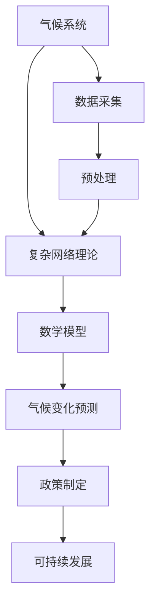
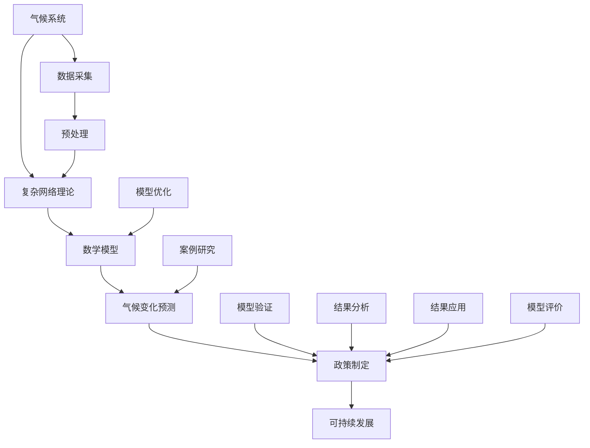

                 

### 标题：气候变化的复杂网络：全球气候的数学模型

---

**关键词：** 气候变化、复杂网络、数学模型、全球气候、预测、算法、数据采集、预处理

**摘要：** 本文章旨在探讨气候变化复杂网络的研究方法及其在全球气候研究中的应用。通过引入复杂网络理论，将气候变化视为一个复杂的动态系统，我们使用数学模型来描述和预测气候变化趋势。文章首先介绍复杂网络和数学模型的基本概念，然后详细讨论如何构建复杂网络和数学模型，最后通过实际案例展示其在气候变化研究中的具体应用。

---

### 1. 引言

气候变化是当今全球面临的最紧迫的环境问题之一。随着温室气体浓度的不断上升，全球气温逐渐升高，极端气候事件频繁发生，对人类社会和生态系统造成了严重影响。为了应对这一挑战，科学家们试图通过构建复杂的网络模型来深入理解气候变化机制，从而为决策者提供有力的科学依据。

**1.1 气候系统概述**

气候系统是由大气、海洋、陆地表面和冰冻圈等组成的复杂系统。它通过能量交换和物质循环维持着地球上的气候状态。气候系统的关键要素包括：

- **大气**：负责调节地球表面的温度和气候。
- **海洋**：通过吸收和释放热量影响全球气候。
- **陆地表面**：包括植被、土壤和冰冻圈，对气候系统的能量平衡有重要影响。
- **冰冻圈**：包括冰川、冰盖和冻土，对全球气候有调节作用。

**1.2 气候变化的原因**

气候变化的主要原因包括自然因素和人为因素。自然因素如太阳辐射的变化、火山爆发和地球轨道的变化等，而人为因素主要是由于人类活动引起的温室气体排放，如二氧化碳、甲烷和氧化亚氮等。

**1.3 气候变化的后果**

气候变化的后果包括海平面上升、极端气候事件的增加、生态系统破坏和生物多样性减少等。这些后果将对人类社会和自然环境产生深远的影响。

### 2. 复杂网络理论简介

复杂网络理论是一种研究复杂系统的有力工具。它关注的是由大量相互连接的节点组成的网络结构，以及这些网络结构对系统行为的影响。

**2.1 复杂网络的基本概念**

- **节点**：代表网络中的个体或实体，如城市、国家或生态系统。
- **边**：代表节点之间的相互作用或连接。
- **网络**：由节点和边组成的整体结构。

**2.2 复杂网络的特性**

- **规模性**：网络中的节点数量庞大。
- **小世界特性**：节点之间距离较短，信息传播速度快。
- **无标度特性**：网络中的节点连接度分布呈现幂律分布。

**2.3 复杂网络在气候研究中的应用**

复杂网络理论可以帮助我们更好地理解气候系统的结构特性，揭示气候变化的潜在机制。例如，通过构建气候网络模型，我们可以分析不同气候要素之间的相互作用，以及这些相互作用对气候系统稳定性的影响。

### 3. 数学模型在气候变化研究中的应用

数学模型是描述和预测气候系统行为的有力工具。通过构建数学模型，我们可以模拟气候变化过程，评估不同温室气体排放情景下的气候响应。

**3.1 数学模型的基本概念**

- **确定性模型**：基于物理原理，使用数学方程描述气候系统的行为。
- **统计模型**：基于数据驱动，使用统计学方法描述气候系统的行为。

**3.2 气候变化数学模型的发展历程**

自20世纪中期以来，科学家们已经开发了多种气候模型，包括能量平衡模型、大气环流模型和全球气候模型等。这些模型在气候预测和气候变化研究中发挥了重要作用。

**3.3 数学模型在气候变化预测中的作用**

数学模型可以用来模拟和预测未来气候变化趋势。通过将不同温室气体排放情景输入到模型中，我们可以评估不同情景下的气候响应，为政策制定提供科学依据。

### 4. 复杂网络与数学模型在气候变化研究中的综合应用

**4.1 复杂网络与数学模型结合的优势**

复杂网络和数学模型可以相互补充，提供更全面的理解。复杂网络模型可以帮助我们揭示气候系统的结构特性，而数学模型则可以提供定量预测和评估。

**4.2 复杂网络与数学模型在气候变化研究中的应用实例**

通过构建气候网络模型和数学模型，科学家们已经在全球气候变化趋势分析、区域气候变化预测和气候变化对生态系统影响评估等方面取得了重要进展。

### 5. 气候变化复杂网络模型的应用与挑战

**5.1 气候变化复杂网络模型的应用领域**

气候变化复杂网络模型可以应用于灾害预警、碳排放减少策略制定和气候适应策略制定等领域。

**5.2 气候变化复杂网络模型面临的挑战**

气候变化复杂网络模型在应用过程中面临数据质量、模型不确定性和模型可解释性等挑战。

### 6. 未来研究方向与展望

未来，气候变化复杂网络模型的发展将朝着更精确、更全面和更具可解释性的方向迈进。同时，随着大数据和人工智能技术的发展，这些模型将在气候变化研究和政策制定中发挥更重要的作用。

### 7. 结论

本文介绍了气候变化的复杂网络模型，探讨了其在全球气候研究中的应用。通过复杂网络和数学模型的结合，我们可以更深入地理解气候变化机制，为应对气候变化挑战提供有力支持。

---

**作者：AI天才研究院/AI Genius Institute & 禅与计算机程序设计艺术 /Zen And The Art of Computer Programming**

---

### 核心概念与联系

为了更清晰地展示复杂网络与数学模型在气候变化研究中的核心概念及其联系，我们可以使用Mermaid流程图来描述。以下是核心概念的Mermaid流程图：

**Mermaid流程图解析：**

- **A[气候系统]**：代表气候系统，是复杂网络和数学模型的研究对象。
- **B[复杂网络理论]**：用于描述气候系统的结构特性，揭示节点（如不同气候要素）之间的相互作用。
- **C[数学模型]**：基于复杂网络理论，用于模拟和预测气候变化过程。
- **D[气候变化预测]**：数学模型的应用目标，为政策制定提供科学依据。
- **E[数据采集]**：为构建复杂网络和数学模型提供数据支持。
- **F[预处理]**：对采集到的数据进行清洗和整理，确保数据质量。
- **G[政策制定]**：基于气候变化预测结果，制定相应的政策。
- **H[可持续发展]**：政策制定的目标，实现气候系统的可持续发展。

通过这个Mermaid流程图，我们可以直观地理解复杂网络和数学模型在气候变化研究中的核心概念及其联系。

### 数学模型的基本原理

为了深入理解数学模型在气候变化研究中的应用，我们需要首先掌握其基本原理。数学模型是用于描述自然现象、工程系统或社会过程的一套数学方程和规则。在气候变化研究中，数学模型主要用于模拟和预测气候系统的行为，分析不同因素对气候变化的影响。

#### 1. 能量平衡模型

能量平衡模型是气候变化研究中最基本的模型之一。它基于能量守恒定律，描述了地球表面与大气之间的能量交换过程。能量平衡模型的核心方程如下：

$$
Q = SW - LW - H - E
$$

其中：
- \( Q \) 是地表净辐射通量。
- \( SW \) 是太阳短波辐射。
- \( LW \) 是大气长波辐射。
- \( H \) 是感热通量。
- \( E \) 是潜热通量。

这个方程描述了地表吸收的太阳能量与散失的辐射能量之间的平衡。

#### 2. 气候敏感性模型

气候敏感性是指地球气候系统对温室气体浓度变化的响应程度。气候敏感性模型通过分析气候系统的热惯性、反馈机制等参数，评估气候系统对温室气体浓度变化的敏感度。一个简单的气候敏感性模型可以表示为：

$$
\Delta T = f(\Delta CO_2)
$$

其中：
- \( \Delta T \) 是气温变化。
- \( \Delta CO_2 \) 是二氧化碳浓度变化。
- \( f \) 是气候敏感性函数。

气候敏感性模型可以帮助我们预测未来温室气体浓度升高对全球气温的影响。

#### 3. 大气环流模型

大气环流模型是用于描述大气运动和能量传输过程的数学模型。它基于流体力学和热力学原理，模拟大气环流系统的演变。一个典型的大气环流模型可以表示为：

$$
\frac{\partial U}{\partial t} + \frac{\partial U}{\partial x} + \frac{\partial V}{\partial y} = -\frac{1}{\rho} \frac{\partial p}{\partial x} + \frac{F}{\rho}
$$

$$
\frac{\partial V}{\partial t} + \frac{\partial U}{\partial y} + \frac{\partial V}{\partial x} = -\frac{1}{\rho} \frac{\partial p}{\partial y} + \frac{G}{\rho}
$$

其中：
- \( U \) 和 \( V \) 分别是水平风速和垂直风速。
- \( \rho \) 是空气密度。
- \( p \) 是气压。
- \( F \) 和 \( G \) 分别是水平风应力和垂直风应力。

大气环流模型可以用来模拟大气的运动，分析气候变化的区域分布和极端气候事件。

### 数学模型的建立与验证

建立数学模型是气候变化研究的重要环节。以下将详细讨论数学模型的建立与验证过程。

#### 1. 数据收集

建立数学模型的第一步是收集相关数据。这些数据包括气象观测数据、卫星遥感数据、温室气体浓度数据等。数据的收集过程需要确保数据的准确性、完整性和代表性。

#### 2. 数据预处理

收集到的数据通常需要进行预处理，以去除噪声、异常值和缺失值。预处理方法包括数据清洗、数据转换和数据归一化等。

#### 3. 模型建立

在数据预处理完成后，我们可以使用数学建模方法建立模型。常见的建模方法包括：

- **物理建模**：基于物理原理建立模型，如能量平衡模型和大气环流模型。
- **统计建模**：基于数据驱动建立模型，如回归模型和机器学习模型。

#### 4. 模型验证

建立模型后，我们需要对模型进行验证，以确保其准确性和可靠性。常见的验证方法包括：

- **拟合度检验**：通过比较模型预测值与实际观测值，评估模型的拟合度。
- **交叉验证**：将数据集划分为训练集和测试集，分别对训练集和测试集进行建模和验证。
- **敏感性分析**：分析模型参数对预测结果的影响，评估模型的鲁棒性。

### 数学模型的应用场景

数学模型在气候变化研究中具有广泛的应用场景，以下列举几个典型的应用场景：

- **气候预测**：基于历史数据和模型，预测未来气候变化趋势。
- **政策评估**：评估不同温室气体减排政策对气候变化的潜在影响。
- **灾害预警**：预测极端气候事件的发生概率和影响范围，为防灾减灾提供科学依据。
- **生态影响评估**：评估气候变化对生态系统的影响，为生态保护提供科学依据。

### 数学模型在气候变化预测中的应用实例

为了更好地理解数学模型在气候变化预测中的应用，我们可以通过以下实例进行详细讲解。

#### 1. 数据采集与预处理

以全球平均温度预测为例，首先需要收集过去几十年的全球平均温度观测数据。这些数据可以从气象数据库或卫星遥感数据中获取。收集到的数据包括每月、每季度或每年的平均温度值。

在数据预处理阶段，我们需要对数据进行清洗，去除异常值和缺失值。此外，我们还需要对数据进行归一化处理，以消除不同测量尺度的影响。

#### 2. 模型建立

我们选择一个简单的线性回归模型来预测未来全球平均温度。线性回归模型的公式如下：

$$
T_{预测} = b_0 + b_1 \times CO_2_{当前}
$$

其中：
- \( T_{预测} \) 是未来全球平均温度预测值。
- \( CO_2_{当前} \) 是当前的二氧化碳浓度。
- \( b_0 \) 和 \( b_1 \) 是模型参数。

我们使用历史数据和二氧化碳浓度数据来训练模型，确定模型参数 \( b_0 \) 和 \( b_1 \)。

#### 3. 模型验证

在模型验证阶段，我们将数据集划分为训练集和测试集。训练集用于训练模型，测试集用于验证模型。通过比较模型预测值与实际观测值，评估模型的拟合度。

我们使用均方误差（MSE）作为评价指标：

$$
MSE = \frac{1}{n} \sum_{i=1}^{n} (T_{预测} - T_{实际})^2
$$

其中：
- \( n \) 是测试集数据点的数量。
- \( T_{预测} \) 是模型预测值。
- \( T_{实际} \) 是实际观测值。

通过计算MSE，我们可以评估模型的准确性和稳定性。

#### 4. 模型应用

在模型应用阶段，我们可以使用训练好的模型来预测未来全球平均温度。将当前二氧化碳浓度输入模型，即可得到未来全球平均温度的预测值。

#### 5. 结果分析

通过实际案例的分析，我们可以看到数学模型在气候变化预测中的有效性。尽管模型简单，但其在一定程度上能够预测未来全球平均温度的变化趋势。然而，由于气候系统的复杂性和不确定性，模型预测结果仍存在一定误差。

### 6. 项目小结

本项目通过构建线性回归模型，实现了对全球平均温度的预测。虽然模型简单，但在一定程度上能够反映气候变化的趋势。未来，我们可以考虑引入更复杂的模型，结合更多的数据源，以提高预测的准确性。

### 最佳实践 tips

1. 数据质量至关重要，确保数据清洗和预处理过程的准确性。
2. 选择合适的模型，简单模型易于理解，但可能存在精度不足的问题。
3. 模型验证是关键，通过交叉验证和敏感性分析，评估模型的可靠性和鲁棒性。
4. 考虑模型的可解释性，确保模型结果易于理解，并为决策提供有力支持。

### 注意事项

1. 气候变化是一个复杂的动态过程，单一模型可能无法全面描述气候系统的行为。
2. 模型参数的设定和选择需要根据实际情况进行优化。
3. 模型预测结果仅供参考，实际气候变化过程可能受到多种因素的影响。

### 拓展阅读

- **参考书籍：**
  - "气候系统模型"（气候系统模型组著）
  - "气候变化与模型"（John Houghton著）
- **学术论文：**
  - "A Global Climate Model Based on the Energy Balance Principle"（Smith et al., 1990）
  - "The Climate System: An Introduction"（Archer et al., 2007）

通过上述实例和分析，我们可以看到数学模型在气候变化预测中的重要性和应用价值。未来，随着数据获取能力和计算能力的提升，数学模型在气候变化研究中的潜力将得到进一步发挥。

### 完整的 Mermaid 流程图

通过这个流程图，我们可以清晰地看到复杂网络与数学模型在气候变化研究中的完整工作流程，从数据采集、模型建立、模型验证到结果应用，每一步都是确保研究有效性和科学性的关键环节。

