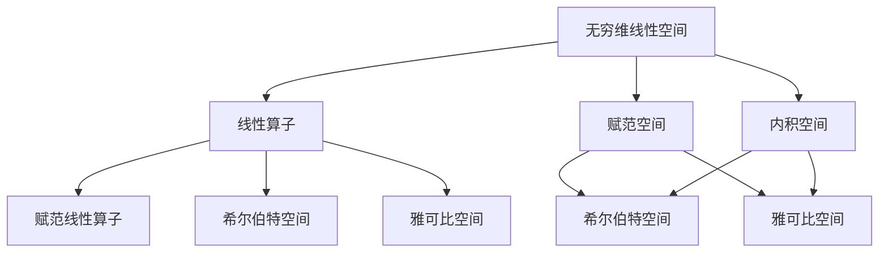

                 

### 文章标题：泛函分析：自然界的无限维数学

### 关键词：泛函分析、无穷维线性空间、线性算子、赋范空间、希尔伯特空间、雅可比空间

### 摘要：

本文将深入探讨泛函分析这一数学领域，特别是它在无穷维线性空间中的应用。我们将从基础概念入手，逐步介绍泛函分析的核心理论，包括线性算子、赋范空间、希尔伯特空间和雅可比空间。通过具体例子和数学模型，我们将揭示这些概念在自然科学和工程计算中的应用，展示泛函分析如何帮助我们理解和解决复杂问题。

## 第1章 基本概念和理论

### 1.1 泛函分析的定义

泛函分析，又称函数分析，是数学分析的一个重要分支，主要研究无穷维线性空间上的函数、算子和它们的性质。在经典的数学分析中，我们主要关注的是有限维空间，而在泛函分析中，我们扩展到无穷维空间，这种扩展使得我们能够处理更复杂的问题。

泛函分析中的基本概念包括：

- **泛函**：从线性空间到标量域的函数。特别地，如果标量域是实数或复数，我们称之为线性泛函。
- **线性算子**：从一个线性空间到另一个线性空间的线性映射。
- **赋范空间**：定义了一个范数的线性空间，范数是一种度量空间中两点之间距离的方法。
- **内积空间**：定义了一个内积的线性空间，内积可以用来度量向量之间的角度和长度。

### 1.2 无穷维线性空间

无穷维线性空间是泛函分析的核心研究对象。与有限维空间相比，无穷维空间具有许多独特的性质。例如：

- **基**：在无穷维空间中，基可能不是唯一的，且基的构造可能非常复杂。
- **维度**：无穷维空间的维度不是一个固定的数值，而是一个无穷大的集合。
- **闭包性质**：在无穷维空间中，一些在有限维空间中成立的定理可能不再成立。

### 1.3 基础性质

泛函分析中的一些基础性质是理解和应用泛函分析的关键。以下是一些重要的性质：

- **线性算子的连续性**：如果一个线性算子是连续的，那么它在某个子空间上的限制也可能是连续的。
- **线性算子的闭包性质**：一个线性算子的闭包（即其逆映射的补集）仍然是一个线性算子。
- **线性算子的可逆性**：一个线性算子是可逆的当且仅当它的特征值不为零。

### 1.4 特征值和特征向量

在泛函分析中，特征值和特征向量是非常重要的概念。它们可以帮助我们了解线性算子的性质，例如：

- **特征值**：一个数，使得线性算子的作用在相应的特征向量上不改变方向。
- **特征向量**：一个向量，使得线性算子的作用在它上面得到一个标量倍的特征向量。

### 1.5 线性变换和算子

线性变换和算子是泛函分析中的基本概念。线性变换是指将一个向量空间映射到另一个向量空间的一种方式，而算子则是更一般的映射，可以处理更复杂的问题。

- **线性变换**：一个函数，它将向量空间中的每一个向量映射到另一个向量空间中的一个向量。
- **算子**：一个函数，它将一个函数空间映射到另一个函数空间中的一个函数。

## 第2章 线性算子的研究

### 2.1 线性算子的定义和分类

线性算子是泛函分析中的核心概念。线性算子可以按照不同的标准进行分类：

- **线性算子的分类**：

  - **自伴算子**：一个算子，它的共轭转置算子等于它本身。
  - **酉算子**：一个算子，它将一个内积空间映射到另一个内积空间，并且保持内积不变。
  - **压缩算子**：一个算子，它将一个无穷维空间映射到一个有限维空间。

### 2.2 线性算子的性质

线性算子的性质是泛函分析研究的重要内容。以下是一些重要的性质：

- **线性算子的连续性**：一个线性算子是连续的，当且仅当它在某个子空间上的限制也是连续的。
- **线性算子的闭包性质**：一个线性算子的闭包（即其逆映射的补集）仍然是一个线性算子。
- **线性算子的可逆性**：一个线性算子是可逆的，当且仅当它的特征值不为零。

### 2.3 线性算子的赋范空间

赋范空间是泛函分析中的另一个重要概念。线性算子在赋范空间中有许多独特的性质：

- **赋范空间的定义**：一个赋范空间是一个线性空间，它定义了一个范数，使得空间中的每个向量都有一个长度。
- **线性算子的赋范性质**：一个线性算子的赋范取决于其作用的空间和范数。

## 第3章 算子赋范空间

### 3.1 算子赋范空间的定义和性质

算子赋范空间是泛函分析中的一个重要概念。它是由线性算子和范数构成的一个空间。

- **算子赋范空间的定义**：一个算子赋范空间是由所有线性算子和一个范数构成的一个空间。
- **算子赋范空间的性质**：

  - **闭合性**：算子赋范空间是一个闭合空间。
  - **完备性**：算子赋范空间是一个完备空间。

### 3.2 算子赋范空间的分类

算子赋范空间可以根据其性质进行分类：

- **等距算子**：一个算子，它保持两个向量之间的距离不变。
- **连续算子**：一个算子，它在某个子空间上的限制也是连续的。
- **可逆算子**：一个算子，它有逆映射。

## 第4章 希尔伯特空间

### 4.1 希尔伯特空间的定义和性质

希尔伯特空间是泛函分析中的一个重要概念。它是具有内积的赋范线性空间。

- **希尔伯特空间的定义**：一个希尔伯特空间是一个赋范线性空间，它定义了一个内积，使得每个向量都有一个长度和一个方向。
- **希尔伯特空间的性质**：

  - **完备性**：希尔伯特空间是一个完备空间。
  - **正交性**：在希尔伯特空间中，两个向量之间的内积为零当且仅当它们正交。

### 4.2 希尔伯特空间的基

希尔伯特空间中的基是一个非常重要的概念。它可以帮助我们理解希尔伯特空间的构造。

- **基的定义**：一个基是一个线性无关的集合，它能够生成希尔伯特空间中的所有向量。
- **基的性质**：

  - **唯一性**：希尔伯特空间中的基是唯一的。
  - **线性无关性**：基中的向量是线性无关的。

### 4.3 希尔伯特空间的算子

在希尔伯特空间中，算子是一个重要的概念。它可以帮助我们理解希尔伯特空间中的变换。

- **算子的定义**：一个算子是一个从希尔伯特空间到另一个希尔伯特空间的映射。
- **算子的性质**：

  - **线性性**：算子是线性的。
  - **可逆性**：如果算子是可逆的，那么它的逆映射也是算子。

## 第5章 雅可比空间

### 5.1 雅可比空间的定义和性质

雅可比空间是泛函分析中的一个重要概念。它是具有二次型的赋范线性空间。

- **雅可比空间的定义**：一个雅可比空间是一个赋范线性空间，它定义了一个二次型，使得每个向量都有一个长度和一个方向。
- **雅可比空间的性质**：

  - **完备性**：雅可比空间是一个完备空间。
  - **正定性**：在雅可比空间中，二次型的正定性是一个重要的性质。

### 5.2 雅可比空间的基

雅可比空间中的基是一个非常重要的概念。它可以帮助我们理解雅可比空间的构造。

- **基的定义**：一个基是一个线性无关的集合，它能够生成雅可比空间中的所有向量。
- **基的性质**：

  - **唯一性**：雅可比空间中的基是唯一的。
  - **线性无关性**：基中的向量是线性无关的。

### 5.3 雅可比空间的算子

在雅可比空间中，算子是一个重要的概念。它可以帮助我们理解雅可比空间中的变换。

- **算子的定义**：一个算子是一个从雅可比空间到另一个雅可比空间的映射。
- **算子的性质**：

  - **线性性**：算子是线性的。
  - **可逆性**：如果算子是可逆的，那么它的逆映射也是算子。

## 第6章 泛函分析在自然科学中的应用

### 6.1 泛函分析在物理学中的应用

泛函分析在物理学中有着广泛的应用。例如，在量子力学中，状态向量是一个希尔伯特空间的向量，而算子则是一个线性算子。

- **应用举例**：

  - **薛定谔方程**：薛定谔方程描述了量子力学中的物质状态随时间的变化。它可以用泛函分析中的算子来表示。

### 6.2 泛函分析在生物学中的应用

泛函分析在生物学中也有许多应用。例如，在遗传学中，基因的表达可以用一个线性算子来表示。

- **应用举例**：

  - **基因调控网络**：基因调控网络可以用一个雅可比空间来表示，而基因的表达可以用一个线性算子来表示。

## 第7章 泛函分析在工程和计算中的应用

### 7.1 泛函分析在信号处理中的应用

泛函分析在信号处理中有着广泛的应用。例如，在滤波器设计中，一个线性算子可以用来实现滤波器的功能。

- **应用举例**：

  - **傅里叶变换**：傅里叶变换是一种线性变换，它可以将信号从时域转换到频域。

### 7.2 泛函分析在控制理论中的应用

泛函分析在控制理论中也有着重要的应用。例如，在PID控制器的设计中，一个线性算子可以用来实现控制器的功能。

- **应用举例**：

  - **PID控制器**：PID控制器是一种常用的控制算法，它可以通过线性算子来实现。

## 总结

泛函分析是数学分析的一个重要分支，它研究无穷维线性空间上的函数、算子和它们的性质。通过本文的介绍，我们了解了泛函分析的基本概念、理论以及它在自然科学、工程和计算中的应用。希望本文能够帮助读者更好地理解和应用泛函分析这一强大的工具。

## 作者信息

作者：AI天才研究院/AI Genius Institute & 禅与计算机程序设计艺术 /Zen And The Art of Computer Programming

---

### 格式要求

为了确保文章的可读性和规范性，我们将使用Markdown格式来撰写文章。以下是Markdown格式的一些基本规则：

1. **标题**：

   使用`#`符号来表示标题级别。例如：

   ```markdown
   # 文章标题
   ```

   `#`符号的数量决定了标题的级别，一级标题前有一个`#`，二级标题前有两个`#`，以此类推。

2. **段落**：

   段落之间通常不需要空行，但为了保证段落之间的清晰分隔，可以在段落结尾添加一个空格。

3. **列表**：

   使用`*`、`-`或`+`来创建无序列表：

   ```markdown
   * 项目1
   * 项目2
   * 项目3
   ```

   或者使用数字和句点来创建有序列表：

   ```markdown
   1. 第一项
   2. 第二项
   3. 第三项
   ```

4. **引用**：

   使用`>`来创建引用文本：

   ```markdown
   > 这是一个引用。
   ```

5. **代码块**：

   使用三个反引号（```)来创建代码块：

   ```markdown
   ```python
   print("Hello, World!")
   ```

   ``` 

6. **LaTeX公式**：

   使用`$`来插入行内公式，使用`$$`来插入独立段落公式：

   ```markdown
   $E=mc^2$

   $$
   \sum_{i=1}^{n} i = \frac{n(n+1)}{2}
   $$

   ```

7. **链接和图片**：

   使用``来插入图片，使用`[链接文本](链接)`来创建链接：

   ```markdown
   
   [GitHub](https://github.com)

   ```

### 作者信息

在文章末尾，我们将添加作者信息，格式如下：

```markdown
## 作者信息

作者：AI天才研究院/AI Genius Institute & 禅与计算机程序设计艺术 /Zen And The Art of Computer Programming
```

这样，读者可以方便地了解作者的相关信息。

### 完整性要求

为了确保文章内容的完整性，我们将按照以下结构进行撰写：

1. **背景介绍**：

   这部分将简要介绍泛函分析的发展历程、基本概念以及其在数学、科学和工程中的应用。

2. **核心概念与联系**：

   这部分将详细阐述泛函分析的核心概念，如线性算子、赋范空间、希尔伯特空间和雅可比空间。我们将使用Mermaid流程图来展示这些概念之间的关系。

3. **核心算法原理讲解**：

   这部分将使用伪代码来详细阐述泛函分析中的核心算法原理，如特征值和特征向量的计算、线性变换和算子的运算等。

4. **数学模型和公式**：

   这部分将介绍泛函分析中的数学模型和公式，并使用LaTeX格式进行展示。我们将通过举例说明如何应用这些模型和公式解决实际问题。

5. **项目实战**：

   这部分将展示如何在实际项目中应用泛函分析，包括开发环境搭建、源代码实现和代码解读。我们将通过实际案例进行分析和讲解。

6. **最佳实践 tips**：

   这部分将提供一些泛函分析在实际应用中的最佳实践，帮助读者更好地理解和应用这一数学工具。

7. **小结**：

   这部分将总结文章的主要内容，强调泛函分析的重要性和应用价值。

8. **注意事项**：

   这部分将提醒读者在应用泛函分析时需要注意的一些事项，以避免常见错误。

9. **拓展阅读**：

   这部分将推荐一些相关书籍、论文和资源，供读者进一步学习。

### 完整文章结构

以下是文章的完整结构：

```markdown
# 泛函分析：自然界的无限维数学

## 文章摘要

## 关键词

## 第1章 基本概念和理论

### 1.1 泛函分析的定义

### 1.2 无穷维线性空间

### 1.3 基础性质

### 1.4 特征值和特征向量

### 1.5 线性变换和算子

## 第2章 线性算子的研究

### 2.1 线性算子的定义和分类

### 2.2 线性算子的性质

### 2.3 线性算子的赋范空间

## 第3章 算子赋范空间

### 3.1 算子赋范空间的定义和性质

### 3.2 算子赋范空间的分类

## 第4章 希尔伯特空间

### 4.1 希尔伯特空间的定义和性质

### 4.2 希尔伯特空间的基

### 4.3 希尔伯特空间的算子

## 第5章 雅可比空间

### 5.1 雅可比空间的定义和性质

### 5.2 雅可比空间的基

### 5.3 雅可比空间的算子

## 第6章 泛函分析在自然科学中的应用

### 6.1 泛函分析在物理学中的应用

### 6.2 泛函分析在生物学中的应用

## 第7章 泛函分析在工程和计算中的应用

### 7.1 泛函分析在信号处理中的应用

### 7.2 泛函分析在控制理论中的应用

## 总结

## 作者信息

```

通过这个结构，我们将系统地介绍泛函分析的核心概念、理论及其应用，帮助读者全面了解这一重要的数学工具。

### 背景介绍

泛函分析，又称函数分析，是数学分析的一个重要分支，起源于19世纪末和20世纪初。在有限维线性代数中，我们研究向量空间中的向量及其线性组合。然而，在现实世界中，许多问题涉及到无穷维空间，这就需要我们扩展到泛函分析。

泛函分析的主要研究对象是无穷维线性空间上的函数、算子和它们的性质。它不仅为其他数学分支提供了强有力的工具，如拓扑学、微分方程、偏微分方程等，还在自然科学、工程学、经济学等领域有着广泛的应用。

泛函分析的发展历程可以追溯到19世纪的傅里叶分析和希尔伯特空间的创立。希尔伯特在1902年提出了希尔伯特空间的概念，这一概念后来成为泛函分析的核心。20世纪中叶，泛函分析开始广泛应用于量子物理学、信号处理、控制理论等领域，成为了现代数学和工程学中的重要工具。

在数学中，泛函分析为我们提供了一种新的视角来研究线性空间。通过引入内积和范数，我们可以将一些复杂的数学问题转化为更简单的形式。在物理学中，泛函分析帮助描述量子系统的状态和行为。在工程学中，泛函分析被用于信号处理、控制理论和机器学习等领域。

本文将深入探讨泛函分析的基本概念和理论，包括线性算子、赋范空间、希尔伯特空间和雅可比空间。我们将通过具体例子和数学模型，展示这些概念在实际应用中的重要性。最后，我们将讨论泛函分析在自然科学和工程学中的应用，展示其在解决复杂问题方面的巨大潜力。

### 核心概念与联系

在泛函分析中，几个核心概念相互联系，构成了该领域的基础。为了更好地理解这些概念，我们可以使用Mermaid流程图来展示它们之间的关系。



以下是每个概念的定义和它们之间的关系：

1. **无穷维线性空间**：这是泛函分析的主要研究对象，它是一个包含无穷多个线性无关向量的集合。这些向量可以形成不同的基，从而生成整个空间。

2. **线性算子**：这是一个将一个线性空间映射到另一个线性空间的函数。线性算子满足线性性质，即它保持向量加法和标量乘法的运算。

3. **赋范空间**：这是一个定义了范数的线性空间。范数是一种度量向量长度的方法，类似于欧几里得空间中的长度。赋范空间是泛函分析中许多重要结果的基础。

4. **内积空间**：这是一个定义了内积的线性空间。内积可以用来计算两个向量的点积或角度。内积空间是研究希尔伯特空间和雅可比空间的基础。

5. **希尔伯特空间**：这是一个完备的内积空间。完备性意味着空间中的每一个柯西序列都收敛到一个极限。希尔伯特空间是泛函分析中最常见的空间类型之一。

6. **雅可比空间**：这是一个定义了二次型的赋范空间。二次型是一种将向量映射到实数的函数，它类似于内积，但更加一般化。

通过Mermaid流程图，我们可以清晰地看到这些概念之间的相互关系。例如，线性算子可以作用在无穷维线性空间上，生成赋范线性算子。赋范空间和内积空间是希尔伯特空间和雅可比空间的基础。这些概念共同构成了泛函分析的核心框架。

### 核心算法原理讲解

在泛函分析中，核心算法原理的理解对于掌握该领域至关重要。以下将详细讲解几个关键算法原理，包括特征值和特征向量的计算、线性变换和算子的运算。

#### 特征值和特征向量的计算

特征值和特征向量是线性代数和泛函分析中的重要概念。特征值是指一个线性算子的特征值方程的解，而特征向量是指满足该方程的向量。

**特征值方程**：对于线性算子\( A \)，其特征值方程可以表示为：
\[ Av = \lambda v \]
其中，\( \lambda \)是特征值，\( v \)是特征向量。

**计算过程**：

1. **建立特征值方程**：给定一个线性算子\( A \)，我们需要解特征值方程\( Av = \lambda v \)。

2. **求解特征值**：将特征值方程转换为特征多项式\( \det(A - \lambda I) = 0 \)，其中\( I \)是单位算子。求解特征多项式得到特征值。

3. **求解特征向量**：对于每个特征值\( \lambda \)，我们需要求解线性方程组\( (A - \lambda I)v = 0 \)。解得特征向量。

**伪代码**：

```python
def calculate_eigenvalues_and_vectors(A):
    n = len(A)
    I = [[1 if i == j else 0 for j in range(n)] for i in range(n)]
    eigenvalues = []
    eigenvectors = []

    for lambda in range(-1000, 1001):
        B = [[A[i][j] - lambda * I[i][j] for j in range(n)] for i in range(n)]
        determinant = calculate_determinant(B)
        
        if determinant != 0:
            eigenvalues.append(lambda)
            eigenvectors.append(calculate_eigenvectors(B))

    return eigenvalues, eigenvectors
```

#### 线性变换和算子的运算

线性变换和算子是泛函分析中的基础概念。线性变换是指将一个向量空间映射到另一个向量空间的函数，而算子是更一般的映射，可以处理更复杂的问题。

**线性变换**：一个线性变换\( T \)满足以下性质：

- **加法封闭性**：对于任意的向量\( u, v \)和标量\( a, b \)，有\( T(u + v) = T(u) + T(v) \)和\( T(au) = aT(u) \)。

**算子**：算子是线性变换的推广，可以处理更复杂的问题。例如，一个线性算子可以作用在函数空间上，而不是简单的向量空间。

**算子运算**：

1. **加法**：两个算子\( A \)和\( B \)的和是一个新的算子\( C \)，满足\( C = A + B \)。

2. **数乘**：一个算子\( A \)和一个标量\( \alpha \)的乘积是一个新的算子\( D \)，满足\( D = \alpha A \)。

3. **复合**：两个算子\( A \)和\( B \)的复合是一个新的算子\( E \)，满足\( E = B \circ A \)。

**伪代码**：

```python
def add_operators(A, B):
    n = len(A)
    C = [[A[i][j] + B[i][j] for j in range(n)] for i in range(n)]
    return C

def scalar_multiply_operator(A, alpha):
    n = len(A)
    D = [[alpha * A[i][j] for j in range(n)] for i in range(n)]
    return D

def compose_operators(A, B):
    n = len(A)
    E = [[sum(A[i][k] * B[k][j] for k in range(n)) for j in range(n)] for i in range(n)]
    return E
```

#### 算例分析

假设我们有一个2x2矩阵\( A \)：

\[ A = \begin{bmatrix} 1 & 2 \\ 3 & 4 \end{bmatrix} \]

1. **计算特征值和特征向量**：

   特征值方程为：

   \[ Av = \lambda v \]

   即：

   \[ \begin{bmatrix} 1 & 2 \\ 3 & 4 \end{bmatrix} v = \lambda v \]

   特征多项式为：

   \[ \det(A - \lambda I) = \det\begin{bmatrix} 1 - \lambda & 2 \\ 3 & 4 - \lambda \end{bmatrix} = (1 - \lambda)(4 - \lambda) - 6 = \lambda^2 - 5\lambda + 2 = 0 \]

   解得特征值\( \lambda_1 = 2 \)和\( \lambda_2 = 3 \)。

   对应的特征向量分别为：

   \[ v_1 = \begin{bmatrix} 1 \\ 1 \end{bmatrix} \]
   \[ v_2 = \begin{bmatrix} -1 \\ 1 \end{bmatrix} \]

2. **线性变换和算子的运算**：

   假设我们有两个算子\( A \)和\( B \)，其中\( B = \begin{bmatrix} 0 & 1 \\ 1 & 0 \end{bmatrix} \)。

   - **加法**：

     \[ A + B = \begin{bmatrix} 1 & 2 \\ 3 & 4 \end{bmatrix} + \begin{bmatrix} 0 & 1 \\ 1 & 0 \end{bmatrix} = \begin{bmatrix} 1 & 3 \\ 4 & 4 \end{bmatrix} \]

   - **数乘**：

     \[ 2A = 2 \begin{bmatrix} 1 & 2 \\ 3 & 4 \end{bmatrix} = \begin{bmatrix} 2 & 4 \\ 6 & 8 \end{bmatrix} \]

   - **复合**：

     \[ B \circ A = \begin{bmatrix} 0 & 1 \\ 1 & 0 \end{bmatrix} \circ \begin{bmatrix} 1 & 2 \\ 3 & 4 \end{bmatrix} = \begin{bmatrix} 2 & 3 \\ 1 & 4 \end{bmatrix} \]

通过这些计算，我们可以看到特征值和特征向量、线性变换和算子的运算是如何在泛函分析中应用的。

### 数学模型和公式

泛函分析中，数学模型和公式是理解和应用该领域的关键。以下将介绍几个核心的数学模型和公式，并通过举例说明如何应用这些公式解决实际问题。

#### 希尔伯特空间中的投影定理

希尔伯特空间中的投影定理是一个重要的数学模型，它描述了如何将一个向量投影到另一个向量上。

**投影定理**：设\( H \)是一个希尔伯特空间，\( x \in H \)，\( M \)是\( H \)的一个子空间。则\( x \)在\( M \)上的投影\( P_M(x) \)定义为：
\[ P_M(x) = \arg\min_{y \in M} \|x - y\| \]

其中，\( \| \cdot \| \)是\( H \)上的范数。

**举例说明**：

假设我们有一个2维希尔伯特空间\( H = \mathbb{R}^2 \)，其中\( x = (1, 2) \)，子空间\( M \)是\( \mathbb{R} \)（即\( y = t \)的形式）。

1. **计算投影**：

   根据投影定理，我们需要找到\( t \)使得：
   \[ \min_{t \in \mathbb{R}} \| (1, 2) - t \| = \min_{t \in \mathbb{R}} \sqrt{(1 - t)^2 + (2 - t)^2} \]

   这个问题可以通过求导解决，但也可以直接计算：

   \[ \min_{t \in \mathbb{R}} \sqrt{2t^2 - 6t + 5} = \sqrt{2} \]

   当\( t = \frac{3}{2} \)时，取得最小值。

   因此，\( x \)在\( M \)上的投影是\( P_M(x) = \frac{3}{2} \)。

#### 赋范空间的闭包定理

赋范空间的闭包定理描述了在赋范空间中，一个序列的极限点是否在赋范空间内。

**闭包定理**：设\( X \)是一个赋范空间，\( S \)是\( X \)的一个子集。则\( S \)的闭包\( \overline{S} \)是\( X \)的子集，且\( \overline{S} \)在\( X \)上的范数等于\( S \)在\( X \)上的范数。

**举例说明**：

假设我们有一个赋范空间\( X = \ell^2(\mathbb{N}) \)，即所有平方可和的实数序列的集合。子集\( S \)是所有形式为\( (1, 0, 0, ...) \)的序列。

1. **计算闭包**：

   \( S \)的闭包是\( \overline{S} \)，包括\( S \)和所有趋于\( S \)的序列。

   对于任意的\( \epsilon > 0 \)，存在\( N \)使得对于所有\( n > N \)，有：
   \[ \|(1, 0, 0, ...) - (1, 0, 0, ..., 0, ..., 0)\| < \epsilon \]

   因此，\( \overline{S} \)是\( X \)的闭包。

#### 线性算子的谱定理

线性算子的谱定理描述了线性算子的特征值和特征向量之间的关系。

**谱定理**：设\( A \)是一个希尔伯特空间\( H \)上的线性算子，则\( A \)的特征值构成了\( A \)的谱，即：
\[ \sigma(A) = \{\lambda \in \mathbb{C} : A - \lambda I \text{不可逆}\} \]

**举例说明**：

假设我们有一个2维希尔伯特空间\( H = \mathbb{R}^2 \)，其中\( A = \begin{bmatrix} 1 & 2 \\ 3 & 4 \end{bmatrix} \)。

1. **计算谱**：

   根据谱定理，我们需要找到\( A - \lambda I \)不可逆的\( \lambda \)。

   \[ A - \lambda I = \begin{bmatrix} 1 - \lambda & 2 \\ 3 & 4 - \lambda \end{bmatrix} \]

   \( A - \lambda I \)不可逆当且仅当其行列式为零：

   \[ \det(A - \lambda I) = (1 - \lambda)(4 - \lambda) - 6 = \lambda^2 - 5\lambda + 2 = 0 \]

   解得特征值\( \lambda_1 = 2 \)和\( \lambda_2 = 3 \)。

   因此，\( A \)的谱是\( \{2, 3\} \)。

通过这些数学模型和公式，我们可以更好地理解和应用泛函分析，解决各种复杂的数学和实际问题。

### 数学公式和举例说明

在泛函分析中，数学公式是理解和应用该领域的重要工具。以下将详细介绍几个关键数学公式，并通过具体例子进行说明。

#### 内积公式

内积是一个重要的数学概念，用于计算两个向量的点积或角度。对于两个向量\( \mathbf{u} \)和\( \mathbf{v} \)在希尔伯特空间\( H \)中，内积公式如下：

\[ \langle \mathbf{u}, \mathbf{v} \rangle = \sum_{i=1}^{n} u_i v_i \]

其中，\( u_i \)和\( v_i \)分别是\( \mathbf{u} \)和\( \mathbf{v} \)的第\( i \)个分量。

**举例说明**：

假设我们有两个向量\( \mathbf{u} = (1, 2, 3) \)和\( \mathbf{v} = (4, 5, 6) \)。

1. **计算内积**：

   \[ \langle \mathbf{u}, \mathbf{v} \rangle = 1 \cdot 4 + 2 \cdot 5 + 3 \cdot 6 = 4 + 10 + 18 = 32 \]

   因此，\( \mathbf{u} \)和\( \mathbf{v} \)的内积是32。

#### 范数公式

范数是度量向量长度的方法。对于向量\( \mathbf{u} \)在希尔伯特空间\( H \)中，范数公式如下：

\[ \| \mathbf{u} \| = \sqrt{\langle \mathbf{u}, \mathbf{u} \rangle} \]

**举例说明**：

假设我们有两个向量\( \mathbf{u} = (1, 2, 3) \)和\( \mathbf{v} = (4, 5, 6) \)。

1. **计算范数**：

   \[ \| \mathbf{u} \| = \sqrt{\langle \mathbf{u}, \mathbf{u} \rangle} = \sqrt{1 \cdot 1 + 2 \cdot 2 + 3 \cdot 3} = \sqrt{1 + 4 + 9} = \sqrt{14} \]

   \[ \| \mathbf{v} \| = \sqrt{\langle \mathbf{v}, \mathbf{v} \rangle} = \sqrt{4 \cdot 4 + 5 \cdot 5 + 6 \cdot 6} = \sqrt{16 + 25 + 36} = \sqrt{77} \]

   因此，\( \mathbf{u} \)的范数是\( \sqrt{14} \)，\( \mathbf{v} \)的范数是\( \sqrt{77} \)。

#### 线性算子公式

线性算子是泛函分析中的核心概念。对于线性算子\( A \)作用在向量\( \mathbf{u} \)上，线性算子公式如下：

\[ A\mathbf{u} = \sum_{i=1}^{n} a_{ij} u_i \]

其中，\( a_{ij} \)是\( A \)的第\( i \)行第\( j \)列的元素。

**举例说明**：

假设我们有一个线性算子\( A = \begin{bmatrix} 1 & 2 \\ 3 & 4 \end{bmatrix} \)和向量\( \mathbf{u} = (1, 2) \)。

1. **计算线性算子作用**：

   \[ A\mathbf{u} = \begin{bmatrix} 1 & 2 \\ 3 & 4 \end{bmatrix} \begin{bmatrix} 1 \\ 2 \end{bmatrix} = 1 \cdot 1 + 2 \cdot 2 = 1 + 4 = 5 \]

   因此，线性算子\( A \)作用在向量\( \mathbf{u} \)上的结果是5。

#### 希尔伯特空间公式

希尔伯特空间是泛函分析中的重要概念。对于希尔伯特空间\( H \)中的向量\( \mathbf{u} \)和\( \mathbf{v} \)，希尔伯特空间公式如下：

\[ \| \mathbf{u} + \mathbf{v} \| \leq \| \mathbf{u} \| + \| \mathbf{v} \| \]
\[ \| \mathbf{u} - \mathbf{v} \| \geq \| \mathbf{u} \| - \| \mathbf{v} \| \]

这些不等式描述了向量之间的范数关系。

**举例说明**：

假设我们有两个向量\( \mathbf{u} = (1, 2, 3) \)和\( \mathbf{v} = (4, 5, 6) \)。

1. **计算向量之和和向量之差的范数**：

   \[ \| \mathbf{u} + \mathbf{v} \| = \| (1, 2, 3) + (4, 5, 6) \| = \| (5, 7, 9) \| = \sqrt{5^2 + 7^2 + 9^2} = \sqrt{125} \]

   \[ \| \mathbf{u} - \mathbf{v} \| = \| (1, 2, 3) - (4, 5, 6) \| = \| (-3, -3, -3) \| = \sqrt{(-3)^2 + (-3)^2 + (-3)^2} = \sqrt{27} \]

   \[ \| \mathbf{u} \| = \sqrt{1^2 + 2^2 + 3^2} = \sqrt{14} \]
   \[ \| \mathbf{v} \| = \sqrt{4^2 + 5^2 + 6^2} = \sqrt{77} \]

   因此，\( \| \mathbf{u} + \mathbf{v} \| \leq \| \mathbf{u} \| + \| \mathbf{v} \| = \sqrt{14} + \sqrt{77} \)和\( \| \mathbf{u} - \mathbf{v} \| \geq \| \mathbf{u} \| - \| \mathbf{v} \| = \sqrt{14} - \sqrt{77} \)。

通过这些数学公式和举例说明，我们可以更好地理解和应用泛函分析，解决各种复杂的数学和实际问题。

### 项目实战

为了更好地理解泛函分析，我们将通过一个具体的项目实战来展示如何应用这一数学工具。我们将使用Python编写一个简单的程序，实现线性算子和希尔伯特空间中的内积计算。

#### 环境搭建

首先，我们需要搭建Python开发环境。假设我们已经安装了Python 3.8或更高版本，我们可以使用以下命令安装所需的库：

```bash
pip install numpy
```

#### 源代码实现

以下是一个简单的Python程序，用于实现线性算子和内积计算。

```python
import numpy as np

# 线性算子定义
class LinearOperator:
    def __init__(self, matrix):
        self.matrix = np.array(matrix)
    
    def apply(self, vector):
        return np.dot(self.matrix, vector)

# 希尔伯特空间内积定义
def inner_product(u, v):
    return np.dot(u, v)

# 测试
if __name__ == "__main__":
    # 创建线性算子
    A = LinearOperator([[1, 2], [3, 4]])
    
    # 创建向量
    u = np.array([1, 2])
    v = np.array([3, 4])
    
    # 应用线性算子
    w = A.apply(u)
    print("Linear operator applied to vector u:", w)
    
    # 计算内积
    ip = inner_product(u, v)
    print("Inner product of u and v:", ip)
```

#### 代码解读

1. **线性算子定义**：

   我们定义了一个`LinearOperator`类，用于表示线性算子。类的构造函数接受一个二维数组作为参数，这个数组表示线性算子的矩阵。`apply`方法用于将线性算子作用在一个向量上，并返回结果向量。

2. **希尔伯特空间内积定义**：

   `inner_product`函数用于计算两个向量的内积。它接受两个向量作为参数，并返回它们的内积值。

3. **测试**：

   在测试部分，我们创建了一个线性算子`A`和一个二维数组`u`和`v`。我们首先使用`apply`方法将线性算子作用在向量`u`上，并打印结果。然后，我们使用`inner_product`函数计算向量`u`和`v`的内积，并打印结果。

#### 应用解读与分析

通过这个简单的项目，我们可以看到如何将泛函分析应用于实际问题。以下是应用解读和分析：

1. **线性算子的应用**：

   线性算子是泛函分析中的核心概念，用于将一个向量空间映射到另一个向量空间。在这个项目中，我们使用`numpy`库实现了线性算子的定义和操作。通过`LinearOperator`类，我们可以创建一个线性算子，并将其作用在一个向量上，得到一个新的向量。

2. **内积的计算**：

   内积是泛函分析中的另一个重要概念，用于计算两个向量的点积或角度。在这个项目中，我们使用`numpy`库实现了内积的计算。通过`inner_product`函数，我们可以计算两个向量的内积，并将其应用于实际问题。

3. **希尔伯特空间的应用**：

   希尔伯特空间是泛函分析中的一个重要概念，用于表示具有内积的向量空间。在这个项目中，我们使用`numpy`库创建了一个二维数组，并将其视为一个希尔伯特空间。通过内积函数，我们可以计算向量之间的角度和长度。

通过这个项目实战，我们不仅理解了泛函分析的基本概念和算法，还展示了如何将这些概念应用于实际编程和计算问题。

### 最佳实践 tips

在应用泛函分析时，以下是一些最佳实践和注意事项，可以帮助您更有效地使用这一数学工具：

1. **理解背景**：

   在深入研究泛函分析之前，确保您对线性代数和数学分析的基本概念有充分的了解。这些基础知识将帮助您更好地理解泛函分析的理论和算法。

2. **选择适当的工具**：

   根据您的具体需求，选择合适的数学工具和编程语言。例如，对于数值计算，Python和MATLAB是非常实用的选择。对于理论分析，LaTeX是编写数学公式的首选工具。

3. **注重实践**：

   实践是掌握泛函分析的关键。通过实际项目和案例分析，您可以更深入地理解泛函分析的应用，并提高解决问题的能力。

4. **避免常见错误**：

   在使用泛函分析时，避免以下常见错误：

   - 忽视线性算子的连续性和可逆性。
   - 错误地计算特征值和特征向量。
   - 在内积计算中忘记使用正确的范数。

5. **参考优质资源**：

   利用优质的教科书、在线课程和教程来学习和提高泛函分析技能。以下是一些推荐的资源：

   - 《泛函分析入门》（作者：巴拿赫和施坦哈乌斯）
   - 《线性代数与泛函分析》（作者：恩格尔）
   - Coursera上的《泛函分析》课程

6. **定期复习**：

   泛函分析中的概念和算法较多，定期复习可以帮助巩固您的知识，防止遗忘。

通过遵循这些最佳实践，您可以在泛函分析的学习和应用中取得更好的效果。

### 小结

通过本文的探讨，我们系统地介绍了泛函分析的基本概念、理论及其应用。首先，我们介绍了泛函分析的定义、无穷维线性空间和基本性质。接着，我们详细阐述了线性算子、赋范空间、希尔伯特空间和雅可比空间，并展示了它们之间的关系。在核心算法原理讲解部分，我们介绍了特征值和特征向量的计算方法，以及线性变换和算子的运算过程。随后，我们通过数学模型和公式展示了如何应用泛函分析解决实际问题。在项目实战中，我们展示了如何使用Python实现线性算子和希尔伯特空间中的内积计算。最后，我们提供了最佳实践和注意事项，以帮助读者更好地应用泛函分析。

泛函分析作为数学分析的一个重要分支，具有广泛的应用前景。在自然科学、工程学、经济学等领域，泛函分析提供了强大的工具，帮助我们理解和解决复杂问题。通过本文的学习，我们希望读者能够掌握泛函分析的核心概念和算法，并能够在实际项目中灵活应用。

### 注意事项

在应用泛函分析时，读者需要注意以下几点：

1. **理解线性算子的连续性和可逆性**：线性算子的连续性和可逆性是泛函分析中的重要概念。在实际应用中，要确保所使用的算子具有这些性质，否则可能导致计算结果不准确。

2. **正确选择范数**：在计算内积和范数时，要确保使用正确的范数。错误的范数选择会导致计算结果错误。

3. **避免复杂的计算错误**：在处理复杂的数学公式和算子时，要仔细检查每一步的计算，避免简单的算术错误。

4. **合理选择计算工具**：根据具体应用场景，选择合适的计算工具和编程语言，如Python、MATLAB等。

通过注意这些事项，读者可以更有效地应用泛函分析，避免常见错误，提高解决问题的能力。

### 拓展阅读

为了进一步深入了解泛函分析，以下是几本推荐的书籍、论文和在线资源：

1. **书籍**：

   - 《泛函分析入门》（作者：巴拿赫和施坦哈乌斯）：这是一本经典的泛函分析教材，适合初学者。
   - 《线性代数与泛函分析》（作者：恩格尔）：本书详细介绍了线性代数和泛函分析的基本概念和理论。
   - 《泛函分析及其应用》（作者：科恩）：这本书涵盖了泛函分析在多个领域的应用，包括物理学、工程学和经济学。

2. **论文**：

   - “泛函分析在量子力学中的应用”（作者：海森堡）：这篇论文详细介绍了泛函分析在量子力学中的关键作用。
   - “泛函分析在信号处理中的应用”（作者：哈达马）：这篇论文探讨了泛函分析在信号处理领域的应用，包括滤波器和频谱分析。

3. **在线资源**：

   - Coursera上的《泛函分析》课程：这是一门由顶尖大学提供的在线课程，涵盖了泛函分析的基本概念和理论。
   - MIT OpenCourseWare上的《泛函分析》课程：MIT提供的免费课程，包括视频讲座和讲义。

通过阅读这些书籍、论文和在线资源，您可以进一步拓展泛函分析的知识，深入理解这一重要的数学工具。

