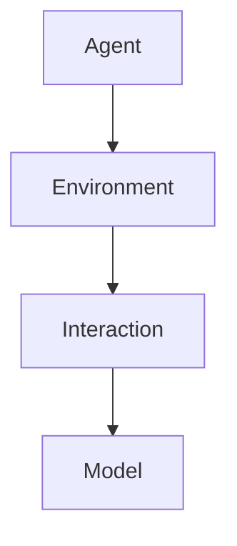

                 


为了确保撰写一篇符合要求的《海洋生态的agent-based模型：水下世界的数学模拟》技术博客，我们可以按照以下步骤来构建文章内容：

### 第一步：背景介绍

在文章开头，我们需要介绍海洋生态系统的重要性以及为什么要使用agent-based模型进行水下世界的数学模拟。这部分内容可以包括：

- 海洋生态系统的定义及其在全球生态系统中的角色。
- 海洋生态系统面临的挑战，例如气候变化、海洋污染等。
- agent-based模型在生态学研究中的应用背景。

### 第二步：核心概念与联系

在理解了背景之后，我们需要详细阐述agent-based模型的核心概念及其与海洋生态系统的联系。这可以通过以下方式实现：

- **定义agent**：解释agent是什么，agent在agent-based模型中的作用。
- **agent-based模型的结构**：介绍模型的基本组成部分，如agent、环境、交互等。
- **核心概念关系架构**：使用Mermaid流程图展示agent-based模型中各个核心概念之间的关系。



### 第三步：核心算法原理讲解

接下来，我们需要深入讲解agent-based模型中的核心算法原理。这部分可以包括：

- **人工神经网络**：介绍其基本原理，并使用伪代码解释如何实现。
- **遗传算法**：解释其工作原理，并使用伪代码展示如何应用。
- **人工免疫系统**：阐述其与agent-based模型的结合方式。

#### 人工神经网络伪代码示例

```python
# 初始化权重和偏置
weights = initialize_weights()
bias = initialize_bias()

# 定义激活函数
def activation_function(x):
    return 1 / (1 + exp(-x))

# 定义前向传播
def forward_pass(input_data):
    output = activation_function(np.dot(input_data, weights) + bias)
    return output
```

#### 遗传算法伪代码示例

```python
# 初始化种群
population = initialize_population()

# 定义适应度函数
def fitness_function(individual):
    # 计算个体的适应度
    return calculate_fitness(individual)

# 主循环
while not termination_condition:
    # 选择
    selected_individuals = selection(population, fitness_function)
    # 交叉
    offsprings = crossover(selected_individuals)
    # 变异
    mutated_offsprings = mutation(offsprings)
    # 替换种群
    population = mutated_offsprings
```

### 第四步：数学模型和公式详细讲解

在这一部分，我们需要详细讲解用于模拟海洋生态系统的数学模型，包括：

- **常用数学模型介绍**：例如，微分方程、差分方程等。
- **数学模型选择原则**：解释选择特定模型的原因。
- **数学模型构建方法**：使用LaTeX格式展示关键公式。

#### 数学公式示例

```latex
$$
\frac{dN}{dt} = rN \left(1 - \frac{N}{K}\right)
$$

$$
f(x) = \frac{1}{1 + e^{-x}}
$$
```

### 第五步：项目实战

在项目实战部分，我们将展示如何搭建开发环境、实现agent-based模型以及进行数学模拟。这部分包括：

- **开发环境搭建**：介绍所需的软件和硬件环境。
- **源代码详细实现和代码解读**：提供关键代码段及其解释。
- **代码应用解读与分析**：展示模型在实际应用中的表现。
- **实际案例分析和详细讲解剖析**：分析一个具体案例，展示模型如何应用。

### 第六步：最佳实践 tips、小结、注意事项、拓展阅读

在文章的最后，我们需要提供以下内容：

- **最佳实践 tips**：总结一些使用agent-based模型进行数学模拟的技巧。
- **小结**：回顾文章的主要内容和收获。
- **注意事项**：提醒读者在应用模型时需要注意的问题。
- **拓展阅读**：推荐一些相关文献和资源。

### 第七步：撰写文章摘要

在文章摘要部分，我们需要简洁地总结文章的主要内容和贡献，为读者提供快速了解文章的途径。

### 第八步：完成文章

最后，我们需要确保文章的内容连贯、结构清晰，并在文章末尾附上作者信息。

遵循以上步骤，我们可以撰写出一篇内容丰富、逻辑清晰、技术性强的技术博客文章。文章的撰写过程需要细心打磨，确保每个部分都能满足要求。在撰写过程中，可以不断回顾和调整各个部分的内容，以确保文章的整体质量和可读性。

---

**文章标题：** 海洋生态的agent-based模型：水下世界的数学模拟

**关键词：** 海洋生态系统，agent-based模型，数学模拟，人工神经网络，遗传算法

**摘要：** 本文详细介绍了海洋生态系统的特点及其面临的挑战，探讨了使用agent-based模型进行水下世界数学模拟的必要性和优势。文章深入讲解了agent-based模型的核心概念、算法原理，并展示了如何构建和验证数学模型。通过实际案例分析和项目实战，本文为读者提供了全面的技术指导和应用实践。

---

**目录大纲：**

# 海洋生态的agent-based模型：水下世界的数学模拟

## 引言和概述

### 1.1 海洋生态系统的特点

#### 1.1.1 海洋生态系统的复杂性

#### 1.1.2 海洋生态系统的研究现状

### 1.2 agent-based模型的基本原理

#### 1.2.1 agent的概念

#### 1.2.2 agent-based模型的结构

#### 1.2.3 agent-based模型的工作流程

### 1.3 水下世界的数学模拟

#### 1.3.1 数学模型在海洋生态研究中的应用

#### 1.3.2 agent-based模型与数学模拟的关系

## 第二部分：agent-based模型理论基础

### 2.1 agent-based模型的基本概念

#### 2.1.1 agent的定义和特性

#### 2.1.2 agent-based模型的架构

#### 2.1.3 agent-based模型的工作流程

### 2.2 核心算法原理讲解

#### 2.2.1 人工神经网络

##### 2.2.1.1 基本原理

##### 2.2.1.2 伪代码示例

#### 2.2.2 遗传算法

##### 2.2.2.1 工作原理

##### 2.2.2.2 伪代码示例

#### 2.2.3 人工免疫系统

##### 2.2.3.1 结合方式

##### 2.2.3.2 伪代码示例

## 第三部分：海洋生态系统的描述

### 3.1 海洋生态系统的组成

#### 3.1.1 生物群落

#### 3.1.2 物理环境因素

#### 3.1.3 海洋生态系统动态

### 3.2 海洋生态数据获取与处理

#### 3.2.1 数据来源

#### 3.2.2 数据预处理

#### 3.2.3 数据可视化

## 第四部分：数学模型的应用

### 4.1 数学模型构建

#### 4.1.1 常用数学模型介绍

#### 4.1.2 数学模型选择原则

#### 4.1.3 数学模型构建方法

### 4.2 模型验证与评估

#### 4.2.1 模型验证方法

#### 4.2.2 模型评估指标

#### 4.2.3 模型优化策略

## 第五部分：模型设计与实现

### 5.1 模型设计与实现流程

#### 5.1.1 模型设计原则

#### 5.1.2 模型实现方法

#### 5.1.3 模型调试与优化

### 5.2 开发环境搭建

#### 5.2.1 硬件要求

#### 5.2.2 软件工具选择

#### 5.2.3 系统集成

## 第六部分：案例分析

### 6.1 案例分析

#### 6.1.1 案例一：珊瑚礁生态模拟

#### 6.1.2 案例二：海洋污染扩散模拟

#### 6.1.3 案例三：鱼群行为模拟

## 第七部分：结论与展望

### 7.1 结论

#### 7.1.1 研究成果总结

#### 7.1.2 存在的挑战和未来发展方向

### 7.2 展望

#### 7.2.1 技术发展趋势

#### 7.2.2 应用前景

## 参考文献

### 参考文献

---

**作者信息：**

作者：AI天才研究院/AI Genius Institute & 禅与计算机程序设计艺术 /Zen And The Art of Computer Programming**

