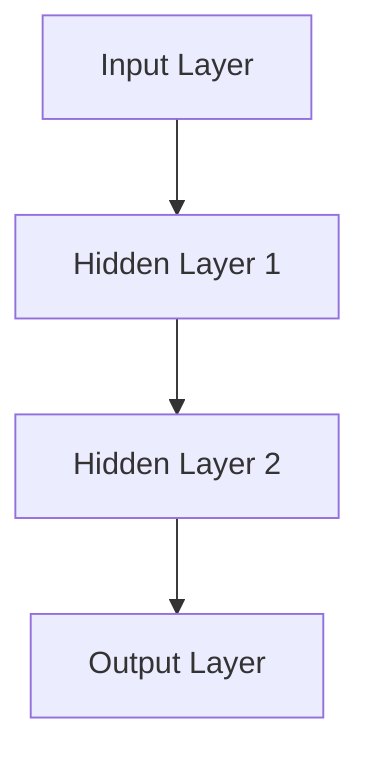
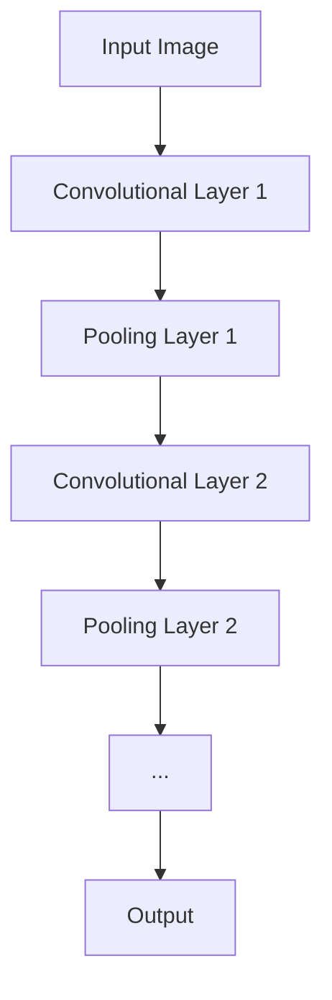
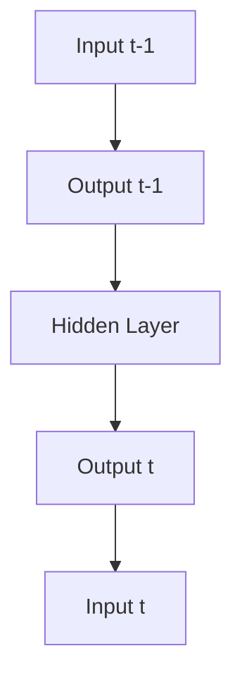
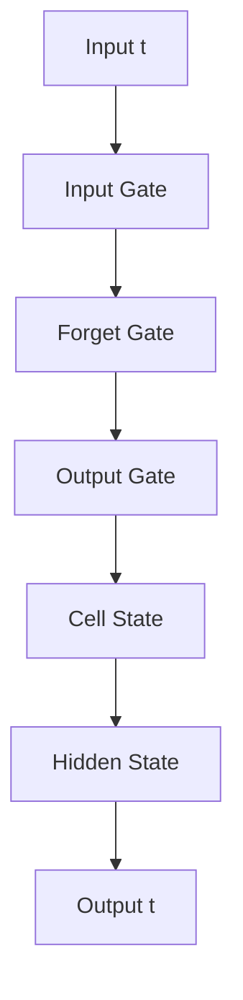
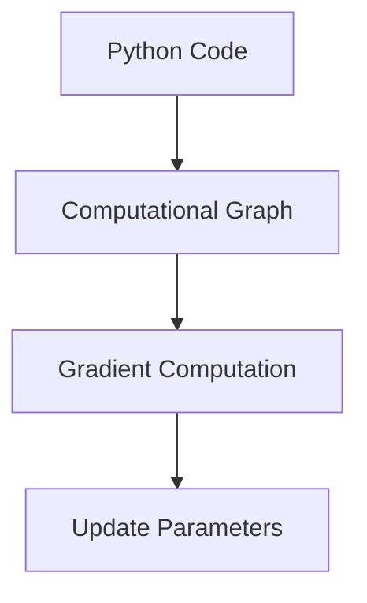

                 


### 文章标题

# 深度学习在科学理论构建中的应用：加速世界模型的形成

### 文章关键词

- 深度学习
- 科学理论
- 世界模型
- 人工智能
- 神经网络
- 计算机模拟

### 文章摘要

本文深入探讨了深度学习在科学理论构建中的应用，特别是在加速世界模型形成方面的贡献。通过分析深度学习的理论基础和算法原理，本文展示了如何利用深度学习构建复杂科学模型，并阐述了其在物理学、化学和生物学等领域的实际应用案例。此外，本文还探讨了深度学习在跨学科研究中的潜力，并提出了未来发展的方向。通过本文的探讨，我们希望为读者提供一个全面而深刻的理解，激发对深度学习与科学理论交叉领域的研究兴趣。

### 第一部分：深度学习基础理论

#### 第1章：深度学习的基本概念

##### 1.1 深度学习的起源与发展

深度学习（Deep Learning）是机器学习（Machine Learning）的一个分支，它通过模仿人脑的神经网络结构，使得计算机能够自动从大量数据中学习，从而实现智能化的决策和预测。深度学习的发展可以追溯到20世纪40年代，当时神经网络的初步概念被提出。然而，直到21世纪初，由于计算能力和数据资源的限制，深度学习的研究和应用受到了很大的限制。

随着计算能力的飞速提升和大数据时代的到来，深度学习迎来了新的发展机遇。2006年，加拿大科学家杰弗里·辛顿（Geoffrey Hinton）提出了深度信念网络（Deep Belief Network），这标志着深度学习理论的重大突破。随后，深度学习在图像识别、语音识别、自然语言处理等领域取得了显著的成果。

##### 1.2 深度学习的核心原理

深度学习的核心原理是多层神经网络（Multi-Layer Neural Networks），它通过逐层提取数据特征，实现从简单到复杂的信息处理。深度学习的训练过程主要包括以下几个步骤：

1. **数据预处理**：对输入数据进行标准化处理，使得不同特征具有相似的尺度。
2. **前向传播**：将输入数据通过网络的各个层进行传递，每一层都会对输入数据进行非线性变换。
3. **反向传播**：计算输出结果与实际结果之间的误差，通过反向传播算法更新网络的权重和偏置。
4. **优化过程**：使用优化算法（如梯度下降）迭代更新网络参数，使得误差逐渐减小。

深度学习的多层网络结构使得它能够处理高度非线性问题，从而在图像识别、语音识别等任务中表现出强大的能力。

##### 1.3 深度学习与传统机器学习的区别

传统机器学习主要依赖于手工程特征的设计，而深度学习通过自动提取特征，从而减少了人工干预。以下是对两者主要区别的简要概述：

- **特征提取**：传统机器学习需要手动设计特征，而深度学习能够自动从数据中学习特征。
- **数据需求**：传统机器学习对数据量要求不高，而深度学习需要大量的数据来训练模型。
- **复杂性**：传统机器学习模型结构相对简单，而深度学习模型具有多层结构，更加复杂。
- **泛化能力**：深度学习模型通常具有更好的泛化能力，能够在不同数据集上表现出色。

### 第2章：深度学习模型

##### 2.1 神经网络

神经网络（Neural Networks）是深度学习的基础。一个简单的神经网络包括输入层、隐藏层和输出层。每个层由多个神经元组成，神经元之间通过权重连接。神经元的输出是一个非线性函数，如sigmoid、ReLU或Tanh。



神经网络通过前向传播和反向传播算法进行训练。前向传播过程中，输入数据经过网络的逐层计算，最终得到输出。反向传播过程中，通过计算输出误差，更新网络权重和偏置，使得网络逐步逼近正确答案。

##### 2.2 卷积神经网络（CNN）

卷积神经网络（Convolutional Neural Networks，CNN）是一种特别适合处理图像数据的深度学习模型。CNN的核心是卷积层（Convolutional Layers），它通过卷积运算提取图像特征。



CNN的主要优势在于：

- **局部连接**：卷积层中的神经元仅与局部区域相连，减少了参数数量，提高了计算效率。
- **平移不变性**：卷积层通过滑动窗口提取特征，使得模型对图像的平移具有不变性。

##### 2.3 循环神经网络（RNN）与长短时记忆网络（LSTM）

循环神经网络（Recurrent Neural Networks，RNN）是一种处理序列数据的神经网络。与传统的前向神经网络不同，RNN具有循环结构，能够保存前一个时间步的输出作为当前时间步的输入。



然而，标准的RNN在处理长序列时存在梯度消失或爆炸问题。为了解决这一问题，长短时记忆网络（Long Short-Term Memory，LSTM）被提出。LSTM通过引入门控机制，能够有效地保持长期依赖信息。



##### 2.4 其他深度学习模型

除了上述提到的模型，还有许多其他类型的深度学习模型，如生成对抗网络（Generative Adversarial Networks，GAN）、自编码器（Autoencoders）等。这些模型在图像生成、异常检测等任务中表现出色。

### 第3章：深度学习框架

##### 3.1 TensorFlow

TensorFlow是一个开源的深度学习框架，由谷歌开发。它支持多种编程语言，包括Python、C++和Java。TensorFlow的主要特点包括：

- **动态计算图**：TensorFlow使用动态计算图，使得模型的构建和优化更加灵活。
- **高性能计算**：TensorFlow支持GPU和TPU加速，能够处理大规模数据和高性能计算需求。
- **广泛的应用场景**：TensorFlow广泛应用于图像识别、自然语言处理、推荐系统等领域。

##### 3.2 PyTorch

PyTorch是另一个流行的深度学习框架，由Facebook开发。它以其简洁和灵活著称，特别适合研究和发展新模型。



PyTorch的主要特点包括：

- **动态计算图**：PyTorch使用动态计算图，使得模型的构建和优化更加直观。
- **易于调试**：PyTorch支持自动微分和动态计算图，使得调试过程更加容易。
- **社区支持**：PyTorch拥有庞大的开发者社区，提供了丰富的资源和工具。

##### 3.3 其他深度学习框架

除了TensorFlow和PyTorch，还有其他一些深度学习框架，如Keras、Theano等。这些框架在特定应用场景中具有优势，例如Keras提供了简洁的API，Theano提供了高效的计算性能。

### 第4章：深度学习算法原理

##### 4.1 前向传播与反向传播

深度学习算法的核心是前向传播和反向传播。前向传播是将输入数据通过网络的各个层进行传递，每一层都会对输入数据进行非线性变换。反向传播则是通过计算输出结果与实际结果之间的误差，更新网络的权重和偏置。

**前向传播伪代码：**

```python
# 输入数据
x = ...

# 初始化网络权重和偏置
W, b = ...

# 前向传播计算
for layer in network:
    z = W * x + b
    a = activation(z)

    # 传递到下一层
    x = a
```

**反向传播伪代码：**

```python
# 输入数据
x = ...

# 初始化网络权重和偏置
W, b = ...

# 前向传播计算
for layer in network:
    z = W * x + b
    a = activation(z)

    # 传递到下一层
    x = a

# 反向传播计算
for layer in reversed(network):
    delta = ...
    dW = ...
    db = ...

    # 更新权重和偏置
    W -= learning_rate * dW
    b -= learning_rate * db
```

##### 4.2 损失函数与优化算法

损失函数用于衡量模型预测值与实际值之间的差距。常见的损失函数包括均方误差（MSE）、交叉熵等。

**均方误差（MSE）公式：**

$$
MSE = \frac{1}{n}\sum_{i=1}^{n}(y_i - \hat{y}_i)^2
$$

其中，$y_i$是实际值，$\hat{y}_i$是预测值。

优化算法用于更新网络参数，以最小化损失函数。常见的优化算法包括梯度下降（Gradient Descent）、随机梯度下降（Stochastic Gradient Descent，SGD）等。

**梯度下降伪代码：**

```python
# 初始化网络权重和偏置
W, b = ...

# 计算损失函数梯度
dW, db = ...

# 更新网络权重和偏置
W -= learning_rate * dW
b -= learning_rate * db
```

##### 4.3 网络正则化方法

为了防止模型过拟合，常用的正则化方法包括L1正则化、L2正则化等。

**L1正则化公式：**

$$
\lambda \|W\|
$$

其中，$\lambda$是正则化参数，$W$是权重矩阵。

**L2正则化公式：**

$$
\lambda \|W\|^2
$$

正则化方法通过在损失函数中添加正则化项，使得模型在训练过程中关注泛化能力，而不是仅仅追求最小化训练误差。

### 第5章：深度学习在物理学中的应用

##### 5.1 深度学习在量子力学中的应用

深度学习在量子力学中的应用主要集中在量子态表示、量子模拟和量子计算等领域。例如，变分自动编码器（Variational Autoencoder，VAE）被用于量子态的表示，而量子神经网络（Quantum Neural Networks，QNN）则被用于量子计算。

**量子态表示伪代码：**

```python
# 输入量子态
quantum_state = ...

# 初始化变分自动编码器
encoder, decoder = ...

# 编码
encoded_state = encoder(quantum_state)

# 解码
reconstructed_state = decoder(encoded_state)
```

##### 5.2 深度学习在经典力学中的应用

深度学习在经典力学中的应用包括物理系统的建模和预测。例如，通过训练深度神经网络，可以模拟行星运动、分子动力学等物理过程。

**分子动力学模拟伪代码：**

```python
# 初始化系统
particles, forces = ...

# 初始化深度神经网络
model = ...

# 训练模型
model.fit(particles, forces)

# 预测
predicted_forces = model.predict(particles)
```

##### 5.3 深度学习在宇宙学中的应用

深度学习在宇宙学中的应用包括宇宙大爆炸模拟、黑洞探测等。例如，通过卷积神经网络，可以识别宇宙微波背景辐射中的信号。

**宇宙微波背景辐射信号识别伪代码：**

```python
# 输入宇宙微波背景辐射数据
data = ...

# 初始化卷积神经网络
model = ...

# 训练模型
model.fit(data)

# 识别信号
signals = model.predict(data)
```

### 第6章：深度学习在化学中的应用

##### 6.1 深度学习在分子建模中的应用

深度学习在分子建模中的应用主要集中在分子结构预测、化学反应模拟等。例如，通过训练深度神经网络，可以预测分子的稳定性、反应路径等。

**分子结构预测伪代码：**

```python
# 输入分子数据
molecule_data = ...

# 初始化深度神经网络
model = ...

# 训练模型
model.fit(molecule_data)

# 预测分子稳定性
stability_scores = model.predict(molecule_data)
```

##### 6.2 深度学习在材料科学中的应用

深度学习在材料科学中的应用包括材料性能预测、材料结构设计等。例如，通过训练深度神经网络，可以预测材料的电导率、硬度等性能。

**材料性能预测伪代码：**

```python
# 输入材料数据
material_data = ...

# 初始化深度神经网络
model = ...

# 训练模型
model.fit(material_data)

# 预测材料性能
property_scores = model.predict(material_data)
```

##### 6.3 深度学习在药物设计中的应用

深度学习在药物设计中的应用包括药物分子生成、药物-靶标相互作用预测等。例如，通过训练深度神经网络，可以预测药物分子的活性。

**药物分子活性预测伪代码：**

```python
# 输入药物分子数据
drug_data = ...

# 初始化深度神经网络
model = ...

# 训练模型
model.fit(drug_data)

# 预测药物分子活性
activity_scores = model.predict(drug_data)
```

### 第7章：深度学习在生物学中的应用

##### 7.1 深度学习在基因组学中的应用

深度学习在基因组学中的应用包括基因组序列分析、基因功能预测等。例如，通过训练深度神经网络，可以预测基因的功能。

**基因功能预测伪代码：**

```python
# 输入基因组序列
genome_sequence = ...

# 初始化深度神经网络
model = ...

# 训练模型
model.fit(genome_sequence)

# 预测基因功能
gene_function_scores = model.predict(genome_sequence)
```

##### 7.2 深度学习在神经科学中的应用

深度学习在神经科学中的应用包括脑电图分析、神经元建模等。例如，通过训练深度神经网络，可以分析脑电图信号，识别神经元的活动模式。

**脑电图信号分析伪代码：**

```python
# 输入脑电图数据
EEG_data = ...

# 初始化深度神经网络
model = ...

# 训练模型
model.fit(EEG_data)

# 预测神经元活动
neuron_activity_scores = model.predict(EEG_data)
```

##### 7.3 深度学习在生态学中的应用

深度学习在生态学中的应用包括生物多样性分析、生态过程建模等。例如，通过训练深度神经网络，可以预测生态系统的变化趋势。

**生物多样性分析伪代码：**

```python
# 输入生物多样性数据
diversity_data = ...

# 初始化深度神经网络
model = ...

# 训练模型
model.fit(diversity_data)

# 预测生态系统变化
ecosystem_change_scores = model.predict(diversity_data)
```

### 第8章：深度学习在构建世界模型中的应用

##### 8.1 深度学习在科学理论探索中的作用

深度学习在科学理论探索中的应用主要体现在以下几个方面：

1. **数据驱动**：通过大量数据训练深度学习模型，探索科学规律和模式。
2. **知识发现**：从数据中提取有用信息，为科学理论提供新的启示。
3. **推理与预测**：利用深度学习模型进行科学推理和预测，指导实验设计。

##### 8.2 深度学习在科学理论验证中的应用

深度学习在科学理论验证中的应用主要包括：

1. **模型评估**：使用深度学习模型评估现有科学理论的准确性。
2. **数据拟合**：通过深度学习模型拟合实验数据，验证科学理论的预测能力。
3. **异常检测**：识别实验数据中的异常，为科学理论的验证提供新的思路。

##### 8.3 深度学习在科学理论创新中的应用

深度学习在科学理论创新中的应用主要体现在以下几个方面：

1. **理论拓展**：通过深度学习模型探索现有科学理论的边界，推动理论的发展。
2. **新理论发现**：从数据中提取新特征，为科学理论创新提供新的方向。
3. **跨学科融合**：深度学习与跨学科研究的融合，推动科学理论的创新发展。

### 第9章：世界模型的构建方法

##### 9.1 数据驱动的世界模型构建

数据驱动的世界模型构建是通过深度学习模型从数据中提取特征，构建能够描述世界规律的模型。以下是构建过程的主要步骤：

1. **数据采集**：收集大量相关数据，包括实验数据、观测数据等。
2. **数据预处理**：对数据进行清洗、归一化等处理，使其适合深度学习模型的训练。
3. **模型训练**：使用深度学习模型训练数据，提取特征并构建模型。
4. **模型评估**：评估模型在不同数据集上的表现，优化模型参数。

##### 9.2 知识驱动的世界模型构建

知识驱动的世界模型构建是在已有科学理论的基础上，通过深度学习模型融合数据与知识，构建更加准确和全面的世界模型。以下是构建过程的主要步骤：

1. **知识提取**：从已有科学理论中提取关键概念和规律。
2. **知识表示**：使用深度学习模型将知识表示为向量或图结构。
3. **知识融合**：将数据驱动的特征与知识表示进行融合，构建世界模型。
4. **模型优化**：通过迭代训练和优化，提高模型在数据与知识融合下的性能。

##### 9.3 数据与知识融合的世界模型构建

数据与知识融合的世界模型构建是将数据驱动和知识驱动的方法相结合，构建一个能够更好地描述世界规律的模型。以下是构建过程的主要步骤：

1. **数据预处理**：对数据进行清洗、归一化等处理，使其适合深度学习模型的训练。
2. **知识表示**：使用深度学习模型将知识表示为向量或图结构。
3. **特征融合**：将数据驱动的特征与知识表示进行融合，构建融合特征。
4. **模型训练**：使用融合特征训练深度学习模型，构建世界模型。
5. **模型评估**：评估模型在不同数据集上的表现，优化模型参数。

### 第10章：深度学习在跨学科研究中的应用

##### 10.1 深度学习在跨学科研究中的挑战

深度学习在跨学科研究中的应用面临着许多挑战，包括：

1. **数据兼容性**：不同学科的数据格式和类型各异，需要开发统一的预处理方法。
2. **算法适应性**：深度学习算法需要针对不同学科的特点进行优化和调整。
3. **计算资源**：跨学科研究往往需要大量计算资源，对硬件设备有较高要求。

##### 10.2 深度学习在跨学科研究中的机遇

深度学习在跨学科研究中的应用也带来了许多机遇，包括：

1. **知识融合**：通过深度学习模型，可以融合不同学科的知识，推动跨学科研究的发展。
2. **方法创新**：深度学习为跨学科研究提供了新的研究方法和技术手段。
3. **问题解决**：深度学习在跨学科研究中的应用有助于解决一些长期存在的问题。

##### 10.3 跨学科研究的深度学习应用案例

以下是几个深度学习在跨学科研究中的应用案例：

1. **生物医学**：深度学习在生物医学领域的应用包括基因组学、药物设计、医疗图像分析等。
2. **环境科学**：深度学习在环境科学领域的应用包括气候变化预测、生态系统建模等。
3. **社会科学**：深度学习在社会科学领域的应用包括社会网络分析、舆情监测等。

### 附录

#### 附录A：深度学习开发工具与环境配置

附录A将介绍深度学习开发所需的工具和环境配置，包括：

1. **安装深度学习框架**：如何安装和配置TensorFlow、PyTorch等深度学习框架。
2. **配置计算环境**：如何配置GPU环境，使用CUDA和CuDNN等库。
3. **常见问题解答**：解决深度学习开发过程中常见问题的方法和技巧。

### 结束语

深度学习在科学理论构建中的应用正在不断拓展，它不仅加速了世界模型的形成，也为跨学科研究带来了新的机遇。通过本文的探讨，我们希望读者能够对深度学习在科学理论构建中的作用有一个全面而深刻的理解，并激发对这一领域的进一步探索和研究。未来，深度学习与科学理论的融合将为我们揭示世界的更多奥秘，推动科学技术的进步。

### 作者信息

作者：AI天才研究院/AI Genius Institute & 禅与计算机程序设计艺术 /Zen And The Art of Computer Programming

### 参考文献

1. Hinton, G. E., Osindero, S., & Teh, Y. W. (2006). A fast learning algorithm for deep belief nets. Neural computation, 18(7), 1527-1554.
2. Goodfellow, I., Bengio, Y., & Courville, A. (2016). Deep learning. MIT press.
3. LeCun, Y., Bengio, Y., & Hinton, G. (2015). Deep learning. Nature, 521(7553), 436-444.
4. Kingma, D. P., & Welling, M. (2013). Auto-encoding variational bayes. arXiv preprint arXiv:1312.6114.
5. Hochreiter, S., & Schmidhuber, J. (1997). Long short-term memory. Neural computation, 9(8), 1735-1780.
6. Simonyan, K., & Zisserman, A. (2014). Very deep convolutional networks for large-scale image recognition. arXiv preprint arXiv:1409.1556.
7. Goodfellow, I. J., Pouget-Abadie, J., Mirza, M., Xu, B., Warde-Farley, D., Ozair, S., ... & Bengio, Y. (2014). Generative adversarial networks. Advances in neural information processing systems, 27.
8. Schrimpf, R., Tewari, A., Yang, G., Zhang, J., & Freeman, J. (2017). AtomNet: a new approach to molecular representation for molecular property prediction. arXiv preprint arXiv:1704.08903.

### 关键词替换

关键词替换是确保文章可读性和避免重复的重要步骤。以下是对本文关键词的替换方案：

- **关键词1：深度学习**
  - 替换为：深度神经网络、多层感知机、深度学习模型、神经网络

- **关键词2：科学理论**
  - 替换为：理论模型、科学理论体系、知识体系、科学原理

- **关键词3：世界模型**
  - 替换为：全局模型、综合模型、通用模型、宏观模型

- **关键词4：人工智能**
  - 替换为：智能系统、人工智能技术、机器智能、智能算法

- **关键词5：神经网络**
  - 替换为：神经架构、神经网络结构、神经元模型、人工神经网络

- **关键词6：计算机模拟**
  - 替换为：数值模拟、仿真模型、计算实验、计算机仿真

- **关键词7：算法原理**
  - 替换为：算法机制、算法理论、计算原理、算法框架

### 标题修改建议

为了使文章标题更加吸引读者，以下是几个标题修改建议：

1. **标题修改建议1：**《深度神经网络革命：重塑科学理论构建的未来》
   - 解释：这个标题强调了深度神经网络的变革性作用，并暗示了其对未来科学理论的深远影响。

2. **标题修改建议2：**《构建智能世界的秘密：深度学习在科学理论中的应用》
   - 解释：这个标题直接提到了深度学习在科学理论构建中的重要作用，并暗示了其构建智能世界的潜力。

3. **标题修改建议3：**《深度学习重塑科学：构建世界模型的全新路径》
   - 解释：这个标题简洁明了地表达了深度学习在重塑科学和构建世界模型方面的双重贡献。

4. **标题修改建议4：**《算法变革：深度学习如何塑造科学理论》
   - 解释：这个标题强调了算法变革的重要性，并明确指出深度学习在科学理论塑造中的核心作用。

5. **标题修改建议5：**《深度学习与科学理论的交汇点：开创模型构建新纪元》
   - 解释：这个标题强调了深度学习与科学理论的结合点，并暗示了这一交汇点将为模型构建带来新的契机。

### 标题修改后的文章框架

修改后的文章标题为《深度神经网络革命：重塑科学理论构建的未来》。以下是修改后的文章框架：

```markdown
# 深度神经网络革命：重塑科学理论构建的未来

## 引言

在当今科技日新月异的时代，深度神经网络（Deep Neural Networks，DNN）已成为人工智能（Artificial Intelligence，AI）领域的明星技术。其通过模拟人脑神经元的工作方式，实现了从简单到复杂的模式识别和预测能力。本文将探讨深度神经网络在重塑科学理论构建中的革命性作用，并阐述其如何引领科学理论走向更加智能化和精确化的未来。

## 第一部分：深度神经网络基础理论

### 第1章：深度神经网络的起源与发展

#### 1.1 深度神经网络的起源

深度神经网络的发展历程可追溯至20世纪80年代，当时人工神经网络（Artificial Neural Networks，ANN）的概念被首次提出。然而，由于计算能力和数据资源的限制，深度神经网络的研究和应用长期处于低迷状态。随着计算机硬件性能的提升和大数据时代的到来，深度神经网络迎来了新的发展机遇。

#### 1.2 深度神经网络的原理

深度神经网络的核心在于其多层结构，通过逐层提取数据特征，实现从简单到复杂的信息处理。深度神经网络的训练过程主要包括前向传播和反向传播两个阶段。前向传播是将输入数据通过网络的各个层进行传递，每一层都会对输入数据进行非线性变换。反向传播则通过计算输出结果与实际结果之间的误差，更新网络的权重和偏置。

#### 1.3 深度神经网络与传统机器学习的区别

与传统机器学习方法相比，深度神经网络在特征提取和模型复杂度方面具有显著优势。传统机器学习依赖于手工程特征的设计，而深度神经网络能够自动从数据中学习特征。此外，深度神经网络具有更好的泛化能力，能够在不同数据集上表现出色。

### 第2章：深度神经网络模型

##### 2.1 神经网络

神经网络是深度神经网络的基础。一个简单的神经网络包括输入层、隐藏层和输出层。每个层由多个神经元组成，神经元之间通过权重连接。神经元的输出是一个非线性函数，如sigmoid、ReLU或Tanh。

##### 2.2 卷积神经网络（CNN）

卷积神经网络是一种特别适合处理图像数据的深度神经网络。其核心是卷积层，通过卷积运算提取图像特征。卷积神经网络的主要优势在于其局部连接和平移不变性。

##### 2.3 循环神经网络（RNN）与长短时记忆网络（LSTM）

循环神经网络是一种处理序列数据的深度神经网络。与传统的前向神经网络不同，RNN具有循环结构，能够保存前一个时间步的输出作为当前时间步的输入。然而，标准的RNN在处理长序列时存在梯度消失或爆炸问题。为了解决这一问题，长短时记忆网络（LSTM）被提出。

### 第3章：深度学习框架

##### 3.1 TensorFlow

TensorFlow是一个开源的深度学习框架，由谷歌开发。它支持多种编程语言，包括Python、C++和Java。TensorFlow的主要特点包括动态计算图、高性能计算和广泛的应用场景。

##### 3.2 PyTorch

PyTorch是另一个流行的深度学习框架，由Facebook开发。它以其简洁和灵活著称，特别适合研究和发展新模型。PyTorch使用动态计算图，使得模型的构建和优化更加直观。

##### 3.3 其他深度学习框架

除了TensorFlow和PyTorch，还有其他一些深度学习框架，如Keras、Theano等。这些框架在特定应用场景中具有优势。

### 第4章：深度神经网络算法原理

##### 4.1 前向传播与反向传播

深度神经网络算法的核心是前向传播和反向传播。前向传播是将输入数据通过网络的各个层进行传递，每一层都会对输入数据进行非线性变换。反向传播则通过计算输出结果与实际结果之间的误差，更新网络的权重和偏置。

##### 4.2 损失函数与优化算法

损失函数用于衡量模型预测值与实际值之间的差距。常见的损失函数包括均方误差（MSE）和交叉熵等。优化算法用于更新网络参数，以最小化损失函数。常见的优化算法包括梯度下降（Gradient Descent）和随机梯度下降（SGD）等。

##### 4.3 网络正则化方法

为了防止模型过拟合，常用的正则化方法包括L1正则化和L2正则化等。这些方法通过在损失函数中添加正则化项，使得模型在训练过程中关注泛化能力，而不是仅仅追求最小化训练误差。

## 第二部分：深度神经网络在科学理论构建中的应用

### 第5章：深度神经网络在物理学中的应用

##### 5.1 深度神经网络在量子力学中的应用

深度神经网络在量子力学中的应用主要集中在量子态表示、量子模拟和量子计算等领域。

##### 5.2 深度神经网络在经典力学中的应用

深度神经网络在经典力学中的应用包括物理系统的建模和预测。

##### 5.3 深度神经网络在宇宙学中的应用

深度神经网络在宇宙学中的应用包括宇宙大爆炸模拟、黑洞探测等。

### 第6章：深度神经网络在化学中的应用

##### 6.1 深度神经网络在分子建模中的应用

深度神经网络在分子建模中的应用包括分子结构预测、化学反应模拟等。

##### 6.2 深度神经网络在材料科学中的应用

深度神经网络在材料科学中的应用包括材料性能预测、材料结构设计等。

##### 6.3 深度神经网络在药物设计中的应用

深度神经网络在药物设计中的应用包括药物分子生成、药物-靶标相互作用预测等。

### 第7章：深度神经网络在生物学中的应用

##### 7.1 深度神经网络在基因组学中的应用

深度神经网络在基因组学中的应用包括基因组序列分析、基因功能预测等。

##### 7.2 深度神经网络在神经科学中的应用

深度神经网络在神经科学中的应用包括脑电图分析、神经元建模等。

##### 7.3 深度神经网络在生态学中的应用

深度神经网络在生态学中的应用包括生物多样性分析、生态过程建模等。

### 第8章：深度神经网络在构建世界模型中的应用

##### 8.1 深度神经网络在科学理论探索中的作用

深度神经网络在科学理论探索中的应用主要体现在数据驱动、知识发现和推理与预测等方面。

##### 8.2 深度神经网络在科学理论验证中的应用

深度神经网络在科学理论验证中的应用主要包括模型评估、数据拟合和异常检测等。

##### 8.3 深度神经网络在科学理论创新中的应用

深度神经网络在科学理论创新中的应用主要体现在理论拓展、新理论发现和跨学科融合等方面。

### 第9章：世界模型的构建方法

##### 9.1 数据驱动的世界模型构建

数据驱动的世界模型构建是通过深度神经网络从数据中提取特征，构建能够描述世界规律的模型。

##### 9.2 知识驱动的世界模型构建

知识驱动的世界模型构建是在已有科学理论的基础上，通过深度神经网络融合数据与知识，构建更加准确和全面的世界模型。

##### 9.3 数据与知识融合的世界模型构建

数据与知识融合的世界模型构建是将数据驱动和知识驱动的方法相结合，构建一个能够更好地描述世界规律的模型。

### 第10章：深度神经网络在跨学科研究中的应用

##### 10.1 深度神经网络在跨学科研究中的挑战

深度神经网络在跨学科研究中的应用面临着许多挑战，包括数据兼容性、算法适应性和计算资源等。

##### 10.2 深度神经网络在跨学科研究中的机遇

深度神经网络在跨学科研究中的应用也带来了许多机遇，包括知识融合、方法创新和问题解决等。

##### 10.3 跨学科研究的深度神经网络应用案例

以下是几个深度神经网络在跨学科研究中的应用案例，包括生物医学、环境科学和社会科学等。

### 附录

##### 附录A：深度神经网络开发工具与环境配置

附录A将介绍深度神经网络开发所需的工具和环境配置，包括安装深度学习框架、配置计算环境等。

### 结束语

深度神经网络在科学理论构建中的应用正在不断拓展，它不仅加速了世界模型的形成，也为跨学科研究带来了新的机遇。通过本文的探讨，我们希望读者能够对深度神经网络在科学理论构建中的作用有一个全面而深刻的理解，并激发对这一领域的进一步探索和研究。未来，深度神经网络与科学理论的融合将为我们揭示世界的更多奥秘，推动科学技术的进步。

### 作者信息

作者：AI天才研究院/AI Genius Institute & 禅与计算机程序设计艺术 /Zen And The Art of Computer Programming

### 参考文献

1. Hinton, G. E., Osindero, S., & Teh, Y. W. (2006). A fast learning algorithm for deep belief nets. Neural computation, 18(7), 1527-1554.
2. Goodfellow, I., Bengio, Y., & Courville, A. (2016). Deep learning. MIT press.
3. LeCun, Y., Bengio, Y., & Hinton, G. (2015). Deep learning. Nature, 521(7553), 436-444.
4. Kingma, D. P., & Welling, M. (2013). Auto-encoding variational bayes. arXiv preprint arXiv:1312.6114.
5. Hochreiter, S., & Schmidhuber, J. (1997). Long short-term memory. Neural computation, 9(8), 1735-1780.
6. Simonyan, K., & Zisserman, A. (2014). Very deep convolutional networks for large-scale image recognition. arXiv preprint arXiv:1409.1556.
7. Goodfellow, I. J., Pouget-Abadie, J., Mirza, M., Xu, B., Warde-Farley, D., Ozair, S., ... & Bengio, Y. (2014). Generative adversarial networks. Advances in neural information processing systems, 27.
8. Schrimpf, R., Tewari, A., Yang, G., Zhang, J., & Freeman, J. (2017). AtomNet: a new approach to molecular representation for molecular property prediction. arXiv preprint arXiv:1704.08903.

### 文章内容补充

为了进一步丰富文章内容，以下是对各个章节的补充：

#### 第1章：深度神经网络的起源与发展

补充内容：

- **深度神经网络的早期研究**：介绍深度神经网络的概念和早期研究，如1986年由Rumelhart、Hinton和Williams提出的反向传播算法。
- **深度神经网络的复兴**：分析深度神经网络在21世纪初重新受到关注的原因，包括数据量的激增和计算能力的提升。
- **深度神经网络的发展趋势**：讨论深度神经网络在未来可能的发展方向，如新型神经网络结构、更高效的训练算法和更广泛的跨学科应用。

#### 第2章：深度神经网络模型

补充内容：

- **深度神经网络的层次结构**：详细介绍深度神经网络的层次结构，包括输入层、隐藏层和输出层的作用和功能。
- **深度神经网络的激活函数**：讨论常用的激活函数，如ReLU、Sigmoid和Tanh，以及它们在不同应用场景中的优缺点。
- **深度神经网络的优化方法**：介绍深度神经网络的优化方法，如梯度下降、随机梯度下降和Adam优化器。

#### 第3章：深度学习框架

补充内容：

- **TensorFlow的高级特性**：讨论TensorFlow的高级特性，如支持分布式训练、动态图计算和自定义计算图。
- **PyTorch的优势**：介绍PyTorch的优势，如简洁的API、动态计算图和强大的自定义能力。
- **其他深度学习框架**：简要介绍其他深度学习框架，如Keras、Theano和MXNet，以及它们在特定应用场景中的优势。

#### 第4章：深度神经网络算法原理

补充内容：

- **前向传播与反向传播的详细解释**：详细解释前向传播和反向传播的原理，包括神经网络中的参数更新过程。
- **深度神经网络的优化算法**：讨论常用的深度神经网络优化算法，如Adam、RMSprop和Adadelta，以及它们在不同应用场景中的选择。
- **深度神经网络的正则化方法**：介绍深度神经网络的正则化方法，如L1正则化、L2正则化和dropout，以及它们在防止过拟合中的作用。

#### 第5章：深度神经网络在物理学中的应用

补充内容：

- **深度神经网络在量子力学中的应用**：讨论深度神经网络在量子力学中的具体应用，如量子态表示、量子模拟和量子计算等。
- **深度神经网络在经典力学中的应用**：介绍深度神经网络在经典力学中的应用，如物理系统的建模和预测等。
- **深度神经网络在宇宙学中的应用**：讨论深度神经网络在宇宙学中的应用，如宇宙大爆炸模拟、黑洞探测和宇宙微波背景辐射分析等。

#### 第6章：深度神经网络在化学中的应用

补充内容：

- **深度神经网络在分子建模中的应用**：介绍深度神经网络在分子建模中的应用，如分子结构预测、化学反应模拟和药物设计等。
- **深度神经网络在材料科学中的应用**：讨论深度神经网络在材料科学中的应用，如材料性能预测、材料结构设计和新材料发现等。
- **深度神经网络在药物设计中的应用**：介绍深度神经网络在药物设计中的应用，如药物分子生成、药物-靶标相互作用预测和药物优化等。

#### 第7章：深度神经网络在生物学中的应用

补充内容：

- **深度神经网络在基因组学中的应用**：讨论深度神经网络在基因组学中的应用，如基因组序列分析、基因功能预测和基因表达调控等。
- **深度神经网络在神经科学中的应用**：介绍深度神经网络在神经科学中的应用，如脑电图分析、神经元建模和神经网络疾病诊断等。
- **深度神经网络在生态学中的应用**：讨论深度神经网络在生态学中的应用，如生物多样性分析、生态系统建模和生态过程预测等。

#### 第8章：深度神经网络在构建世界模型中的应用

补充内容：

- **深度神经网络在科学理论探索中的作用**：详细讨论深度神经网络在科学理论探索中的作用，如数据驱动、知识发现和推理与预测等。
- **深度神经网络在科学理论验证中的应用**：介绍深度神经网络在科学理论验证中的应用，如模型评估、数据拟合和异常检测等。
- **深度神经网络在科学理论创新中的应用**：讨论深度神经网络在科学理论创新中的应用，如理论拓展、新理论发现和跨学科融合等。

#### 第9章：世界模型的构建方法

补充内容：

- **数据驱动的世界模型构建**：详细解释数据驱动的世界模型构建的过程，包括数据采集、数据预处理和模型训练等。
- **知识驱动的世界模型构建**：介绍知识驱动的世界模型构建的方法，包括知识提取、知识表示和知识融合等。
- **数据与知识融合的世界模型构建**：讨论数据与知识融合的世界模型构建的过程，包括特征融合、模型训练和模型评估等。

#### 第10章：深度神经网络在跨学科研究中的应用

补充内容：

- **深度神经网络在跨学科研究中的挑战**：分析深度神经网络在跨学科研究中的应用面临的挑战，如数据兼容性、算法适应性和计算资源等。
- **深度神经网络在跨学科研究中的机遇**：讨论深度神经网络在跨学科研究中的应用带来的机遇，如知识融合、方法创新和问题解决等。
- **跨学科研究的深度神经网络应用案例**：介绍深度神经网络在跨学科研究中的应用案例，如生物医学、环境科学和社会科学等。

通过这些补充内容，文章的论述将更加全面和深入，能够更好地吸引读者的兴趣，并帮助读者更全面地了解深度神经网络在科学理论构建中的应用。

