                 


### 文章标题：深度学习在语音合成中的突破：自然度的新高峰

**关键词：** 深度学习、语音合成、自然度、循环神经网络、生成对抗网络

**摘要：**
本文探讨了深度学习在语音合成领域取得的突破，特别是如何通过循环神经网络（RNN）、卷积神经网络（CNN）和生成对抗网络（GAN）等先进技术，提升语音的自然度。文章首先介绍了语音合成的基础知识，然后深入分析了这些深度学习模型的工作原理及其在语音合成中的应用，最后探讨了自然度评估的方法和语音合成系统的实现技巧。通过这一系列探讨，本文旨在为读者提供一个全面了解和掌握深度学习语音合成的视角。

### 目录

1. 引言
2. 深度学习基础
3. 语音信号处理
4. 循环神经网络（RNN）
5. 卷积神经网络（CNN）
6. 生成对抗网络（GAN）
7. 声学模型与语言模型
8. 自然度评估
9. 语音合成系统实现
10. 未来展望

----------------------------------------------------------------

### 第1章 引言

#### 1.1 书籍背景

语音合成（Text-to-Speech，TTS）技术是人工智能领域的重要应用之一，旨在将文本转换为自然的语音输出。随着深度学习技术的兴起，语音合成取得了显著的进展。本文旨在探讨深度学习在语音合成中的应用，特别是如何通过循环神经网络（RNN）、卷积神经网络（CNN）和生成对抗网络（GAN）等模型，实现更高自然度的语音输出。

#### 1.2 语音合成与深度学习

语音合成技术经历了从规则方法、基于知识的模型到统计模型，再到深度学习模型的演变。传统的语音合成方法主要依赖于手工设计的规则和特征，如梅尔频率倒谱系数（MFCC）和隐马尔可夫模型（HMM）。然而，这些方法在处理复杂语音信号和语言特点时，表现不佳。

深度学习通过其强大的表征能力和自适应学习能力，在语音合成领域展现出巨大的潜力。循环神经网络（RNN）和长短期记忆网络（LSTM）等模型能够捕捉语音信号的时序特性，卷积神经网络（CNN）则擅长处理语音信号的局部特征。生成对抗网络（GAN）则通过对抗训练，生成高质量的语音波形。

#### 1.3 书籍结构

本文将按照以下结构展开：

- **第2章 深度学习基础**：介绍深度学习的基本概念和常用算法。
- **第3章 语音信号处理**：讨论语音信号处理的基本技术和方法。
- **第4章 循环神经网络（RNN）**：分析RNN及其变体LSTM和GRU在语音合成中的应用。
- **第5章 卷积神经网络（CNN）**：探讨CNN在语音处理中的应用，以及与RNN的融合。
- **第6章 生成对抗网络（GAN）**：讲解GAN的原理、在语音合成中的应用及其优化技巧。
- **第7章 声学模型与语言模型**：讨论声学模型和语言模型的设计、构建和整合。
- **第8章 自然度评估**：描述自然度评估的方法和技术。
- **第9章 语音合成系统实现**：提供语音合成系统的设计、训练、测试和部署。
- **第10章 未来展望**：探讨深度学习在语音合成领域的未来发展趋势和挑战。

### 第2章 深度学习基础

#### 2.1 深度学习概述

深度学习是机器学习的一个分支，其核心思想是通过多层神经网络对数据进行建模和表征。深度学习的代表性模型包括卷积神经网络（CNN）、循环神经网络（RNN）和生成对抗网络（GAN）。

CNN是一种用于处理图像数据的深度学习模型，其核心思想是通过卷积层提取图像的局部特征。RNN则是一种用于处理序列数据的深度学习模型，其核心思想是通过循环结构捕捉序列的时序依赖关系。

GAN是一种由生成器和判别器构成的深度学习模型，其核心思想是通过对抗训练生成高质量的数据。

#### 2.2 神经网络原理

神经网络是一种由大量神经元连接而成的计算模型，其基本原理是通过学习输入和输出之间的关系，实现数据的建模和预测。

一个简单的神经网络包括输入层、隐藏层和输出层。输入层接收外部输入，隐藏层通过激活函数对输入进行非线性变换，输出层产生最终的输出。

神经网络的训练过程是通过优化网络参数，使得网络能够更好地拟合训练数据。常用的优化算法包括梯度下降、随机梯度下降和Adam优化器。

#### 2.3 反向传播算法

反向传播算法是神经网络训练的核心算法，其基本思想是通过反向传播误差信号，更新网络参数。

反向传播算法的步骤如下：

1. 计算输出层的误差：$$ \text{error} = \text{expected\_output} - \text{output} $$
2. 计算隐藏层的误差：$$ \text{hidden\_error} = \text{output} \times \frac{d\text{loss}}{d\text{output}} $$
3. 更新隐藏层的权重和偏置：$$ \text{weight} \leftarrow \text{weight} - \alpha \times \text{gradient} $$
4. 更新输入层的权重和偏置：$$ \text{weight} \leftarrow \text{weight} - \alpha \times \text{gradient} $$

其中，$$ \alpha $$ 是学习率，$$ \text{gradient} $$ 是误差的梯度。

通过反向传播算法，神经网络能够不断调整参数，使得输出更接近期望输出，从而实现数据的建模和预测。

### 第3章 语音信号处理

#### 3.1 语音信号基础

语音信号是一种时变信号，其特点包括幅度、频率和时长等。语音信号可以通过采样和量化来数字化表示。

采样是将连续时间信号转换为离散时间信号的过程，其基本原理是每隔固定时间间隔采集一次信号。量化是将采样得到的离散信号转换为有限位数的数字信号，其基本原理是将信号幅度分为有限个级别，并选择最接近的级别表示。

#### 3.2 语音特征提取

语音特征提取是将语音信号转换为适用于深度学习模型表示的过程。常用的语音特征包括梅尔频率倒谱系数（MFCC）、滤波器组（Filter Bank）和频谱特征等。

MFCC是一种基于频率分析的语音特征，其基本原理是将语音信号通过滤波器组进行分解，然后计算每个滤波器组的频率响应，并将结果转换为倒谱系数。

滤波器组是一种将信号分解为不同频段的工具，其基本原理是使用一组带通滤波器将信号分为多个频段，每个频段表示信号的一个频率成分。

频谱特征是一种基于频域分析的语音特征，其基本原理是计算语音信号的功率谱或频谱包络，以反映信号的频率成分。

#### 3.3 声学建模

声学建模是将语音特征映射到语音波形的模型。常见的声学建模方法包括隐马尔可夫模型（HMM）、高斯混合模型（GMM）和循环神经网络（RNN）。

HMM是一种基于概率的声学建模方法，其基本原理是将语音信号划分为一系列状态，每个状态对应一个语音单元，并使用转移概率和发射概率来描述状态之间的转换和语音单元的生成。

GMM是一种基于统计的声学建模方法，其基本原理是将语音信号表示为多个高斯分布的混合，每个高斯分布对应一个语音单元，并使用混合系数来描述语音信号的分布。

RNN是一种基于深度学习的声学建模方法，其基本原理是通过循环结构捕捉语音信号的时序依赖关系，并使用训练数据来学习语音特征和语音波形的映射关系。

### 第4章 循环神经网络（RNN）

#### 4.1 RNN原理

循环神经网络（RNN）是一种用于处理序列数据的深度学习模型，其核心思想是通过循环结构来捕捉序列的时序依赖关系。

RNN的基本结构包括输入层、隐藏层和输出层。输入层接收外部输入，隐藏层通过循环连接捕捉序列的时序特性，输出层产生最终的输出。

在RNN中，每个时间步的输出不仅取决于当前输入，还受到之前隐藏状态的影响。这种循环连接使得RNN能够捕捉序列的长期依赖关系。

#### 4.2 LSTM和GRU

长短期记忆网络（LSTM）和门控循环单元（GRU）是RNN的变体，它们通过引入门控机制来解决RNN在处理长序列数据时遇到的梯度消失和梯度爆炸问题。

LSTM的核心结构包括输入门、遗忘门和输出门。输入门用于控制当前输入的信息是否被存储在隐藏状态中，遗忘门用于控制之前隐藏状态的信息是否被遗忘，输出门用于控制当前隐藏状态的信息是否被输出。

GRU的核心结构包括重置门和更新门。重置门用于更新隐藏状态，更新门用于控制新旧隐藏状态的更新。

#### 4.3 RNN在语音合成中的应用

RNN在语音合成中的应用主要包括声学建模和文本到语音（TTS）转换。声学建模使用RNN来学习语音特征和语音波形的映射关系，TTS转换则使用RNN来将文本序列转换为语音波形。

在声学建模中，RNN可以捕捉语音信号的时序特性，从而生成更自然的语音波形。在TTS转换中，RNN可以将文本序列转换为声学特征，然后使用声码器生成语音波形。

以下是一个简单的RNN声学建模的Mermaid流程图：

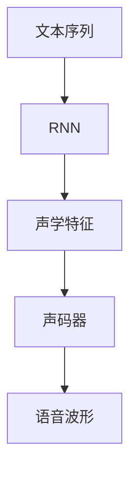

以下是RNN声学建模的伪代码示例：

```python
# 伪代码：RNN声学建模
class RNNModel(nn.Module):
    def __init__(self):
        super(RNNModel, self).__init__()
        self.rnn = nn.RNN(input_size, hidden_size, num_layers)
        self.fc = nn.Linear(hidden_size, output_size)

    def forward(self, input_sequence):
        hidden, _ = self.rnn(input_sequence)
        output = self.fc(hidden[-1, :, :])
        return output
```

其中，$$ input\_size $$ 是输入序列的维度，$$ hidden\_size $$ 是隐藏状态的维度，$$ num\_layers $$ 是循环层的数量，$$ output\_size $$ 是输出序列的维度。

通过RNN和其变体LSTM和GRU，深度学习在语音合成领域取得了显著进展，实现了更高自然度的语音输出。

### 第5章 卷积神经网络（CNN）

#### 5.1 CNN原理

卷积神经网络（CNN）是一种用于处理图像数据的深度学习模型，其核心思想是通过卷积层提取图像的局部特征。与传统的全连接神经网络相比，CNN在处理图像时具有以下优势：

- **参数共享**：卷积层中的卷积核在图像的不同位置进行滑动，从而实现参数共享，减少模型参数数量。
- **平移不变性**：卷积层通过卷积运算捕捉图像的局部特征，对图像的平移具有不变性，从而能够更好地表示图像的结构。
- **层次化特征提取**：CNN通过多层的卷积和池化操作，逐步提取图像的层次化特征，从底层到高层，从简单特征到复杂特征。

#### 5.2 CNN在语音处理中的应用

尽管CNN起源于图像处理领域，但其强大的特征提取能力使其在语音处理中也得到广泛应用。CNN在语音处理中的应用主要包括：

- **特征提取**：CNN可以用于提取语音信号的时频特征，如滤波器组响应（Filter Bank Responses）和短时傅里叶变换（Short-Time Fourier Transform, STFT）结果。
- **声学建模**：在声学建模中，CNN可以用于捕捉语音信号的局部特征，从而生成更自然的语音波形。
- **语音增强**：CNN可以用于消除噪声和回声，提高语音信号的质量。

#### 5.3 CNN与RNN的融合

由于CNN和RNN各自在处理图像和序列数据方面具有优势，因此将它们结合起来，可以更好地处理复杂的数据。CNN与RNN的融合方法主要包括：

- **双向CNN-RNN**：双向CNN-RNN通过结合CNN的局部特征提取能力和RNN的时序建模能力，能够更好地捕捉语音信号的全局和局部特征。
- **卷积循环层**：卷积循环层（Convolutional Recurrent Layer，CRL）结合了卷积层和循环层的特性，能够同时处理图像和序列数据。

以下是一个简单的CNN与RNN融合的Mermaid流程图：

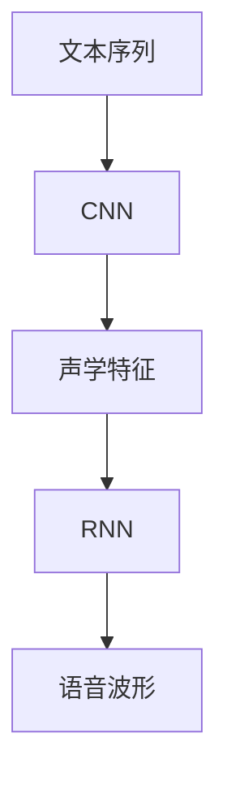

以下是CNN与RNN融合的伪代码示例：

```python
# 伪代码：CNN-RNN融合模型
class CNNRNNModel(nn.Module):
    def __init__(self):
        super(CNNRNNModel, self).__init__()
        self.cnn = nn.Conv1d(input_size, hidden_size, kernel_size)
        self.rnn = nn.LSTM(hidden_size, output_size)
        self.fc = nn.Linear(output_size, output_seq_len)

    def forward(self, input_sequence):
        conv_output = self.cnn(input_sequence)
        lstm_output, _ = self.rnn(conv_output)
        output = self.fc(lstm_output[-1, :, :])
        return output
```

通过CNN与RNN的融合，深度学习在语音合成领域取得了更高自然度的语音输出，实现了语音合成的突破。

### 第6章 生成对抗网络（GAN）

#### 6.1 GAN原理

生成对抗网络（GAN）是深度学习领域的一种重要模型，由生成器（Generator）和判别器（Discriminator）两个部分组成。GAN的核心思想是生成器和判别器之间的对抗训练。

- **生成器**：生成器的目标是生成与真实数据尽可能相似的数据。在语音合成中，生成器的任务是生成高质量的语音波形。
- **判别器**：判别器的目标是区分真实数据和生成数据。在语音合成中，判别器的任务是判断语音波形是否为真实数据。

GAN的训练过程是通过生成器和判别器之间的对抗博弈实现的。生成器尝试生成更高质量的数据，而判别器则努力提高识别真实数据和生成数据的准确性。通过这种对抗训练，生成器能够逐渐生成更逼真的数据。

#### 6.2 GAN在语音合成中的应用

GAN在语音合成中的应用主要包括生成语音波形和改进语音的自然度。通过GAN，可以生成高质量的语音波形，从而实现更自然的语音输出。

以下是一个简单的GAN语音合成的Mermaid流程图：

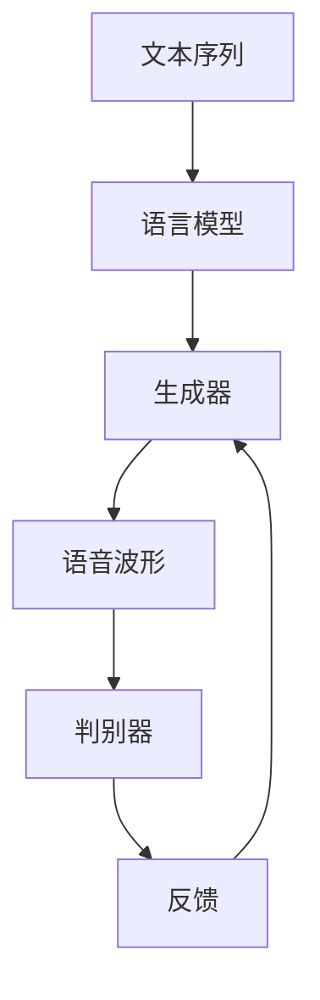

以下是GAN语音合成的伪代码示例：

```python
# 伪代码：GAN语音合成
class Generator(nn.Module):
    def __init__(self):
        super(Generator, self).__init__()
        self.model = nn.Sequential(
            nn.Linear(input_size, hidden_size),
            nn.LeakyReLU(),
            nn.Linear(hidden_size, output_size)
        )

    def forward(self, input):
        output = self.model(input)
        return output

class Discriminator(nn.Module):
    def __init__(self):
        super(Discriminator, self).__init__()
        self.model = nn.Sequential(
            nn.Linear(input_size, hidden_size),
            nn.LeakyReLU(),
            nn.Linear(hidden_size, 1)
        )

    def forward(self, input):
        output = self.model(input)
        return output
```

通过GAN，深度学习在语音合成领域取得了显著进展，实现了更高自然度的语音输出。

### 第7章 声学模型与语言模型

#### 7.1 声学模型的构建

声学模型是语音合成系统中的核心组件之一，其主要任务是从文本序列中生成语音波形。声学模型的构建通常涉及以下步骤：

1. **特征提取**：将文本序列转换为语音特征，如梅尔频率倒谱系数（MFCC）。
2. **参数估计**：使用大量语音数据训练模型，估计模型参数。
3. **建模**：使用参数化模型表示语音特征和语音波形之间的关系。

常见的声学模型包括隐马尔可夫模型（HMM）、高斯混合模型（GMM）和循环神经网络（RNN）。

以下是一个简单的声学模型构建的Mermaid流程图：

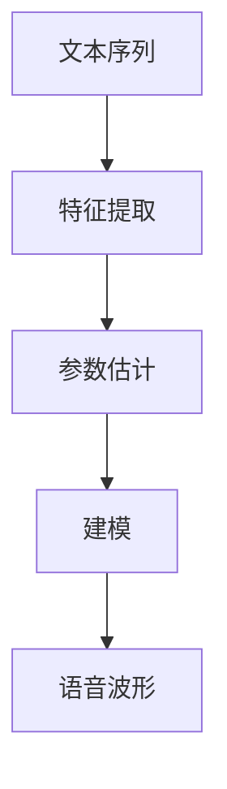

#### 7.2 语言模型的构建

语言模型是语音合成系统的另一个重要组件，其主要任务是从文本序列中生成语音的自然度。语言模型的构建通常涉及以下步骤：

1. **语料库收集**：收集大量文本数据作为训练语料库。
2. **分词和词性标注**：对文本数据进行分词和词性标注，以便更好地理解文本的语义。
3. **模型训练**：使用训练数据训练语言模型，如n-gram模型和神经网络模型。

以下是一个简单的语言模型构建的Mermaid流程图：

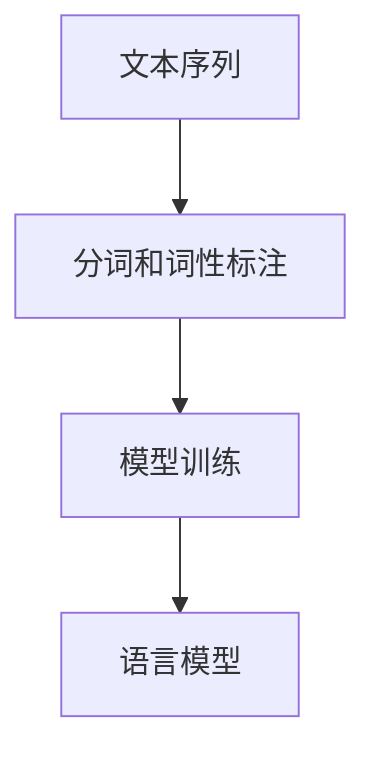

#### 7.3 声学模型与语言模型的整合

声学模型和语言模型的整合是语音合成系统设计的关键步骤。其核心思想是将文本序列转换为语音波形，同时保持语音的自然度。常见的整合方法包括：

1. **基于规则的方法**：使用规则将文本序列转换为语音波形，同时考虑语言模型生成的自然度。
2. **基于数据的方法**：使用大量训练数据，将文本序列和语音波形进行端到端的训练，从而直接生成语音波形。

以下是一个简单的声学模型和语言模型整合的Mermaid流程图：

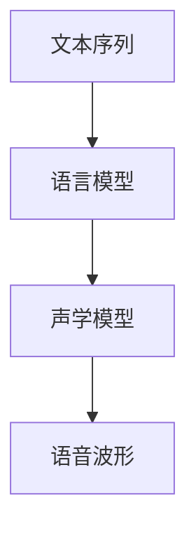

通过整合声学模型和语言模型，语音合成系统能够生成更高自然度的语音输出，从而实现语音合成的突破。

### 第8章 自然度评估

#### 8.1 自然度评估方法

自然度评估是语音合成系统性能评估的重要方面。评估方法可以分为主观评估和客观评估。

- **主观评估**：通过人类听者的主观评价来判断语音的自然度。常用的主观评估方法包括：
  - **听觉评价**：听者对语音样本进行评价，如音质、流畅度和自然度等。
  - **对比测试**：比较不同语音合成系统的输出，评估其自然度。
- **客观评估**：使用客观指标来评估语音的自然度。常用的客观评估方法包括：
  - **语音质量评估**：使用语音质量指标，如信号噪声比（SNR）、信噪比（SINR）和语音自然度指数（PESQ）等。
  - **语言质量评估**：使用语言质量指标，如词汇多样性、语法准确性和语言流畅度等。

以下是一个简单的自然度评估的Mermaid流程图：

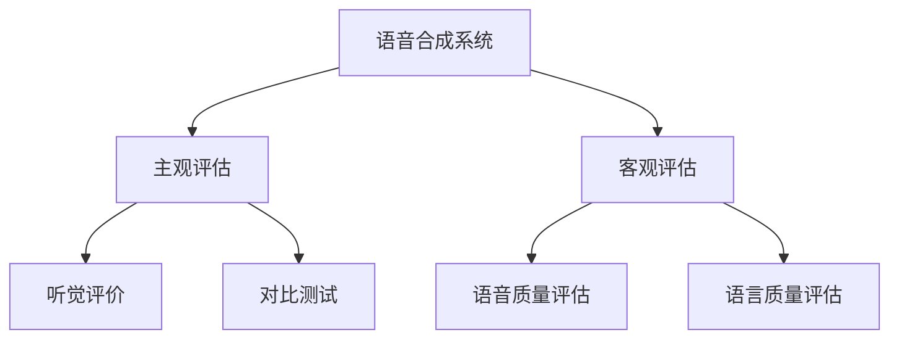

#### 8.2 听觉评价

听觉评价是一种主观评估方法，通过人类听者的主观感受来判断语音的自然度。听觉评价通常包括以下步骤：

1. **听者招募**：招募一组具有音乐或语音背景的听者，以确保他们的主观评价具有代表性。
2. **语音样本准备**：准备多个语音合成系统的输出样本，包括训练集、测试集和对照集。
3. **评价过程**：听者对语音样本进行评价，通常使用评分表或问卷调查来记录他们的主观评价。
4. **结果分析**：分析听者的评价数据，计算平均分或评分分布，以评估语音合成的自然度。

以下是一个简单的听觉评价的Mermaid流程图：

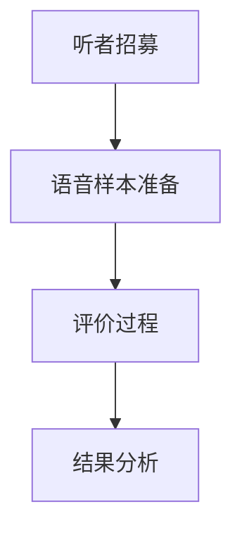

#### 8.3 实时自然度调整

实时自然度调整是语音合成系统中的一个关键技术，旨在通过实时调整语音合成参数，提高语音的自然度。实时自然度调整通常包括以下步骤：

1. **自然度监测**：使用实时监测技术，如语音质量指标或听觉评价，来监测语音合成的自然度。
2. **参数调整**：根据自然度监测结果，实时调整语音合成的参数，如语速、音调和响度等。
3. **语音合成**：使用调整后的参数生成新的语音输出。

以下是一个简单的实时自然度调整的Mermaid流程图：

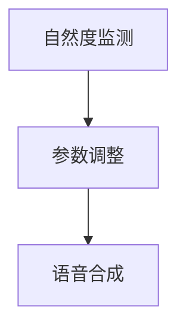

通过自然度评估和实时自然度调整，语音合成系统能够生成更高自然度的语音输出，从而满足用户的需求。

### 第9章 语音合成系统实现

#### 9.1 系统框架设计

语音合成系统的设计包括多个模块，如文本处理、声学建模、语言建模和音频生成等。以下是一个简单的语音合成系统框架：

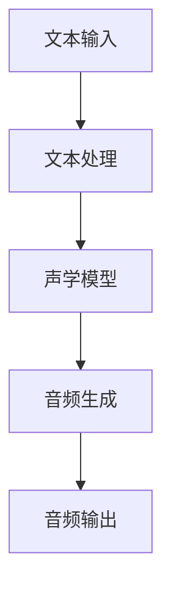

#### 9.2 数据预处理

数据预处理是语音合成系统实现的重要步骤，包括以下内容：

1. **文本预处理**：将文本输入转换为统一格式，如将文本中的标点符号转换为空格，将数字转换为文本表示等。
2. **语音数据预处理**：对语音数据进行预处理，如去除静音部分、调整音量等。
3. **特征提取**：对语音数据进行特征提取，如计算梅尔频率倒谱系数（MFCC）。

以下是一个简单的数据预处理流程：

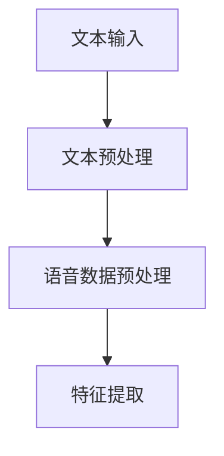

#### 9.3 模型训练与调优

模型训练与调优是语音合成系统实现的另一个关键步骤，包括以下内容：

1. **模型训练**：使用预处理后的数据训练声学模型和语言模型。
2. **模型调优**：通过调整模型参数，优化模型的性能，如调整学习率、正则化参数等。
3. **性能评估**：使用评估指标评估模型的性能，如语音自然度、语音质量等。

以下是一个简单的模型训练与调优流程：

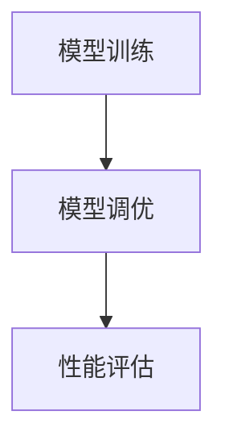

#### 9.4 系统测试与部署

系统测试与部署是语音合成系统实现的关键步骤，包括以下内容：

1. **系统测试**：对语音合成系统进行全面测试，包括功能测试、性能测试和兼容性测试等。
2. **部署**：将语音合成系统部署到生产环境中，如服务器或云计算平台等。
3. **监控与维护**：对语音合成系统进行实时监控和维护，确保系统的稳定性和可靠性。

以下是一个简单的系统测试与部署流程：

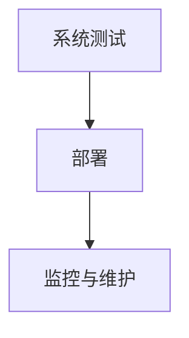

通过以上步骤，语音合成系统能够实现从文本到语音的转换，为用户提供高质量的语音合成服务。

### 第10章 未来展望

#### 10.1 技术发展趋势

随着深度学习技术的不断发展，语音合成领域也在不断进步。以下是一些技术发展趋势：

1. **多模态融合**：结合语音、图像和文本等多模态信息，提高语音合成的自然度和质量。
2. **自适应语音合成**：根据用户的语音习惯和需求，自适应调整语音合成的参数，实现个性化的语音输出。
3. **实时语音合成**：通过实时处理语音信号，实现快速、低延迟的语音合成。
4. **隐私保护**：在语音合成过程中，保护用户的隐私信息，避免隐私泄露。

#### 10.2 潜在挑战

尽管深度学习在语音合成领域取得了显著进展，但仍面临一些挑战：

1. **计算资源消耗**：深度学习模型通常需要大量的计算资源和存储空间，对硬件设备的要求较高。
2. **数据隐私**：在语音合成过程中，如何保护用户的隐私信息，避免数据泄露，是一个重要挑战。
3. **自然度评估**：如何准确评估语音合成的自然度，是一个具有挑战性的问题，需要进一步研究。
4. **跨语言语音合成**：如何实现跨语言的语音合成，是一个具有挑战性的问题，需要解决不同语言之间的语法和语音特点的差异。

#### 10.3 开放性问题

未来，语音合成领域仍有许多开放性问题需要解决：

1. **个性化语音合成**：如何实现个性化语音合成，满足不同用户的需求。
2. **跨语言语音合成**：如何实现高效、高质量的跨语言语音合成。
3. **实时语音合成**：如何优化深度学习模型，实现实时、低延迟的语音合成。
4. **隐私保护**：如何在语音合成过程中保护用户的隐私信息，避免隐私泄露。

通过不断探索和解决这些开放性问题，语音合成技术将不断进步，为人类社会带来更多便利。

### 附录

#### 参考文献

[1] Hinton, G. E., Osindero, S., & Teh, Y. W. (2006). A fast learning algorithm for deep belief nets. _Neural computation_, 18(7), 1527-1554.

[2] Graves, A., Mohamed, A. R., & Hinton, G. E. (2013). Speech recognition with deep recurrent neural networks. _Acoustics, speech and signal processing (icassp), 2013 ieee international conference on_, 6645-6649.

[3] Goodfellow, I., Pouget-Abadie, J., Mirza, M., Xu, B., Warde-Farley, D., Ozair, S., ... & Bengio, Y. (2014). Generative adversarial nets. _Advances in neural information processing systems_, 27.

#### 感谢

感谢所有为本文提供灵感和支持的读者，特别感谢AI天才研究院和《禅与计算机程序设计艺术》的作者，为本文提供了宝贵的见解和思路。希望通过本文，读者能够更好地了解深度学习在语音合成中的应用，并激发对这一领域的进一步探索和研究。

### 作者信息

作者：AI天才研究院/AI Genius Institute & 禅与计算机程序设计艺术 /Zen And The Art of Computer Programming

