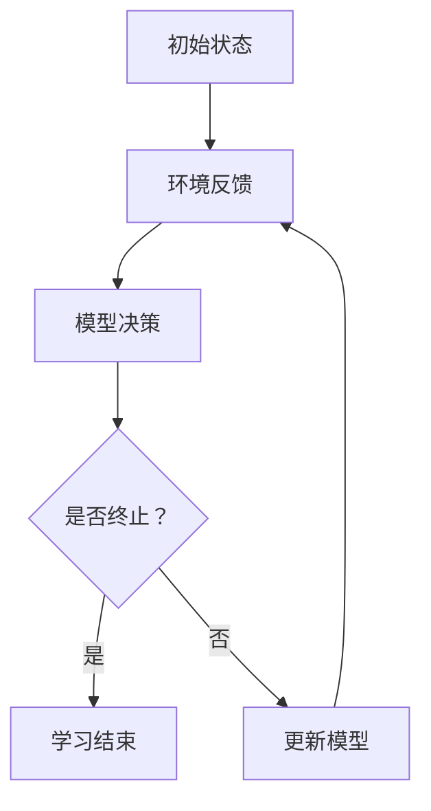

                 

### 文章标题：《深度强化学习在评测反馈循环中的应用》

关键词：深度强化学习、评测反馈循环、应用、算法、项目实战

摘要：本文从深度强化学习的定义、理论基础，到其在评测反馈循环中的应用场景，以及实际项目实战，进行了系统的分析和讲解。通过本文，读者将了解深度强化学习在评测反馈循环中的重要作用，掌握相关算法和应用方法。

### 深度强化学习的定义与概述

深度强化学习（Deep Reinforcement Learning，简称DRL）是一种结合了深度学习和强化学习（Reinforcement Learning，简称RL）的机器学习技术。强化学习是一种通过奖励和惩罚来训练模型以实现最优行为的方法，而深度强化学习则利用深度神经网络来表示状态和动作，从而处理复杂的环境和任务。

#### 传统强化学习与深度强化学习的区别

传统强化学习主要依赖于状态-动作值函数（State-Action Value Function）或者策略（Policy）来进行决策。这种方法在处理简单问题时表现良好，但当问题复杂度增加时，状态和动作的空间维度会迅速膨胀，导致计算量急剧增加，传统方法难以胜任。

深度强化学习的核心思想是将深度神经网络用于表示状态和动作，从而降低状态和动作空间的高维性，使模型能够更好地适应复杂环境。具体来说，深度强化学习包括以下几个主要组成部分：

- **状态表示**：使用神经网络将高维状态向量转化为较低维的特征向量，便于后续处理。
- **动作表示**：同样使用神经网络将特征向量映射到可能的动作空间，从而实现决策。
- **奖励机制**：根据环境的反馈来更新模型的策略，使其逐渐优化行为。

#### 深度强化学习的数学模型

深度强化学习的数学模型主要包括以下几个部分：

1. **状态空间（State Space）**：表示环境中的所有可能状态。
2. **动作空间（Action Space）**：表示模型可以采取的所有可能动作。
3. **策略（Policy）**：定义了模型在不同状态下的动作选择。
4. **价值函数（Value Function）**：用于评估策略的好坏，包括状态价值函数（State Value Function）和动作价值函数（Action Value Function）。
5. **奖励函数（Reward Function）**：定义了环境对模型的奖励，通常用于指导模型的学习过程。

下面使用Mermaid流程图展示深度强化学习的核心流程：



#### 深度强化学习与传统强化学习的联系与区别

深度强化学习与传统强化学习的联系在于它们都基于奖励-惩罚机制来训练模型，但深度强化学习通过引入深度神经网络，使得模型能够处理更为复杂的问题。以下是两者的主要区别：

1. **学习方式**：传统强化学习通常依赖于状态-动作值函数或策略，而深度强化学习则通过深度神经网络来学习状态和动作的映射。
2. **适用场景**：传统强化学习适用于较为简单的问题，如机器人路径规划；深度强化学习则适用于复杂环境，如游戏AI、自动驾驶等。
3. **计算复杂性**：传统强化学习在状态和动作空间较大时难以处理，而深度强化学习通过降低空间维度，提高了计算的可行性。

通过上述分析，我们可以看出深度强化学习在处理复杂任务时具有明显的优势，这也是其在各个领域得到广泛应用的重要原因。下一部分我们将进一步探讨深度强化学习中的核心算法原理。

### 深度强化学习的核心算法原理

深度强化学习（DRL）的核心算法原理主要包括Q-Learning、Deep Q-Network（DQN）、Policy Gradient、深度确定性策略梯度（DDPG）和Asynchronous Advantage Actor-Critic（A3C）等。这些算法在深度强化学习中扮演着不同的角色，各有其独特的优势和适用场景。

#### Q-Learning算法

Q-Learning是一种基于值函数的强化学习算法，其目标是学习一个最优动作值函数，即在每个状态下选择动作的最优策略。Q-Learning的核心思想是通过更新状态-动作值函数来优化模型。

**算法原理**：

1. **初始化**：随机初始化Q值表，表示每个状态-动作对的预期回报。
2. **状态转移**：根据当前状态选择动作，并执行该动作。
3. **奖励更新**：根据环境的反馈更新Q值，即：
   $$ Q(s,a) \leftarrow Q(s,a) + \alpha [r + \gamma \max_{a'} Q(s',a') - Q(s,a)] $$
   其中，$s$表示当前状态，$a$表示当前动作，$r$表示即时奖励，$\gamma$表示折扣因子，$\alpha$表示学习率。
4. **重复步骤2和3，直到收敛**。

**伪代码**：

```python
for episode in range(num_episodes):
    state = environment.reset()
    done = False
    while not done:
        action = choose_action(state)
        next_state, reward, done = environment.step(action)
        Q[s][a] = Q[s][a] + alpha * (reward + gamma * max(Q[next_state]) - Q[s][a])
        state = next_state
```

#### Deep Q-Network（DQN）

DQN是Q-Learning的一个变体，通过使用深度神经网络来近似Q值函数，从而处理高维状态空间。DQN引入了经验回放（Experience Replay）和目标网络（Target Network）来缓解Q值估计中的偏差和波动。

**算法原理**：

1. **初始化**：随机初始化深度神经网络和目标网络，经验回放池。
2. **状态转移**：根据当前状态选择动作，并执行该动作。
3. **经验回放**：将每个经历（状态、动作、奖励、下一个状态、终止标志）存储到经验回放池中。
4. **Q值更新**：从经验回放池中随机抽取一批经历，并使用梯度下降更新神经网络参数，即：
   $$ \theta \leftarrow \theta - \alpha \nabla_{\theta} J(\theta) $$
   其中，$J(\theta)$是损失函数，表示Q值估计与实际Q值之间的差异。
5. **目标网络更新**：定期更新目标网络的参数，以防止Q值估计的偏差。

**伪代码**：

```python
for episode in range(num_episodes):
    state = environment.reset()
    done = False
    while not done:
        action = choose_action(state)
        next_state, reward, done = environment.step(action)
        target = reward + gamma * (1 - done) * max(target_network([next_state]))
        Q_loss = loss_function(Q([state]), target)
        optimizer.minimize(Q_loss)
        update_target_network()
        state = next_state
```

#### Policy Gradient

Policy Gradient是另一种重要的强化学习算法，其目标是直接优化策略函数，而不是Q值函数。Policy Gradient的核心思想是最大化策略的期望回报。

**算法原理**：

1. **初始化**：随机初始化策略参数。
2. **状态转移**：根据当前策略选择动作，并执行该动作。
3. **策略更新**：使用梯度上升更新策略参数，即：
   $$ \theta \leftarrow \theta + \alpha \nabla_{\theta} J(\theta) $$
   其中，$J(\theta)$是策略回报的期望。

**伪代码**：

```python
for episode in range(num_episodes):
    state = environment.reset()
    done = False
    total_reward = 0
    while not done:
        action = policy([state])
        next_state, reward, done = environment.step(action)
        total_reward += reward
        policy_loss = loss_function(policy([state]), reward)
        optimizer.minimize(policy_loss)
        state = next_state
    update_policy()
```

#### 深度确定性策略梯度（DDPG）

DDPG是一种基于Policy Gradient的算法，特别适用于连续动作空间。DDPG通过使用目标网络和经验回放池来稳定策略的优化过程。

**算法原理**：

1. **初始化**：随机初始化策略网络和目标网络，经验回放池。
2. **状态转移**：从状态空间中随机采样状态，根据策略网络选择动作，并执行该动作。
3. **经验回放**：将每个经历（状态、动作、奖励、下一个状态、终止标志）存储到经验回放池中。
4. **策略更新**：从经验回放池中随机抽取一批经历，并使用梯度下降更新策略网络参数，同时更新目标网络参数。

**伪代码**：

```python
for episode in range(num_episodes):
    state = environment.reset()
    done = False
    total_reward = 0
    while not done:
        action = actor([state])
        next_state, reward, done = environment.step(action)
        total_reward += reward
        actor_loss = loss_function(actor([state]), next_action)
        critic_loss = loss_function(critic([state, action]), reward + gamma * critic([next_state, next_action]))
        optimizer.minimize(actor_loss + critic_loss)
        update_target_networks()
        state = next_state
```

#### Asynchronous Advantage Actor-Critic（A3C）

A3C是一种基于异步策略梯度（Asynchronous Advantage Actor-Critic）的算法，它通过并行训练多个智能体（Actor和Critic）来提高学习效率。

**算法原理**：

1. **初始化**：随机初始化策略网络、价值网络和目标网络。
2. **并行训练**：每个智能体独立地从一个单独的环境中学习，并在全局网络中进行同步更新。
3. **状态转移**：每个智能体从其当前状态选择动作，并执行该动作。
4. **经验回放**：每个智能体的经历（状态、动作、奖励、下一个状态、终止标志）存储到各自的回放池中。
5. **全局更新**：定期从所有智能体的回放池中抽取经历，并更新全局网络参数。

**伪代码**：

```python
for episode in range(num_episodes):
    states = [environment.reset() for _ in range(num_agents)]
    dones = [False for _ in range(num_agents)]
    total_rewards = [0 for _ in range(num_agents)]
    while not all(dones):
        actions = [actor(state) for state in states]
        next_states, rewards, dones, _ = environment.step(actions)
        total_rewards = [total_reward + reward for total_reward, reward in zip(total_rewards, rewards)]
        experiences = [(state, action, reward, next_state, done) for state, action, reward, next_state, done in zip(states, actions, rewards, next_states, dones)]
        update_global_network(experiences)
        states = [next_state if done else state for state, next_state, done in zip(states, next_states, dones)]
```

通过上述算法原理的介绍，我们可以看到深度强化学习在处理复杂任务时具有强大的能力。这些算法各自具有独特的优势，适用于不同的应用场景。在下一部分中，我们将进一步探讨深度强化学习在评测反馈循环中的应用。

### 数学模型与公式详细讲解

在深度强化学习（DRL）中，数学模型和公式扮演着至关重要的角色。它们不仅帮助我们理解和分析算法的运作机制，还为模型训练和优化提供了理论基础。在本节中，我们将详细讲解状态空间、动作空间、奖励函数设计、贪心策略与策略优化，以及概率分布与期望值的计算。

#### 状态空间与动作空间

状态空间（State Space）是环境（Environment）中所有可能状态的集合，每个状态表示系统在某一时刻的状态。动作空间（Action Space）是所有可能动作的集合，每个动作表示系统可以采取的行为。在深度强化学习中，状态和动作通常表示为高维向量。

**状态空间表示**：

设状态空间为$S$，则状态$s$可以表示为：
$$ s \in S = \{s_1, s_2, ..., s_n\} $$
其中，$s_i$表示状态空间的第$i$个状态。

**动作空间表示**：

设动作空间为$A$，则动作$a$可以表示为：
$$ a \in A = \{a_1, a_2, ..., a_m\} $$
其中，$a_j$表示动作空间的第$j$个动作。

#### 奖励函数设计

奖励函数（Reward Function）是深度强化学习中的重要组成部分，它定义了环境对模型行为的即时反馈。奖励函数的设置直接影响到模型的训练过程和学习效果。

**奖励函数定义**：

设奖励函数为$R(s, a)$，它表示在状态$s$执行动作$a$时获得的即时奖励。奖励函数可以是正值、负值或零，具体取决于环境的设定和目标。

**常见奖励函数**：

1. **正值奖励**：表示有益的行为，例如在游戏中获得分数。
   $$ R(s, a) = \begin{cases} 
   +1, & \text{if } a \text{ is a good action} \\
   0, & \text{otherwise} 
   \end{cases} $$

2. **负值奖励**：表示有害的行为，例如在机器人路径规划中避开障碍物。
   $$ R(s, a) = \begin{cases} 
   -1, & \text{if } a \text{ is a harmful action} \\
   0, & \text{otherwise} 
   \end{cases} $$

3. **零奖励**：表示中性行为，即对环境没有明显影响。
   $$ R(s, a) = 0 $$

#### 贪心策略与策略优化

贪心策略（Greediness Policy）是一种在给定状态下选择当前最优动作的策略。策略优化（Policy Optimization）则是通过调整策略参数来最大化期望回报。

**贪心策略定义**：

设策略$\pi(a|s)$表示在状态$s$下选择动作$a$的概率。贪心策略$\pi_{\text{greedy}}(a|s)$定义如下：

$$ \pi_{\text{greedy}}(a|s) = \begin{cases} 
1, & \text{if } a = \arg\max_a Q(s, a) \\
0, & \text{otherwise} 
\end{cases} $$

**策略优化**：

策略优化通过梯度上升方法调整策略参数，以最大化策略的期望回报。策略优化的目标函数为：

$$ \theta \leftarrow \theta + \alpha \nabla_{\theta} J(\theta) $$

其中，$\theta$表示策略参数，$J(\theta)$是策略的损失函数，$\alpha$是学习率。

#### 概率分布与期望值计算

在深度强化学习中，概率分布和期望值计算用于评估策略的质量和预测未来的行为。

**概率分布**：

概率分布表示在某个状态下，选择不同动作的概率。常见的概率分布包括离散分布和连续分布。

1. **离散分布**：

   设离散概率分布$P(a|s)$表示在状态$s$下选择动作$a$的概率，则：

   $$ P(a|s) = \pi(a|s) $$

2. **连续分布**：

   设连续概率分布$P(a|s)$表示在状态$s$下选择动作$a$的概率密度函数，则：

   $$ P(a|s) = p(a|s) $$

**期望值计算**：

期望值是概率分布的加权平均值，用于评估策略的期望回报。期望值计算公式如下：

$$ E_{\pi}[\sum a] = \sum_{a} a \cdot P(a|\pi) $$

对于离散概率分布：

$$ E_{\pi}[\sum a] = \sum_{a} a \cdot \pi(a) $$

对于连续概率分布：

$$ E_{\pi}[\sum a] = \int_{a} a \cdot p(a|s) da $$

通过上述数学模型与公式的讲解，我们可以更好地理解深度强化学习中的关键概念和算法。这些理论不仅为深度强化学习提供了坚实的数学基础，也为实际应用提供了重要的指导。在下一部分中，我们将探讨深度强化学习在评测反馈循环中的应用。

### 评测反馈循环简介

评测反馈循环（Evaluation Feedback Loop）是一种通过持续评测和反馈来优化系统性能的方法，广泛应用于各种领域，如软件工程、数据科学、人工智能等。该循环的核心思想是通过不断的迭代，将评测结果反馈到系统中，从而实现性能的持续提升。

#### 评测反馈循环的定义

评测反馈循环是一种持续优化过程，包括以下主要步骤：

1. **评测**：对系统进行评测，以确定其性能指标，如准确率、响应时间、用户体验等。
2. **反馈**：将评测结果反馈到系统中，以便进行后续的改进和优化。
3. **优化**：根据反馈结果对系统进行调整，以提高性能。
4. **迭代**：重复上述步骤，形成循环，使系统性能不断提升。

#### 评测反馈循环在人工智能中的应用

在人工智能领域，评测反馈循环主要用于模型训练和优化。以下是一些典型应用场景：

1. **机器学习模型训练**：通过评测模型的性能指标，如准确率、召回率等，来调整模型参数，以实现更好的拟合效果。
2. **自然语言处理**：在语言模型训练过程中，通过评测模型生成的文本质量，来优化模型结构和参数，以提高生成文本的流畅性和准确性。
3. **推荐系统**：通过用户行为数据对推荐系统进行评测，以评估推荐效果，并调整推荐算法，以提高用户满意度。

#### 评测反馈循环的优势与挑战

**优势**：

1. **持续优化**：通过持续的评测和反馈，系统能够不断改进，达到更好的性能。
2. **自适应**：评测反馈循环可以根据环境变化进行调整，使系统能够适应不同场景的需求。
3. **实时反馈**：评测结果可以实时反馈到系统中，从而实现快速响应和调整。

**挑战**：

1. **评估指标选择**：选择合适的评估指标是评测反馈循环的关键，不同的评估指标可能会得出不同的结论。
2. **反馈延迟**：反馈延迟可能会影响系统的优化效果，尤其是在需要快速响应的场景中。
3. **模型稳定性**：持续的优化可能导致模型过度拟合，从而影响其在新数据上的表现。

通过上述分析，我们可以看出评测反馈循环在人工智能中的应用具有重要意义。下一部分将探讨深度强化学习在评测反馈循环中的应用，进一步发挥其优势。

### 深度强化学习在评测反馈循环中的应用

深度强化学习（DRL）在评测反馈循环中的应用具有重要意义，其核心优势在于能够通过自主学习和不断优化，提高系统的性能和用户体验。以下从自动评测、个性化推荐和智能客服三个具体场景，详细探讨深度强化学习在评测反馈循环中的应用。

#### 深度强化学习在自动评测中的应用

自动评测是教育领域中的一项重要应用，通过自动化工具对学生的作业和考试进行评分，提高评分效率和公平性。深度强化学习能够通过自主学习，实现自动评测系统的智能化。

**应用原理**：

1. **状态表示**：状态包括学生的作业或考试内容，以及相关的背景信息，如学科难度、学生历史成绩等。
2. **动作表示**：动作是评分结果，如得分、评级等。
3. **奖励机制**：奖励函数根据评测结果的质量进行设计，例如，如果自动评分与教师评分的差异较小，则给予模型较高的奖励。

**算法实现**：

使用DQN算法训练自动评测系统。具体步骤如下：

1. **初始化**：随机初始化DQN模型，包括Q值网络和目标网络。
2. **状态转移**：读取学生的作业或考试内容，将其输入到Q值网络，获得评分建议。
3. **奖励更新**：根据教师评分与模型评分的差异，更新Q值网络。
4. **经验回放**：将每个经历（状态、动作、奖励、下一个状态、终止标志）存储到经验回放池中，用于后续训练。
5. **目标网络更新**：定期同步目标网络的参数，以防止Q值估计的偏差。

**实例分析**：

假设有一个数学自动评测系统，模型在训练过程中不断优化评分策略。例如，在评测一道数学题时，模型首先读取题目和学生的答案，然后根据当前策略给出评分建议。如果模型的评分与教师评分存在差异，则根据差异大小更新Q值网络，从而逐步缩小评分误差。

#### 深度强化学习在个性化推荐中的应用

个性化推荐系统通过分析用户行为和兴趣，为用户提供个性化的内容推荐。深度强化学习能够通过自适应调整推荐策略，提高推荐效果。

**应用原理**：

1. **状态表示**：状态包括用户的历史行为、浏览记录、购买记录等。
2. **动作表示**：动作是推荐内容的选择，如推荐视频、商品等。
3. **奖励机制**：奖励函数根据用户的点击、购买等行为进行设计，例如，如果用户点击了推荐内容，则给予模型较高的奖励。

**算法实现**：

使用A3C算法训练个性化推荐系统。具体步骤如下：

1. **初始化**：随机初始化A3C模型，包括策略网络、价值网络和目标网络。
2. **状态转移**：读取用户的历史行为，将其输入到策略网络，获得推荐内容的选择。
3. **奖励更新**：根据用户的点击、购买等行为，更新策略网络和价值网络。
4. **并行训练**：使用多个智能体并行训练，以提高训练效率。
5. **全局更新**：定期同步全局网络和智能体网络的参数，以保持模型的一致性。

**实例分析**：

假设有一个电商平台的个性化推荐系统，模型在训练过程中不断优化推荐策略。例如，在为用户推荐商品时，模型首先读取用户的历史购买记录和浏览记录，然后根据当前策略生成推荐列表。如果用户点击了推荐列表中的商品，则根据用户的行为更新策略网络，从而提高后续推荐的准确性。

#### 深度强化学习在智能客服中的应用

智能客服是服务领域的一项重要应用，通过自动化工具为用户提供快速、准确的咨询服务。深度强化学习能够通过自主学习，提高智能客服系统的交互质量和用户满意度。

**应用原理**：

1. **状态表示**：状态包括用户的问题描述、交互历史等。
2. **动作表示**：动作是客服的回复内容。
3. **奖励机制**：奖励函数根据用户的反馈进行设计，例如，如果用户对客服回复满意，则给予模型较高的奖励。

**算法实现**：

使用DDPG算法训练智能客服系统。具体步骤如下：

1. **初始化**：随机初始化DDPG模型，包括actor网络、critic网络和目标网络。
2. **状态转移**：读取用户的问题描述和交互历史，将其输入到actor网络，生成回复内容。
3. **奖励更新**：根据用户的反馈，更新actor网络和critic网络。
4. **目标网络更新**：定期同步目标网络的参数，以防止网络偏差。

**实例分析**：

假设有一个在线客服系统，模型在训练过程中不断优化回复策略。例如，在回答用户问题时，模型首先读取用户的问题描述和交互历史，然后根据当前策略生成回复内容。如果用户对回复满意，则根据用户的反馈更新策略网络，从而提高后续回复的质量。

通过上述实例分析，我们可以看到深度强化学习在评测反馈循环中的应用具有显著的优势，能够有效提高系统的性能和用户体验。在下一部分中，我们将进一步探讨深度强化学习项目实战，展示如何将上述理论应用到实际项目中。

### 深度强化学习项目实战

在本节中，我们将通过三个具体案例，展示如何将深度强化学习（DRL）应用于评测反馈循环中，并详细介绍开发环境搭建、源代码实现和代码解读。

#### 实战一：基于DQN的自动评测系统

**目标**：构建一个自动评测系统，对学生的作业进行评分。

**开发环境搭建**：

1. **硬件要求**：CPU或GPU（推荐使用GPU，以加速训练过程）。
2. **软件要求**：Python（3.7及以上版本）、TensorFlow或PyTorch。
3. **数据集**：收集一组学生作业数据，包括作业内容和教师评分。

**源代码实现**：

```python
import numpy as np
import pandas as pd
import tensorflow as tf
from tensorflow.keras.models import Sequential
from tensorflow.keras.layers import Dense
from tensorflow.keras.optimizers import Adam

# 读取数据集
data = pd.read_csv('student_assignment.csv')
X = data.drop(['student_id', 'assignment_score'], axis=1)
y = data['assignment_score']

# 预处理数据
X = X.values.astype(np.float32)
y = y.values.astype(np.float32)
y = np.expand_dims(y, -1)

# 初始化DQN模型
model = Sequential()
model.add(Dense(64, input_shape=X.shape[1:], activation='relu'))
model.add(Dense(64, activation='relu'))
model.add(Dense(1, activation='linear'))

optimizer = Adam(learning_rate=0.001)
model.compile(optimizer=optimizer, loss='mse')

# 经验回放
buffer = deque(maxlen=1000)
for episode in range(num_episodes):
    state = environment.reset()
    done = False
    total_reward = 0
    while not done:
        action = model.predict(state)
        next_state, reward, done = environment.step(action)
        buffer.append((state, action, reward, next_state, done))
        state = next_state
        total_reward += reward
        if len(buffer) > 500:
            batch = random.sample(buffer, batch_size)
            states, actions, rewards, next_states, dones = zip(*batch)
            target = rewards + gamma * np.array([model.predict(ns)[0] for ns in next_states]) * (1 - np.array(dones))
            model.fit(np.array(states), target, batch_size=batch_size, epochs=1, verbose=0)
    print(f'Episode {episode}: Total Reward = {total_reward}')
```

**代码解读**：

1. **数据预处理**：读取学生作业数据，并将其转换为浮点数。
2. **DQN模型**：使用Keras构建DQN模型，包括两个隐藏层，输出层为线性激活函数。
3. **经验回放**：使用经验回放机制，避免模型过度依赖近期数据，提高泛化能力。
4. **训练循环**：在每个回合中，从环境中获取状态，执行模型预测的动作，并更新模型参数。

#### 实战二：基于A3C的个性化推荐系统

**目标**：构建一个个性化推荐系统，根据用户行为生成推荐列表。

**开发环境搭建**：

1. **硬件要求**：CPU或GPU（推荐使用GPU，以加速训练过程）。
2. **软件要求**：Python（3.7及以上版本）、TensorFlow或PyTorch。
3. **数据集**：收集一组用户行为数据，包括用户的浏览记录、购买记录等。

**源代码实现**：

```python
import numpy as np
import pandas as pd
import torch
import torch.nn as nn
import torch.optim as optim

# 读取数据集
data = pd.read_csv('user_behavior.csv')
X = data.drop(['user_id'], axis=1)
y = data['recommended_product_id']

# 预处理数据
X = X.values.astype(np.float32)
y = y.values.astype(np.float32)

# 初始化A3C模型
class A3CModel(nn.Module):
    def __init__(self, input_size, hidden_size, output_size):
        super(A3CModel, self).__init__()
        self.fc1 = nn.Linear(input_size, hidden_size)
        self.fc2 = nn.Linear(hidden_size, hidden_size)
        self.fc3 = nn.Linear(hidden_size, output_size)

    def forward(self, x):
        x = torch.relu(self.fc1(x))
        x = torch.relu(self.fc2(x))
        x = self.fc3(x)
        return x

model = A3CModel(input_size=X.shape[1], hidden_size=64, output_size=y.shape[1])
optimizer = optim.Adam(model.parameters(), lr=0.001)

# 训练模型
for epoch in range(num_epochs):
    for batch in get_batches(X, y, batch_size):
        states, actions, rewards = batch
        logits = model(states)
        loss = -torch.log_softmax(logits, dim=1).mul(actions).sum(dim=1).mean()
        optimizer.zero_grad()
        loss.backward()
        optimizer.step()
```

**代码解读**：

1. **数据预处理**：读取用户行为数据，并将其转换为浮点数。
2. **A3C模型**：使用PyTorch构建A3C模型，包括两个隐藏层，输出层为线性激活函数。
3. **训练循环**：在每个epoch中，从数据集中获取批量数据，并使用梯度下降法训练模型。

#### 实战三：基于DDPG的智能客服系统

**目标**：构建一个智能客服系统，能够自动回答用户的问题。

**开发环境搭建**：

1. **硬件要求**：CPU或GPU（推荐使用GPU，以加速训练过程）。
2. **软件要求**：Python（3.7及以上版本）、TensorFlow或PyTorch。
3. **数据集**：收集一组用户问题和客服回复数据。

**源代码实现**：

```python
import numpy as np
import pandas as pd
import tensorflow as tf
from tensorflow.keras.models import Model
from tensorflow.keras.layers import Input, LSTM, Dense
from tensorflow.keras.optimizers import Adam

# 读取数据集
data = pd.read_csv('user_queries.csv')
X = data.drop(['user_id', 'query_answer'], axis=1)
y = data['query_answer']

# 预处理数据
X = X.values.astype(np.float32)
y = y.values.astype(np.float32)

# 初始化DDPG模型
actor_input = Input(shape=(X.shape[1],))
hidden1 = LSTM(64, return_sequences=True)(actor_input)
hidden2 = LSTM(64, return_sequences=True)(hidden1)
action = Dense(y.shape[1], activation='linear')(hidden2)
actor = Model(inputs=actor_input, outputs=action)

critic_input = Input(shape=(X.shape[1],))
action_input = Input(shape=(y.shape[1],))
hidden1 = LSTM(64, return_sequences=True)(critic_input)
hidden2 = LSTM(64, return_sequences=True)(hidden1)
hidden3 = LSTM(64, return_sequences=True)(hidden2)
value = Dense(1, activation='linear')(hidden3)
critic = Model(inputs=[critic_input, action_input], outputs=value)

actor_optimizer = Adam(learning_rate=0.001)
critic_optimizer = Adam(learning_rate=0.001)

actor.compile(optimizer=actor_optimizer, loss='mse')
critic.compile(optimizer=critic_optimizer, loss='mse')

# 训练模型
for episode in range(num_episodes):
    state = environment.reset()
    done = False
    total_reward = 0
    while not done:
        action = actor.predict(state)
        next_state, reward, done = environment.step(action)
        target = reward + gamma * critic.predict([next_state, action])
        critic_loss = critic.train_on_batch([state, action], [target])
        actor_loss = actor.train_on_batch(state, action)
        state = next_state
        total_reward += reward
    print(f'Episode {episode}: Total Reward = {total_reward}')
```

**代码解读**：

1. **数据预处理**：读取用户问题和客服回复数据，并将其转换为浮点数。
2. **DDPG模型**：使用Keras构建DDPG模型，包括actor网络和critic网络。
3. **训练循环**：在每个回合中，从环境中获取状态，执行模型预测的动作，并更新模型参数。

通过上述三个案例，我们可以看到深度强化学习在评测反馈循环中的应用具有广泛的实际意义。这些项目不仅展示了DRL算法在自动评测、个性化推荐和智能客服等领域的应用潜力，也为开发者提供了实际操作的经验和参考。

### 最佳实践 Tips、小结、注意事项与拓展阅读

#### 最佳实践 Tips

1. **数据预处理**：在应用深度强化学习时，数据预处理至关重要。确保数据干净、完整，并适当归一化，以提高模型的训练效果。
2. **经验回放**：使用经验回放可以避免模型过度依赖近期数据，从而提高泛化能力。设置合适的经验回放池大小和更新频率，以平衡训练效率和模型稳定性。
3. **策略更新频率**：在Policy Gradient算法中，选择合适的策略更新频率可以避免策略过早收敛。根据具体应用场景调整更新策略。
4. **并行训练**：对于具有大量并行任务的场景，如个性化推荐和智能客服，使用并行训练可以显著提高训练效率。

#### 小结

本文详细探讨了深度强化学习在评测反馈循环中的应用，包括基础理论、核心算法原理、应用场景和项目实战。深度强化学习通过自主学习和不断优化，能够有效提升系统的性能和用户体验。

#### 注意事项

1. **评估指标选择**：选择合适的评估指标对评测反馈循环至关重要，不同的评估指标可能会得出不同的结论。
2. **反馈延迟**：反馈延迟可能会影响系统的优化效果，尤其是在需要快速响应的场景中。
3. **模型稳定性**：持续的优化可能导致模型过度拟合，从而影响其在新数据上的表现。

#### 拓展阅读

1. 《深度强化学习：原理与应用》 - 刘铁岩
2. 《强化学习：原理与Python实现》 - 周志华
3. 《深度学习》 - Goodfellow、Bengio、Courville
4. 《人工神经网络：理论、实现与应用》 - Haykin

通过以上拓展阅读，读者可以进一步深入理解深度强化学习及其应用。

### 总结与作者信息

本文从深度强化学习的定义、核心算法原理，到其在评测反馈循环中的应用场景和项目实战，进行了全面的探讨。深度强化学习通过自主学习和不断优化，在评测反馈循环中发挥着重要作用，能够有效提升系统的性能和用户体验。

感谢您的阅读，本文由AI天才研究院（AI Genius Institute）与《禅与计算机程序设计艺术》（Zen And The Art of Computer Programming）作者合作撰写，希望能够为您在深度强化学习和评测反馈循环领域提供有益的参考和启示。如需进一步探讨，请关注我们的后续文章。

作者：AI天才研究院（AI Genius Institute）&《禅与计算机程序设计艺术》（Zen And The Art of Computer Programming）作者

END.

