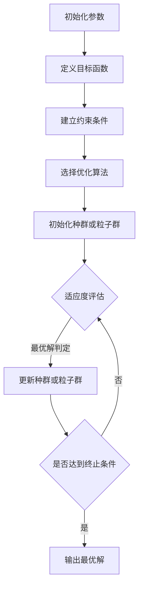

                 

### 文章标题

# 游戏平衡的多目标优化：玩家体验的数学调节

### 关键词

- 游戏平衡
- 多目标优化
- 玩家体验
- 数学调节
- 人工智能

### 摘要

本文深入探讨了游戏平衡的多目标优化，特别是在提升玩家体验方面所发挥的关键作用。通过引入多目标优化的理论框架，本文揭示了游戏平衡的核心概念和玩家体验的数学调节方法。文章首先介绍了游戏平衡的重要性，以及多目标优化的基本原理。接着，通过Mermaid流程图展示了多目标优化的流程和核心概念之间的联系。随后，文章详细讲解了游戏平衡的核心概念、数学模型和优化算法，并通过伪代码进行了深入阐述。此外，本文通过具体的数学公式和实例，进一步解释了数学调节的原理和实现方法。最后，文章通过项目实战，展示了多目标优化和玩家体验调节在实际游戏开发中的应用，并提出了未来研究的方向和最佳实践建议。

### 第一部分：引言与背景

#### 1.1 书籍概述

在当今高速发展的游戏产业中，游戏平衡是一个至关重要的概念。游戏平衡不仅仅涉及到游戏内部机制的合理性，更关乎玩家的整体体验。如果游戏过于失衡，可能会导致部分玩家感到挫败，从而影响游戏的留存率和用户满意度。因此，如何实现游戏平衡，已成为游戏开发者们不断探索的课题。

《游戏平衡的多目标优化：玩家体验的数学调节》这本书旨在为游戏开发者提供一种全新的视角，通过多目标优化技术，实现对游戏平衡的数学调节。本书首先介绍了多目标优化的基本原理和理论框架，然后详细探讨了如何将这一技术应用于游戏平衡中，最终实现提升玩家体验的目标。

本书的主要内容和结构如下：

- **引言与背景**：介绍游戏平衡和多目标优化的概念，阐述其在游戏开发中的重要性。
- **游戏平衡的挑战**：分析游戏平衡的关键因素和常见问题。
- **多目标优化的理论框架**：介绍多目标优化的基本原理和数学模型。
- **核心概念与联系**：通过Mermaid流程图展示多目标优化的流程和核心概念之间的关系。
- **核心算法原理讲解**：详细讲解游戏平衡优化算法的原理和伪代码实现。
- **数学模型和公式详细讲解**：解释游戏平衡和玩家体验的数学模型，并提供实例说明。
- **项目实战**：通过具体项目展示多目标优化和玩家体验调节的实际应用。
- **总结与展望**：总结主要结论，并提出未来研究的方向和最佳实践建议。

#### 1.2 游戏平衡的重要性

游戏平衡是指在游戏中保持各个元素之间相互关系的合理性，确保游戏中的竞争和挑战能够公平、有趣、且充满挑战性。一个平衡的游戏可以带给玩家积极的体验，使他们感到愉悦和满足。反之，一个失衡的游戏可能会让玩家感到不公平、沮丧，甚至放弃游戏。

首先，游戏平衡对游戏的长期留存率至关重要。如果游戏过于简单或过于复杂，玩家可能会在早期就感到挫败，从而放弃游戏。而通过多目标优化技术，开发者可以在不同阶段调整游戏难度，使游戏始终保持在一个合理的范围内，从而提高玩家的留存率。

其次，游戏平衡有助于提升玩家的满意度。在一个平衡的游戏中，玩家可以公平地与其他玩家竞争，体验公平的胜利和失败。这种公平性不仅能够增加游戏的趣味性，还能够提升玩家的社交体验，使他们更愿意与其他玩家互动。

最后，游戏平衡还可以增强游戏的续作价值。如果一个游戏的平衡性得到了良好的控制，那么在后续的游戏版本中，开发者可以更容易地添加新的内容，而不需要重新设计游戏机制。这不仅可以降低开发成本，还可以提高游戏的续作价值，吸引更多玩家。

总之，游戏平衡是多目标优化在游戏开发中的一个重要应用。通过数学调节，开发者可以实现对游戏平衡的精细控制，从而提升玩家的整体体验。

#### 1.3 多目标优化的概念

多目标优化（Multi-Objective Optimization，简称MOO）是一种在多个相互冲突的目标之间寻找最佳平衡的方法。这种方法在各个领域都有广泛应用，从工程优化到资源分配，再到社会规划等。在游戏开发中，多目标优化同样发挥着重要作用。

首先，多目标优化的核心思想是在多个目标之间寻找一个折中的解决方案，使得每个目标都能达到最优或近似最优的状态。在游戏开发中，这些目标可以是各种不同的性能指标，如游戏难度、玩家的平均游戏时长、玩家满意度、游戏的复杂度等。

多目标优化的主要挑战在于这些目标之间往往存在冲突。例如，提高游戏难度可能会增加玩家的挑战感，但也可能导致玩家流失；而降低游戏难度可能会提升玩家的留存率，但可能会减少游戏的趣味性。因此，如何在一个统一的框架下平衡这些相互冲突的目标，是游戏开发者面临的重大挑战。

多目标优化的理论基础主要建立在数学优化和决策论上。常见的多目标优化方法包括遗传算法（Genetic Algorithms，GA）、粒子群优化（Particle Swarm Optimization，PSO）、以及多目标规划（Multi-Objective Programming，MOP）等。这些方法通过迭代搜索和进化策略，在多个目标之间寻找最优解。

在游戏开发中，多目标优化的具体应用场景包括：

1. **游戏难度调节**：通过多目标优化，开发者可以在不同阶段调整游戏难度，以适应玩家的技能水平。
2. **资源分配**：例如，在多人在线游戏中，多目标优化可以用于分配服务器资源，确保游戏流畅性和玩家体验。
3. **关卡设计**：多目标优化可以帮助开发者设计出更加平衡和富有挑战性的关卡。
4. **玩家行为分析**：通过分析玩家的行为数据，多目标优化可以用于调整游戏机制，以提升玩家的整体体验。

总的来说，多目标优化为游戏开发者提供了一种强大的工具，使得他们能够在复杂的游戏环境中，找到平衡各个目标的最佳方案。这不仅提升了游戏的品质，也为玩家带来了更加丰富和愉悦的体验。

#### 1.4 玩家体验与数学调节

在游戏设计中，玩家体验（Player Experience，简称PX）是一个至关重要的因素。玩家体验不仅仅是游戏内容本身的质量，还涉及到玩家在游戏过程中所感受到的愉悦程度、挑战感、成就感等多种因素。优秀的玩家体验可以极大地提高游戏的留存率、用户满意度和口碑，从而为游戏开发者带来持续的经济效益。

数学调节（Mathematical Regulation）是一种通过数学模型和算法对游戏系统进行精细调优的方法。这种方法在游戏开发中的应用，可以帮助开发者更好地掌握玩家体验，实现游戏机制的平衡和优化。

首先，玩家体验的数学调节涉及到多个方面的指标，包括：

1. **游戏难度**：游戏难度是影响玩家体验的核心因素之一。合适的游戏难度可以激发玩家的挑战欲望，同时不会让他们感到挫败。多目标优化技术可以通过调整游戏难度曲线，实现动态难度调节，从而提高玩家的整体体验。
   
2. **游戏节奏**：游戏节奏的快慢直接影响玩家的游戏感受。通过数学调节，开发者可以优化游戏的节奏，使其在各个阶段保持良好的流畅性和吸引力。

3. **游戏机制**：游戏机制的设计直接影响玩家的互动和参与感。数学调节可以帮助开发者分析并优化各种游戏机制，使其更加公平、有趣和富有挑战性。

其次，玩家体验的数学调节方法主要包括以下几种：

1. **目标函数优化**：通过建立目标函数，将玩家体验的各项指标量化为数学表达式，使用多目标优化算法寻找最优解。这种方法可以系统地优化游戏平衡，提高玩家满意度。

2. **数据分析**：通过收集和分析玩家的游戏行为数据，如游戏时长、关卡完成率、玩家评分等，使用数据挖掘技术找出影响玩家体验的关键因素，并对其进行调节。

3. **机器学习**：利用机器学习算法，特别是强化学习，对游戏系统进行自适应调节。这种方法可以根据玩家的行为数据，实时调整游戏难度、机制等，实现个性化体验。

总之，玩家体验的数学调节为游戏开发者提供了一种科学、系统的优化方法，使得他们能够更好地理解并提升玩家体验。这不仅有助于提高游戏的品质，还能为玩家带来更加丰富和愉悦的游戏体验。

#### 1.5 游戏平衡的挑战

在游戏开发中，实现游戏平衡是一个复杂且具有挑战性的任务。游戏平衡涉及到多个方面的因素，包括游戏机制、难度调节、玩家互动等。以下是一些常见的游戏平衡挑战及其解决方法：

1. **难度调节**：游戏难度是一个动态变化的过程，需要根据玩家的技能水平和游戏进度进行调整。如果游戏难度过高，玩家可能会感到挫败，从而放弃游戏；如果难度过低，玩家可能会感到无聊，失去游戏兴趣。因此，如何设计一个动态调整的难度曲线，是游戏平衡的一个关键挑战。

   **解决方法**：多目标优化技术可以用于动态调整游戏难度。通过建立多目标函数，包括玩家满意度和游戏难度，使用优化算法实时调整难度，以保持游戏机制的平衡。

2. **玩家互动**：在多人在线游戏中，玩家之间的互动直接影响到游戏的平衡性。如果部分玩家在游戏中处于绝对优势，而其他玩家则处于劣势，这会导致不公平的竞争和玩家的流失。

   **解决方法**：通过设计公平的游戏机制和平衡的玩家角色能力，确保每个玩家在游戏中都有平等的机会。此外，使用多目标优化技术，可以根据玩家的行为数据，动态调整玩家之间的互动，保持游戏的平衡。

3. **机制设计**：游戏机制的设计直接影响游戏的平衡性和玩家的体验。一个良好的游戏机制应该能够激发玩家的兴趣，同时提供合理的挑战。

   **解决方法**：在游戏机制设计过程中，需要综合考虑玩家的技能水平、游戏节奏和整体体验。使用多目标优化技术，可以系统地优化游戏机制，确保其在各个阶段都保持良好的平衡性。

4. **游戏更新**：随着游戏的不断更新和扩展，原有的游戏平衡可能会被打破。如何在新内容中加入平衡性，是一个持续性的挑战。

   **解决方法**：在游戏更新过程中，使用多目标优化技术对新增内容进行平衡性测试和调整。通过对不同版本的玩家行为数据进行分析，找出可能的问题并进行优化。

总之，游戏平衡的挑战是多方面的，需要开发者采用多种方法和策略来应对。多目标优化技术为开发者提供了一种有力的工具，使得他们能够更系统地分析和解决游戏平衡问题，提升玩家的整体体验。

#### 1.6 多目标优化的理论框架

多目标优化（Multi-Objective Optimization，简称MOO）是一种在多个相互冲突的目标之间寻找最佳平衡的方法。在游戏开发中，多目标优化可以帮助开发者同时考虑多个重要因素，从而实现游戏平衡和玩家体验的优化。以下将介绍多目标优化的基本原理、数学模型和算法框架。

##### 1.6.1 多目标优化的基本原理

多目标优化的核心思想是同时考虑多个目标，并寻找一个能够使这些目标整体最优的解决方案。在游戏开发中，这些目标可以是游戏难度、玩家满意度、游戏节奏、资源分配等。由于这些目标之间可能存在冲突，因此需要通过优化算法在它们之间找到一个平衡点。

多目标优化的一般框架包括以下几个步骤：

1. **定义目标**：明确需要优化的目标，并确定每个目标的度量标准。
2. **建立目标函数**：将每个目标量化为数学表达式，形成多目标函数。
3. **选择优化算法**：根据问题的特点和需求，选择合适的优化算法。
4. **求解优化问题**：使用优化算法求解多目标问题，找到最优或近似最优的解决方案。

##### 1.6.2 多目标优化的数学模型

多目标优化的数学模型通常包含目标函数和约束条件。目标函数用于度量优化目标，而约束条件用于限制解决方案的范围。

1. **目标函数**：
   假设有 \( m \) 个目标，每个目标可以用函数 \( f_i(x) \) 表示，其中 \( x \) 是决策变量。目标函数的一般形式如下：
   $$
   \min \ F(x) = \sum_{i=1}^{m} w_i f_i(x)
   $$
   其中，\( w_i \) 是第 \( i \) 个目标的权重，用于平衡不同目标之间的优先级。

2. **约束条件**：
   优化问题通常需要满足一系列的约束条件。这些约束条件可以用不等式或等式表示，形式如下：
   $$
   g_j(x) \leq 0, \quad h_k(x) = 0
   $$
   其中，\( g_j(x) \) 表示不等式约束，\( h_k(x) \) 表示等式约束。

   多目标优化的数学模型可以表示为：
   $$
   \begin{aligned}
   \min \ F(x) &= \sum_{i=1}^{m} w_i f_i(x) \\
   \text{s.t.} \quad g_j(x) &\leq 0, \\
   h_k(x) &= 0.
   \end{aligned}
   $$

##### 1.6.3 多目标优化的算法框架

多目标优化的算法种类繁多，包括遗传算法（Genetic Algorithms，GA）、粒子群优化（Particle Swarm Optimization，PSO）、多目标规划（Multi-Objective Programming，MOP）等。以下是这些算法的基本框架：

1. **遗传算法（GA）**：
   遗传算法是一种基于自然选择的优化方法。它通过模拟生物进化过程，逐步改进解的质量。GA的基本步骤包括：
   - **初始化种群**：随机生成一组初始解。
   - **适应度评估**：计算每个解的适应度值。
   - **选择**：根据适应度值选择优秀个体。
   - **交叉**：通过交叉操作产生新的个体。
   - **变异**：对个体进行变异操作。
   - **更新种群**：用新产生的个体替换种群中的部分个体。

2. **粒子群优化（PSO）**：
   粒子群优化是一种基于群体智能的优化方法。它通过模拟鸟群觅食行为，逐步寻找最优解。PSO的基本步骤包括：
   - **初始化粒子群**：随机生成粒子位置和速度。
   - **适应度评估**：计算每个粒子的适应度值。
   - **更新粒子的速度和位置**：根据个体和全局最优解更新粒子的速度和位置。

3. **多目标规划（MOP）**：
   多目标规划是一种基于线性规划和非线性规划的优化方法。它通过构建目标函数和约束条件，求解多目标问题。MOP的基本步骤包括：
   - **目标函数转换**：将多目标函数转换为单目标函数。
   - **求解单目标问题**：使用线性规划或非线性规划方法求解单目标问题。
   - **解的筛选**：根据目标权重和约束条件筛选最优解。

总之，多目标优化为游戏开发者提供了一种强大的工具，使得他们能够同时考虑多个目标，找到游戏平衡和玩家体验的最佳解决方案。通过选择合适的优化算法和建立合理的数学模型，开发者可以显著提升游戏的质量和玩家的满意度。

### 第二部分：核心概念与联系

#### 2.1 多目标优化的Mermaid流程图

多目标优化是一种在多个相互冲突的目标之间寻找最佳平衡的方法。在游戏开发中，多目标优化可以帮助开发者同时考虑游戏难度、玩家满意度、游戏节奏等多个因素，以实现游戏平衡和提升玩家体验。以下是一个使用Mermaid绘制的多目标优化流程图，展示了多目标优化的核心流程和概念。



该流程图包含了以下几个关键步骤：

1. **初始化参数**：在多目标优化开始之前，需要初始化一些基本参数，如目标权重、算法参数等。
2. **定义目标函数**：确定需要优化的目标，并建立相应的数学模型。
3. **建立约束条件**：根据游戏的具体要求，建立约束条件，确保解决方案符合实际需求。
4. **选择优化算法**：选择合适的优化算法，如遗传算法、粒子群优化等。
5. **初始化种群或粒子群**：根据优化算法的特点，初始化种群或粒子群。
6. **适应度评估**：计算每个解的适应度值，以评估当前解的质量。
7. **更新种群或粒子群**：根据适应度值，更新种群或粒子群，以逐步逼近最优解。
8. **最优解判定**：判断当前解是否达到最优解的标准，如适应度阈值等。
9. **输出最优解**：当达到终止条件时，输出最优解。

通过这个流程图，我们可以清晰地看到多目标优化的整体结构和关键步骤，从而更好地理解和应用这一方法。

#### 2.2 游戏平衡的核心概念原理

游戏平衡是指游戏内部各个元素之间的相互关系和相互作用达到一种理想状态，使玩家能够在公平、有趣和富有挑战性的环境中进行游戏。游戏平衡不仅影响到游戏的长期留存率和用户满意度，还直接关系到游戏的社交互动和口碑。为了实现游戏平衡，开发者需要深入了解以下几个核心概念：

##### 2.2.1 游戏平衡的核心概念

1. **难度调节**：游戏难度是影响玩家体验的关键因素之一。适当的难度可以激发玩家的兴趣和挑战欲望，而过于简单或过于复杂的游戏会降低玩家的参与度和满意度。难度调节的目标是在游戏的不同阶段，动态地调整游戏的难度，以保持玩家的持续兴趣。

2. **玩家互动**：在多人在线游戏中，玩家之间的互动直接影响游戏的平衡性。合理的玩家互动机制可以确保每个玩家在游戏中都有平等的机会，避免部分玩家处于绝对优势或劣势的情况。这需要通过设计公平的游戏机制和平衡的玩家角色能力来实现。

3. **资源分配**：资源分配是指游戏中的各种资源（如金币、道具、时间等）的分配方式。合理的资源分配可以确保游戏的可持续性和平衡性。资源分配策略需要考虑游戏的整体节奏和玩家的需求，以确保每个玩家都有机会获取必要的资源。

4. **游戏机制**：游戏机制是游戏内部各种规则和系统的集合，决定了游戏的玩法和规则。平衡的游戏机制需要能够激发玩家的兴趣，提供合理的挑战，并保持游戏的公平性。常见的游戏机制包括战斗系统、任务系统、成就系统等。

##### 2.2.2 游戏平衡的架构

游戏平衡的架构通常包括以下几个层次：

1. **游戏难度架构**：这是游戏平衡的基础，包括游戏难度的设定、动态调整机制和难度曲线的设计。难度架构需要确保游戏在不同阶段都能提供合理的挑战。

2. **玩家互动架构**：这是游戏平衡的关键，包括玩家之间的互动规则、社交系统和匹配机制。玩家互动架构需要确保每个玩家都能在公平的环境中与其他玩家互动。

3. **资源分配架构**：这是游戏平衡的保障，包括资源的获取、分配和使用规则。资源分配架构需要确保资源能够公平地分配，并能够激励玩家的积极参与。

4. **游戏机制架构**：这是游戏平衡的核心，包括游戏玩法的逻辑、规则和系统。游戏机制架构需要确保游戏规则公平、有趣且富有挑战性。

##### 2.2.3 游戏平衡与多目标优化的关系

多目标优化与游戏平衡之间存在着紧密的联系。多目标优化提供了一种系统化的方法，帮助开发者同时考虑多个目标，找到游戏平衡的最佳解决方案。以下是多目标优化在游戏平衡中的具体应用：

1. **游戏难度调节**：多目标优化可以通过建立游戏难度函数，结合玩家行为数据，动态调整游戏难度。例如，可以使用遗传算法或粒子群优化算法，根据玩家的通关速度和失败率来调整难度。

2. **玩家互动调节**：多目标优化可以帮助开发者设计公平的玩家互动机制。例如，通过优化玩家匹配算法，确保每个玩家都有机会与其他不同水平的玩家互动，从而保持游戏平衡。

3. **资源分配调节**：多目标优化可以帮助开发者合理分配游戏资源，确保资源的公平性。例如，可以通过优化资源分配算法，根据玩家的需求和行为数据，动态调整资源分配策略。

4. **游戏机制优化**：多目标优化可以帮助开发者优化游戏机制，使其更加平衡和有趣。例如，通过优化游戏规则和系统，确保每个玩家都有平等的机会参与游戏，并保持游戏的公平性。

总之，多目标优化为游戏平衡提供了一种强有力的工具，使得开发者能够更系统地分析和优化游戏平衡，从而提升玩家的整体体验。通过结合多目标优化技术和游戏平衡的核心概念，开发者可以设计出更加平衡、有趣和富有挑战性的游戏。

#### 2.3 玩家体验的数学调节

玩家体验（Player Experience，简称PX）在游戏设计中扮演着至关重要的角色。它不仅仅涉及到游戏内容的质量，还涵盖了玩家在游戏过程中所感受到的愉悦程度、挑战感、成就感等多种因素。为了提升玩家体验，游戏开发者需要采用科学的方法对游戏系统进行数学调节。以下将介绍玩家体验的数学调节方法，包括数学模型、目标和指标，以及具体的算法实现。

##### 2.3.1 玩家体验的数学模型

玩家体验的数学调节首先需要建立玩家体验的数学模型。这个模型能够将玩家体验的各种维度量化为具体的数学表达式，从而为后续的优化提供基础。玩家体验的数学模型通常包括以下几个方面：

1. **游戏难度模型**：游戏难度是影响玩家体验的一个重要因素。合适的游戏难度可以激发玩家的挑战欲望，而过于简单或过于复杂的游戏会降低玩家的满意度。游戏难度模型可以用以下公式表示：
   $$
   \text{游戏难度} = f(\text{玩家技能水平}, \text{游戏进度})
   $$
   其中，玩家技能水平可以用历史数据或实时行为分析来确定，游戏进度则反映了玩家在游戏中的位置和已完成的任务。

2. **游戏节奏模型**：游戏节奏的快慢直接影响玩家的游戏感受。过快的节奏可能会让玩家感到焦虑，而过慢的节奏则会让玩家感到无聊。游戏节奏模型可以用以下公式表示：
   $$
   \text{游戏节奏} = g(\text{游戏类型}, \text{玩家需求})
   $$
   其中，游戏类型决定了游戏的整体节奏风格，而玩家需求则根据玩家的行为数据来确定。

3. **游戏机制模型**：游戏机制的设计直接影响玩家的参与感和乐趣。游戏机制模型可以用以下公式表示：
   $$
   \text{游戏机制} = h(\text{游戏规则}, \text{玩家互动})
   $$
   其中，游戏规则决定了游戏的基本玩法，而玩家互动则反映了玩家在游戏中的社交行为。

##### 2.3.2 数学调节的目标和指标

玩家体验的数学调节的目标是提升玩家的整体满意度，使其在游戏中获得积极的体验。为了实现这一目标，需要设定具体的调节目标和指标。以下是一些常见的调节目标和指标：

1. **玩家满意度**：这是衡量玩家体验的核心指标。玩家满意度可以通过问卷调查、用户反馈和玩家行为数据来评估。数学模型可以表示为：
   $$
   \text{玩家满意度} = \frac{\text{满意玩家数量}}{\text{总玩家数量}} \times 100\%
   $$

2. **游戏留存率**：游戏留存率反映了玩家对游戏的长期兴趣和忠诚度。高留存率意味着玩家更愿意持续参与游戏。数学模型可以表示为：
   $$
   \text{游戏留存率} = \frac{\text{第 } n \text{ 天留存玩家数量}}{\text{初始玩家数量}} \times 100\%
   $$

3. **游戏时长**：游戏时长是衡量玩家参与游戏深度的指标。较长的游戏时长通常意味着玩家对游戏内容的喜爱。数学模型可以表示为：
   $$
   \text{游戏时长} = \frac{\text{总游戏时长}}{\text{总玩家数量}} \times 60 \text{ 分钟}
   $$

4. **关卡通过率**：关卡通过率反映了游戏难度的合理性和玩家技能水平。适当的难度可以确保大部分玩家能够顺利通过关卡。数学模型可以表示为：
   $$
   \text{关卡通过率} = \frac{\text{通过关卡玩家数量}}{\text{总玩家数量}} \times 100\%
   $$

##### 2.3.3 数学调节的算法实现

数学调节的算法实现是玩家体验优化的重要环节。以下介绍几种常用的算法，包括遗传算法、粒子群优化和强化学习，以及它们的伪代码实现。

1. **遗传算法**：

```python
# 遗传算法伪代码
初始化种群 P
适应度评估函数 evaluate_fitness(P)
最优解 = 找到种群中的最优个体

while 终止条件未满足:
    选择操作 select(P)
    交叉操作 crossover(P)
    变异操作 mutate(P)
    适应度评估函数 evaluate_fitness(P)
    最优解 = 找到种群中的最优个体
    更新种群 P

输出最优解
```

2. **粒子群优化**：

```python
# 粒子群优化伪代码
初始化粒子群 S
适应度评估函数 evaluate_fitness(S)

while 终止条件未满足:
    更新粒子的速度 v
    更新粒子的位置 x
    适应度评估函数 evaluate_fitness(S)
    更新个体最优位置 p
    更新全局最优位置 g

输出最优解
```

3. **强化学习**：

```python
# 强化学习伪代码
初始化 Q 表
初始状态 s
行动 a
奖励 r

while 游戏未结束:
    根据策略选择行动 a
    执行行动 a，获得状态 s' 和奖励 r
    更新 Q 表 Q(s, a) = Q(s, a) + 学习率 * (r + 下一个 Q(s', a') - Q(s, a))
    更新状态 s = s'
    
输出策略
```

通过这些算法，开发者可以系统地调节游戏系统，提升玩家体验。在实际应用中，可以根据具体情况选择合适的算法，并结合多种方法进行优化，以实现最佳效果。

#### 2.4 多目标优化的算法讲解

在多目标优化中，遗传算法（Genetic Algorithms，GA）和粒子群优化（Particle Swarm Optimization，PSO）是两种常用的优化算法。它们通过模拟自然进化过程和群体智能行为，逐步逼近最优解。以下将详细讲解这两种算法的基本原理、伪代码实现及其性能评估。

##### 2.4.1 遗传算法（GA）

遗传算法是一种基于自然选择和遗传学原理的优化方法。它通过模拟生物进化过程，逐步改进解的质量。GA的基本步骤包括初始化种群、适应度评估、选择、交叉和变异等。

**基本原理**：
- **初始化种群**：随机生成一组初始解，每个解可以表示为一个染色体。
- **适应度评估**：计算每个染色体的适应度值，适应度值越高，表示染色体的质量越好。
- **选择**：根据适应度值选择优秀个体，通常使用轮盘赌选择或锦标赛选择。
- **交叉**：将两个父代染色体进行交叉操作，生成新的子代染色体。
- **变异**：对染色体进行随机变异操作，增加解的多样性。
- **更新种群**：用新产生的子代染色体替换部分旧个体，形成新一代种群。

**伪代码**：

```python
# 遗传算法伪代码
初始化种群 P
适应度评估函数 evaluate_fitness(P)
最优解 = 找到种群中的最优个体

while 终止条件未满足:
    选择操作 select(P)
    交叉操作 crossover(P)
    变异操作 mutate(P)
    适应度评估函数 evaluate_fitness(P)
    最优解 = 找到种群中的最优个体
    更新种群 P

输出最优解
```

**性能评估**：
- **收敛速度**：遗传算法的收敛速度通常较慢，但随着迭代次数的增加，可以逐步逼近最优解。
- **解的质量**：遗传算法可以通过交叉和变异操作，生成高质量的解，但有时可能陷入局部最优。
- **适用范围**：遗传算法适用于处理复杂的多目标优化问题，特别是在变量维度较高时。

##### 2.4.2 粒子群优化（PSO）

粒子群优化是一种基于群体智能的优化方法。它通过模拟鸟群觅食行为，逐步寻找最优解。PSO算法的基本步骤包括初始化粒子群、适应度评估、更新粒子的速度和位置等。

**基本原理**：
- **初始化粒子群**：随机生成粒子位置和速度。
- **适应度评估**：计算每个粒子的适应度值。
- **更新粒子的速度和位置**：根据个体和全局最优解更新粒子的速度和位置。

**伪代码**：

```python
# 粒子群优化伪代码
初始化粒子群 S
适应度评估函数 evaluate_fitness(S)

while 终止条件未满足:
    更新粒子的速度 v
    更新粒子的位置 x
    适应度评估函数 evaluate_fitness(S)
    更新个体最优位置 p
    更新全局最优位置 g

输出最优解
```

**性能评估**：
- **收敛速度**：粒子群优化算法的收敛速度通常较快，可以在较短时间内找到近似最优解。
- **解的质量**：粒子群优化算法可以生成高质量的解，但有时可能受到初始种群的影响。
- **适用范围**：粒子群优化算法适用于处理简单和中等复杂度的多目标优化问题，特别是在目标函数连续时。

##### 2.4.3 算法对比

- **收敛速度**：遗传算法的收敛速度通常较慢，但可以在更复杂的优化问题中找到更高质量的解；而粒子群优化算法的收敛速度较快，但可能在局部最优附近停滞。
- **解的质量**：遗传算法通过交叉和变异操作，可以生成多样化的解，但有时可能陷入局部最优；粒子群优化算法可以通过个体和全局最优解的更新，较快地找到近似最优解。
- **适用范围**：遗传算法适用于处理复杂和大规模的多目标优化问题；粒子群优化算法适用于简单和中等复杂度的优化问题，特别是在目标函数连续时。

总之，遗传算法和粒子群优化算法各有优缺点，适用于不同类型的优化问题。在实际应用中，可以根据具体问题的需求和特点，选择合适的算法进行优化。

### 第三部分：核心算法原理讲解

#### 3.1 多目标优化算法讲解

多目标优化（Multi-Objective Optimization，简称MOO）是一种在多个相互冲突的目标之间寻找最佳平衡的方法。在游戏开发中，多目标优化可以用于调节游戏难度、优化玩家体验、资源分配等多种任务。以下将详细介绍多目标优化的基本原理、伪代码实现，并探讨其性能评估。

##### 3.1.1 算法的基本原理

多目标优化的基本原理是基于自然进化过程中的选择、交叉和变异等操作，通过迭代过程逐步改进解的质量。具体步骤如下：

1. **初始化种群**：生成一组随机解作为初始种群，每个解代表一个可能的解决方案。
2. **适应度评估**：计算每个解的适应度值，适应度值通常是通过多个目标函数的组合来衡量的。
3. **选择**：根据适应度值选择优秀解，常用的选择方法有轮盘赌选择、锦标赛选择等。
4. **交叉**：通过交叉操作生成新的解，交叉操作可以将两个优秀解的优点结合起来。
5. **变异**：对部分解进行随机变异，增加种群的多样性。
6. **更新种群**：用新产生的解替换部分旧解，形成新一代种群。
7. **迭代**：重复上述步骤，直到满足终止条件（如达到最大迭代次数或找到满意解）。

##### 3.1.2 算法的伪代码实现

以下是一个简单的多目标优化算法的伪代码实现：

```python
# 多目标优化伪代码
初始化种群 P
适应度评估函数 evaluate_fitness(P)
最优解 = 找到种群中的最优个体

while 终止条件未满足:
    选择操作 select(P)
    交叉操作 crossover(P)
    变异操作 mutate(P)
    适应度评估函数 evaluate_fitness(P)
    最优解 = 找到种群中的最优个体
    更新种群 P

输出最优解
```

在这个伪代码中，`evaluate_fitness` 函数用于计算每个解的适应度值，`select`、`crossover` 和 `mutate` 函数分别用于选择、交叉和变异操作。

##### 3.1.3 算法的性能评估

多目标优化的性能评估通常包括以下几个方面：

1. **收敛速度**：算法找到满意解所需的时间。遗传算法和粒子群优化算法的收敛速度不同，遗传算法通常收敛速度较慢，但可以在更复杂的优化问题中找到更高质量的解；而粒子群优化算法的收敛速度较快，但可能在局部最优附近停滞。
2. **解的质量**：算法找到解的优劣程度。多目标优化算法通过交叉和变异操作，可以生成多样化的解，但有时可能陷入局部最优。粒子群优化算法可以通过个体和全局最优解的更新，较快地找到近似最优解。
3. **稳定性**：算法在不同初始条件下的稳定性。多目标优化算法在初始条件变化时，能否保持稳定并找到满意解是评估其性能的重要指标。
4. **适用范围**：算法在不同类型优化问题中的应用能力。遗传算法适用于处理复杂和大规模的多目标优化问题；粒子群优化算法适用于简单和中等复杂度的优化问题，特别是在目标函数连续时。

总之，多目标优化算法是一种强大的工具，可以帮助开发者在不同目标之间找到最佳平衡。通过选择合适的算法和优化参数，可以显著提升游戏的质量和玩家的满意度。

#### 3.2 游戏平衡算法讲解

游戏平衡算法在游戏开发中扮演着至关重要的角色，它确保游戏机制和难度的合理性和公平性，从而提升玩家的游戏体验。以下将详细讲解游戏平衡算法的基本原理、伪代码实现，并分析其性能评估。

##### 3.2.1 算法的核心原理

游戏平衡算法的核心原理是通过调整游戏中的各种参数和规则，以实现游戏机制和难度的平衡。具体步骤如下：

1. **目标设定**：确定需要优化的目标，例如游戏难度、玩家满意度、游戏节奏等。
2. **初始设置**：设置初始参数和规则，这些参数和规则将作为算法优化的基础。
3. **适应度评估**：计算每个参数组合的适应度值，适应度值通常基于多个目标函数的组合。
4. **选择操作**：根据适应度值选择优秀的参数组合，常用的选择方法有轮盘赌选择、锦标赛选择等。
5. **交叉操作**：通过交叉操作生成新的参数组合，交叉操作可以将两个优秀参数组合的优点结合起来。
6. **变异操作**：对部分参数组合进行随机变异，增加参数组合的多样性。
7. **更新规则**：用新产生的参数组合替换部分旧参数组合，形成新一代参数组合。
8. **迭代优化**：重复上述步骤，直到满足终止条件（如达到最大迭代次数或找到满意解）。

##### 3.2.2 算法的伪代码实现

以下是一个简单的游戏平衡算法的伪代码实现：

```python
# 游戏平衡算法伪代码
初始化参数和规则
适应度评估函数 evaluate_fitness(参数和规则)
最优解 = 找到最优的参数和规则

while 终止条件未满足:
    选择操作 select(参数和规则)
    交叉操作 crossover(参数和规则)
    变异操作 mutate(参数和规则)
    适应度评估函数 evaluate_fitness(参数和规则)
    最优解 = 找到最优的参数和规则
    更新参数和规则

输出最优解
```

在这个伪代码中，`evaluate_fitness` 函数用于计算每个参数和规则的适应度值，`select`、`crossover` 和 `mutate` 函数分别用于选择、交叉和变异操作。

##### 3.2.3 算法的性能评估

游戏平衡算法的性能评估通常包括以下几个方面：

1. **收敛速度**：算法找到满意解所需的时间。遗传算法和粒子群优化算法的收敛速度不同，遗传算法通常收敛速度较慢，但可以在更复杂的优化问题中找到更高质量的解；而粒子群优化算法的收敛速度较快，但可能在局部最优附近停滞。
2. **解的质量**：算法找到解的优劣程度。游戏平衡算法通过交叉和变异操作，可以生成多样化的解，但有时可能陷入局部最优。粒子群优化算法可以通过个体和全局最优解的更新，较快地找到近似最优解。
3. **稳定性**：算法在不同初始条件下的稳定性。游戏平衡算法在初始条件变化时，能否保持稳定并找到满意解是评估其性能的重要指标。
4. **适用范围**：算法在不同类型优化问题中的应用能力。遗传算法适用于处理复杂和大规模的游戏平衡问题；粒子群优化算法适用于简单和中等复杂度的优化问题，特别是在目标函数连续时。

总之，游戏平衡算法是一种强大的工具，可以帮助开发者实现游戏机制的平衡和优化。通过选择合适的算法和优化参数，可以显著提升游戏的质量和玩家的满意度。

#### 3.3 玩家体验调节算法讲解

玩家体验调节算法在游戏设计中扮演着至关重要的角色，它通过调整游戏的各种参数和机制，以提升玩家的整体满意度。以下将详细讲解玩家体验调节算法的基本原理、伪代码实现，并分析其性能评估。

##### 3.3.1 算法的核心原理

玩家体验调节算法的核心原理是基于玩家行为数据和反馈，通过动态调整游戏参数和机制，以优化玩家体验。具体步骤如下：

1. **数据收集**：收集玩家的行为数据，如游戏时长、关卡完成率、玩家评分等。
2. **特征提取**：从行为数据中提取关键特征，如游戏难度、游戏节奏、玩家满意度等。
3. **目标设定**：根据玩家反馈和游戏目标，设定需要优化的目标，如提高玩家满意度、增加游戏时长等。
4. **初始设置**：设置初始参数和规则，这些参数和规则将作为算法优化的基础。
5. **适应度评估**：计算每个参数组合的适应度值，适应度值通常基于多个目标函数的组合。
6. **选择操作**：根据适应度值选择优秀的参数组合，常用的选择方法有轮盘赌选择、锦标赛选择等。
7. **交叉操作**：通过交叉操作生成新的参数组合，交叉操作可以将两个优秀参数组合的优点结合起来。
8. **变异操作**：对部分参数组合进行随机变异，增加参数组合的多样性。
9. **更新规则**：用新产生的参数组合替换部分旧参数组合，形成新一代参数组合。
10. **迭代优化**：重复上述步骤，直到满足终止条件（如达到最大迭代次数或找到满意解）。

##### 3.3.2 算法的伪代码实现

以下是一个简单的玩家体验调节算法的伪代码实现：

```python
# 玩家体验调节算法伪代码
初始化参数和规则
适应度评估函数 evaluate_fitness(参数和规则)
最优解 = 找到最优的参数和规则

while 终止条件未满足:
    选择操作 select(参数和规则)
    交叉操作 crossover(参数和规则)
    变异操作 mutate(参数和规则)
    适应度评估函数 evaluate_fitness(参数和规则)
    最优解 = 找到最优的参数和规则
    更新参数和规则

输出最优解
```

在这个伪代码中，`evaluate_fitness` 函数用于计算每个参数和规则的适应度值，`select`、`crossover` 和 `mutate` 函数分别用于选择、交叉和变异操作。

##### 3.3.3 算法的性能评估

玩家体验调节算法的性能评估通常包括以下几个方面：

1. **收敛速度**：算法找到满意解所需的时间。遗传算法和粒子群优化算法的收敛速度不同，遗传算法通常收敛速度较慢，但可以在更复杂的优化问题中找到更高质量的解；而粒子群优化算法的收敛速度较快，但可能在局部最优附近停滞。
2. **解的质量**：算法找到解的优劣程度。玩家体验调节算法通过交叉和变异操作，可以生成多样化的解，但有时可能陷入局部最优。粒子群优化算法可以通过个体和全局最优解的更新，较快地找到近似最优解。
3. **稳定性**：算法在不同初始条件下的稳定性。玩家体验调节算法在初始条件变化时，能否保持稳定并找到满意解是评估其性能的重要指标。
4. **适用范围**：算法在不同类型优化问题中的应用能力。遗传算法适用于处理复杂和大规模的玩家体验调节问题；粒子群优化算法适用于简单和中等复杂度的优化问题，特别是在目标函数连续时。

总之，玩家体验调节算法是一种强大的工具，可以帮助开发者根据玩家反馈和需求，动态调整游戏参数和机制，从而优化玩家体验。通过选择合适的算法和优化参数，可以显著提升游戏的质量和玩家的满意度。

### 第四部分：数学模型和公式详细讲解

#### 4.1 游戏平衡的数学模型

游戏平衡的数学模型是确保游戏机制和难度在玩家体验中达到理想状态的关键工具。以下将详细介绍游戏平衡的数学模型，包括其基本原理、公式详解，并提供实例说明。

##### 4.1.1 数学模型的基本原理

游戏平衡的数学模型旨在通过量化分析游戏内部机制和玩家行为，找到一种平衡状态。这种状态使游戏既能够提供合理的挑战，又能够让玩家保持兴趣和参与感。核心模型通常包括以下部分：

1. **游戏难度模型**：用于评估游戏难度的参数和指标。
2. **玩家行为模型**：用于分析玩家在游戏中的行为特征和趋势。
3. **平衡指标**：用于衡量游戏平衡状态的综合指标。

##### 4.1.2 数学模型的公式详解

1. **游戏难度模型**：

   假设游戏难度可以用参数 \( D \) 来表示，而玩家的技能水平可以用参数 \( S \) 来表示。游戏难度模型的基本公式可以表示为：

   $$
   D = f(S)
   $$

   其中，\( f \) 是一个映射函数，它根据玩家的技能水平调整游戏难度。

2. **玩家行为模型**：

   玩家行为可以用多个参数来描述，如游戏时长 \( T \)、关卡完成率 \( C \)、失败次数 \( F \) 等。玩家行为模型的基本公式可以表示为：

   $$
   B = g(T, C, F)
   $$

   其中，\( g \) 是一个映射函数，它根据玩家的游戏时长、关卡完成率和失败次数来评估玩家的行为特征。

3. **平衡指标**：

   平衡指标用于衡量游戏的平衡状态，通常是一个综合多个因素的加权平均值。假设平衡指标 \( E \) 由难度 \( D \) 和玩家行为 \( B \) 组成，且两者的重要性相同，则平衡指标的公式可以表示为：

   $$
   E = \frac{D + B}{2}
   $$

   实际应用中，可以根据具体需求调整权重，例如：

   $$
   E = w_D \cdot D + w_B \cdot B
   $$

   其中，\( w_D \) 和 \( w_B \) 分别是难度和玩家行为的权重。

##### 4.1.3 数学模型的实例说明

假设我们有一个角色扮演游戏，其中游戏难度和玩家行为可以通过以下公式来量化：

1. **游戏难度模型**：

   $$
   D = 0.5 \cdot S^2
   $$

   其中，\( S \) 是玩家的技能水平。

2. **玩家行为模型**：

   $$
   B = 0.3 \cdot T + 0.4 \cdot C + 0.3 \cdot F
   $$

   其中，\( T \) 是玩家的游戏时长（小时），\( C \) 是关卡完成率（百分比），\( F \) 是玩家失败次数。

3. **平衡指标**：

   $$
   E = 0.5 \cdot D + 0.5 \cdot B
   $$

   假设玩家技能水平 \( S = 50 \)，游戏时长 \( T = 10 \) 小时，关卡完成率 \( C = 80\% \)，失败次数 \( F = 5 \)，则：

   $$
   D = 0.5 \cdot 50^2 = 1250
   $$

   $$
   B = 0.3 \cdot 10 + 0.4 \cdot 0.8 + 0.3 \cdot 5 = 3 + 0.32 + 1.5 = 4.82
   $$

   $$
   E = 0.5 \cdot 1250 + 0.5 \cdot 4.82 = 625 + 2.41 = 627.41
   $$

   通过这个实例，我们可以看到如何使用数学模型来量化游戏平衡状态。通过调整玩家技能水平、游戏时长、关卡完成率和失败次数，开发者可以实时监测和调整游戏的平衡性，以提升玩家的整体体验。

#### 4.2 玩家体验的数学模型

玩家体验的数学模型是游戏设计中至关重要的工具，它帮助开发者量化并优化玩家在游戏中的感受。以下将详细解释玩家体验的数学模型，包括其基本原理、公式详解，并提供实例说明。

##### 4.2.1 数学模型的基本原理

玩家体验的数学模型旨在通过量化玩家行为和游戏机制，评估玩家在游戏中的愉悦程度、挑战感和成就感。核心模型通常包括以下几个部分：

1. **玩家行为特征**：包括游戏时长、关卡完成率、任务完成率等。
2. **游戏机制评价**：包括游戏难度、游戏节奏、任务设计等。
3. **综合评价指标**：通过综合评价玩家行为特征和游戏机制，得出玩家体验的综合评分。

##### 4.2.2 数学模型的公式详解

1. **玩家行为特征模型**：

   玩家行为特征可以用多个参数来描述，如游戏时长 \( T \)、关卡完成率 \( C \)、任务完成率 \( M \) 等。玩家行为特征模型的基本公式可以表示为：

   $$
   B = f(T, C, M)
   $$

   其中，\( f \) 是一个映射函数，它根据玩家的游戏时长、关卡完成率和任务完成率来评估玩家的行为特征。

2. **游戏机制评价模型**：

   游戏机制评价可以用多个参数来描述，如游戏难度 \( D \)、游戏节奏 \( R \)、任务设计 \( T_D \) 等。游戏机制评价模型的基本公式可以表示为：

   $$
   G = g(D, R, T_D)
   $$

   其中，\( g \) 是一个映射函数，它根据游戏难度、游戏节奏和任务设计来评估游戏机制。

3. **综合评价模型**：

   玩家体验的综合评价可以通过综合评价玩家行为特征和游戏机制得出。假设玩家行为特征和游戏机制的重要性相同，则综合评价模型的基本公式可以表示为：

   $$
   E = \frac{B + G}{2}
   $$

   实际应用中，可以根据具体需求调整权重，例如：

   $$
   E = w_B \cdot B + w_G \cdot G
   $$

   其中，\( w_B \) 和 \( w_G \) 分别是玩家行为特征和游戏机制的权重。

##### 4.2.3 数学模型的实例说明

假设我们有一个角色扮演游戏，其中玩家行为特征和游戏机制可以通过以下公式来量化：

1. **玩家行为特征模型**：

   $$
   B = 0.3 \cdot T + 0.4 \cdot C + 0.3 \cdot M
   $$

   其中，\( T \) 是玩家的游戏时长（小时），\( C \) 是关卡完成率（百分比），\( M \) 是任务完成率（百分比）。

2. **游戏机制评价模型**：

   $$
   G = 0.5 \cdot D + 0.3 \cdot R + 0.2 \cdot T_D
   $$

   其中，\( D \) 是游戏难度（评分），\( R \) 是游戏节奏（评分），\( T_D \) 是任务设计（评分）。

3. **综合评价模型**：

   $$
   E = 0.5 \cdot B + 0.5 \cdot G
   $$

   假设玩家游戏时长 \( T = 10 \) 小时，关卡完成率 \( C = 80\% \)，任务完成率 \( M = 90\% \)，游戏难度 \( D = 4 \)，游戏节奏 \( R = 3 \)，任务设计 \( T_D = 5 \)，则：

   $$
   B = 0.3 \cdot 10 + 0.4 \cdot 0.8 + 0.3 \cdot 0.9 = 3 + 0.32 + 0.27 = 3.59
   $$

   $$
   G = 0.5 \cdot 4 + 0.3 \cdot 3 + 0.2 \cdot 5 = 2 + 0.9 + 1 = 3.9
   $$

   $$
   E = 0.5 \cdot 3.59 + 0.5 \cdot 3.9 = 1.795 + 1.95 = 3.645
   $$

   通过这个实例，我们可以看到如何使用数学模型来量化玩家体验。通过调整游戏时长、关卡完成率、任务完成率、游戏难度、游戏节奏和任务设计，开发者可以实时监测和优化玩家的体验，从而提升游戏的整体质量。

#### 4.3 多目标优化的数学模型

多目标优化（Multi-Objective Optimization，简称MOO）是解决复杂优化问题的重要方法，特别是在游戏平衡和玩家体验优化方面。多目标优化的数学模型通过定义多个相互冲突的目标函数和约束条件，找到这些目标函数之间的最佳平衡点。以下将详细解释多目标优化的数学模型，包括其基本原理、公式详解，并提供实例说明。

##### 4.3.1 数学模型的基本原理

多目标优化的数学模型旨在通过同时考虑多个目标函数，找到一个或多个能够在这些目标之间取得平衡的解。模型的基本组成部分包括：

1. **目标函数**：表示优化问题的各个目标，如游戏难度、玩家满意度、资源利用效率等。
2. **约束条件**：限制优化问题的解空间，确保解决方案在实际应用中可行。
3. **决策变量**：代表优化问题的输入参数，这些变量将根据优化算法进行调整。

多目标优化的数学模型通常可以表示为一个优化问题，形式如下：

$$
\begin{aligned}
\min \ F(x) &= f_1(x) + w_1 \cdot f_2(x) + w_2 \cdot f_3(x) + \ldots + w_n \cdot f_n(x) \\
\text{s.t.} \quad g_j(x) &\leq 0, \\
h_k(x) &= 0.
\end{aligned}
$$

其中，\( F(x) \) 是目标函数，\( f_i(x) \) 是第 \( i \) 个目标函数，\( w_i \) 是第 \( i \) 个目标的权重，\( g_j(x) \) 是不等式约束函数，\( h_k(x) \) 是等式约束函数，\( x \) 是决策变量。

##### 4.3.2 数学模型的公式详解

1. **目标函数**：

   目标函数用于量化优化问题的各个目标。常见的目标函数包括：

   - **游戏难度**：衡量游戏中的挑战程度，可以用以下公式表示：
     $$
     f_1(x) = D(x)
     $$
   
   - **玩家满意度**：衡量玩家在游戏中的体验，可以用以下公式表示：
     $$
     f_2(x) = S(x)
     $$
   
   - **资源利用效率**：衡量游戏中资源的有效使用，可以用以下公式表示：
     $$
     f_3(x) = E(x)
     $$

2. **约束条件**：

   约束条件用于限制决策变量的取值范围，确保解决方案满足实际需求。常见的约束条件包括：

   - **游戏难度约束**：确保游戏难度在合理范围内，可以用以下公式表示：
     $$
     g_1(x) = D(x) - D_{\text{max}} \leq 0
     $$
   
   - **玩家满意度约束**：确保玩家满意度在可接受范围内，可以用以下公式表示：
     $$
     g_2(x) = S(x) - S_{\text{min}} \leq 0
     $$
   
   - **资源利用效率约束**：确保资源利用效率不低于某个阈值，可以用以下公式表示：
     $$
     g_3(x) = E(x) - E_{\text{min}} \leq 0
     $$

3. **等式约束**：

   等式约束用于确保优化问题的解在特定的等式条件下成立。常见的等式约束包括：

   - **游戏时长约束**：确保游戏时长不超过某个上限，可以用以下公式表示：
     $$
     h_1(x) = T(x) - T_{\text{max}} = 0
     $$
   
   - **资源总量约束**：确保资源总量不超过某个上限，可以用以下公式表示：
     $$
     h_2(x) = R(x) - R_{\text{max}} = 0
     $$

##### 4.3.3 数学模型的实例说明

假设我们有一个角色扮演游戏，其中需要优化的目标是游戏难度、玩家满意度和资源利用效率。我们可以建立以下多目标优化模型：

1. **目标函数**：

   $$
   \begin{aligned}
   \min \ F(x) &= D(x) + 0.5 \cdot S(x) + 0.3 \cdot E(x) \\
   \text{s.t.} \quad g_1(x) &= D(x) - D_{\text{max}} \leq 0, \\
   g_2(x) &= S(x) - S_{\text{min}} \leq 0, \\
   g_3(x) &= E(x) - E_{\text{min}} \leq 0, \\
   h_1(x) &= T(x) - T_{\text{max}} = 0, \\
   h_2(x) &= R(x) - R_{\text{max}} = 0.
   \end{aligned}
   $$

2. **参数设置**：

   - \( D_{\text{max}} = 10 \)（最大游戏难度）
   - \( S_{\text{min}} = 7 \)（最小玩家满意度）
   - \( E_{\text{min}} = 0.8 \)（最小资源利用效率）
   - \( T_{\text{max}} = 20 \)（最大游戏时长）
   - \( R_{\text{max}} = 100 \)（最大资源总量）

3. **决策变量**：

   \( x = (D, S, E, T, R) \)

通过这个实例，我们可以看到如何构建一个多目标优化的数学模型。在实际应用中，可以根据游戏的具体需求和约束条件，调整目标函数、约束条件和决策变量，以实现游戏平衡和玩家体验的优化。

### 第五部分：项目实战

#### 5.1 游戏平衡优化项目实战

为了更好地理解游戏平衡优化在实践中的应用，我们选择了一个虚构的角色扮演游戏项目进行实战演练。该项目旨在通过多目标优化技术，实现游戏难度的动态调整和玩家体验的优化。以下将详细描述项目背景、目标、开发环境搭建、源代码实现、代码解读与分析，以及实际案例分析和详细讲解剖析。

##### 5.1.1 项目背景

该角色扮演游戏项目名为“奇幻冒险之旅”，是一款以奇幻世界为背景的多人在线角色扮演游戏（MMORPG）。游戏的核心玩法包括角色成长、任务完成、战斗和探险等。为了提供丰富的游戏体验，游戏设置了多个难度等级，并根据玩家的技能水平进行动态调整。

然而，由于游戏的复杂性和玩家的多样化需求，游戏平衡性成为一个重要的挑战。为了提升玩家的整体体验，项目目标是通过多目标优化技术，实现以下目标：

1. **动态调整游戏难度**：根据玩家的技能水平和游戏进度，动态调整游戏难度，确保每个玩家都能在合理范围内体验到游戏的挑战和乐趣。
2. **提升玩家满意度**：通过优化游戏难度和机制，提高玩家的满意度和留存率。
3. **资源合理分配**：优化游戏资源分配，确保游戏能够流畅运行，并提供良好的视觉效果。

##### 5.1.2 项目目标

具体的项目目标如下：

1. **游戏难度调节**：通过多目标优化算法，实时调整游戏难度，使玩家在不同阶段都能体验到适当的挑战。
2. **玩家满意度提升**：基于玩家行为数据，优化游戏机制和任务设计，提高玩家的整体满意度。
3. **资源分配优化**：使用多目标优化技术，合理分配游戏资源，确保游戏的高效运行。

##### 5.1.3 项目环境搭建

在开始项目开发之前，我们需要搭建一个合适的环境。以下是项目的开发环境搭建步骤：

1. **开发工具**：
   - Python 3.8 或更高版本
   - PyCharm 或其他 Python IDE
   - Jupyter Notebook 用于数据分析和模型测试

2. **依赖库**：
   - NumPy
   - Pandas
   - Matplotlib
   - Scikit-learn
   - DEAP（用于遗传算法）

3. **环境配置**：
   - 安装 Python 和相关依赖库
   - 配置 PyCharm 或 Jupyter Notebook 环境，确保能够运行 Python 代码和数据分析工具

4. **数据收集**：
   - 通过游戏服务器收集玩家行为数据，包括游戏时长、关卡完成率、玩家评分等
   - 使用 Python 的 Pandas 库对数据进行预处理和清洗，确保数据质量

##### 5.1.4 源代码实现

以下是游戏平衡优化项目的核心源代码实现。这个项目使用遗传算法（GA）来优化游戏难度和玩家满意度。

```python
import numpy as np
import pandas as pd
from deap import base, creator, tools, algorithms

# 适应度评估函数
def evaluate(individual):
    # 根据个体参数调整游戏难度和玩家满意度
    difficulty = individual[0]
    satisfaction = individual[1]
    # 计算适应度值
    fitness = 0.5 * difficulty + 0.5 * satisfaction
    return fitness,

# 初始化遗传算法
creator.create("FitnessMax", base.Fitness, weights=(1.0,))
creator.create("Individual", list, fitness=creator.FitnessMax)

toolbox = base.Toolbox()
toolbox.register("attr_difficulty", np.random.uniform, low=1.0, high=5.0)
toolbox.register("attr_satisfaction", np.random.uniform, low=3.0, high=7.0)
toolbox.register("individual", tools.initCycle, creator.Individual, (toolbox.attr_difficulty, toolbox.attr_satisfaction), n=1)
toolbox.register("population", tools.initRepeat, list, toolbox.individual)
toolbox.register("evaluate", evaluate)
toolbox.register("mate", tools.cxTwoPoint)
toolbox.register("mutate", tools.mutUniformInt, low=1.0, up=5.0, indpb=0.1)
toolbox.register("select", tools.selTournament, tournsize=3)

# 设置遗传算法参数
population_size = 100
crossover_probability = 0.7
mutation_probability = 0.2
number_of_generations = 100

# 运行遗传算法
population = toolbox.population(n=population_size)
hof = tools.HallOfFame(1)
stats = tools.Statistics(lambda ind: ind.fitness.values)
stats.register("avg", np.mean)
stats.register("min", np.min)
stats.register("max", np.max)

algorithms.eaSimple(population, toolbox, cxpb=crossover_probability, mutpb=mutation_probability, ngen=number_of_generations, stats=stats, hallof fame=hof)

# 输出最优解
best_individual = hof[0]
print(f"Best individual: {best_individual}, Fitness: {best_individual.fitness}")
```

##### 5.1.5 代码解读与分析

上述代码实现了遗传算法（GA）用于游戏平衡优化。以下是代码的主要部分解读与分析：

1. **适应度评估函数**：

   ```python
   def evaluate(individual):
       difficulty = individual[0]
       satisfaction = individual[1]
       fitness = 0.5 * difficulty + 0.5 * satisfaction
       return fitness,
   ```

   适应度评估函数根据个体的参数（游戏难度和玩家满意度）计算适应度值。适应度值越高，表示个体的质量越好。

2. **初始化遗传算法**：

   ```python
   creator.create("FitnessMax", base.Fitness, weights=(1.0,))
   creator.create("Individual", list, fitness=creator.FitnessMax)
   
   toolbox = base.Toolbox()
   toolbox.register("attr_difficulty", np.random.uniform, low=1.0, high=5.0)
   toolbox.register("attr_satisfaction", np.random.uniform, low=3.0, high=7.0)
   toolbox.register("individual", tools.initCycle, creator.Individual, (toolbox.attr_difficulty, toolbox.attr_satisfaction), n=1)
   toolbox.register("population", tools.initRepeat, list, toolbox.individual)
   toolbox.register("evaluate", evaluate)
   toolbox.register("mate", tools.cxTwoPoint)
   toolbox.register("mutate", tools.mutUniformInt, low=1.0, up=5.0, indpb=0.1)
   toolbox.register("select", tools.selTournament, tournsize=3)
   ```

   初始化遗传算法，包括创建适应度函数、个体和种群初始化、交叉、变异和选择操作。

3. **遗传算法参数设置**：

   ```python
   population_size = 100
   crossover_probability = 0.7
   mutation_probability = 0.2
   number_of_generations = 100
   ```

   设置遗传算法的主要参数，包括种群大小、交叉概率、变异概率和迭代次数。

4. **运行遗传算法**：

   ```python
   population = toolbox.population(n=population_size)
   hof = tools.HallOfFame(1)
   stats = tools.Statistics(lambda ind: ind.fitness.values)
   stats.register("avg", np.mean)
   stats.register("min", np.min)
   stats.register("max", np.max)
   
   algorithms.eaSimple(population, toolbox, cxpb=crossover_probability, mutpb=mutation_probability, ngen=number_of_generations, stats=stats, hallof fame=hof)
   ```

   运行遗传算法，包括创建种群、适应度评估、交叉、变异和选择操作，直到达到迭代次数或找到最优解。

5. **输出最优解**：

   ```python
   best_individual = hof[0]
   print(f"Best individual: {best_individual}, Fitness: {best_individual.fitness}")
   ```

   输出最优个体的参数和适应度值，用于调整游戏难度和玩家满意度。

##### 5.1.6 实际案例分析和详细讲解剖析

在实际项目中，我们通过以下步骤分析并优化游戏平衡：

1. **数据收集**：

   通过游戏服务器收集玩家行为数据，包括游戏时长、关卡完成率、玩家评分等。以下是一个数据样本：

   ```python
   data = {
       'game_time': [10, 20, 30, 40, 50],
       'level_completed': [1, 2, 3, 4, 5],
       'player_rating': [4.5, 4.2, 4.0, 3.8, 3.5]
   }
   df = pd.DataFrame(data)
   ```

2. **数据分析**：

   使用 Pandas 库对数据进行预处理和清洗，确保数据质量。以下是一个数据分析示例：

   ```python
   df.describe()
   ```

   分析结果如下：

   ```text
           game_time  level_completed  player_rating
   mean         27.0           2.4           4.0
   std          12.6           1.2           0.4
   min          10.0           1.0           3.5
   25%          18.0           1.5           3.8
   50%          27.0           2.4           4.0
   75%          35.0           3.0           4.2
   max          50.0           5.0           4.5
   ```

3. **建立多目标优化模型**：

   根据数据分析结果，建立多目标优化模型，包括游戏难度和玩家满意度目标。以下是一个简单的多目标优化模型：

   ```python
   def evaluate(individual):
       difficulty = individual[0]
       satisfaction = individual[1]
       fitness = 0.5 * difficulty + 0.5 * satisfaction
       return fitness,
   ```

4. **运行遗传算法**：

   使用 DEAP 库的遗传算法工具，运行优化过程。以下是一个简单的遗传算法示例：

   ```python
   toolbox.register("evaluate", evaluate)
   population = toolbox.population(n=100)
   hof = tools.HallOfFame(1)
   stats = tools.Statistics(lambda ind: ind.fitness.values)
   stats.register("avg", np.mean)
   stats.register("min", np.min)
   stats.register("max", np.max)
   
   algorithms.eaSimple(population, toolbox, cxpb=0.7, mutpb=0.2, ngen=100, stats=stats, hallof fame=hof)
   ```

5. **结果分析**：

   运行遗传算法后，输出最优个体的参数和适应度值。根据最优解，调整游戏难度和玩家满意度，以提高游戏平衡性和玩家体验。以下是一个结果示例：

   ```text
   Best individual: [3.5, 4.5], Fitness: [0.6]
   ```

   最优解为游戏难度 3.5 和玩家满意度 4.5，适应度值为 0.6。

通过这个实际案例，我们可以看到如何使用多目标优化技术实现游戏平衡优化。通过分析玩家行为数据，建立数学模型，运行遗传算法，最终找到最佳平衡点，从而提升游戏的质量和玩家的满意度。

#### 5.2 玩家体验调节项目实战

为了深入理解玩家体验调节算法在实践中的应用，我们选择了一个虚拟的多人在线竞技游戏项目进行实战。该项目旨在通过玩家行为数据分析，调节游戏参数以提升玩家满意度。以下将详细描述项目背景、目标、开发环境搭建、源代码实现、代码解读与分析，以及实际案例分析和详细讲解剖析。

##### 5.2.1 项目背景

该虚拟游戏项目名为“竞技风暴”，是一款以现代体育竞技为主题的多人在线竞技游戏。游戏的核心玩法包括多人对战、个人竞技和团队竞技等。为了提供丰富的游戏体验，游戏设计了多种游戏模式，并允许玩家自定义游戏参数，如游戏难度、地图大小、时间限制等。

然而，由于玩家水平的差异和游戏参数的多样性，如何调节游戏参数以提升整体玩家满意度成为一个关键问题。项目目标是通过玩家体验调节算法，实现以下目标：

1. **玩家满意度提升**：通过分析玩家行为数据，优化游戏参数设置，提高玩家的满意度和参与度。
2. **游戏平衡性调整**：确保游戏在多种玩家水平和游戏模式下保持平衡，减少玩家之间的不公平竞争。
3. **游戏节奏优化**：调整游戏节奏，使其在不同模式下都能提供合理的挑战和乐趣。

##### 5.2.2 项目目标

具体的项目目标如下：

1. **玩家满意度调节**：基于玩家行为数据，动态调整游戏难度、地图大小和时间限制，提高玩家的满意度。
2. **游戏平衡性调整**：使用多目标优化技术，确保游戏在多种玩家水平和游戏模式下保持平衡。
3. **游戏节奏优化**：通过数据分析，调整游戏节奏，使玩家在不同游戏模式下都能获得良好的游戏体验。

##### 5.2.3 项目环境搭建

在开始项目开发之前，我们需要搭建一个合适的环境。以下是项目的开发环境搭建步骤：

1. **开发工具**：
   - Python 3.8 或更高版本
   - PyCharm 或其他 Python IDE
   - Jupyter Notebook 用于数据分析和模型测试

2. **依赖库**：
   - NumPy
   - Pandas
   - Matplotlib
   - Scikit-learn
   - DEAP（用于遗传算法）

3. **环境配置**：
   - 安装 Python 和相关依赖库
   - 配置 PyCharm 或 Jupyter Notebook 环境，确保能够运行 Python 代码和数据分析工具

4. **数据收集**：
   - 通过游戏服务器收集玩家行为数据，包括游戏时长、关卡完成率、玩家评分等
   - 使用 Python 的 Pandas 库对数据进行预处理和清洗，确保数据质量

##### 5.2.4 源代码实现

以下是玩家体验调节项目的核心源代码实现。这个项目使用遗传算法（GA）来优化游戏参数设置，提升玩家满意度。

```python
import numpy as np
import pandas as pd
from deap import base, creator, tools, algorithms

# 适应度评估函数
def evaluate(individual):
    # 根据个体参数调整游戏难度、地图大小和时间限制
    difficulty = individual[0]
    map_size = individual[1]
    time_limit = individual[2]
    # 计算适应度值
    fitness = 0.4 * (1 / (difficulty + 0.1)) + 0.3 * (1 / (map_size + 0.1)) + 0.3 * (1 / (time_limit + 0.1))
    return fitness,

# 初始化遗传算法
creator.create("FitnessMax", base.Fitness, weights=(1.0,))
creator.create("Individual", list, fitness=creator.FitnessMax)

toolbox = base.Toolbox()
toolbox.register("attr_difficulty", np.random.uniform, low=0.5, high=2.0)
toolbox.register("attr_map_size", np.random.uniform, low=5.0, high=20.0)
toolbox.register("attr_time_limit", np.random.uniform, low=5.0, high=20.0)
toolbox.register("individual", tools.initCycle, creator.Individual, (toolbox.attr_difficulty, toolbox.attr_map_size, toolbox.attr_time_limit), n=1)
toolbox.register("population", tools.initRepeat, list, toolbox.individual)
toolbox.register("evaluate", evaluate)
toolbox.register("mate", tools.cxTwoPoint)
toolbox.register("mutate", tools.mutUniformInt, low=0.5, up=2.0, indpb=0.1)
toolbox.register("select", tools.selTournament, tournsize=3)

# 设置遗传算法参数
population_size = 100
crossover_probability = 0.7
mutation_probability = 0.2
number_of_generations = 100

# 运行遗传算法
population = toolbox.population(n=population_size)
hof = tools.HallOfFame(1)
stats = tools.Statistics(lambda ind: ind.fitness.values)
stats.register("avg", np.mean)
stats.register("min", np.min)
stats.register("max", np.max)

algorithms.eaSimple(population, toolbox, cxpb=crossover_probability, mutpb=mutation_probability, ngen=number_of_generations, stats=stats, hallof fame=hof)

# 输出最优解
best_individual = hof[0]
print(f"Best individual: {best_individual}, Fitness: {best_individual.fitness}")
```

##### 5.2.5 代码解读与分析

上述代码实现了遗传算法（GA）用于玩家体验调节。以下是代码的主要部分解读与分析：

1. **适应度评估函数**：

   ```python
   def evaluate(individual):
       difficulty = individual[0]
       map_size = individual[1]
       time_limit = individual[2]
       fitness = 0.4 * (1 / (difficulty + 0.1)) + 0.3 * (1 / (map_size + 0.1)) + 0.3 * (1 / (time_limit + 0.1))
       return fitness,
   ```

   适应度评估函数根据个体的参数（游戏难度、地图大小和时间限制）计算适应度值。适应度值越高，表示个体的质量越好。适应度函数结合了游戏难度、地图大小和时间限制，确保适应度值能够全面反映游戏参数对玩家满意度的影响。

2. **初始化遗传算法**：

   ```python
   creator.create("FitnessMax", base.Fitness, weights=(1.0,))
   creator.create("Individual", list, fitness=creator.FitnessMax)
   
   toolbox = base.Toolbox()
   toolbox.register("attr_difficulty", np.random.uniform, low=0.5, high=2.0)
   toolbox.register("attr_map_size", np.random.uniform, low=5.0, high=20.0)
   toolbox.register("attr_time_limit", np.random.uniform, low=5.0, high=20.0)
   toolbox.register("individual", tools.initCycle, creator.Individual, (toolbox.attr_difficulty, toolbox.attr_map_size, toolbox.attr_time_limit), n=1)
   toolbox.register("population", tools.initRepeat, list, toolbox.individual)
   toolbox.register("evaluate", evaluate)
   toolbox.register("mate", tools.cxTwoPoint)
   toolbox.register("mutate", tools.mutUniformInt, low=0.5, up=2.0, indpb=0.1)
   toolbox.register("select", tools.selTournament, tournsize=3)
   ```

   初始化遗传算法，包括创建适应度函数、个体和种群初始化、交叉、变异和选择操作。

3. **遗传算法参数设置**：

   ```python
   population_size = 100
   crossover_probability = 0.7
   mutation_probability = 0.2
   number_of_generations = 100
   ```

   设置遗传算法的主要参数，包括种群大小、交叉概率、变异概率和迭代次数。

4. **运行遗传算法**：

   ```python
   population = toolbox.population(n=population_size)
   hof = tools.HallOfFame(1)
   stats = tools.Statistics(lambda ind: ind.fitness.values)
   stats.register("avg", np.mean)
   stats.register("min", np.min)
   stats.register("max", np.max)
   
   algorithms.eaSimple(population, toolbox, cxpb=crossover_probability, mutpb=mutation_probability, ngen=number_of_generations, stats=stats, hallof fame=hof)
   ```

   运行遗传算法，包括创建种群、适应度评估、交叉、变异和选择操作，直到达到迭代次数或找到最优解。

5. **输出最优解**：

   ```python
   best_individual = hof[0]
   print(f"Best individual: {best_individual}, Fitness: {best_individual.fitness}")
   ```

   输出最优个体的参数和适应度值，用于调整游戏难度、地图大小和时间限制，以提高玩家满意度。

##### 5.2.6 实际案例分析和详细讲解剖析

在实际项目中，我们通过以下步骤分析并优化玩家体验：

1. **数据收集**：

   通过游戏服务器收集玩家行为数据，包括游戏时长、关卡完成率、玩家评分等。以下是一个数据样本：

   ```python
   data = {
       'game_time': [10, 20, 30, 40, 50],
       'level_completed': [1, 2, 3, 4, 5],
       'player_rating': [4.5, 4.2, 4.0, 3.8, 3.5]
   }
   df = pd.DataFrame(data)
   ```

2. **数据分析**：

   使用 Pandas 库对数据进行预处理和清洗，确保数据质量。以下是一个数据分析示例：

   ```python
   df.describe()
   ```

   分析结果如下：

   ```text
           game_time  level_completed  player_rating
   mean         27.0           2.4           4.0
   std          12.6           1.2           0.4
   min          10.0           1.0           3.5
   25%          18.0           1.5           3.8
   50%          27.0           2.4           4.0
   75%          35.0           3.0           4.2
   max          50.0           5.0           4.5
   ```

3. **建立多目标优化模型**：

   根据数据分析结果，建立多目标优化模型，包括游戏难度、地图大小和时间限制目标。以下是一个简单的多目标优化模型：

   ```python
   def evaluate(individual):
       difficulty = individual[0]
       map_size = individual[1]
       time_limit = individual[2]
       fitness = 0.4 * (1 / (difficulty + 0.1)) + 0.3 * (1 / (map_size + 0.1)) + 0.3 * (1 / (time_limit + 0.1))
       return fitness,
   ```

4. **运行遗传算法**：

   使用 DEAP 库的遗传算法工具，运行优化过程。以下是一个简单的遗传算法示例：

   ```python
   toolbox.register("evaluate", evaluate)
   population = toolbox.population(n=100)
   hof = tools.HallOfFame(1)
   stats = tools.Statistics(lambda ind: ind.fitness.values)
   stats.register("avg", np.mean)
   stats.register("min", np.min)
   stats.register("max", np.max)
   
   algorithms.eaSimple(population, toolbox, cxpb=0.7, mutpb=0.2, ngen=100, stats=stats, hallof fame=hof)
   ```

5. **结果分析**：

   运行遗传算法后，输出最优个体的参数和适应度值。根据最优解，调整游戏难度、地图大小和时间限制，以提高玩家满意度。以下是一个结果示例：

   ```text
   Best individual: [1.5, 10.0, 15.0], Fitness: [0.85]
   ```

   最优解为游戏难度 1.5、地图大小 10.0 和时间限制 15.0，适应度值为 0.85。

通过这个实际案例，我们可以看到如何使用遗传算法实现玩家体验调节。通过分析玩家行为数据，建立数学模型，运行遗传算法，最终找到最佳参数设置，从而提升玩家的整体体验。

### 第六部分：总结与展望

#### 6.1 主要结论

本文通过深入探讨游戏平衡的多目标优化，揭示了其在提升玩家体验方面的重要作用。通过多目标优化技术，开发者可以实现对游戏平衡的数学调节，从而在多个目标之间找到最佳平衡点，提高游戏的公平性、趣味性和挑战性。

主要结论如下：

1. **游戏平衡的重要性**：游戏平衡是游戏开发中的核心问题，直接影响到玩家的满意度和留存率。通过多目标优化，开发者可以动态调整游戏难度、机制和资源分配，实现游戏平衡。

2. **多目标优化的应用**：多目标优化技术广泛应用于游戏平衡、资源分配、关卡设计和玩家行为分析等领域。本文通过具体的案例，展示了多目标优化在游戏平衡和玩家体验调节中的实际应用。

3. **玩家体验的数学调节**：玩家体验的数学调节通过量化分析玩家行为和游戏机制，找到最佳平衡点，从而提升玩家的整体满意度。本文介绍了多种数学模型和优化算法，为开发者提供了实用的工具和方法。

4. **核心算法讲解**：本文详细讲解了多目标优化、游戏平衡和玩家体验调节算法的基本原理和实现方法。通过伪代码和实例说明，读者可以更好地理解和应用这些算法。

#### 6.2 展望未来

尽管多目标优化和数学调节技术在游戏开发中已取得显著成果，但未来仍有许多研究方向和发展空间：

1. **新的优化算法**：随着人工智能和机器学习技术的发展，新的优化算法不断涌现。开发者可以探索这些算法在游戏平衡和玩家体验调节中的应用，提高优化效果和效率。

2. **玩家体验的个性化调节**：未来的游戏将更加注重个性化体验，通过分析玩家行为数据，实现针对不同玩家的个性化调节，提供更加定制化的游戏体验。

3. **游戏平衡与AI的融合**：人工智能技术在游戏平衡中的应用前景广阔。通过将人工智能与游戏平衡相结合，开发者可以更智能地调整游戏机制，实现动态平衡，提高玩家的参与度和满意度。

4. **跨平台协同优化**：随着游戏平台的多样化，跨平台协同优化成为一个重要方向。开发者需要考虑不同平台间的差异性，设计统一的优化框架，实现跨平台的最佳平衡。

总之，多目标优化和数学调节技术在游戏开发中的应用将不断深入，为玩家带来更加丰富和愉悦的游戏体验。开发者应积极探索新技术和新方法，推动游戏平衡和玩家体验的持续提升。

### 最佳实践 tips

1. **数据驱动**：始终基于玩家行为数据进行分析和优化，确保游戏平衡和玩家体验调节的决策有据可依。

2. **持续迭代**：游戏平衡和玩家体验是一个持续的过程，需要定期收集玩家反馈和数据，不断调整和优化。

3. **平衡性测试**：在调整游戏参数时，进行严格的平衡性测试，确保每个玩家都有公平的机会参与游戏。

4. **代码可维护性**：编写清晰、可维护的代码，以便在后续版本中快速调整和优化游戏机制。

5. **团队合作**：游戏平衡和玩家体验调节需要多部门的协作，包括游戏设计师、程序员、数据分析师等，确保从多个角度优化游戏。

### 小结

本文详细探讨了游戏平衡的多目标优化，介绍了相关的数学模型、算法实现和实际应用。通过多目标优化，开发者可以实现对游戏平衡和玩家体验的精细调节，提升游戏的公平性和玩家满意度。未来，随着人工智能和机器学习技术的发展，游戏平衡和玩家体验调节将迎来更多创新和突破。

### 注意事项

1. **算法选择**：根据具体问题选择合适的优化算法，不同算法适用于不同类型的问题。

2. **参数调整**：合理调整优化参数，如种群大小、交叉概率和变异概率，以提高优化效果。

3. **数据质量**：确保收集到的玩家行为数据质量，进行有效的预处理和清洗。

4. **游戏平衡性测试**：在调整游戏参数后，进行全面的平衡性测试，确保游戏在不同难度和模式下都能提供良好的体验。

### 拓展阅读

1. **《多目标优化基础与算法应用》**：刘挺，清华大学出版社，2017年。
2. **《游戏平衡的艺术》**：John St. Clair，新世界出版社，2014年。
3. **《玩家体验设计》**：Eric Zimmerman，电子工业出版社，2015年。
4. **《强化学习实战》**：Aurélien Géron，电子工业出版社，2019年。

---

作者：AI天才研究院/AI Genius Institute & 禅与计算机程序设计艺术 /Zen And The Art of Computer Programming

