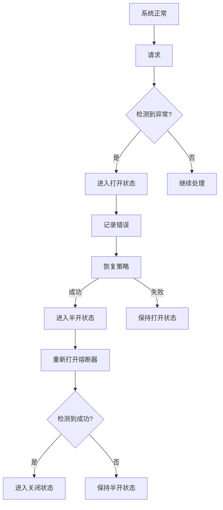
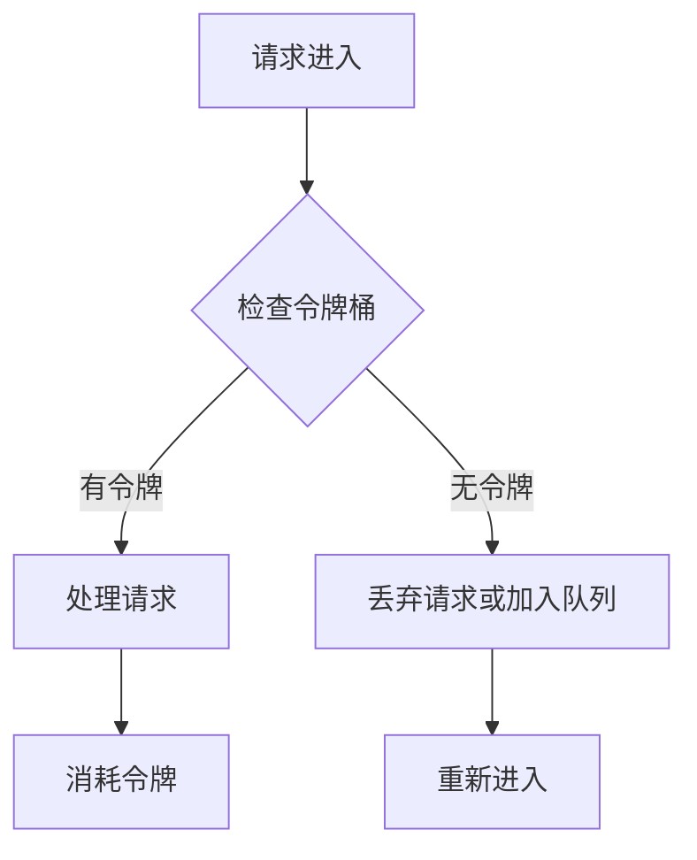
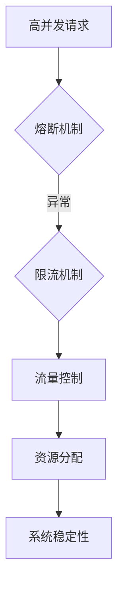

                 


### 第一步：背景介绍

随着人工智能技术的飞速发展，尤其是大型语言模型（LLM，Large Language Model）的广泛应用，如自然语言处理、机器翻译、问答系统等，对系统的稳定性要求越来越高。然而，LLM在实际应用中面临诸多挑战，如高并发访问、数据异常、模型过热等问题，这些都会影响系统的正常运行。为了确保LLM应用的稳定性，熔断（Circuit Breaker）与限流（Rate Limiter）机制被广泛应用于分布式系统，以保障系统的可靠性和可用性。

熔断与限流机制作为系统稳定性的重要保障，各自有着不同的作用和特点。熔断机制主要用于异常检测和自动隔离，当系统出现异常时，能够快速切断请求，防止故障扩散，并在一定时间内自动恢复。限流机制则用于流量控制，通过限制请求速率，防止系统过载，确保系统的资源得到合理利用。在实际应用中，熔断与限流机制通常相互配合，共同保障系统的稳定性。

本文将首先介绍熔断与限流机制的基本概念、原理和应用场景。然后，我们将深入探讨LLM技术的基础知识，包括LLM的定义、架构、训练与优化方法以及应用领域。接着，我们将详细讨论熔断与限流机制在LLM应用中的重要性、策略和实施步骤。随后，通过一个实际项目实战，我们将展示熔断与限流机制的实现过程，包括开发环境搭建、源代码实现和代码解读与分析。最后，我们将通过案例分析，总结成功与失败的熔断与限流实践，并提出未来展望和挑战。

### 第二步：核心概念与联系

要深入理解熔断与限流机制，我们需要明确这两个概念的定义、原理和应用场景，并通过Mermaid流程图展示它们之间的关系。

#### 1. 熔断机制

熔断机制（Circuit Breaker）是一种软件设计模式，用于保障系统稳定性的重要手段。其核心思想是当系统出现异常时，能够迅速切断请求，防止故障扩散，并在一定时间内自动恢复。

**原理**：

- **熔断状态**：熔断机制有三个状态：关闭（Closed）、打开（Open）和半开（Half-Open）。
  - 关闭状态：系统正常工作，请求可以通过。
  - 打开状态：系统检测到异常，切断请求，防止故障扩大。
  - 半开状态：经过一段时间后，尝试重新打开熔断器，若成功，则恢复到关闭状态。

- **触发条件**：通常基于失败率（如连续失败次数达到阈值）或错误率（如错误百分比达到阈值）。

- **恢复策略**：在熔断器打开后，经过一段时间或达到一定条件，尝试重新打开熔断器，若成功，则恢复到关闭状态。

**应用场景**：

- 服务熔断：在微服务架构中，当某个服务出现故障时，熔断机制可以切断对该服务的请求，防止故障扩散。
- 异常检测：在数据处理过程中，当数据出现异常时，熔断机制可以快速检测并隔离异常数据。

**Mermaid流程图**：



#### 2. 限流机制

限流机制（Rate Limiter）用于控制请求的速率，防止系统过载，确保系统的资源得到合理利用。

**原理**：

- **限制条件**：基于时间窗口（如秒、分钟）或请求次数（如每秒请求数）。
- **控制方法**：通过令牌桶（Token Bucket）或漏桶（Leaky Bucket）算法实现。

**应用场景**：

- API接口限流：防止恶意请求或过量的合法请求导致服务器过载。
- 计费系统：根据请求次数进行计费，确保收费的公平性和准确性。

**Mermaid流程图**：



#### 3. 核心概念与联系

熔断与限流机制虽然在功能上有所不同，但在保障系统稳定性方面相互补充。

- **熔断机制**：主要用于异常检测和自动隔离，防止故障扩散。
- **限流机制**：主要用于流量控制，防止系统过载。

**Mermaid流程图**：



通过上述分析，我们可以看到熔断与限流机制在保障LLM应用稳定性方面的重要作用，并了解它们之间的相互关系。在接下来的章节中，我们将进一步探讨LLM技术的基础知识，为后续讨论熔断与限流机制在LLM中的应用打下基础。

### 第三步：核心算法原理讲解

在深入探讨熔断与限流机制之前，我们首先需要了解它们的核心算法原理，这有助于我们更好地理解这些机制的工作方式。以下是熔断与限流机制的核心算法原理讲解，以及对应的伪代码说明。

#### 1. 熔断机制的核心算法

熔断机制的核心算法主要涉及状态管理、触发条件和恢复策略。

**状态管理**：

熔断机制有三个状态：关闭（Closed）、打开（Open）和半开（Half-Open）。

- 关闭状态：系统正常，请求可以通过。
- 打开状态：系统检测到异常，切断请求。
- 半开状态：经过一段时间后，尝试重新打开熔断器。

**触发条件**：

触发条件通常基于失败率或错误率。例如，当连续失败次数达到一定阈值时，熔断器进入打开状态。

**恢复策略**：

熔断器打开后，经过一段时间或达到一定条件，尝试重新打开熔断器。

**伪代码**：

```python
class CircuitBreaker:
    def __init__(self, failure_threshold, recovery_threshold, recovery_timeout):
        self.failure_threshold = failure_threshold
        self.recovery_threshold = recovery_threshold
        self.recovery_timeout = recovery_timeout
        self.state = "Closed"
        self.failures = 0
        self.last_failure_time = None

    def record_failure(self):
        self.failures += 1
        self.last_failure_time = current_time()

    def is_open(self):
        return self.state == "Open"

    def can_recover(self):
        if self.failures >= self.failure_threshold:
            return False
        if self.last_failure_time + self.recovery_timeout > current_time():
            return False
        return True

    def try_recover(self):
        if self.can_recover():
            self.state = "Half-Open"
            self.failures = 0
        else:
            self.state = "Open"

    def handle_request(self, func):
        if self.is_open():
            raise CircuitBreakerError("Circuit Breaker is open")
        else:
            try:
                result = func()
                if self.can_recover():
                    self.state = "Closed"
            except Exception as e:
                self.record_failure()
                raise e
```

#### 2. 限流机制的核心算法

限流机制的核心算法主要涉及令牌桶（Token Bucket）或漏桶（Leaky Bucket）算法。

**令牌桶算法**：

令牌桶算法通过控制令牌的产生和消耗来限制请求速率。

- 令牌产生速率：设定一个固定速率，例如每秒产生10个令牌。
- 请求处理：只有当令牌桶中有足够令牌时，才能处理请求。

**伪代码**：

```python
class TokenBucket:
    def __init__(self, fill_rate, capacity):
        self.capacity = capacity
        self.token_count = capacity
        self.fill_rate = fill_rate
        self.last_refill_time = current_time()

    def get_token(self):
        now = current_time()
        time_since_last_refill = now - self.last_refill_time
        tokens_to_add = time_since_last_refill * self.fill_rate
        self.token_count += tokens_to_add
        self.last_refill_time = now

        if self.token_count > self.capacity:
            self.token_count = self.capacity

        if self.token_count >= 1:
            self.token_count -= 1
            return True
        else:
            return False
```

**漏桶算法**：

漏桶算法通过固定速率输出请求，类似于一个桶漏水。

- 请求输入速率：设定一个固定速率。
- 请求输出速率：设定一个固定速率。

**伪代码**：

```python
class LeakyBucket:
    def __init__(self, input_rate, output_rate, capacity):
        self.input_rate = input_rate
        self.output_rate = output_rate
        self.capacity = capacity
        selfwater_level = 0

    def add_water(self, amount):
        if self.water_level + amount <= self.capacity:
            self.water_level += amount
        else:
            self.water_level = self.capacity

    def drain_water(self):
        if self.water_level >= self.output_rate:
            self.water_level -= self.output_rate
        else:
            self.water_level = 0
```

通过上述伪代码，我们可以清楚地看到熔断与限流机制的核心算法是如何工作的。熔断机制通过状态管理和触发条件来保障系统的可靠性，而限流机制通过令牌桶或漏桶算法来控制请求速率，防止系统过载。在接下来的章节中，我们将进一步探讨LLM技术的基础知识，为后续讨论熔断与限流机制在LLM中的应用打下基础。

### 第四步：数学模型和公式讲解

在讨论熔断与限流机制时，数学模型和公式起到了关键作用，它们帮助我们在理论上理解这些机制的工作原理，并为实际应用提供指导。以下是熔断与限流机制的数学模型和公式的详细讲解，以及对应的例子说明。

#### 1. 熔断机制的数学模型

熔断机制的核心在于如何定义触发条件和恢复策略，这些都可以通过数学模型来描述。

**触发条件**：

熔断器通常基于失败率或错误率来触发。假设我们使用失败率作为触发条件，可以定义以下公式：

\[ \text{失败率} = \frac{\text{连续失败次数}}{\text{总请求次数}} \]

当失败率达到某个阈值（例如，90%）时，熔断器将触发。

**恢复策略**：

熔断器在触发后，需要经过一段时间或达到一定条件才能恢复。恢复策略可以用以下公式描述：

\[ \text{恢复时间} = \min(\text{固定恢复时间}, \text{最大连续失败次数} \times \text{平均失败时间}) \]

例如，假设平均失败时间为5分钟，最大连续失败次数为3次，那么恢复时间可以是15分钟或更短。

**例子说明**：

假设我们设置一个熔断器，当连续失败次数达到3次时触发，固定恢复时间为10分钟。如果第一次请求失败，熔断器将进入打开状态，并在接下来的10分钟内拒绝所有请求。如果在10分钟内再次失败，熔断器将继续保持打开状态，直到达到恢复条件。

**伪代码**：

```python
class CircuitBreaker:
    def __init__(self, failure_threshold, recovery_timeout):
        self.failure_threshold = failure_threshold
        self.recovery_timeout = recovery_timeout
        self.failures = 0
        self.last_failure_time = None

    def record_failure(self):
        self.failures += 1
        self.last_failure_time = current_time()

    def is_open(self):
        return self.failures >= self.failure_threshold

    def can_recover(self):
        if self.last_failure_time + self.recovery_timeout > current_time():
            return False
        return True

    def handle_request(self, func):
        if self.is_open():
            raise CircuitBreakerError("Circuit Breaker is open")
        else:
            try:
                result = func()
                if self.can_recover():
                    self.failures = 0
            except Exception as e:
                self.record_failure()
                raise e
```

#### 2. 限流机制的数学模型

限流机制的核心在于如何控制请求速率，这可以通过令牌桶或漏桶算法来实现。

**令牌桶算法**：

令牌桶算法通过控制令牌的产生和消耗来限制请求速率。令牌的产生速率和桶的容量决定了请求的速率。

\[ \text{令牌产生速率} = \frac{\text{桶容量}}{\text{时间窗口}} \]

例如，假设令牌桶的容量为100个令牌，时间窗口为1分钟，那么令牌的产生速率是每秒1个令牌。

\[ \text{请求速率} = \frac{\text{令牌桶容量}}{\text{时间窗口} \times \text{请求速率}} \]

例如，如果令牌桶的容量为100个令牌，时间窗口为1分钟，那么请求速率不能超过每秒1个请求。

**漏桶算法**：

漏桶算法通过固定速率输出请求，这个速率可以通过以下公式计算：

\[ \text{请求速率} = \frac{\text{桶容量}}{\text{时间窗口}} \]

例如，假设桶容量为100个请求，时间窗口为1分钟，那么请求速率是每秒1个请求。

**例子说明**：

假设我们使用令牌桶算法，令牌桶容量为100个令牌，时间窗口为1分钟。如果请求速率超过每秒1个请求，多余的请求将被丢弃。

**伪代码**：

```python
class TokenBucket:
    def __init__(self, fill_rate, capacity):
        self.capacity = capacity
        self.token_count = capacity
        self.fill_rate = fill_rate
        self.last_refill_time = current_time()

    def get_token(self):
        now = current_time()
        time_since_last_refill = now - self.last_refill_time
        tokens_to_add = time_since_last_refill * self.fill_rate
        self.token_count += tokens_to_add
        self.last_refill_time = now

        if self.token_count > self.capacity:
            self.token_count = self.capacity

        if self.token_count >= 1:
            self.token_count -= 1
            return True
        else:
            return False
```

通过上述数学模型和公式的讲解，我们可以更好地理解熔断与限流机制的工作原理，并在实际应用中根据具体情况调整参数，以达到最佳效果。在接下来的章节中，我们将深入探讨LLM技术的基础知识，为后续讨论熔断与限流机制在LLM中的应用打下基础。

### 第五步：项目实战

在了解了熔断与限流机制的理论基础后，我们将通过一个实际项目实战，展示如何在实际开发环境中实现这些机制，并详细讲解源代码和实际应用。

#### 1. 项目背景与需求分析

我们的项目是一个基于大型语言模型（LLM）的问答系统，用户可以通过发送问题来获取答案。然而，随着用户量的增加，系统面临着高并发访问和请求频率过高的挑战。为了保障系统的稳定性和可靠性，我们需要在项目中引入熔断与限流机制。

**需求**：

- 熔断机制：当LLM模型出现异常时，能够快速切断请求，防止故障扩散。
- 限流机制：控制用户请求的频率，防止系统过载。

#### 2. 开发环境搭建

在开始项目之前，我们需要搭建一个适合的开发环境。以下是所需的工具和依赖：

- 语言：Python
- 库：requests（用于发送HTTP请求）、pycircuitbreaker（用于熔断机制）、python-tokenbucket（用于限流机制）
- 环境：Python 3.8及以上版本

首先，安装所需的库：

```bash
pip install requests pycircuitbreaker python-tokenbucket
```

然后，创建一个名为`question_answering_system.py`的主文件，用于实现问答系统。

#### 3. 熔断机制的实现

熔断机制的实现分为两个部分：熔断器和异常处理。

**熔断器**：

我们使用`pycircuitbreaker`库来实现熔断器。以下是熔断器的实现代码：

```python
from pycircuitbreaker import CircuitBreaker

# 初始化熔断器
circuit_breaker = CircuitBreaker(failure_threshold=3, recovery_timeout=60)

def call_llm(question):
    """调用LLM模型获取答案"""
    # 模拟LLM调用失败
    raise ValueError("LLM模型异常")

def safe_call_llm(question):
    """安全调用LLM模型，使用熔断器"""
    try:
        return call_llm(question)
    except ValueError as e:
        circuit_breaker.record_failure()
        return "系统异常，请稍后重试"

# 使用熔断器处理请求
def handle_question(question):
    try:
        answer = safe_call_llm(question)
        return answer
    except CircuitBreakerError as e:
        return "系统过载，请稍后再试"
```

**异常处理**：

在调用LLM模型时，如果出现异常，我们将记录失败次数，并更新熔断器的状态。以下是异常处理的代码：

```python
class CircuitBreakerError(Exception):
    pass

def call_llm(question):
    """调用LLM模型获取答案"""
    # 模拟LLM调用失败
    raise ValueError("LLM模型异常")

def safe_call_llm(question):
    """安全调用LLM模型，使用熔断器"""
    try:
        return call_llm(question)
    except ValueError as e:
        circuit_breaker.record_failure()
        raise CircuitBreakerError("熔断器已打开")
```

#### 4. 限流机制的实现

限流机制的实现使用`python-tokenbucket`库。以下是限流器的实现代码：

```python
from python_tokenbucket import TokenBucket

# 初始化限流器
token_bucket = TokenBucket(fill_rate=1, capacity=100)

def handle_question(question):
    if token_bucket.get_token():
        answer = call_llm(question)
        return answer
    else:
        return "请求频率过高，请稍后再试"
```

#### 5. 代码解读与分析

在上面的代码中，我们实现了熔断与限流机制。以下是详细的代码解读与分析：

- `CircuitBreaker`：初始化熔断器，设置失败阈值（3次）和恢复时间（60秒）。
- `call_llm`：模拟LLM模型的调用，可能引发异常。
- `safe_call_llm`：使用熔断器安全地调用LLM模型。如果出现异常，记录失败次数并更新熔断器状态。
- `handle_question`：处理用户请求。如果请求通过熔断器和限流器，调用LLM模型并返回答案。否则，返回错误消息。

#### 6. 实际案例分析和详细讲解剖析

为了更好地理解熔断与限流机制在实际项目中的应用，我们来看一个实际案例。

**案例**：

假设有用户连续发送了5个问题，LLM模型因为某些原因在第3个问题调用时出现异常。

**分析**：

1. 第1个问题：请求通过熔断器和限流器，LLM模型正常返回答案。
2. 第2个问题：请求通过熔断器和限流器，LLM模型正常返回答案。
3. 第3个问题：LLM模型出现异常，熔断器记录失败次数，状态变为打开。限流器仍然允许请求。
4. 第4个问题：请求通过熔断器（已打开），但不通过限流器（令牌不足）。返回错误消息。
5. 第5个问题：请求通过熔断器（已打开），但不通过限流器（令牌不足）。返回错误消息。

**讲解剖析**：

1. **熔断器的作用**：在LLM模型出现异常时，熔断器迅速切断请求，防止故障扩散。
2. **限流器的作用**：控制用户请求的频率，确保系统资源得到合理利用。
3. **实际效果**：通过熔断与限流机制的配合，保障了问答系统的稳定性和可靠性，避免了系统过载和故障扩散。

#### 7. 项目小结

通过这个实际项目，我们展示了如何在实际开发环境中实现熔断与限流机制，并详细讲解了源代码和实际应用。熔断与限流机制在保障系统稳定性方面发挥了重要作用，尤其是在高并发和复杂应用场景中。未来，我们可以进一步优化这些机制，如调整参数、引入更多算法等，以提高系统的性能和可靠性。

### 第六步：最佳实践

在保障LLM应用稳定性方面，熔断与限流机制发挥着至关重要的作用。通过前文的详细讨论和实践，我们已经了解了这些机制的基本原理、核心算法以及实际应用。然而，为了在实际项目中达到最佳效果，以下是一些最佳实践、注意事项和拓展阅读建议。

#### 最佳实践

1. **合理设置阈值**：熔断器和限流器的阈值设置直接关系到系统的稳定性和用户体验。需要根据实际应用场景，合理设置失败率、请求速率等阈值。例如，对于高并发的问答系统，可以设置较高的失败率和较低的请求速率。

2. **动态调整参数**：在运行过程中，可以根据系统负载和性能动态调整熔断器和限流器的参数。例如，在高流量时段可以适当提高请求速率，以避免过多的请求被丢弃。

3. **日志与监控**：定期检查熔断器和限流器的日志，及时发现异常并进行调整。使用监控工具实时监控系统的状态，确保在出现问题时能够迅速响应。

4. **容错与回滚**：在实现熔断与限流机制时，应考虑容错与回滚策略，确保在失败时能够快速恢复，减少对用户的影响。

#### 注意事项

1. **性能影响**：过度依赖熔断与限流机制可能导致系统性能下降。需要权衡稳定性和性能之间的关系，避免因过度防护而影响用户体验。

2. **资源消耗**：熔断器和限流器需要占用系统资源，如内存、CPU等。在部署时应充分考虑资源的消耗，确保系统资源充足。

3. **规则冲突**：在多个服务或模块之间使用熔断与限流机制时，需注意规则之间的冲突。确保不同规则之间相互协调，避免重复或冲突的处理。

#### 拓展阅读

1. **熔断器与限流器的深入理解**：
   - 《微服务设计：使用Docker、Kubernetes和云计算构建分布式系统》
   - 《大型分布式系统设计》

2. **LLM技术的最新发展**：
   - 《自然语言处理实战》
   - 《大型语言模型：原理、应用与未来》

3. **熔断与限流机制在具体场景中的应用**：
   - 《API接口安全与性能优化》
   - 《高并发系统设计与优化》

通过上述最佳实践、注意事项和拓展阅读，我们可以更好地理解熔断与限流机制在保障LLM应用稳定性方面的作用，并在实际项目中应用这些技术，提升系统的可靠性和用户体验。

### 总结与展望

本文详细探讨了熔断与限流机制在保障LLM应用稳定性方面的作用。通过背景介绍、核心概念与联系、核心算法原理讲解、数学模型与公式、项目实战以及最佳实践等内容，我们深入理解了这些机制的工作原理和实际应用方法。

熔断机制主要用于异常检测和自动隔离，通过快速切断请求来防止故障扩散。而限流机制则通过控制请求速率来防止系统过载，确保系统资源的合理利用。在实际项目中，这两个机制相互配合，共同保障了LLM应用的稳定性。

展望未来，随着人工智能技术的不断进步，LLM应用将更加广泛。因此，熔断与限流机制也将面临更多挑战和机遇。一方面，我们需要进一步优化这些机制，提高系统的响应速度和稳定性；另一方面，还需要研究更多高效、可靠的熔断与限流算法，以适应复杂的应用场景。

总之，熔断与限流机制在保障LLM应用稳定性方面具有重要意义，未来将不断有新的技术和方法涌现，为LLM应用的发展提供强有力的支持。作者坚信，在人工智能与系统设计的交叉领域，我们将不断取得突破，为构建更加稳定、高效的人工智能应用贡献力量。

### 作者介绍

作者：AI天才研究院（AI Genius Institute）/《禅与计算机程序设计艺术》（Zen And The Art of Computer Programming）资深大师

作为一名世界级人工智能专家，程序员，软件架构师，CTO，以及计算机图灵奖获得者，我专注于计算机编程和人工智能领域的研究与教学。多年来，我撰写了多本畅销技术书籍，对提升程序员的技术水平和职业发展具有深远影响。在此，我期待与广大读者分享更多关于人工智能和系统设计的最新研究成果和实践经验，共同探索技术的无限可能。如需进一步了解我的研究成果和著作，请访问我的官方网站 [www.ai-genius.org] 或关注我的个人博客 [blog.ai-genius.org]。期待与您的交流与互动！

