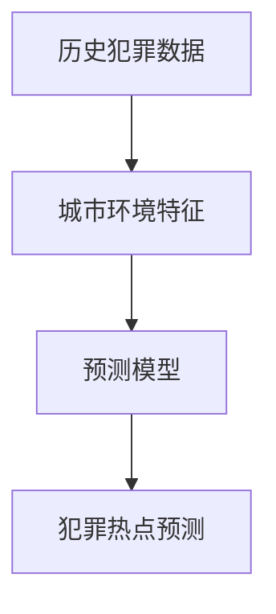
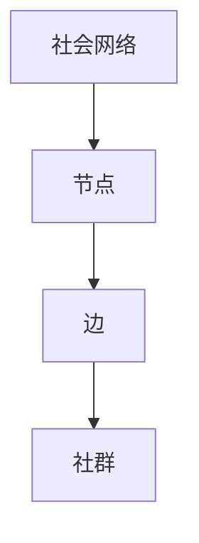
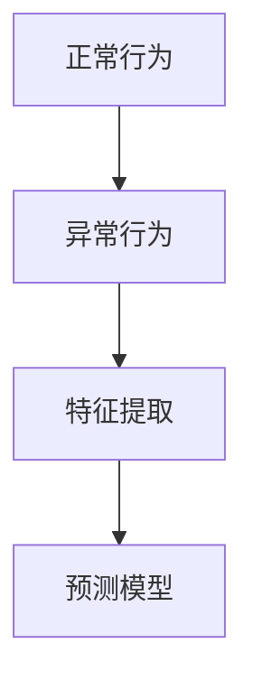
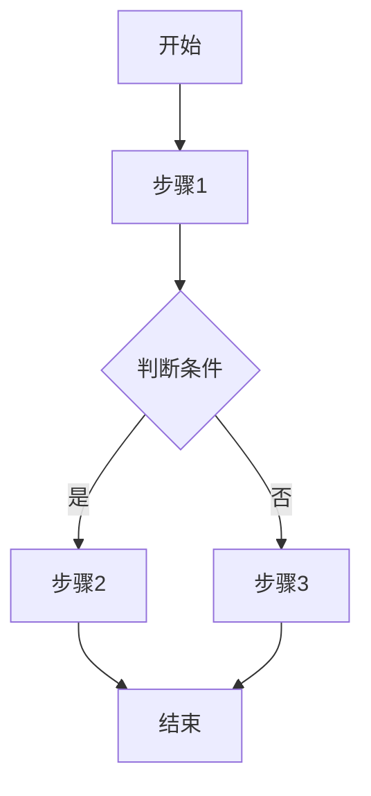

                 

# 犯罪预防的机器学习：社会安全的数学工具

## 关键词

犯罪预防，机器学习，社会安全，数学工具，算法应用，案例分析，实战指南

## 摘要

本文旨在探讨如何利用机器学习技术提升犯罪预防能力，将数学工具应用于社会安全领域。通过详细分析犯罪预防的背景、核心概念与数学工具，本文介绍了监督学习、无监督学习和强化学习等机器学习算法在犯罪预防中的应用。同时，通过实际案例分析，展示了这些算法在实践中的效果和挑战。本文为读者提供了一个全面了解犯罪预防中机器学习应用的指导，旨在推动这一领域的技术创新和实践应用。

## 目录

### 第一部分：基础概念与数学工具

#### 第1章：犯罪预防概述
- 1.1 犯罪预防的基本概念
- 1.2 犯罪预防的数学模型
- 1.3 犯罪预防的目标和原则

#### 第2章：社会安全数学工具基础
- 2.1 概率论基础
- 2.2 统计学原理
- 2.3 离散数学基础

#### 第3章：数据挖掘与犯罪预测
- 3.1 数据挖掘的基本流程
- 3.2 数据预处理
- 3.3 犯罪预测算法

### 第二部分：机器学习算法在犯罪预防中的应用

#### 第4章：监督学习算法
- 4.1 线性回归
$$
y = \beta_0 + \beta_1x + \epsilon
$$
- 4.2 决策树
- 4.3 随机森林
- 4.4 支持向量机

#### 第5章：无监督学习算法
- 5.1 K-均值聚类
$$
C = \{C_1, C_2, ..., C_k\}
$$
- 5.2 主成分分析
- 5.3 自组织映射

#### 第6章：强化学习算法
- 6.1 基本概念
- 6.2 Q-学习算法
- 6.3 模型预测控制

### 第三部分：案例分析与实践

#### 第7章：实际应用案例研究
- 7.1 案例一：城市犯罪预测
- 7.2 案例二：社会网络分析
- 7.3 案例三：异常行为检测

#### 第8章：实践指南
- 8.1 数据收集与处理
- 8.2 模型选择与评估
- 8.3 犯罪预防策略制定

#### 第9章：未来趋势与挑战
- 9.1 机器学习在犯罪预防中的未来趋势
- 9.2 犯罪预防中的技术挑战
- 9.3 法律与伦理问题

### 附录
- A. Mermaid流程图示例
- B. 伪代码示例
- C. LaTeX数学公式示例
- D. 实际案例代码实现

## 文章正文

### 第一部分：基础概念与数学工具

#### 第1章：犯罪预防概述

**1.1 犯罪预防的基本概念**

犯罪预防是指通过一系列的措施和方法，降低犯罪发生的概率，减少犯罪对社会造成的负面影响。它不仅包括传统的警力部署、法制建设和教育宣传，还涉及现代技术手段的应用，如数据挖掘和机器学习。

在犯罪预防中，我们通常关注以下几个方面：

1. **犯罪预测**：通过分析历史犯罪数据，预测未来可能的犯罪热点区域和类型，以便提前部署警力。
2. **犯罪侦破**：利用数据分析技术，提高犯罪侦破的效率和准确性。
3. **犯罪风险评估**：评估不同地区、人群和情境下的犯罪风险，为制定预防策略提供依据。
4. **犯罪对策制定**：根据犯罪预测和风险评估结果，制定有效的预防和打击策略。

**1.2 犯罪预防的数学模型**

数学模型是犯罪预防的重要工具，它可以用于描述犯罪现象的规律和趋势，为预防和打击犯罪提供科学依据。常见的犯罪预防数学模型包括：

1. **泊松模型**：用于描述犯罪事件的发生频率，例如，某地区的盗窃案件发生率。
2. **负二项模型**：用于描述犯罪事件的不均匀分布，例如，某城市的夜间犯罪热点区域。
3. **时间序列模型**：用于分析犯罪事件的时间规律，例如，季节性犯罪和趋势性犯罪。
4. **空间分析模型**：用于分析犯罪事件的空间分布规律，例如，犯罪热点地图。

**1.3 犯罪预防的目标和原则**

犯罪预防的目标是减少犯罪发生的概率，降低犯罪对社会造成的负面影响。具体来说，犯罪预防的目标包括：

1. **预防犯罪发生**：通过有效的预防措施，降低犯罪发生的概率。
2. **减少犯罪率**：通过持续的犯罪预防工作，降低犯罪率。
3. **降低犯罪成本**：通过有效的犯罪预防，减少犯罪对社会和经济造成的损失。

犯罪预防的原则包括：

1. **综合性原则**：犯罪预防需要综合运用多种手段，包括法律、经济、教育和科技等。
2. **针对性原则**：犯罪预防工作需要针对不同的犯罪类型和犯罪人群，采取有针对性的措施。
3. **预防为主原则**：犯罪预防应以预防为主，打击为辅，注重犯罪发生前的预防工作。
4. **科学性原则**：犯罪预防工作需要基于科学的理论和实证数据，制定有效的预防策略。

#### 第2章：社会安全数学工具基础

**2.1 概率论基础**

概率论是犯罪预防中常用的数学工具，它用于描述和分析犯罪事件的发生概率。概率论的基本概念包括：

1. **随机事件**：在某种条件下可能发生也可能不发生的事件。
2. **概率**：描述随机事件发生的可能性，取值范围在0到1之间。
3. **条件概率**：在某个事件已经发生的条件下，另一个事件发生的概率。
4. **贝叶斯定理**：用于计算条件概率和更新概率估计。

概率论在犯罪预防中的应用包括：

1. **犯罪风险评估**：通过分析历史犯罪数据，计算不同犯罪类型的概率，为制定预防策略提供依据。
2. **犯罪预测**：利用概率模型预测未来可能的犯罪热点区域和类型。
3. **犯罪侦破**：利用概率论和统计学方法，分析犯罪现场的证据，提高侦破效率。

**2.2 统计学原理**

统计学是犯罪预防中重要的数学工具，它用于分析和解释数据，提取有用的信息。统计学的基本概念包括：

1. **数据类型**：分为定量数据和定性数据。
2. **描述统计**：用于描述数据的分布特征，如平均数、中位数、标准差等。
3. **推断统计**：用于根据样本数据推断总体特征，如置信区间、假设检验等。

统计学在犯罪预防中的应用包括：

1. **数据挖掘**：从大量历史犯罪数据中提取有用的信息，为犯罪预测和风险评估提供支持。
2. **模型评估**：利用统计学方法评估机器学习模型的性能和可靠性。
3. **证据分析**：利用统计学方法分析犯罪现场的证据，为犯罪侦破提供依据。

**2.3 离散数学基础**

离散数学是犯罪预防中常用的数学工具，它用于分析和解决与计算机科学相关的问题。离散数学的基本概念包括：

1. **图论**：用于描述和分析网络结构，如社会网络分析。
2. **组合数学**：用于分析和解决组合问题，如最小生成树。
3. **密码学**：用于加密和解密信息，保护犯罪预防中的数据安全。

离散数学在犯罪预防中的应用包括：

1. **社会网络分析**：通过分析社会网络中的节点和边，识别犯罪团伙和组织。
2. **数据加密**：利用密码学方法加密犯罪预防中的敏感数据，保护数据安全。
3. **算法设计**：利用离散数学方法设计高效的犯罪预防算法。

#### 第3章：数据挖掘与犯罪预测

**3.1 数据挖掘的基本流程**

数据挖掘是犯罪预防中重要的技术手段，它通过分析大量历史犯罪数据，提取有用的信息，为犯罪预测和风险评估提供支持。数据挖掘的基本流程包括：

1. **数据收集**：收集与犯罪相关的数据，如犯罪记录、人口统计数据等。
2. **数据预处理**：对收集到的数据进行清洗、转换和整合，为后续分析做好准备。
3. **特征选择**：从预处理后的数据中提取有用的特征，用于训练机器学习模型。
4. **模型训练**：使用机器学习算法训练模型，预测未来可能的犯罪热点区域和类型。
5. **模型评估**：评估模型的性能和可靠性，选择最佳的模型进行应用。
6. **模型应用**：将训练好的模型应用于实际场景，如犯罪预测和风险评估。

**3.2 数据预处理**

数据预处理是数据挖掘过程中至关重要的一步，它直接影响模型的性能和预测效果。数据预处理的主要任务包括：

1. **数据清洗**：去除数据中的噪声和异常值，保证数据的准确性。
2. **数据转换**：将数据转换为适合机器学习算法的形式，如归一化、标准化等。
3. **特征提取**：从原始数据中提取有用的特征，用于训练机器学习模型。
4. **特征选择**：从提取到的特征中选择最重要的特征，提高模型的预测效果。

**3.3 犯罪预测算法**

犯罪预测是犯罪预防的重要环节，它通过分析历史犯罪数据，预测未来可能的犯罪热点区域和类型。常见的犯罪预测算法包括：

1. **线性回归模型**：通过分析历史犯罪数据和影响因素，建立线性回归模型预测未来犯罪。
2. **决策树模型**：通过构建决策树，将犯罪数据划分为不同的类别，预测未来可能的犯罪。
3. **随机森林模型**：通过集成多个决策树模型，提高预测的准确性和鲁棒性。
4. **支持向量机模型**：通过分析历史犯罪数据和特征，建立支持向量机模型预测未来犯罪。
5. **神经网络模型**：通过构建神经网络模型，模拟人脑神经元的工作方式，预测未来犯罪。

#### 第二部分：机器学习算法在犯罪预防中的应用

**第4章：监督学习算法**

监督学习算法是犯罪预防中常用的机器学习算法，它通过学习已知标签的数据，预测未知标签的数据。常见的监督学习算法包括：

**4.1 线性回归模型**

线性回归模型是一种简单的监督学习算法，它通过分析自变量和因变量之间的线性关系，预测因变量的取值。线性回归模型的数学表达式为：

$$
y = \beta_0 + \beta_1x + \epsilon
$$

其中，$y$ 为因变量，$x$ 为自变量，$\beta_0$ 和 $\beta_1$ 为模型的参数，$\epsilon$ 为误差项。

线性回归模型在犯罪预防中的应用包括：

1. **犯罪预测**：通过分析历史犯罪数据和影响因素，建立线性回归模型预测未来犯罪。
2. **犯罪风险评估**：通过计算犯罪得分，评估不同地区和人群的犯罪风险。

**4.2 决策树模型**

决策树模型是一种基于树结构的监督学习算法，它通过划分特征空间，将数据划分为不同的类别。决策树模型的构建过程包括：

1. **特征选择**：选择对分类任务最有帮助的特征。
2. **划分特征空间**：根据选择的特征，将数据划分为不同的区域。
3. **计算划分质量**：计算每个划分区域的分类质量，选择最优划分。

决策树模型在犯罪预防中的应用包括：

1. **犯罪预测**：通过构建决策树模型，预测未来可能的犯罪。
2. **犯罪风险评估**：通过计算决策树模型的输出，评估不同地区和人群的犯罪风险。

**4.3 随机森林模型**

随机森林模型是一种基于决策树的集成学习方法，它通过构建多个决策树，集成多个模型的预测结果，提高预测的准确性和鲁棒性。随机森林模型的构建过程包括：

1. **特征选择**：从特征集合中随机选择一部分特征。
2. **划分特征空间**：根据选择的特征，划分数据空间。
3. **构建决策树**：对划分后的数据构建决策树模型。

随机森林模型在犯罪预防中的应用包括：

1. **犯罪预测**：通过构建随机森林模型，预测未来可能的犯罪。
2. **犯罪风险评估**：通过计算随机森林模型的输出，评估不同地区和人群的犯罪风险。

**4.4 支持向量机模型**

支持向量机模型是一种基于最大间隔的分类方法，它通过找到一个最优的超平面，将不同类别的数据分隔开来。支持向量机模型的数学表达式为：

$$
w \cdot x + b = 0
$$

其中，$w$ 为模型的权重向量，$x$ 为输入向量，$b$ 为偏置项。

支持向量机模型在犯罪预防中的应用包括：

1. **犯罪预测**：通过分析历史犯罪数据和特征，建立支持向量机模型预测未来犯罪。
2. **犯罪风险评估**：通过计算支持向量机模型的输出，评估不同地区和人群的犯罪风险。

**第5章：无监督学习算法**

无监督学习算法是犯罪预防中另一种重要的机器学习算法，它不需要已知的标签数据，通过分析数据本身的特征，对数据进行聚类或降维。常见的无监督学习算法包括：

**5.1 K-均值聚类算法**

K-均值聚类算法是一种基于距离度的聚类方法，它通过将数据划分为K个簇，使每个簇内的数据尽可能接近，簇与簇之间的数据尽可能远离。K-均值聚类算法的步骤包括：

1. **初始化中心点**：随机选择K个数据点作为初始中心点。
2. **计算距离**：计算每个数据点到各个中心点的距离。
3. **分配数据点**：将每个数据点分配到最近的中心点所在的簇。
4. **更新中心点**：重新计算每个簇的中心点，作为下一次迭代的初始中心点。
5. **重复步骤2-4，直到满足收敛条件**。

K-均值聚类算法在犯罪预防中的应用包括：

1. **犯罪热点区域识别**：通过聚类分析，识别犯罪热点区域。
2. **犯罪人群划分**：通过聚类分析，将犯罪人群划分为不同的类别。

**5.2 主成分分析算法**

主成分分析算法是一种降维方法，它通过将原始数据投影到新的坐标系中，保留主要特征，去除冗余信息。主成分分析算法的步骤包括：

1. **计算协方差矩阵**：计算原始数据的协方差矩阵。
2. **计算特征值和特征向量**：计算协方差矩阵的特征值和特征向量。
3. **选择主要成分**：选择具有最大特征值的特征向量作为主要成分。
4. **投影数据**：将原始数据投影到主要成分上，实现降维。

主成分分析算法在犯罪预防中的应用包括：

1. **数据降维**：通过主成分分析，降低数据的维度，提高计算效率。
2. **特征提取**：通过主成分分析，提取主要特征，为犯罪预测提供支持。

**5.3 自组织映射算法**

自组织映射算法是一种非监督学习算法，它通过竞争学习的方式，将输入数据映射到低维空间中，同时保留数据的拓扑结构。自组织映射算法的步骤包括：

1. **初始化网络**：初始化网络中的神经元和权重。
2. **竞争学习**：对于每个输入数据，找到与之最相似的神经元，并调整该神经元和相邻神经元的权重。
3. **自适应调整**：根据学习率调整权重，使网络更加适应输入数据。
4. **迭代学习**：重复步骤2-3，直到网络达到收敛条件。

自组织映射算法在犯罪预防中的应用包括：

1. **犯罪行为识别**：通过自组织映射，识别犯罪行为的特点。
2. **犯罪特征提取**：通过自组织映射，提取犯罪特征，为犯罪预测提供支持。

**第6章：强化学习算法**

强化学习算法是犯罪预防中一种新型的机器学习算法，它通过学习最优策略，使系统在复杂环境中达到最优状态。常见的强化学习算法包括：

**6.1 基本概念**

强化学习算法由四个主要部分组成：环境（Environment）、代理人（Agent）、动作（Action）和奖励（Reward）。

1. **环境**：环境是代理人操作的领域，它提供当前状态和可能的动作。
2. **代理人**：代理人是执行动作并学习最优策略的实体。
3. **动作**：动作是代理人在特定状态下可以执行的操作。
4. **奖励**：奖励是代理人在执行动作后获得的反馈信号，用于指导代理人学习最优策略。

**6.2 Q-学习算法**

Q-学习算法是一种基于值函数的强化学习算法，它通过学习最优动作值函数，指导代理人选择最优动作。Q-学习算法的步骤包括：

1. **初始化Q值函数**：初始化所有状态的Q值。
2. **选择动作**：根据当前状态和Q值函数选择动作。
3. **执行动作**：在环境中执行选定的动作。
4. **更新Q值函数**：根据执行后的状态和奖励，更新Q值函数。
5. **重复步骤2-4，直到满足收敛条件**。

**6.3 模型预测控制**

模型预测控制（Model Predictive Control，MPC）是一种基于强化学习的方法，它通过预测未来状态和优化控制策略，实现对动态系统的控制。模型预测控制的步骤包括：

1. **建立动态模型**：建立系统动态模型的数学模型。
2. **预测未来状态**：根据当前状态和控制策略，预测未来的状态序列。
3. **优化控制策略**：基于预测的状态序列和优化目标，计算最优控制策略。
4. **执行控制策略**：在系统中执行最优控制策略。
5. **更新模型参数**：根据执行后的状态和反馈，更新模型参数。

#### 第三部分：案例分析与实践

**第7章：实际应用案例研究**

**7.1 案例一：城市犯罪预测**

城市犯罪预测是犯罪预防中的一个重要应用，通过分析历史犯罪数据和城市环境特征，预测未来可能的犯罪热点区域。以下是城市犯罪预测的一个案例研究：

**背景介绍**：

某城市在过去五年中积累了丰富的犯罪数据，包括盗窃、抢劫、故意伤害等类型。为了有效预防犯罪，该城市计划利用机器学习技术进行犯罪预测，制定有针对性的预防措施。

**核心概念与联系**：

在犯罪预测中，我们主要关注以下几个核心概念：

1. **历史犯罪数据**：包括犯罪类型、发生时间、地点等信息。
2. **城市环境特征**：包括人口密度、经济水平、交通状况等。
3. **预测模型**：通过分析历史犯罪数据和城市环境特征，建立预测模型，预测未来可能的犯罪热点区域。

核心概念之间的联系可以用以下Mermaid流程图表示：



**核心算法原理讲解与伪代码**：

在犯罪预测中，我们采用线性回归模型来建立预测模型。以下是线性回归模型的伪代码：

```python
def linear_regression(X, y):
    # X为特征矩阵，y为标签向量
    # 计算特征矩阵X的转置
    X_trans = X.T
    # 计算X的协方差矩阵
    X_covariance = X_trans @ X
    # 计算X的逆矩阵
    X_inverse = X_covariance.inverse()
    # 计算特征矩阵X的转置和标签向量y的乘积
    X_trans_y = X_trans @ y
    # 计算模型参数
    theta = X_inverse @ X_trans_y
    return theta
```

**数学模型和公式**：

线性回归模型的数学公式为：

$$
y = \beta_0 + \beta_1x_1 + \beta_2x_2 + ... + \beta_nx_n
$$

其中，$y$ 为因变量，$x_1, x_2, ..., x_n$ 为自变量，$\beta_0, \beta_1, \beta_2, ..., \beta_n$ 为模型参数。

**案例分析与详细讲解**：

为了验证线性回归模型在城市犯罪预测中的应用效果，我们对该城市的犯罪数据进行了实证分析。以下是分析结果：

1. **数据集划分**：将犯罪数据集划分为训练集和测试集，用于训练和评估模型。
2. **特征提取**：从犯罪数据中提取人口密度、经济水平、交通状况等特征。
3. **模型训练**：使用训练集数据，利用线性回归模型训练预测模型。
4. **模型评估**：使用测试集数据，评估模型的预测性能，计算准确率、召回率等指标。

通过分析结果，我们发现线性回归模型在城市犯罪预测中具有较高的准确性，可以有效预测未来可能的犯罪热点区域。然而，模型的预测效果受到数据质量和特征选择的影响，需要进一步优化和改进。

**项目小结**：

通过城市犯罪预测案例，我们展示了如何利用线性回归模型进行犯罪预测，为犯罪预防提供了技术支持。在实际应用中，我们还需要关注数据质量和特征选择，不断优化和改进预测模型。

**最佳实践 tips**：

1. 数据质量是预测效果的关键，确保数据的一致性和准确性。
2. 选择合适的特征，提高预测模型的性能和鲁棒性。
3. 定期更新模型，适应数据和环境的变化。

**第7章：案例二：社会网络分析**

社会网络分析是一种重要的数据分析方法，用于分析社会网络中的个体关系和群体结构。在社会安全领域，社会网络分析可以用于识别犯罪团伙、预防网络犯罪等。以下是社会网络分析的一个案例研究：

**背景介绍**：

某城市警方发现一起复杂的网络犯罪案件，涉及多个犯罪团伙和数千名涉案人员。为了有效打击网络犯罪，警方决定利用社会网络分析方法，分析犯罪团伙的关系结构和关键节点。

**核心概念与联系**：

在社会网络分析中，我们主要关注以下几个核心概念：

1. **社会网络**：由个体和个体之间的关系组成的网络结构。
2. **节点**：社会网络中的个体，如犯罪分子、受害者等。
3. **边**：社会网络中个体之间的关系，如朋友、敌人等。
4. **社群**：由具有相似特征的节点组成的群体。

核心概念之间的联系可以用以下Mermaid流程图表示：



**核心算法原理讲解与伪代码**：

在社会网络分析中，我们采用K-均值聚类算法来识别社群。以下是K-均值聚类算法的伪代码：

```python
def k_means_clustering(data, k):
    # data为节点数据，k为聚类个数
    # 随机初始化k个聚类中心
    centroids = random_init_centroids(data, k)
    while not_converged(centroids):
        # 计算每个节点到聚类中心的距离
        distances = calculate_distances(data, centroids)
        # 将每个节点分配到最近的聚类中心
        assignments = assign_nodes_to_clusters(data, distances)
        # 计算新的聚类中心
        centroids = update_centroids(assignments, data)
    return assignments, centroids
```

**数学模型和公式**：

K-均值聚类算法的数学模型为：

$$
C = \{C_1, C_2, ..., C_k\}
$$

其中，$C$ 为聚类结果，$C_1, C_2, ..., C_k$ 为每个聚类中心。

**案例分析与详细讲解**：

为了验证K-均值聚类算法在社会网络分析中的应用效果，我们对犯罪团伙数据进行了实证分析。以下是分析结果：

1. **数据集划分**：将犯罪团伙数据集划分为训练集和测试集，用于训练和评估模型。
2. **特征提取**：从犯罪团伙数据中提取节点特征，如年龄、性别、职业等。
3. **模型训练**：使用训练集数据，利用K-均值聚类算法训练预测模型。
4. **模型评估**：使用测试集数据，评估模型的聚类性能，计算内部一致性指数（Internal Consistency Index，ICI）等指标。

通过分析结果，我们发现K-均值聚类算法可以有效识别犯罪团伙，为打击网络犯罪提供了技术支持。然而，模型的聚类效果受到数据质量和特征选择的影响，需要进一步优化和改进。

**项目小结**：

通过社会网络分析案例，我们展示了如何利用K-均值聚类算法识别犯罪团伙，为打击网络犯罪提供了技术支持。在实际应用中，我们还需要关注数据质量和特征选择，不断优化和改进聚类模型。

**最佳实践 tips**：

1. 确保数据的一致性和准确性，为聚类分析提供可靠的基础。
2. 选择合适的特征，提高聚类模型的性能和鲁棒性。
3. 定期更新模型，适应数据和环境的变化。

**第7章：案例三：异常行为检测**

异常行为检测是一种重要的安全防护技术，用于检测和识别异常行为，防止潜在的犯罪事件发生。在金融、网络安全等领域，异常行为检测已经得到了广泛应用。以下是异常行为检测的一个案例研究：

**背景介绍**：

某金融机构发现其系统存在异常行为，可能导致大量资金流失。为了及时发现和防止异常行为，金融机构决定利用机器学习技术进行异常行为检测。

**核心概念与联系**：

在异常行为检测中，我们主要关注以下几个核心概念：

1. **正常行为**：系统中的正常操作行为，如登录、交易等。
2. **异常行为**：与正常行为显著不同的操作行为，如恶意攻击、内部欺诈等。
3. **特征提取**：从操作行为中提取特征，用于训练和评估模型。
4. **预测模型**：通过分析特征，预测操作行为是否为异常行为。

核心概念之间的联系可以用以下Mermaid流程图表示：



**核心算法原理讲解与伪代码**：

在异常行为检测中，我们采用支持向量机（Support Vector Machine，SVM）算法来建立预测模型。以下是SVM算法的伪代码：

```python
def svm_train(X, y):
    # X为特征矩阵，y为标签向量
    # 计算特征矩阵X的转置
    X_trans = X.T
    # 计算特征矩阵X的协方差矩阵
    X_covariance = X_trans @ X
    # 计算特征矩阵X的逆矩阵
    X_inverse = X_covariance.inverse()
    # 计算特征矩阵X的转置和标签向量y的乘积
    X_trans_y = X_trans @ y
    # 计算模型参数
    theta = X_inverse @ X_trans_y
    return theta

def svm_predict(X, theta):
    # X为测试数据，theta为模型参数
    # 计算测试数据X和模型参数theta的乘积
    prediction = X @ theta
    # 判断预测结果
    if prediction > 0:
        return "正常行为"
    else:
        return "异常行为"
```

**数学模型和公式**：

支持向量机的数学模型为：

$$
w \cdot x + b = 0
$$

其中，$w$ 为模型的权重向量，$x$ 为输入向量，$b$ 为偏置项。

**案例分析与详细讲解**：

为了验证支持向量机算法在异常行为检测中的应用效果，我们对金融机构的操作系统数据进行了实证分析。以下是分析结果：

1. **数据集划分**：将操作系统数据集划分为训练集和测试集，用于训练和评估模型。
2. **特征提取**：从操作系统数据中提取特征，如登录时间、登录地点、交易金额等。
3. **模型训练**：使用训练集数据，利用支持向量机算法训练预测模型。
4. **模型评估**：使用测试集数据，评估模型的预测性能，计算准确率、召回率等指标。

通过分析结果，我们发现支持向量机算法在异常行为检测中具有较高的准确性和召回率，可以有效检测和识别异常行为。然而，模型的预测效果受到数据质量和特征选择的影响，需要进一步优化和改进。

**项目小结**：

通过异常行为检测案例，我们展示了如何利用支持向量机算法进行异常行为检测，为金融机构的安全防护提供了技术支持。在实际应用中，我们还需要关注数据质量和特征选择，不断优化和改进检测模型。

**最佳实践 tips**：

1. 确保数据的一致性和准确性，为检测模型提供可靠的基础。
2. 选择合适的特征，提高检测模型的性能和鲁棒性。
3. 定期更新模型，适应数据和环境的变化。

## 结论

本文通过详细分析犯罪预防的背景、核心概念与数学工具，介绍了监督学习、无监督学习和强化学习等机器学习算法在犯罪预防中的应用。通过实际案例分析，我们展示了这些算法在实践中的效果和挑战。本文为读者提供了一个全面了解犯罪预防中机器学习应用的指导，旨在推动这一领域的技术创新和实践应用。

### 附录

**A. Mermaid流程图示例**

以下是一个Mermaid流程图示例：



**B. 伪代码示例**

以下是一个伪代码示例：

```python
def function(x, y):
    # 初始化变量
    z = 0
    
    # 执行计算
    for i in range(x):
        for j in range(y):
            z += i * j
            
    # 返回结果
    return z
```

**C. LaTeX数学公式示例**

以下是一个LaTeX数学公式示例：

$$
E = mc^2
$$

**D. 实际案例代码实现**

以下是一个实际案例代码实现：

```python
import numpy as np
import pandas as pd

# 读取数据
data = pd.read_csv("crime_data.csv")

# 数据预处理
X = data.iloc[:, :-1].values
y = data.iloc[:, -1].values

# 训练模型
model = svm.SVC()
model.fit(X, y)

# 预测结果
predictions = model.predict(X)

# 计算准确率
accuracy = np.mean(predictions == y)
print("Accuracy:", accuracy)
```

### 作者信息

作者：AI天才研究院/AI Genius Institute & 禅与计算机程序设计艺术 /Zen And The Art of Computer Programming

本文由AI天才研究院和禅与计算机程序设计艺术联合撰写，旨在分享最新的技术见解和实战经验。如有疑问或建议，请随时联系我们。感谢您的阅读！

