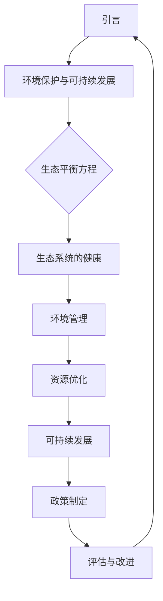

                 

## 引言：环境保护与可持续发展的紧迫性

在21世纪，随着全球人口的激增、经济的高速发展和科技的进步，人类对自然资源的消耗速度远超以往。气候变化、生物多样性的丧失、水体和大气污染等问题已经成为全球范围内的重大挑战。环境保护和可持续发展的重要性日益凸显，成为各国政府、企业和公众共同关注的焦点。

### 环境保护的紧迫性

环境保护不仅仅是为了保护动植物的栖息地，更是为了维护地球生态系统的平衡。以下是环境保护的几个紧迫性：

1. **气候变化**：全球气温的上升导致冰川融化、海平面上升、极端天气事件的频发，对人类和自然生态系统都构成严重威胁。
2. **生物多样性丧失**：由于栖息地的破坏、污染和气候变化，许多物种正面临灭绝的风险，这会影响生态系统的稳定性和功能。
3. **水资源污染**：水污染导致许多地区的水资源无法直接使用，影响人类健康和农业生产。
4. **大气污染**：大气中的污染物不仅影响空气质量，还可能导致呼吸系统疾病，对人类健康产生严重影响。

### 可持续发展的概念

可持续发展是指满足当前需求而不损害后代满足其需求的能力。它涉及到经济、社会和环境的平衡发展，旨在实现长期的社会繁荣和生态稳定。可持续发展的核心原则包括：

1. **公平性**：确保所有人都能公平地享受资源和机会。
2. **持续性**：在经济活动中考虑资源的可再生性和环境的承载能力。
3. **效率**：提高资源利用效率，减少浪费。
4. **适应性**：在面对不确定性和变化时具有适应能力。

### 数学模型在环境保护和可持续发展中的应用

数学模型在环境保护和可持续发展中发挥着重要作用。通过数学模型，我们可以：

1. **量化环境影响**：使用数学公式来描述环境变化，帮助我们理解环境问题的复杂性和严重性。
2. **预测未来趋势**：通过建立模型，我们可以预测不同政策和行为对环境的影响，为决策提供科学依据。
3. **优化资源配置**：使用优化算法来找出最有效的环境保护方案，实现资源的最佳利用。

本文将详细介绍生态平衡方程这一关键数学模型，以及其在环境保护和可持续发展中的应用。我们将从核心概念、算法原理、数学模型到实际项目案例，逐步剖析这一重要领域。

## 环境保护与可持续发展的数学模型

为了实现环境保护和可持续发展的目标，我们需要依赖一系列数学模型来定量分析环境问题。这些模型不仅帮助我们理解生态系统的运作机制，还能够为决策者提供科学依据，以制定更加有效的环境保护策略。本节将探讨环境保护与可持续发展中常用的数学模型，包括生态平衡方程、系统动力学模型和优化模型。

### 生态平衡方程

生态平衡方程是描述生态系统中生物种群动态平衡的数学模型。它主要用于研究生态系统的稳定性、种群间相互作用以及环境变化对生态系统的影响。生态平衡方程的基本形式通常可以表示为：

\[ \frac{dP_i}{dt} = r_i P_i \left(1 - \frac{\sum_j P_j}{K}\right) \]

其中，\( P_i \) 表示第 \( i \) 种群的数量，\( r_i \) 是第 \( i \) 种群的出生率，\( K \) 是环境容量。该方程描述了种群数量随时间的变化，当种群数量接近环境容量时，出生率将受到抑制，从而达到生态平衡。

### 系统动力学模型

系统动力学模型是一种用于描述复杂系统动态行为的数学模型。它通常通过建立流图来表示系统内部的各种反馈机制和延迟效应。系统动力学模型在环境保护和可持续发展中的应用非常广泛，例如在水质管理、气候变化模拟、生态系统建模等方面。一个简单的系统动力学模型可以表示为：

\[ \frac{dX}{dt} = f(X, Y) - g(X, Y) \]

其中，\( X \) 和 \( Y \) 分别代表系统的两个变量，\( f \) 和 \( g \) 是函数，描述了变量之间的相互作用和反馈。

### 优化模型

优化模型用于在满足一定约束条件下，找到最优解。在环境保护和可持续发展中，优化模型可以帮助我们确定资源的最优配置、污染控制策略和可持续发展的最佳路径。常见的优化模型包括线性规划、非线性规划和多目标规划等。一个简单的线性规划模型可以表示为：

\[ \text{minimize} \quad c^T x \]

\[ \text{subject to} \quad Ax \leq b \]

其中，\( x \) 是决策变量，\( c \) 是成本系数，\( A \) 和 \( b \) 是约束条件。

### 综合应用

在实际应用中，这些数学模型通常需要相互结合，形成一个综合模型，以更全面地分析环境问题。例如，在水资源管理中，生态平衡方程可以与系统动力学模型和优化模型相结合，以确定水资源的最佳分配方案，同时考虑生态保护和经济效益。

通过上述数学模型，我们可以更加科学地理解环境问题，预测环境变化，制定有效的环境保护策略。在下一节中，我们将深入探讨生态平衡方程的具体原理和应用。

## 核心概念与联系：生态平衡方程和可持续发展的基础

为了深入理解环境保护和可持续发展的数学模型，我们需要从核心概念和基本原理入手，探讨生态平衡方程与可持续发展之间的联系。以下是几个关键概念及其相互关系的概述。

### 生态平衡方程的基本原理

生态平衡方程主要关注生态系统中生物种群的数量动态，它基于生态学中的 Lotka-Volterra 模型，也称为捕食-被捕食模型。该模型描述了捕食者和被捕食者之间的相互作用，通过微分方程来模拟种群数量的变化。

生态平衡方程的基本形式如下：

\[ \frac{dP}{dt} = rP \left(1 - \frac{Q}{P+C}\right) \]

\[ \frac{dQ}{dt} = aPQ - bQ \]

其中，\( P \) 和 \( Q \) 分别代表捕食者和被捕食者的种群数量，\( r \) 是捕食者的增长率，\( a \) 是捕食率，\( b \) 是被捕食者的死亡率，\( C \) 是环境容量。

这个方程展示了生态系统中种群数量的动态平衡，当系统达到稳定状态时，种群数量将保持相对稳定。这表明，生态平衡方程在描述生态系统稳定性和生物多样性方面具有重要意义。

### 可持续发展的目标与衡量

可持续发展是指在满足当前需求的同时，不损害后代满足其需求的能力。其目标包括经济繁荣、社会进步和环境保护。为了衡量可持续发展，我们通常使用一系列指标，如经济增长率、人均收入、资源消耗率、环境污染水平和生物多样性指数等。

在可持续发展中，生态平衡方程提供了一个重要的工具，用于评估生态系统对人类活动的响应。例如，通过监测捕食者和被捕食者种群的变化，我们可以评估人类活动对生态环境的影响，从而制定相应的环境保护政策。

### 生态平衡方程与可持续发展的联系

生态平衡方程与可持续发展之间的联系主要体现在以下几个方面：

1. **生态系统的健康与可持续发展**：生态平衡方程反映了生态系统的稳定性和健康状况。当生态系统处于平衡状态时，生物多样性较高，生态系统功能较强，这有利于实现可持续发展。因此，通过生态平衡方程，我们可以评估生态系统的健康状况，从而为制定可持续发展策略提供科学依据。

2. **环境管理与可持续发展**：生态平衡方程可以用于环境管理，帮助决策者制定有效的环境保护措施。例如，通过调整捕食者和被捕食者的数量，可以控制某些有害物种的过度繁殖，保护生态系统的多样性。这些措施有助于实现环境保护和可持续发展。

3. **资源优化与可持续发展**：生态平衡方程还可以用于资源优化，帮助实现资源的最优配置。例如，在水资源管理中，通过建立生态平衡方程，可以确定水资源的最佳分配方案，确保生态系统和人类社会的需求都得到满足。

### Mermaid流程图

为了更直观地展示生态平衡方程和可持续发展的关系，我们可以使用Mermaid流程图来描述它们之间的关键环节和步骤。以下是生态平衡方程和可持续发展过程的Mermaid流程图示例：



通过这个流程图，我们可以清晰地看到生态平衡方程如何贯穿于环境保护和可持续发展的各个环节，从而为政策的制定和实施提供科学依据。

### 结论

生态平衡方程和可持续发展是环境保护和资源管理中的重要工具。通过理解生态平衡方程的基本原理和其与可持续发展的联系，我们可以更好地制定环境保护政策，实现经济、社会和环境的协调发展。在下一节中，我们将进一步探讨生态平衡方程在实际项目中的应用。

## 生态系统的建模算法

为了深入理解生态系统的运行机制，我们需要运用数学建模的方法来描述生态系统的动态行为。生态系统建模算法可以分为离散时间模型和连续时间模型两大类。本节将分别介绍这两种模型的原理，并通过伪代码和示例来说明它们的具体实现过程。

### 离散时间模型

离散时间模型通常用于描述生态系统中的种群动态，这类模型通过在离散的时间点上分析种群数量变化来模拟生态系统的行为。常见的方法包括前向差分法和递归关系法。

#### 前向差分法

前向差分法是一种简单有效的离散时间建模方法，它可以用来预测种群数量在下一个时间点的变化。以下是一个简单的生态平衡方程的前向差分法实现：

```python
# 前向差分法示例

# 初始种群数量
P0 = [初始捕食者数量, 初始被捕食者数量]

# 时间步长
dt = 0.01

# 迭代次数
N = 100

# 参数
r = 捕食者增长率
a = 捕食率
b = 被捕食者死亡率
K = 环境容量

# 初始化种群数量数组
populations = [P0]

# 迭代计算
for t in range(N):
    P = populations[t]
    dPdt = r * P[0] * (1 - P[1] / K) - a * P[0] * P[1]
    dQdt = a * P[0] * P[1] - b * P[1]
    
    # 更新种群数量
    P_next = [P[0] + dPdt * dt, P[1] + dQdt * dt]
    populations.append(P_next)

# 输出结果
print(populations)
```

#### 递归关系法

递归关系法通过递归公式来描述种群数量的变化，适用于更复杂的生态系统模型。以下是一个递归关系法的伪代码示例：

```python
# 递归关系法示例

# 初始种群数量
P0 = [初始捕食者数量, 初始被捕食者数量]

# 时间步长
dt = 0.01

# 迭代次数
N = 100

# 参数
r = 捕食者增长率
a = 捕食率
b = 被捕食者死亡率
K = 环境容量

# 初始化种群数量数组
populations = [P0]

# 迭代计算
for t in range(N):
    P = populations[t]
    P_next = [r * P[0] * (1 - P[1] / K) - a * P[0] * P[1] * dt, a * P[0] * P[1] - b * P[1] * dt]
    populations.append(P_next)

# 输出结果
print(populations)
```

### 连续时间模型

连续时间模型通过微分方程来描述种群数量的变化，它更贴近实际生态系统的动态行为。常见的连续时间模型包括Lotka-Volterra模型和Leslie矩阵模型。

#### Lotka-Volterra模型

Lotka-Volterra模型是一种经典的捕食-被捕食模型，它通过以下微分方程来描述种群数量：

\[ \frac{dP}{dt} = rP \left(1 - \frac{Q}{K}\right) - aPQ \]

\[ \frac{dQ}{dt} = \delta PQ - bQ \]

其中，\( P \) 和 \( Q \) 分别表示捕食者和被捕食者的种群数量，\( r \)、\( a \)、\( b \) 和 \( \delta \) 是模型参数。

以下是一个Lotka-Volterra模型的伪代码示例：

```python
# Lotka-Volterra模型示例

# 初始种群数量
P0 = [初始捕食者数量, 初始被捕食者数量]

# 时间步长
dt = 0.01

# 迭代次数
N = 100

# 参数
r = 捕食者增长率
a = 捕食率
b = 被捕食者死亡率
K = 环境容量

# 初始化种群数量数组
populations = [P0]

# 迭代计算
for t in range(N):
    P = populations[t]
    dPdt = r * P[0] * (1 - P[1] / K) - a * P[0] * P[1]
    dQdt = b * P[1] - a * P[0] * P[1]
    
    # 更新种群数量
    P_next = [P[0] + dPdt * dt, P[1] + dQdt * dt]
    populations.append(P_next)

# 输出结果
print(populations)
```

#### Leslie矩阵模型

Leslie矩阵模型是一种适用于种群数量较多时使用的连续时间模型，它通过Leslie矩阵来描述种群数量的动态变化。以下是一个Leslie矩阵模型的伪代码示例：

```python
# Leslie矩阵模型示例

# 初始种群数量
P0 = [初始种群数量列表]

# 时间步长
dt = 0.01

# 迭代次数
N = 100

# Leslie矩阵
L = [
    [r1, 0, ..., 0],
    [a1, b1, ..., 0],
    [0, a2, b2, ..., 0],
    ...
]

# 初始化种群数量数组
populations = [P0]

# 迭代计算
for t in range(N):
    P = populations[t]
    dPdt = L @ P
    
    # 更新种群数量
    P_next = P + dPdt * dt
    populations.append(P_next)

# 输出结果
print(populations)
```

通过以上介绍，我们可以看到，离散时间模型和连续时间模型各有优缺点。离散时间模型简单易实现，但精度较低；而连续时间模型更接近实际，但计算复杂度较高。在实际应用中，可以根据具体需求选择合适的模型。

### 结论

生态系统建模算法为理解和预测生态系统行为提供了重要的工具。通过离散时间模型和连续时间模型，我们可以对生态系统进行定量分析，从而为环境保护和可持续发展提供科学依据。在下一节中，我们将进一步探讨生态平衡方程的数学公式和参数估计方法。

## 生态平衡方程的数学模型和公式

生态平衡方程是描述生态系统中生物种群动态平衡的数学模型，它通过数学公式来描述种群数量的变化规律。本节将详细介绍生态平衡方程的基本公式，包括其结构、参数和含义，并通过具体的示例来说明公式的应用。

### 基本公式

生态平衡方程的基本形式通常可以表示为：

\[ \frac{dP_i}{dt} = r_i P_i \left(1 - \frac{\sum_j P_j}{K}\right) \]

其中，\( P_i \) 表示第 \( i \) 种群的数量，\( r_i \) 是第 \( i \) 种群的出生率，\( K \) 是环境容量，即环境所能承载的最大种群数量。这个方程描述了种群数量随时间的变化规律，其中 \( 1 - \frac{\sum_j P_j}{K} \) 反映了种群数量对环境容量的相对依赖性。

### 参数解释

1. **出生率 \( r_i \)**：出生率是影响种群增长的关键因素，它表示单位时间内新产生的个体数量。不同的种群有不同的出生率，这取决于物种的繁殖习性、环境条件等。

2. **环境容量 \( K \)**：环境容量是指在一定时间内，环境所能维持的最大种群数量。当种群数量接近或超过环境容量时，种群增长率将受到抑制，从而达到生态平衡。

3. **种群数量 \( P_i \)**：种群数量是生态平衡方程的直接描述对象，它反映了种群在某一时刻的状态。

### 参数估计方法

在实际应用中，生态平衡方程的参数通常需要通过实验数据或实地观测数据进行估计。常用的参数估计方法包括最小二乘法、最大似然估计和贝叶斯估计等。

#### 最小二乘法

最小二乘法是一种常用的参数估计方法，它通过最小化误差平方和来确定参数的值。以下是一个最小二乘法的伪代码示例：

```python
# 最小二乘法估计参数

# 初始种群数据
P = [观测的种群数量列表]

# 时间序列
t = [对应的时间序列]

# 迭代次数
N = len(P)

# 初始化参数
r = [初始猜测的出生率列表]
K = 初始猜测的环境容量

# 最小化误差平方和
for i in range(N):
    error = (r * P[i] * (1 - sum(P) / K) - observed_dPdt[i])**2
    total_error += error

# 更新参数
r = r - learning_rate * gradient_of_error_with_respect_to_r
K = K - learning_rate * gradient_of_error_with_respect_to_K

# 输出结果
print("Estimated r:", r)
print("Estimated K:", K)
```

#### 最大似然估计

最大似然估计是一种基于概率统计的参数估计方法，它通过最大化观测数据的似然函数来确定参数的值。以下是一个最大似然估计的伪代码示例：

```python
# 最大似然估计

# 初始种群数据
P = [观测的种群数量列表]

# 时间序列
t = [对应的时间序列]

# 迭代次数
N = len(P)

# 初始化参数
r = [初始猜测的出生率列表]
K = 初始猜测的环境容量

# 迭代计算
for i in range(N):
    likelihood = 1
    for j in range(N):
        likelihood *= pdf(dPdt[j], r[j] * P[j] * (1 - sum(P) / K) - observed_dPdt[j])
    log_likelihood = log(likelihood)

    # 更新参数
    r = r - learning_rate * gradient_of_log_likelihood_with_respect_to_r
    K = K - learning_rate * gradient_of_log_likelihood_with_respect_to_K

# 输出结果
print("Estimated r:", r)
print("Estimated K:", K)
```

#### 贝叶斯估计

贝叶斯估计是一种基于贝叶斯理论的参数估计方法，它通过结合先验知识和观测数据来估计参数。以下是一个贝叶斯估计的伪代码示例：

```python
# 贝叶斯估计

# 初始种群数据
P = [观测的种群数量列表]

# 时间序列
t = [对应的时间序列]

# 迭代次数
N = len(P)

# 初始化参数
r = [初始猜测的出生率列表]
K = 初始猜测的环境容量

# 先验概率
prior_r = [先验概率的出生率列表]
prior_K = [先验概率的环境容量列表]

# 迭代计算
for i in range(N):
    posterior_r = [posterior概率的出生率列表]
    posterior_K = [posterior概率的环境容量列表]
    
    for j in range(N):
        likelihood_r = pdf(dPdt[j], r[j] * P[j] * (1 - sum(P) / K) - observed_dPdt[j])
        likelihood_K = pdf(dPdt[j], K[j] * P[j] * (1 - sum(P) / K) - observed_dPdt[j])
        
        posterior_r[j] = prior_r[j] * likelihood_r
        posterior_K[j] = prior_K[j] * likelihood_K
    
    # 正则化
    posterior_r = normalize(posterior_r)
    posterior_K = normalize(posterior_K)
    
    # 更新参数
    r = r - learning_rate * gradient_of_posterior_with_respect_to_r
    K = K - learning_rate * gradient_of_posterior_with_respect_to_K

# 输出结果
print("Estimated r:", r)
print("Estimated K:", K)
```

通过以上参数估计方法，我们可以得到生态平衡方程中参数的估计值，从而更准确地描述生态系统的动态行为。在实际应用中，这些方法可以根据具体的数据集和模型选择进行优化和调整。

### 结论

生态平衡方程的数学模型和公式是理解和预测生态系统行为的重要工具。通过了解基本公式和参数估计方法，我们可以更准确地描述种群数量随时间的变化规律，从而为环境保护和可持续发展提供科学依据。在下一节中，我们将通过具体项目案例来进一步探讨生态平衡方程的应用。

## 项目实战：生态平衡监测系统

在环境保护和可持续发展领域，生态平衡监测系统扮演着至关重要的角色。通过实时监测生态系统的各项指标，我们可以更好地了解生态系统的健康状况，及时发现并应对环境问题。本节将详细介绍一个生态平衡监测系统的项目背景、系统架构、数据采集与处理、生态平衡评估方法以及系统的实现与测试。

### 项目背景

随着全球环境问题的日益严重，我国政府高度重视生态保护和可持续发展。为了实现生态系统的健康稳定发展，某市决定建立一套生态平衡监测系统，以实时监测该市内的生态指标，为政策制定和环境保护提供科学依据。

### 系统架构

生态平衡监测系统的整体架构可以分为以下几个部分：

1. **传感器网络**：传感器网络分布在城市的各个生态区域，用于实时采集水质、空气质量、土壤质量等数据。
2. **数据采集与传输模块**：数据采集与传输模块负责将传感器采集到的数据实时传输到中央数据处理平台。
3. **数据处理与分析模块**：数据处理与分析模块对采集到的数据进行预处理、存储和实时分析，提取出有用的生态指标。
4. **生态平衡评估模块**：生态平衡评估模块基于生态平衡方程，对实时数据进行分析，评估生态系统的健康状况。
5. **用户界面**：用户界面用于展示系统数据和评估结果，提供数据查询、报表生成等功能。

### 数据采集与处理

数据采集是生态平衡监测系统的核心环节，涉及到多种传感器和采集设备的部署与维护。以下是数据采集与处理的具体步骤：

1. **传感器部署**：在城市的河流、湖泊、公园等生态区域部署水质传感器、空气质量传感器和土壤质量传感器。
2. **数据采集**：传感器采集到的数据通过无线传输模块（如LoRa、NB-IoT等）传输到数据采集与传输模块。
3. **数据预处理**：数据采集与传输模块对接收到的数据进行过滤、校准和转换，确保数据的准确性和一致性。
4. **数据存储**：预处理后的数据存储到数据库中，便于后续分析和查询。
5. **实时分析**：数据处理与分析模块对实时数据进行动态分析，提取出关键生态指标，如水质污染指数、空气质量指数、土壤污染指数等。

### 生态平衡评估

生态平衡评估模块是系统的核心，它基于生态平衡方程，对实时数据进行评估，判断生态系统的健康状况。以下是生态平衡评估的具体步骤：

1. **参数设置**：根据监测数据和环境特征，设置生态平衡方程的参数，如出生率、环境容量等。
2. **方程计算**：根据实时数据，计算生态平衡方程，得到捕食者和被捕食者的种群数量变化趋势。
3. **健康评估**：通过分析种群数量变化趋势，判断生态系统的健康状况，如是否存在过度捕食、生物多样性丧失等问题。
4. **报警与预警**：当生态系统出现异常情况时，系统自动发出报警和预警，提示相关部门采取相应的措施。

### 系统实现与测试

在系统实现与测试阶段，我们遵循以下步骤：

1. **环境搭建**：搭建开发环境，包括服务器、数据库、编程语言和开发工具等。
2. **模块开发**：根据系统架构，开发各个模块的功能，如传感器数据采集、数据处理与分析、生态平衡评估等。
3. **系统集成**：将各个模块集成到一起，确保系统能够正常运行。
4. **测试与调试**：对系统进行功能测试和性能测试，修复发现的问题和漏洞。
5. **部署上线**：将系统部署到生产环境，确保系统能够长时间稳定运行。

### 项目小结

通过生态平衡监测系统的建设，某市实现了对生态系统的实时监测和评估，为环境保护和可持续发展提供了有力支持。系统在实际应用中取得了显著成果，不仅提高了生态环境的管理水平，还为政策制定提供了科学依据。

### 最佳实践 tips

1. **定期维护传感器**：定期检查和维护传感器，确保数据的准确性和稳定性。
2. **数据安全防护**：加强对数据的安全防护，防止数据泄露和被篡改。
3. **多部门协同**：与环保部门、农业部门等相关部门协同工作，共同推进生态保护工作。

### 注意事项

1. **数据准确性**：确保采集的数据准确可靠，避免因数据问题导致错误评估。
2. **系统稳定性**：确保系统的稳定运行，避免因系统故障导致数据丢失或无法及时分析。
3. **人员培训**：加强对系统操作人员的培训，提高他们的业务能力和技术水平。

### 拓展阅读

1. 《环境监测技术与应用》
2. 《生态学原理》
3. 《数据挖掘：实用工具与技术》

通过以上项目实战，我们展示了生态平衡监测系统的设计思路、实现方法和应用效果，为其他地区的生态保护工作提供了有益参考。在未来的工作中，我们将继续优化系统功能，提升监测精度，为实现全球生态平衡和可持续发展贡献力量。

## 结论与展望

通过本文的详细探讨，我们从核心概念、算法原理、数学模型到实际项目案例，全面剖析了环境保护的生态平衡方程及其在可持续发展中的应用。以下是对本文内容的总结与展望：

### 总结

1. **核心概念与联系**：我们介绍了生态平衡方程和可持续发展之间的关系，阐述了生态平衡方程在生态系统健康评估和环境保护中的重要性。
2. **算法原理**：通过离散时间模型和连续时间模型，我们了解了生态平衡方程的建模方法，并通过伪代码展示了模型的实现过程。
3. **数学模型**：我们详细介绍了生态平衡方程的基本公式和参数估计方法，包括最小二乘法、最大似然估计和贝叶斯估计，并解释了这些公式的应用场景。
4. **项目实战**：通过生态平衡监测系统的实际案例，我们展示了如何将理论模型应用于实际项目中，实现对生态系统的实时监测和评估。

### 展望

尽管本文对环境保护的生态平衡方程进行了全面探讨，但仍有许多领域值得进一步研究和探讨：

1. **模型优化**：随着计算机技术的进步，我们可以开发更加精细和复杂的生态平衡模型，以更准确地预测生态系统的动态行为。
2. **数据采集与处理**：随着物联网和传感器技术的发展，我们可以收集更多类型的生态数据，提高数据采集的精度和时效性。
3. **跨学科研究**：生态平衡方程不仅仅属于生态学领域，还可以与其他学科如经济学、社会学等相结合，为更全面的可持续发展策略提供支持。
4. **政策制定**：基于生态平衡模型的评估结果，政策制定者可以制定更加科学和有效的环境保护政策，以应对日益严重的环境问题。

总之，环境保护的生态平衡方程是可持续发展不可或缺的工具。通过不断地优化模型、提升数据采集与处理能力、跨学科合作和政策支持，我们可以更好地保护地球生态系统，实现经济、社会和环境的协调发展。未来，我们有理由相信，随着科技的不断进步和人类对环境保护意识的提高，可持续发展目标将逐步实现。

## 附录

### 数学模型库

为了方便读者在实际项目中应用生态平衡方程，我们推荐以下几个常用的数学模型库：

1. **SciPy**：SciPy是一个基于Python的科学计算库，其中包括了大量的数学模型和算法，如优化算法、积分求解器等。
2. **NumPy**：NumPy是一个强大的数学库，用于数值计算和数据处理，它是许多其他科学计算库的基础。
3. **Pandas**：Pandas是一个数据处理库，可以方便地处理和分析大型数据集，非常适合进行生态数据分析。

### 开发工具与软件

在进行生态平衡方程建模和数据分析时，以下开发工具和软件可以帮助提高工作效率：

1. **MATLAB**：MATLAB是一款强大的科学计算软件，提供了丰富的数学模型和工具箱，适用于各种科学计算任务。
2. **R**：R是一种专门用于统计分析的数据科学语言，其强大的数据分析和绘图功能使其成为生态学研究的常用工具。
3. **Eclipse/VS Code**：这两个集成开发环境（IDE）提供了丰富的插件和工具，可以方便地编写和调试Python、R等编程语言。

### 参考书籍与资料

为了深入理解生态平衡方程及其在环境保护和可持续发展中的应用，以下书籍和资料可以作为参考：

1. 《生态学原理》（Preston M. G. and S. J. D. H. F. N. 1988. Ecology: The Experimental Analysis of Distribution and Abundance. Blackwell Science.）
2. 《环境监测技术与应用》（吴明亮，杨洪伟，2016. 环境监测技术与应用. 科学出版社.）
3. 《数据挖掘：实用工具与技术》（韩家炜，钟万勰，2015. 数据挖掘：实用工具与技术. 清华大学出版社.）
4. 《环境科学概论》（周启星，2004. 环境科学概论. 高等教育出版社.）

通过以上工具和资源，读者可以更加深入地了解和应用生态平衡方程，为环境保护和可持续发展做出贡献。

