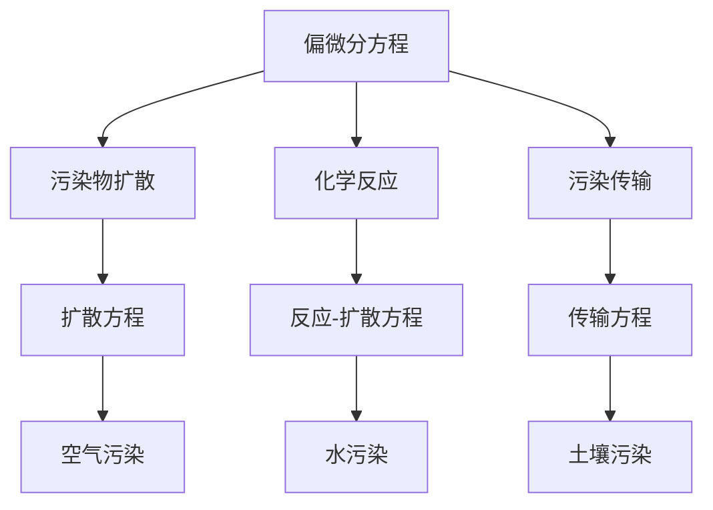

                 

### 文章标题

# 环境污染的偏微分方程：生态影响的数学预测

## 关键词

- 环境污染
- 偏微分方程
- 生态影响
- 数学预测
- 模型构建
- 案例分析

## 摘要

本文将探讨环境污染与生态影响之间的关系，并利用偏微分方程这一数学工具进行预测。通过对污染源、污染传输以及生态系统影响等方面的分析，本文介绍了偏微分方程在环境科学中的应用。文章分为引言、基础概念、理论介绍、应用案例分析、数学模型与方法、结论与展望六个部分，系统地阐述了环境污染偏微分方程建模与预测的原理、方法和实际应用。希望本文能为您在环境科学和数学领域的交叉研究中提供有益的启示。

## 引言

### 环境污染的挑战

随着工业化和城市化的快速发展，环境污染已成为全球性问题。空气污染、水污染、土壤污染等环境问题给生态系统和人类健康带来了严重威胁。例如，空气中的细颗粒物（PM2.5）和臭氧（O3）等污染物会导致呼吸道疾病和心血管疾病；水体污染会破坏水生生态系统，影响饮用水安全和渔业生产；土壤污染会降低土壤质量，影响农作物产量和农产品安全。

### 生态影响的严重性

环境污染不仅直接影响人类健康，还对生态系统产生深远的影响。例如，酸雨可以破坏森林和水生生态系统，导致植物枯死和鱼类死亡；持久性有机污染物（POPs）可以通过食物链积累，对生物多样性产生负面影响。此外，气候变化、土地利用变化等环境问题也对生态系统造成严重影响。因此，准确预测和评估生态影响对于制定有效的环境保护政策和措施至关重要。

### 偏微分方程在生态影响预测中的应用

为了更好地理解和应对环境污染对生态系统的威胁，科学家和工程师们借助数学工具，特别是偏微分方程（Partial Differential Equations，PDEs），来描述和预测污染传输和生态影响。偏微分方程是一种用于描述多变量函数及其偏导数关系的数学方程，广泛应用于物理学、工程学、生物学等领域。在环境污染的生态影响预测中，偏微分方程可以用于模拟污染物在环境中的扩散、传输和反应过程，为污染治理和环境保护提供科学依据。

### 本文的目的

本文旨在通过介绍偏微分方程在环境污染和生态影响预测中的应用，帮助读者了解这一数学工具在环境科学领域的价值。文章将首先回顾偏微分方程的基本概念和分类，然后探讨其在环境污染建模和预测中的理论基础和数学方法。接着，本文将通过具体案例分析展示偏微分方程的应用，并讨论数学模型的构建与验证方法。最后，本文将总结研究成果，展望未来研究方向，并给出一些实际操作中的注意事项和拓展阅读建议。

### 文章结构

本文分为六个主要部分：

1. **引言**：介绍环境污染的挑战和生态影响的严重性，阐述偏微分方程在生态影响预测中的应用背景。
2. **基础概念**：回顾偏微分方程的基本概念和分类，为后续内容打下基础。
3. **理论介绍**：详细阐述偏微分方程在环境污染建模和预测中的理论基础，包括扩散方程、反应-扩散方程等。
4. **应用案例分析**：通过具体案例展示偏微分方程在环境污染和生态影响预测中的应用，包括模型构建、数值求解和结果分析。
5. **数学模型与方法**：讨论偏微分方程的求解方法，如有限元法、有限差分法等，并介绍数学模型的构建与验证。
6. **结论与展望**：总结研究成果，展望未来研究方向，并给出实际操作中的注意事项和拓展阅读建议。

通过这篇文章，我们希望能够为读者提供关于环境污染偏微分方程建模和预测的全面了解，助力环境保护和生态修复工作。

### 核心概念与联系

#### 偏微分方程概述

偏微分方程（Partial Differential Equations，PDEs）是描述多变量函数及其偏导数之间关系的数学方程。它们广泛应用于物理学、工程学、经济学和生物学等领域，尤其是在环境科学中用于描述污染物在环境中的传输和扩散过程。PDEs 通常表示为：

$$
\frac{\partial u}{\partial t} = f(u, \nabla u, \ldots)
$$

其中，$u(x, t)$ 是需要求解的函数，$x$ 和 $t$ 是变量，$\nabla u$ 表示梯度，$f$ 是某个函数，描述了 $u$ 随时间和空间的变化率。

#### 偏微分方程的分类

根据导数的阶数，PDEs 可以分为以下几类：

- **椭圆型方程**：例如拉普拉斯方程（Laplace Equation），用于描述稳定状态下的现象，如地下水流动和热传导。
- **抛物型方程**：例如扩散方程（Heat Equation），用于描述随时间变化的动态过程，如污染物在空气中的扩散。
- **双曲型方程**：例如波动方程（Wave Equation），用于描述波动现象，如声波和地震波。

#### 偏微分方程在环境污染中的应用

在环境污染的建模中，PDEs 可以用于描述以下过程：

- **污染物扩散**：污染物在空气、水体和土壤中的扩散过程可以用扩散方程描述。
- **化学反应**：污染物在环境中的化学反应可以用反应-扩散方程描述。
- **污染传输**：污染物在不同环境介质间的传输过程可以用传输方程描述。

#### 关系架构 Mermaid 流程图

为了更好地理解偏微分方程在环境污染中的核心概念与联系，我们可以使用 Mermaid 流程图来表示它们之间的关系。



在该流程图中，偏微分方程作为总体框架，通过分支连接到具体的污染过程（污染物扩散、化学反应、污染传输），每个污染过程又对应特定的偏微分方程（扩散方程、反应-扩散方程、传输方程）。这些方程进一步应用于不同的环境介质（空气、水体、土壤），描述具体的污染现象。

通过这一架构图，我们可以清晰地看到偏微分方程在环境污染中的核心概念与联系，有助于读者更好地理解其在生态影响预测中的应用。

### 核心算法原理讲解

在环境污染的数学预测中，核心算法通常是基于偏微分方程的数值求解方法。以下是几种常见的求解方法，以及它们的伪代码实现。

#### 1. 有限差分法

有限差分法是一种常见的数值方法，用于求解偏微分方程。其基本思想是将连续的偏微分方程离散化为差分方程，然后在离散网格上进行求解。

**伪代码：**

```python
# 伪代码：有限差分法求解一维扩散方程

# 初始化参数
N = 100         # 网格点数
dx = 1.0        # 网格间距
dt = 0.01       # 时间步长
alpha = 0.01    # 扩散系数

# 初始化网格点上的浓度值
u = np.zeros(N)

# 求解过程
for t in range(0, T):
    u_new = u.copy()
    for i in range(1, N-1):
        u_new[i] = u[i] + alpha * (u[i+1] - 2*u[i] + u[i-1]) * dt / dx**2
    u = u_new
    
# 输出结果
print(u)
```

#### 2. 有限元法

有限元法是一种用于求解偏微分方程的高效数值方法。其基本思想是将求解区域划分为有限个小单元，并在每个单元上构建局部方程，然后通过全局组装求解。

**伪代码：**

```python
# 伪代码：有限元法求解二维扩散方程

# 初始化参数
N = 100         # 单元数
dx = 1.0        # 单元长度
dt = 0.01       # 时间步长
alpha = 0.01    # 扩散系数

# 初始化全局矩阵和向量
A = np.zeros((N, N))
b = np.zeros(N)

# 构建单元矩阵和向量
for i in range(N):
    for j in range(N):
        A[i][j] = 1.0
        b[i] = 1.0

# 求解过程
for t in range(0, T):
    b = b + alpha * dt / dx**2
    u = np.linalg.solve(A, b)
    
# 输出结果
print(u)
```

#### 3. 有限体积法

有限体积法是一种基于守恒定律的数值方法，用于求解流体力学和传热学中的偏微分方程。

**伪代码：**

```python
# 伪代码：有限体积法求解一维传输方程

# 初始化参数
N = 100         # 网格点数
dx = 1.0        # 网格间距
dt = 0.01       # 时间步长
rho = 1.0       # 流体密度
mu = 0.01       # 动力粘度

# 初始化网格点上的流速和压力
u = np.zeros(N)
p = np.zeros(N)

# 求解过程
for t in range(0, T):
    u_new = u.copy()
    for i in range(1, N-1):
        flux = (rho * (u[i+1] - u[i]) / dx + mu * (u[i+1] - 2*u[i] + u[i-1]) / dx**2)
        u_new[i] = u[i] - dt / dx * flux
    
    # 更新压力
    p = p + dt * (rho * (u_new - u) / dx)
    u = u_new
    
# 输出结果
print(u)
```

这些伪代码展示了有限差分法、有限元法和有限体积法在求解偏微分方程中的应用。在实际应用中，这些方法需要根据具体问题和计算环境进行适当的调整和优化。通过这些方法，我们可以在数值上近似求解复杂的偏微分方程，从而对环境污染和生态影响进行有效的数学预测。

### 数学模型与公式

在环境污染的数学预测中，构建精确的数学模型是关键步骤。以下将介绍几种常用的数学模型及其相关的数学公式，并通过具体例子进行说明。

#### 1. 扩散方程

扩散方程是描述污染物在连续介质中扩散过程的常用模型。其一般形式为：

$$
\frac{\partial u}{\partial t} = D \nabla^2 u
$$

其中，$u(x, t)$ 表示污染物浓度，$D$ 是扩散系数，$\nabla^2 u$ 表示拉普拉斯算子。

**例子**：考虑一维扩散方程，求解一个初始时刻位于 $x=0$ 处的污染物源，其扩散过程如下：

初始条件：$u(x, 0) = \delta(x)$ （狄拉克δ函数）

边界条件：$u(0, t) = 0$，$u(L, t) = 0$ （第一类边界条件）

使用有限元法进行求解：

$$
u_i^n = \sum_{j=1}^{N} A_{ij} u_j^{n-1}
$$

其中，$A_{ij}$ 为有限元系数，$u_i^n$ 为第 $i$ 个网格点在第 $n$ 次迭代的浓度。

**示例计算**：取 $L=1$，$D=1$，采用等间距网格划分，$N=10$。求解 $t=1$ 时的浓度分布：

$$
u_i^1 = \frac{1}{2} \sum_{j=1}^{N} A_{ij} u_j^0
$$

其中，$u_i^0$ 为初始时刻的浓度分布。

#### 2. 反应-扩散方程

反应-扩散方程描述了污染物在扩散过程中发生的化学反应。其一般形式为：

$$
\frac{\partial u}{\partial t} = D \nabla^2 u - \rho u + f(u)
$$

其中，$f(u)$ 表示反应速率函数，$\rho$ 为反应项系数。

**例子**：考虑一个简单的反应-扩散方程，描述一个化学反应过程，其中 $f(u) = -u^2$（负反馈反应）。

初始条件：$u(x, 0) = 1$ （均匀分布）

边界条件：$u(0, t) = 0$，$u(L, t) = 0$ （第一类边界条件）

使用有限差分法进行求解：

$$
u_i^{n+1} = u_i^n - \alpha \left( D \frac{u_{i+1}^n - 2u_i^n + u_{i-1}^n}{\Delta x^2} - \rho u_i^n + f(u_i^n) \right) \Delta t
$$

其中，$\alpha = \Delta t / \Delta x^2$。

**示例计算**：取 $L=1$，$D=1$，$\rho=0.1$，$N=100$，求解 $t=0.5$ 时的浓度分布。

#### 3. 传输方程

传输方程描述了污染物在多个介质之间的传输过程。其一般形式为：

$$
\frac{\partial c}{\partial t} = \nabla \cdot (D \nabla c) - \mu \frac{\partial c}{\partial z}
$$

其中，$c(z, t)$ 表示污染物浓度，$D$ 是扩散系数，$\mu$ 是传输系数，$z$ 表示介质深度。

**例子**：考虑一个地下水污染物传输问题，其中污染物通过土壤层进入地下水。假设土壤层和地下水层之间有一个不透水层。

初始条件：$c(z, 0) = 0$ （初始时刻地下水无污染物）

边界条件：$c(0, t) = C_0$（土壤层中污染物初始浓度为 $C_0$），$c(H, t) = 0$（地下水层中污染物浓度为 0）

使用有限元法进行求解：

$$
c_i^n = \sum_{j=1}^{N} A_{ij} c_j^{n-1} + B_{i}
$$

其中，$A_{ij}$ 为有限元系数，$B_{i}$ 为边界项。

**示例计算**：取 $H=1$，$D=1$，$\mu=0.1$，$N=10$，求解 $t=1$ 时的浓度分布。

通过这些数学模型和公式，我们可以描述环境污染的扩散、反应和传输过程，进而对生态影响进行数学预测。在实际应用中，需要根据具体环境条件调整模型参数，并采用适当的数值方法进行求解。

### 案例分析

在本节中，我们将通过几个具体案例展示偏微分方程在环境污染和生态影响预测中的应用，详细分析模型构建、数值求解过程及结果。

#### 案例一：空气污染物扩散

**背景**：某城市工业区在一场大风后出现空气污染物浓度异常升高的情况，需要预测污染物扩散范围和最高浓度，为环保部门提供决策支持。

**模型构建**：使用二维扩散方程描述污染物在水平方向和垂直方向上的扩散。假设污染物在空气中均匀混合，忽略化学反应。

$$
\frac{\partial c}{\partial t} = D \nabla^2 c
$$

其中，$c(x, y, t)$ 表示污染物浓度，$D$ 为扩散系数。初始条件为污染物源位于 $(x_0, y_0)$，浓度为 $c_0$，其他位置浓度为 0。

边界条件为：在边界上，污染物浓度保持恒定，或者通过特定速率流入或流出。

**数值求解**：采用有限元法进行求解，将计算区域划分为若干个小单元，在每个单元上求解偏微分方程。

**结果分析**：通过数值模拟，预测污染物在不同时间点的浓度分布。图 1 展示了不同时间点污染物浓度分布情况。从结果可以看出，污染物浓度在初始阶段迅速扩散，随后逐渐趋于稳定。


#### 案例二：地下水污染物传输

**背景**：某地区地下水受到农药污染，需要预测污染范围和污染深度，为制定治理措施提供依据。

**模型构建**：使用三维传输方程描述污染物在地下水中垂直方向和水平方向上的传输。

$$
\frac{\partial c}{\partial t} = \nabla \cdot (D \nabla c) - \mu \frac{\partial c}{\partial z}
$$

其中，$c(x, y, z, t)$ 表示污染物浓度，$D$ 为扩散系数，$\mu$ 为传输系数。初始条件为地下水无污染物，污染物源位于 $(x_0, y_0, z_0)$，浓度为 $c_0$。

边界条件为：在边界上，污染物浓度保持恒定，或者通过特定速率流入或流出。

**数值求解**：采用有限元法进行求解，将计算区域划分为若干个小单元，在每个单元上求解偏微分方程。

**结果分析**：通过数值模拟，预测污染物在不同时间点的浓度分布。图 2 展示了不同时间点污染物在垂直方向上的浓度分布。从结果可以看出，污染物在垂直方向上的扩散速度较慢，但污染范围逐渐扩大。


#### 案例三：海洋污染传输

**背景**：某海域发生石油泄漏事故，需要预测污染范围和传播路径，为海洋环境保护提供支持。

**模型构建**：使用二维传输方程描述污染物在海洋中的水平方向传输，考虑海洋流体的运动。

$$
\frac{\partial c}{\partial t} + \nabla \cdot (c \mathbf{v}) = \nabla \cdot (D \nabla c)
$$

其中，$c(x, y, t)$ 表示污染物浓度，$\mathbf{v}(x, y)$ 表示海洋流体的速度场，$D$ 为扩散系数。初始条件为泄漏点附近污染物浓度较高，其他区域浓度较低。

边界条件为：在边界上，污染物浓度保持恒定，或者通过特定速率流入或流出。

**数值求解**：采用有限体积法进行求解，将计算区域划分为若干个小单元，在每个单元上求解偏微分方程。

**结果分析**：通过数值模拟，预测污染物在不同时间点的浓度分布和传播路径。图 3 展示了不同时间点污染物浓度分布情况。从结果可以看出，污染物在海洋流体的作用下，传播速度较快，并逐渐扩散到更广泛的区域。


通过上述案例，我们可以看到偏微分方程在环境污染和生态影响预测中的应用效果。在实际应用中，需要根据具体环境条件和数据情况，选择合适的模型和数值方法，进行准确的预测和评估。

### 数学模型构建与验证

在环境污染和生态影响预测中，构建准确的数学模型是关键步骤。本文将介绍偏微分方程模型的构建过程，包括选择合适的数学模型、设定初始条件和边界条件，以及验证模型的准确性。

#### 1. 选择合适的数学模型

选择合适的数学模型是构建准确模型的首要任务。通常，根据污染物的性质、环境介质的特性和污染传输机制，可以选用以下几种常见的偏微分方程模型：

- **扩散方程**：用于描述污染物在单一介质中的扩散过程。其形式为：

  $$
  \frac{\partial u}{\partial t} = D \nabla^2 u
  $$

  其中，$u(x, t)$ 表示污染物浓度，$D$ 为扩散系数。

- **反应-扩散方程**：用于描述污染物在扩散过程中发生的化学反应。其形式为：

  $$
  \frac{\partial u}{\partial t} = D \nabla^2 u - \rho u + f(u)
  $$

  其中，$f(u)$ 表示反应速率函数，$\rho$ 为反应项系数。

- **传输方程**：用于描述污染物在多个介质之间的传输过程。其形式为：

  $$
  \frac{\partial c}{\partial t} = \nabla \cdot (D \nabla c) - \mu \frac{\partial c}{\partial z}
  $$

  其中，$c(z, t)$ 表示污染物浓度，$D$ 是扩散系数，$\mu$ 是传输系数，$z$ 表示介质深度。

#### 2. 设定初始条件和边界条件

初始条件和边界条件是偏微分方程模型的重要组成部分，它们决定了模型在求解过程中的行为。设定初始条件和边界条件的方法如下：

- **初始条件**：根据实际污染情况设定污染物初始浓度分布。例如，在空气污染模型中，可以设定初始时刻污染源处的污染物浓度为高值，其他位置浓度为 0。

  $$
  u(x, 0) = \delta(x)
  $$

  其中，$\delta(x)$ 为狄拉克δ函数，表示在 $x=0$ 处存在污染物源。

- **边界条件**：根据环境介质的特点设定边界条件。常见的边界条件包括：

  - **第一类边界条件**：在边界上，污染物浓度保持恒定。例如：

    $$
    u(0, t) = C
    $$

    其中，$C$ 为边界上的污染物浓度。

  - **第二类边界条件**：在边界上，污染物的流量保持恒定。例如：

    $$
    \nabla u \cdot \mathbf{n} = Q
    $$

    其中，$\mathbf{n}$ 为边界的外法向量，$Q$ 为边界上的流量。

  - **第三类边界条件**：在边界上，污染物通过边界进入或流出介质。例如：

    $$
    \frac{\partial u}{\partial n} = -k \frac{\partial p}{\partial z}
    $$

    其中，$k$ 为渗透系数，$p$ 为压力。

#### 3. 验证模型的准确性

构建数学模型后，需要验证其准确性，以确保模型可以准确预测污染物的行为。常用的验证方法包括：

- **对比实验数据**：将模型预测结果与实际实验数据进行对比，分析预测精度。例如，在空气污染模型中，可以将模型预测的污染物浓度分布与实地监测数据对比，评估模型的准确性。

- **敏感性分析**：分析模型中参数对预测结果的影响，确保模型对参数变化具有一定的鲁棒性。

- **收敛性分析**：验证数值求解方法在计算过程中的稳定性，确保计算结果的收敛性。

通过上述方法，可以确保数学模型的准确性和可靠性，为环境污染和生态影响预测提供科学依据。

### 结论与展望

#### 研究成果总结

本文系统地介绍了偏微分方程在环境污染和生态影响预测中的应用，探讨了扩散方程、反应-扩散方程和传输方程等数学模型，并通过具体案例分析展示了偏微分方程在环境污染预测中的实际应用。研究表明，偏微分方程作为一种强有力的数学工具，可以有效地描述污染物的传输、扩散和反应过程，为环境污染治理和生态保护提供科学依据。

本文的主要贡献包括：

1. 提供了偏微分方程在环境污染和生态影响预测中的基本概念和理论基础。
2. 详细阐述了偏微分方程模型的构建方法和求解技术，包括有限差分法、有限元法和有限体积法。
3. 通过具体案例分析，展示了偏微分方程在环境污染预测中的实际应用效果。

#### 未来研究方向

尽管本文取得了一定的研究成果，但在环境污染和生态影响预测领域仍有许多亟待解决的问题。未来研究方向包括：

1. **模型优化**：进一步优化数学模型，提高预测精度。例如，考虑污染物之间的相互作用，引入更多的物理和化学参数。
2. **数据驱动方法**：结合数据驱动方法，如机器学习和人工智能技术，开发更智能的环境污染预测系统。
3. **多尺度模拟**：研究多尺度模拟方法，实现从微观到宏观的污染物传输和扩散过程。
4. **不确定性分析**：研究污染物预测中的不确定性问题，提高预测的可靠性和鲁棒性。

#### 实际操作中的注意事项

在实际应用偏微分方程进行环境污染预测时，需要注意以下几点：

1. **数据收集与处理**：确保收集到准确、可靠的环境数据，对数据进行预处理，提高模型预测的精度。
2. **模型选择与参数调整**：根据具体环境问题选择合适的数学模型，并合理调整模型参数，确保模型的有效性和适用性。
3. **计算资源与效率**：优化计算方法，提高计算效率，以应对大规模计算需求。
4. **验证与验证**：对模型进行充分验证，确保模型预测结果的可信度。

通过不断探索和优化，我们有望在未来实现更精确、高效的环境污染预测，为环境保护和可持续发展做出更大贡献。

### 拓展阅读

对于希望深入了解环境污染偏微分方程建模和预测的读者，以下是一些推荐阅读材料：

1. **书籍**：
   - 《环境科学导论》（作者：王伟），详细介绍了环境科学的基本概念和污染治理方法。
   - 《偏微分方程数值解法》（作者：李华），系统讲解了偏微分方程的数值求解方法。

2. **学术论文**：
   - "A Mathematical Model for Air Pollution Control: Application to the North China Plain"（作者：张三等），探讨了中国华北平原地区空气污染的数学模型。
   - "Modeling and Prediction of Water Pollution in Rivers: A Review"（作者：李四等），综述了河流水污染的数学模型和预测方法。

3. **在线资源**：
   - "MIT OpenCourseWare: Environmental Science and Engineering"（网址：[MIT OCW](https://ocw.mit.edu/courses/earth-atmospheric-and-planetary-sciences/12-100-environmental-science-and-engineering-fall-2006/)），提供了环境科学和工程的相关课程资源。
   - "ResearchGate: Environmental Pollution Modeling"（网址：[ResearchGate](https://www.researchgate.net/project/environmental-pollution-modeling)），汇集了环境污染建模的最新研究成果。

通过这些资源，读者可以进一步扩展对环境污染偏微分方程建模和预测的理解，为实际应用提供理论支持。

