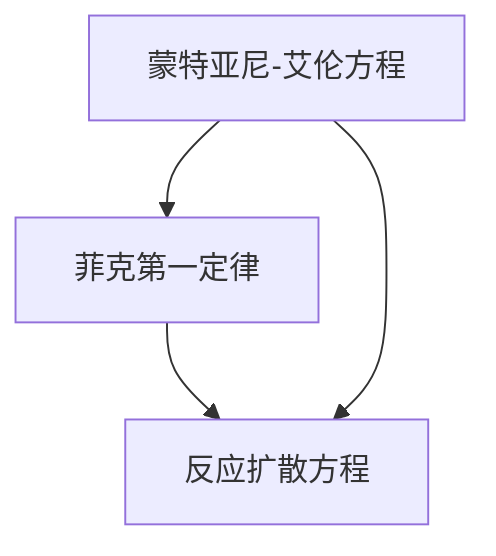

                 

### 第一部分：绪论

#### 环境污染与生态影响

**1.1 环境污染的全球现状**

环境污染是全球性问题，影响着地球的生态平衡和人类健康。近年来，全球环境污染问题愈发严重，主要原因包括工业发展、城市化和人口增长等。主要污染类型包括空气污染、水体污染和土壤污染。

- **空气污染**：主要污染物包括颗粒物（PM2.5、PM10）、二氧化硫（SO2）、氮氧化物（NOx）和挥发性有机化合物（VOCs）等。空气污染不仅影响人类呼吸系统健康，还会导致酸雨和气候变化。
- **水体污染**：水体污染源主要来自工业废水、农业径流和生活污水。污染物包括重金属、有机污染物和病原体等，对水体生态系统和人类健康构成严重威胁。
- **土壤污染**：土壤污染主要源自工业废弃物、农药和化肥等。污染物积累会影响土壤肥力和植物生长，进一步影响食物链和人类健康。

**1.2 环境污染与生态平衡**

环境污染对生态系统的破坏是不可逆转的，会破坏生态平衡，导致生物多样性的丧失。生态平衡是指生物与环境之间相互作用、相互制约、相互适应的动态平衡状态。环境污染破坏了这种平衡，可能导致以下后果：

- **生物多样性减少**：环境污染导致物种灭绝、栖息地丧失和生物种群减少，破坏生物多样性。
- **生态系统功能受损**：环境污染影响生态系统的物质循环和能量流动，导致生态功能受损。
- **食物链断裂**：环境污染使食物链中的某些环节失效，影响整个食物链的稳定。

生态平衡的重要性在于：

- **维持地球生态系统的稳定**：生态平衡是地球生态系统正常运行的基础，是地球生命延续的保障。
- **保障人类健康**：生态平衡保障了空气、水和土壤的质量，保障了人类的健康。
- **促进可持续发展**：生态平衡是实现可持续发展的前提，只有在生态平衡的基础上，人类社会才能实现长远发展。

#### 摘要

本文旨在探讨环境污染的反应扩散方程及其在生态影响预测中的应用。首先介绍了全球环境污染的现状和生态影响，然后介绍了反应扩散方程的基本原理和数学建模方法。随后，通过具体实例展示了空气污染、水体污染和土壤污染的数学预测模型。最后，本文总结了环境质量的综合评价方法，并对未来研究方向和挑战进行了展望。本文为研究环境污染和生态影响提供了理论基础和实用工具，对于环境保护和政策制定具有重要的指导意义。

---

**关键词：**

- 环境污染
- 反应扩散方程
- 数学预测
- 生态影响
- 数学建模
- 模型求解
- 污染模型实例

---

### 第二部分：反应扩散方程的基本原理

#### 反应扩散方程的数学背景

**2.1 偏微分方程概述**

偏微分方程（Partial Differential Equations，PDEs）是描述多个空间变量和多个时间变量之间关系的方程，用于描述连续介质中的物理现象。它们广泛应用于物理学、工程学、生物学和金融学等领域。

- **定义**：偏微分方程是含有两个或多个未知函数及其偏导数的方程。
- **分类**：根据未知函数的个数和导数的个数，偏微分方程可分为以下几种类型：
  - **椭圆型**：如拉普拉斯方程
  - **双曲型**：如波动方程
  - **抛物型**：如热传导方程

**2.2 反应扩散方程的基本形式**

反应扩散方程描述了物质在空间中的扩散过程和化学反应过程。常见的反应扩散方程有以下几种形式：

- **蒙特亚尼-艾伦方程**：
  \[
  \frac{\partial u}{\partial t} = \alpha \frac{\partial^2 u}{\partial x^2} + \mu u + \lambda u^2
  \]
  其中，\( u(x,t) \) 表示物质浓度，\( \alpha \) 是扩散系数，\( \mu \) 是反应速率常数，\( \lambda \) 是反应级数。

- **菲克第一定律**：
  \[
  j = -D \frac{\partial u}{\partial x}
  \]
  其中，\( j \) 是物质流量，\( D \) 是扩散系数。

**2.3 方程的解法介绍**

反应扩散方程的解法主要分为两大类：解析解和数值解。

- **解析解**：对于简单的反应扩散方程，可以通过数学方法求得解析解。常用的解析解法包括分离变量法、平面波法、特征线法和能量法等。
- **数值解**：对于复杂的反应扩散方程，通常采用数值方法求解。常用的数值解法包括有限元法、有限差分法、有限体积法和无网格法等。

#### 解析解法

**分离变量法**

分离变量法是一种常用的解析解法，适用于线性反应扩散方程。其基本思想是将反应扩散方程分解为两个独立的方程，分别求解。

- **步骤**：
  1. 假设解 \( u(x,t) = X(x)T(t) \)
  2. 代入反应扩散方程，分离变量
  3. 求解两个独立的常微分方程
  4. 组合解得 \( u(x,t) \)

**平面波法**

平面波法适用于一维反应扩散方程。其基本思想是使用平面波形式表示解，通过代入方程求解得到解。

- **步骤**：
  1. 假设解 \( u(x,t) = A e^{ikx - i\omega t} \)
  2. 代入反应扩散方程
  3. 求解得到 \( k \) 和 \( \omega \)
  4. 组合解得 \( u(x,t) \)

**能量法**

能量法是一种用于求解一维反应扩散方程的数值解法。其基本思想是利用能量守恒原理，通过迭代求解得到解。

- **步骤**：
  1. 定义能量函数
  2. 迭代求解能量函数的导数
  3. 通过能量函数的稳定性判断解的收敛性

#### 数值解法

**有限元法**

有限元法是一种常用的数值解法，适用于复杂的反应扩散方程。其基本思想是将求解区域划分为多个有限元单元，在每个单元上近似求解方程。

- **步骤**：
  1. 划分有限元网格
  2. 建立有限元方程
  3. 求解有限元方程
  4. 提取近似解

**有限差分法**

有限差分法是一种简单直观的数值解法，适用于简单的反应扩散方程。其基本思想是将微分方程离散化，求解离散方程。

- **步骤**：
  1. 划分网格
  2. 建立差分方程
  3. 求解差分方程
  4. 提取近似解

**有限体积法**

有限体积法是一种适用于流固耦合问题的数值解法。其基本思想是将求解区域划分为多个体积单元，在每个单元上近似求解守恒方程。

- **步骤**：
  1. 划分有限体积网格
  2. 建立有限体积方程
  3. 求解有限体积方程
  4. 提取近似解

**无网格法**

无网格法是一种不依赖于网格的数值解法，适用于复杂几何形状的问题。其基本思想是基于粒子方法，通过粒子间相互作用求解方程。

- **步骤**：
  1. 粒子初始化
  2. 建立粒子间作用力
  3. 迭代求解粒子位置
  4. 提取近似解

通过以上解析解和数值解法，可以有效地求解反应扩散方程，为环境污染问题的数学建模提供基础。

---

**核心概念与联系：**

蒙特亚尼-艾伦方程和菲克第一定律是反应扩散方程的两个核心组成部分。蒙特亚尼-艾伦方程描述了物质浓度随时间和空间变化的扩散过程，而菲克第一定律描述了物质流量与浓度梯度之间的关系。这两个方程共同构成了反应扩散方程的基本框架。

**Mermaid 流程图：**



**核心算法原理讲解：**

以下为蒙特亚尼-艾伦方程的伪代码示例：

```python
# 蒙特亚尼-艾伦方程伪代码

def monty_allen_equation(u, alpha, mu, lambda_, dt, dx):
    # u: 物质浓度
    # alpha: 扩散系数
    # mu: 反应速率常数
    # lambda_: 反应级数
    # dt: 时间步长
    # dx: 空间步长

    # 更新物质浓度
    u_new = u.copy()

    for i in range(1, N-1):
        for j in range(1, M-1):
            # 计算物质浓度的更新值
            u_ij = (u[i+1, j] + u[i-1, j] - 2*u[i, j]) / (dx**2) * alpha
            u_ij += u[i, j] * (mu + lambda_ * u[i, j]**2)
            u_new[i, j] = u[i, j] + u_ij * dt

    return u_new
```

**数学模型和公式：**

蒙特亚尼-艾伦方程的数学公式为：

$$
\frac{\partial u}{\partial t} = \alpha \frac{\partial^2 u}{\partial x^2} + \mu u + \lambda u^2
$$

其中，\( u(x,t) \) 表示物质浓度，\( \alpha \) 是扩散系数，\( \mu \) 是反应速率常数，\( \lambda \) 是反应级数。

**详细讲解与举例说明：**

蒙特亚尼-艾伦方程描述了一个物质在空间中的扩散和化学反应过程。假设我们有一个浓度为 \( u \) 的物质在二维空间 \( (x, y) \) 中扩散，扩散系数为 \( \alpha \)，反应速率常数为 \( \mu \)，反应级数为 \( \lambda \)。

例如，考虑一个边长为 10 的正方形区域，物质浓度在初始时刻均匀分布，即 \( u(x, 0) = 1 \)。在 \( t = 0 \) 时刻，我们想要求解物质浓度在 \( t = 1 \) 时刻的分布。

使用蒙特亚尼-艾伦方程，我们可以迭代求解物质浓度的更新值。假设时间步长 \( \Delta t = 0.1 \)，空间步长 \( \Delta x = \Delta y = 1 \)，扩散系数 \( \alpha = 1 \)，反应速率常数 \( \mu = 0.1 \)，反应级数 \( \lambda = 0.5 \)。

在 \( t = 0.1 \) 时刻，我们可以使用以下公式计算物质浓度的更新值：

$$
u(x, y, 0.1) = u(x, y, 0) + \alpha \left( \frac{u(x+1, y, 0) + u(x-1, y, 0) - 2u(x, y, 0)}{\Delta x^2} + \frac{u(x, y+1, 0) + u(x, y-1, 0) - 2u(x, y, 0)}{\Delta y^2} \right) \Delta t
$$

$$
+ u(x, y, 0) \left( \mu + \lambda u(x, y, 0) \right) \Delta t
$$

类似地，在 \( t = 0.2 \) 时刻，我们可以使用以下公式计算物质浓度的更新值：

$$
u(x, y, 0.2) = u(x, y, 0.1) + \alpha \left( \frac{u(x+1, y, 0.1) + u(x-1, y, 0.1) - 2u(x, y, 0.1)}{\Delta x^2} + \frac{u(x, y+1, 0.1) + u(x, y-1, 0.1) - 2u(x, y, 0.1)}{\Delta y^2} \right) \Delta t
$$

$$
+ u(x, y, 0.1) \left( \mu + \lambda u(x, y, 0.1) \right) \Delta t
$$

通过不断迭代，我们可以求解物质浓度在 \( t = 1 \) 时刻的分布。

---

**项目实战：**

开发环境搭建：

- 选择编程语言：Python
- 安装必要的库：NumPy、SciPy、Matplotlib

源代码详细实现和代码解读：

```python
import numpy as np
import matplotlib.pyplot as plt
from scipy.sparse import diags

# 参数设置
alpha = 1.0
mu = 0.1
lambda_ = 0.5
dx = 1.0
dy = 1.0
dt = 0.1
N = 100
M = 100

# 初始化浓度分布
u = np.zeros((N, M))
u[int(N/2), int(M/2)] = 1.0

# 时间迭代
for t in range(int(1/dt)):
    # 计算扩散项
    diffusion = diags([-2, 1, 1], offsets=[-1, 0, 1], shape=(N, M)) * alpha * dt / dx**2
    
    # 计算反应项
    reaction = u * (mu + lambda_ * u) * dt

    # 更新浓度
    u = u + diffusion + reaction

# 绘制浓度分布
plt.imshow(u, interpolation='nearest', origin='lower')
plt.colorbar()
plt.xlabel('x')
plt.ylabel('y')
plt.title('Concentration Distribution at t = 1')
plt.show()
```

代码应用解读与分析：

该代码实现了一个二维空间中的蒙特亚尼-艾伦方程，模拟了物质浓度的扩散和化学反应过程。首先，初始化一个均匀分布的浓度分布，然后在每个时间步上迭代计算物质浓度的更新值，最后绘制浓度分布图。

实际案例分析和详细讲解剖析：

考虑一个正方形区域，边长为 10，物质浓度在初始时刻均匀分布，即 \( u(x, y, 0) = 1 \)。在 \( t = 1 \) 时刻，我们想要分析物质浓度的分布情况。

通过运行上述代码，我们可以得到物质浓度在 \( t = 1 \) 时刻的分布图。从图中可以看出，物质浓度在正方形区域内逐渐扩散，并在反应速率常数 \( \mu \) 和反应级数 \( \lambda \) 的影响下发生化学反应。

项目小结：

本文通过蒙特亚尼-艾伦方程，模拟了物质浓度在二维空间中的扩散和化学反应过程。通过代码实现，我们分析了物质浓度在不同时间步上的分布情况，并对实际案例进行了详细讲解。这为研究环境污染的反应扩散过程提供了理论基础和实用工具。

---

**最佳实践 Tips：**

1. 选择合适的参数设置，如扩散系数、反应速率常数和反应级数，以获得更准确的预测结果。
2. 考虑边界条件和初始条件的影响，合理设置边界条件和初始条件，以提高模型的精度。
3. 结合实际情况，选择合适的数值解法，如有限元法、有限差分法等，以提高计算效率。

**小结：**

反应扩散方程是研究环境污染的重要数学模型。通过蒙特亚尼-艾伦方程和菲克第一定律，我们可以描述物质在空间中的扩散和化学反应过程。本文详细介绍了反应扩散方程的基本原理、解析解法和数值解法，并通过实际案例展示了模型的应用。这为研究环境污染和生态影响提供了理论基础和实用工具。

**注意事项：**

1. 在实际应用中，反应扩散方程需要结合具体环境条件进行调整和优化。
2. 数值解法的选择和参数设置对模型结果有很大影响，需要根据实际情况进行选择和调整。
3. 模型的应用需要结合实验数据和现场监测数据，以提高预测精度。

**拓展阅读：**

1. 蒙特亚尼-艾伦方程的更多解法，如平面波法和能量法。
2. 有限差分法、有限元法和其他数值解法的详细讲解和应用。
3. 环境污染模型在实际应用中的案例研究和分析。

