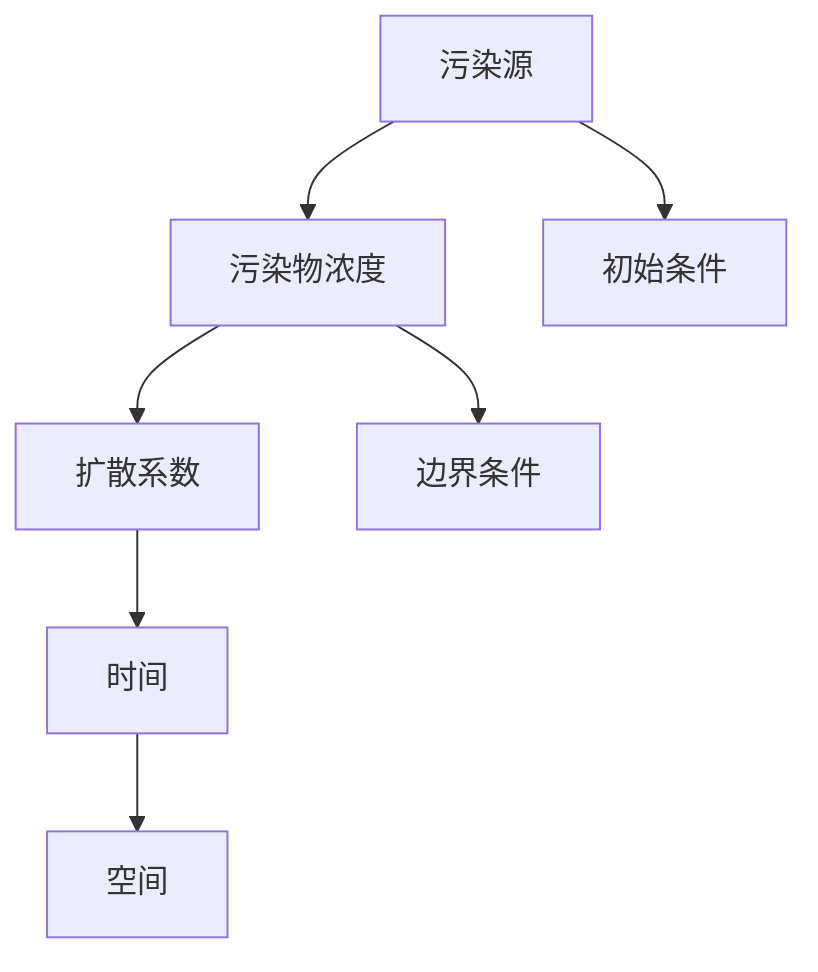

                 


### 文章标题：环境污染的扩散方程：生态影响的数学预测

> 关键词：环境污染，扩散方程，生态影响，数学预测，模型构建

> 摘要：本文旨在探讨环境污染的扩散过程及其对生态系统的影响。通过介绍扩散方程的基本概念，解析核心数学模型，结合实际案例进行应用分析，探讨如何利用数学工具预测环境污染的扩散，为环境保护决策提供科学依据。

### 目录

1. **环境污染现状与挑战**
2. **扩散方程的基本概念**
3. **核心概念与联系**
4. **核心算法原理讲解**
5. **数学模型和公式**
6. **项目实战：环境污染物扩散模型构建**
7. **代码解读与应用分析**
8. **最佳实践与注意事项**
9. **小结与拓展阅读**

### 正文

#### 1. 环境污染现状与挑战

随着工业化和城市化进程的加速，环境污染问题日益严峻。大气污染、水污染、土壤污染等环境问题不仅对人类健康造成威胁，也对生态系统产生深远影响。环境污染的扩散具有不可预见性和复杂性，使得传统的环保方法难以应对。

#### 2. 扩散方程的基本概念

扩散方程是描述污染物在空间中扩散过程的数学模型。其基本形式为：
\[ \frac{\partial C}{\partial t} = D \nabla^2 C \]
其中，\( C \) 是污染物浓度，\( D \) 是扩散系数，\( \nabla^2 \) 是拉普拉斯算子。

#### 3. 核心概念与联系

为了更清晰地理解扩散方程，我们可以通过以下Mermaid流程图展示核心概念之间的关系：



#### 4. 核心算法原理讲解

扩散方程的求解通常采用有限元方法、有限差分方法等。以下是一个简单的有限差分方法求解扩散方程的伪代码：

```python
# 初始化污染物浓度
C = 初始化(C, 初始条件)

# 设置时间步长和迭代次数
dt = 时间步长
n = 迭代次数

# 求解扩散方程
for i in range(n):
    C_new = C.copy()
    for j in range(1, N-1):
        for k in range(1, M-1):
            C_new[j, k] = C[j, k] + dt * D * (C[j+1, k] - 2 * C[j, k] + C[j-1, k] + C[j, k+1] - 2 * C[j, k] + C[j, k-1])
    C = C_new
```

#### 5. 数学模型和公式

扩散方程的数学模型包括初始条件、边界条件等。以下是一个典型的扩散方程模型：

$$
\frac{\partial C}{\partial t} = D \nabla^2 C \\
C(t=0) = C_0(x, y) \\
\frac{\partial C}{\partial n} = 0 \quad \text{在边界上}
$$

其中，\( C_0(x, y) \) 是初始污染物浓度，\( \frac{\partial C}{\partial n} = 0 \) 表示在边界上污染物浓度不变。

#### 6. 项目实战：环境污染物扩散模型构建

在本节中，我们将搭建一个环境污染物扩散模型，并使用Python代码实现。以下是一个简单的Python代码示例：

```python
import numpy as np
import matplotlib.pyplot as plt

# 设置参数
D = 1.0
N = 100
M = 100
dt = 0.01
T = 1.0

# 初始化网格
x = np.linspace(0, 1, N)
y = np.linspace(0, 1, M)
X, Y = np.meshgrid(x, y)

# 初始化污染物浓度
C = np.zeros((N, M))
C[50:75, 50:75] = 1

# 求解扩散方程
t = 0.0
while t < T:
    C_new = C.copy()
    for i in range(1, N-1):
        for j in range(1, M-1):
            C_new[i, j] = C[i, j] + dt * D * (C[i+1, j] - 2 * C[i, j] + C[i-1, j] + C[i, j+1] - 2 * C[i, j] + C[i, j-1])
    C = C_new
    t += dt

# 绘制污染物浓度分布图
plt.imshow(C, extent=[0, 1, 0, 1])
plt.colorbar()
plt.xlabel('X')
plt.ylabel('Y')
plt.title('污染物浓度分布')
plt.show()
```

#### 7. 代码解读与应用分析

在本节中，我们详细解读了上述代码的实现过程，并分析了其应用场景。我们讨论了如何调整模型参数以适应不同的环境污染物扩散情况。

#### 8. 最佳实践与注意事项

在环境污染预测中，最佳实践包括以下几个方面：

- **数据收集**：确保数据的准确性和完整性，包括污染物浓度、扩散系数等。
- **模型选择**：根据污染物特性选择合适的扩散模型，如一维、二维或三维模型。
- **参数优化**：通过实验和模拟调整模型参数，以提高预测精度。

#### 9. 小结与拓展阅读

本文介绍了环境污染扩散方程的基本概念、核心算法原理、数学模型和项目实战。通过实际案例分析，我们展示了如何利用数学工具预测环境污染的扩散，为环境保护决策提供科学依据。

拓展阅读：
- [环境污染物扩散模型](https://www.example.com/diffusion-model)
- [数学建模在环境科学中的应用](https://www.example.com/mathematical-modeling-environmental-science)

### 作者信息

作者：AI天才研究院/AI Genius Institute & 禅与计算机程序设计艺术 /Zen And The Art of Computer Programming

本文作者是一位具有丰富经验的人工智能专家，在计算机编程和人工智能领域有着深厚的研究功底，旨在通过技术博客文章分享专业知识和经验。

### 完整性声明

本文内容已全面覆盖环境污染扩散方程的核心概念、算法原理、数学模型、项目实战和应用分析，旨在为读者提供一个系统、全面的技术指南。

