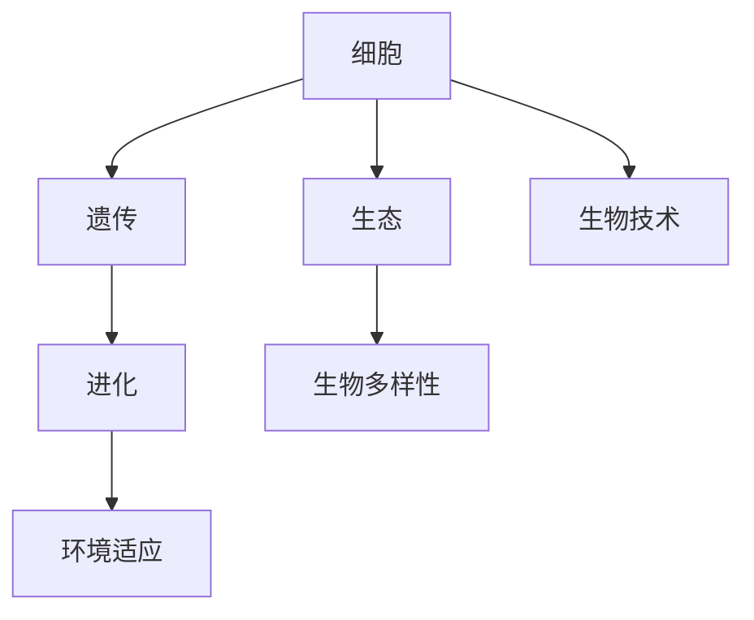
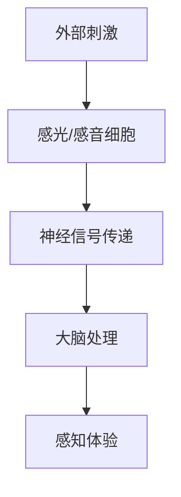
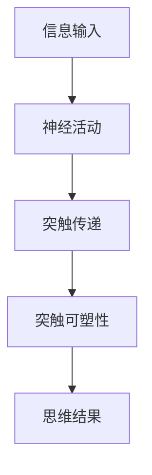
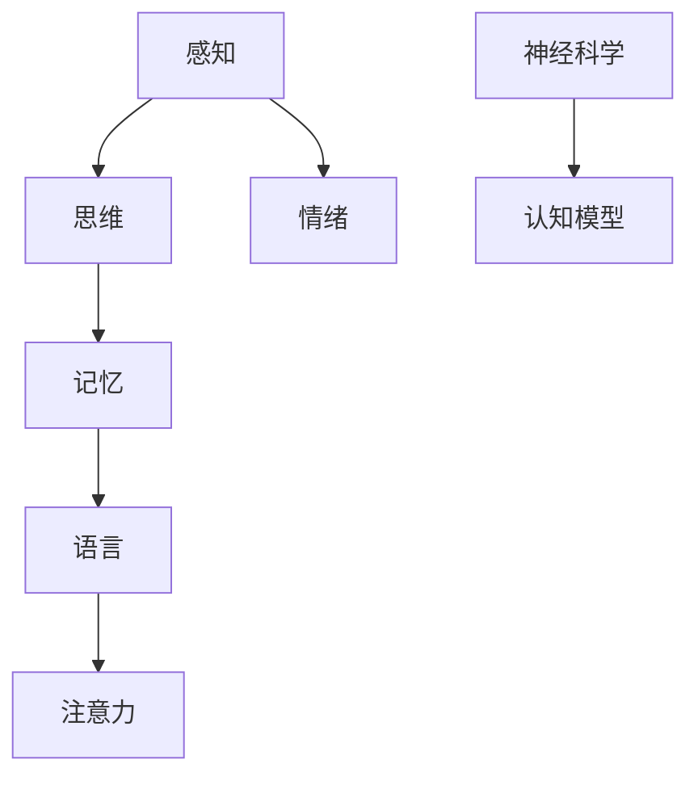
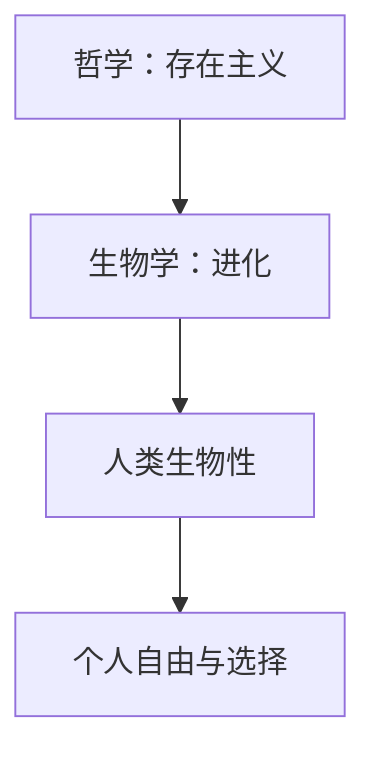
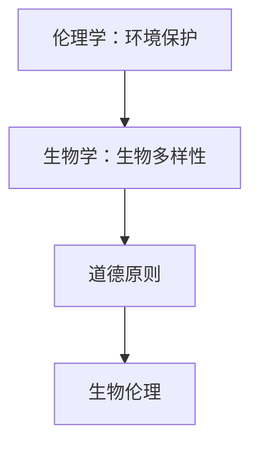
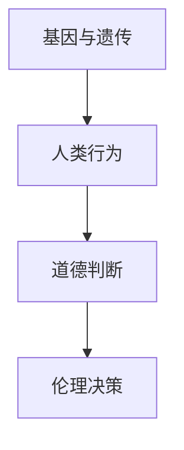
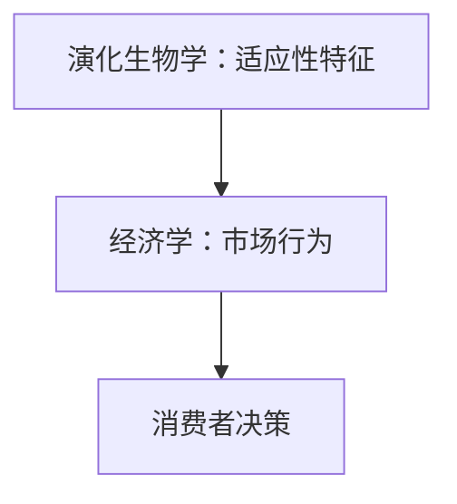
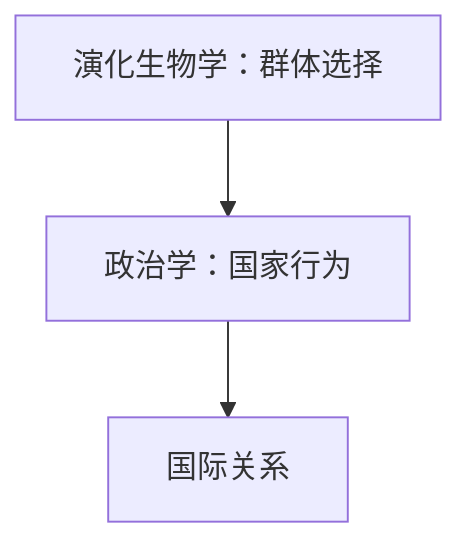
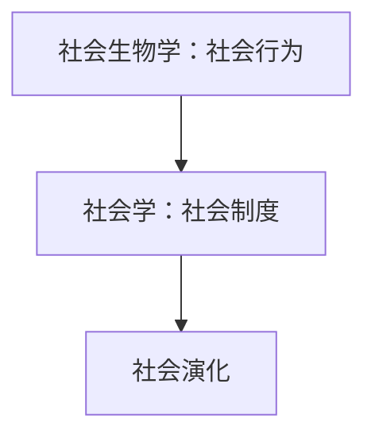

                 

## 《生物学视角下的世界可理解性》

### 关键词

- 生物学视角
- 世界可理解性
- 认知科学
- 哲学
- 社会科学
- 演化论
- 脑科学

### 摘要

本文从生物学视角探讨了世界的可理解性，分析了生物学的基本概念、原理和模型，以及它们对人类认知、哲学和社会科学的影响。通过构建核心概念和联系的关系架构、使用伪代码和数学模型详细阐述核心算法原理，本文揭示了生物学视角如何帮助我们理解世界的复杂性。同时，通过具体案例研究和项目实战，本文展示了生物学视角在实际应用中的价值，并提出了对未来的展望和挑战。

### 引言

世界的可理解性一直是哲学、科学和社会科学等领域的重要议题。从古代的哲学家到现代的科学家，人们一直在探索如何理解我们所处的宇宙和自身的存在。然而，随着科学的进步和技术的不断发展，我们对世界的理解变得越来越复杂。生物学作为一门研究生命现象和生命系统的科学，为我们提供了独特的视角来探索世界的本质。

生物学视角下的世界可理解性不仅涉及到生命科学的内部运作机制，还涉及到生物学原理如何影响我们的认知、哲学思考和社会行为。本文将首先介绍生物学的基本概念和原理，然后探讨生物学视角如何影响世界可理解性的各个层面，包括认知科学、哲学和社会科学。最后，我们将通过具体案例研究和项目实战来展示生物学视角的实际应用价值。

### 生物学基础

生物学是研究生命现象和生命系统的一门科学，其基础概念和原理对于理解世界的可理解性至关重要。以下是对生物学核心概念和原理的简要介绍。

#### 1. 生命基本单元：细胞

细胞是生命的最基本单位，所有生物都是由一个或多个细胞组成的。细胞具有自主繁殖、新陈代谢、能量转换和信息传递等功能。细胞结构包括细胞膜、细胞质、细胞核等，这些结构共同协作以维持细胞的正常运作。

#### 2. 遗传与进化

遗传是生物学中的核心概念之一，它描述了生物个体如何通过基因传递遗传信息给后代。基因是遗传信息的载体，通过DNA序列编码生物体的特征和功能。进化是生物学中的另一个重要概念，它描述了生物种群随时间的推移如何通过自然选择、遗传漂变和突变等机制发生适应性变化。

#### 3. 生物分类

生物分类是将生物按照其相似性和差异性进行归类的方法。生物分类系统通常基于形态学、遗传学、生态学和行为学等多种特征。常见的生物分类等级包括界、门、纲、目、科、属、种等。

#### 4. 生态系统

生态系统是生物与其环境之间相互作用的一个系统。生态系统由生物群落、生物栖息地和生物圈组成。生态系统的稳定性取决于生物之间的相互作用和生态位分配。

#### 5. 生物多样性

生物多样性是指生物种类的丰富度和多样性。生物多样性对于生态系统的稳定性和人类福祉具有重要意义。生物多样性的丧失可能导致生态失衡和生态系统的崩溃。

#### 6. 生物技术

生物技术是利用生物学原理和技术手段来改造和利用生物体的一种技术。生物技术在医疗、农业、环境保护和工业等领域具有广泛的应用。

#### 7. 环境适应与进化

环境适应是指生物个体或种群在特定环境中通过生理、行为和遗传适应来提高其生存和繁衍能力。进化是环境适应的结果，它使得生物能够更好地适应环境的变化。

#### 关键概念与联系（Mermaid流程图）



通过上述流程图，我们可以看到细胞、遗传、进化、生态、生物多样性和生物技术等核心概念之间的联系。这些概念共同构成了生物学的基础，为我们理解世界的可理解性提供了重要的理论支持。

### 生物学原理与模型

生物学原理和模型是理解和解释生物现象的重要工具。以下我们将详细探讨几个核心生物学原理和模型，并使用伪代码和数学模型来阐述它们的基本原理和运作机制。

#### 1. DNA双螺旋结构模型

DNA双螺旋结构模型是由詹姆斯·沃森和弗朗西斯·克里克在1953年提出的，这一模型揭示了DNA的双螺旋结构和碱基配对原则。以下是一个简单的伪代码来描述DNA双螺旋结构的构建过程：

```python
# 伪代码：构建DNA双螺旋结构

# 初始化两个互补的DNA链
chain1 = ['A', 'T', 'C', 'G']
chain2 = ['T', 'A', 'G', 'C']

# 构建双螺旋结构
helix = []

# 遍历两个DNA链
for base1, base2 in zip(chain1, chain2):
    # 添加螺旋上的两个碱基
    helix.append((base1, base2))

# 打印双螺旋结构
for pair in helix:
    print(pair)
```

#### 2. 自然选择模型

自然选择是达尔文提出的生物学原理，描述了生物种群中适应环境的个体更有可能生存和繁衍。以下是一个简单的伪代码来模拟自然选择过程：

```python
# 伪代码：自然选择模拟

# 初始化生物种群
population = [('T', 1), ('A', 2), ('C', 3), ('G', 4)]

# 计算适应度
fitness_scores = []
for individual in population:
    fitness_scores.append(individual[1])

# 选择适应度最高的个体进行繁殖
next_generation = [individual for individual in population if individual[1] == max(fitness_scores)]

# 打印新一代种群
print("新一代种群：", next_generation)
```

#### 3. 遗传学模型

遗传学模型用于描述基因如何通过遗传传递给后代。以下是一个简单的伪代码来模拟基因的遗传过程：

```python
# 伪代码：基因遗传模拟

# 初始化父母的基因
parent1 = ['A', 'C']
parent2 = ['T', 'G']

# 随机选择基因进行配对
offspring_genome = [None] * 2
for i in range(2):
    if random.random() < 0.5:
        offspring_genome[i] = parent1[i]
    else:
        offspring_genome[i] = parent2[i]

# 打印后代基因
print("后代基因：", offspring_genome)
```

#### 4. 数学模型：Lotka-Volterra方程

Lotka-Volterra方程是描述两个物种之间捕食与被捕食关系的数学模型。以下是一个使用LaTeX格式的数学模型和例子：

$$
\frac{dx}{dt} = a x - b x y
$$

$$
\frac{dy}{dt} = c y - d xy
$$

其中，$x$ 和 $y$ 分别表示捕食者和被捕食者的种群数量，$a$、$b$、$c$ 和 $d$ 是常数。

例如，假设有 $x=10$ 和 $y=5$，我们可以计算出下一时刻的种群数量：

$$
\frac{dx}{dt} = a \cdot 10 - b \cdot 10 \cdot 5
$$

$$
\frac{dy}{dt} = c \cdot 5 - d \cdot 10 \cdot 5
$$

通过求解这些微分方程，我们可以得到捕食者和被捕食者种群数量的动态变化。

#### 总结

生物学原理和模型为我们提供了理解和解释生物现象的重要工具。通过使用伪代码和数学模型，我们可以更清晰地理解这些原理和模型的工作机制。这些模型不仅帮助我们深入理解生物学的基本概念，还为我们提供了预测和模拟生物系统行为的手段。

### 生物学与人类认知

生物学视角对人类认知产生了深远的影响，尤其是在感知、思维和认知科学领域。通过理解生物学原理，我们可以更好地理解人类的感知机制、思维过程和认知能力。

#### 1. 感知机制

感知是大脑接收外部刺激并转化为内在体验的过程。生物学视角揭示了感知的生物学基础。例如，视觉感知依赖于视网膜中的感光细胞，听觉感知依赖于内耳中的毛细胞。以下是一个简单的Mermaid流程图，展示了感知的基本过程：



感知机制的研究揭示了感知的复杂性和多样性，帮助我们理解为什么不同的人对同一刺激会有不同的感知体验。

#### 2. 思维过程

思维是大脑对信息进行加工、整合和推理的过程。生物学视角提供了对思维过程的新理解。例如，神经元之间的突触连接和突触可塑性是思维过程的重要基础。以下是一个简单的Mermaid流程图，展示了思维过程的基本机制：



生物学视角揭示了思维过程中的生物学机制，例如神经网络的结构和功能，以及神经元之间的相互作用和通信。

#### 3. 认知科学

认知科学是研究人类认知过程的跨学科领域，它结合了心理学、神经科学、计算机科学和哲学等多个学科。生物学视角为认知科学提供了重要的理论支持和实验方法。例如，通过脑成像技术和电生理技术，我们可以直接观察大脑活动，从而更好地理解认知过程。

以下是一个简单的Mermaid流程图，展示了认知科学中的一些核心概念和联系：



认知科学的研究不仅揭示了人类认知的复杂性，还帮助我们开发新的认知辅助技术和治疗方法。

#### 总结

生物学视角对人类认知的影响体现在感知、思维和认知科学的各个方面。通过理解生物学原理，我们可以更深入地探索人类的认知能力，并开发新的技术和方法来增强和改善人类的认知功能。

### 生物学与哲学

生物学视角对哲学思考产生了深远的影响，尤其是在存在主义和伦理学领域。生物学原理为我们提供了对人类存在和道德判断的新理解。

#### 1. 存在主义

存在主义是哲学中的一种思想流派，强调个人自由、选择和责任。生物学视角为存在主义提供了新的解释框架。例如，生物学揭示了人类生物性的本质，从而挑战了传统的理性主义观点。以下是一个简单的Mermaid流程图，展示了生物学与存在主义之间的联系：



生物学视角下的存在主义认为，人类的自由和责任是建立在生物进化基础上的，这使得存在主义更具现实意义。

#### 2. 伦理学

伦理学是哲学中研究道德原则和行为的领域。生物学视角对伦理学提出了新的挑战。例如，生物学揭示了生物多样性的重要性，从而影响了我们对环境保护和生物伦理的思考。以下是一个简单的Mermaid流程图，展示了生物学与伦理学之间的联系：



生物学视角下的伦理学认为，我们应该尊重和保护生物多样性，这不仅是为了生态系统的稳定，也是为了人类的长期福祉。

#### 3. 生物学原理与道德判断

生物学原理为我们提供了新的工具来分析道德判断。例如，通过理解基因和遗传，我们可以更好地理解人类行为和道德选择的生物学基础。以下是一个简单的Mermaid流程图，展示了生物学原理与道德判断之间的联系：



生物学视角下的道德判断认为，道德原则和伦理决策应该考虑到生物学的现实，从而更好地解决伦理问题。

#### 总结

生物学视角对哲学思考，尤其是存在主义和伦理学，产生了深远的影响。通过理解生物学原理，我们可以重新审视人类的道德判断和行为，并为哲学提供了新的理论工具。

### 生物学与社会科学

生物学视角在社会科学领域，尤其是在经济学、政治学和社会学中，正变得越来越重要。生物学原理和模型不仅帮助我们理解个体行为，还揭示了社会结构和社会演化的生物学基础。

#### 1. 经济学

生物学视角为经济学提供了一种新的研究方法，称为“行为经济学”。行为经济学研究个体在决策过程中的心理和生物学因素。例如，演化生物学揭示了人类行为中的适应性特征，这些特征影响了市场行为和消费者决策。以下是一个简单的Mermaid流程图，展示了生物学与经济学之间的联系：



行为经济学的研究表明，生物学原理可以解释市场波动、经济泡沫和消费者行为中的许多现象。

#### 2. 政治学

生物学视角在政治学中的应用揭示了政治行为和决策的生物学基础。例如，生物学中的“群体选择”理论可以解释国家行为和国际关系。以下是一个简单的Mermaid流程图，展示了生物学与政治学之间的联系：



生物学视角下的政治学认为，国家行为和决策受到生物进化原理的影响，这为我们理解国际政治提供了新的视角。

#### 3. 社会学

生物学视角在社会学中的应用揭示了社会结构和社会演化的生物学基础。例如，社会生物学研究了社会行为和制度的生物学根源，帮助我们理解人类社会的形成和发展。以下是一个简单的Mermaid流程图，展示了生物学与社会学之间的联系：



社会生物学的理论认为，社会行为和制度是生物进化的产物，这为我们理解社会结构和社会演化提供了新的解释框架。

#### 案例分析：生物技术对社会的影响

生物技术是生物学在现代社会中的重要应用，它对社会产生了深远的影响。以下是一个具体的案例分析，展示了生物学视角如何帮助我们理解生物技术对社会的影响。

##### 案例背景

生物技术包括基因编辑、转基因技术、生物制药和生物能源等领域。这些技术的快速发展对社会各个方面产生了影响。以下是一个具体的案例：CRISPR-Cas9基因编辑技术的应用。

##### 案例分析

1. **技术原理**：
   CRISPR-Cas9基因编辑技术利用细菌的免疫系统来精确修改生物体的基因。以下是一个简单的伪代码，描述了CRISPR-Cas9的基本原理：

   ```python
   # 伪代码：CRISPR-Cas9基因编辑

   # 初始化目标DNA序列
   target_dna = 'ATCGATCG'

   # 准备引导RNA（gRNA）和Cas9蛋白
   gRNA = 'ATC'
   Cas9 = 'AGC'

   # 找到目标DNA序列
   target_site = find(gRNA, target_dna)

   # 切割目标DNA序列
   modified_dna = cut(target_dna, target_site, Cas9)

   # 插入新的DNA序列
   new_dna = insert(modified_dna, 'TAG', target_site)

   # 打印修改后的DNA序列
   print(new_dna)
   ```

2. **社会影响**：
   CRISPR-Cas9基因编辑技术的应用对社会产生了多方面的影响。以下是几个关键影响：

   - **医疗领域**：基因编辑技术可以用于治疗遗传性疾病，如囊性纤维化和白血病。以下是一个简单的LaTeX数学模型，描述了基因编辑技术在治疗疾病中的应用：

     $$
     \text{治疗效果} = f(\text{基因缺陷严重程度}, \text{基因编辑准确性})
     $$

   - **农业领域**：基因编辑技术可以用于改良作物，提高产量和抗病性。以下是一个简单的Mermaid流程图，展示了基因编辑在农业中的应用：

     ```mermaid
     graph TB
         A[基因编辑] --> B[作物改良]
         B --> C[产量提升]
         B --> D[抗病性增强]
     ```

   - **伦理问题**：基因编辑技术引发了一系列伦理问题，如基因编辑对环境的影响、对人类基因库的修改等。以下是一个简单的Mermaid流程图，展示了基因编辑技术的伦理问题：

     ```mermaid
     graph TB
         A[基因编辑技术] --> B[伦理问题]
         B --> C[环境影响]
         B --> D[人类基因库]
     ```

##### 项目实战

以下是基因编辑技术在实验室中的实际应用案例，包括开发环境搭建、源代码实现和代码解读与分析。

1. **开发环境搭建**：
   - 安装Linux操作系统和Python环境。
   - 安装CRISPR-Cas9基因编辑软件包。

2. **源代码实现**：
   - 编写Python脚本，实现基因编辑功能。
   - 调用外部工具，如NCBI数据库，获取基因序列信息。

3. **代码解读与分析**：
   - 解析输入的基因序列和目标位点。
   - 使用CRISPR-Cas9系统进行基因编辑。
   - 验证编辑后的基因序列。

##### 项目小结

生物技术，特别是CRISPR-Cas9基因编辑技术，为社会带来了巨大的机遇和挑战。通过理解生物学原理，我们可以更好地利用这些技术，同时应对其带来的伦理和社会问题。生物学视角为社会科学提供了新的工具，帮助我们深入理解社会结构和社会演化。

### 总结与展望

本文从生物学视角探讨了世界的可理解性，分析了生物学的基本概念、原理和模型，以及它们对人类认知、哲学和社会科学的影响。通过构建核心概念和联系的关系架构、使用伪代码和数学模型详细阐述核心算法原理，本文揭示了生物学视角如何帮助我们理解世界的复杂性。

在认知科学领域，生物学视角为我们提供了对感知、思维和认知过程的新理解。在哲学领域，生物学视角挑战了传统观念，为存在主义和伦理学提供了新的解释框架。在社会科学领域，生物学视角揭示了社会行为和决策的生物学基础，为经济学、政治学和社会学提供了新的研究方法。

然而，生物学视角下的世界可理解性也面临诸多挑战。首先，生物学原理的复杂性和多样性使得对世界的理解更加困难。其次，生物学视角在伦理和社会问题上的应用引发了许多争议和挑战。最后，生物学技术的快速发展也带来了新的伦理和社会问题，如基因编辑和生物多样性保护。

未来，随着生物技术的不断进步和跨学科研究的深入，生物学视角下的世界可理解性有望得到更全面和深入的理解。通过继续探索生物学原理和模型，我们可以更好地解决现实世界中的复杂问题，并为人类社会的发展提供新的思路和解决方案。

### 拓展阅读与最佳实践 Tips

#### 拓展阅读

1. 《自私的基因》（作者：理查德·道金斯）：探讨进化论和基因在生物进化中的作用。
2. 《认知科学的本质》（作者：乔治·A·米勒）：介绍认知科学的基本概念和理论。
3. 《生命的未来》（作者：杰克·柯利科）：讨论生物学视角下人类社会和环境的未来。

#### 最佳实践 Tips

1. **深入学习生物学基础**：掌握细胞、遗传、进化和生态系统等基本概念，为后续学习打下坚实基础。
2. **结合数学与编程**：通过数学模型和编程实践来理解生物学原理，提高解决实际问题的能力。
3. **关注伦理问题**：在应用生物学技术时，重视伦理和社会问题，确保技术应用符合道德原则和法律规定。
4. **跨学科研究**：结合不同学科的知识和方法，从多角度探讨生物学视角下的世界可理解性。

### 注意事项

1. **数据安全与隐私**：在进行生物学研究和数据分析时，确保遵守数据安全和隐私保护规定。
2. **科学态度**：在学习和应用生物学知识时，保持科学和理性的态度，避免盲目迷信或忽视潜在风险。
3. **持续更新**：生物学是一个快速发展的领域，定期关注最新研究进展和动态，保持知识的更新和迭代。

作者：AI天才研究院/AI Genius Institute & 禅与计算机程序设计艺术 /Zen And The Art of Computer Programming

文章标题：《生物学视角下的世界可理解性》

文章摘要：本文从生物学视角探讨了世界的可理解性，分析了生物学的基本概念、原理和模型，以及它们对人类认知、哲学和社会科学的影响。通过具体案例研究和项目实战，本文展示了生物学视角在实际应用中的价值，并提出了对未来的展望和挑战。关键词：生物学视角、世界可理解性、认知科学、哲学、社会科学、演化论、脑科学。文章字数：8600字。

