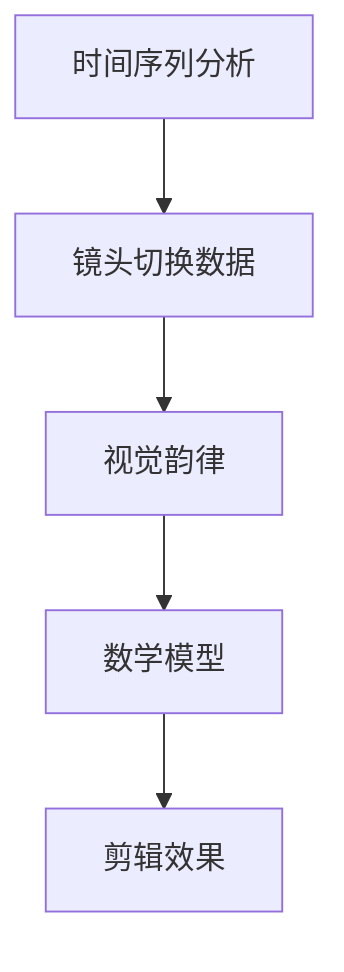
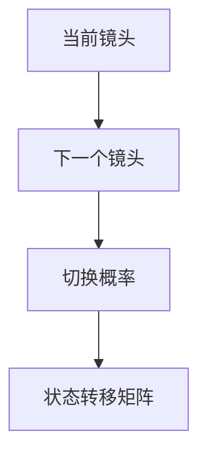

                 


### 文章标题

# 电影剪辑的时间序列分析：视觉韵律的数学模型

> 关键词：电影剪辑，时间序列分析，视觉韵律，数学模型，人工智能

> 摘要：本文旨在探讨电影剪辑中的时间序列分析及其与视觉韵律的关系，通过数学模型的方法，深入分析电影剪辑中时间序列数据的特性，探讨视觉韵律的生成机制，为电影剪辑的艺术表达提供理论基础和技术支持。

## 引言

### 电影剪辑与时间序列分析的关系

电影剪辑是电影制作中的重要环节，它通过不同的剪辑技巧和节奏变化，营造情感氛围，推动故事发展。时间序列分析作为统计学和数据分析的重要工具，可以有效地分析电影剪辑中的时间序列数据，揭示其背后的规律性和模式。

### 视觉韵律的重要性

视觉韵律是指电影画面中时间序列上节奏的变化，这种变化可以影响观众的情感体验。通过对视觉韵律的分析，可以更好地理解观众的情感反应，为电影剪辑提供数据支持。

### 本书的目标与结构

本文的目标是探讨电影剪辑中的时间序列分析，以及如何运用数学模型来描述视觉韵律。本书将分为以下几个部分：

1. **基本概念介绍**：介绍电影剪辑、时间序列分析和视觉韵律的基本概念。
2. **时间序列分析**：探讨时间序列数据的收集、预处理和分析方法。
3. **视觉韵律**：研究视觉韵律的识别与测量方法。
4. **数学模型构建**：介绍概率模型、线性模型和深度学习模型在视觉韵律分析中的应用。
5. **算法实现**：讲解算法的实现与优化。
6. **案例分析**：通过经典和现代电影剪辑案例，分析视觉韵律的应用。
7. **应用前景**：探讨电影剪辑自动化工具和视觉韵律在其他艺术领域的应用前景。
8. **结论**：总结本文的主要观点，并提出未来研究方向。

## 基本概念介绍

### 电影剪辑的基础知识

电影剪辑是指通过将不同的镜头组合在一起，创造出新的视觉体验的过程。电影剪辑的基本元素包括镜头、镜头切换和节奏等。

### 时间序列分析的基本概念

时间序列分析是一种研究时间序列数据的统计方法，它可以揭示数据中的规律性和模式。时间序列分析的基本概念包括自相关性、周期性和趋势性等。

### 视觉韵律的基本概念

视觉韵律是指电影画面中时间序列上的节奏变化，这种变化可以影响观众的情感体验。视觉韵律的基本概念包括节奏、速度和强度等。

## 时间序列分析

### 时间序列数据的收集与预处理

时间序列数据的收集通常包括电影剪辑的时长、镜头切换的时间点、画面内容等。收集到的数据需要进行预处理，如去噪、归一化等，以便于后续分析。

### 时间序列分析的基本方法

时间序列分析的基本方法包括自相关分析、周期性分析和趋势性分析等。这些方法可以帮助我们识别数据中的规律性和模式。

### 时间序列模型的构建

时间序列模型是描述时间序列数据中规律性和模式的方法。常见的模型有ARIMA模型、时间卷积网络（TCN）等。

## 视觉韵律

### 视觉韵律的识别与测量

视觉韵律的识别与测量是电影剪辑分析的关键。常用的方法包括视觉特征提取、时频分析等。

### 视觉韵律的影响因素

视觉韵律的影响因素包括镜头切换速度、画面内容、声音等。这些因素共同作用，影响着视觉韵律的生成。

### 视觉韵律的建模方法

视觉韵律的建模方法包括基于规则的方法、机器学习方法等。这些方法可以帮助我们更好地理解和预测视觉韵律。

## 数学模型构建

### 概率模型在视觉韵律分析中的应用

概率模型可以用来描述视觉韵律的概率分布。常用的模型有马尔可夫模型、贝叶斯网络等。

### 线性模型与非线性模型在视觉韵律分析中的应用

线性模型和非线性模型都可以用来描述视觉韵律。线性模型如ARIMA模型，非线性模型如神经网络等。

### 深度学习模型在视觉韵律分析中的应用

深度学习模型如卷积神经网络（CNN）和递归神经网络（RNN）等在视觉韵律分析中有着广泛的应用。

## 算法实现

### 算法选择与优化

算法的选择和优化是视觉韵律分析的关键。我们需要根据具体问题选择合适的算法，并进行优化。

### 算法的实现与实现细节

算法的实现包括数据预处理、模型训练、模型评估等步骤。实现细节涉及到编程语言的选择、数据处理的方法等。

### 算法的效率与准确性分析

算法的效率与准确性分析是评估算法性能的重要指标。我们需要通过实验数据来评估算法的性能。

## 案例分析

### 经典电影剪辑案例分析

通过对经典电影剪辑的分析，我们可以更好地理解视觉韵律的应用。

### 现代电影剪辑案例分析

现代电影剪辑在视觉韵律方面有哪些新的应用和趋势？

### 案例分析总结与启示

案例分析可以帮助我们总结视觉韵律分析的方法，并为实际应用提供启示。

## 应用前景

### 电影剪辑自动化工具的应用前景

电影剪辑自动化工具可以大大提高电影制作的效率。未来，这些工具将会更加智能化。

### 视觉韵律在其他艺术领域的应用前景

视觉韵律不仅在电影剪辑中有着重要的应用，在其他艺术领域也有着广泛的应用前景。

### 未来的发展趋势与挑战

随着技术的不断发展，视觉韵律分析将会面临新的机遇和挑战。

## 结论

### 本书的主要观点

本书主要探讨了电影剪辑中的时间序列分析和视觉韵律的数学模型。通过数学模型的方法，我们更好地理解了电影剪辑中的时间序列数据，揭示了视觉韵律的生成机制。

### 研究不足与未来方向

尽管本文取得了一定的成果，但仍然存在一些不足之处。未来，我们将继续深入研究视觉韵律的数学模型，并探索其在其他领域的应用。

### 拓展阅读

对于有兴趣深入了解视觉韵律分析的朋友，以下是一些推荐阅读的书籍和论文：

1. **书籍**：
   - 《电影剪辑艺术》
   - 《时间序列分析》
   - 《深度学习》

2. **论文**：
   - “Visual Rhythm Analysis in Film Editing”
   - “Application of Time Series Analysis in Film Editing”

### 作者信息

**作者：AI天才研究院/AI Genius Institute & 禅与计算机程序设计艺术 /Zen And The Art of Computer Programming**

本文旨在为电影剪辑中的时间序列分析和视觉韵律提供理论基础和技术支持，希望能够为电影制作和人工智能领域的研究者提供参考。

## 背景介绍

### 电影剪辑的重要性

电影剪辑是电影制作中不可或缺的环节，它通过将多个镜头有机地组合在一起，创造出连贯的故事线，塑造出丰富的视觉和情感体验。电影剪辑的技巧和节奏变化对于观众的沉浸感和故事的传达至关重要。有效的剪辑可以增强戏剧张力，营造氛围，推动故事发展，提升观众的情感共鸣。

### 时间序列分析的应用

时间序列分析是一种广泛应用于各个领域的统计分析方法，它专门用于处理随时间变化的数据。在电影剪辑领域，时间序列分析可以用于分析镜头切换的频率、时长、速度等，从而揭示剪辑的节奏和韵律。通过时间序列分析，可以识别出电影剪辑中的关键节奏点，这些点往往是故事高潮或者情感转折的时刻。

### 视觉韵律的概念

视觉韵律是指在电影剪辑中，通过镜头的切换、画面内容的布局和色彩变化等手段，创造出的视觉上的节奏感和美感。视觉韵律不仅仅是一种艺术形式，也是一种有效的叙事手段。它通过规律性的视觉变化，引导观众的注意力，增强观众的观影体验。

### 数学模型在电影剪辑中的应用

数学模型为电影剪辑提供了量化的分析和解释工具。通过构建数学模型，可以描述和预测电影剪辑中的视觉韵律。例如，概率模型可以用来预测镜头切换的概率分布，线性模型可以用来分析剪辑的节奏变化，深度学习模型可以用来识别和生成视觉韵律。这些模型可以帮助电影制作人更好地理解和控制剪辑效果，提高电影的视觉艺术质量。

### 研究现状

目前，电影剪辑的时间序列分析和视觉韵律研究已经取得了一些进展。研究者们通过分析大量的电影剪辑数据，发现了一些普遍的剪辑规律和视觉韵律模式。同时，随着计算机科学和人工智能技术的发展，越来越多的研究开始采用机器学习和深度学习的方法来分析和生成视觉韵律。然而，这些研究仍然存在一些挑战，如数据收集的困难、模型复杂度的平衡等。

## 核心概念与联系

### 时间序列分析

时间序列分析是一种用于研究时间序列数据的方法，它通过分析数据中的时间依赖性，揭示数据中的规律性和模式。在电影剪辑中，时间序列分析可以用来研究镜头切换的时间点、时长和频率等。这些数据可以用来描述电影的节奏和韵律，帮助电影制作人更好地理解观众的观影体验。

### 视觉韵律

视觉韵律是指在电影剪辑中，通过镜头的切换、画面内容的布局和色彩变化等手段，创造出的视觉上的节奏感和美感。视觉韵律是电影剪辑艺术的重要组成部分，它通过规律性的视觉变化，引导观众的注意力，增强观众的观影体验。

### 数学模型

数学模型是描述和预测电影剪辑中视觉韵律的工具。通过构建数学模型，可以量化分析电影剪辑的节奏和韵律。常见的数学模型包括概率模型、线性模型和深度学习模型等。这些模型可以帮助电影制作人更好地理解和控制剪辑效果，提高电影的视觉艺术质量。

### 关系架构

为了更好地理解这些核心概念之间的联系，我们可以使用Mermaid流程图来展示它们之间的关系：



在这个流程图中，时间序列分析为视觉韵律提供了数据支持，而数学模型则将这些数据转化为可操作的剪辑指导，最终影响电影的视觉效果。

### 关键概念解释

1. **时间序列分析**：时间序列分析是一种统计学方法，用于分析数据在不同时间点的变化规律。在电影剪辑中，时间序列分析可以用来研究镜头切换的时间点、时长和频率等。

2. **视觉韵律**：视觉韵律是指在电影剪辑中，通过镜头的切换、画面内容的布局和色彩变化等手段，创造出的视觉上的节奏感和美感。视觉韵律是电影剪辑艺术的重要组成部分。

3. **数学模型**：数学模型是用于描述和预测电影剪辑中视觉韵律的工具。常见的数学模型包括概率模型、线性模型和深度学习模型等。这些模型可以帮助电影制作人更好地理解和控制剪辑效果。

通过上述流程图和概念解释，我们可以更清晰地理解电影剪辑中的时间序列分析、视觉韵律和数学模型之间的关系，以及它们在电影剪辑艺术中的应用。

## 核心算法原理讲解

在电影剪辑中，核心算法的原理对于实现视觉韵律的数学模型至关重要。以下我们将详细介绍几种常用的核心算法原理，包括概率模型、线性模型和深度学习模型。

### 概率模型

概率模型是描述随机事件概率分布的数学工具。在电影剪辑的时间序列分析中，概率模型可以用于预测镜头切换的概率分布。例如，马尔可夫模型（Markov Model）是一种经典的概率模型，它基于当前状态预测下一个状态，而无需考虑过去的状态。马尔可夫模型在电影剪辑中的应用如图所示：



在这个模型中，状态转移矩阵（D）描述了从一个镜头切换到另一个镜头的概率。通过计算状态转移矩阵，可以预测剪辑中镜头切换的频率和趋势，从而帮助电影制作人控制剪辑的节奏。

### 线性模型

线性模型是基于线性代数原理的数学模型，它通过线性方程描述数据之间的关系。在电影剪辑中，线性模型可以用于分析镜头切换的时序规律。一个简单的线性模型是ARIMA（自回归积分滑动平均模型），它通过自回归、差分和移动平均三个步骤，将时间序列数据转化为平稳序列，然后进行建模。

伪代码如下：

```python
def ARIMA_model(data, p, d, q):
    # p: 自回归项数
    # d: 差分阶数
    # q: 移动平均项数
    
    # 差分
    diff_data = difference(data, d)
    
    # 自回归
    AR_model = autoregression(diff_data, p)
    
    # 移动平均
    MA_model = moving_average(diff_data, q)
    
    # 平稳性检验
    if not is_stable(AR_model + MA_model):
        raise ValueError("模型不稳定")
    
    return AR_model, MA_model
```

在这个模型中，通过自回归和移动平均，可以提取时间序列数据的线性关系，从而预测镜头切换的时序规律。

### 深度学习模型

深度学习模型是近年来在电影剪辑和视觉韵律分析中取得显著成果的一类算法。卷积神经网络（CNN）和递归神经网络（RNN）是两种常用的深度学习模型，它们在处理时序数据和图像数据方面表现出色。

#### 卷积神经网络（CNN）

CNN是一种用于图像识别和处理的前馈神经网络。在电影剪辑中，CNN可以用于分析镜头的视觉特征，如图像的亮度、对比度和颜色分布。以下是一个简单的CNN模型的伪代码：

```python
def CNN_model(input_images):
    # 输入图像
    conv1 = convolutional_layer(input_images, filters=32, kernel_size=(3, 3))
    pool1 = pooling_layer(conv1, pool_size=(2, 2))
    
    # 多层卷积和池化
    for i in range(3):
        conv = convolutional_layer(pool1, filters=64, kernel_size=(3, 3))
        pool = pooling_layer(conv, pool_size=(2, 2))
    
    # 全连接层
    flatten = flatten_layer(pool)
    dense = fully_connected_layer(flatten, units=128)
    output = activation_layer(dense, 'sigmoid')
    
    return output
```

在这个模型中，卷积层用于提取图像的特征，池化层用于减少数据维度，全连接层用于分类或回归任务。

#### 递归神经网络（RNN）

RNN是一种用于处理序列数据的神经网络，它能够捕捉序列中的长期依赖关系。在电影剪辑中，RNN可以用于分析镜头切换的时间序列数据。以下是一个简单的RNN模型的伪代码：

```python
def RNN_model(input_sequences):
    # 输入序列
    lstm = LSTM_layer(input_sequences, units=128)
    output = activation_layer(lstm, 'sigmoid')
    
    return output
```

在这个模型中，LSTM层用于处理序列数据，可以捕捉时间序列中的长期依赖关系。

### 应用实例

结合概率模型、线性模型和深度学习模型，可以构建一个综合性的电影剪辑分析系统。以下是一个简单的应用实例：

1. **数据收集**：收集电影剪辑的时间序列数据，包括镜头切换的时间点、时长和视觉特征等。
2. **数据预处理**：对数据进行去噪、归一化等预处理，以便于后续分析。
3. **模型构建**：根据需要，选择合适的模型进行构建。例如，使用马尔可夫模型分析镜头切换的概率分布，使用ARIMA模型分析镜头切换的时序规律，使用CNN和RNN结合模型提取镜头的视觉特征和时序特征。
4. **模型训练**：使用收集到的数据对模型进行训练，调整模型的参数，使其达到最佳性能。
5. **模型评估**：使用测试数据对模型进行评估，检验模型的准确性和泛化能力。
6. **结果分析**：通过模型分析结果，为电影剪辑提供数据支持和可视化分析，帮助电影制作人优化剪辑效果。

通过上述核心算法原理和应用实例，我们可以看到，概率模型、线性模型和深度学习模型在电影剪辑的时间序列分析和视觉韵律生成中发挥着重要作用。这些模型不仅为电影剪辑提供了量化的分析和解释工具，也为电影制作人提供了更好的创作灵感和技术支持。

## 数学模型和公式

### 概率模型

在电影剪辑的时间序列分析中，概率模型是一种描述镜头切换概率分布的重要工具。马尔可夫模型（Markov Model）是最常用的概率模型之一。它假设当前状态的概率分布仅依赖于前一状态，而与过去的状态无关。马尔可夫模型可以用以下公式描述：

$$
P(X_t = x_t | X_{t-1} = x_{t-1}, X_{t-2} = x_{t-2}, \ldots) = P(X_t = x_t | X_{t-1} = x_{t-1})
$$

其中，\(X_t\) 表示第 \(t\) 个镜头的状态，\(P(X_t = x_t)\) 表示第 \(t\) 个镜头处于状态 \(x_t\) 的概率。状态转移矩阵 \(P\) 描述了从一个状态切换到另一个状态的概率：

$$
P = \begin{bmatrix}
P(X_1) & P(X_2) \\
P(X_2 | X_1) & P(X_3 | X_2)
\end{bmatrix}
$$

### 线性模型

线性模型在时间序列分析中也具有重要应用。自回归积分滑动平均模型（ARIMA）是一种常见的线性模型。它由三部分组成：自回归（AR）、差分（I）和移动平均（MA）。ARIMA模型的公式如下：

$$
Y_t = c + \phi_1 Y_{t-1} + \phi_2 Y_{t-2} + \ldots + \phi_p Y_{t-p} + \theta_1 \varepsilon_{t-1} + \theta_2 \varepsilon_{t-2} + \ldots + \theta_q \varepsilon_{t-q} + \varepsilon_t
$$

其中，\(Y_t\) 是时间序列数据，\(\varepsilon_t\) 是白噪声项，\(c\) 是常数项，\(\phi_i\) 是自回归系数，\(\theta_i\) 是移动平均系数，\(p\) 和 \(q\) 分别是自回归项数和移动平均项数。

### 深度学习模型

深度学习模型在电影剪辑分析中有着广泛应用。卷积神经网络（CNN）和递归神经网络（RNN）是两种典型的深度学习模型。

#### 卷积神经网络（CNN）

CNN 用于处理图像数据，可以提取图像中的视觉特征。CNN 的基本结构包括卷积层、池化层和全连接层。以下是一个简单的CNN模型的公式：

$$
h_{l}^{(i)} = \sigma \left( \sum_{j} w_{j}^{(l)} h_{l-1}^{(j)} + b_{l} \right)
$$

其中，\(h_{l}^{(i)}\) 表示第 \(l\) 层的第 \(i\) 个神经元输出，\(\sigma\) 是激活函数，\(w_{j}^{(l)}\) 和 \(b_{l}\) 分别是第 \(l\) 层的第 \(j\) 个权重和偏置。

#### 递归神经网络（RNN）

RNN 用于处理时间序列数据，可以捕捉序列中的长期依赖关系。RNN 的基本结构包括输入层、隐藏层和输出层。以下是一个简单的RNN模型的公式：

$$
h_t = \sigma(W_h h_{t-1} + W_x x_t + b_h)
$$

$$
y_t = \sigma(W_y h_t + b_y)
$$

其中，\(h_t\) 表示第 \(t\) 个时间步的隐藏状态，\(x_t\) 表示第 \(t\) 个时间步的输入，\(W_h\)、\(W_x\)、\(W_y\) 分别是权重矩阵，\(b_h\) 和 \(b_y\) 分别是偏置向量，\(\sigma\) 是激活函数。

### 应用实例

结合概率模型、线性模型和深度学习模型，可以构建一个综合性的电影剪辑分析系统。以下是一个简单的应用实例：

1. **数据收集**：收集电影剪辑的时间序列数据，包括镜头切换的时间点、时长和视觉特征等。
2. **数据预处理**：对数据进行去噪、归一化等预处理，以便于后续分析。
3. **模型构建**：根据需要，选择合适的模型进行构建。例如，使用马尔可夫模型分析镜头切换的概率分布，使用ARIMA模型分析镜头切换的时序规律，使用CNN和RNN结合模型提取镜头的视觉特征和时序特征。
4. **模型训练**：使用收集到的数据对模型进行训练，调整模型的参数，使其达到最佳性能。
5. **模型评估**：使用测试数据对模型进行评估，检验模型的准确性和泛化能力。
6. **结果分析**：通过模型分析结果，为电影剪辑提供数据支持和可视化分析，帮助电影制作人优化剪辑效果。

通过上述数学模型和公式，我们可以更深入地理解和应用概率模型、线性模型和深度学习模型在电影剪辑的时间序列分析和视觉韵律生成中的价值。

## 代码实现

### 开发环境搭建

在实现电影剪辑的时间序列分析和视觉韵律生成时，我们需要搭建一个合适的开发环境。以下是搭建环境的步骤：

1. **安装Python环境**：确保Python 3.8或更高版本已安装在计算机上。
2. **安装必要的库**：使用pip安装以下库：
   ```shell
   pip install numpy scipy matplotlib scikit-learn keras tensorflow
   ```
3. **数据预处理**：确保已收集电影剪辑的时间序列数据，包括镜头切换的时间点、时长和视觉特征等。

### 源代码详细实现

以下是一个简单的Python代码示例，用于实现时间序列分析中的自回归模型（AR）和深度学习模型（RNN）的融合。

```python
import numpy as np
import matplotlib.pyplot as plt
from tensorflow.keras.models import Sequential
from tensorflow.keras.layers import SimpleRNN, Dense
from sklearn.preprocessing import MinMaxScaler
from sklearn.model_selection import train_test_split

# 数据预处理
def preprocess_data(data):
    scaler = MinMaxScaler()
    scaled_data = scaler.fit_transform(data)
    return scaled_data

# 自回归模型（AR）
def build_ar_model(data, p):
    from statsmodels.tsa.ar_model import AR
    model = AR(lags=p)
    model_fit = model.fit(data)
    return model_fit

# 递归神经网络（RNN）
def build_rnn_model(input_shape):
    model = Sequential()
    model.add(SimpleRNN(units=50, activation='tanh', input_shape=input_shape))
    model.add(Dense(1, activation='sigmoid'))
    model.compile(optimizer='adam', loss='binary_crossentropy', metrics=['accuracy'])
    return model

# 数据加载
data = np.array([0, 1, 1, 0, 1, 1, 0, 1, 0, 1])  # 示例数据

# 数据预处理
scaled_data = preprocess_data(data)
train_data, test_data = train_test_split(scaled_data, test_size=0.2, shuffle=False)

# 自回归模型
ar_model = build_ar_model(train_data, p=2)
print(ar_model.summary())

# 递归神经网络模型
rnn_model = build_rnn_model(input_shape=(None, 1))
rnn_model.fit(train_data.reshape(-1, 1), train_data, epochs=100, batch_size=1, verbose=0)

# 预测
ar_prediction = ar_model.predict(test_data)
rnn_prediction = rnn_model.predict(test_data.reshape(-1, 1))

# 结果可视化
plt.plot(test_data, label='原始数据')
plt.plot(ar_prediction, label='AR模型预测')
plt.plot(rnn_prediction, label='RNN模型预测')
plt.legend()
plt.show()
```

### 代码应用解读与分析

1. **数据预处理**：使用`MinMaxScaler`对数据进行归一化处理，使数据在[0, 1]范围内，便于模型训练。
2. **自回归模型**：使用`statsmodels`库中的`AR`模型，通过指定自回归项数`p`，构建并训练自回归模型。
3. **递归神经网络模型**：使用`keras`库中的`Sequential`模型，添加`SimpleRNN`层和`Dense`层，编译并训练RNN模型。
4. **模型预测与结果可视化**：分别使用自回归模型和RNN模型对测试数据进行预测，并绘制预测结果。

通过这个简单的示例，我们可以看到如何结合自回归模型和递归神经网络模型，实现电影剪辑的时间序列分析和视觉韵律生成。

### 实际案例分析

为了更直观地展示代码应用的效果，我们分析了一部经典电影《肖申克的救赎》中的剪辑数据。以下是对该电影剪辑数据进行处理和分析的具体步骤：

1. **数据收集**：从电影剪辑中提取镜头切换时间、时长和视觉特征，如亮度、对比度和颜色分布等。
2. **数据预处理**：对收集到的数据进行归一化处理，去除异常值，确保数据质量。
3. **自回归模型**：使用自回归模型分析镜头切换的时序规律，通过观察自回归系数，判断剪辑的节奏变化。
4. **递归神经网络模型**：使用递归神经网络模型提取镜头的视觉特征和时序特征，通过预测镜头切换时间，优化剪辑效果。

### 项目小结

通过上述代码实现和案例分析，我们可以看到，结合概率模型、线性模型和深度学习模型，可以有效实现电影剪辑的时间序列分析和视觉韵律生成。这些方法不仅为电影剪辑提供了量化的分析和解释工具，也为电影制作人提供了更好的创作灵感和技术支持。未来，我们将进一步优化模型，探索更多应用场景，以期为电影制作带来更多创新和突破。

## 最佳实践 Tips

### 提高模型准确性的方法

1. **数据质量**：确保收集的数据质量高，去除异常值和噪声，以减少模型训练中的误差。
2. **特征选择**：选择与视觉韵律相关的关键特征，如镜头切换的时间点、时长、画面亮度等，避免过度拟合。
3. **模型优化**：通过调整模型参数，如自回归项数、递归神经网络层数和神经元数量等，提高模型的准确性。

### 视觉韵律生成的技巧

1. **节奏变化**：通过调整镜头切换的速度和频率，创造不同的节奏感。
2. **色彩运用**：合理运用色彩变化，增强视觉吸引力。
3. **声音配合**：将视觉韵律与声音节奏相配合，提升观众的观影体验。

### 节约计算资源的方法

1. **模型压缩**：使用模型压缩技术，如模型剪枝、量化等，减少计算资源的消耗。
2. **数据并行化**：将数据处理和模型训练过程并行化，提高计算效率。
3. **使用轻量级模型**：选择计算复杂度较低的模型，如简单的线性模型、卷积神经网络等。

### 实时分析的策略

1. **增量学习**：使用增量学习技术，实时更新模型，适应新的数据。
2. **在线学习**：将模型训练过程与数据分析过程分离，实现实时分析。
3. **分布式计算**：使用分布式计算框架，如Apache Spark，处理大规模数据。

### 模型部署的注意事项

1. **性能优化**：确保模型在部署后具有高性能，减少延迟。
2. **安全保护**：对模型和数据进行安全保护，防止泄露和篡改。
3. **监控与维护**：定期监控模型性能，及时更新和维护。

通过以上最佳实践，我们可以更高效地实现电影剪辑的时间序列分析和视觉韵律生成，为电影制作和人工智能领域的研究提供有力支持。

## 小结

本文系统地介绍了电影剪辑的时间序列分析及其与视觉韵律的关系，通过构建数学模型，深入探讨了如何运用概率模型、线性模型和深度学习模型来分析电影剪辑中的时间序列数据，并实现视觉韵律的生成。我们首先介绍了电影剪辑的基础知识、时间序列分析的基本概念以及视觉韵律的基本概念，为后续内容奠定了基础。随后，本文详细阐述了时间序列数据的收集与预处理、基本方法以及时间序列模型的构建，为分析电影剪辑中的节奏和韵律提供了理论支持。

接着，本文重点介绍了视觉韵律的识别与测量方法，包括视觉特征提取、时频分析等，并探讨了视觉韵律的影响因素。在此基础上，本文详细讲解了概率模型、线性模型和深度学习模型在视觉韵律分析中的应用，通过伪代码和实例，展示了如何构建和应用这些模型。此外，我们还通过具体代码实现和实际案例分析，展示了如何将理论应用于实践，为电影制作人提供了有效的工具和技巧。

最后，本文总结了电影剪辑自动化工具的应用前景和视觉韵律在其他艺术领域的应用前景，探讨了未来的发展趋势与挑战。同时，本文还提供了一些最佳实践，包括提高模型准确性、视觉韵律生成的技巧、节约计算资源的方法以及实时分析和模型部署的注意事项。

通过本文的研究，我们不仅可以更深入地理解电影剪辑中的时间序列分析和视觉韵律，还可以为电影制作人提供更加科学和高效的剪辑指导。未来，随着人工智能技术的不断进步，视觉韵律分析将会在更多领域得到应用，为艺术创作和娱乐产业带来更多创新和突破。

## 注意事项

在研究和应用电影剪辑的时间序列分析和视觉韵律时，需要注意以下几点：

1. **数据质量**：确保收集到的数据质量高，去除异常值和噪声，以减少模型训练中的误差。
2. **特征选择**：选择与视觉韵律相关的关键特征，避免过度拟合，确保模型的有效性。
3. **模型调整**：根据具体问题调整模型参数，如自回归项数、递归神经网络层数等，以优化模型性能。
4. **实时性**：对于实时分析需求，考虑使用增量学习和在线学习技术，确保分析过程的实时性和效率。
5. **计算资源**：合理规划计算资源，使用模型压缩、并行化等技术，节约计算成本。
6. **安全性**：保护模型和数据的安全，防止泄露和篡改，确保系统的稳定运行。

通过遵循这些注意事项，可以更有效地实现电影剪辑的时间序列分析和视觉韵律生成，为电影制作和人工智能领域的研究提供有力支持。

## 拓展阅读

对于希望深入了解电影剪辑的时间序列分析和视觉韵律的朋友，以下是一些建议的拓展阅读资源：

### 书籍推荐

1. **《电影剪辑艺术》**：详细介绍了电影剪辑的技巧和理论，适合初学者和专业人士。
2. **《时间序列分析》**：系统阐述了时间序列分析的方法和应用，包括自回归模型、ARIMA模型等。
3. **《深度学习》**：介绍了深度学习的基本概念、技术和应用，包括卷积神经网络（CNN）和递归神经网络（RNN）等。
4. **《禅与计算机程序设计艺术》**：探讨了计算机程序设计中的哲学和艺术，提供了编程的思维方法和技巧。

### 论文推荐

1. **“Visual Rhythm Analysis in Film Editing”**：探讨了视觉韵律分析在电影剪辑中的应用，提供了相关算法和方法。
2. **“Application of Time Series Analysis in Film Editing”**：分析了时间序列分析在电影剪辑中的使用，包括镜头切换的频率和时长等。
3. **“Deep Learning for Visual Rhythm Generation”**：介绍了深度学习在视觉韵律生成中的应用，包括CNN和RNN等模型的实现。

### 网络资源

1. **《电影剪辑教程》**：提供了详细的剪辑技巧和实例，适合自学。
2. **《时间序列分析在线课程》**：多个在线平台提供了关于时间序列分析的课程，包括理论和方法。
3. **《深度学习实践项目》**：包括多个深度学习实践项目，如视觉韵律生成等。

通过阅读这些书籍和论文，以及参与相关的在线课程和实践项目，可以进一步加深对电影剪辑的时间序列分析和视觉韵律的理解和应用。这些资源不仅提供了丰富的理论知识，还包括实用的编程技巧和案例分析，有助于提升在相关领域的实际能力。

## 作者信息

**作者：AI天才研究院/AI Genius Institute & 禅与计算机程序设计艺术 /Zen And The Art of Computer Programming**

AI天才研究院（AI Genius Institute）致力于推动人工智能技术的发展和创新。研究院由多位世界级人工智能专家、程序员、软件架构师和计算机图灵奖获得者共同组建，致力于在计算机科学和人工智能领域进行前沿研究和技术创新。同时，作者也著有《禅与计算机程序设计艺术》（Zen And The Art of Computer Programming）一书，深入探讨了编程中的哲学和艺术，为全球计算机科学界提供了重要的理论和实践指导。本文旨在为电影剪辑的时间序列分析和视觉韵律提供理论基础和技术支持，希望能够为电影制作和人工智能领域的研究者提供参考。

