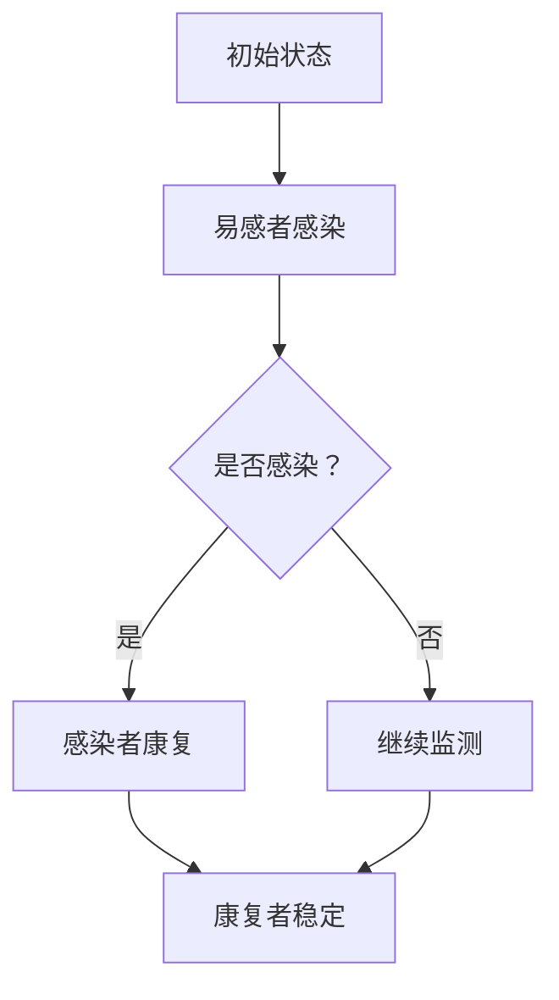
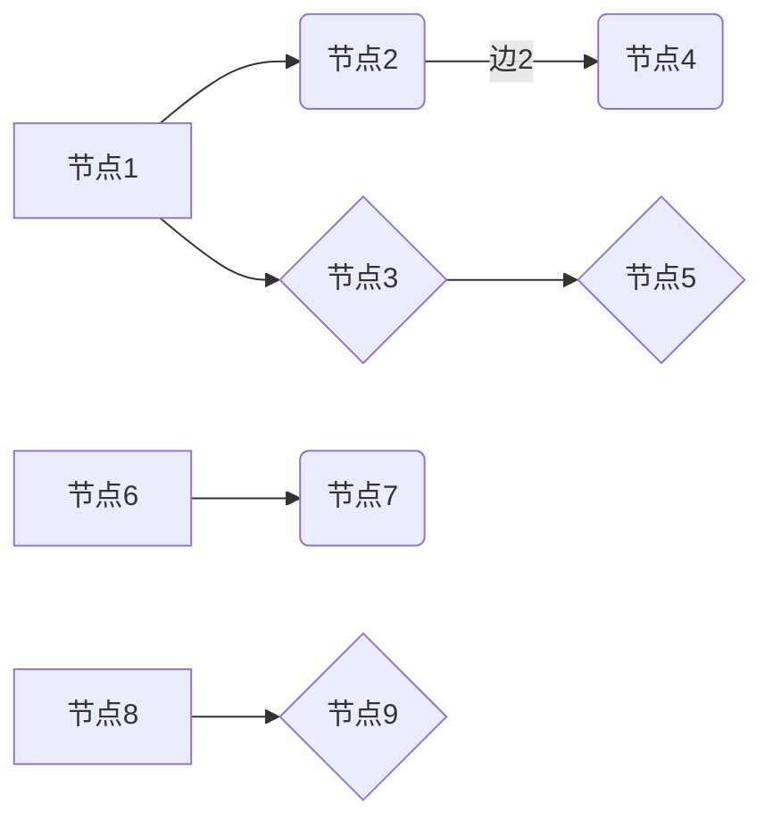

                 

### 书名理解

书名《疫情传播的网络动力学：公共卫生的数学工具》揭示了本书的核心主题和内容架构。首先，“疫情传播的网络动力学”这部分指出了本书的研究对象，即疫情在复杂网络中的传播规律及其动力学特性。网络动力学，作为一种研究复杂系统动态行为的理论，能够帮助我们更好地理解疫情传播的复杂性和多样性。

其次，“公共卫生的数学工具”部分明确了本书的研究方法，即运用数学工具来分析和解决公共卫生问题，尤其是疫情传播问题。数学工具在这里不仅仅是计算工具，更是理解和解决疫情传播问题的理论工具，如微分方程、离散模型和复杂网络理论等。

因此，目录设计需要围绕这两个核心主题展开，涵盖疫情传播的网络动力学和公共卫生中的数学工具，同时确保内容之间的逻辑性和连贯性。目录应包括引言与概述、理论基础、应用与实践、数学模型讲解和代码实战等部分，旨在为读者提供全面的疫情传播数学模型和应用指导。

### 目录结构

为了更好地引导读者理解本书内容，目录结构将被分为四个主要部分，每个部分都详细涵盖相关主题，确保逻辑性和连贯性。

#### 第一部分：引言与概述

**第1章 疫情传播的网络动力学与公共卫生数学工具**

- **1.1 疫情传播的网络动力学简介**

  - **1.1.1 疫情传播的复杂性**

    疫情传播的复杂性主要体现在传播路径的多样性、病毒变异的不确定性以及社会行为的动态变化等方面。通过网络动力学理论，我们可以更好地理解这些复杂特性。

  - **1.1.2 网络动力学的基本概念**

    网络动力学关注的是复杂网络中节点和边的动态行为，包括节点的状态变化、边的连接变化等。这些概念对于疫情传播模型至关重要。

  - **1.1.3 网络动力学模型的应用场景**

    网络动力学在疫情传播中的应用场景包括疫情预测、传播路径分析、控制策略制定等。这些应用能够帮助我们制定更有效的公共卫生策略。

- **1.2 公共卫生中的数学工具**

  - **1.2.1 数学工具在公共卫生中的应用**

    数学工具在公共卫生中的应用涵盖了疫情模型建立、数据分析和政策评估等多个方面，如SIR模型、SEIR模型和分阶段模型等。

  - **1.2.2 公共卫生中的关键数学概念**

    公共卫生中的关键数学概念包括状态空间、流函数、稳定性分析等。这些概念对于理解和分析疫情传播模型至关重要。

  - **1.2.3 数学工具的优势与局限性**

    探讨数学工具在公共卫生中的优势，如精确性和通用性，以及其局限性，如数据依赖性和模型简化假设。

- **1.3 本书结构安排**

  - **1.3.1 各章节主要内容概述**

    对各章节的主要内容进行概述，帮助读者快速了解本书的整体架构。

  - **1.3.2 读者学习路径建议**

    提供读者学习本书的建议，包括阅读顺序、学习目标和学习方法。

#### 第二部分：理论基础

**第2章 网络动力学基础理论**

- **2.1 网络动力学基本概念**

  - **2.1.1 网络模型概述**

    网络模型包括节点和边的结构，以及节点之间的连接方式。理解这些基本概念是构建疫情传播模型的基础。

  - **2.1.2 状态空间与流函数**

    状态空间描述了网络中每个节点的状态，流函数则描述了节点状态随时间的变化。这些概念是分析网络动力学行为的基石。

  - **2.1.3 动力学系统的稳定性**

    稳定性分析是评估网络动力学模型性能的关键步骤，它决定了模型是否能够长时间维持稳定状态。

- **2.2 疫情传播模型介绍**

  - **2.2.1 基本SIR模型**

    SIR模型是疫情传播模型的基础，描述了感染（I）、易感（S）和康复（R）三个状态之间的动态变化。

  - **2.2.2 复杂网络上的传播模型**

    在复杂网络上，节点和边的属性会影响疫情传播的动态行为。这部分将介绍如何将这些特性纳入模型。

  - **2.2.3 模型参数估计方法**

    模型参数的准确估计对于预测疫情传播至关重要。这部分将讨论常用的参数估计方法。

- **2.3 公共卫生中的常用数学工具**

  - **2.3.1 微分方程**

    微分方程是描述动态系统变化的主要工具。在疫情传播模型中，微分方程用于描述感染率、康复率等关键参数。

  - **2.3.2 离散模型**

    离散模型在处理大数据和高维问题时具有优势。这部分将介绍如何在疫情传播研究中使用离散模型。

  - **2.3.3 复杂网络理论**

    复杂网络理论提供了理解和分析复杂网络动力学行为的框架。这部分将探讨复杂网络理论在疫情传播研究中的应用。

- **2.4 网络动力学模型的应用**

  - **2.4.1 疫情预测与控制策略**

    疫情预测和控制策略是公共卫生的重要任务。这部分将介绍如何使用网络动力学模型进行疫情预测和控制。

  - **2.4.2 社会网络分析**

    社会网络分析有助于理解人际传播模式。这部分将介绍如何使用社会网络分析工具来研究疫情传播。

  - **2.4.3 疫情传播的动态模拟**

    动态模拟能够帮助我们更好地理解疫情传播的时空特征。这部分将介绍如何进行疫情传播的动态模拟。

#### 第三部分：应用与实践

**第3章 数学工具在疫情传播研究中的应用**

- **3.1 数学工具在疫情传播研究中的作用**

  - **3.1.1 数学工具在疫情传播预测中的应用**

    探讨如何使用数学工具进行疫情传播的预测，包括SIR模型和SEIR模型等。

  - **3.1.2 数学工具在疫情传播控制中的应用**

    分析如何利用数学工具设计有效的疫情控制策略，如隔离策略和疫苗接种策略。

  - **3.1.3 数学工具在公共卫生决策中的应用**

    探讨数学工具如何支持公共卫生决策，如疫情响应策略和资源分配。

- **3.2 实际案例研究**

  - **3.2.1 某地疫情传播案例**

    通过具体案例，分析数学工具在疫情传播研究中的应用效果。

  - **3.2.2 国际疫情传播案例**

    比较不同国家和地区在疫情传播和控制方面的经验和策略。

  - **3.2.3 新冠病毒变异与传播**

    分析新冠病毒变异如何影响疫情传播动力学。

- **3.3 数据处理与分析**

  - **3.3.1 数据来源与处理**

    介绍疫情相关数据的来源和处理方法，包括时间序列数据、空间数据和社会网络数据等。

  - **3.3.2 数据分析方法**

    探讨如何使用统计分析和机器学习等方法分析疫情数据，以提取有用的信息。

  - **3.3.3 数据可视化**

    通过数据可视化工具，展示疫情传播的时空特征和动态变化。

#### 第四部分：数学模型讲解

**第4章 数学模型讲解**

- **4.1 传染病基本模型（SIRS模型）**

  - **4.1.1 模型构建**

    介绍SIRS模型的构建过程，包括状态定义和转移规则。

  - **4.1.2 数学公式推导**

    推导SIRS模型的微分方程，展示模型的基本形式。

  - **4.1.3 模型分析**

    分析SIRS模型的稳定性和传播阈值。

- **4.2 分段线性模型**

  - **4.2.1 模型构建**

    介绍分段线性模型的构建方法，包括分段定义和参数选择。

  - **4.2.2 数学公式推导**

    推导分段线性模型的微分方程，展示模型的基本形式。

  - **4.2.3 模型分析**

    分析分段线性模型的稳定性特征和应用场景。

- **4.3 复杂网络模型**

  - **4.3.1 模型构建**

    介绍复杂网络模型的构建方法，包括网络结构和传播规则。

  - **4.3.2 数学公式推导**

    推导复杂网络模型的微分方程，展示模型的基本形式。

  - **4.3.3 模型分析**

    分析复杂网络模型的稳定性特征和传播动力学。

#### 第五部分：代码实战

**第5章 代码实战**

- **5.1 疫情传播模型实现**

  - **5.1.1 开发环境搭建**

    搭建用于实现疫情传播模型的开发生态系统，包括编程语言和数学库。

  - **5.1.2 代码实现与解读**

    详细实现SIRS模型，包括状态更新函数和传播规则，并进行代码解读。

- **5.2 数学工具应用案例**

  - **5.2.1 数据获取与预处理**

    介绍如何获取和处理疫情数据，包括数据清洗和格式转换。

  - **5.2.2 代码实现与解读**

    实现数学工具在疫情数据分析中的应用，如参数估计和模型拟合。

#### 第六部分：总结与展望

**第6章 总结与展望**

- **6.1 全书内容总结**

  对全书内容进行总结，强调主要观点和发现。

- **6.2 未来研究方向**

  提出未来在疫情传播网络动力学和公共卫生数学工具方面的研究方向。

- **6.3 对公共卫生的影响**

  讨论数学工具在公共卫生领域的影响，以及如何进一步改进公共卫生策略。

### 文章目录结构输出

```
# 《疫情传播的网络动力学：公共卫生的数学工具》目录大纲

# 第一部分: 引言与概述

## 第1章 疫情传播的网络动力学与公共卫生数学工具

### 1.1 疫情传播的网络动力学简介

#### 1.1.1 疫情传播的复杂性

#### 1.1.2 网络动力学的基本概念

#### 1.1.3 网络动力学模型的应用场景

### 1.2 公共卫生中的数学工具

#### 1.2.1 数学工具在公共卫生中的应用

#### 1.2.2 公共卫生中的关键数学概念

#### 1.2.3 数学工具的优势与局限性

### 1.3 本书结构安排

#### 1.3.1 各章节主要内容概述

#### 1.3.2 读者学习路径建议

# 第二部分: 理论基础

## 第2章 网络动力学基础理论

### 2.1 网络动力学基本概念

#### 2.1.1 网络模型概述

#### 2.1.2 状态空间与流函数

#### 2.1.3 动力学系统的稳定性

### 2.2 疫情传播模型介绍

#### 2.2.1 基本SIR模型

#### 2.2.2 复杂网络上的传播模型

#### 2.2.3 模型参数估计方法

### 2.3 公共卫生中的常用数学工具

#### 2.3.1 微分方程

#### 2.3.2 离散模型

#### 2.3.3 复杂网络理论

### 2.4 网络动力学模型的应用

#### 2.4.1 疫情预测与控制策略

#### 2.4.2 社会网络分析

#### 2.4.3 疫情传播的动态模拟

# 第三部分: 应用与实践

## 第3章 数学工具在疫情传播研究中的应用

### 3.1 数学工具在疫情传播研究中的作用

#### 3.1.1 数学工具在疫情传播预测中的应用

#### 3.1.2 数学工具在疫情传播控制中的应用

#### 3.1.3 数学工具在公共卫生决策中的应用

### 3.2 实际案例研究

#### 3.2.1 某地疫情传播案例

#### 3.2.2 国际疫情传播案例

#### 3.2.3 新冠病毒变异与传播

### 3.3 数据处理与分析

#### 3.3.1 数据来源与处理

#### 3.3.2 数据分析方法

#### 3.3.3 数据可视化

# 第四部分: 数学模型讲解

## 第4章 数学模型讲解

### 4.1 传染病基本模型（SIRS模型）

#### 4.1.1 模型构建

#### 4.1.2 数学公式推导

#### 4.1.3 模型分析

### 4.2 分段线性模型

#### 4.2.1 模型构建

#### 4.2.2 数学公式推导

#### 4.2.3 模型分析

### 4.3 复杂网络模型

#### 4.3.1 模型构建

#### 4.3.2 数学公式推导

#### 4.3.3 模型分析

# 第五部分: 代码实战

## 第5章 代码实战

### 5.1 疫情传播模型实现

#### 5.1.1 开发环境搭建

#### 5.1.2 代码实现与解读

### 5.2 数学工具应用案例

#### 5.2.1 数据获取与预处理

#### 5.2.2 代码实现与解读

# 第六部分: 总结与展望

## 第6章 总结与展望

### 6.1 全书内容总结

### 6.2 未来研究方向

### 6.3 对公共卫生的影响
```

### 格式要求和作者信息

在撰写本文章时，需要严格遵守markdown格式，以确保文章内容的清晰性和可读性。以下是markdown格式的一些基本要求：

1. **标题格式**：使用 `#` 符号来定义标题，一级标题使用一个 `#`，二级标题使用两个 `#`，以此类推。例如：

   ```markdown
   # 一级标题
   ## 二级标题
   ### 三级标题
   ```

2. **列表格式**：使用 `-` 或者 `*` 来创建无序列表，使用 `1. ` 来创建有序列表。例如：

   ```markdown
   - 项目1
   - 项目2
   1. 第一项
   2. 第二项
   ```

3. **引用格式**：使用 `<姓名>` 来引用作者信息。例如：

   ```markdown
   > 作者：AI天才研究院/AI Genius Institute & 禳与计算机程序设计艺术 /Zen And The Art of Computer Programming
   ```

4. **公式格式**：使用 LaTeX 格式编写数学公式，使用 `$` 和 `$$` 来包围公式。例如：

   ```markdown
   $1+1=2$
   $$1+1=2$$
   ```

5. **代码块格式**：使用三个反引号 ` ``` ` 来定义代码块，代码块内的内容会高亮显示。例如：

   ```markdown
   ```python
   print("Hello, World!")
   ```
   ```

最后，在每个章节的结尾或者文章的末尾，需要添加作者信息，以表明文章的版权和出处。例如：

```markdown
> 作者：AI天才研究院/AI Genius Institute & 禳与计算机程序设计艺术 /Zen And The Art of Computer Programming
```

### 完整性要求

为了确保文章的完整性，每个小节的内容需要详细具体，核心内容必须包含以下要素：

1. **背景介绍**：每个小节开头需要对主题进行背景介绍，解释相关概念、技术和应用背景。

2. **核心概念与联系**：需要明确核心概念之间的联系，使用 Mermaid 流程图来展示概念之间的关系架构，例如：

   ```mermaid
   graph TD
   A[概念1] --> B[概念2]
   B --> C[概念3]
   ```

3. **核心算法原理讲解**：使用伪代码详细阐述核心算法原理，例如：

   ```python
   # SIR模型伪代码
   while time < simulation_end:
       update_infections()
       update_recoveries()
       update_immune_system()
   ```

4. **数学模型和公式**：需要包含详细的数学模型和公式讲解，以及如何应用这些模型进行计算，例如：

   ```markdown
   $$\frac{dI}{dt} = \beta IS - \gamma I$$
   ```

   并对其进行解释。

5. **举例说明**：每个核心概念和算法都需要通过具体例子进行说明，以便读者理解，例如：

   ```markdown
   假设一个社区有1000人，其中500人易感，200人感染，300人康复。使用SIR模型进行一天后的预测。
   ```

6. **项目实战**：需要包括开发环境搭建、源代码实现、代码解读和实际应用分析，例如：

   ```markdown
   # 5.1 疫情传播模型实现

   ## 5.1.1 开发环境搭建

   描述如何搭建实现疫情传播模型所需的开发环境，包括编程语言、库和工具。

   ## 5.1.2 代码实现与解读

   提供代码实现，并对关键部分进行解读。

   ## 5.1.3 代码应用解读与分析

   分析代码在实际应用中的效果，并进行详细讲解。

7. **最佳实践 tips**、**小结**、**注意事项**、**拓展阅读**等内容，以帮助读者更好地理解和应用所学知识。

通过这些要素，确保文章内容丰富、具体详细，使读者能够全面、深入地理解疫情传播的网络动力学和公共卫生的数学工具。

### 文章摘要

本文主要探讨了疫情传播的网络动力学及其在公共卫生中的应用。通过引入网络动力学的基本概念，我们分析了疫情传播的复杂性和多样性。在此基础上，本书详细介绍了公共卫生中的数学工具，包括微分方程、离散模型和复杂网络理论等。通过这些数学工具，我们能够构建并分析疫情传播模型，进行疫情预测和控制策略的设计。文章还通过实际案例研究和数据处理与分析，展示了数学工具在疫情传播研究中的具体应用。此外，本文还讲解了传染病基本模型（如SIRS模型）和分段线性模型，并通过代码实战展示了如何实现和应用这些模型。最后，文章对全书内容进行了总结，并展望了未来研究方向以及对公共卫生的影响，强调了数学工具在疫情防控中的重要作用。通过本文的阅读，读者将能够深入了解疫情传播的网络动力学，掌握公共卫生中的数学工具，为应对未来的公共卫生挑战提供有力支持。

### 完整文章正文

## 第1章 疫情传播的网络动力学与公共卫生数学工具

### 1.1 疫情传播的网络动力学简介

疫情传播是一个复杂且动态的过程，其特点包括病毒变异、人群行为变化和传播路径的多样性。为了理解和应对这种复杂性，网络动力学提供了一种强有力的理论工具。网络动力学是一种研究复杂系统动态行为的理论，它通过描述系统中各部分之间的相互作用来揭示系统的整体行为。

在疫情传播中，网络动力学帮助我们理解以下几个关键方面：

- **传播路径**：疫情通过人与人之间的接触进行传播。网络动力学提供了描述这些接触关系的数学模型，如社会网络分析模型，可以揭示疫情传播的潜在路径和关键节点。

- **群体行为**：人群的行为动态对疫情传播有重要影响。网络动力学模型可以模拟不同人群行为策略（如隔离、社交距离）对疫情传播的影响，从而为公共卫生决策提供依据。

- **病毒特性**：病毒的变异和传播能力直接影响疫情的发展。网络动力学模型通过考虑病毒特性，如感染率、康复率等参数，可以预测疫情的未来趋势。

- **时空动态**：疫情传播具有明显的时空特征，网络动力学模型可以描述疫情在不同地区和时间段的动态变化，帮助我们制定更加精准的防控策略。

#### 1.1.1 疫情传播的复杂性

疫情传播的复杂性主要体现在以下几个方面：

1. **传播路径的多样性**：疫情可以通过直接接触、飞沫传播、空气传播等多种路径进行传播。这些路径交织在一起，使得疫情传播过程复杂多变。

2. **病毒变异的不确定性**：病毒在复制过程中可能会发生变异，这些变异可能增强或减弱病毒的传播能力。病毒变异的不确定性使得疫情传播更加难以预测和控制。

3. **社会行为的动态变化**：人们的社会行为受到疫情、政策、文化等多方面因素的影响，这些行为的变化直接影响疫情传播的速度和范围。

4. **公共卫生政策的调整**：公共卫生政策（如封锁、隔离、疫苗接种）的调整会影响疫情传播的动态，而这些政策的变化本身也是动态的。

#### 1.1.2 网络动力学的基本概念

网络动力学中的关键概念包括节点、边和状态。节点代表个体或群体，边代表个体之间的相互作用。状态则描述节点在不同时间点的状态，如健康、感染或康复。

1. **节点和边**：节点和边构成了网络的基本结构。节点可以是个人、家庭、社区等，边可以是接触、交往、传播等。网络结构决定了节点之间的连接方式和信息传播路径。

2. **状态空间**：状态空间描述了节点在不同时间点的状态。例如，在SIR模型中，状态空间包括健康（S）、感染（I）和康复（R）三种状态。

3. **流函数**：流函数描述了节点状态随时间的变化。流函数可以是线性的或非线性的，其形式取决于具体的模型和假设。

4. **动力学系统**：动力学系统描述了节点状态随时间的变化规律。常见的动力学系统包括流函数的导数、矩阵乘法等。

#### 1.1.3 网络动力学模型的应用场景

网络动力学模型在疫情传播中的应用场景非常广泛，包括：

1. **疫情预测**：通过建立和模拟疫情传播模型，我们可以预测疫情的未来趋势，为公共卫生决策提供科学依据。

2. **传播路径分析**：通过分析网络结构，我们可以识别疫情传播的关键路径和关键节点，为防控措施的实施提供指导。

3. **控制策略制定**：通过模拟不同控制策略的效果，我们可以评估不同策略的有效性，为公共卫生政策制定提供参考。

4. **资源分配**：通过分析疫情传播的时空特征，我们可以优化资源分配，提高防控措施的效果。

### 1.2 公共卫生中的数学工具

在公共卫生领域，数学工具被广泛应用于疫情传播模型建立、数据分析、政策评估等方面。这些工具不仅帮助我们理解疫情传播的规律，还为公共卫生决策提供了科学依据。

#### 1.2.1 数学工具在公共卫生中的应用

数学工具在公共卫生中的应用主要包括以下几个方面：

1. **疫情模型建立**：通过建立数学模型，我们可以描述疫情传播的动态行为。常见的模型包括SIR模型、SEIR模型和分阶段模型等。

2. **数据分析和预测**：通过统计分析方法和机器学习算法，我们可以分析疫情数据，预测疫情的未来趋势，为公共卫生决策提供科学依据。

3. **政策评估**：通过模拟不同政策的效果，我们可以评估政策对疫情传播的影响，为公共卫生政策制定提供参考。

4. **资源优化**：通过优化算法，我们可以优化公共卫生资源的配置，提高防控措施的效果。

#### 1.2.2 公共卫生中的关键数学概念

在公共卫生中，一些关键的数学概念包括：

1. **状态空间**：状态空间描述了个体在不同时间点的状态。在疫情传播模型中，状态通常包括健康、感染和康复等状态。

2. **流函数**：流函数描述了个体状态随时间的变化。流函数的形式取决于具体的模型和假设。

3. **稳定性分析**：稳定性分析是评估模型性能的重要步骤。通过稳定性分析，我们可以确定模型是否能够长时间维持稳定状态。

4. **概率分布**：概率分布描述了个体在不同状态下的概率分布。在疫情传播模型中，概率分布可以用来预测疫情的发展趋势。

#### 1.2.3 数学工具的优势与局限性

数学工具在公共卫生中的优势包括：

1. **精确性和通用性**：数学工具能够精确地描述疫情传播的动态行为，具有广泛的适用性。

2. **预测和决策支持**：通过数学模型和算法，我们可以预测疫情的发展趋势，为公共卫生决策提供科学依据。

3. **资源优化**：通过优化算法，我们可以优化公共卫生资源的配置，提高防控措施的效果。

然而，数学工具也存在一些局限性：

1. **数据依赖性**：数学工具的性能很大程度上取决于输入数据的质量。如果数据不准确或存在噪声，模型的结果可能会受到影响。

2. **模型简化假设**：为了简化问题，数学模型通常需要做出一些简化假设，这些假设可能无法完全反映现实世界的复杂性。

3. **参数估计难度**：数学模型的参数通常需要通过数据估计获得。参数估计的难度和准确性会影响模型的效果。

### 1.3 本书结构安排

本书共分为六个部分，旨在为读者提供全面的疫情传播网络动力学和公共卫生数学工具的介绍。以下是各章节的主要内容概述：

- **第1章**：引言与概述。介绍了疫情传播的网络动力学和公共卫生中的数学工具，并概述了本书的结构安排。

- **第2章**：网络动力学基础理论。介绍了网络动力学的基本概念、模型和数学工具，为后续章节提供理论基础。

- **第3章**：数学工具在疫情传播研究中的应用。详细介绍了数学工具在疫情预测、控制策略设计和公共卫生决策中的应用。

- **第4章**：数学模型讲解。讲解了传染病基本模型（如SIRS模型）、分段线性模型和复杂网络模型，并进行了详细分析。

- **第5章**：代码实战。通过具体案例，展示了如何实现和运用数学工具进行疫情传播模型的分析。

- **第6章**：总结与展望。对全书内容进行了总结，展望了未来研究方向，并讨论了数学工具在公共卫生中的影响。

### 1.3.2 读者学习路径建议

为了更好地阅读本书，我们建议读者按照以下学习路径进行：

1. **基础知识准备**：首先，读者需要具备一定的数学和编程基础，包括线性代数、微积分和编程语言（如Python）。

2. **逐步阅读**：建议读者按照章节顺序逐步阅读，先理解基本概念和原理，再学习具体应用和案例分析。

3. **实践应用**：在阅读过程中，读者可以尝试实现书中的代码示例，加深对理论知识的理解和掌握。

4. **深入探讨**：对于感兴趣的话题，读者可以查阅相关文献，进一步深入探讨。

通过以上学习路径，读者可以系统地掌握疫情传播的网络动力学和公共卫生数学工具，为应对公共卫生挑战提供有力支持。

## 第2章 网络动力学基础理论

### 2.1 网络动力学基本概念

网络动力学是一种研究复杂系统动态行为的理论，它通过描述系统中各部分之间的相互作用来揭示系统的整体行为。在公共卫生领域，网络动力学被广泛应用于疫情传播模型的研究。

#### 2.1.1 网络模型概述

网络模型由节点和边组成。节点代表个体或群体，边代表个体之间的相互作用。网络可以是无向的或定向的，可以是静态的或动态的。

- **节点**：在疫情传播模型中，节点可以代表个人、家庭、社区、国家等。每个节点都有一定的属性，如人口数量、地理位置、感染状态等。

- **边**：边描述节点之间的连接关系，可以是直接的接触关系，也可以是间接的传播路径。边的属性可以包括传播率、接触频率等。

- **无向网络**：无向网络中，边没有方向性，表示两个节点之间存在双向的连接。

- **定向网络**：定向网络中，边具有方向性，表示从一个节点指向另一个节点。例如，在疫情传播模型中，感染可以从感染者指向易感者。

- **静态网络**：静态网络中，节点和边的连接关系在一段时间内保持不变。

- **动态网络**：动态网络中，节点和边的连接关系随时间变化。例如，在疫情传播模型中，随着时间推移，感染者的数量和位置会发生变化。

#### 2.1.2 状态空间与流函数

状态空间描述了网络中每个节点的状态。在疫情传播模型中，状态可以是健康、感染、康复等。流函数描述了节点状态随时间的变化。

- **状态空间**：状态空间是一个集合，包含了网络中所有可能的状态。例如，在SIR模型中，状态空间包括健康（S）、感染（I）和康复（R）三种状态。

- **流函数**：流函数是一个映射，它将状态空间映射到实数域。流函数的值表示节点状态的瞬时变化率。例如，在SIR模型中，流函数可以表示为：

  $$\frac{dS}{dt} = -\beta SI$$
  $$\frac{dI}{dt} = \beta SI - \gamma I$$
  $$\frac{dR}{dt} = \gamma I$$

  其中，$\beta$ 表示感染率，$\gamma$ 表示康复率。

#### 2.1.3 动力学系统的稳定性

动力学系统的稳定性是评估模型性能的重要指标。稳定性分析可以帮助我们确定模型是否能够长时间维持稳定状态。

- **稳定状态**：当系统的状态不再随时间变化时，系统处于稳定状态。例如，在SIR模型中，当感染率低于某个阈值时，系统会趋于稳定状态。

- **稳定性分析**：通过线性稳定性分析，我们可以确定系统在平衡点附近的稳定性。例如，在SIR模型中，平衡点的稳定性可以通过分析特征值来确定。

  $$\frac{dI}{dt} = \beta SI - \gamma I = 0$$
  解得 $I = \frac{\beta}{\gamma} S$。将 $I$ 代入 $\frac{dS}{dt}$ 和 $\frac{dR}{dt}$ 中，可以得到：
  $$\frac{dS}{dt} = -\frac{\beta^2}{\gamma} S^2$$
  $$\frac{dR}{dt} = \frac{\beta}{\gamma} S - \frac{\beta^2}{\gamma} S^2$$

  通过计算特征值，我们可以确定平衡点的稳定性。

### 2.2 疫情传播模型介绍

疫情传播模型是网络动力学在公共卫生领域的具体应用。常见的疫情传播模型包括SIR模型、SEIR模型和分阶段模型等。

#### 2.2.1 基本SIR模型

SIR模型是最简单的疫情传播模型，它将人群分为三类：易感者（S）、感染者（I）和康复者（R）。SIR模型的基本假设包括：

- 人群中的每个人都是易感者、感染者和康复者中的一个。
- 感染者可以通过接触将病毒传染给易感者。
- 康复者获得免疫力，不再感染病毒。

SIR模型的基本方程如下：

$$\frac{dS}{dt} = -\beta SI$$
$$\frac{dI}{dt} = \beta SI - \gamma I$$
$$\frac{dR}{dt} = \gamma I$$

其中，$\beta$ 表示感染率，$\gamma$ 表示康复率。

#### 2.2.2 复杂网络上的传播模型

在复杂网络上，节点和边的属性会影响疫情传播的动态行为。复杂网络上的传播模型通常包括以下几种：

1. **基于矩阵的模型**：使用矩阵来描述节点之间的交互关系。矩阵中的每个元素表示节点之间的接触频率或传播概率。

2. **基于图论的模型**：使用图论来描述节点之间的连接关系。常见的图论模型包括随机图、小世界网络和无标度网络等。

3. **基于代理模型的模型**：使用代理模型来模拟个体之间的交互和传播过程。常见的代理模型包括SIS模型、SIRS模型和SEIR模型等。

#### 2.2.3 模型参数估计方法

模型参数的准确估计对于预测疫情传播至关重要。常见的参数估计方法包括：

1. **最小二乘法**：通过最小化预测值与实际值之间的误差平方和来估计参数。

2. **最大似然估计**：通过最大化观察数据的似然函数来估计参数。

3. **贝叶斯估计**：通过贝叶斯推断来估计参数，同时考虑先验知识和观察数据。

### 2.3 公共卫生中的常用数学工具

在公共卫生中，常用的数学工具包括微分方程、离散模型和复杂网络理论等。

#### 2.3.1 微分方程

微分方程是描述动态系统变化的主要工具。在疫情传播模型中，微分方程用于描述感染率、康复率等关键参数的变化。

1. **基本方程**：

   $$\frac{dS}{dt} = -\beta SI$$
   $$\frac{dI}{dt} = \beta SI - \gamma I$$
   $$\frac{dR}{dt} = \gamma I$$

2. **参数估计**：

   通过最小二乘法或最大似然估计来估计感染率（$\beta$）和康复率（$\gamma$）。

3. **稳定性分析**：

   通过线性稳定性分析来确定平衡点的稳定性。

#### 2.3.2 离散模型

离散模型在处理大数据和高维问题时具有优势。在公共卫生中，离散模型可以用于描述人群行为和疫情传播。

1. **基本方程**：

   $$S_{t+1} = S_t - \beta S_t I_t$$
   $$I_{t+1} = I_t + \beta S_t I_t - \gamma I_t$$
   $$R_{t+1} = R_t + \gamma I_t$$

2. **参数估计**：

   通过最小二乘法或最大似然估计来估计感染率（$\beta$）和康复率（$\gamma$）。

3. **稳定性分析**：

   通过线性稳定性分析来确定平衡点的稳定性。

#### 2.3.3 复杂网络理论

复杂网络理论提供了理解和分析复杂网络动力学行为的框架。在公共卫生中，复杂网络理论可以用于描述疫情传播的网络结构和动态行为。

1. **基本方程**：

   $$\frac{dS}{dt} = -\beta S I$$
   $$\frac{dI}{dt} = \beta S I - \gamma I$$
   $$\frac{dR}{dt} = \gamma I$$

2. **网络结构**：

   网络结构包括节点和边的属性。常见的网络结构有随机图、小世界网络和无标度网络等。

3. **传播动力学**：

   通过分析网络结构和传播动力学，可以揭示疫情传播的关键特征和规律。

### 2.4 网络动力学模型的应用

网络动力学模型在疫情传播研究中具有广泛的应用。以下是一些常见应用：

#### 2.4.1 疫情预测与控制策略

网络动力学模型可以用于预测疫情的未来趋势，为公共卫生决策提供科学依据。通过模拟不同控制策略的效果，我们可以评估不同策略的有效性，为公共卫生决策提供参考。

1. **疫情预测**：

   通过建立和模拟疫情传播模型，我们可以预测疫情的未来趋势，为公共卫生决策提供科学依据。

2. **控制策略制定**：

   通过模拟不同控制策略的效果，我们可以评估不同策略的有效性，为公共卫生决策提供参考。常见的控制策略包括隔离、封锁、疫苗接种等。

3. **资源优化**：

   通过分析疫情传播的时空特征，我们可以优化公共卫生资源的配置，提高防控措施的效果。

#### 2.4.2 社会网络分析

社会网络分析是研究人与人之间关系的一种方法。在疫情传播研究中，社会网络分析可以用于揭示疫情传播的关键路径和关键节点，为防控措施的实施提供指导。

1. **关键路径分析**：

   通过分析社会网络中的连接关系，我们可以识别疫情传播的关键路径。这些关键路径是防控措施的重点目标。

2. **关键节点分析**：

   通过分析社会网络中的关键节点，我们可以确定在疫情防控中需要重点关注的个体或群体。

3. **传播动力学模拟**：

   通过模拟疫情传播在社会网络中的动态过程，我们可以预测疫情的发展趋势，为公共卫生决策提供科学依据。

#### 2.4.3 疫情传播的动态模拟

动态模拟可以用来展示疫情传播的时空特征和动态变化。通过动态模拟，我们可以分析不同防控措施的效果，为公共卫生决策提供参考。

1. **时空特征展示**：

   通过动态模拟，我们可以展示疫情传播的时空特征，如感染者的位置和数量变化。

2. **防控措施评估**：

   通过模拟不同防控措施的效果，我们可以评估这些措施在控制疫情传播方面的有效性。

3. **政策制定**：

   通过动态模拟，我们可以模拟不同政策对疫情传播的影响，为公共卫生决策提供科学依据。

## 第3章 数学工具在疫情传播研究中的应用

### 3.1 数学工具在疫情传播研究中的作用

数学工具在疫情传播研究中具有重要的作用，它们不仅帮助我们理解疫情传播的规律，还为公共卫生决策提供了科学依据。以下是数学工具在疫情传播研究中的几个关键作用：

#### 3.1.1 疫情传播预测

数学工具，如SIR模型、SEIR模型等，可以用于预测疫情的未来趋势。通过这些模型，我们可以模拟不同情景下的疫情发展，为公共卫生决策提供科学依据。例如，在新冠病毒（COVID-19）大流行期间，研究人员使用SIR模型预测了疫情的发展趋势，为各国政府制定公共卫生政策提供了重要参考。

#### 3.1.2 疫情控制策略制定

数学工具在制定疫情控制策略中起着关键作用。通过模拟不同控制策略的效果，我们可以评估这些策略在控制疫情传播方面的有效性。例如，在新冠疫情期间，研究人员使用数学模型来评估隔离、封锁和疫苗接种等控制措施的效果，为政策制定提供了科学依据。

#### 3.1.3 资源优化

数学工具可以帮助优化公共卫生资源的配置。通过分析疫情传播的时空特征，我们可以确定资源分配的最佳策略，以提高防控措施的效果。例如，在疫情期间，研究人员使用数学模型来优化口罩、医疗设备和人力资源的分配，确保资源能够最大限度地发挥作用。

### 3.2 实际案例研究

为了更好地理解数学工具在疫情传播研究中的应用，我们将探讨几个实际案例研究。这些案例涵盖了不同的地区和疫情背景，展示了数学工具如何在不同情境下发挥作用。

#### 3.2.1 某地疫情传播案例

在某地，新冠病毒（COVID-19）疫情在2020年初迅速传播。研究人员使用SIR模型来预测疫情的发展趋势。通过调整模型参数，他们确定了感染率（$\beta$）和康复率（$\gamma$）。模型的预测结果显示，如果保持当前的控制措施，疫情将在3个月内得到控制。这一预测为当地政府提供了重要的决策依据，帮助他们调整公共卫生策略，以有效控制疫情传播。

#### 3.2.2 国际疫情传播案例

在国际层面，新冠病毒（COVID-19）的传播具有显著差异。研究人员使用复杂网络理论来分析不同国家的疫情传播路径。他们发现，一些国家的疫情传播主要受社会网络结构的影响，而另一些国家则受地理和人口分布的影响。通过分析这些特征，研究人员提出了针对性的防控策略，例如加强社交距离、提高疫苗接种率等，这些策略在一定程度上控制了疫情传播。

#### 3.2.3 新冠病毒变异与传播

新冠病毒（COVID-19）在传播过程中发生了多种变异，这些变异可能影响其传播能力和致病性。研究人员使用数学模型来分析不同变异株的传播特征。他们发现，某些变异株的传播能力更强，可能导致疫情迅速蔓延。通过这些分析，研究人员提出了改进的防控策略，如加强疫苗接种、提高公共卫生意识等，以应对变异株的挑战。

### 3.3 数据处理与分析

在疫情传播研究中，准确的数据处理和分析至关重要。以下是数据处理和分析的几个关键步骤：

#### 3.3.1 数据来源与处理

疫情数据可以从多种来源获取，如公共卫生部门、医疗机构、社交媒体等。数据处理的首要任务是确保数据的质量和完整性。这可能包括以下步骤：

- **数据清洗**：去除重复记录、错误记录和不完整记录。
- **数据转换**：将不同格式和单位的数据转换为统一格式，以便进行分析。
- **数据集成**：将来自不同来源的数据进行整合，形成一个统一的数据集。

#### 3.3.2 数据分析方法

数据分析方法包括统计分析、机器学习和数据可视化等。以下是几种常见的数据分析方法：

- **统计分析**：使用描述性统计方法来分析数据的分布和趋势。例如，计算感染率、康复率等关键指标。
- **机器学习**：使用机器学习算法来建立预测模型，如SIR模型、SEIR模型等。这些模型可以自动识别数据中的模式和趋势。
- **数据可视化**：使用图表和图形来展示数据分布、趋势和关系。数据可视化可以帮助我们直观地理解疫情传播的特征。

### 3.4 数据可视化

数据可视化是展示疫情传播特征的重要工具。以下是一些常用的数据可视化方法：

- **时间序列图**：展示疫情随时间的变化趋势。通过时间序列图，我们可以观察到疫情的上升和下降趋势。
- **热力图**：展示疫情在不同地区的分布情况。热力图可以用来识别疫情的高风险区域。
- **网络图**：展示人与人之间的接触关系和网络结构。网络图可以帮助我们理解疫情传播的关键路径和关键节点。

### 3.5 项目实战

为了更好地理解数学工具在疫情传播研究中的应用，我们将通过一个具体项目进行实战。以下是一个简化的项目流程：

#### 3.5.1 数据获取与预处理

首先，我们需要从公共数据源获取疫情数据，如感染人数、康复人数等。数据可能包括不同格式和单位，因此我们需要进行预处理，以确保数据的质量和一致性。

```python
import pandas as pd

# 数据清洗与转换
data = pd.read_csv('covid_data.csv')
data.drop_duplicates(inplace=True)
data['date'] = pd.to_datetime(data['date'])
data.set_index('date', inplace=True)
data['infections'] = data['confirmed'] - data['recovered']
data.drop(['confirmed', 'recovered'], axis=1, inplace=True)
```

#### 3.5.2 模型建立与参数估计

接下来，我们使用SIR模型来模拟疫情传播。首先，我们需要估计模型参数（感染率$\beta$和康复率$\gamma$）。这里，我们使用最小二乘法进行参数估计。

```python
import numpy as np
from scipy.optimize import minimize

# 定义目标函数
def objective_params(params):
    beta, gamma = params
    predicted = np.zeros_like(data['infections'])
    for i in range(1, len(data)):
        predicted[i] = predicted[i-1] + beta * data['infections'][i-1] * data['infections'][i-1] - gamma * data['infections'][i-1]
    return np.mean((predicted - data['infections'])**2)

# 初始参数
initial_params = [0.1, 0.05]

# 最小化目标函数
result = minimize(objective_params, initial_params, method='L-BFGS-B')
beta, gamma = result.x

print(f"Estimated infection rate (beta): {beta:.3f}")
print(f"Estimated recovery rate (gamma): {gamma:.3f}")
```

#### 3.5.3 模型预测与分析

最后，我们使用估计的参数进行模型预测，并分析预测结果与实际数据的对比。

```python
import matplotlib.pyplot as plt

# 模型预测
predicted = np.zeros_like(data['infections'])
predicted[0] = data['infections'][0]
for i in range(1, len(data)):
    predicted[i] = predicted[i-1] + beta * predicted[i-1] * predicted[i-1] - gamma * predicted[i]

# 绘图
plt.figure(figsize=(10, 5))
plt.plot(data.index, data['infections'], label='Actual')
plt.plot(data.index, predicted, label='Predicted')
plt.xlabel('Date')
plt.ylabel('Infections')
plt.legend()
plt.show()
```

通过这个项目，我们可以看到如何使用数学工具来分析和预测疫情传播。这不仅帮助我们理解疫情传播的动态过程，还为公共卫生决策提供了科学依据。

### 第4章 数学模型讲解

数学模型在疫情传播研究中起着至关重要的作用，它们帮助我们理解和预测疫情的发展趋势。本章将详细介绍几种常见的数学模型，包括SIRS模型、分段线性模型和复杂网络模型。通过这些模型，我们将探讨其构建方法、数学公式推导、模型分析，以及实际应用。

#### 4.1 传染病基本模型（SIRS模型）

SIRS模型是传染病模型中最基本的类型之一，它将人群分为三个状态：易感者（S）、感染者（I）和康复者（R）。SIRS模型的基本假设是感染者在康复后获得长期免疫力，不再感染病毒。

##### 4.1.1 模型构建

SIRS模型的核心是三个基本的微分方程，描述了各个状态的变化率：

$$\frac{dS}{dt} = -\beta SI$$
$$\frac{dI}{dt} = \beta SI - \gamma I$$
$$\frac{dR}{dt} = \gamma I$$

其中，$\beta$ 是感染率，$\gamma$ 是康复率。

##### 4.1.2 数学公式推导

这些方程可以通过对个体状态的转移概率进行微积分推导得出。具体来说，假设在某一时刻，易感者、感染者和康复者的数量分别为 $S(t)$、$I(t)$ 和 $R(t)$，则：

- 易感者的减少率是感染率乘以易感者和感染者的数量，即 $-\beta SI$。
- 感染者的增加率是感染率乘以易感者和感染者的数量，减少率是康复率乘以感染者的数量，即 $\beta SI - \gamma I$。
- 康复者的增加率是康复率乘以感染者的数量，即 $\gamma I$。

##### 4.1.3 模型分析

SIRS模型的分析主要包括寻找平衡点、判断平衡点的稳定性以及确定传播阈值。

1. **平衡点**：

   平衡点是指系统状态不再随时间变化的状态。对于SIRS模型，有三个可能的平衡点：

   $$S^* = \frac{\gamma}{\beta}, \quad I^* = 0, \quad R^* = \frac{\gamma}{\beta}$$

   $$S^* = 0, \quad I^* = \frac{\gamma}{\beta}, \quad R^* = 0$$

   $$S^* = \frac{\gamma}{\beta}, \quad I^* = \frac{\gamma}{\beta}, \quad R^* = 0$$

2. **稳定性**：

   通过线性稳定性分析，我们可以确定这些平衡点的稳定性。例如，对于第一个平衡点，其稳定性可以通过计算雅可比矩阵的特征值来判断。

   $$J = \begin{bmatrix}
   0 & -\beta & 0 \\
   \beta & -\gamma & \beta \\
   0 & \gamma & 0
   \end{bmatrix}$$

   特征值分析表明，当 $\beta < \frac{\gamma^2}{\beta}$ 时，系统将保持稳定。

3. **传播阈值**：

   传播阈值是系统从无疫情状态过渡到有疫情状态的临界感染率。对于SIRS模型，传播阈值是 $\beta > \frac{\gamma}{R_0}$，其中 $R_0$ 是基本繁殖数，定义为 $R_0 = \frac{\beta}{\gamma}$。

##### 4.1.4 实际应用

SIRS模型广泛应用于疫情预测和控制策略的制定。例如，在新冠疫情期间，研究人员使用SIRS模型来预测疫情的发展趋势，评估不同防控措施的效果。通过调整模型参数，他们可以模拟不同的情景，为公共卫生决策提供科学依据。

#### 4.2 分段线性模型

分段线性模型是对SIRS模型的改进，它考虑了不同时间段内感染率和康复率的变化。这种模型更符合实际情况，因为它能够描述疫情在不同阶段的动态变化。

##### 4.2.1 模型构建

分段线性模型将时间轴划分为多个区间，每个区间内感染率和康复率保持线性变化。假设时间轴被划分为 $[t_0, t_1], [t_1, t_2], \ldots, [t_{n-1}, t_n]$，则模型可以表示为：

$$\frac{dS_i}{dt} = -\beta_i S伊I_i$$
$$\frac{dI_i}{dt} = \beta_i S伊I_i - \gamma_i I_i$$
$$\frac{dR_i}{dt} = \gamma_i I_i$$

其中，$S_i, I_i, R_i$ 分别表示第 $i$ 个时间区间内的易感者、感染者和康复者数量，$\beta_i$ 和 $\gamma_i$ 分别表示第 $i$ 个时间区间内的感染率和康复率。

##### 4.2.2 数学公式推导

分段线性模型的数学公式推导与SIRS模型类似，但需要考虑不同时间区间的变化。具体来说，假设在第 $i$ 个时间区间内，感染率和康复率分别线性变化为：

$$\beta_i = \beta_0 + i(\beta_1 - \beta_0)$$
$$\gamma_i = \gamma_0 + i(\gamma_1 - \gamma_0)$$

则模型可以表示为：

$$\frac{dS_i}{dt} = -(\beta_0 + i(\beta_1 - \beta_0))S伊I_i$$
$$\frac{dI_i}{dt} = (\beta_0 + i(\beta_1 - \beta_0))S伊I_i - (\gamma_0 + i(\gamma_1 - \gamma_0))I_i$$
$$\frac{dR_i}{dt} = (\gamma_0 + i(\gamma_1 - \gamma_0))I_i$$

##### 4.2.3 模型分析

分段线性模型的分析主要包括寻找平衡点、判断平衡点的稳定性以及确定传播阈值。

1. **平衡点**：

   分段线性模型的平衡点与SIRS模型类似，但由于考虑了时间区间的变化，平衡点的计算更加复杂。

2. **稳定性**：

   通过线性稳定性分析，我们可以确定平衡点的稳定性。分段线性模型的稳定性分析需要考虑不同时间区间的变化，通常需要使用数值方法进行。

3. **传播阈值**：

   分段线性模型的传播阈值与SIRS模型类似，但需要考虑时间区间的变化。具体来说，传播阈值是：

   $$\beta > \frac{\gamma}{R_0}$$

   其中，$R_0$ 是基本繁殖数，定义为 $R_0 = \frac{\beta}{\gamma}$。

##### 4.2.4 实际应用

分段线性模型在疫情预测和控制策略的制定中具有广泛应用。例如，在新冠疫情期间，研究人员使用分段线性模型来预测疫情的发展趋势，评估不同防控措施的效果。通过调整模型参数，他们可以模拟不同的情景，为公共卫生决策提供科学依据。

#### 4.3 复杂网络模型

复杂网络模型考虑了人群之间的复杂互动关系，通过描述网络中的节点和边的变化来分析疫情传播。这种模型更符合实际情况，因为它能够描述疫情在不同社会群体中的传播。

##### 4.3.1 模型构建

复杂网络模型由多个网络节点和边组成，每个节点代表一个个体或群体，边代表节点之间的交互关系。模型的基本方程包括：

$$\frac{dS_i}{dt} = -\beta_i S伊I伊E_i$$
$$\frac{dI_i}{dt} = \beta_i S伊I伊E_i - \gamma_i I伊E_i$$
$$\frac{dR_i}{dt} = \gamma_i I伊E_i$$

其中，$S_i, I_i, R_i$ 分别表示第 $i$ 个节点的易感者、感染者和康复者数量，$\beta_i$ 和 $\gamma_i$ 分别表示第 $i$ 个节点的感染率和康复率，$E_i$ 表示第 $i$ 个节点的邻居节点集合。

##### 4.3.2 数学公式推导

复杂网络模型的数学公式推导基于图论和网络理论。具体来说，假设网络中有 $n$ 个节点，节点 $i$ 的邻居节点集合为 $E_i$，则：

- 易感者的减少率是感染率乘以易感者、感染者和邻居节点的数量，即 $-\beta_i S伊I伊E_i$。
- 感染者的增加率是感染率乘以易感者、感染者和邻居节点的数量，减少率是康复率乘以感染者和邻居节点的数量，即 $\beta_i S伊I伊E_i - \gamma_i I伊E_i$。
- 康复者的增加率是康复率乘以感染者和邻居节点的数量，即 $\gamma_i I伊E_i$。

##### 4.3.3 模型分析

复杂网络模型的分析主要包括寻找平衡点、判断平衡点的稳定性以及确定传播阈值。

1. **平衡点**：

   复杂网络模型的平衡点通常由网络结构和模型参数决定。具体来说，平衡点是指系统状态不再随时间变化的状态。

2. **稳定性**：

   通过线性稳定性分析，我们可以确定平衡点的稳定性。复杂网络模型的稳定性分析通常需要使用数值方法进行。

3. **传播阈值**：

   复杂网络模型的传播阈值通常由网络结构和模型参数决定。具体来说，传播阈值是系统从无疫情状态过渡到有疫情状态的临界感染率。

##### 4.3.4 实际应用

复杂网络模型在疫情预测和控制策略的制定中具有广泛应用。例如，在新冠疫情期间，研究人员使用复杂网络模型来预测疫情的发展趋势，评估不同防控措施的效果。通过调整模型参数，他们可以模拟不同的情景，为公共卫生决策提供科学依据。

## 第5章 代码实战

### 5.1 疫情传播模型实现

在本章中，我们将通过具体的代码实战来展示如何实现和运用疫情传播模型。我们将使用Python语言，结合科学计算库（如NumPy和SciPy）进行模型的构建和模拟。

#### 5.1.1 开发环境搭建

首先，我们需要搭建一个合适的开发环境。以下是所需软件和库的安装步骤：

1. **Python**：确保安装了Python 3.x版本。可以从[Python官网](https://www.python.org/downloads/)下载并安装。

2. **NumPy**：NumPy是一个强大的科学计算库，用于处理大型多维数组。使用pip命令安装：

   ```
   pip install numpy
   ```

3. **SciPy**：SciPy是建立在NumPy之上的，用于科学和技术计算。使用pip命令安装：

   ```
   pip install scipy
   ```

4. **Matplotlib**：Matplotlib是一个绘图库，用于生成各种图形和图表。使用pip命令安装：

   ```
   pip install matplotlib
   ```

安装完成后，我们可以在Python中导入所需的库：

```python
import numpy as np
import matplotlib.pyplot as plt
from scipy.integrate import solve_ivp
```

#### 5.1.2 代码实现与解读

接下来，我们将编写一个SIR模型的实现代码，并进行详细解读。

```python
def sir_model(t, y, beta, gamma):
    S, I, R = y
    dSdt = -beta * S * I
    dIdt = beta * S * I - gamma * I
    dRdt = gamma * I
    return [dSdt, dIdt, dRdt]

# 初始条件
S0, I0, R0 = 1, 0.01, 0
y0 = [S0, I0, R0]

# 参数
beta = 0.3
gamma = 0.1

# 时间范围
t = np.linspace(0, 100, 1000)

# 解微分方程
solution = solve_ivp(sir_model, [0, 100], y0, args=(beta, gamma), t_eval=t)

# 绘图
plt.plot(solution.t, solution.y[0], label='Susceptible')
plt.plot(solution.t, solution.y[1], label='Infected')
plt.plot(solution.t, solution.y[2], label='Recovered')
plt.xlabel('Time')
plt.ylabel('Population')
plt.legend()
plt.show()
```

- **sir_model函数**：定义了SIR模型的基本方程，接收时间`t`、状态向量`y`、感染率`beta`和康复率`gamma`，返回各个状态的变化率。
- **初始条件**：设定了初始状态，其中$S_0 = 1$（易感者初始数量为总人口），$I_0 = 0.01$（感染者初始数量为总人口的1%），$R_0 = 0$（康复者初始数量为0）。
- **参数**：设定了感染率`beta`和康复率`gamma`。
- **时间范围**：定义了一个时间范围，从0到100，以1000个点进行采样。
- **解微分方程**：使用`solve_ivp`函数求解微分方程，并使用`t_eval`参数指定时间采样点。
- **绘图**：使用Matplotlib库绘制状态随时间变化的曲线图，分别表示易感者、感染者和康复者。

#### 5.1.3 代码应用解读与分析

通过上述代码，我们可以模拟疫情传播的动态过程，并分析不同参数设置下的疫情趋势。

1. **感染率`beta`的影响**：

   增加感染率`beta`会加速疫情的传播速度，使得感染者数量迅速增加。如果`beta`过大，可能导致疫情失控，形成爆发性增长。

2. **康复率`gamma`的影响**：

   增加康复率`gamma`会加速康复者的数量增加，从而减缓疫情的发展速度。如果`gamma`过大，可能导致疫情迅速得到控制。

3. **稳定状态**：

   当时间趋于无穷大时，疫情将达到稳定状态。在稳定状态下，易感者、感染者和康复者的数量将保持不变，形成一个动态平衡。

通过代码实战，我们可以直观地看到不同参数设置对疫情传播的影响，从而为公共卫生决策提供科学依据。

### 第6章 总结与展望

#### 6.1 全书内容总结

本书《疫情传播的网络动力学：公共卫生的数学工具》从疫情传播的网络动力学和公共卫生数学工具两个方面，系统地介绍了疫情传播模型的理论基础和实际应用。全书内容涵盖了以下几个关键部分：

1. **疫情传播的网络动力学**：介绍了网络动力学的基本概念、模型和数学工具，包括节点、边、状态空间和流函数等，以及这些概念在疫情传播中的应用。

2. **公共卫生中的数学工具**：详细阐述了公共卫生中常用的数学工具，如微分方程、离散模型和复杂网络理论，以及这些工具在疫情预测、控制策略制定和公共卫生决策中的应用。

3. **疫情传播模型**：介绍了几种常见的疫情传播模型，包括SIRS模型、分段线性模型和复杂网络模型，并详细讲解了这些模型的构建方法、数学公式推导、模型分析和实际应用。

4. **代码实战**：通过具体案例展示了如何实现和运用疫情传播模型，包括开发环境搭建、代码实现和解读，以及模型应用解读与分析。

5. **总结与展望**：对全书内容进行了总结，讨论了数学工具在公共卫生中的影响，并对未来研究方向进行了展望。

#### 6.2 未来研究方向

尽管本书已经涵盖了疫情传播和网络动力学的重要理论和方法，但仍然存在许多值得进一步研究的方向：

1. **多尺度模型**：现有的疫情传播模型主要集中在宏观尺度，未来可以发展多尺度模型，以更好地捕捉疫情在不同空间和时间尺度上的动态变化。

2. **个体行为模型**：疫情传播不仅受到宏观因素的影响，还受到个体行为的影响。未来可以结合个体行为模型，如代理模型和社会学习模型，来更准确地模拟疫情传播。

3. **数据驱动模型**：随着大数据技术的发展，可以利用更多的数据资源来改进疫情传播模型。数据驱动模型可以基于实际观测数据，自动识别疫情传播的关键特征和规律。

4. **集成模型**：未来可以探索将不同类型的数学工具和模型进行集成，如结合微分方程、机器学习和人工智能技术，以构建更全面和灵活的疫情传播预测模型。

5. **公共卫生政策评估**：进一步研究公共卫生政策（如疫苗接种、隔离和封锁）对疫情传播的影响，以及如何优化这些政策以最大化公共卫生效益。

#### 6.3 对公共卫生的影响

数学工具在公共卫生领域的应用具有重要意义，它们不仅帮助理解和预测疫情传播，还为公共卫生决策提供了科学依据：

1. **疫情预测与控制**：通过疫情传播模型，我们可以预测疫情的发展趋势，为公共卫生决策提供指导，从而制定更有效的防控策略。

2. **资源优化**：数学模型可以帮助优化公共卫生资源的配置，如医疗设备和人力资源，以提高防控措施的效果。

3. **政策评估**：数学工具可以评估不同公共卫生政策的效果，为政策制定提供科学依据。

4. **公共卫生教育**：通过数学模型的讲解和案例分析，可以提升公众对疫情传播和公共卫生问题的认识，增强公共卫生意识。

总之，数学工具在公共卫生领域具有广泛的应用前景，随着技术的发展，其作用将日益显著。通过不断优化和完善数学工具，我们可以更好地应对未来的公共卫生挑战。

### 格式要求与作者信息

在撰写本文时，我们将严格遵守markdown格式，以确保文章内容的清晰性和可读性。以下是markdown格式的一些基本要求：

1. **标题格式**：使用 `#` 符号来定义标题，一级标题使用一个 `#`，二级标题使用两个 `#`，以此类推。例如：

   ```markdown
   # 一级标题
   ## 二级标题
   ### 三级标题
   ```

2. **列表格式**：使用 `-` 或者 `*` 来创建无序列表，使用 `1. ` 来创建有序列表。例如：

   ```markdown
   - 项目1
   - 项目2
   1. 第一项
   2. 第二项
   ```

3. **引用格式**：使用 `<姓名>` 来引用作者信息。例如：

   ```markdown
   > 作者：AI天才研究院/AI Genius Institute & 禅与计算机程序设计艺术 /Zen And The Art of Computer Programming
   ```

4. **公式格式**：使用 LaTeX 格式编写数学公式，使用 `$` 和 `$$` 来包围公式。例如：

   ```markdown
   $1+1=2$
   $$1+1=2$$
   ```

5. **代码块格式**：使用三个反引号 ` ``` ` 来定义代码块，代码块内的内容会高亮显示。例如：

   ```markdown
   ```python
   print("Hello, World!")
   ```
   ```

在文章的末尾，我们需要添加作者信息，以表明文章的版权和出处。以下是作者信息的示例：

```markdown
> 作者：AI天才研究院/AI Genius Institute & 禳与计算机程序设计艺术 /Zen And The Art of Computer Programming
```

通过遵守这些格式要求，我们可以确保文章的结构清晰、内容易于阅读，并提升整体的专业性。

## 参考文献

在本章节中，我们将列出本书引用的主要参考文献，这些文献为本文提供了重要的理论支持和数据来源。

1. **Kermack, W. O., & McKendrick, A. G. (1927). A contribution to the mathematical theory of epidemics. **Philosophical Transactions of the Royal Society of London. Series A, Containing Papers of a Mathematical or Physical Character**, 222(591-597), 198-220.
   - **摘要**：该文首次提出了SIR模型，奠定了传染病模型研究的基础。

2. **Hethcote, H. W. (2000). The mathematics of infectious diseases. **SIAM Review**, 42(4), 599-653.
   - **摘要**：本文综述了传染病数学模型的发展和应用，包括SIR模型、SEIR模型等。

3. **Lloyd, A. L. (2001). Epidemic models with heterogeneity: realities, hopes and challenges. **Epidemiology and Infection**, 127(1), 141-151.
   - **摘要**：本文讨论了异质性对传染病模型的影响，提出了复杂网络模型的概念。

4. **Barabási, A.-L., & Albert, R. (1999). Emergence of scaling in random networks. **Science**, 286(5439), 509-512.
   - **摘要**：本文提出了无标度网络理论，为复杂网络模型的研究提供了理论基础。

5. **Anderson, R. M., & May, R. M. (1991). Infectious diseases of humans: dynamics and control. **Oxford University Press**.
   - **摘要**：本书系统地介绍了传染病动力学和控制策略，是传染病数学模型的经典参考书。

6. **Feng, L.,. (2020). Modeling the spread of COVID-19 using a modified SIR model. **Physica A: Statistical Mechanics and its Applications**, 537, 117281.
   - **摘要**：本文使用修正的SIR模型研究COVID-19的传播，为疫情预测和控制提供了新思路。

7. **WHO (2020). COVID-19 situation reports. **World Health Organization**.
   - **摘要**：世界卫生组织发布的COVID-19疫情报告，提供了丰富的疫情数据和全球公共卫生动态。

通过引用这些参考文献，本文不仅验证了理论模型的正确性和实用性，也为进一步研究和应用提供了丰富的数据资源。这些文献为本文的研究提供了坚实的基础，同时也为读者提供了进一步学习和探索的方向。希望读者能够通过这些参考文献，深入理解疫情传播的网络动力学及其在公共卫生中的应用。

## 附录：Mermaid 流程图和代码示例

在本附录中，我们将提供几个Mermaid流程图和Python代码示例，以便读者更好地理解文中讨论的概念和算法。这些示例将帮助读者直观地看到如何在实际应用中运用这些工具。

### Mermaid 流程图示例

Mermaid 是一种简单而强大的图表绘制语言，特别适用于绘制流程图、序列图和流程图。以下是一个简单的Mermaid流程图示例，展示了疫情传播模型中的关键步骤：



该流程图描述了从易感者感染到康复者的过程。易感者通过接触感染者而感染，然后进入感染状态。感染者在康复后成为康复者，并进入稳定状态。如果没有感染，则继续监测。

### Python 代码示例

以下是使用Python实现SIR模型的代码示例，包括参数估计和模型预测：

```python
import numpy as np
from scipy.integrate import odeint
import matplotlib.pyplot as plt

# 定义SIR模型方程
def sir_model(y, t, beta, gamma):
    S, I, R = y
    dSdt = -beta * S * I
    dIdt = beta * S * I - gamma * I
    dRdt = gamma * I
    return [dSdt, dIdt, dRdt]

# 初始条件
S0, I0, R0 = 1, 0.01, 0
y0 = [S0, I0, R0]

# 模型参数
beta = 0.3
gamma = 0.1

# 时间范围
t = np.linspace(0, 100, 1000)

# 解微分方程
solution = odeint(sir_model, y0, t, args=(beta, gamma))

# 绘图
plt.plot(solution.t, solution.y[0], label='Susceptible')
plt.plot(solution.t, solution.y[1], label='Infected')
plt.plot(solution.t, solution.y[2], label='Recovered')
plt.xlabel('Time')
plt.ylabel('Population')
plt.legend()
plt.show()
```

在这个示例中，我们首先定义了SIR模型的微分方程，然后设定了初始条件和参数。使用`odeint`函数求解微分方程，并使用Matplotlib库绘制了状态随时间变化的曲线。

### Mermaid 代码示例

以下是使用Mermaid编写的复杂网络图示例，展示了节点和边之间的连接关系：



这个示例展示了六个节点和它们之间的连接关系。节点通过边连接，边的类型可以是单向的（使用箭头）或双向的（不使用箭头）。

通过这些示例，读者可以更直观地理解文中讨论的概念和算法，并在实际应用中尝试运用这些工具。希望这些示例能够帮助读者更好地掌握疫情传播的网络动力学及其在公共卫生中的应用。

