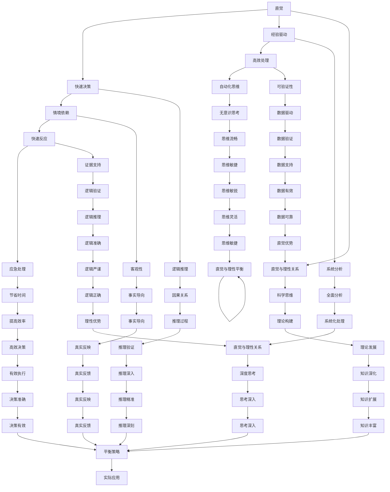

                 

### 文章标题

《直觉与理性在理解世界中的角色》

---

关键词：直觉、理性、认知、思维、理解、决策

---

摘要：本文旨在探讨直觉和理性在人类理解和认知世界过程中的角色。通过分析直觉和理性的定义、特点、关系及其在不同领域中的应用，本文揭示了这两种思维方式在决策、创新、学习和理解中的重要作用。文章通过具体案例和实际应用，探讨了如何在实际生活中更好地平衡直觉和理性，提高决策效果和认知水平。

---

### 引言

在人类认知世界的历程中，直觉和理性始终扮演着不可或缺的角色。直觉，作为一种快速、自动化的思维过程，常常被用来应对复杂环境和突发事件。理性，则是一种通过逻辑推理和系统分析来理解世界的方式。直觉和理性并非对立的两种思维模式，而是相辅相成的。本文将深入探讨这两种思维方式在理解世界中的角色，并探讨如何在实际生活中更好地平衡直觉和理性。

首先，本文将介绍直觉和理性的基本概念，包括它们的定义、特点以及它们之间的关系。接着，我们将探讨直觉思维的心理学基础，并分析理性思维在逻辑、数学模型和算法中的应用。然后，本文将讨论直觉和理性在不同领域中的应用，如科学、艺术、商业和日常生活等。在此基础上，我们将通过具体案例来展示直觉和理性在决策和创新中的实际应用。最后，本文将总结全书内容，提出对直觉和理性在理解世界中的角色的新见解，并展望未来的研究方向。

通过本文的阅读，读者将能够更深入地理解直觉和理性在认知世界中的重要性，学会如何在实际生活中更好地运用这两种思维方式，提高决策效果和认知水平。

### 直觉与理性的基本概念

在探讨直觉和理性在理解世界中的角色之前，我们首先需要明确这两种思维方式的定义和特点。

#### 直觉的定义与特点

直觉是一种快速、自动化的思维过程，它通常不需要经过有意识的思考和分析。直觉能够帮助我们在面对复杂环境和突发事件时做出迅速反应。以下是直觉的几个主要特点：

1. **快速性**：直觉能够迅速地处理大量信息，并在短时间内做出决策。
2. **自动化**：直觉是一种无意识的思维过程，它不需要我们有意识地去思考。
3. **基于经验**：直觉通常是基于个体长期积累的经验和知识，而非逻辑推理。
4. **高效性**：直觉能够在没有明确证据的情况下做出合理的判断，从而节省时间和精力。

例如，一个经验丰富的医生在面对一个不寻常的病例时，可能会依靠直觉迅速做出诊断，而无需进行详细的实验室检查。

#### 理性的定义与特点

理性则是一种通过逻辑推理和系统分析来理解世界的方式。理性思维强调证据、逻辑和客观性。以下是理性思维的几个主要特点：

1. **逻辑性**：理性思维基于逻辑原则，遵循因果关系和推理规则。
2. **系统性**：理性思维注重对问题的全面分析和系统化处理。
3. **客观性**：理性思维追求客观事实，而非主观感受或偏见。
4. **可验证性**：理性思维强调可验证性和证据支持。

例如，一个科学家在研究一种新物质时，会通过实验和数据分析来验证其假设，而不是仅凭直觉或个人喜好。

#### 直觉与理性的关系

直觉和理性并非对立的两种思维模式，而是相辅相成的。直觉和理性之间的关系可以看作是互补的：

1. **相互补充**：直觉能够在没有明确证据的情况下迅速做出决策，而理性则能够在已有证据的基础上进行深入分析和验证。
2. **动态平衡**：在实际生活中，我们需要根据具体情况和情境来动态平衡直觉和理性。例如，在紧急情况下，我们可能需要依赖直觉来迅速反应；而在做出长期决策时，则可能需要更多理性分析。

为了更直观地展示直觉和理性的关系，我们可以使用Mermaid流程图来表示：



通过上述Mermaid流程图，我们可以清晰地看到直觉和理性的定义、特点以及它们之间的关系。直觉和理性在决策、分析和理解世界方面各有优势，且能够相互补充，实现最佳效果。

### 直觉思维的心理学基础

直觉思维在人类认知过程中具有重要作用，它不仅能够帮助我们迅速应对复杂环境和突发事件，还能在许多领域（如科学、艺术和商业）中发挥关键作用。要深入理解直觉思维，我们需要探讨其心理学基础，包括直觉思维的起源、心理机制以及直觉判断的特点。

#### 直觉思维的起源与发展

直觉思维的起源可以追溯到人类的进化过程。在原始社会中，直觉帮助我们的祖先迅速判断食物的安全性、预测潜在的危险以及找到生存资源。这种快速反应机制使得人类能够在复杂多变的环境中生存下来。随着社会的发展和认知科学的进步，直觉思维逐渐被心理学研究者所关注。

现代心理学研究指出，直觉思维可能起源于大脑的早期进化，具体体现在神经系统的快速处理能力和自动化反应机制。例如，大脑中的杏仁核是一个与情绪和本能反应相关的区域，它能够在极短时间内评估情境并做出相应的反应。这种快速反应机制是直觉思维的基础。

#### 直觉思维的心理机制

直觉思维的心理机制包括感知、记忆、联想和情感等多个方面。以下是几个关键点：

1. **感知**：直觉思维依赖于大脑对信息的快速感知和处理。这种感知不仅包括外部环境的信息，还涉及个体的内部感受和情绪状态。
2. **记忆**：直觉思维往往依赖于长期记忆，即我们在日常生活中积累的经验和知识。这些经验能够帮助我们快速识别情境并做出相应的判断。
3. **联想**：直觉思维中的联想机制使我们能够将不同信息迅速联系起来，形成新的认知结构。例如，一个经验丰富的医生可能会通过观察病人的症状，迅速联想到可能的疾病。
4. **情感**：情感在直觉思维中也扮演重要角色。情感状态能够影响我们的认知过程，使我们在面对某些情境时更加敏感或谨慎。

#### 直觉判断的特点

直觉判断具有以下几个显著特点：

1. **快速性**：直觉判断通常在瞬间完成，不需要经过有意识的思考和分析。
2. **自动性**：直觉判断是一种无意识的思维过程，我们往往无法意识到自己是如何做出判断的。
3. **准确性**：尽管直觉判断不是基于逻辑推理，但它们往往具有较高的准确性。这是因为直觉判断依赖于我们在长期实践中积累的经验和知识。
4. **情境依赖**：直觉判断受到具体情境的影响，不同情境下直觉判断的准确性可能会有所不同。

#### 直觉判断的例子

以下是一些直觉判断的例子：

1. **医生诊断**：一个经验丰富的医生可能会通过观察病人的症状和体征，迅速做出准确的诊断。
2. **企业家决策**：一个成功的企业家可能会在短时间内评估市场机会和风险，做出关键的决策。
3. **直觉创造**：艺术家和作家常常依靠直觉来创作，他们的灵感往往来自于对世界和自我的深刻洞察。

通过上述分析，我们可以看到直觉思维在心理学中的基础及其在现实生活中的重要性。直觉思维不仅能够帮助我们迅速应对复杂情境，还能在科学、艺术和商业等领域中发挥关键作用。然而，我们也要意识到直觉判断的局限性和潜在风险，因此在实际应用中需要结合理性分析和证据支持，以实现最佳的决策效果。

### 理性思维的概念与逻辑原理

理性思维是人类认知过程中不可或缺的一部分，它通过逻辑推理和系统分析来帮助我们理解世界、解决问题和做出决策。理性思维强调证据、逻辑和客观性，其基本概念和原理包括逻辑原理、数学模型与公式以及核心算法原理。

#### 逻辑原理

逻辑原理是理性思维的基石，它帮助我们理解如何通过推理和证明来得出结论。以下是几个关键逻辑原理：

1. **归纳原理**：归纳推理是一种从具体实例推导出一般性结论的推理方法。例如，通过观察多个天鹅都是白色的，我们归纳出所有天鹅都是白色的。归纳原理强调从特殊到一般的思维过程。
2. **演绎原理**：演绎推理是从一般性前提推导出具体结论的推理方法。例如，如果所有天鹅都是白色的，而某只鸟是天鹅，那么我们可以演绎出这只鸟也是白色的。演绎原理强调从一般到特殊的思维过程。
3. **类比原理**：类比推理是通过比较两个或多个相似情境来推导结论的方法。例如，通过比较两种不同类型的动物的行为模式，我们可能能够推断出它们在某种情境下的行为可能相似。

逻辑原理在科学研究中具有重要意义，因为它们帮助我们建立假设、进行实验和验证结论。以下是使用伪代码形式表示的一个简单逻辑原理：

```python
# 假设与结论
if 假设1 and 假设2:
    结论1
elif 假设3 and 假设4:
    结论2
else:
    结论3
```

该伪代码展示了如何通过多个假设和结论的逻辑关系来得出最终结论。

#### 数学模型与公式

数学模型与公式是理性思维的重要组成部分，它们帮助我们量化和分析复杂问题。以下是一个简单的线性回归模型，用于预测某个变量（Y）与另一个变量（X）之间的关系：

$$
Y = a + bX + \epsilon
$$

其中，$a$ 是截距，$b$ 是斜率，$\epsilon$ 是误差项。通过收集数据并使用最小二乘法，我们可以估计模型参数 $a$ 和 $b$，从而建立数学模型。

#### 核心算法原理

在计算机科学和人工智能领域，算法原理是理性思维的重要应用。以下是一个简单的排序算法（冒泡排序）的伪代码：

```python
# 冒泡排序算法
for i in range(n-1):
    for j in range(n-i-1):
        if array[j] > array[j+1]:
            array[j], array[j+1] = array[j+1], array[j]
```

该算法通过反复比较和交换相邻元素，使数组中的元素按照特定顺序排列。这是计算机科学中常用的算法原理，其核心是逻辑推理和系统化处理。

#### 理性思维的应用

理性思维在多个领域中得到广泛应用，包括科学、工程、医学、经济学等。以下是几个应用实例：

1. **科学研究**：科学家使用理性思维建立假设、设计实验、收集数据和进行数据分析，从而得出科学结论。
2. **工程设计**：工程师使用理性思维分析结构、材料性能和力学原理，以确保工程的安全性和可靠性。
3. **医学诊断**：医生通过理性思维收集病人病史、体征和实验室数据，使用逻辑推理和医学知识进行诊断。
4. **经济学分析**：经济学家使用理性思维建立经济模型、分析市场行为和预测经济趋势。

总之，理性思维通过逻辑原理、数学模型和算法原理，帮助我们更好地理解世界、解决问题和做出决策。它在科学研究、工程设计、医学诊断和经济分析等各个领域中发挥着关键作用。通过学习和应用理性思维，我们可以提高认知水平和决策效果，更好地应对复杂的问题和挑战。

### 直觉与理性思维的例子

在科学、艺术、商业和日常生活中，直觉和理性思维都发挥着重要作用。以下通过具体例子来展示这两种思维方式的实际应用。

#### 科学领域

**例子一：物理学家约翰·巴丁的直觉**

物理学家约翰·巴丁在研究半导体材料时，凭借直觉提出了“超导”理论。尽管当时缺乏充分的实验证据，但他的直觉判断最终在后续实验中得到了验证，从而为超导物理学的发展奠定了基础。巴丁的这一发现展示了直觉思维在科学突破中的关键作用。

**例子二：生物学家罗莎琳·富兰克林的结构分析**

生物学家罗莎琳·富兰克林在研究DNA结构时，利用直觉判断和实验数据，推测出DNA的双螺旋结构。尽管她的工作在当时并未受到足够重视，但她的直觉判断和实验数据为后续的沃森和克里克揭示DNA结构提供了重要依据。这一实例表明直觉思维在科学发现中的重要性。

#### 艺术领域

**例子一：音乐家贝多芬的创作**

音乐家贝多芬在其创作生涯中，常常依靠直觉进行音乐构思和创作。他的作品《命运交响曲》和《月光奏鸣曲》等，都展示了直觉思维在艺术创作中的力量。贝多芬在创作过程中，往往能够迅速捕捉到灵感，并将其转化为动人的音乐。

**例子二：画家梵高的画作**

画家梵高在其创作生涯中，经常通过直觉来表达情感和思想。他的画作《星夜》和《向日葵》等，都展示了直觉思维在绘画艺术中的独特魅力。梵高通过直觉感知色彩和形状，创造出具有强烈情感冲击力的艺术作品。

#### 商业领域

**例子一：企业家乔布斯的直觉**

企业家史蒂夫·乔布斯凭借直觉，在苹果公司的发展过程中做出了许多关键决策。他凭借直觉判断消费者需求，推动了iPhone和iPad等创新产品的开发。乔布斯的直觉思维帮助苹果公司在激烈的市场竞争中脱颖而出。

**例子二：投资家沃伦·巴菲特的理性分析**

投资家沃伦·巴菲特则更多地依赖理性分析进行投资决策。他通过深入研究和分析公司的财务报表和市场趋势，做出投资决策。巴菲特的理性分析帮助他在长期投资中取得了显著的成功。

#### 日常生活

**例子一：司机在紧急情况下的直觉反应**

在日常生活中，司机在遇到紧急情况时，往往会依靠直觉做出迅速反应，以避免事故。例如，当一辆车突然出现在前方时，司机可能会本能地刹车或转向，以避免碰撞。

**例子二：医生在诊断过程中的直觉判断**

医生在诊断病人时，经常依靠直觉来判断病情。例如，一个经验丰富的医生可能会通过观察病人的症状和体征，迅速做出准确的诊断。

通过这些例子，我们可以看到直觉和理性思维在各个领域的实际应用。直觉和理性思维各有优势，且能够相互补充。在实际生活中，我们需要根据具体情况和情境，灵活运用直觉和理性思维，以实现最佳效果。

### 直觉与理性的案例分析

在本节中，我们将通过具体案例深入探讨直觉和理性在实际应用中的角色，分析它们在决策和创新中的影响。

#### 案例一：科学发现中的直觉作用

**案例背景**：20世纪早期，物理学家尼尔斯·玻尔在研究原子结构时，提出了量子理论。玻尔通过直觉推断，原子中的电子并不是在轨道上以固定的速度运动，而是处于某些特定能量状态。这一观点与当时的经典物理学理论相悖，但最终通过实验验证得到了证实。

**直觉作用分析**：玻尔在提出这一理论时，主要是基于他的直觉和对原子结构的深入理解。他相信，电子的行为应该符合某种量子规则，而不是经典物理学的描述。尽管这一观点在当时缺乏充分的实验证据，但玻尔的直觉判断最终被实验验证，成为量子力学的重要基础。

**理性分析**：尽管直觉在其中起到了关键作用，但玻尔的理论建立在其深厚的物理学知识和实验基础上。他通过理性分析，提出了量子理论的具体数学模型，并设计了一系列实验来验证他的理论。这种理性分析与直觉的结合，使得玻尔的科学发现更加可靠和具有说服力。

#### 案例二：艺术创作中的直觉作用

**案例背景**：荷兰画家文森特·梵高在创作《星夜》这幅画时，主要依靠直觉来表达他对星空的感受。梵高通过强烈的色彩对比和扭曲的线条，传达出他对宇宙的深刻感受。

**直觉作用分析**：梵高在创作这幅画时，没有遵循传统的绘画规则，而是通过直觉来捕捉和表达他对星空的直观感受。他的直觉使他能够超越传统艺术的表达方式，创造出独特的视觉效果。

**理性分析**：尽管梵高的创作主要依赖于直觉，但他也通过理性分析来完善他的作品。他通过反复修改和调整画面元素，确保作品的整体和谐和视觉效果。这种理性分析与直觉的结合，使得梵高的画作既具有强烈的情感表达，又具有艺术上的完整性。

#### 案例三：商业决策中的直觉作用

**案例背景**：苹果公司创始人史蒂夫·乔布斯在推出iPhone时，主要依靠直觉来判断消费者的需求和市场趋势。乔布斯凭借直觉判断，推出了这款颠覆性的产品，彻底改变了智能手机市场。

**直觉作用分析**：乔布斯在推出iPhone时，主要是基于他对消费者需求和市场趋势的直觉判断。他相信，消费者需要一款既易于使用又具有强大功能的智能手机，而传统的手机产品无法满足这一需求。

**理性分析**：尽管乔布斯的直觉判断在其中起到了关键作用，但苹果公司也通过理性分析来支持这一决策。公司进行了市场调研，收集了大量消费者反馈，并进行了大量的技术研究和开发，以确保iPhone能够实现乔布斯的直觉判断。

通过上述案例，我们可以看到直觉和理性在决策和创新中的重要作用。直觉能够帮助我们快速捕捉灵感，而理性分析则确保这些决策的可行性和可靠性。在实际应用中，我们需要灵活运用直觉和理性，以实现最佳效果。

### 直觉与理性的教育启示

在教育领域，直觉和理性的培养对于学生的全面发展具有重要意义。本文将探讨在教育中如何培养直觉和理性，并提出相关的实践建议。

#### 教育中的直觉培养

1. **鼓励自由探索**：教育者应鼓励学生进行自由探索，培养他们的好奇心和求知欲。通过开放性的问题和实验活动，学生可以在探索中发现问题的答案，从而培养直觉思维。

2. **强化实践体验**：实践是培养直觉的重要途径。教育者应设计丰富的实践活动，如实验、项目设计和团队合作，让学生在真实的情境中应用知识和技能，从而提高直觉判断能力。

3. **跨学科学习**：跨学科学习有助于学生从不同角度理解问题，培养综合思维和直觉能力。教育者可以通过跨学科课程和项目，激发学生的创造力，提高他们的直觉思维水平。

#### 理性思维的培养

1. **逻辑训练**：逻辑训练是培养理性思维的基础。教育者应通过数学、逻辑学和哲学等课程，帮助学生掌握逻辑推理的基本原理，提高他们的逻辑思维能力。

2. **批判性思维**：批判性思维强调对信息和分析的批判性评估。教育者应培养学生对信息的质疑精神，鼓励他们在分析和解决问题时，不仅要关注事实和证据，还要关注逻辑关系和论证过程。

3. **科学方法教育**：科学方法教育是培养理性思维的重要手段。教育者应通过科学实验和探究活动，帮助学生理解科学研究的基本方法，培养他们科学思考和分析问题的能力。

#### 直觉与理性教育的实践建议

1. **课程设计**：教育者应在课程设计中融入直觉和理性的培养。例如，在数学课程中，可以设计一些开放性的问题和实验，让学生通过直觉和理性思考解决实际问题。

2. **教学方法**：教育者应采用多样化的教学方法，如项目式学习、探究式学习和合作学习，激发学生的直觉思维和理性思考。

3. **评价方式**：评价方式应注重过程评价和综合评价，不仅关注学生的知识掌握情况，还要关注他们的思维能力和创新能力。

4. **家校合作**：教育者应与家长合作，共同营造有利于直觉和理性培养的家庭环境。家长可以通过日常生活中的实例和实践活动，培养孩子的直觉思维和理性思维。

通过上述教育启示和实践建议，我们可以为学生的全面发展提供有力支持，培养他们具备直觉和理性思维的素质，提高他们的认知能力和决策水平。

### 结论

本文通过探讨直觉和理性在理解世界中的角色，揭示了这两种思维方式在人类认知过程中的重要性。直觉作为一种快速、自动化的思维过程，能够在复杂环境和突发事件中迅速做出判断；而理性则通过逻辑推理和系统分析，帮助我们深入理解世界和做出科学决策。直觉和理性并非对立，而是相辅相成的。在实际应用中，我们需要根据具体情境灵活运用直觉和理性，以实现最佳效果。

未来，我们应进一步研究直觉和理性在认知过程中的具体机制，探索如何通过教育和训练提高这两种思维方式的水平。此外，跨学科的研究和方法也将有助于我们更全面地理解直觉和理性在各个领域中的作用，为科技创新和社会发展提供新的思路。

### 对直觉与理性在理解世界中的角色的新见解

通过对直觉和理性的深入探讨，我们获得了对这两种思维方式在理解世界中的角色的新见解。首先，直觉和理性并非对立的两种思维模式，而是相辅相成的。直觉能够在没有明确证据的情况下迅速做出判断，而理性则通过逻辑推理和系统分析验证直觉的合理性。这种互补关系使得直觉和理性在决策、创新和理解世界方面具有独特的优势。

其次，直觉和理性的平衡在认知过程中至关重要。在实际生活中，我们需要根据具体情境和问题类型，灵活运用直觉和理性，以实现最佳效果。例如，在紧急情况下，直觉可能更为关键，而在做出长期决策时，理性分析则更为重要。因此，如何在不同情境下动态平衡直觉和理性，成为提升认知能力的关键。

最后，教育在培养直觉和理性思维方面具有重要意义。通过鼓励自由探索、强化实践体验、跨学科学习和逻辑训练，我们可以为学生的全面发展提供支持，培养他们具备直觉和理性思维的素质。未来，进一步研究直觉和理性的具体机制，以及如何通过教育和训练提高这两种思维方式的水平，将为认知科学和人类发展提供新的方向。

### 未来研究方向与展望

未来，直觉和理性研究在认知科学、教育心理学和人工智能等领域具有广阔的发展前景。以下是几个可能的研究方向和展望：

1. **直觉与理性的神经机制**：探讨直觉和理性在人类大脑中的具体神经机制，如大脑特定区域的激活模式和相关神经递质的释放，将为深入理解直觉和理性的认知基础提供新视角。

2. **跨文化差异研究**：研究不同文化背景下直觉和理性的表现和作用，了解文化差异如何影响直觉和理性的发展及其应用，有助于制定更具有普适性的教育策略。

3. **人工智能与直觉理性融合**：将直觉和理性的特点与人工智能技术相结合，开发出能够模拟人类直觉和理性思维的智能系统，为复杂问题的求解和决策提供新方法。

4. **教育干预与培训**：通过设计和实施针对直觉和理性思维的教育干预和培训项目，探索如何有效地培养和提高个体的直觉和理性能力，从而提升整体认知水平。

5. **跨学科研究**：整合心理学、哲学、计算机科学、神经科学等领域的知识，开展跨学科研究，从多个角度深入探讨直觉和理性的本质和作用，推动相关领域的交叉发展。

通过这些研究方向和努力，我们有望进一步揭示直觉和理性在理解世界中的角色，为人类的认知发展和社会进步提供新的理论支持和实践指导。

