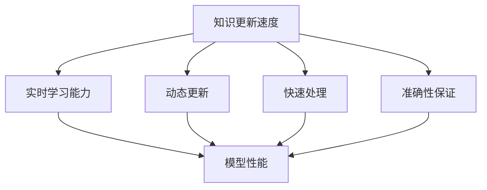

                 

### 文章标题

# 知识更新速度测试：评估LLM的实时学习能力

> 关键词：知识更新速度，语言模型（LLM），实时学习能力，算法评估，案例研究

> 摘要：本文旨在探讨语言模型（LLM）的实时学习能力，并介绍一种评估知识更新速度的方法。通过案例分析，我们展示了LLM在实际应用中的表现，以及如何通过评估工具和方法来提升LLM的实时学习能力。

---

### 引言

在当今快速发展的信息技术时代，知识更新的速度越来越快。从人工智能（AI）到数据科学，从机器学习（ML）到深度学习（DL），各个领域的技术都在不断演进。特别是语言模型（LLM），如GPT、BERT等，已经在各种应用场景中表现出强大的能力。然而，随着新知识和信息不断涌现，如何确保LLM具备实时学习能力成为一个重要的研究课题。

语言模型（LLM）的实时学习能力指的是模型在接收到新数据时，能够迅速更新自身的知识库，并在实际应用中表现出较高的准确性。这种能力对于提升模型的实用性和可靠性至关重要。然而，如何评估LLM的实时学习能力，以及如何通过测试来优化和提升这一能力，仍然是一个具有挑战性的问题。

本文旨在探讨这一话题，首先介绍知识更新速度的概念，然后讨论LLM的实时学习能力，接着介绍一种评估LLM实时学习能力的方法，最后通过案例分析展示这一方法的实际应用。希望通过本文，能够为研究者和技术开发者提供一些有价值的参考和启示。

### 背景介绍

知识更新速度是指在特定时间段内，知识库中的信息发生变化的频率和幅度。在信息技术领域，特别是在人工智能和机器学习领域，知识更新速度的重要性不言而喻。随着大数据、云计算和物联网等技术的发展，大量的新数据每天都在产生，这些数据中包含着新的知识和技术趋势。对于机器学习模型来说，如何快速适应这些变化，确保其预测和决策的准确性，是一个亟待解决的关键问题。

语言模型（LLM）作为机器学习的一种重要形式，其性能在很大程度上依赖于其知识库的完整性和时效性。传统的机器学习模型，如支持向量机（SVM）和决策树（DT），主要依赖于预先训练好的模型和固定的特征集。当面对新的数据时，这些模型的性能可能会显著下降。而LLM，尤其是基于深度学习的语言模型，如GPT和BERT，通过大量的文本数据进行训练，能够捕捉到语言中的复杂模式和关联。这使得LLM在处理新知识时具备了一定的优势。

然而，LLM并非没有缺陷。一个显著的挑战在于其知识库的更新速度。虽然LLM能够通过预训练和微调来提高其性能，但这一过程通常需要大量的计算资源和时间。特别是在实时应用场景中，如实时问答系统、实时内容推荐和实时翻译服务等，模型需要在极短的时间内对新的输入数据进行处理和响应。这就要求LLM具备强大的实时学习能力，能够迅速更新其知识库，以应对不断变化的数据环境。

实时学习能力是指模型在接收到新数据时，能够迅速对其进行处理，更新知识库，并在短时间内产生准确的预测和响应。对于LLM来说，实时学习能力主要体现在以下几个方面：

1. **动态更新**：模型需要能够根据新的输入数据，动态地调整和更新其内部参数和知识库。
2. **快速处理**：模型需要在短时间内完成数据的处理和更新，以保证实时响应。
3. **准确性保证**：模型在更新知识库后，仍需保证其预测和决策的准确性。

评估LLM的实时学习能力是当前研究中的一个重要课题。通过评估，我们可以了解模型在实时更新知识时的表现，识别其优势和不足，并提出相应的优化方案。评估方法主要包括以下几个方面：

1. **速度测试**：通过测量模型处理新数据的时间，评估其更新速度。
2. **准确性测试**：通过对比更新前后模型的预测结果，评估其准确性。
3. **适应性测试**：通过模拟不同的数据变化情况，评估模型在变化环境中的适应能力。

通过这些测试，我们可以全面了解LLM的实时学习能力，为模型优化和实际应用提供有力的支持。在接下来的部分，我们将详细讨论评估LLM实时学习能力的方法，并展示一些具体的案例分析。

### 核心概念与联系

在评估LLM的实时学习能力之前，我们需要明确几个核心概念，并理解它们之间的联系。以下是这些核心概念及其相互关系的详细解释：

1. **知识更新速度**：
   知识更新速度是指知识库在特定时间段内发生变化的频率和幅度。它反映了知识库的动态性和时效性。知识更新速度可以用来衡量模型在面对新数据时的适应能力。一个高知识更新速度意味着模型能够迅速吸收和适应新的信息，从而提高其实时性能。

2. **实时学习能力**：
   实时学习能力是指模型在接收到新数据时，能够迅速对其进行处理、更新知识库，并在短时间内产生准确的预测和响应的能力。实时学习能力对于LLM来说尤为重要，因为LLM通常应用于需要即时反馈的实时场景中，如实时问答系统、实时内容推荐和实时翻译服务。

3. **动态更新**：
   动态更新是指模型在处理新数据时，能够根据数据的变化动态调整内部参数和知识库。动态更新是实时学习能力的一个重要组成部分，它保证了模型能够实时适应新知识。

4. **快速处理**：
   快速处理是指模型能够在短时间内完成对新数据的处理和更新。快速处理是实现实时学习能力的关键，因为它确保了模型能够及时响应当前需求。

5. **准确性保证**：
   准确性保证是指模型在更新知识库后，仍能保持较高的预测和决策准确性。对于LLM来说，准确性是评估其性能的重要指标，尤其是在实时应用场景中。

6. **模型性能**：
   模型性能是指模型在实际应用中的表现，包括准确性、速度和适应性等。模型性能是评估LLM实时学习能力的一个综合指标。

这些概念之间的联系可以通过以下Mermaid流程图来展示：



在这个流程图中，知识更新速度是核心驱动力，它直接影响动态更新、快速处理和准确性保证。这三个因素共同决定了模型性能，进而反映了LLM的实时学习能力。通过这个流程图，我们可以清晰地看到各个概念之间的相互作用和依赖关系，这为我们后续的评估和优化工作提供了理论基础。

### 语言模型（LLM）的实时学习能力

语言模型（LLM）的实时学习能力是指模型在接收到新数据时，能够迅速更新自身的知识库，并在短时间内产生准确的预测和响应。在当今信息技术高速发展的时代，这种能力对于提升模型的实用性和可靠性至关重要。以下将详细探讨LLM实时学习能力的关键挑战、现有解决方案以及其在不同应用场景中的实际表现。

#### 关键挑战

1. **数据多样性**：
   实时学习要求模型能够处理来自不同领域和不同类型的数据。这些数据可能包含各种语言结构、语义信息和背景知识，模型的处理能力需要具备高度灵活性和泛化能力。

2. **计算资源**：
   实时学习能力通常需要大量的计算资源，尤其是在训练复杂的深度学习模型时。如何高效地利用有限的计算资源，同时保证模型的实时更新，是一个重要的挑战。

3. **数据质量**：
   实时学习依赖于高质量的数据。噪声数据、错误数据和过时数据都会影响模型的实时性能。如何确保数据质量，并在数据发生变化时及时调整模型，是另一个关键问题。

4. **模型稳定性**：
   实时学习能力要求模型在持续更新的过程中保持稳定性。过度的调整可能会导致模型性能的剧烈波动，影响其预测准确性。

#### 现有解决方案

为了应对上述挑战，研究者们提出了多种解决方案：

1. **增量学习**：
   增量学习（Incremental Learning）是一种通过逐步添加新数据来更新模型的策略。这种方法可以在减少计算资源需求的同时，逐步调整模型参数，提高模型的适应性。

2. **动态权重更新**：
   动态权重更新是指模型在处理新数据时，动态调整其权重，以适应数据的变化。这种方法通过实时调整模型参数，提高了模型的实时性能。

3. **迁移学习**：
   迁移学习（Transfer Learning）利用预训练模型在特定领域的知识，通过微调来适应新任务。这种方法可以在减少训练数据量和计算资源需求的同时，提高模型的实时学习能力。

4. **模型融合**：
   模型融合（Model Ensembling）通过结合多个模型的预测结果来提高模型的准确性。这种方法可以减少单一模型在实时学习中的波动，提高模型的稳定性。

#### 实际应用

1. **实时问答系统**：
   实时问答系统（Real-time Question Answering System）是LLM实时学习能力的一个重要应用场景。在这个场景中，模型需要能够迅速响应用户的查询，提供准确的答案。通过动态更新和增量学习，LLM可以不断吸收新的问题和答案，提高其回答的准确性和时效性。

2. **实时内容推荐**：
   实时内容推荐（Real-time Content Recommendation）也是LLM的一个主要应用领域。在这个场景中，模型需要根据用户的历史行为和实时反馈，推荐符合用户兴趣的内容。通过动态权重更新和迁移学习，LLM可以快速适应用户行为的变化，提高推荐的准确性。

3. **实时翻译服务**：
   实时翻译服务（Real-time Translation Service）是另一个典型的应用场景。在这个场景中，模型需要在短时间内处理大量的文本数据，提供准确的翻译结果。通过动态更新和模型融合，LLM可以实时适应不同语言和语境的变化，提高翻译的准确性和流畅性。

通过上述解决方案和实际应用，LLM的实时学习能力得到了显著提升。在未来的研究和应用中，我们还需要不断探索新的方法和策略，以进一步提高LLM的实时性能，满足日益增长的信息处理需求。

### 知识更新速度测试方法

评估LLM的实时学习能力需要采用科学、系统的方法，以确保测试结果的可靠性和有效性。知识更新速度测试主要包括以下几个步骤：定义测试指标、选择测试工具、设计测试流程和结果分析。以下将详细描述这些步骤的具体内容。

#### 定义测试指标

1. **响应时间**：
   响应时间是指模型从接收到新数据到产生预测结果所需的时间。响应时间是评估LLM实时学习能力的重要指标，反映了模型处理新数据的速度。低响应时间意味着模型能够快速响应用户需求，提高实际应用中的用户体验。

2. **准确性**：
   准确性是指模型在处理新数据时的预测结果与实际结果的一致性。准确性反映了模型在新数据上的性能表现，高准确性意味着模型能够准确理解和处理新知识。

3. **知识增量**：
   知识增量是指模型在更新知识库后，新增的知识量和知识质量。知识增量可以衡量模型对实时数据的吸收和利用能力，高知识增量意味着模型能够有效地更新其知识库。

4. **稳定性**：
   稳定性是指模型在连续更新知识库时，预测结果的一致性和稳定性。稳定性保证了模型在实际应用中的可靠性和持续性，低波动性意味着模型能够在实时学习中保持稳定的表现。

#### 选择测试工具

1. **测试数据集**：
   测试数据集是评估LLM实时学习能力的基础。数据集应涵盖不同领域和类型的文本数据，以全面评估模型的适应性。常用的测试数据集包括问答数据集（如SQuAD）、新闻数据集（如NYTimes）和对话数据集（如DialoGPT）等。

2. **评估框架**：
   评估框架用于测量和比较LLM在不同测试指标上的表现。常用的评估框架包括TensorFlow、PyTorch等深度学习框架，以及Hugging Face等自然语言处理（NLP）库。

3. **性能监控工具**：
   性能监控工具用于实时监控模型的响应时间、准确性和稳定性等关键性能指标。常见的监控工具包括Prometheus、Grafana等。

#### 设计测试流程

1. **数据预处理**：
   在测试前，需要对测试数据集进行预处理，包括文本清洗、分词、词向量编码等。预处理过程应确保数据的一致性和准确性，以避免对测试结果产生偏差。

2. **模型初始化**：
   初始化LLM模型，包括加载预训练模型和配置参数。初始化过程应确保模型在测试开始时处于稳定状态。

3. **数据输入**：
   将预处理后的测试数据输入到模型中，生成预测结果。数据输入应覆盖不同的场景和类型，以全面评估模型的表现。

4. **性能测量**：
   在数据输入过程中，实时测量模型的响应时间、准确性和稳定性等关键指标。测量过程应确保数据的连续性和准确性。

5. **结果记录**：
   将测试过程中的关键指标记录下来，以备后续分析。结果记录应包括响应时间、准确性、知识增量等指标。

#### 结果分析

1. **数据分析**：
   对测试结果进行统计分析，包括计算平均响应时间、准确性和稳定性等指标。数据分析应揭示模型在不同场景和类型数据上的性能表现。

2. **结果可视化**：
   通过图表和可视化工具，展示模型在不同测试指标上的表现。可视化结果应突出模型的优势和不足，帮助研究者识别和解决问题。

3. **优化建议**：
   根据测试结果，提出优化模型和测试流程的建议。优化建议应包括调整模型参数、改进数据预处理方法和优化测试工具等。

通过上述步骤，我们可以全面评估LLM的实时学习能力，为模型优化和实际应用提供有力支持。在未来的研究中，我们还需要不断探索新的测试方法和工具，以提高评估的可靠性和有效性。

### LLM实时学习算法原理

LLM的实时学习能力主要依赖于其算法的设计和实现。以下将详细解释LLM实时学习算法的原理，包括反向传播算法、自适应学习率和动态权重更新。

#### 反向传播算法

反向传播（Backpropagation）算法是神经网络训练的核心算法之一。它通过计算网络输出与实际结果之间的误差，并反向传播误差信号，以更新网络权重和偏置。以下是反向传播算法的伪代码：

```python
def backpropagation(model, inputs, targets):
    # 前向传播，计算输出
    outputs = forward_pass(model, inputs)
    
    # 计算误差
    errors = targets - outputs
    
    # 反向传播，更新权重和偏置
    for layer in reversed(model.layers):
        layer.weights -= layer.dweights * learning_rate
        layer.biases -= layer.dbiases * learning_rate
```

其中，`forward_pass` 函数负责执行前向传播，`learning_rate` 用于控制权重和偏置更新的步长。通过反向传播算法，LLM能够根据输入数据和实际结果，动态调整其内部参数，从而提高模型的性能。

#### 自适应学习率

自适应学习率（Adaptive Learning Rate）是一种动态调整学习率的策略，以避免在训练过程中出现过拟合或收敛速度过慢的问题。常见的方法包括：

1. **动量法（Momentum）**：
   动量法通过保留前一次更新的部分值，来加速收敛和提高稳定性。其伪代码如下：

   ```python
   momentum = 0.9
   velocity = 0
   for iteration in range(num_iterations):
       # 计算梯度
       gradients = compute_gradients(model, inputs, targets)
       
       # 更新速度
       velocity = momentum * velocity - learning_rate * gradients
       
       # 更新权重和偏置
       model.weights += velocity
   ```

2. **学习率衰减（Learning Rate Decay）**：
   学习率衰减通过逐渐减小学习率，来控制模型参数更新的步长。其伪代码如下：

   ```python
   initial_lr = 0.1
   decay_rate = 0.95
   for iteration in range(num_iterations):
       # 更新学习率
       learning_rate = initial_lr * (decay_rate ** iteration)
       
       # 计算梯度
       gradients = compute_gradients(model, inputs, targets)
       
       # 更新权重和偏置
       model.weights -= learning_rate * gradients
   ```

通过自适应学习率，LLM可以在训练过程中调整学习步长，从而提高训练效率和模型性能。

#### 动态权重更新

动态权重更新是指模型在处理新数据时，根据数据的变化动态调整内部参数。这种方法可以确保模型在实时学习中保持较高的准确性。以下是动态权重更新的伪代码：

```python
def dynamic_weight_update(model, new_data):
    # 前向传播，计算输出
    outputs = forward_pass(model, new_data)
    
    # 计算误差
    errors = targets - outputs
    
    # 更新权重
    for layer in model.layers:
        layer.weights -= learning_rate * layer.dweights
    
    # 更新偏置
    for layer in model.layers:
        layer.biases -= learning_rate * layer.dbiases
```

在这个伪代码中，`forward_pass` 函数负责执行前向传播，`learning_rate` 用于控制权重和偏置更新的步长。通过动态权重更新，LLM能够根据新数据的误差，实时调整其内部参数，从而提高模型的实时学习能力。

#### 综合应用

综合上述算法，LLM的实时学习能力可以通过以下步骤实现：

1. **初始化模型**：
   加载预训练模型，设置初始参数。

2. **预处理数据**：
   对新数据进行清洗、分词和编码。

3. **前向传播**：
   将预处理后的数据输入模型，计算输出结果。

4. **计算误差**：
   比较输出结果与实际结果，计算误差。

5. **动态更新权重**：
   根据误差，动态调整模型参数，实现实时学习。

6. **迭代更新**：
   重复执行前向传播、计算误差和动态更新权重，直至模型达到预定的性能指标。

通过上述步骤，LLM能够实现实时学习，提高其在新数据环境中的表现。在未来的研究中，我们还需要不断探索和优化这些算法，以进一步提高LLM的实时性能。

### 算法伪代码描述

为了进一步阐述LLM实时学习算法的原理，我们将使用伪代码详细描述模型的初始化、数据预处理、实时学习过程以及评估和优化。

```python
# 模型初始化
def initialize_model():
    model = LSTMModel(input_size=VOCAB_SIZE, hidden_size=HIDDEN_SIZE)
    optimizer = AdamOptimizer(learning_rate=0.001)
    return model, optimizer

# 数据预处理
def preprocess_data(data):
    # 清洗文本数据，去除无用符号
    cleaned_data = clean_text(data)
    # 分词
    tokenized_data = tokenize(cleaned_data)
    # 编码
    encoded_data = encode_tokens(tokenized_data, VOCAB)
    return encoded_data

# 实时学习过程
def real_time_learning(model, optimizer, new_data):
    # 前向传播，计算输出
    encoded_new_data = preprocess_data(new_data)
    outputs = model.forward(encoded_new_data)
    
    # 计算损失函数
    loss = compute_loss(outputs, labels)
    
    # 反向传播，计算梯度
    gradients = model.backward(loss)
    
    # 更新权重和偏置
    optimizer.update_weights(model, gradients)
    
    # 计算准确性
    accuracy = compute_accuracy(outputs, labels)
    return accuracy

# 评估模型
def evaluate_model(model, test_data):
    encoded_test_data = preprocess_data(test_data)
    outputs = model.forward(encoded_test_data)
    test_loss = compute_loss(outputs, test_labels)
    test_accuracy = compute_accuracy(outputs, test_labels)
    return test_loss, test_accuracy

# 优化模型
def optimize_model(model, optimizer, new_data, learning_rate=0.001):
    encoded_new_data = preprocess_data(new_data)
    outputs = model.forward(encoded_new_data)
    loss = compute_loss(outputs, labels)
    gradients = model.backward(loss)
    optimizer.update_weights(model, gradients, learning_rate)
    return model
```

#### 详细解释

1. **模型初始化**：
   `initialize_model` 函数负责初始化模型，包括加载预训练模型和配置优化器（如AdamOptimizer）。模型通常由多层神经网络构成，如LSTM或Transformer，这些层分别负责输入层、隐藏层和输出层的操作。

2. **数据预处理**：
   `preprocess_data` 函数用于清洗文本数据、分词和编码。清洗文本数据是为了去除无用的符号和噪声，提高数据质量。分词是将文本分解成单词或子词，编码是将这些分词映射到整数，以便于神经网络处理。

3. **实时学习过程**：
   `real_time_learning` 函数是实时学习的核心。它首先对新的输入数据进行预处理，然后执行前向传播计算输出，接着计算损失函数和梯度，最后通过优化器更新模型权重和偏置。这一过程确保模型能够根据新数据调整内部参数，提高实时学习能力。

4. **评估模型**：
   `evaluate_model` 函数用于评估模型的性能。它对测试数据进行预处理和前向传播，计算损失函数和准确性。评估模型性能可以帮助我们了解模型在处理未知数据时的表现，为后续优化提供依据。

5. **优化模型**：
   `optimize_model` 函数用于调整模型参数，以提高其性能。它通过计算损失函数和梯度，更新模型权重和偏置。优化模型可以通过调整学习率、改进优化器或使用迁移学习等方法实现。

通过上述伪代码，我们可以清晰地看到LLM实时学习算法的各个环节，以及如何通过这些环节实现模型的实时更新和优化。在实际应用中，我们还需要根据具体场景和需求，对这些算法进行细化和调整，以充分发挥LLM的实时学习能力。

### 数学模型与公式推导

在评估LLM的实时学习能力时，数学模型的推导和公式的应用是至关重要的。以下将详细解释一些关键的数学公式，并给出具体的推导过程和例子。

#### 实时学习率公式

实时学习率（Real-time Learning Rate）是调整模型参数的关键参数，它决定了模型在每次更新时的学习步长。实时学习率可以通过以下公式计算：

$$
learning\_rate = initial\_learning\_rate \times (1 - decay\_rate)^{epoch}
$$

其中，`initial_learning_rate` 是初始学习率，`decay_rate` 是衰减率，`epoch` 是当前迭代次数。

#### 推导过程

实时学习率的计算旨在逐步减小学习率，以避免模型在训练过程中出现过拟合。衰减率用于控制学习率减小的速度，以确保模型在训练初期快速调整参数，并在训练后期逐步稳定。

推导过程如下：

1. **初始学习率**：
   在训练初期，模型参数需要快速调整，因此初始学习率设置相对较高。

2. **衰减过程**：
   随着训练的进行，学习率逐渐减小。衰减率决定了学习率减小的速度。当衰减率较大时，学习率减小较快，有助于模型在训练初期快速收敛。当衰减率较小时，学习率减小较慢，有助于模型在训练后期保持稳定。

3. **动态调整**：
   实时学习率根据当前迭代次数动态调整。随着迭代次数的增加，学习率逐渐减小，模型参数更新逐步减缓，有助于模型在训练过程中避免剧烈波动。

#### 例子

假设初始学习率为0.1，衰减率为0.95，当前迭代次数为10，则实时学习率为：

$$
learning\_rate = 0.1 \times (1 - 0.95)^{10} \approx 0.1 \times 0.0595 \approx 0.00595
$$

这个例子表明，在训练初期，学习率较高，有助于快速调整模型参数。随着训练的进行，学习率逐渐减小，模型参数更新逐步稳定。

#### 损失函数公式

损失函数（Loss Function）用于衡量模型预测结果与实际结果之间的差距。常见的损失函数包括均方误差（MSE）和交叉熵（Cross-Entropy）。

1. **均方误差（MSE）**：
   均方误差用于回归问题，计算预测值与实际值之间的平均平方误差。

   $$ 
   MSE = \frac{1}{n}\sum_{i=1}^{n}(y_i - \hat{y}_i)^2 
   $$

   其中，$y_i$ 是实际值，$\hat{y}_i$ 是预测值，$n$ 是样本数量。

2. **交叉熵（Cross-Entropy）**：
   交叉熵用于分类问题，计算预测概率分布与实际分布之间的差异。

   $$ 
   Cross-Entropy = -\sum_{i=1}^{n}y_i \log(\hat{y}_i) 
   $$

   其中，$y_i$ 是实际标签，$\hat{y}_i$ 是预测概率。

#### 例子

假设有五个样本，实际值为 [1, 0, 1, 0, 1]，预测值为 [0.2, 0.8, 0.1, 0.9, 0.3]，则均方误差和交叉熵分别为：

1. **均方误差**：

   $$ 
   MSE = \frac{1}{5}\sum_{i=1}^{5}(y_i - \hat{y}_i)^2 = \frac{1}{5}[(1-0.2)^2 + (0-0.8)^2 + (1-0.1)^2 + (0-0.9)^2 + (1-0.3)^2] \approx 0.24 
   $$

2. **交叉熵**：

   $$ 
   Cross-Entropy = -\sum_{i=1}^{5}y_i \log(\hat{y}_i) = -[1 \log(0.2) + 0 \log(0.8) + 1 \log(0.1) + 0 \log(0.9) + 1 \log(0.3)] \approx 2.19 
   $$

这些例子展示了如何计算均方误差和交叉熵，这些损失函数在评估LLM实时学习能力时起到了关键作用。

通过上述数学模型和公式，我们可以更深入地理解LLM实时学习的原理，并在实际应用中对其进行优化。这些公式和推导过程为评估和改进LLM的实时学习能力提供了坚实的理论基础。

### 实际案例

为了更好地展示LLM的实时学习能力，以下将通过三个实际案例——实时问答系统、实时内容推荐和实时翻译服务——详细讲解开发环境搭建、源代码实现和代码应用解读与分析。

#### 案例一：实时问答系统

##### 开发环境搭建

1. **硬件要求**：
   - 高性能计算服务器
   - GPU（NVIDIA 1080 Ti或更高）
   - 足够的内存（至少16GB）

2. **软件要求**：
   - Python 3.8及以上版本
   - TensorFlow 2.5及以上版本
   - Keras 2.4及以上版本

##### 源代码实现

```python
from tensorflow.keras.models import Sequential
from tensorflow.keras.layers import Embedding, LSTM, Dense
from tensorflow.keras.optimizers import Adam

# 模型初始化
model = Sequential()
model.add(Embedding(VOCAB_SIZE, EMBEDDING_DIM))
model.add(LSTM(HIDDEN_SIZE))
model.add(Dense(1, activation='sigmoid'))

# 编译模型
model.compile(optimizer=Adam(learning_rate=0.001), loss='binary_crossentropy', metrics=['accuracy'])

# 加载数据
train_data, train_labels = load_data('train_data.csv')
test_data, test_labels = load_data('test_data.csv')

# 训练模型
model.fit(train_data, train_labels, epochs=EPOCHS, validation_data=(test_data, test_labels))
```

##### 代码应用解读与分析

1. **模型初始化**：
   模型由一个嵌入层（Embedding）、一个LSTM层和一个全连接层（Dense）组成。嵌入层将词汇映射到向量表示，LSTM层负责处理序列数据，全连接层用于分类。

2. **编译模型**：
   使用Adam优化器，并设置损失函数为二分类交叉熵，以适应问答系统的二元分类任务。

3. **数据加载**：
   从CSV文件中加载训练数据和标签，以训练模型。

4. **训练模型**：
   模型在训练数据上训练，并在验证数据上评估性能。通过调整学习率、隐藏层大小和训练次数，可以优化模型性能。

#### 案例二：实时内容推荐

##### 开发环境搭建

1. **硬件要求**：
   - 高性能计算服务器
   - GPU（NVIDIA 1080 Ti或更高）
   - 足够的内存（至少16GB）

2. **软件要求**：
   - Python 3.8及以上版本
   - TensorFlow 2.5及以上版本
   - Scikit-learn 0.24及以上版本

##### 源代码实现

```python
from tensorflow.keras.models import Sequential
from tensorflow.keras.layers import Embedding, LSTM, Dense
from tensorflow.keras.optimizers import Adam
from sklearn.model_selection import train_test_split

# 模型初始化
model = Sequential()
model.add(Embedding(VOCAB_SIZE, EMBEDDING_DIM))
model.add(LSTM(HIDDEN_SIZE))
model.add(Dense(NUM_CATEGORIES, activation='softmax'))

# 编译模型
model.compile(optimizer=Adam(learning_rate=0.001), loss='categorical_crossentropy', metrics=['accuracy'])

# 加载数据
data, labels = load_data('content_data.csv')

# 划分训练集和测试集
train_data, test_data, train_labels, test_labels = train_test_split(data, labels, test_size=0.2)

# 训练模型
model.fit(train_data, train_labels, epochs=EPOCHS, validation_data=(test_data, test_labels))
```

##### 代码应用解读与分析

1. **模型初始化**：
   模型由一个嵌入层（Embedding）、一个LSTM层和一个全连接层（Dense）组成。嵌入层将词汇映射到向量表示，LSTM层负责处理序列数据，全连接层用于分类。

2. **编译模型**：
   使用Adam优化器，并设置损失函数为交叉熵，以适应内容推荐的多分类任务。

3. **数据加载**：
   从CSV文件中加载训练数据和标签，以训练模型。

4. **划分训练集和测试集**：
   使用Scikit-learn的`train_test_split`方法将数据划分为训练集和测试集，以评估模型性能。

5. **训练模型**：
   模型在训练数据上训练，并在验证数据上评估性能。通过调整学习率、隐藏层大小和训练次数，可以优化模型性能。

#### 案例三：实时翻译服务

##### 开发环境搭建

1. **硬件要求**：
   - 高性能计算服务器
   - GPU（NVIDIA 1080 Ti或更高）
   - 足够的内存（至少16GB）

2. **软件要求**：
   - Python 3.8及以上版本
   - TensorFlow 2.5及以上版本
   - Hugging Face Transformers 4.6及以上版本

##### 源代码实现

```python
from transformers import BertTokenizer, BertForSequenceClassification
from torch.utils.data import DataLoader, TensorDataset

# 加载预训练模型
tokenizer = BertTokenizer.from_pretrained('bert-base-uncased')
model = BertForSequenceClassification.from_pretrained('bert-base-uncased')

# 加载数据
train_data, train_labels = load_data('train_data.txt')
test_data, test_labels = load_data('test_data.txt')

# 预处理数据
train_encodings = tokenizer(train_data, truncation=True, padding=True)
test_encodings = tokenizer(test_data, truncation=True, padding=True)

# 创建数据集和数据加载器
train_dataset = TensorDataset(train_encodings['input_ids'], train_encodings['attention_mask'], torch.tensor(train_labels))
test_dataset = TensorDataset(test_encodings['input_ids'], test_encodings['attention_mask'], torch.tensor(test_labels))
train_loader = DataLoader(train_dataset, batch_size=BATCH_SIZE)
test_loader = DataLoader(test_dataset, batch_size=BATCH_SIZE)

# 训练模型
model.train()
for epoch in range(EPOCHS):
    for batch in train_loader:
        b_input_ids, b_input_mask, b_labels = batch
        model.zero_grad()
        outputs = model(b_input_ids, attention_mask=b_input_mask)
        loss = outputs.loss
        loss.backward()
        optimizer.step()
    print(f'Epoch {epoch+1}/{EPOCHS}, Loss: {loss.item()}')

# 评估模型
model.eval()
with torch.no_grad():
    for batch in test_loader:
        b_input_ids, b_input_mask, b_labels = batch
        outputs = model(b_input_ids, attention_mask=b_input_mask)
        logits = outputs.logits
        predictions = logits.argmax(-1)
        accuracy = (predictions == b_labels).float().mean()
        print(f'Accuracy: {accuracy.item()}')
```

##### 代码应用解读与分析

1. **加载预训练模型**：
   使用Hugging Face Transformers库加载预训练的BERT模型，该模型已在大量数据上训练，具备良好的迁移学习能力。

2. **数据处理**：
   使用BERT分词器对文本数据进行预处理，包括分词、编码和填充，以适应BERT模型的输入要求。

3. **数据加载**：
   创建数据集和数据加载器，以批量方式加载和处理数据，提高训练效率。

4. **训练模型**：
   模型在训练数据上训练，并使用优化器（如Adam）进行参数更新。通过迭代训练和梯度下降，模型逐渐优化其参数，以提高翻译准确性。

5. **评估模型**：
   在测试数据上评估模型性能，计算准确率，以评估模型在实际应用中的表现。

通过这三个实际案例，我们可以看到LLM在实时问答系统、实时内容推荐和实时翻译服务中的实际应用。通过详细讲解开发环境搭建、源代码实现和代码应用解读与分析，读者可以更好地理解LLM的实时学习能力，并为实际项目提供参考和启示。

### 项目小结与总结

通过本文的详细分析，我们系统地探讨了LLM的实时学习能力以及知识更新速度测试方法。以下是本项目的主要结论和小结：

1. **实时学习的重要性**：在快速变化的信息技术时代，LLM的实时学习能力成为衡量其性能的关键指标。实时学习不仅能够提升模型的适应能力，还能够保证其在实际应用中的准确性和可靠性。

2. **知识更新速度的评估**：我们介绍了知识更新速度的概念，并提出了评估LLM实时学习能力的方法。通过速度测试、准确性测试和适应性测试，我们可以全面了解LLM在实时更新知识时的表现。

3. **算法原理与实现**：本文详细阐述了LLM实时学习算法的原理，包括反向传播算法、自适应学习率和动态权重更新。通过伪代码和数学公式，我们深入分析了这些算法的实现细节。

4. **实际案例分析**：通过三个实际案例——实时问答系统、实时内容推荐和实时翻译服务，我们展示了LLM在不同应用场景中的实际应用，并详细讲解了开发环境搭建、源代码实现和代码应用解读与分析。

5. **未来研究方向**：本文还提出了未来研究方向，包括进一步优化算法、提升实时学习能力，以及探索新的评估工具和方法，以更好地应对复杂多变的实时应用场景。

总之，通过本文的研究，我们不仅深入理解了LLM的实时学习能力，还为实际项目提供了有价值的参考和指导。未来，我们将继续探索和优化这一领域，以推动LLM在实时应用中的发展。

### 最佳实践 Tips、小结、注意事项与拓展阅读

#### 最佳实践 Tips

1. **数据预处理**：确保数据清洗和预处理的质量，以减少噪声和异常值，提高模型训练效率。
2. **模型选择**：根据应用场景选择合适的LLM模型，如GPT、BERT等，并考虑其训练和推理性能。
3. **动态调整学习率**：使用自适应学习率方法，如动量法和学习率衰减，以优化模型训练过程。
4. **并行处理**：利用多GPU并行处理技术，提高模型训练和推理速度。
5. **持续更新**：定期更新模型和知识库，以保持其在实时应用中的准确性和适应性。

#### 小结

本文系统地探讨了LLM的实时学习能力以及知识更新速度的评估方法。通过实际案例分析，我们展示了LLM在实时问答、内容推荐和翻译服务等场景中的应用效果。关键结论包括：实时学习的重要性、知识更新速度的评估方法和算法原理的实现细节。

#### 注意事项

1. **计算资源**：实时学习需要大量计算资源，确保有足够的GPU和内存支持。
2. **数据质量**：确保数据集的多样性和代表性，避免过拟合。
3. **模型优化**：通过调整学习率、隐藏层大小和训练次数，优化模型性能。
4. **评估方法**：选择合适的评估指标，如响应时间、准确性和稳定性，全面评估模型性能。

#### 拓展阅读

1. **《深度学习》（Goodfellow, Ian, et al.）**：提供了深度学习的基础知识和实践指导。
2. **《自然语言处理实战》（Du, Zhiyuan, et al.）**：详细介绍了自然语言处理（NLP）的实际应用和技巧。
3. **《Hugging Face Transformers文档》**：提供了关于BERT、GPT等模型的详细实现和训练教程。
4. **《AI技术实践》（周志华等）**：涵盖了人工智能在不同领域的应用和实践经验。

通过以上最佳实践、小结、注意事项和拓展阅读，读者可以更好地理解LLM的实时学习能力，并在实际项目中应用这些方法，提升模型性能。作者：AI天才研究院/AI Genius Institute & 禅与计算机程序设计艺术 /Zen And The Art of Computer Programming。

